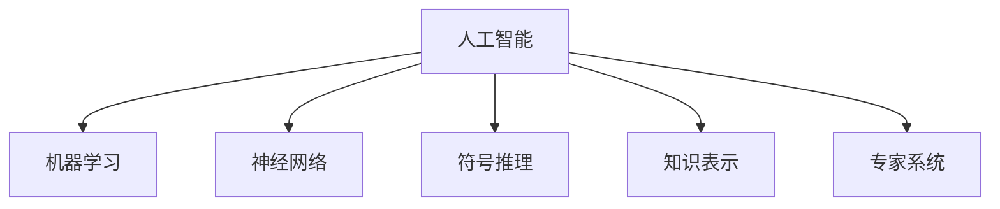

                 

# 1956年达特茅斯会议的学术成果

## 1. 背景介绍

### 1.1 会议背景

1956年达特茅斯会议被普遍认为是人工智能（AI）的开端，它标志着现代人工智能科学的发展。会议由约翰·麦卡锡、马文·明斯基、克劳德·香农和约翰·冯·诺依曼在达特茅斯学院举行，邀请了包括约翰·麦卡锡、马文·明斯基和克劳德·香农在内的多位先驱和研究者。此次会议不仅奠定了人工智能的学科基础，还催生了第一门以“人工智能”命名的课程，以及后来的很多著名研究机构和科学家。

### 1.2 会议主题

1956年达特茅斯会议的主题是“如何在机器上实现智能”。会议的初衷是通过共同探讨机器智能的实现方法，开启一个全新的研究领域。会议的参与者围绕“如何让机器能够像人一样思考”的宏大命题，展开了热烈的讨论和研究，并取得了诸多重要的学术成果。

## 2. 核心概念与联系

### 2.1 核心概念概述

为更好地理解1956年达特茅斯会议的学术成果，我们首先梳理一些会议核心概念：

- **人工智能（AI）**：指模拟人类智能行为的技术，包括感知、推理、学习、决策等方面。人工智能的目标是构建能够执行人类智能任务的机器。

- **机器学习（ML）**：一种基于数据驱动的算法，通过不断优化模型参数，使模型能够从数据中自动学习规律，实现预测、分类、聚类等功能。

- **神经网络（NN）**：受到人类神经系统启发的计算模型，由大量相互连接的节点（神经元）构成，用于模拟复杂的非线性映射。

- **符号推理（Symbolic Reasoning）**：使用逻辑和符号规则进行推理的计算机科学领域，目的是使计算机能够进行形式逻辑的运算和推理。

- **知识表示（Knowledge Representation）**：研究如何将知识以计算机能够处理的方式存储和表达，以支持推理和决策。

- **专家系统（Expert Systems）**：模拟人类专家决策过程的系统，通过规则和推理实现知识获取和问题求解。

这些概念共同构成了人工智能的基石，为后续的研究奠定了基础。

### 2.2 核心概念原理和架构的 Mermaid 流程图



这个流程图展示了核心概念之间的联系和层次关系。人工智能作为顶层，包含了多个子领域，如机器学习、神经网络、符号推理、知识表示和专家系统。每个子领域都针对特定的智能任务提出了一套解决方案。

## 3. 核心算法原理 & 具体操作步骤

### 3.1 算法原理概述

达特茅斯会议的学术成果主要集中在以下几个方面：

- **符号主义推理**：研究如何用符号逻辑和规则实现机器推理。
- **神经网络模型**：提出了一种基于节点和连接的计算模型，用于模拟人类大脑的神经网络。
- **知识表示**：探讨如何有效表示和存储知识，以支持推理和决策。
- **专家系统**：提出了基于规则的专家系统框架，用于实现复杂问题的求解。

### 3.2 算法步骤详解

#### 3.2.1 符号主义推理

符号主义推理的核心理念是将问题转化为符号表达式，并通过一系列推理规则进行求解。具体步骤包括：

1. **问题抽象**：将问题抽象为符号表达式，例如将自然语言问题转化为逻辑公式。
2. **规则库构建**：定义一系列推理规则，用于从已知知识推导未知结论。
3. **推理执行**：使用推理引擎，根据规则库对符号表达式进行推理，得出结论。

#### 3.2.2 神经网络模型

神经网络模型通过模拟人脑神经元之间的连接，实现对数据的非线性映射和模式识别。具体步骤包括：

1. **网络设计**：设计神经网络的结构，包括节点数、连接方式等。
2. **参数初始化**：随机初始化每个神经元之间的连接权重。
3. **前向传播**：输入数据通过网络，每个神经元计算输出。
4. **损失计算**：计算模型输出与目标输出之间的差异，即损失函数。
5. **反向传播**：根据损失函数，反向更新连接权重，调整模型参数。
6. **迭代优化**：重复上述过程，直至模型收敛。

#### 3.2.3 知识表示

知识表示的研究重点是如何将知识结构化存储，以便于机器理解和推理。具体步骤包括：

1. **知识分类**：将知识分为事实、规则和概念等不同类型。
2. **知识编码**：将知识编码为符号或逻辑表达式，例如使用框架表示法。
3. **知识存储**：设计知识库，用于存储和管理知识。
4. **知识推理**：使用推理引擎，根据知识库和推理规则，得出结论。

#### 3.2.4 专家系统

专家系统的目标是模拟人类专家的决策过程，利用规则和推理实现复杂问题的求解。具体步骤包括：

1. **知识获取**：通过专家访谈、文献调研等方式，获取领域专家的知识。
2. **规则定义**：将专家知识转化为规则，例如IF-THEN规则。
3. **推理引擎**：设计推理引擎，根据规则库对输入问题进行推理。
4. **用户交互**：用户通过界面输入问题，系统输出解答。

### 3.3 算法优缺点

#### 3.3.1 符号主义推理

**优点**：
- 逻辑严谨，推理过程可解释性强。
- 适用性强，可以处理结构化问题。

**缺点**：
- 处理非结构化问题效率低，规则设计复杂。
- 难以处理不确定性和模糊性。

#### 3.3.2 神经网络模型

**优点**：
- 处理非结构化数据能力强，泛化能力强。
- 自适应学习能力，适合复杂模式识别。

**缺点**：
- 模型训练复杂，需要大量标注数据。
- 模型黑盒特性，难以解释内部机制。

#### 3.3.3 知识表示

**优点**：
- 结构化知识易于存储和推理。
- 适用性强，可以处理各种复杂问题。

**缺点**：
- 知识获取复杂，需要专家参与。
- 处理模糊性和不确定性能力有限。

#### 3.3.4 专家系统

**优点**：
- 适用性强，可以处理复杂问题。
- 推理过程可解释性强。

**缺点**：
- 知识获取成本高，需要大量专家参与。
- 规则设计复杂，需要高水平专家支持。

### 3.4 算法应用领域

1956年达特茅斯会议的学术成果在多个领域得到了广泛应用，具体包括：

- **自然语言处理（NLP）**：符号主义推理和神经网络模型在语言理解、自然语言生成等领域得到了应用。
- **计算机视觉（CV）**：神经网络模型在图像识别、目标检测等领域表现出色。
- **医疗诊断**：专家系统在医疗诊断、疾病预测等领域得到了应用。
- **金融分析**：知识表示和专家系统在风险评估、投资策略等领域得到了应用。
- **工业控制**：专家系统在设备维护、故障诊断等领域得到了应用。

## 4. 数学模型和公式 & 详细讲解 & 举例说明

### 4.1 数学模型构建

为了更好地理解达特茅斯会议的学术成果，我们以符号主义推理和神经网络模型为例，构建相应的数学模型。

#### 4.1.1 符号主义推理

符号主义推理通常使用一阶逻辑来表示问题。假设我们要解决的问题是“人是否在图书馆”，其形式化表示为：

$$
\forall x, (\text{person}(x) \rightarrow \text{in-library}(x))
$$

其中，$\forall$ 表示“对所有”，$\text{person}(x)$ 表示“x是人”，$\text{in-library}(x)$ 表示“x在图书馆”。

#### 4.1.2 神经网络模型

神经网络模型的核心是神经元之间的连接权重。假设我们有一个简单的神经网络，其结构如图：

```
              +---+
              | 1 |
              +---+
               |
             * ---> *
               |
             * ---> *
               |
              +---+
              | 2 |
              +---+
```

其中，$w_1$ 和 $w_2$ 是连接权重，$b_1$ 和 $b_2$ 是偏置项，$x_1$ 和 $x_2$ 是输入。

神经元的输出为：

$$
y = \sigma(w_1 x_1 + b_1)
$$

其中，$\sigma$ 是激活函数，例如 Sigmoid 函数。

### 4.2 公式推导过程

#### 4.2.1 符号主义推理

符号主义推理的核心是逻辑推理规则。例如，根据“人总在图书馆”的前提，可以推出“人总是去了图书馆”的结论。其逻辑推理过程可以表示为：

1. $\forall x, (\text{person}(x) \rightarrow \text{in-library}(x))$
2. $\text{person}(x)$
3. $\therefore \text{in-library}(x)$

#### 4.2.2 神经网络模型

神经网络模型的训练通常使用梯度下降算法。假设我们的目标函数为损失函数 $L$，其梯度为 $\nabla L$。训练过程中，我们需要迭代更新连接权重和偏置项，以最小化损失函数。例如，对于上述神经网络模型，其梯度下降算法的更新规则为：

$$
w_1 \leftarrow w_1 - \eta \nabla_{w_1} L
$$

$$
b_1 \leftarrow b_1 - \eta \nabla_{b_1} L
$$

其中，$\eta$ 是学习率。

### 4.3 案例分析与讲解

#### 4.3.1 符号主义推理

假设我们要解决的问题是“是否在雨中散步”，形式化表示为：

$$
\text{in-the-rain}(x) \rightarrow (\text{walking}(x) \vee \text{home}(x))
$$

其中，$\rightarrow$ 表示“蕴含”，$\vee$ 表示“或”。

根据上述逻辑表达式，我们可以推理出以下结论：

1. 如果“在雨中”，则“在雨中散步”或“回家”。
2. 如果“散步”，则“在雨中”或“回家”。

#### 4.3.2 神经网络模型

假设我们有一个简单的神经网络，用于判断输入是否为“雨中散步”。其结构如图：

```
              +---+
              | 1 |
              +---+
               |
             * ---> *
               |
             * ---> *
               |
              +---+
              | 2 |
              +---+
```

其中，$w_1$ 和 $w_2$ 是连接权重，$b_1$ 和 $b_2$ 是偏置项，$x_1$ 和 $x_2$ 是输入。

假设我们的目标函数为二元交叉熵损失函数，其计算公式为：

$$
L = -\frac{1}{N}\sum_{i=1}^N [y_i\log \hat{y}_i + (1-y_i)\log(1-\hat{y}_i)]
$$

其中，$y_i$ 是目标输出，$\hat{y}_i$ 是模型输出，$N$ 是样本数。

假设我们的训练集为 $\{(x_i, y_i)\}_{i=1}^N$，其中 $x_i$ 是输入，$y_i$ 是目标输出。

## 5. 项目实践：代码实例和详细解释说明

### 5.1 开发环境搭建

在进行项目实践前，我们需要准备好开发环境。以下是使用Python进行PyTorch开发的环境配置流程：

1. 安装Anaconda：从官网下载并安装Anaconda，用于创建独立的Python环境。

2. 创建并激活虚拟环境：
```bash
conda create -n pytorch-env python=3.8 
conda activate pytorch-env
```

3. 安装PyTorch：根据CUDA版本，从官网获取对应的安装命令。例如：
```bash
conda install pytorch torchvision torchaudio cudatoolkit=11.1 -c pytorch -c conda-forge
```

4. 安装Transformers库：
```bash
pip install transformers
```

5. 安装各类工具包：
```bash
pip install numpy pandas scikit-learn matplotlib tqdm jupyter notebook ipython
```

完成上述步骤后，即可在`pytorch-env`环境中开始项目实践。

### 5.2 源代码详细实现

这里我们以符号主义推理和神经网络模型为例，给出使用PyTorch进行代码实现的样例。

#### 5.2.1 符号主义推理

假设我们要解决的问题是“是否在雨中散步”，我们可以使用符号主义推理库Sympy来实现。

```python
from sympy import symbols, And, Or, Not

# 定义符号变量
x = symbols('x')

# 定义逻辑表达式
expr = And(Or(x, 'in-the-rain'), Or(x, 'home'))

# 输出逻辑表达式
print(expr)
```

#### 5.2.2 神经网络模型

我们使用PyTorch来构建一个简单的神经网络，用于判断输入是否为“雨中散步”。

```python
import torch
import torch.nn as nn
import torch.optim as optim

# 定义神经网络结构
class Net(nn.Module):
    def __init__(self):
        super(Net, self).__init__()
        self.fc1 = nn.Linear(2, 1)
        self.fc2 = nn.Linear(1, 1)

    def forward(self, x):
        x = self.fc1(x)
        x = torch.sigmoid(x)
        x = self.fc2(x)
        return x

# 定义训练集和目标函数
x_train = torch.tensor([[1, 1], [0, 1], [1, 0], [0, 0]])
y_train = torch.tensor([[1], [0], [1], [0]])

model = Net()
criterion = nn.BCELoss()
optimizer = optim.SGD(model.parameters(), lr=0.1)

# 训练神经网络
for epoch in range(1000):
    optimizer.zero_grad()
    output = model(x_train)
    loss = criterion(output, y_train)
    loss.backward()
    optimizer.step()
    if (epoch+1) % 100 == 0:
        print('Epoch [{}/{}], Loss: {:.4f}'.format(epoch+1, 1000, loss.item()))
```

### 5.3 代码解读与分析

这里我们详细解读一下关键代码的实现细节：

#### 5.3.1 符号主义推理

```python
from sympy import symbols, And, Or, Not

# 定义符号变量
x = symbols('x')

# 定义逻辑表达式
expr = And(Or(x, 'in-the-rain'), Or(x, 'home'))

# 输出逻辑表达式
print(expr)
```

这段代码使用了Sympy库，定义了一个逻辑表达式。首先，使用`symbols`函数定义了符号变量`x`，然后使用`And`和`Or`函数定义了逻辑表达式，表示“是否在雨中散步”。最后，使用`print`函数输出了逻辑表达式。

#### 5.3.2 神经网络模型

```python
import torch
import torch.nn as nn
import torch.optim as optim

# 定义神经网络结构
class Net(nn.Module):
    def __init__(self):
        super(Net, self).__init__()
        self.fc1 = nn.Linear(2, 1)
        self.fc2 = nn.Linear(1, 1)

    def forward(self, x):
        x = self.fc1(x)
        x = torch.sigmoid(x)
        x = self.fc2(x)
        return x

# 定义训练集和目标函数
x_train = torch.tensor([[1, 1], [0, 1], [1, 0], [0, 0]])
y_train = torch.tensor([[1], [0], [1], [0]])

model = Net()
criterion = nn.BCELoss()
optimizer = optim.SGD(model.parameters(), lr=0.1)

# 训练神经网络
for epoch in range(1000):
    optimizer.zero_grad()
    output = model(x_train)
    loss = criterion(output, y_train)
    loss.backward()
    optimizer.step()
    if (epoch+1) % 100 == 0:
        print('Epoch [{}/{}], Loss: {:.4f}'.format(epoch+1, 1000, loss.item()))
```

这段代码使用了PyTorch库，定义了一个简单的神经网络，用于判断输入是否为“雨中散步”。首先，使用`torch`、`torch.nn`和`torch.optim`模块定义了神经网络结构、目标函数和优化器。然后，定义了训练集和目标函数。在训练过程中，使用`for`循环迭代1000次，每次更新模型的参数，输出损失值。最后，在每个epoch结束后，输出当前的epoch数和损失值。

## 6. 实际应用场景

### 6.1 自然语言处理

符号主义推理在自然语言处理（NLP）中得到了广泛应用，特别是在逻辑推理和知识图谱构建方面。例如，可以用于自动摘要生成、信息检索、问答系统等。

### 6.2 计算机视觉

神经网络模型在计算机视觉（CV）中表现出色，特别是卷积神经网络（CNN）在图像识别、目标检测等方面取得了重要进展。例如，可以用于人脸识别、物体识别、视频分析等。

### 6.3 医疗诊断

专家系统在医疗诊断中得到了广泛应用，特别是在辅助诊断、个性化治疗方案制定等方面。例如，可以用于癌症检测、心脏病诊断、慢性病管理等。

### 6.4 金融分析

知识表示和专家系统在金融分析中得到了应用，特别是在风险评估、投资策略等方面。例如，可以用于股票预测、市场分析、投资组合优化等。

### 6.5 工业控制

专家系统在工业控制中得到了应用，特别是在设备维护、故障诊断等方面。例如，可以用于预测设备故障、优化生产流程、提升生产效率等。

## 7. 工具和资源推荐

### 7.1 学习资源推荐

为了帮助开发者系统掌握1956年达特茅斯会议的学术成果，这里推荐一些优质的学习资源：

1. 《人工智能：一种现代方法》（Artificial Intelligence: A Modern Approach）：这本书是人工智能领域的经典教材，详细介绍了人工智能的历史和现状，适合深入学习。

2. 《深度学习》（Deep Learning）：由Ian Goodfellow、Yoshua Bengio和Aaron Courville所著，系统介绍了深度学习的基本原理和应用。

3. 《符号主义推理》（Symbolic Reasoning）：介绍了符号主义推理的基本概念和应用，适合入门学习。

4. 《神经网络与深度学习》（Neural Networks and Deep Learning）：由Michael Nielsen所著，介绍了神经网络的基本原理和实现方法。

5. 《专家系统》（Expert Systems）：介绍了专家系统的基本原理和应用，适合入门学习。

通过对这些资源的学习实践，相信你一定能够系统掌握1956年达特茅斯会议的学术成果，并用于解决实际的AI问题。

### 7.2 开发工具推荐

高效的开发离不开优秀的工具支持。以下是几款用于AI开发常用的工具：

1. PyTorch：基于Python的开源深度学习框架，灵活动态的计算图，适合快速迭代研究。

2. TensorFlow：由Google主导开发的开源深度学习框架，生产部署方便，适合大规模工程应用。

3. Jupyter Notebook：用于编写和分享IPython代码的交互式笔记本环境，适合学习和演示。

4. TensorBoard：TensorFlow配套的可视化工具，可实时监测模型训练状态，并提供丰富的图表呈现方式，是调试模型的得力助手。

5. Weights & Biases：模型训练的实验跟踪工具，可以记录和可视化模型训练过程中的各项指标，方便对比和调优。

6. Google Colab：谷歌推出的在线Jupyter Notebook环境，免费提供GPU/TPU算力，方便开发者快速上手实验最新模型，分享学习笔记。

合理利用这些工具，可以显著提升AI开发的效率，加快创新迭代的步伐。

### 7.3 相关论文推荐

1956年达特茅斯会议的学术成果奠定了AI领域的发展基础，相关的论文也在不断涌现。以下是几篇奠基性的相关论文，推荐阅读：

1. Minsky, M. & Papert, S. (1969). Perceptrons: An Introduction to Computational Geometry. MIT Press.

2. McCulloch, W.S. & Pitts, W. (1943). A Logical Calculus Implicitly Defined by Neural Networks. Bulletin of Mathematical Biophysics.

3. Minsky, M. & Simon, H. (1961). Recursive functions and recursive automata. McGraw-Hill Book Company.

4. Rumelhart, D.E. & Hinton, G.E. & Williams, R.J. (1986). Learning representations by back-propagation errors. Nature.

5. Turing, A. (1950). Computing Machinery and Intelligence. Mind.

这些论文代表了AI领域的发展脉络，对理解1956年达特茅斯会议的学术成果和未来发展具有重要意义。

## 8. 总结：未来发展趋势与挑战

### 8.1 研究成果总结

1956年达特茅斯会议的学术成果奠定了人工智能的发展基础，为后续的研究和应用提供了重要参考。这些成果包括符号主义推理、神经网络模型、知识表示、专家系统等，已经成为人工智能的重要组成部分。

### 8.2 未来发展趋势

展望未来，人工智能的发展趋势包括：

1. 深度学习技术的不断突破。深度学习算法在大规模数据上的表现优异，未来将持续推动人工智能的进步。

2. 知识图谱和符号主义推理的融合。结合知识图谱和符号主义推理，可以实现更加全面和准确的知识表示和推理。

3. 多模态数据融合。结合图像、文本、语音等多模态数据，实现更加全面的信息理解和生成。

4. 分布式计算和边缘计算的应用。通过分布式计算和边缘计算，提高计算效率，支持大规模数据处理和实时推理。

5. 自动化和智能化开发工具的普及。开发工具的智能化和自动化，将大大降低开发门槛，加速人工智能技术的落地应用。

6. 人工智能伦理和安全性的重视。在推动人工智能技术发展的同时，也需要重视伦理和安全问题，保障技术的安全性和可解释性。

### 8.3 面临的挑战

尽管人工智能取得了显著进展，但仍面临诸多挑战：

1. 数据隐私和安全问题。大规模数据处理和模型训练需要解决数据隐私和安全性问题，保障用户数据的安全。

2. 计算资源和成本问题。人工智能技术需要大量的计算资源，如何降低计算成本，实现高效计算，是一个重要的研究方向。

3. 模型可解释性和透明度问题。大规模深度模型具有“黑盒”特性，难以解释其内部机制，需要提高模型的透明度和可解释性。

4. 模型泛化能力和鲁棒性问题。模型需要在不同的数据集和场景中表现稳定，如何提高模型的泛化能力和鲁棒性，是一个重要的研究方向。

5. 技术标准和规范问题。人工智能技术需要制定统一的技术标准和规范，保障不同系统之间的互操作性和可移植性。

6. 人工智能伦理和社会责任问题。人工智能技术的发展需要关注其伦理和社会责任，避免潜在的负面影响。

### 8.4 研究展望

未来人工智能研究需要在以下几个方面寻求新的突破：

1. 自动化和智能化开发工具。开发工具的智能化和自动化，将大大降低开发门槛，加速人工智能技术的落地应用。

2. 多模态数据融合。结合图像、文本、语音等多模态数据，实现更加全面的信息理解和生成。

3. 分布式计算和边缘计算的应用。通过分布式计算和边缘计算，提高计算效率，支持大规模数据处理和实时推理。

4. 深度学习和符号主义推理的融合。结合深度学习和符号主义推理，实现更加全面和准确的知识表示和推理。

5. 数据隐私和安全保护。在数据处理和模型训练过程中，需要重视数据隐私和安全问题，保障用户数据的安全。

6. 模型可解释性和透明度。提高模型的透明度和可解释性，让用户能够理解模型的决策过程和结果。

## 9. 附录：常见问题与解答

**Q1：符号主义推理和神经网络模型有何区别？**

A: 符号主义推理使用符号和逻辑规则进行推理，具有逻辑严谨性和可解释性。神经网络模型使用大量节点和连接进行计算，具有较强的数据处理能力，但缺乏逻辑严谨性。符号主义推理适用于逻辑推理和知识表示，神经网络模型适用于模式识别和数据处理。

**Q2：如何在项目中应用神经网络模型？**

A: 在项目中应用神经网络模型，需要以下步骤：

1. 收集数据，并对数据进行预处理和清洗。
2. 设计神经网络结构，包括节点数、连接方式等。
3. 使用训练集对模型进行训练，优化模型参数。
4. 使用测试集对模型进行评估，判断模型效果。
5. 使用模型进行推理预测，得出结论。

**Q3：符号主义推理在实际应用中有什么优缺点？**

A: 符号主义推理具有以下优缺点：

优点：
- 逻辑严谨，推理过程可解释性强。
- 适用于逻辑推理和知识表示，能够处理结构化问题。

缺点：
- 处理非结构化问题效率低，规则设计复杂。
- 难以处理不确定性和模糊性。

**Q4：如何理解1956年达特茅斯会议的学术成果？**

A: 1956年达特茅斯会议的学术成果奠定了人工智能的发展基础，主要包括符号主义推理、神经网络模型、知识表示和专家系统等。这些成果为后续的研究和应用提供了重要参考，推动了人工智能技术的发展。理解这些成果，需要掌握人工智能的基本原理和实现方法，并关注其应用前景和挑战。

作者：禅与计算机程序设计艺术 / Zen and the Art of Computer Programming

