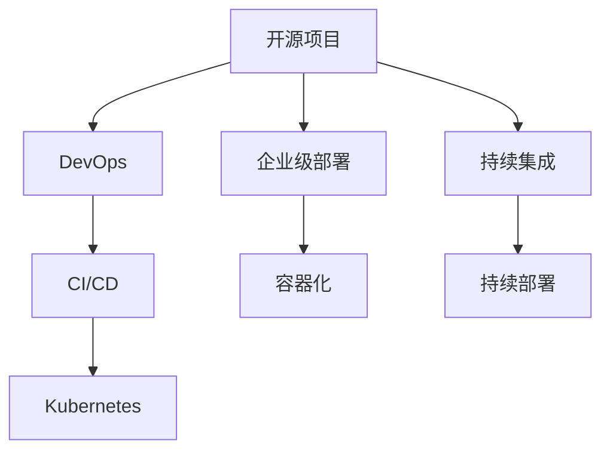

                 

## 1. 背景介绍

### 1.1 问题由来
近年来，开源项目在企业中的应用越来越广泛，从软件开发到数据分析，再到人工智能，开源项目以其灵活、高效、低成本的特性，成为企业信息化建设的重要工具。然而，开源项目在企业级部署和使用上仍面临诸多挑战，如版本管理、环境配置、性能优化、安全监控等，这些问题直接影响了企业的软件质量和生产效率。

### 1.2 问题核心关键点
为了更好地解决企业级开源项目部署中的问题，本文聚焦于开源项目的企业级部署服务，探讨如何通过系统化的管理、优化和监控手段，提升开源项目的价值和应用效率。通过这些服务，企业能够更快速、稳定地部署和管理开源项目，加速业务迭代，创造更高的价值。

### 1.3 问题研究意义
研究开源项目的企业级部署服务，对于拓展企业对开源技术的应用，提升软件质量和开发效率，降低软件维护成本，具有重要意义：

1. 降低应用开发成本。开源项目可以大大降低企业自主研发的开销，提升开发速度，缩短项目周期。
2. 提高软件质量和稳定性。通过标准化的部署流程和监控手段，企业能够确保开源项目的高可用性和稳定性，降低故障发生率。
3. 增强生产效率。部署服务能够自动化大部分繁琐的配置和部署任务，使开发者能够将更多精力投入到业务逻辑开发上。
4. 保障数据安全和合规性。通过安全监控和合规审计，企业能够保障数据安全和符合法规要求，避免潜在风险。
5. 促进技术创新。企业可以借助开源项目，快速接入前沿技术，实现技术迭代和创新。

## 2. 核心概念与联系

### 2.1 核心概念概述

为更好地理解开源项目的企业级部署服务，本节将介绍几个密切相关的核心概念：

- 开源项目(Open Source Project)：指在开源许可下，软件代码、文档、工具等资源的共享和贡献。开源项目通过社区协作，不断迭代和优化。

- 企业级部署(Enterprise Deployment)：指将开源项目在企业内部环境中部署和使用，并结合企业的业务需求进行优化和定制化的过程。企业级部署关注项目的稳定性、可扩展性和合规性。

- DevOps：一种开发、运维和部署并行的软件开发模式。通过持续集成、持续部署等技术，实现高效的自动化和流水线管理，提升软件交付速度和质量。

- CI/CD：连续集成(Continuous Integration)和持续部署(Continuous Deployment)的合称。CI/CD通过自动化测试、部署和监控，加速软件发布周期，提升开发效率。

- Kubernetes：一个开源的容器编排系统，提供自动化部署、扩展、管理等运维功能，广泛应用于云原生应用场景。

- 容器化(Containerization)：通过容器技术将应用打包成独立运行的单元，实现跨平台、高可移植性的部署。

这些核心概念之间的逻辑关系可以通过以下Mermaid流程图来展示：

这个流程图展示了大语言模型的核心概念及其之间的关系：

1. 开源项目通过DevOps和CI/CD技术进行持续集成和持续部署，实现快速迭代和交付。
2. 企业级部署服务对开源项目进行标准化的管理、优化和监控，确保其在企业环境中的稳定性和合规性。
3. 容器化和Kubernetes技术是实现企业级部署的关键工具，提供了高效、灵活的部署和运维解决方案。
4. 持续集成和持续部署技术进一步加速了项目的迭代和交付，使开源项目能够快速适应业务需求的变化。

## 3. 核心算法原理 & 具体操作步骤
### 3.1 算法原理概述

开源项目的企业级部署服务，本质上是一个持续集成、持续部署和持续监控的自动化流程。其核心思想是：通过自动化工具和标准化的流程，确保开源项目在企业环境中的快速、稳定和高效部署，同时实现持续的监控和优化。

形式化地，假设开源项目为 $P$，部署环境为 $E$，持续监控工具为 $M$。企业级部署的目标是找到最优的部署策略 $\pi$，使得：

$$
\pi=\mathop{\arg\min}_{\pi} \mathcal{L}(P,E,\pi)
$$

其中 $\mathcal{L}$ 为损失函数，衡量在部署策略 $\pi$ 下，开源项目 $P$ 在企业环境 $E$ 中的性能和稳定性。常见的损失函数包括部署时间、系统资源消耗、故障率等。

通过梯度下降等优化算法，企业级部署过程不断更新部署策略 $\pi$，最小化损失函数 $\mathcal{L}$，使得开源项目在企业环境中的部署和使用效果最优。

### 3.2 算法步骤详解

开源项目的企业级部署服务一般包括以下几个关键步骤：

**Step 1: 环境准备和配置**
- 确定企业环境中的服务器、存储和网络资源，以及相关的运维团队。
- 安装和配置必要的软件和工具，如操作系统、数据库、容器引擎等。

**Step 2: 容器化和打包**
- 使用容器技术将开源项目打包成独立的容器镜像。
- 根据企业需求，定制化容器镜像，添加必要的依赖和环境变量。

**Step 3: 持续集成和持续部署**
- 在持续集成平台(CI)上配置自动化测试流程，自动构建和测试容器镜像。
- 在持续部署平台(CD)上配置自动化部署流程，自动将通过测试的容器镜像部署到目标服务器。

**Step 4: 持续监控和优化**
- 在持续监控工具上配置监控规则和告警策略，实时监测开源项目在企业环境中的运行状态。
- 根据监控结果，自动触发优化任务，如重启服务、扩展资源等，保障系统的稳定性和性能。

**Step 5: 安全合规和审计**
- 使用安全扫描工具对容器镜像和应用代码进行安全漏洞检测。
- 定期进行合规审计，确保开源项目的部署和使用符合企业安全和合规要求。

以上是企业级开源项目部署的一般流程。在实际应用中，还需要针对具体项目和环境，对各个环节进行优化设计，如引入自动化测试工具、优化CI/CD流水线、优化监控指标等，以进一步提升部署效率和系统性能。

### 3.3 算法优缺点

开源项目的企业级部署服务具有以下优点：
1. 提升部署效率。通过自动化工具和流程，大大缩短了项目部署和交付时间，提升了生产效率。
2. 提高系统稳定性和可靠性。通过持续监控和优化，及时发现和解决问题，保障系统的高可用性和稳定性。
3. 降低运维成本。通过自动化运维和标准化流程，减少了人工干预和错误发生率，降低了运维成本。
4. 促进技术创新和迭代。通过持续集成和持续部署，企业能够快速接入和验证新技术，加速技术迭代。
5. 支持跨平台部署。容器化技术使开源项目能够轻松部署到不同的平台和环境中。

同时，该服务也存在一定的局限性：
1. 对企业环境要求高。部署和监控服务需要企业具备相应的硬件和软件基础设施，以及运维团队的支持。
2. 技术复杂度高。需要掌握DevOps、CI/CD、容器化、Kubernetes等技术，对技术栈要求较高。
3. 依赖开源社区。开源项目需要依赖开源社区的持续维护和更新，社区支持不足会影响项目稳定性和性能。
4. 安全风险存在。尽管持续监控和合规审计可以降低风险，但仍需时刻警惕安全漏洞和恶意攻击。

尽管存在这些局限性，但就目前而言，企业级开源项目部署服务仍是软件开发和运维的重要范式。未来相关研究的重点在于如何进一步降低部署复杂度，提高部署灵活性和可移植性，同时兼顾安全和合规性等因素。

### 3.4 算法应用领域

开源项目的企业级部署服务在软件开发、数据分析、人工智能等领域都有广泛应用，例如：

- 软件开发：通过企业级部署服务，企业可以高效地构建和部署应用，加速软件开发周期。
- 数据分析：数据科学家可以利用开源数据分析工具，快速构建和部署数据分析模型，实现数据驱动的业务决策。
- 人工智能：AI工程师可以利用开源AI框架，快速构建和部署机器学习模型，推动AI技术在企业中的应用。

除了上述这些经典应用外，开源项目的企业级部署服务还被创新性地应用到更多场景中，如云原生应用、DevOps自动化、微服务架构等，为软件开发和运维带来了新的技术突破。随着企业级开源项目的持续演进，相信企业级部署服务必将在更多领域大放异彩。

## 4. 数学模型和公式 & 详细讲解  
### 4.1 数学模型构建

本节将使用数学语言对开源项目的企业级部署服务进行更加严格的刻画。

记开源项目为 $P$，部署环境为 $E$，持续监控工具为 $M$。假设企业的目标是通过最小化损失函数 $\mathcal{L}$，确保开源项目 $P$ 在环境 $E$ 中的性能和稳定性。

定义企业级部署的目标函数为：

$$
\mathcal{L}(P,E,\pi) = \alpha \cdot \text{Deployment Time} + \beta \cdot \text{Resource Consumption} + \gamma \cdot \text{Fault Rate}
$$

其中 $\alpha, \beta, \gamma$ 为损失函数的权重系数，可以根据企业需求进行调整。部署时间、资源消耗和故障率等指标，可以通过监控工具 $M$ 实时获取。

### 4.2 公式推导过程

以下我们以一个简单的例子，推导损失函数 $\mathcal{L}$ 的计算公式。

假设开源项目 $P$ 在环境 $E$ 中的部署时间为 $T$，资源消耗为 $C$，故障率为 $F$。则目标函数可以简化为：

$$
\mathcal{L}(P,E,\pi) = \lambda_1 \cdot T + \lambda_2 \cdot C + \lambda_3 \cdot F
$$

其中 $\lambda_1, \lambda_2, \lambda_3$ 为损失函数的权重系数。

根据梯度下降算法，目标函数 $\mathcal{L}$ 对部署策略 $\pi$ 的梯度为：

$$
\frac{\partial \mathcal{L}(P,E,\pi)}{\partial \pi} = \lambda_1 \cdot \frac{\partial T}{\partial \pi} + \lambda_2 \cdot \frac{\partial C}{\partial \pi} + \lambda_3 \cdot \frac{\partial F}{\partial \pi}
$$

其中 $\frac{\partial T}{\partial \pi}$、$\frac{\partial C}{\partial \pi}$ 和 $\frac{\partial F}{\partial \pi}$ 分别表示部署时间、资源消耗和故障率对部署策略 $\pi$ 的导数。

通过求解上述优化问题，便可以得到最优的部署策略 $\pi^*$。

### 4.3 案例分析与讲解

为了更直观地理解上述公式，我们可以假设一个简单的场景：

假设企业部署一个基于Kubernetes的Web应用，使用Docker容器。我们希望在部署过程中最小化部署时间、资源消耗和故障率。假设部署时间为 $T$，资源消耗为 $C$，故障率为 $F$。

在实际部署中，我们可以通过监控工具实时获取这些指标。以Kubernetes为例，通过kubectl等命令，可以实时获取容器运行状态和资源消耗数据。通过这些数据，我们可以计算出每个指标对损失函数的贡献度。

例如，如果我们认为部署时间是影响系统性能的关键因素，可以设置 $\lambda_1 = 0.7$，$\lambda_2 = 0.2$，$\lambda_3 = 0.1$。则目标函数可以表示为：

$$
\mathcal{L}(P,E,\pi) = 0.7 \cdot T + 0.2 \cdot C + 0.1 \cdot F
$$

根据实际的部署情况，我们可以使用梯度下降算法，不断更新部署策略 $\pi$，最小化损失函数 $\mathcal{L}$，最终得到最优的部署方案。

## 5. 项目实践：代码实例和详细解释说明
### 5.1 开发环境搭建

在进行企业级开源项目部署服务开发前，我们需要准备好开发环境。以下是使用Python进行Kubernetes和Docker开发的环境配置流程：

1. 安装Kubernetes：从官网下载并安装Kubernetes，确保集群环境稳定运行。

2. 安装Docker：从官网下载并安装Docker，并配置好Docker服务。

3. 配置持续集成和持续部署工具：
- Jenkins：配置CI/CD流水线，实现自动化测试和部署。
- GitHub Actions：集成GitHub和CI/CD平台，实现代码提交后的自动构建和部署。

4. 安装安全监控工具：
- ELK Stack：安装Elasticsearch、Logstash、Kibana，实现日志收集、分析和可视化。
- Prometheus：安装Prometheus，实现应用监控和告警。

完成上述步骤后，即可在Kubernetes集群上搭建企业级开源项目部署服务。

### 5.2 源代码详细实现

这里我们以一个简单的Web应用为例，使用Kubernetes和Docker技术，实现其企业级部署服务。

**Step 1: 环境准备和配置**

- 搭建Kubernetes集群，并确保所有节点可以互相通信。
- 配置Docker镜像仓库，并确保可以下载和上传Docker镜像。

**Step 2: 容器化和打包**

- 编写Dockerfile，配置Web应用的依赖和环境。
- 使用Docker build命令，构建Docker镜像。

**Step 3: 持续集成和持续部署**

- 在Jenkins上配置CI/CD流水线，自动构建Docker镜像，并将其推送到镜像仓库。
- 在Kubernetes上配置Deployment和Service，自动部署应用。

**Step 4: 持续监控和优化**

- 在ELK Stack上配置日志收集和分析规则，实时监控Web应用运行状态。
- 在Prometheus上配置应用监控指标，并设置告警策略。

**Step 5: 安全合规和审计**

- 使用安全扫描工具，对Docker镜像进行安全漏洞检测。
- 定期进行合规审计，确保应用符合企业安全和合规要求。

以上是使用Kubernetes和Docker实现企业级开源项目部署服务的基本流程。通过这个例子，可以看到，企业级部署服务可以显著提升Web应用的生产效率和稳定性，同时保障系统的安全性和合规性。

### 5.3 代码解读与分析

让我们再详细解读一下关键代码的实现细节：

**Dockerfile:**
- 定义应用依赖和环境。
- 设置暴露的端口和服务启动命令。

**Jenkinsfile:**
- 配置CI/CD流水线，定义自动化构建和部署步骤。

**Kubernetes Deployment和Service:**
- 配置应用容器和运行条件。
- 定义服务暴露的端口和负载均衡策略。

**ELK Stack配置:**
- 定义日志收集规则，将应用日志发送到Elasticsearch。
- 使用Kibana进行日志分析和可视化。

**Prometheus配置:**
- 定义应用监控指标，并设置告警策略。

这些配置文件和工具可以灵活组合，实现不同开源项目的部署和监控。

## 6. 实际应用场景
### 6.1 软件开发

企业级开源项目部署服务在软件开发中得到了广泛应用。传统软件开发模式中，代码审查、构建、测试、部署等环节耗时长、易出错，开发效率低下。通过企业级部署服务，可以实现自动化和流水线管理，大大提升开发效率和软件质量。

例如，一个开发团队可以使用CI/CD流水线，实现代码提交后的自动化构建、测试和部署。每次提交代码时，系统自动执行测试流程，发现和修复代码缺陷，并自动部署到生产环境。通过持续集成和持续部署，团队可以不断迭代和优化软件，快速交付高质量的软件产品。

### 6.2 数据分析

在数据分析领域，企业级开源项目部署服务也发挥了重要作用。数据分析师可以利用开源数据分析工具，如Spark、Hadoop等，快速构建和部署数据分析模型，实现数据驱动的业务决策。

例如，一个数据科学团队可以使用Kubernetes部署Spark集群，实现大数据分析和实时数据处理。通过持续监控和优化，团队可以实时监控数据处理性能和系统稳定性，确保分析结果的准确性和可靠性。

### 6.3 人工智能

在人工智能领域，企业级开源项目部署服务同样具有重要价值。AI工程师可以利用开源AI框架，如TensorFlow、PyTorch等，快速构建和部署机器学习模型，推动AI技术在企业中的应用。

例如，一个AI团队可以使用Kubernetes部署TensorFlow模型，实现机器学习算法的训练和推理。通过持续监控和优化，团队可以实时监控模型性能和系统资源消耗，确保算法的稳定性和准确性。

### 6.4 未来应用展望

随着开源项目和企业级部署服务的不断发展，未来将会有更多的应用场景涌现，为企业的数字化转型升级提供新的技术动力。

在智慧医疗领域，企业级开源项目部署服务可以帮助医疗机构构建高效、稳定的电子病历系统，提升医疗服务质量和效率。

在智能制造领域，通过企业级部署服务，可以实现设备和系统的数字化改造，提升生产自动化和智能化水平，提高企业竞争力。

在智慧城市治理中，企业级开源项目部署服务可以帮助政府实现城市运行数据的实时监控和分析，提升城市管理水平，构建更安全、高效的未来城市。

此外，在金融、教育、交通等众多领域，企业级开源项目部署服务也将不断涌现，为传统行业数字化转型升级提供新的技术路径。相信随着技术的不断成熟，企业级开源项目部署服务必将在构建人机协同的智能时代中扮演越来越重要的角色。

## 7. 工具和资源推荐
### 7.1 学习资源推荐

为了帮助开发者系统掌握开源项目的企业级部署服务的技术基础和实践技巧，这里推荐一些优质的学习资源：

1. Kubernetes官方文档：提供详尽的Kubernetes架构和操作指南，是企业级部署服务开发的必备资料。

2. Docker官方文档：提供Docker容器技术的基本概念和操作指南，是企业级部署服务开发的必备资料。

3. DevOps系列书籍：介绍DevOps、CI/CD、容器化等技术，系统学习企业级部署服务开发的理论基础。

4. Cloud Native Computing Foundation(CNCF)文档：提供云原生技术的架构和实践指南，涵盖Kubernetes、Docker等工具的使用和部署。

5. Jenkins官方文档：提供CI/CD流水线的配置和管理操作指南，是企业级部署服务开发的必备工具。

6. ELK Stack官方文档：提供日志收集、分析和可视化操作指南，是企业级部署服务监控的必备工具。

通过学习这些资源，相信你一定能够快速掌握企业级开源项目部署服务的精髓，并用于解决实际的业务问题。

### 7.2 开发工具推荐

高效的开发离不开优秀的工具支持。以下是几款用于企业级开源项目部署服务开发的常用工具：

1. Jenkins：开源的自动化集成工具，支持CI/CD流水线管理，自动化测试和部署。

2. GitHub Actions：GitHub提供的CI/CD平台，集成GitHub和CI/CD工具，实现代码提交后的自动构建和部署。

3. Kubernetes：开源的容器编排系统，提供自动化部署、扩展、管理等运维功能。

4. Docker：开源的容器引擎，提供轻量级、可移植的容器化部署方式。

5. ELK Stack：Elasticsearch、Logstash、Kibana等工具的合集，提供日志收集、分析和可视化功能。

6. Prometheus：开源的监控系统，提供应用监控和告警功能。

合理利用这些工具，可以显著提升企业级开源项目部署服务的开发效率，加快创新迭代的步伐。

### 7.3 相关论文推荐

企业级开源项目部署服务的研究源于学界的持续探索。以下是几篇奠基性的相关论文，推荐阅读：

1. Kubernetes: Container Orchestration for Generalized Large-Scale System Management：介绍Kubernetes的架构和功能，为企业级部署服务提供重要参考。

2. CI/CD：Continuous Integration and Continuous Deployment for Distributed Systems：探讨CI/CD技术的基本原理和实现方法，是企业级部署服务开发的理论基础。

3. The Docker Manifesto：Docker的创始人在其博客中提出的容器技术原则，为企业级部署服务提供重要指导。

4. Cloud-Native Computing Foundation：介绍云原生技术的定义和原则，涵盖Kubernetes、Docker等工具的使用和部署。

5. The Unified Metrics for Kubernetes：介绍Kubernetes的指标收集和可视化工具，为企业级部署服务的监控提供重要参考。

这些论文代表了大语言模型微调技术的发展脉络。通过学习这些前沿成果，可以帮助研究者把握学科前进方向，激发更多的创新灵感。

## 8. 总结：未来发展趋势与挑战

### 8.1 总结

本文对开源项目的企业级部署服务进行了全面系统的介绍。首先阐述了开源项目和企业级部署服务的研究背景和意义，明确了企业级部署服务在提升软件质量和开发效率方面的独特价值。其次，从原理到实践，详细讲解了企业级部署服务的数学模型和关键步骤，给出了企业级部署服务开发的完整代码实例。同时，本文还广泛探讨了企业级部署服务在软件开发、数据分析、人工智能等多个领域的应用前景，展示了企业级部署服务的巨大潜力。此外，本文精选了企业级部署服务的各类学习资源，力求为读者提供全方位的技术指引。

通过本文的系统梳理，可以看到，开源项目的企业级部署服务正在成为软件开发和运维的重要范式，极大地提升了开源项目的应用效率和系统稳定性。未来，伴随开源社区的持续演进和企业级部署服务的不断优化，企业能够更快速、稳定地部署和管理开源项目，加速业务迭代，创造更高的价值。

### 8.2 未来发展趋势

展望未来，开源项目的企业级部署服务将呈现以下几个发展趋势：

1. 容器化技术普及。随着容器化技术的广泛应用，越来越多的企业将采用容器化方式部署和管理应用，实现高效、灵活的部署和运维。

2. 云原生技术发展。云原生技术如Kubernetes、Docker等，正在成为企业级部署服务的主流选择，未来将有更多企业采用云原生架构，提升应用的可移植性和可扩展性。

3. DevOps文化普及。DevOps文化倡导持续集成和持续部署，将开发、测试和运维过程紧密结合，提升软件交付速度和质量。

4. 安全合规要求提高。企业级部署服务将更加重视安全和合规问题，采用先进的安全监控和审计技术，确保应用的稳定性和安全性。

5. 自动化程度提升。随着自动化技术的发展，企业级部署服务将进一步自动化、智能化，减少人工干预和错误发生率，提升生产效率。

以上趋势凸显了企业级开源项目部署技术的广阔前景。这些方向的探索发展，必将进一步提升企业级部署服务的效率和质量，为企业的数字化转型升级提供新的技术动力。

### 8.3 面临的挑战

尽管企业级开源项目部署服务已经取得了显著进展，但在迈向更加智能化、普适化应用的过程中，它仍面临诸多挑战：

1. 技术门槛高。企业级部署服务需要掌握DevOps、CI/CD、容器化、Kubernetes等技术，对技术栈要求较高。

2. 资源消耗高。容器化技术虽然提高了应用的灵活性，但同时也带来了较高的资源消耗，需要合理配置和管理资源。

3. 社区支持不足。开源社区的持续维护和更新对企业级部署服务的稳定性和性能有重要影响，需要企业具备一定的社区运营能力。

4. 安全和合规风险。企业级部署服务需要确保应用的稳定性和安全性，防止潜在的安全漏洞和恶意攻击。

5. 技术复杂度高。企业级部署服务需要综合考虑应用的需求和特点，灵活配置和管理资源，实现高效的部署和运维。

正视企业级开源项目部署服务面临的这些挑战，积极应对并寻求突破，将是大规模应用落地的关键。相信随着技术的不断成熟和社区的支持，这些挑战终将一一被克服，企业级开源项目部署服务必将在构建人机协同的智能时代中扮演越来越重要的角色。

### 8.4 研究展望

面对企业级开源项目部署服务所面临的挑战，未来的研究需要在以下几个方面寻求新的突破：

1. 自动化优化工具开发。开发更加自动化、智能化的优化工具，帮助企业更高效地管理和优化应用。

2. 多云平台支持。支持多种云平台和容器编排系统，实现应用的跨平台部署和运维。

3. 安全合规技术融合。将安全和合规技术融合到企业级部署服务中，实现应用的安全和合规管理。

4. 多层次监控和告警。引入多层次监控和告警系统，全面覆盖应用的运行状态和性能指标，提升系统的稳定性和可靠性。

5. 企业级DevOps框架开发。开发企业级DevOps框架，实现应用的自动化和流水线管理，提升生产效率和软件质量。

这些研究方向将进一步推动企业级开源项目部署服务的发展，为企业的数字化转型升级提供新的技术路径。总之，企业级开源项目部署服务需要不断优化和创新，才能满足企业不断变化的需求，实现高质量的软件生产和应用。

