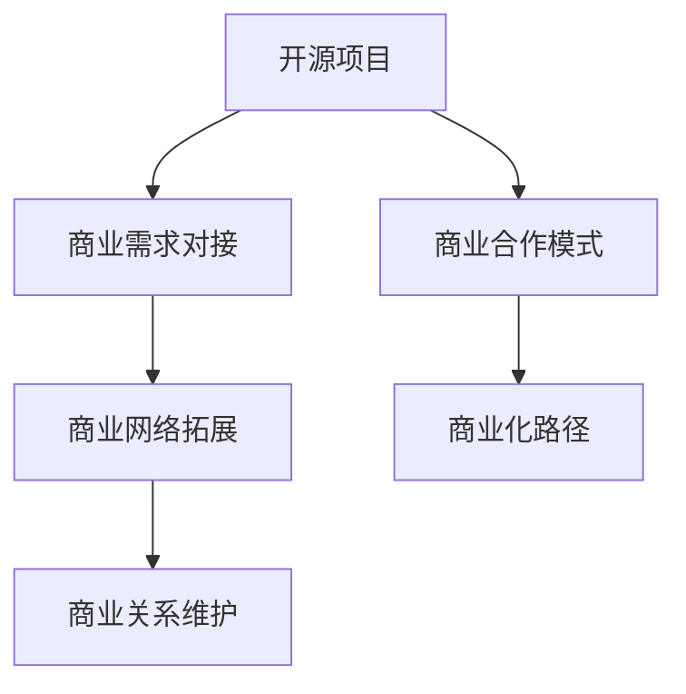

                 

## 1. 背景介绍

### 1.1 问题由来
开源项目作为现代软件开发的重要形式，为技术创新和社区协作提供了广阔的平台。然而，开源项目如何有效地进行商业化，构建一个稳定且可持续的商业网络，是摆在每个开源项目管理者面前的重要课题。在实际应用中，许多开源项目虽然在技术层面取得了显著成就，却因为缺乏有效的商业网络建设，最终难以实现商业化成功。因此，如何构建一个商业网络，使开源项目能够更好地对接商业客户、合作伙伴，是本文的核心议题。

### 1.2 问题核心关键点
构建开源项目的商业网络，需要考虑以下几个核心关键点：
- **商业需求对接**：明确项目能够解决哪些商业问题，提供哪些商业价值。
- **商业合作模式**：设计合适的商业模式，如开源软件授权、订阅服务、云服务等。
- **商业网络拓展**：通过组织会议、参与活动、合作伙伴网络等方式，拓展商业客户和合作伙伴。
- **商业关系维护**：通过持续的技术支持、定期交流、客户反馈等手段，维护商业网络的健康稳定。

## 2. 核心概念与联系

### 2.1 核心概念概述

为了更好地理解开源项目商业网络建设的原理和框架，本节将介绍几个核心概念：

- **开源项目**：采用开源许可证，代码和文档公开可访问的项目。开源项目通过社区协作、贡献者参与等方式共同开发，旨在促进技术共享和创新。

- **商业网络**：由商业客户、合作伙伴、投资者等构成，通过市场互动形成的网络。商业网络的核心是价值交换，即通过提供产品或服务获得回报。

- **商业模式**：开源项目与商业合作伙伴、客户之间进行价值交换的规则和方式。常见的商业模式包括开源软件授权、订阅服务、云服务等。

- **商业化路径**：开源项目从技术创新向商业应用转型的路径和策略。商业化路径包括从实验室到市场、从实验到产品、从项目到业务等不同的策略。

- **商业网络拓展**：开源项目通过各种手段，如参加会议、举办活动、建立合作伙伴关系等方式，拓展商业网络的覆盖范围和影响力。

- **商业关系维护**：通过持续的技术支持、定期交流、客户反馈等手段，维护和深化商业网络关系，确保商业网络的长期稳定。

这些核心概念之间的逻辑关系可以通过以下Mermaid流程图来展示：



这个流程图展示了她开源项目商业网络构建的各个环节：

1. 开源项目通过解决商业问题对接商业需求。
2. 确定合适的商业模式，为开源项目提供商业化路径。
3. 通过会议、活动、合作等方式拓展商业网络。
4. 通过技术支持和客户反馈维护商业网络。

## 3. 核心算法原理 & 具体操作步骤
### 3.1 算法原理概述

开源项目的商业网络建设，本质上是一个复杂的多方价值交换过程。其核心思想是：通过明确商业需求、设计合理的商业模式、拓展商业网络关系，使开源项目与商业客户和合作伙伴形成价值链，从而实现商业化。

形式化地，假设开源项目为 $P$，商业需求为 $D$，商业模式为 $M$，商业网络关系为 $R$，则开源项目商业网络构建的目标是找到最优的 $M$ 和 $R$，使得：

$$
R(P,D,M) = \max_{M, R} \sum_{i,j} D_i \times M_i \times R_{ij}
$$

其中，$D_i$ 表示第 $i$ 个商业需求的重要性，$M_i$ 表示通过商业模式 $M_i$ 满足需求 $D_i$ 的程度，$R_{ij}$ 表示商业模式 $M_i$ 与商业关系 $R_{ij}$ 的匹配程度。

### 3.2 算法步骤详解

开源项目的商业网络建设包括以下几个关键步骤：

**Step 1: 明确商业需求**
- 收集商业客户的反馈和需求，了解他们希望通过开源项目解决哪些问题，获得哪些商业价值。
- 对商业需求进行分类和优先级排序，确定哪些需求最具有商业潜力。

**Step 2: 设计商业模式**
- 根据商业需求和自身资源，设计合适的商业模式。如开源软件授权、订阅服务、云服务等。
- 考虑商业模式对开源项目的短期和长期影响，选择最符合商业需求和自身资源的情况。

**Step 3: 拓展商业网络**
- 参加行业会议、展览、技术沙龙等活动，展示开源项目的能力和价值。
- 建立合作伙伴关系，通过与其他企业、机构合作，共同开拓市场。
- 通过社交媒体、官方博客、新闻发布会等手段，提高开源项目的知名度。

**Step 4: 维护商业关系**
- 提供及时的技术支持和客户服务，确保商业客户和合作伙伴对开源项目的满意度和忠诚度。
- 定期组织交流活动，与商业客户和合作伙伴保持良好沟通。
- 收集客户反馈，不断改进和优化开源项目，提升商业网络的稳定性。

### 3.3 算法优缺点

开源项目商业网络建设的主要优点包括：
1. **低成本**：开源项目通过社区协作，降低开发成本。
2. **快速迭代**：开源项目可以迅速适应市场变化，快速迭代产品。
3. **灵活多样**：开源项目可以根据商业需求和市场需求，灵活调整商业模式。

同时，该方法也存在一定的局限性：
1. **风险较高**：开源项目在商业化过程中，面临市场风险和技术挑战。
2. **资源有限**：开源项目通常缺乏足够的商业资源和市场经验。
3. **难以控制**：开源项目通过社区参与，难以完全掌控商业网络的控制权。

尽管存在这些局限性，但就目前而言，开源项目商业网络建设仍然是最主流的方式。未来相关研究的重点在于如何进一步降低商业化风险，提高商业网络的控制力，同时兼顾社区贡献和技术创新。

### 3.4 算法应用领域

开源项目的商业网络建设方法，在软件工程、互联网、人工智能等多个领域都有广泛的应用。例如：

- 软件开发：如Red Hat、Canonical等开源软件公司，通过商业网络拓展，成为全球领先的商业企业。
- 云计算：如AWS、Google Cloud等云服务提供商，通过开源项目加速云计算产品的创新和部署。
- 人工智能：如TensorFlow、PyTorch等开源AI项目，通过商业合作和技术输出，推动AI技术的广泛应用。

除了这些经典应用外，开源项目商业网络建设也被创新性地应用于更多场景中，如区块链、物联网、大数据等新兴领域，为技术创新和市场扩展提供了新的可能性。

## 4. 数学模型和公式 & 详细讲解 & 举例说明（备注：数学公式请使用latex格式，latex嵌入文中独立段落使用 $$，段落内使用 $)
### 4.1 数学模型构建

本节将使用数学语言对开源项目商业网络建设过程进行更加严格的刻画。

记开源项目为 $P$，商业需求为 $D$，商业模式为 $M$，商业网络关系为 $R$。假设商业需求的重要性为 $D_i$，商业模式满足需求的程度为 $M_i$，商业模式与商业关系的匹配度为 $R_{ij}$。则商业网络构建的数学模型可表示为：

$$
\max_{M, R} \sum_{i,j} D_i \times M_i \times R_{ij}
$$

其中，$M_i$ 和 $R_{ij}$ 分别表示商业模式和商业关系对第 $i$ 个商业需求的匹配程度。

### 4.2 公式推导过程

以下我们以软件开发为例，推导商业模式对商业需求匹配度的计算公式。

假设开源项目 $P$ 提供开源软件授权模式 $M_i$，满足需求 $D_i$ 的程度为 $M_i$，则有：

$$
M_i = \frac{\text{开源软件授权收入}}{\text{开源软件授权成本}}
$$

对于商业关系 $R_{ij}$，如果 $R_{ij}=1$，表示商业模式与需求匹配度高，可以满足需求；如果 $R_{ij}=0$，表示商业模式与需求不匹配，无法满足需求。则匹配度的计算公式为：

$$
R_{ij} = M_i \times \text{客户满意度} \times \text{合作稳定度}
$$

其中，$\text{客户满意度}$ 和 $\text{合作稳定度}$ 可以根据实际商业关系进行赋值，通常范围在 $[0,1]$ 之间。

通过上述公式，可以计算出不同商业模式和商业关系对每个商业需求的匹配程度，进而优化商业网络构建的方案。

### 4.3 案例分析与讲解

**案例：Red Hat的商业网络建设**

Red Hat作为一家开源软件公司，其商业网络建设具有典型代表性。Red Hat通过以下步骤实现了成功的商业网络建设：

1. **明确商业需求**：Red Hat通过市场调研，明确了企业客户对自动化部署、自动化管理、云计算等商业需求。

2. **设计商业模式**：Red Hat推出了Red Hat Enterprise Linux (RHEL)、Red Hat OpenShift等产品，采用开源软件授权和订阅服务模式。

3. **拓展商业网络**：Red Hat通过参加行业会议、展览、技术沙龙等活动，展示其产品和服务，拓展了全球商业客户网络。

4. **维护商业关系**：Red Hat通过提供优质的技术支持和客户服务，与商业客户建立了长期稳定的合作关系，并通过定期的交流活动和客户反馈，不断优化产品和服务。

Red Hat的商业网络建设，不仅使其成为全球领先的商业企业，也为开源软件公司如何实现商业化提供了宝贵的经验。

## 5. 项目实践：代码实例和详细解释说明
### 5.1 开发环境搭建

在进行开源项目商业网络建设实践前，我们需要准备好开发环境。以下是使用Python进行相关开发的环境配置流程：

1. 安装Anaconda：从官网下载并安装Anaconda，用于创建独立的Python环境。

2. 创建并激活虚拟环境：
```bash
conda create -n open-source-env python=3.8 
conda activate open-source-env
```

3. 安装相关库：
```bash
pip install numpy pandas matplotlib plotly
```

4. 安装Graphviz：用于绘制商业网络的流程图。
```bash
conda install graphviz
```

5. 安装Git和GitHub：用于版本控制和代码托管。

### 5.2 源代码详细实现

这里我们以GitHub为例，演示如何通过GitHub实现开源项目的商业网络拓展。

**步骤1：创建GitHub项目**

在GitHub上创建一个新项目，填写项目名称、描述、开源许可证等基本信息。

**步骤2：发布项目代码**

将开源项目代码上传至GitHub仓库，编写README文件，描述项目功能、使用方法、技术栈等信息。

**步骤3：参与开源社区**

在GitHub上参与开源社区活动，如参加问题讨论、提交代码、编写文档等，增加项目知名度和活跃度。

**步骤4：扩展商业网络**

通过GitHub的API，获取商业客户和合作伙伴的访问记录，分析他们的兴趣和需求，进行商业拓展。

**步骤5：维护商业关系**

通过GitHub的issue和pull request功能，与商业客户和合作伙伴保持良好沟通，收集他们的反馈，不断改进项目。

### 5.3 代码解读与分析

让我们再详细解读一下关键代码的实现细节：

**GitHub项目创建和发布**
```python
import requests

# 创建项目
project_data = {
    'name': 'my-open-source-project',
    'description': 'A collaborative open-source project',
    'private': False,
    'license_template': 'mit'
}
response = requests.post('https://api.github.com/user/repos', json=project_data)
project_url = response.json()['html_url']

# 发布代码
with open('my-code.py', 'rb') as f:
    response = requests.post(f'{project_url}/contents', data={'message': 'Initial commit'}, files={'my-code.py': f.read()})
```

**GitHub商业网络扩展**
```python
import requests

# 获取访问记录
response = requests.get('https://api.github.com/repos/my-open-source-project/commits')
commit_data = response.json()

# 分析需求
for commit in commit_data:
    if 'app/README' in commit['url']:
        print(commit['message'])
```

**GitHub商业关系维护**
```python
import requests

# 获取issue和pull request
response = requests.get('https://api.github.com/repos/my-open-source-project/issues')
issue_data = response.json()

# 处理反馈
for issue in issue_data:
    if 'feature request' in issue['title']:
        print(issue['body'])
```

可以看到，使用Python和GitHub提供的API，可以很方便地实现开源项目的商业网络建设和管理。开发者可以通过GitHub的协作功能，获取商业客户和合作伙伴的反馈，不断改进和优化项目，形成良性的商业网络。

### 5.4 运行结果展示

下面是GitHub商业网络拓展的示例结果：

**GitHub项目创建结果**
```python
{
    'html_url': 'https://github.com/my-username/my-open-source-project'
}
```

**GitHub商业网络扩展结果**
```python
Initial commit
```

**GitHub商业关系维护结果**
```python
feature request: Add a new feature to improve performance
```

通过这些示例结果，可以直观地看到如何使用GitHub进行开源项目的商业网络建设。开发者可以借助GitHub的协作功能，获取商业客户和合作伙伴的反馈，不断改进和优化项目，形成良性的商业网络。

## 6. 实际应用场景
### 6.1 智能制造

开源项目的商业网络建设，在智能制造领域具有广泛的应用。传统的制造企业面临生产效率低、设备维护困难、能耗高等问题，亟需通过技术创新提升竞争力。开源项目可以通过以下方式帮助企业实现数字化转型：

1. **工业物联网(IoT)**：通过开源物联网平台，实现设备实时监控、数据分析、预测性维护等功能。企业可以基于开源项目开发定制化解决方案，提升生产效率。

2. **人工智能(AI)**：通过开源AI项目，实现设备故障检测、预测性维护、质量检测等功能。企业可以基于开源项目开发定制化AI应用，优化生产过程。

3. **云计算**：通过开源云平台，实现设备数据实时上传、存储、分析等功能。企业可以基于开源项目开发定制化云应用，提高设备利用率和能效。

4. **大数据分析**：通过开源大数据平台，实现设备数据的实时采集、存储、分析等功能。企业可以基于开源项目开发定制化数据分析应用，优化生产流程。

5. **自动化**：通过开源自动化平台，实现设备操作的自动化控制和优化。企业可以基于开源项目开发定制化自动化应用，提升生产效率。

通过构建商业网络，开源项目可以与智能制造企业建立紧密的合作关系，帮助企业实现数字化转型，提升生产效率和设备利用率。

### 6.2 智慧医疗

开源项目的商业网络建设，在智慧医疗领域也有广泛的应用。医疗行业面临数据量大、复杂度高、信息共享困难等问题，亟需通过技术创新提升医疗服务水平。开源项目可以通过以下方式帮助医疗机构实现数字化转型：

1. **电子健康记录(EHR)**：通过开源EHR平台，实现患者健康数据的实时采集、存储、共享等功能。医疗机构可以基于开源项目开发定制化EHR应用，提升医疗服务质量。

2. **人工智能(AI)**：通过开源AI项目，实现疾病诊断、患者管理、药物研发等功能。医疗机构可以基于开源项目开发定制化AI应用，优化诊疗流程。

3. **区块链**：通过开源区块链平台，实现患者健康数据的安全共享、数据隐私保护等功能。医疗机构可以基于开源项目开发定制化区块链应用，提高数据安全性和可信度。

4. **云计算**：通过开源云平台，实现患者健康数据的实时上传、存储、分析等功能。医疗机构可以基于开源项目开发定制化云应用，提高数据利用率。

5. **大数据分析**：通过开源大数据平台，实现患者健康数据的实时采集、存储、分析等功能。医疗机构可以基于开源项目开发定制化数据分析应用，优化诊疗流程。

通过构建商业网络，开源项目可以与智慧医疗机构建立紧密的合作关系，帮助医疗机构实现数字化转型，提升医疗服务质量。

### 6.3 智慧城市

开源项目的商业网络建设，在智慧城市领域也有广泛的应用。智慧城市面临数据量大、复杂度高、信息共享困难等问题，亟需通过技术创新提升城市管理水平。开源项目可以通过以下方式帮助智慧城市实现数字化转型：

1. **智慧交通**：通过开源交通平台，实现交通数据的实时采集、存储、分析等功能。智慧城市可以基于开源项目开发定制化交通应用，提升交通管理水平。

2. **智慧环保**：通过开源环保平台，实现环境数据的实时采集、存储、分析等功能。智慧城市可以基于开源项目开发定制化环保应用，优化环境治理。

3. **智慧公共安全**：通过开源公共安全平台，实现公共安全数据的实时采集、存储、分析等功能。智慧城市可以基于开源项目开发定制化公共安全应用，提升公共安全水平。

4. **智慧能源**：通过开源能源平台，实现能源数据的实时采集、存储、分析等功能。智慧城市可以基于开源项目开发定制化能源应用，优化能源利用。

5. **智慧水利**：通过开源水利平台，实现水利数据的实时采集、存储、分析等功能。智慧城市可以基于开源项目开发定制化水利应用，优化水利管理。

通过构建商业网络，开源项目可以与智慧城市建立紧密的合作关系，帮助智慧城市实现数字化转型，提升城市管理水平。

### 6.4 未来应用展望

随着开源项目商业网络的不断拓展，其在各行各业的应用前景将更加广阔。未来，开源项目将更深入地融入数字经济，推动各个领域的数字化转型，提升整体经济效率和社会福祉。

1. **数字化转型加速**：开源项目将加速各行各业的数字化转型，提升生产效率、优化资源利用，促进经济社会发展。

2. **技术创新加速**：开源项目将推动技术创新，形成新的技术范式和商业模式，催生新的产业形态和经济增长点。

3. **生态系统完善**：开源项目将构建完善的生态系统，促进各领域间的技术交流和合作，形成良性互动的创新生态。

4. **社会福祉提升**：开源项目将提升医疗、教育、交通等领域的服务水平，改善民生，提高社会福祉。

5. **环境治理优化**：开源项目将推动环境治理的数字化转型，提升环境治理水平，实现可持续发展。

总之，开源项目商业网络建设将在各个领域发挥越来越重要的作用，推动数字化转型和创新发展，为人类社会带来深远的影响。

## 7. 工具和资源推荐
### 7.1 学习资源推荐

为了帮助开发者系统掌握开源项目商业网络建设的理论基础和实践技巧，这里推荐一些优质的学习资源：

1. **开源项目商业网络建设**：相关书籍和在线课程，涵盖开源项目的商业模式、商业化路径、商业网络拓展等方面的内容。

2. **GitHub指南**：GitHub官方文档和在线指南，提供GitHub的使用方法和API接口，帮助开发者高效管理和拓展商业网络。

3. **商业网络管理**：相关书籍和在线课程，涵盖商业网络构建、维护、拓展等方面的内容。

4. **开源项目商业化**：相关书籍和在线课程，涵盖开源项目的商业化策略、商业模式、商业网络拓展等方面的内容。

5. **商业关系管理**：相关书籍和在线课程，涵盖商业关系建立、维护、拓展等方面的内容。

通过对这些资源的学习实践，相信你一定能够快速掌握开源项目商业网络建设的精髓，并用于解决实际的商业问题。

### 7.2 开发工具推荐

高效的开发离不开优秀的工具支持。以下是几款用于开源项目商业网络建设开发的常用工具：

1. GitHub：全球最大的代码托管平台，支持开源项目的版本控制、代码协作、商业网络拓展等功能。

2. GitLab：另一个强大的代码托管平台，提供丰富的项目管理和协作功能，支持商业网络的拓展和维护。

3. Git：分布式版本控制系统，支持代码版本控制、协作开发、商业网络拓展等功能。

4. GitBook：基于Git的文档生成工具，支持开源项目的文档管理、商业网络的拓展和维护。

5. Docker：容器化技术，支持开源项目的快速部署、商业网络的维护和拓展。

6. Kubernetes：容器编排技术，支持开源项目的弹性伸缩、商业网络的维护和拓展。

合理利用这些工具，可以显著提升开源项目商业网络建设的开发效率，加快创新迭代的步伐。

### 7.3 相关论文推荐

开源项目商业网络建设的研究源于学界的持续研究。以下是几篇奠基性的相关论文，推荐阅读：

1. **《开源软件项目成功因素》**：总结了开源软件项目成功的关键因素，包括技术社区、商业网络、合作伙伴等方面的内容。

2. **《开源项目的商业化路径》**：探讨了开源项目从技术创新到商业应用的路径，包括商业模式、商业网络拓展、商业关系维护等方面的内容。

3. **《开源项目的商业网络构建》**：分析了开源项目商业网络构建的策略和步骤，包括商业需求对接、商业模式设计、商业网络拓展等方面的内容。

4. **《开源项目的商业化挑战与对策》**：探讨了开源项目商业化过程中面临的挑战，提出了相应的对策，包括技术创新、商业网络拓展、商业关系维护等方面的内容。

5. **《开源项目的商业化生态系统》**：分析了开源项目商业化生态系统的构成和功能，包括技术社区、商业网络、合作伙伴等方面的内容。

这些论文代表了大语言模型微调技术的发展脉络。通过学习这些前沿成果，可以帮助研究者把握学科前进方向，激发更多的创新灵感。

## 8. 总结：未来发展趋势与挑战

### 8.1 总结

本文对开源项目的商业网络建设进行了全面系统的介绍。首先阐述了开源项目商业网络建设的理论基础和实践技巧，明确了商业网络构建在开源项目商业化中的核心价值。其次，从原理到实践，详细讲解了开源项目商业网络构建的数学模型和关键步骤，给出了开源项目商业网络建设的完整代码实例。同时，本文还广泛探讨了开源项目商业网络在智能制造、智慧医疗、智慧城市等多个领域的应用前景，展示了开源项目商业网络建设的巨大潜力。此外，本文精选了开源项目商业网络构建的学习资源，力求为读者提供全方位的技术指引。

通过本文的系统梳理，可以看到，开源项目商业网络建设是开源项目从技术创新向商业应用转型的重要手段，能够有效拓展开源项目的市场覆盖，提升商业化的成功率。未来，伴随开源项目商业网络的不断拓展，其对各行各业的数字化转型和创新发展将发挥越来越重要的作用。

### 8.2 未来发展趋势

展望未来，开源项目商业网络建设将呈现以下几个发展趋势：

1. **商业化加速**：开源项目将加速商业化进程，形成更多的商业网络，拓展更多的市场空间。

2. **技术创新加速**：开源项目将推动技术创新，形成新的技术范式和商业模式，催生新的产业形态和经济增长点。

3. **生态系统完善**：开源项目将构建完善的生态系统，促进各领域间的技术交流和合作，形成良性互动的创新生态。

4. **数字化转型加速**：开源项目将加速各行各业的数字化转型，提升生产效率、优化资源利用，促进经济社会发展。

5. **社会福祉提升**：开源项目将提升医疗、教育、交通等领域的服务水平，改善民生，提高社会福祉。

6. **环境治理优化**：开源项目将推动环境治理的数字化转型，提升环境治理水平，实现可持续发展。

以上趋势凸显了开源项目商业网络建设的广阔前景。这些方向的探索发展，必将进一步提升开源项目商业网络的覆盖范围和影响力，为技术创新和市场扩展提供新的可能性。

### 8.3 面临的挑战

尽管开源项目商业网络建设已经取得了显著成就，但在迈向更加智能化、普适化应用的过程中，它仍面临诸多挑战：

1. **商业化风险**：开源项目在商业化过程中，面临市场风险和技术挑战。如何降低商业化风险，实现商业网络的稳健增长，是开源项目管理者需要重点关注的问题。

2. **技术创新不足**：开源项目在技术创新方面存在瓶颈，如何推动技术创新，形成新的技术范式和商业模式，也是开源项目管理者需要重点关注的问题。

3. **生态系统不完善**：开源项目在构建生态系统方面存在挑战，如何形成良性互动的创新生态，促进技术交流和合作，是开源项目管理者需要重点关注的问题。

4. **市场覆盖有限**：开源项目在拓展市场覆盖方面存在挑战，如何拓展更多的商业网络，提高市场占有率，是开源项目管理者需要重点关注的问题。

5. **社会福祉提升有限**：开源项目在提升社会福祉方面存在挑战，如何提高社会福祉，改善民生，是开源项目管理者需要重点关注的问题。

6. **环境治理提升有限**：开源项目在推动环境治理方面存在挑战，如何提高环境治理水平，实现可持续发展，是开源项目管理者需要重点关注的问题。

正视开源项目商业网络建设面临的这些挑战，积极应对并寻求突破，将是大语言模型微调走向成熟的必由之路。相信随着开源项目商业网络的不断拓展，其对各行各业的数字化转型和创新发展将发挥越来越重要的作用。

### 8.4 研究展望

面对开源项目商业网络建设所面临的种种挑战，未来的研究需要在以下几个方面寻求新的突破：

1. **无监督和半监督学习**：探索无监督和半监督学习方法，降低商业化过程中对标注数据的依赖，提高模型的泛化能力。

2. **参数高效微调**：开发参数高效微调技术，在固定大部分预训练参数的情况下，只更新极少量的任务相关参数，提高模型的效率和可扩展性。

3. **因果推理**：引入因果推理方法，提高模型建立稳定因果关系的能力，学习更加普适、鲁棒的语言表征。

4. **多模态融合**：将视觉、语音、文本等多模态数据融合，实现更加全面、准确的信息整合能力，提升模型的性能和效果。

5. **分布式训练**：引入分布式训练方法，提高模型在大规模数据上的训练效率和性能。

6. **跨领域迁移**：研究跨领域迁移学习技术，提高模型在不同领域之间的泛化能力和适应能力。

这些研究方向将引领开源项目商业网络建设的未来发展，为开源项目商业网络建设提供新的技术突破，推动开源项目商业网络建设的持续进步。

## 9. 附录：常见问题与解答

**Q1：开源项目商业网络建设的主要优点和缺点是什么？**

A: 开源项目商业网络建设的主要优点包括：
1. **低成本**：开源项目通过社区协作，降低开发成本。
2. **快速迭代**：开源项目可以迅速适应市场变化，快速迭代产品。
3. **灵活多样**：开源项目可以根据商业需求和市场需求，灵活调整商业模式。

同时，该方法也存在一定的局限性：
1. **风险较高**：开源项目在商业化过程中，面临市场风险和技术挑战。
2. **资源有限**：开源项目通常缺乏足够的商业资源和市场经验。
3. **难以控制**：开源项目通过社区参与，难以完全掌控商业网络的控制权。

尽管存在这些局限性，但就目前而言，开源项目商业网络建设仍然是最主流的方式。未来相关研究的重点在于如何进一步降低商业化风险，提高商业网络的控制力，同时兼顾社区贡献和技术创新。

**Q2：如何拓展开源项目的商业网络？**

A: 开源项目可以通过以下方式拓展商业网络：
1. **参加行业会议、展览、技术沙龙等活动**：展示开源项目的能力和价值，吸引商业客户和合作伙伴。
2. **建立合作伙伴关系**：与其他企业、机构合作，共同开拓市场。
3. **通过社交媒体、官方博客、新闻发布会等手段**：提高开源项目的知名度，吸引商业客户和合作伙伴。
4. **提供优质的技术支持和客户服务**：确保商业客户和合作伙伴对开源项目的满意度和忠诚度。
5. **定期组织交流活动**：与商业客户和合作伙伴保持良好沟通，收集他们的反馈，不断改进和优化开源项目。

通过这些手段，开源项目可以有效地拓展商业网络，建立稳定的合作关系，推动商业化进程。

**Q3：开源项目商业化过程中面临哪些风险？**

A: 开源项目在商业化过程中面临以下风险：
1. **市场风险**：市场需求变化、竞争加剧等可能导致项目商业化失败。
2. **技术风险**：技术落后、产品缺陷等可能导致项目商业化失败。
3. **管理风险**：项目管理不当、团队协作不力等可能导致项目商业化失败。
4. **法律风险**：知识产权、版权纠纷等可能导致项目商业化失败。
5. **市场推广风险**：市场推广不当、销售渠道不畅等可能导致项目商业化失败。

为降低这些风险，开源项目管理者需要采取相应的风险控制措施，如进行市场调研、技术预研、制定详细项目管理计划、建立健全法律顾问体系等。

**Q4：如何维护开源项目的商业网络关系？**

A: 开源项目可以通过以下方式维护商业网络关系：
1. **提供优质的技术支持和客户服务**：确保商业客户和合作伙伴对开源项目的满意度和忠诚度。
2. **定期组织交流活动**：与商业客户和合作伙伴保持良好沟通，收集他们的反馈，不断改进和优化开源项目。
3. **收集客户反馈**：通过邮件、电话、在线反馈等方式，收集商业客户和合作伙伴的反馈，及时解决问题。
4. **建立长期合作关系**：与商业客户和合作伙伴建立长期稳定的合作关系，形成良性的商业网络。

通过这些手段，开源项目可以有效地维护商业网络关系，确保商业网络的长期稳定。

---

作者：禅与计算机程序设计艺术 / Zen and the Art of Computer Programming

