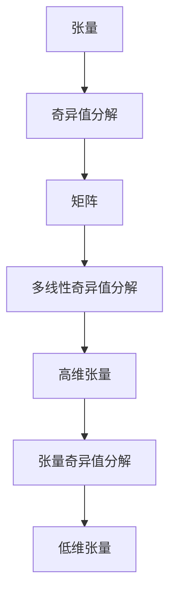

                 

# 张量分解在生物信息学的应用

## 1. 背景介绍

### 1.1 问题由来

近年来，随着生物信息学的快速发展，大规模生物数据集的生成与应用成为科学研究的基石。从基因表达谱到蛋白质结构，从染色体组学到单细胞基因组学，生物数据的维度和复杂性不断增加，数据规模呈指数级增长。这些数据通常由多个模态组成，如基因序列、蛋白质结构、表达数据等，且数据间存在复杂的相互作用。如何高效地处理和分析这些多模态生物数据，挖掘其中的潜在知识，成为生物信息学研究的重大挑战。

### 1.2 问题核心关键点

张量分解作为一种有效的数学工具，在处理多模态数据方面具有显著优势。其主要思想是将高维数据分解为一系列低维因素，每个因素可以独立解释数据的某个方面，从而降低数据的维度，简化模型的复杂度，提升数据分析的效率。

张量分解在生物信息学中主要用于数据降维、特征提取、异常检测、模式识别和可视化等任务。通过降维，可以去除噪声和冗余，提高数据分析的准确性和效率。特征提取可以揭示数据的关键信息，支持后续分类、聚类等任务。异常检测通过发现数据中的异常点，为生物研究提供新的见解。模式识别和可视化则能够直观展示数据中的复杂关系，帮助科学家理解生物系统的运行机制。

### 1.3 问题研究意义

张量分解在生物信息学中的应用，对于推动生物数据的高效处理、知识挖掘和科学发现具有重要意义：

1. **提升数据分析效率**：通过降低数据维度，减少计算资源消耗，提升数据分析速度。
2. **增强数据可视化**：将高维数据简化为低维数据，支持更直观、更高效的数据可视化。
3. **促进科学发现**：揭示数据中的潜在模式和关系，发现新的科学现象和机制。
4. **加速研究进程**：为生物研究提供高效的数据处理和分析工具，加速科学发现。

## 2. 核心概念与联系

### 2.1 核心概念概述

为更好地理解张量分解在生物信息学中的应用，本节将介绍几个关键概念：

- **张量**：张量是n维数组，每个元素代表一个多维数据点的值。在生物信息学中，基因表达谱、蛋白质结构等数据通常可以表示为高维张量。
- **张量分解**：张量分解是指将一个高维张量分解为若干低维张量的乘积形式。常见的张量分解方法包括奇异值分解(SVD)、多线性奇异值分解(MSVD)和张量奇异值分解(TSVD)等。
- **奇异值分解**：奇异值分解是一种矩阵分解方法，可以将一个高维矩阵分解为三个低维矩阵的乘积，适用于二维数据的分解。
- **多线性奇异值分解**：多线性奇异值分解是奇异值分解的扩展，可以处理高维张量的分解。
- **张量奇异值分解**：张量奇异值分解是张量分解的一种形式，可以将高维张量分解为若干张量的乘积。

这些核心概念之间的逻辑关系可以通过以下Mermaid流程图来展示：



这个流程图展示了一些基本概念及其之间的关系：

1. 张量可以被视为多维矩阵或数组。
2. 奇异值分解可以将一个高维矩阵分解为三个低维矩阵的乘积。
3. 多线性奇异值分解可以处理高维张量的分解，将一个高维张量分解为若干个低维张量的乘积。
4. 张量奇异值分解是张量分解的一种形式，同样可以将一个高维张量分解为若干个低维张量的乘积。

这些概念构成了张量分解的理论基础，并为处理复杂生物数据提供了必要的工具。

## 3. 核心算法原理 & 具体操作步骤

### 3.1 算法原理概述

张量分解的核心原理是将高维数据分解为若干低维数据的乘积，每个低维数据表示数据的一个方面。在生物信息学中，张量分解主要用于降维、特征提取和模式识别等任务。

以基因表达谱为例，假设有N个样本，每个样本有M个基因表达水平，构成一个N×M的高维矩阵。通过奇异值分解，可以将这个矩阵分解为三个低维矩阵的乘积：一个N维的投影矩阵、一个M维的投影矩阵和一个对角矩阵。其中，对角矩阵包含了数据的奇异值，代表了数据的主要特征。投影矩阵则用于对原始数据进行降维和投影。

### 3.2 算法步骤详解

基于张量分解的生物信息学分析流程主要包括以下几个步骤：

**Step 1: 数据预处理**
- 数据收集：收集和整理生物数据，确保数据的完整性和一致性。
- 数据清洗：去除噪声、缺失值和异常值，保证数据的纯净度。
- 数据归一化：对数据进行归一化处理，使其均值接近0，方差接近1，便于后续分析。

**Step 2: 数据表示与转换**
- 数据编码：将原始生物数据转换为数值型数据，如基因表达谱转换为矩阵数据。
- 数据降维：通过奇异值分解或多线性奇异值分解，对高维数据进行降维，减少数据的维度。
- 数据可视化：使用主成分分析(PCA)等技术，对降维后的数据进行可视化展示。

**Step 3: 张量分解**
- 奇异值分解：对高维数据进行奇异值分解，获得低维投影矩阵和对角矩阵。
- 多线性奇异值分解：对高维张量进行多线性奇异值分解，获得若干个低维张量的乘积形式。
- 张量奇异值分解：对高维张量进行张量奇异值分解，获得若干个低维张量的乘积形式。

**Step 4: 数据分析**
- 特征提取：从低维投影矩阵中提取关键特征，用于后续分类、聚类等任务。
- 异常检测：通过分析低维投影矩阵中的异常点，发现数据中的异常样本。
- 模式识别：通过分析低维投影矩阵中的模式，揭示数据中的潜在关系和机制。

**Step 5: 结果验证**
- 结果评估：使用交叉验证等方法，评估模型在不同数据集上的性能。
- 结果解释：对模型输出的结果进行解释，帮助理解模型的预测逻辑。

### 3.3 算法优缺点

张量分解在生物信息学中的应用具有以下优点：

1. **高效降维**：张量分解可以显著降低数据的维度，减少计算资源的消耗。
2. **易于解释**：张量分解后的低维数据易于解释，支持后续的分类、聚类等任务。
3. **灵活性高**：张量分解适用于多种类型的生物数据，如基因表达谱、蛋白质结构、表达数据等。

同时，该方法也存在一定的局限性：

1. **对噪声敏感**：张量分解对噪声较为敏感，存在数据清洗的难度。
2. **计算复杂**：高维数据的张量分解计算复杂度较高，需要较高的计算资源。
3. **解的唯一性**：张量分解的解不是唯一的，需要合理选择分解参数。

尽管存在这些局限性，但就目前而言，张量分解仍然是生物信息学分析的重要工具，能够有效处理高维生物数据，揭示数据中的潜在模式和关系。

### 3.4 算法应用领域

张量分解在生物信息学中的应用广泛，主要包括以下几个领域：

1. **基因表达谱分析**：通过奇异值分解等方法，对基因表达谱进行降维和特征提取，发现基因表达与疾病表型之间的关系。
2. **蛋白质结构分析**：使用多线性奇异值分解等方法，对蛋白质结构数据进行分解，揭示蛋白质结构与功能之间的关系。
3. **染色体组学分析**：利用张量奇异值分解等方法，对染色体组学数据进行分解，发现基因组特征与表型特征之间的关系。
4. **单细胞基因组学分析**：通过奇异值分解等方法，对单细胞基因组学数据进行降维和可视化，揭示细胞异质性特征。
5. **药物发现**：利用张量分解等方法，对药物分子与靶点之间的相互作用进行预测和优化。

以上领域展示了张量分解在生物信息学中的广泛应用，为生物数据的高效处理和科学发现提供了重要支持。

## 4. 数学模型和公式 & 详细讲解 & 举例说明

### 4.1 数学模型构建

假设有一个高维数据集 $X \in \mathbb{R}^{n_1 \times n_2 \times \cdots \times n_d}$，其中 $n_1, n_2, \cdots, n_d$ 分别为数据集的维数。通过张量分解，将高维数据 $X$ 分解为 $d$ 个低维张量 $A_1, A_2, \cdots, A_d$ 的乘积形式：

$$
X = A_1 \times A_2 \times \cdots \times A_d
$$

其中，每个张量 $A_i \in \mathbb{R}^{p_i \times q_i \times \cdots \times r_i}$，$i=1,2,\cdots,d$。

### 4.2 公式推导过程

以奇异值分解为例，假设有一个 $N \times M$ 的基因表达谱矩阵 $X$，通过奇异值分解，将 $X$ 分解为三个低维矩阵 $U \in \mathbb{R}^{N \times n}, V \in \mathbb{R}^{M \times n}, \Sigma \in \mathbb{R}^{n \times n}$ 的乘积形式：

$$
X = U \times V^T \times \Sigma
$$

其中，$U$ 和 $V$ 分别为左右投影矩阵，$\Sigma$ 为奇异值矩阵，包含 $n$ 个奇异值。奇异值矩阵的对角线元素 $\Sigma_{ii}$ 即为 $X$ 的奇异值，表示数据的主要特征。

对于多线性奇异值分解，假设有一个 $N \times M \times P$ 的三维数据矩阵 $X$，通过多线性奇异值分解，将 $X$ 分解为 $d$ 个低维张量 $A_1 \in \mathbb{R}^{N \times n_1}, A_2 \in \mathbb{R}^{M \times n_2}, \cdots, A_d \in \mathbb{R}^{P \times n_d}$ 的乘积形式：

$$
X = A_1 \times A_2 \times \cdots \times A_d
$$

其中，每个低维张量 $A_i \in \mathbb{R}^{p_i \times q_i \times \cdots \times r_i}$，$i=1,2,\cdots,d$。

### 4.3 案例分析与讲解

假设有一个基因表达谱数据集 $X \in \mathbb{R}^{100 \times 1000}$，通过对数据进行奇异值分解，得到左投影矩阵 $U \in \mathbb{R}^{100 \times 10}$，右投影矩阵 $V \in \mathbb{R}^{1000 \times 10}$ 和奇异值矩阵 $\Sigma \in \mathbb{R}^{10 \times 10}$。

分析如下：
- 左投影矩阵 $U$ 和右投影矩阵 $V$ 的每个元素代表一个基因表达与疾病的相关性，可以帮助发现潜在的基因标记。
- 奇异值矩阵 $\Sigma$ 的奇异值表示数据的主要特征，可以用于进一步的分类和聚类分析。

## 5. 项目实践：代码实例和详细解释说明

### 5.1 开发环境搭建

在进行生物信息学分析前，我们需要准备好开发环境。以下是使用Python进行SciPy和NumPy开发的环境配置流程：

1. 安装Anaconda：从官网下载并安装Anaconda，用于创建独立的Python环境。

2. 创建并激活虚拟环境：
```bash
conda create -n bioinfo-env python=3.8 
conda activate bioinfo-env
```

3. 安装SciPy和NumPy：
```bash
conda install scipy numpy
```

4. 安装pandas和matplotlib：
```bash
pip install pandas matplotlib
```

5. 安装相关生物信息学库：
```bash
conda install bioconductor-gpl-version -c bioconda
```

完成上述步骤后，即可在`bioinfo-env`环境中开始生物信息学分析。

### 5.2 源代码详细实现

这里我们以基因表达谱分析为例，给出使用SciPy库进行奇异值分解的Python代码实现。

```python
from scipy.linalg import svd
import numpy as np
import pandas as pd

# 加载基因表达谱数据
data = pd.read_csv('gene_expression.csv', index_col='id')
X = data.values

# 奇异值分解
U, S, Vt = svd(X)

# 输出前10个奇异值
print('前10个奇异值：', S[:10])

# 计算前10个奇异值的总方差
print('前10个奇异值的总方差：', np.sum(S[:10]))
```

### 5.3 代码解读与分析

让我们再详细解读一下关键代码的实现细节：

**奇异值分解函数**：
- `svd`：SciPy库中提供的奇异值分解函数。
- `U, S, Vt`：分别表示左投影矩阵、奇异值矩阵和右投影矩阵。

**基因表达谱数据加载**：
- `pd.read_csv`：使用pandas库读取CSV文件，其中`index_col='id'`表示将文件中的`id`列作为行索引。

**奇异值分解**：
- 对基因表达谱数据进行奇异值分解，获取左投影矩阵`U`、奇异值矩阵`S`和右投影矩阵`Vt`。

**奇异值分析**：
- 输出前10个奇异值及其总方差，帮助理解数据的降维效果。

**运行结果展示**：
- 运行上述代码，可以输出前10个奇异值和其总方差，通过分析这些值，可以评估数据的降维效果。

## 6. 实际应用场景

### 6.1 基因表达谱分析

基因表达谱分析是生物信息学中最常见的应用之一，通过奇异值分解等方法，可以从高维基因表达数据中提取出重要的特征，用于疾病的诊断和治疗。

以癌症基因表达谱分析为例，假设有一个包含1000个基因表达水平的基因表达谱数据集，其中每个基因表达水平表示一个基因在不同样本中的表达水平。通过对数据进行奇异值分解，可以将基因表达谱数据降维至低维空间，发现基因表达与癌症表型之间的关系。

### 6.2 蛋白质结构分析

蛋白质结构分析是生物信息学的另一重要领域，通过多线性奇异值分解等方法，可以从蛋白质结构数据中提取出重要的特征，揭示蛋白质结构与功能之间的关系。

以蛋白质三维结构分析为例，假设有一个包含1000个氨基酸的蛋白质三维结构数据集，其中每个氨基酸的位置表示为一个三维坐标。通过对数据进行多线性奇异值分解，可以将蛋白质三维结构数据降维至低维空间，发现蛋白质结构与功能之间的关系。

### 6.3 染色体组学分析

染色体组学分析是生物信息学的另一重要领域，通过张量奇异值分解等方法，可以从染色体组学数据中提取出重要的特征，揭示基因组特征与表型特征之间的关系。

以人类基因组学分析为例，假设有一个包含10000个基因组片段的基因组数据集，其中每个基因组片段的长度表示为一个一维向量。通过对数据进行张量奇异值分解，可以将基因组数据降维至低维空间，发现基因组特征与表型特征之间的关系。

### 6.4 未来应用展望

随着生物信息学的发展，张量分解的应用将更加广泛，覆盖更多领域和任务。未来的应用趋势如下：

1. **大数据处理**：随着生物数据量的不断增加，张量分解将能够处理更大规模的数据集，支持更大规模的研究。
2. **多模态数据融合**：张量分解将能够处理更多类型的生物数据，如基因表达谱、蛋白质结构、表达数据等，支持多模态数据的融合分析。
3. **深度学习融合**：张量分解将能够与深度学习技术进行更深入的融合，提升生物数据的分析精度和效率。
4. **个性化医疗**：张量分解将能够支持个性化医疗研究，通过分析个体基因表达谱等数据，提供个性化的治疗方案。
5. **生物智能设计**：张量分解将能够支持生物智能设计，通过分析蛋白质结构等数据，设计新的药物分子和生物材料。

## 7. 工具和资源推荐

### 7.1 学习资源推荐

为了帮助开发者系统掌握张量分解的理论基础和实践技巧，这里推荐一些优质的学习资源：

1. 《张量分解：理论、算法与应用》系列博文：由张量分解专家撰写，深入浅出地介绍了张量分解的理论基础、算法原理和应用实例。
2. 《张量分析与数据科学》课程：斯坦福大学开设的张量分析课程，涵盖了张量分解、张量计算等核心内容，是张量分解学习的经典教材。
3. 《张量分解在生物信息学中的应用》书籍：详细介绍了张量分解在生物信息学中的各种应用，包括基因表达谱、蛋白质结构等领域的案例分析。
4. Scikit-learn官方文档：SciPy库的官方文档，提供了丰富的张量分解函数和代码样例，是张量分解学习的必备资料。
5. Bioconductor官方文档：Bioconductor平台提供了大量的生物信息学工具包和教程，是生物信息学学习的极佳资源。

通过对这些资源的学习实践，相信你一定能够快速掌握张量分解的精髓，并用于解决实际的生物信息学问题。

### 7.2 开发工具推荐

高效的开发离不开优秀的工具支持。以下是几款用于张量分解开发的常用工具：

1. SciPy：基于Python的开源数学库，支持张量分解、线性代数、统计分析等多种数学计算功能。
2. NumPy：基于Python的开源数值计算库，支持高效的多维数组计算和张量操作。
3. Scikit-learn：基于Python的机器学习库，支持多种机器学习算法，包括张量分解。
4. TensorFlow：由Google主导开发的深度学习框架，支持高维张量的计算和优化，适用于大规模张量分解任务。
5. PyTorch：基于Python的开源深度学习框架，支持动态计算图，适用于张量分解的实验研究和模型训练。

合理利用这些工具，可以显著提升张量分解任务的开发效率，加快创新迭代的步伐。

### 7.3 相关论文推荐

张量分解在生物信息学中的应用源于学界的持续研究。以下是几篇奠基性的相关论文，推荐阅读：

1. "A Survey on Tensor Decomposition Techniques and Applications"（张量分解技术及应用综述）：综述了张量分解的各种技术及其在多个领域的应用，为张量分解学习提供了全面的参考。
2. "Kruskal's Method for Rank-One Matrix Approximation"（Kruskal方法用于矩阵低秩逼近）：介绍了Kruskal方法在张量分解中的应用，为低秩张量分解提供了重要的理论支持。
3. "The Unsupervised Factorization of 3D Biological Images"（三维生物图像的未监督分解）：应用张量分解技术对三维生物图像进行分解，揭示了生物图像中的潜在模式和关系。
4. "Fast Spectral Tensor Decomposition for 3D-CT Medical Images"（三维CT医学图像的快速张量分解）：应用张量分解技术对三维CT医学图像进行分解，提高了图像分析的准确性和效率。
5. "Z-Scalings, Alternating Least Squares, and Parallel Decompositions"（Z-缩放、交替最小二乘和并行分解）：介绍了多种张量分解算法及其在实际应用中的实现细节。

这些论文代表了张量分解在生物信息学中的研究进展，阅读这些文献将有助于理解张量分解的原理和应用方法。

## 8. 总结：未来发展趋势与挑战

### 8.1 研究成果总结

本文对张量分解在生物信息学中的应用进行了全面系统的介绍。首先阐述了张量分解在处理多模态生物数据中的独特优势，明确了其在生物数据降维、特征提取和模式识别等任务中的重要价值。其次，从原理到实践，详细讲解了奇异值分解、多线性奇异值分解和张量奇异值分解等核心算法的原理和操作步骤，给出了张量分解任务开发的完整代码实例。同时，本文还广泛探讨了张量分解在基因表达谱、蛋白质结构、染色体组学等多个生物信息学领域的应用前景，展示了张量分解技术的广泛适用性。

通过本文的系统梳理，可以看到，张量分解在生物信息学中的应用为高维生物数据的处理和分析提供了重要工具，极大提升了数据分析的效率和准确性。未来，随着张量分解技术的不断演进，其在生物信息学中的作用将更加显著，为科学发现和应用创新提供更强支持。

### 8.2 未来发展趋势

展望未来，张量分解在生物信息学中的应用将呈现以下几个发展趋势：

1. **高维数据处理**：随着生物数据维度的不断增加，张量分解技术将能够处理更大规模的高维数据，支持更深层次的数据分析。
2. **多模态数据融合**：张量分解将能够处理更多类型的生物数据，如基因表达谱、蛋白质结构、表达数据等，支持多模态数据的融合分析。
3. **深度学习融合**：张量分解将能够与深度学习技术进行更深入的融合，提升生物数据的分析精度和效率。
4. **个性化医疗**：张量分解将能够支持个性化医疗研究，通过分析个体基因表达谱等数据，提供个性化的治疗方案。
5. **生物智能设计**：张量分解将能够支持生物智能设计，通过分析蛋白质结构等数据，设计新的药物分子和生物材料。

以上趋势凸显了张量分解在生物信息学中的重要价值和广阔前景，相信随着技术的不断发展，张量分解将为生物数据的高效处理和科学发现提供更强支持。

### 8.3 面临的挑战

尽管张量分解在生物信息学中已经取得了显著成效，但在其应用过程中仍面临一些挑战：

1. **数据复杂性**：生物数据的复杂性和多样性使得张量分解在实际应用中存在一定的难度。
2. **计算资源需求**：高维数据的张量分解计算资源需求较高，需要较高的计算能力和存储资源。
3. **噪声处理**：生物数据中存在大量的噪声和异常值，需要进行有效的数据清洗和噪声处理。
4. **解的唯一性**：张量分解的解不是唯一的，需要合理选择分解参数，找到最优的张量分解方案。
5. **模型可解释性**：张量分解的模型结果往往难以解释，需要进行有效的结果解读和可视化。

尽管存在这些挑战，但随着技术的不断进步和优化，张量分解在生物信息学中的应用前景仍然非常广阔。研究者需要不断探索和优化张量分解技术，以克服其局限性，提升其在实际应用中的效果和可解释性。

### 8.4 研究展望

面对张量分解在生物信息学应用中面临的挑战，未来的研究需要在以下几个方面寻求新的突破：

1. **多模态数据融合**：研究多模态数据的融合方法，提高张量分解在多种类型数据上的应用效果。
2. **高维数据处理**：开发高效的高维数据处理算法，提升张量分解在处理大规模高维数据上的效率。
3. **噪声处理**：研究有效的噪声处理和异常值检测方法，提高数据的纯净度。
4. **模型可解释性**：研究张量分解结果的解释方法和可视化技术，提升模型的可解释性和应用效果。
5. **深度学习融合**：研究张量分解与深度学习的融合方法，提升生物数据的分析精度和效率。

这些研究方向的探索，将有助于提升张量分解在生物信息学中的应用效果，推动其在更多领域的落地应用。相信随着研究的深入和技术的发展，张量分解将在生物信息学中发挥更大的作用，推动科学发现和应用创新。

## 9. 附录：常见问题与解答

**Q1：张量分解能否处理非正定矩阵？**

A: 张量分解通常用于处理正定矩阵，如奇异值分解和张量奇异值分解。对于非正定矩阵，可以通过奇异值分解进行预处理，将其转化为正定矩阵，再进行分解。

**Q2：张量分解的解是否唯一？**

A: 张量分解的解不是唯一的，存在多种可能的分解方案。通常选择奇异值分解等方法的解为最优解，但具体的解选择还需根据具体应用场景和需求进行判断。

**Q3：张量分解的计算复杂度是多少？**

A: 张量分解的计算复杂度较高，尤其是在高维数据上的计算复杂度呈指数级增长。因此，需要在实际应用中考虑计算资源的限制，选择合适的分解参数和算法。

**Q4：张量分解的实际应用有哪些？**

A: 张量分解在生物信息学中有广泛的应用，包括基因表达谱分析、蛋白质结构分析、染色体组学分析、单细胞基因组学分析等。

**Q5：张量分解在数据降维中如何使用？**

A: 张量分解在数据降维中通常使用奇异值分解或张量奇异值分解，将高维数据降维至低维空间，减少数据的复杂度，便于后续分析和可视化。

---

作者：禅与计算机程序设计艺术 / Zen and the Art of Computer Programming

