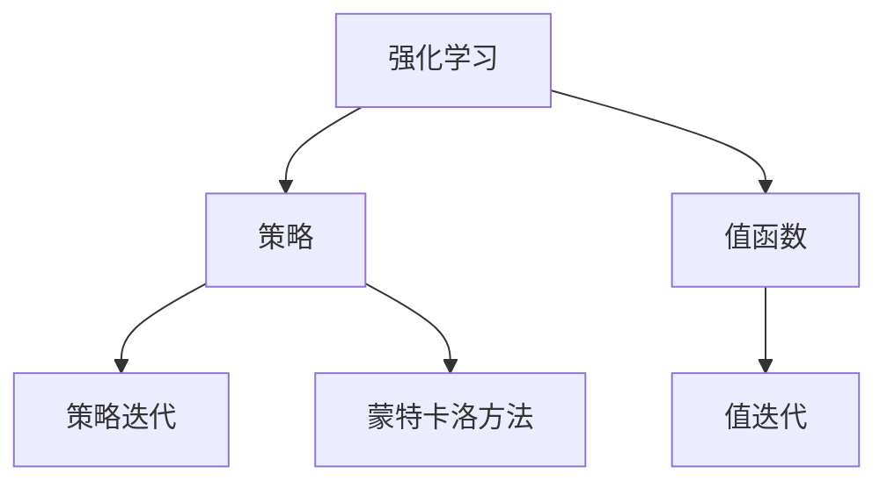

                 

## 1. 背景介绍

### 1.1 问题由来

在人工智能（AI）领域，强化学习（Reinforcement Learning，RL）是一种重要的学习范式，特别是对于解决决策问题、机器人控制、游戏AI等领域具有重要的应用价值。强化学习算法通过与环境进行交互，利用奖励信号指导行为策略的学习，以实现特定目标。与监督学习和无监督学习不同，强化学习不需要大量标注数据，而是通过不断试错来优化行为策略。

### 1.2 问题核心关键点

强化学习的基本问题可以描述为：在特定的环境中，智能体（agent）通过与环境进行交互，逐步调整其行为策略，以最大化累积奖励。核心关键点包括：

- **状态表示**：环境中的每个时刻都由一个或多个状态（state）表示，状态代表了当前环境的特征和智能体所在的位置。
- **行为策略**：智能体在每个状态下选择某种行为，行为可以视为动作（action）序列。
- **奖励函数**：环境对智能体的每个行为进行奖励或惩罚，奖励信号指导智能体选择最优策略。
- **时间步**：强化学习通常以时间步（time step）为单位进行计算，每一步中智能体接收一个状态、执行一个动作，并根据动作获取一个奖励和下一个状态。
- **求解目标**：强化学习的目标是通过学习最优策略（policy），使得智能体在长期累积奖励上达到最大化。

## 2. 核心概念与联系

### 2.1 核心概念概述

为更好地理解强化学习，本节将介绍几个关键概念：

- **强化学习**：通过智能体与环境交互，利用奖励信号指导行为策略的学习。核心在于最大化长期累积奖励。
- **策略（Policy）**：智能体在每个状态下选择动作的概率分布。
- **值函数（Value Function）**：评估一个状态或动作的价值，指导策略的优化。
- **值迭代（Value Iteration）**：通过迭代优化值函数，求解最优策略。
- **策略迭代（Policy Iteration）**：通过迭代优化策略，求解最优值函数。
- **蒙特卡洛方法（Monte Carlo Methods）**：通过模拟环境中的随机过程，估计值函数或策略。

这些核心概念之间的逻辑关系可以通过以下Mermaid流程图来展示：



这个流程图展示了一些强化学习的核心概念及其之间的关系：

1. 强化学习通过策略在环境中交互，获得奖励信号。
2. 策略和值函数是强化学习的两个核心要素，指导智能体的行为选择和价值评估。
3. 值迭代和策略迭代是两种主要的求解方法，分别优化值函数和策略。
4. 蒙特卡洛方法提供了一种通过模拟实验估计值函数和策略的方法。

这些概念共同构成了强化学习的学习和应用框架，使得智能体能够在复杂环境中通过试错逐步优化其行为策略。

## 3. 核心算法原理 & 具体操作步骤

### 3.1 算法原理概述

强化学习的基本原理是通过试错逐步优化策略，以最大化长期累积奖励。强化学习算法通常包括以下几个步骤：

1. **环境交互**：智能体在每个时间步接收一个状态，根据当前策略选择动作，环境返回一个新状态和奖励。
2. **状态更新**：智能体根据新的状态和奖励，更新状态表示。
3. **策略优化**：通过评估策略的表现，进行策略调整，以优化智能体的行为选择。
4. **策略评估**：通过值函数或蒙特卡洛方法，评估策略的性能。
5. **策略迭代**：通过交替进行策略优化和策略评估，逐步逼近最优策略。

### 3.2 算法步骤详解

下面详细讲解强化学习的具体算法步骤：

#### 3.2.1 状态表示和动作空间

在强化学习中，状态表示和动作空间是关键的概念：

- **状态表示**：环境中的每个状态可以用一个向量或张量表示，包含所有与智能体有关的环境信息。
- **动作空间**：智能体在每个状态下可以选择的动作集合，可以是离散的或连续的。

例如，在一个简单的迷宫环境中，状态表示可以包括当前位置、迷宫的状态等，动作空间可能包括上、下、左、右四个方向。

#### 3.2.2 奖励函数

奖励函数（Reward Function）用于衡量智能体的行为选择对环境的影响。奖励函数通常是非负的，用来鼓励智能体采取有益的行为。

例如，在迷宫中，到达终点可以给予一个较高的奖励，而遇到障碍物则会给予一个负奖励。

#### 3.2.3 策略定义

策略（Policy）描述了智能体在每个状态下选择动作的概率分布。策略可以是确定性的，也可以是概率性的。

确定性策略表示智能体在每个状态下只选择某个确定的动作。而概率性策略则表示智能体在每个状态下以一定的概率选择动作。

#### 3.2.4 值函数定义

值函数（Value Function）用于评估一个状态或动作的价值，指导策略的优化。常见的值函数包括状态值函数（State Value Function）和动作值函数（Action Value Function）。

- **状态值函数**：$V(s)$，表示在状态$s$下，智能体累积期望奖励的总和。
- **动作值函数**：$Q(s, a)$，表示在状态$s$下，选择动作$a$后的累积期望奖励的总和。

#### 3.2.5 值迭代

值迭代（Value Iteration）是一种求解最优策略的方法，通过迭代优化值函数，得到最优状态值函数$V^*$。

具体步骤如下：

1. 初始化值函数$V^0(s) = 0$，对所有状态$s$。
2. 对于每个状态$s$，计算其最优动作$a$：
   $$
   a = \arg\max_a Q(s, a)
   $$
3. 更新状态值函数$V^{t+1}(s) = r + \gamma \max_a Q(s, a)$，其中$r$是奖励，$\gamma$是折扣因子。
4. 重复步骤2和3，直到收敛。

#### 3.2.6 策略迭代

策略迭代（Policy Iteration）是一种求解最优策略的方法，通过迭代优化策略，得到最优策略$\pi^*$。

具体步骤如下：

1. 初始化策略$\pi^0(a|s) = \frac{1}{|\mathcal{A}|}$，对所有状态$s$和动作$a$。
2. 对于每个状态$s$，计算其最优动作$a$：
   $$
   a = \arg\max_a Q(s, a)
   $$
3. 更新策略$\pi^{t+1}(a|s) = \frac{\pi^t(a|s)}{Z(s)}$，其中$Z(s) = \sum_a \pi^t(a|s)$是归一化因子。
4. 重复步骤2和3，直到收敛。

### 3.3 算法优缺点

强化学习的主要优点包括：

1. **不需要标注数据**：强化学习不需要大量标注数据，通过与环境交互逐步优化策略。
2. **自适应性强**：智能体可以在不断尝试中学习最优策略，适应环境变化。
3. **泛化能力好**：强化学习能够泛化到类似环境中，解决多种相关问题。

但强化学习也存在一些局限性：

1. **环境建模困难**：环境的状态表示和动作空间往往是未知的，需要通过多次试错才能逐渐明确。
2. **探索与利用的平衡**：在探索新策略和利用已有知识之间需要找到一个平衡点，避免过早收敛。
3. **可解释性差**：强化学习的决策过程通常是"黑盒"模型，难以解释其内部机制。
4. **计算复杂度高**：对于高维状态空间和连续动作空间，强化学习算法计算复杂度高，求解困难。

### 3.4 算法应用领域

强化学习已经在多个领域得到了广泛应用，包括但不限于：

- **机器人控制**：通过与环境交互，机器人可以学习最优的移动策略，完成各种复杂的任务。
- **游戏AI**：强化学习在游戏领域表现出色，如AlphaGo通过强化学习掌握了围棋的高阶策略。
- **自动化交易**：智能体可以通过学习最优交易策略，在金融市场上获得最大化收益。
- **自动驾驶**：强化学习用于训练自动驾驶系统，使其在复杂交通环境中做出最优决策。
- **供应链管理**：强化学习可以优化供应链的物流和库存管理，降低成本，提高效率。
- **推荐系统**：通过学习用户行为和偏好，强化学习可以优化推荐策略，提升用户体验。

## 4. 数学模型和公式 & 详细讲解 & 举例说明

### 4.1 数学模型构建

强化学习中的数学模型通常包括状态、动作、奖励和策略等要素。

假设智能体在每个时间步$t$处于状态$s_t$，选择动作$a_t$，环境返回状态$s_{t+1}$和奖励$r_t$，则强化学习的数学模型可以表示为：

$$
s_{t+1} = f(s_t, a_t, \epsilon)
$$

$$
r_t = R(s_t, a_t, s_{t+1})
$$

其中，$f$和$R$分别表示状态转移函数和奖励函数。

智能体的策略为$\pi(a|s)$，即在状态$s$下选择动作$a$的概率分布。最优策略$\pi^*(a|s)$满足：

$$
\pi^*(a|s) = \arg\max_a Q^*(s, a)
$$

状态值函数$V(s)$和动作值函数$Q(s, a)$分别表示在状态$s$下，智能体累积期望奖励的总和和在状态$s$下选择动作$a$后的累积期望奖励的总和。最优值函数$V^*(s)$和最优动作值函数$Q^*(s, a)$满足：

$$
V^*(s) = \max_a Q^*(s, a)
$$

$$
Q^*(s, a) = r + \gamma \max_b Q^*(s', b)
$$

其中，$\gamma$是折扣因子，$s'$是下一个状态。

### 4.2 公式推导过程

以下我们以Q-learning算法为例，推导其更新公式。

Q-learning是一种基于值迭代的强化学习算法，通过迭代优化动作值函数$Q(s, a)$，得到最优动作值函数$Q^*(s, a)$。

假设智能体在每个时间步$t$处于状态$s_t$，选择动作$a_t$，环境返回状态$s_{t+1}$和奖励$r_t$，则Q-learning的更新公式为：

$$
Q(s_t, a_t) = Q(s_t, a_t) + \alpha(r + \gamma \max_{a'} Q(s_{t+1}, a') - Q(s_t, a_t))
$$

其中，$\alpha$是学习率，控制每次更新的步长。

Q-learning的核心思想是：在每个时间步$t$，智能体根据当前状态$s_t$和动作$a_t$，计算动作值函数$Q(s_t, a_t)$，并将其与新的动作值函数$Q'(s_t, a_t)$相比较，以更新动作值函数。

### 4.3 案例分析与讲解

以Q-learning算法在迷宫问题中的应用为例，进行详细讲解：

假设智能体在迷宫中移动，目标是从起点$(0, 0)$到达终点$(3, 3)$，奖励函数为：

- 到达终点给予$+1$奖励
- 遇到障碍物给予$-0.5$奖励
- 其他情况下奖励为$0$

智能体的动作空间为向上、向下、向左、向右四个方向。

1. **状态表示**：每个状态可以用一个向量表示，包括当前位置和迷宫状态，如$(0, 0, \text{closed})$表示智能体位于起点，迷宫状态为关闭。
2. **动作空间**：智能体的动作空间为向上、向下、向左、向右四个方向。
3. **奖励函数**：根据迷宫的规则，给予相应的奖励或惩罚。
4. **策略**：智能体在每个状态下以一定概率选择动作，例如，每次随机选择动作的概率为0.2。

通过Q-learning算法，智能体可以在不断与环境交互的过程中，学习到最优的移动策略，最终到达终点。

## 5. 项目实践：代码实例和详细解释说明

### 5.1 开发环境搭建

在进行强化学习实践前，我们需要准备好开发环境。以下是使用Python进行Reinforcement Learning开发的环境配置流程：

1. 安装Anaconda：从官网下载并安装Anaconda，用于创建独立的Python环境。

2. 创建并激活虚拟环境：
```bash
conda create -n reinforcement-env python=3.8 
conda activate reinforcement-env
```

3. 安装相关库：
```bash
pip install numpy matplotlib seaborn gym gymnasium scikit-learn jupyter notebook ipython
```

4. 安装Reinforcement Learning库：
```bash
pip install gym[atari] numpy.matlib pydot
```

完成上述步骤后，即可在`reinforcement-env`环境中开始强化学习实践。

### 5.2 源代码详细实现

下面以迷宫问题为例，给出使用Python的Q-learning算法的代码实现。

```python
import gymnasium as gym
import numpy as np

# 创建迷宫环境
env = gym.make('Taxi-v1')

# 定义Q-learning算法
def q_learning(env, num_episodes=1000, alpha=0.5, gamma=0.9, epsilon=0.1):
    # 初始化Q值表
    q_values = np.zeros((env.observation_space.n, env.action_space.n))
    # 初始化策略
    pi = np.ones((env.observation_space.n, env.action_space.n)) / env.action_space.n

    for episode in range(num_episodes):
        state = env.reset()
        done = False

        while not done:
            # 以epsilon的概率随机选择动作
            if np.random.rand() < epsilon:
                action = env.action_space.sample()
            else:
                action = np.argmax(q_values[state])

            # 执行动作，获取新状态和奖励
            next_state, reward, done, _ = env.step(action)

            # 更新Q值表
            q_values[state, action] += alpha * (reward + gamma * np.max(q_values[next_state]) - q_values[state, action])

            # 更新策略
            pi[state] = (1 - epsilon) / (1 + epsilon * (q_values[state, :]).max()) * np.exp(q_values[state, :])
            pi[state, action] += epsilon / (1 + epsilon * (q_values[state, :]).max())

            # 更新状态
            state = next_state

    return q_values, pi

# 运行Q-learning算法
q_values, pi = q_learning(env)

# 绘制Q值表
plt.imshow(q_values, cmap='Blues', interpolation='nearest')
plt.colorbar()
plt.title('Q-values of Taxi-v1')
plt.show()
```

### 5.3 代码解读与分析

让我们再详细解读一下关键代码的实现细节：

**Q-learning函数**：
- `q_values`：Q值表，存储状态-动作对价值。
- `pi`：策略表，存储在每个状态下选择动作的概率。
- 每次迭代，智能体从环境接收一个状态，执行动作，获取新状态和奖励，并更新Q值表和策略表。
- 使用随机策略探索新动作，使用Q值表指导策略更新，逐步优化智能体的行为策略。

**主循环**：
- `num_episodes`：最大迭代次数。
- `alpha`：学习率。
- `gamma`：折扣因子。
- `epsilon`：探索策略与利用策略的平衡因子。

**探索与利用**：
- 在每个时间步，以$\epsilon$的概率随机选择动作，以$1-\epsilon$的概率根据Q值表选择最优动作。

**状态更新**：
- 智能体从环境接收新状态，更新状态表示，并根据新状态和动作更新Q值表和策略表。

**绘制Q值表**：
- 使用matplotlib库绘制Q值表，展示智能体在不同状态下的最优动作选择。

## 6. 实际应用场景

### 6.1 智能机器人

强化学习在智能机器人领域有广泛应用。例如，智能机器人可以通过与环境交互，学习最优的移动策略，避开障碍物，完成任务。通过强化学习，机器人可以在复杂环境中进行自主导航、物体抓取等任务。

### 6.2 游戏AI

强化学习在游戏AI领域表现出色，AlphaGo通过强化学习掌握了围棋的高阶策略。未来，强化学习有望在更复杂的游戏如星际争霸、Dota等中获得突破，带来更为智能的AI对手。

### 6.3 金融交易

强化学习可以用于金融交易，通过学习最优的交易策略，智能体可以在不断变化的市场环境中获取最大化收益。例如，通过强化学习，交易系统可以自动调整仓位，优化交易决策。

### 6.4 自动驾驶

强化学习可以用于自动驾驶系统，智能体通过与环境交互，学习最优的驾驶策略，避免交通事故，提高行车安全。通过强化学习，自动驾驶车辆可以适应不同道路条件，完成复杂的驾驶任务。

### 6.5 推荐系统

强化学习可以用于推荐系统，通过学习用户行为和偏好，智能体可以优化推荐策略，提升用户体验。例如，通过强化学习，推荐系统可以根据用户反馈，动态调整推荐内容。

### 6.6 语音识别

强化学习可以用于语音识别，通过学习最优的音频特征提取和模型参数，智能体可以提升语音识别的准确率。例如，通过强化学习，语音识别系统可以适应不同的说话风格和环境噪声，提高识别性能。

## 7. 工具和资源推荐

### 7.1 学习资源推荐

为了帮助开发者系统掌握强化学习的理论基础和实践技巧，这里推荐一些优质的学习资源：

1. 《强化学习导论》：Sutton和Barto的经典教材，全面介绍了强化学习的理论和算法。
2. 《Python强化学习：以TensorFlow和Keras为例》：李健博士的书籍，介绍了强化学习的基本概念和Python实现。
3. DeepMind官方博客：DeepMind在强化学习领域的最新研究进展，涵盖AlphaGo、AlphaZero等重要成果。
4. Reinforcement Learning Hub：收集了各种强化学习相关的论文和代码，是学习和研究的重要资源。
5. OpenAI Gym：提供了多种强化学习环境，方便开发者进行实验和研究。

通过对这些资源的学习实践，相信你一定能够快速掌握强化学习的精髓，并用于解决实际的智能问题。

### 7.2 开发工具推荐

高效的开发离不开优秀的工具支持。以下是几款用于强化学习开发的常用工具：

1. OpenAI Gym：提供了多种强化学习环境，方便开发者进行实验和研究。
2. TensorFlow和PyTorch：两大深度学习框架，支持强化学习的实现和优化。
3. Microsoft Maluuba：提供了基于深度强化学习的自然语言处理工具。
4. ROS（Robot Operating System）：用于机器人编程的开源框架，提供了丰富的环境库。
5. SimPy：用于仿真和建模的开源框架，方便进行智能体的模拟和测试。

合理利用这些工具，可以显著提升强化学习的开发效率，加快创新迭代的步伐。

### 7.3 相关论文推荐

强化学习的研究涉及广泛的领域，以下是几篇奠基性的相关论文，推荐阅读：

1. "Reinforcement Learning: An Introduction"：Sutton和Barto的经典论文，介绍了强化学习的理论和算法。
2. "Playing Atari with Deep Reinforcement Learning"：DeepMind在2013年的论文，展示了使用深度强化学习在复杂游戏中的表现。
3. "AlphaGo Zero"：DeepMind在2017年的论文，介绍了使用强化学习训练AlphaGo Zero的策略。
4. "Deep Reinforcement Learning for Atari Games"：DeepMind在2015年的论文，展示了使用深度强化学习在Atari游戏上的突破。
5. "Human-level Control Through Deep Reinforcement Learning"：DeepMind在2013年的论文，展示了使用强化学习训练Human-level控制器的策略。

这些论文代表了大强化学习的发展脉络。通过学习这些前沿成果，可以帮助研究者把握学科前进方向，激发更多的创新灵感。

## 8. 总结：未来发展趋势与挑战

### 8.1 总结

本文对强化学习进行了全面系统的介绍。首先阐述了强化学习的基本问题，明确了强化学习在决策问题、机器人控制、游戏AI等领域的应用价值。其次，从原理到实践，详细讲解了强化学习的数学模型、核心算法和具体操作步骤，提供了完整的代码实现。同时，本文还探讨了强化学习在多个实际场景中的应用，展示了其广泛的适用性和巨大的潜力。

通过本文的系统梳理，可以看到，强化学习作为人工智能的重要分支，在解决复杂决策问题方面具有独特优势，已经在机器人控制、游戏AI、金融交易、自动驾驶等多个领域得到广泛应用。未来，伴随强化学习技术的不断演进，其在智能系统中的应用将更加深入，为智能交互和决策提供新的解决方案。

### 8.2 未来发展趋势

展望未来，强化学习的发展趋势主要包括以下几个方面：

1. **深度强化学习**：深度学习与强化学习的结合，提高了智能体的决策能力和适应能力。未来，基于深度强化学习的模型将更加复杂，可以解决更复杂的决策问题。
2. **多智能体学习**：多智能体强化学习研究如何多个智能体在竞争或协作中达到最优策略。未来，多智能体学习将广泛应用于复杂协作系统，如智能交通、智能电网等。
3. **元学习**：元学习研究智能体如何快速学习新任务，从而适应新环境。未来，元学习将显著提升智能体的迁移能力和泛化能力，加快任务适配速度。
4. **鲁棒性强化学习**：鲁棒性强化学习研究智能体如何应对不确定性和噪声，保持稳定决策。未来，鲁棒性强化学习将增强智能体的鲁棒性和可靠性。
5. **安全强化学习**：安全强化学习研究如何保证智能体在恶意环境中保持稳定决策，避免安全漏洞。未来，安全强化学习将增强智能系统的安全性。
6. **多模态强化学习**：多模态强化学习研究如何结合视觉、听觉等多模态信息，提升智能体的决策能力。未来，多模态强化学习将广泛应用于智能交互和决策系统。

以上趋势凸显了强化学习的广阔前景。这些方向的探索发展，必将进一步提升智能体的决策能力和应用范围，为构建更加智能的交互系统提供新的解决方案。

### 8.3 面临的挑战

尽管强化学习已经取得了瞩目成就，但在迈向更加智能化、普适化应用的过程中，仍面临诸多挑战：

1. **环境建模困难**：复杂环境的状态表示和动作空间往往是未知的，需要通过多次试错才能逐渐明确。
2. **探索与利用的平衡**：在探索新策略和利用已有知识之间需要找到一个平衡点，避免过早收敛。
3. **可解释性差**：强化学习的决策过程通常是"黑盒"模型，难以解释其内部机制。
4. **计算复杂度高**：对于高维状态空间和连续动作空间，强化学习算法计算复杂度高，求解困难。
5. **模型泛化能力有限**：强化学习模型在特定环境下表现优异，但在新环境中可能泛化能力不足。

### 8.4 研究展望

面对强化学习所面临的挑战，未来的研究需要在以下几个方面寻求新的突破：

1. **更好的环境建模**：开发更高效的模型和方法，快速从环境中学习状态表示和动作空间。
2. **更优的探索与利用策略**：研究更智能的探索策略，平衡探索和利用，避免过早收敛。
3. **提高可解释性**：引入可解释性方法，如可视化、因果推理等，增强模型的可解释性和可理解性。
4. **降低计算复杂度**：开发更高效的算法和数据结构，降低强化学习的计算复杂度，提高求解效率。
5. **提升泛化能力**：研究更好的迁移学习方法和泛化策略，提升模型在新环境中的表现。

这些研究方向将推动强化学习技术的不断演进，为构建更加智能、安全、可靠的决策系统提供新的解决方案。

## 9. 附录：常见问题与解答

**Q1：强化学习是否需要大量的标注数据？**

A: 强化学习通常不需要大量标注数据，通过与环境交互逐步优化策略。但是，在一些复杂的任务中，仍然需要一定的标注数据用于先验知识指导。例如，多智能体学习需要已知智能体之间的交互规则，可以使用部分标注数据进行指导。

**Q2：强化学习算法是否容易过拟合？**

A: 强化学习算法容易发生过拟合，特别是在高维状态空间和连续动作空间中。为避免过拟合，可以引入正则化方法，如L2正则、Dropout等。此外，通过探索策略和利用策略的平衡，可以在一定程度上缓解过拟合问题。

**Q3：强化学习算法在实际应用中是否容易收敛？**

A: 强化学习算法在实际应用中可能容易收敛到局部最优解，特别是在复杂环境中。为避免局部最优解，可以采用多种启发式方法，如模拟退火、遗传算法等。此外，通过多重起跑、模型集成等方法，可以提高算法的收敛速度和稳定性。

**Q4：强化学习算法在实际应用中是否容易调试？**

A: 强化学习算法的调试可能比较困难，因为其决策过程通常是"黑盒"模型。为增强可解释性，可以引入可视化、因果推理等方法，帮助理解智能体的决策过程和行为策略。

**Q5：强化学习算法在实际应用中是否容易部署？**

A: 强化学习算法在实际应用中可能容易部署困难，特别是在计算资源受限的情况下。为降低计算复杂度，可以采用模型压缩、稀疏化存储等方法，提高算法的计算效率和部署灵活性。

---

作者：禅与计算机程序设计艺术 / Zen and the Art of Computer Programming

