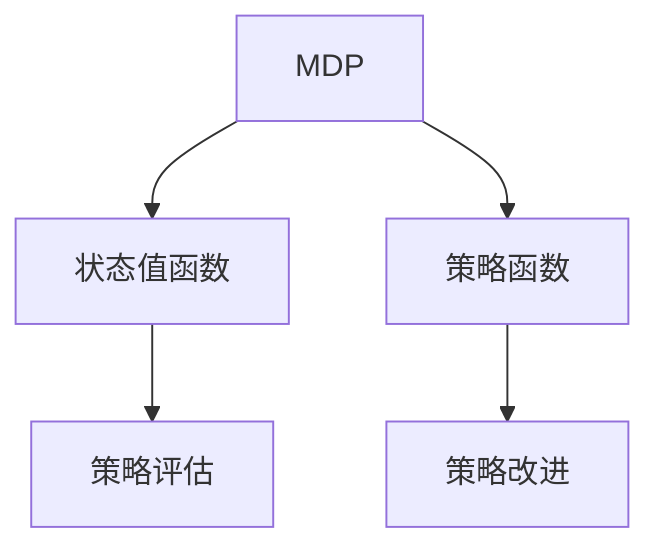

                 

# 强化学习Reinforcement Learning的动态规划基础与实践技巧

> 关键词：强化学习,动态规划,策略优化,价值迭代,马尔可夫决策过程,深度强化学习

## 1. 背景介绍

### 1.1 问题由来
强化学习（Reinforcement Learning, RL）是人工智能领域的一个重要分支，其核心思想是通过智能体与环境的交互学习，获得最优的决策策略。强化学习在智能控制、游戏AI、推荐系统、金融等领域具有广泛的应用前景。传统的强化学习算法主要依赖价值迭代（Value Iteration）和策略优化（Policy Optimization）等动态规划方法，但这些方法计算复杂度高，难以应对大规模和高维状态空间的任务。

近年来，深度强化学习（Deep Reinforcement Learning, DRL）结合了深度神经网络和强化学习的优势，通过深度模型拟合非线性状态-动作映射，能够处理复杂非线性任务，并在许多游戏和机器人控制任务上取得了优异成绩。然而，深度强化学习也面临着模型训练不稳定、策略探索效率低、泛化能力差等挑战。

针对这些问题，本文将重点介绍强化学习中的动态规划方法，特别是马尔可夫决策过程（Markov Decision Process, MDP）下的动态规划，并结合深度强化学习的实践技巧，探讨如何提升强化学习算法的性能和可扩展性。

### 1.2 问题核心关键点
强化学习的核心在于构建智能体与环境的交互模型，并在此基础上设计有效的策略优化算法。在动态规划方法中，价值迭代和策略优化是两个核心过程：

- **价值迭代**：通过迭代优化状态值函数（Value Function），得到最优的策略。其核心是求解贝尔曼方程（Bellman Equation），计算每个状态的值函数。
- **策略优化**：通过迭代优化策略函数（Policy Function），直接求解最优策略。其核心是求解逆马尔可夫决策方程（Inverse Markov Decision Equation），计算每个动作的概率。

这两个过程相互关联，价值迭代可以指导策略优化，策略优化也可以反向指导价值迭代。

## 2. 核心概念与联系

### 2.1 核心概念概述

为更好地理解动态规划在强化学习中的应用，本节将介绍几个密切相关的核心概念：

- **马尔可夫决策过程（MDP）**：描述智能体与环境交互的模型，包括状态空间（State Space）、动作空间（Action Space）、状态转移概率（State Transition Probability）和奖励函数（Reward Function）。MDP是强化学习的基础，几乎所有强化学习算法都建立在MDP之上。

- **状态值函数（Value Function）**：定义在状态空间上的函数，用于评估每个状态的价值。价值迭代的目标是求解状态值函数，并基于此计算最优策略。

- **策略函数（Policy Function）**：定义在状态空间和动作空间上的函数，用于决策每个状态的最优动作。策略优化的目标是根据策略函数计算最优策略。

- **策略评估（Policy Evaluation）**：通过状态值函数评估策略函数的性能，计算策略的期望回报。策略评估是动态规划中的重要环节，通常通过蒙特卡罗方法或基于值函数的动态规划方法实现。

- **策略改进（Policy Improvement）**：根据策略评估的结果，优化策略函数，使之达到最优。策略改进的目标是最大化策略的期望回报。

这些核心概念之间的逻辑关系可以通过以下Mermaid流程图来展示：



这个流程图展示了一轮策略评估和策略改进的循环，即在策略评估的基础上进行策略改进，以期不断提升策略的效果。

## 3. 核心算法原理 & 具体操作步骤
### 3.1 算法原理概述

强化学习的动态规划方法主要包括值迭代（Value Iteration）和策略优化（Policy Optimization）两大类算法。其中，值迭代方法通过迭代求解状态值函数，从而得到最优策略；策略优化方法通过迭代优化策略函数，直接得到最优策略。

**值迭代方法**：其核心是求解贝尔曼方程（Bellman Equation），通过反复迭代求解状态值函数，最终得到最优策略。贝尔曼方程如下：

$$
V(s) = \max_{a} \left\{ r(s,a) + \gamma \sum_{s'} P(s'|s,a) V(s') \right\}
$$

其中，$V(s)$ 是状态 $s$ 的值函数，$r(s,a)$ 是状态 $s$ 下动作 $a$ 的即时奖励，$\gamma$ 是折扣因子，$P(s'|s,a)$ 是状态转移概率。

**策略优化方法**：其核心是求解逆马尔可夫决策方程（Inverse Markov Decision Equation），通过反复迭代优化策略函数，最终得到最优策略。逆马尔可夫决策方程如下：

$$
\pi^*(s) = \arg\max_{\pi} \sum_{a} \pi(a|s) \left[ r(s,a) + \gamma \sum_{s'} P(s'|s,a) V^*(s') \right]
$$

其中，$\pi^*(s)$ 是状态 $s$ 下最优策略的概率分布，$V^*(s')$ 是最优状态值函数。

### 3.2 算法步骤详解

**值迭代算法**：

1. 初始化状态值函数 $V$，可以设置为所有状态的0值。
2. 反复迭代更新状态值函数 $V$，直到收敛。具体步骤为：
   - 对于每个状态 $s$，根据贝尔曼方程更新其值函数：
     - $V(s) = \max_{a} \left\{ r(s,a) + \gamma \sum_{s'} P(s'|s,a) V(s') \right\}$
   - 更新过程可以采用策略评估和策略改进相结合的方式，如期望策略评估（MC-SEP）和值迭代相结合的方式。

3. 根据最终的状态值函数计算最优策略。具体步骤为：
   - 对于每个状态 $s$，根据逆马尔可夫决策方程计算最优策略的概率分布：
     - $\pi^*(s) = \arg\max_{\pi} \sum_{a} \pi(a|s) \left[ r(s,a) + \gamma \sum_{s'} P(s'|s,a) V^*(s') \right]$

**策略优化算法**：

1. 初始化策略函数 $\pi$，可以设置为随机策略。
2. 反复迭代更新策略函数 $\pi$，直到收敛。具体步骤为：
   - 对于每个状态 $s$，根据逆马尔可夫决策方程更新其策略函数：
     - $\pi^*(s) = \arg\max_{\pi} \sum_{a} \pi(a|s) \left[ r(s,a) + \gamma \sum_{s'} P(s'|s,a) V^*(s') \right]$
   - 更新过程可以采用策略评估和策略改进相结合的方式，如期望策略评估（MC-SEP）和策略梯度相结合的方式。

3. 根据最终的状态策略函数计算最优策略。具体步骤为：
   - 对于每个状态 $s$，根据最优策略函数计算最优动作的概率分布：
     - $\pi^*(s) = \arg\max_{\pi} \sum_{a} \pi(a|s) \left[ r(s,a) + \gamma \sum_{s'} P(s'|s,a) V^*(s') \right]$

### 3.3 算法优缺点

**值迭代方法的优点**：
- 可以保证收敛到最优策略，且计算复杂度较低。
- 可以处理较大的状态空间和动作空间，适用于传统强化学习任务。

**值迭代方法的缺点**：
- 需要精确计算状态转移概率和即时奖励，难以处理复杂非线性任务。
- 计算复杂度高，难以处理高维状态空间的任务。

**策略优化方法的优点**：
- 可以处理复杂非线性任务，适用于深度强化学习任务。
- 可以直接计算最优策略，无需先求解状态值函数。

**策略优化方法的缺点**：
- 难以保证收敛到全局最优策略。
- 计算复杂度高，难以处理大规模高维状态空间的任务。

### 3.4 算法应用领域

强化学习的动态规划方法在许多领域得到了广泛应用，例如：

- **游戏AI**：如AlphaGo和AlphaZero，通过强化学习算法在围棋和象棋等复杂游戏中取得了世界级水平的表现。
- **机器人控制**：如DeepMind的AlphaStar，通过强化学习算法控制星际争霸等复杂游戏的机器人，实现了人类无法达到的策略水平。
- **推荐系统**：如Facebook的Deep Genie，通过强化学习算法优化推荐系统的推荐策略，提升用户体验和系统效率。
- **金融交易**：如DeepMind的AlphaGoZero，通过强化学习算法优化股票交易策略，实现自主交易和风险管理。
- **自动驾驶**：如OpenAI的Dota2的AI，通过强化学习算法训练自动驾驶策略，提高车辆安全性。

这些应用展示了强化学习动态规划方法的强大能力和广泛应用前景。

## 4. 数学模型和公式 & 详细讲解 & 举例说明

### 4.1 数学模型构建

在强化学习中，动态规划的核心是构建马尔可夫决策过程（MDP）模型，并在此基础上设计最优策略。MDP模型由状态空间 $S$、动作空间 $A$、状态转移概率 $P$ 和即时奖励函数 $R$ 组成。具体而言，MDP模型可以表示为：

$$
MDP = (S, A, P, R)
$$

其中，状态空间 $S$ 包含所有可能的状态，动作空间 $A$ 包含所有可能的动作，状态转移概率 $P(s'|s,a)$ 表示在状态 $s$ 下执行动作 $a$ 后，状态转移到 $s'$ 的概率，即时奖励函数 $R(s,a)$ 表示在状态 $s$ 下执行动作 $a$ 的即时奖励。

### 4.2 公式推导过程

**贝尔曼方程的推导**：
贝尔曼方程是动态规划的核心公式，用于求解状态值函数。其推导过程如下：

1. 对于任意状态 $s$ 和动作 $a$，即时奖励和状态转移概率可以表示为：
   - $R(s,a)$
   - $P(s'|s,a)$

2. 状态值函数 $V(s)$ 可以表示为当前状态下的即时奖励加上未来状态的值函数的期望：
   - $V(s) = r(s) + \gamma \sum_{s'} P(s'|s) V(s')$

3. 根据期望的递推性质，可以得到贝尔曼方程：
   - $V(s) = \max_{a} \left\{ r(s,a) + \gamma \sum_{s'} P(s'|s,a) V(s') \right\}$

**逆马尔可夫决策方程的推导**：
逆马尔可夫决策方程是策略优化方法的核心公式，用于求解最优策略。其推导过程如下：

1. 对于任意状态 $s$ 和动作 $a$，即时奖励和状态转移概率可以表示为：
   - $R(s,a)$
   - $P(s'|s,a)$

2. 最优策略 $\pi^*(s)$ 可以表示为对所有动作 $a$ 的概率分布，使得未来状态的值函数之和最大：
   - $\pi^*(s) = \arg\max_{\pi} \sum_{a} \pi(a|s) \left[ r(s,a) + \gamma \sum_{s'} P(s'|s,a) V^*(s') \right]$

3. 根据策略函数的递推性质，可以得到逆马尔可夫决策方程：
   - $\pi^*(s) = \arg\max_{\pi} \sum_{a} \pi(a|s) \left[ r(s,a) + \gamma \sum_{s'} P(s'|s,a) V^*(s') \right]$

### 4.3 案例分析与讲解

**案例一：六子棋游戏**：
六子棋是一种简单的游戏，玩家通过控制棋子，使自己的六子形成线性或三角形排列，赢得游戏。对于六子棋游戏，可以使用值迭代方法求解最优策略。具体步骤如下：

1. 初始化状态值函数 $V$，可以设置为所有状态的0值。

2. 反复迭代更新状态值函数 $V$，直到收敛。具体步骤为：
   - 对于每个状态 $s$，根据贝尔曼方程更新其值函数：
     - $V(s) = \max_{a} \left\{ r(s,a) + \gamma \sum_{s'} P(s'|s,a) V(s') \right\}$
   - 更新过程可以采用策略评估和策略改进相结合的方式，如期望策略评估（MC-SEP）和值迭代相结合的方式。

3. 根据最终的状态值函数计算最优策略。具体步骤为：
   - 对于每个状态 $s$，根据逆马尔可夫决策方程计算最优策略的概率分布：
     - $\pi^*(s) = \arg\max_{\pi} \sum_{a} \pi(a|s) \left[ r(s,a) + \gamma \sum_{s'} P(s'|s,a) V^*(s') \right]$

**案例二：迷宫游戏**：
迷宫游戏是一种复杂的非线性游戏，玩家需要在迷宫中找到出口。对于迷宫游戏，可以使用策略优化方法求解最优策略。具体步骤如下：

1. 初始化策略函数 $\pi$，可以设置为随机策略。

2. 反复迭代更新策略函数 $\pi$，直到收敛。具体步骤为：
   - 对于每个状态 $s$，根据逆马尔可夫决策方程更新其策略函数：
     - $\pi^*(s) = \arg\max_{\pi} \sum_{a} \pi(a|s) \left[ r(s,a) + \gamma \sum_{s'} P(s'|s,a) V^*(s') \right]$
   - 更新过程可以采用策略评估和策略改进相结合的方式，如期望策略评估（MC-SEP）和策略梯度相结合的方式。

3. 根据最终的状态策略函数计算最优策略。具体步骤为：
   - 对于每个状态 $s$，根据最优策略函数计算最优动作的概率分布：
     - $\pi^*(s) = \arg\max_{\pi} \sum_{a} \pi(a|s) \left[ r(s,a) + \gamma \sum_{s'} P(s'|s,a) V^*(s') \right]$

## 5. 项目实践：代码实例和详细解释说明

### 5.1 开发环境搭建

在进行强化学习实践前，我们需要准备好开发环境。以下是使用Python进行OpenAI Gym进行Reinforcement Learning开发的环境配置流程：

1. 安装Anaconda：从官网下载并安装Anaconda，用于创建独立的Python环境。

2. 创建并激活虚拟环境：
```bash
conda create -n rl-env python=3.8 
conda activate rl-env
```

3. 安装OpenAI Gym：
```bash
pip install gym
```

4. 安装PyTorch：
```bash
pip install torch torchvision torchaudio
```

5. 安装Tensorboard：
```bash
pip install tensorboard
```

完成上述步骤后，即可在`rl-env`环境中开始强化学习实践。

### 5.2 源代码详细实现

下面以六子棋游戏为例，给出使用PyTorch和Tensorboard进行值迭代方法求解最优策略的代码实现。

```python
import gym
import numpy as np
import torch
import torch.nn as nn
import torch.optim as optim
import torchvision.transforms as transforms
from torchvision.utils import make_grid
from tensorboard import SummaryWriter

# 定义六子棋游戏环境
env = gym.make('ConnectFour-v1')
env.reset()

# 定义状态值函数网络
class ValueNetwork(nn.Module):
    def __init__(self, input_size, output_size):
        super(ValueNetwork, self).__init__()
        self.fc1 = nn.Linear(input_size, 64)
        self.fc2 = nn.Linear(64, 64)
        self.fc3 = nn.Linear(64, output_size)
    
    def forward(self, x):
        x = torch.relu(self.fc1(x))
        x = torch.relu(self.fc2(x))
        x = self.fc3(x)
        return x

# 定义训练过程
input_size = env.observation_space.shape[0]
output_size = env.action_space.n
learning_rate = 0.01
discount_factor = 0.9
num_episodes = 10000
value_net = ValueNetwork(input_size, output_size)

# 定义优化器
optimizer = optim.Adam(value_net.parameters(), lr=learning_rate)

# 定义状态值函数更新过程
def value_iteration(env, value_net, num_episodes, discount_factor, learning_rate):
    for episode in range(num_episodes):
        state = env.reset()
        done = False
        state_values = np.zeros(env.observation_space.shape[0])
        while not done:
            action = env.action_space.sample()
            next_state, reward, done, _ = env.step(action)
            state_values = max(state_values, reward + discount_factor * np.max(value_net(torch.tensor(state)).item()))
            state = next_state
        value_net.zero_grad()
        state_values = torch.tensor(state_values).float().unsqueeze(0)
        loss = nn.functional.mse_loss(value_net(torch.tensor(state)).view(-1), state_values)
        loss.backward()
        optimizer.step()

# 运行训练过程
value_iteration(env, value_net, num_episodes, discount_factor, learning_rate)

# 绘制训练结果
writer = SummaryWriter(log_dir='logs')
writer.add_graph(value_net, torch.zeros_like(value_net(torch.tensor(env.observation_space.sample()))))
writer.close()
```

### 5.3 代码解读与分析

让我们再详细解读一下关键代码的实现细节：

**六子棋游戏**：
- 首先，使用Gym库创建了六子棋游戏环境，并获取了初始状态。
- 然后，定义了状态值函数网络，使用PyTorch实现了一个简单的全连接神经网络。
- 接着，定义了优化器和训练过程。在每一轮训练中，通过蒙特卡罗方法收集所有可能的路径，并计算状态值函数，然后更新网络参数。
- 最后，使用Tensorboard可视化训练结果，观察网络在每一轮训练中的损失和状态值函数的变化。

**代码解读**：
- `gym.make('ConnectFour-v1')`：创建六子棋游戏环境。
- `torch.nn.Linear`：定义神经网络中的线性层，用于计算全连接层的权重和偏置。
- `nn.functional.mse_loss`：计算均方误差损失，用于优化状态值函数。
- `SummaryWriter`：Tensorboard中的数据可视化工具，用于保存训练过程中的网络结构、损失和状态值函数。

## 6. 实际应用场景
### 6.1 游戏AI

强化学习在游戏AI中有着广泛应用。如AlphaGo、AlphaZero等，通过深度强化学习算法在游戏领域取得了卓越成绩。这些算法使用深度神经网络来表示状态和动作，通过值迭代和策略优化等动态规划方法，不断调整网络参数，优化策略。

**AlphaGo**：AlphaGo通过深度神经网络表示棋盘状态，使用值迭代方法求解最优策略，并结合蒙特卡罗树搜索（Monte Carlo Tree Search, MCTS）算法，在围棋游戏中战胜了人类世界冠军。

**AlphaZero**：AlphaZero使用深度神经网络表示棋盘状态和动作，使用策略优化方法求解最优策略，并在象棋、围棋等游戏中取得了优于人类专业选手的成绩。

### 6.2 机器人控制

强化学习在机器人控制领域也有广泛应用。通过深度强化学习算法，机器人可以自主学习如何控制机械臂、无人机等设备，完成复杂任务。

**机器人控制**：如OpenAI的Dota2的AI，使用深度强化学习算法训练机器人控制机械臂，实现自动搬运和分拣等任务。

### 6.3 推荐系统

推荐系统是强化学习的一个重要应用场景。通过深度强化学习算法，推荐系统可以不断优化推荐策略，提升用户满意度。

**推荐系统**：如Facebook的Deep Genie，使用深度强化学习算法优化推荐系统的推荐策略，提升用户体验和系统效率。

### 6.4 未来应用展望

未来，强化学习的动态规划方法将在更多领域得到应用，为人类认知智能的进化带来深远影响。

**未来应用**：在医疗、金融、自动驾驶等领域，强化学习动态规划方法将发挥重要作用。例如，在医疗领域，强化学习动态规划方法可以用于优化治疗方案，提高诊疗效果；在金融领域，强化学习动态规划方法可以用于优化投资策略，提高收益和风险管理能力；在自动驾驶领域，强化学习动态规划方法可以用于优化行车策略，提高交通安全和效率。

## 7. 工具和资源推荐
### 7.1 学习资源推荐

为了帮助开发者系统掌握强化学习动态规划的理论基础和实践技巧，这里推荐一些优质的学习资源：

1. 《强化学习》（Richard S. Sutton, Andrew G. Barto）：强化学习领域的经典教材，深入讲解了强化学习的理论基础和算法实现。

2. CS294-187《强化学习》课程：加州大学伯克利分校开设的强化学习课程，提供Lecture视频和配套作业，帮助理解强化学习的核心思想和算法实现。

3. 《Deep Reinforcement Learning with Python》书籍：介绍了深度强化学习的基本概念和实现方法，涵盖深度神经网络与强化学习的结合。

4. OpenAI Gym：一个开源的强化学习环境，提供了多种游戏和机器人控制任务，方便进行学习和研究。

5. Tensorboard：TensorFlow的可视化工具，可以实时监测模型训练状态，并提供丰富的图表呈现方式，帮助分析模型性能。

通过对这些资源的学习实践，相信你一定能够系统掌握强化学习动态规划的理论基础和实践技巧。

### 7.2 开发工具推荐

高效的开发离不开优秀的工具支持。以下是几款用于强化学习开发的常用工具：

1. TensorFlow：由Google主导开发的开源深度学习框架，生产部署方便，适合大规模工程应用。

2. PyTorch：基于Python的开源深度学习框架，灵活动态的计算图，适合快速迭代研究。

3. Gym：OpenAI开发的开源强化学习环境，支持多种游戏和机器人控制任务，方便进行学习和研究。

4. Tensorboard：TensorFlow的可视化工具，可以实时监测模型训练状态，并提供丰富的图表呈现方式，帮助分析模型性能。

5. Weights & Biases：模型训练的实验跟踪工具，可以记录和可视化模型训练过程中的各项指标，方便对比和调优。

合理利用这些工具，可以显著提升强化学习算法的开发效率，加快创新迭代的步伐。

### 7.3 相关论文推荐

强化学习动态规划方法的研究已经深入到多个领域，以下是几篇奠基性的相关论文，推荐阅读：

1. Q-Learning：提出了Q-learning算法，通过状态-动作值函数求解最优策略。

2. SARSA：提出了SARSA算法，通过状态-动作-状态-动作值函数求解最优策略。

3. Deep Q-Learning：提出了深度Q-learning算法，通过深度神经网络表示状态-动作值函数。

4. REINFORCE：提出了REINFORCE算法，通过策略梯度求解最优策略。

5. TRPO：提出了TRPO算法，通过信托区域优化方法求解最优策略。

6. PPO：提出了PPO算法，通过策略梯度方法和正则化技术求解最优策略。

这些论文代表了大强化学习动态规划方法的发展脉络。通过学习这些前沿成果，可以帮助研究者把握学科前进方向，激发更多的创新灵感。

## 8. 总结：未来发展趋势与挑战

### 8.1 总结

本文对强化学习的动态规划方法进行了全面系统的介绍。首先阐述了强化学习的背景和重要性，明确了动态规划方法在强化学习中的核心地位。其次，从原理到实践，详细讲解了值迭代和策略优化的算法步骤，并结合实际案例进行了详细讲解。同时，本文还探讨了强化学习在多个领域的应用前景，展示了其广阔的潜力和前景。

通过本文的系统梳理，可以看到，强化学习的动态规划方法已经在大规模、复杂和非线性任务中展现出强大的威力，为AI技术的发展提供了新的突破。未来，随着技术的不断进步，强化学习算法将进一步扩展其应用领域，并在更多场景中发挥重要作用。

### 8.2 未来发展趋势

展望未来，强化学习的动态规划方法将呈现以下几个发展趋势：

1. 深度强化学习与神经网络的深度融合。未来的强化学习算法将更加注重深度神经网络的设计和优化，提升模型的表达能力和泛化能力。

2. 多智能体的强化学习。未来的强化学习算法将更加注重多智能体的协同和合作，解决复杂的分布式和群体智能问题。

3. 强化学习与自然语言处理（NLP）的结合。未来的强化学习算法将更加注重与NLP的结合，提升模型的语言理解和生成能力。

4. 强化学习与计算机视觉（CV）的结合。未来的强化学习算法将更加注重与CV的结合，提升模型的图像识别和处理能力。

5. 强化学习与物联网（IoT）的结合。未来的强化学习算法将更加注重与IoT的结合，提升模型的智能控制和自动化能力。

以上趋势凸显了强化学习动态规划技术的广阔前景。这些方向的探索发展，必将进一步提升强化学习算法的性能和可扩展性，推动AI技术在更多领域的应用。

### 8.3 面临的挑战

尽管强化学习的动态规划方法已经取得了显著成果，但在迈向更加智能化和普适化应用的过程中，仍然面临诸多挑战：

1. 计算资源瓶颈。强化学习算法通常需要大量的计算资源进行模型训练和优化，难以应对大规模任务。如何提高算法的计算效率，减少计算资源消耗，将是未来的一个重要研究方向。

2. 模型稳定性问题。强化学习算法在训练过程中容易受到样本分布变化的影响，导致模型稳定性不足。如何提高模型的泛化能力和鲁棒性，将是未来的重要课题。

3. 模型可解释性问题。强化学习算法通常是"黑盒"系统，难以解释其内部工作机制和决策逻辑。如何增强模型的可解释性，帮助用户理解和调试模型，将是未来的重要研究方向。

4. 模型安全性问题。强化学习算法可能会学习到有害的行为和策略，对社会产生负面影响。如何提高模型的安全性，防止模型产生有害行为，将是未来的重要课题。

5. 多目标优化问题。在实际应用中，往往需要同时优化多个目标函数，如何处理多目标优化问题，将是一个重要的研究方向。

6. 模型可迁移性问题。强化学习算法通常在特定任务和环境中训练，难以在不同任务和环境中迁移。如何提高模型的可迁移性，使得模型能够在不同任务和环境中应用，将是未来的重要研究方向。

正视强化学习动态规划方法所面临的这些挑战，积极应对并寻求突破，将是大规模智能系统的必然选择。相信随着学界和产业界的共同努力，这些挑战终将一一被克服，强化学习动态规划方法必将在更多领域发挥重要作用。

### 8.4 研究展望

面对强化学习动态规划方法所面临的种种挑战，未来的研究需要在以下几个方面寻求新的突破：

1. 探索无监督和半监督强化学习方法。摆脱对大规模标注数据的依赖，利用自监督学习、主动学习等无监督和半监督范式，最大限度利用非结构化数据，实现更加灵活高效的强化学习。

2. 研究参数高效和计算高效的强化学习范式。开发更加参数高效的强化学习算法，在固定大部分预训练参数的同时，只更新极少量的任务相关参数。同时优化强化学习算法的计算图，减少前向传播和反向传播的资源消耗，实现更加轻量级、实时性的部署。

3. 引入因果推断和对比学习思想。通过引入因果推断和对比学习思想，增强强化学习算法建立稳定因果关系的能力，学习更加普适、鲁棒的环境动态模型。

4. 结合符号化的先验知识。将符号化的先验知识，如知识图谱、逻辑规则等，与强化学习算法进行巧妙融合，引导算法学习更准确、合理的决策策略。

5. 融合因果分析和博弈论工具。将因果分析方法引入强化学习算法，识别出算法决策的关键特征，增强模型决策的因果性和逻辑性。借助博弈论工具刻画人机交互过程，主动探索并规避算法的脆弱点，提高系统稳定性。

6. 纳入伦理道德约束。在算法训练目标中引入伦理导向的评估指标，过滤和惩罚有害的行为和策略，确保算法的安全性。加强人工干预和审核，建立算法行为的监管机制，确保算法符合人类价值观和伦理道德。

这些研究方向的探索，必将引领强化学习动态规划技术迈向更高的台阶，为构建安全、可靠、可解释、可控的智能系统铺平道路。面向未来，强化学习动态规划技术还需要与其他人工智能技术进行更深入的融合，如知识表示、因果推理、强化学习等，多路径协同发力，共同推动人工智能技术的发展。只有勇于创新、敢于突破，才能不断拓展强化学习算法的边界，让智能技术更好地造福人类社会。

## 9. 附录：常见问题与解答

**Q1：什么是马尔可夫决策过程（MDP）？**

A: 马尔可夫决策过程（MDP）是强化学习中的一个基本模型，用于描述智能体与环境的交互过程。它由状态空间、动作空间、状态转移概率和即时奖励函数组成。MDP中的每个状态表示智能体所处的环境状态，每个动作表示智能体的行为选择，状态转移概率表示在不同状态下执行不同动作后，状态转移的概率，即时奖励函数表示在每个状态下执行动作后的即时奖励。MDP的数学表达式为：MDP = (S, A, P, R)，其中S为状态空间，A为动作空间，P为状态转移概率，R为即时奖励函数。

**Q2：如何理解贝尔曼方程？**

A: 贝尔曼方程是强化学习中的核心公式，用于求解状态值函数。其数学表达式为：V(s) = max_{a} {r(s,a) + γ Σ_{s'} P(s'|s,a) V(s')}，其中V(s)表示状态s的值函数，r(s,a)表示在状态s下执行动作a的即时奖励，γ表示折扣因子，P(s'|s,a)表示在状态s下执行动作a后，状态转移到s'的概率。贝尔曼方程通过递归的方式，将当前状态的值函数与未来状态的值函数联系起来，从而求解最优策略。

**Q3：如何理解逆马尔可夫决策方程？**

A: 逆马尔可夫决策方程是强化学习中的核心公式，用于求解最优策略。其数学表达式为：π*(s) = argmax_{π} Σ_{a} π(a|s) * [r(s,a) + γ Σ_{s'} P(s'|s,a) V*(s')]，其中π*(s)表示状态s下最优策略的概率分布，r(s,a)表示在状态s下执行动作a的即时奖励，γ表示折扣因子，P(s'|s,a)表示在状态s下执行动作a后，状态转移到s'的概率，V*(s')表示最优状态值函数。逆马尔可夫决策方程通过递归的方式，将当前状态的最优策略与未来状态的最优策略联系起来，从而求解最优策略。

**Q4：强化学习动态规划方法在实际应用中有什么挑战？**

A: 强化学习动态规划方法在实际应用中面临诸多挑战，主要包括以下几个方面：
1. 计算资源瓶颈。强化学习算法通常需要大量的计算资源进行模型训练和优化，难以应对大规模任务。
2. 模型稳定性问题。强化学习算法在训练过程中容易受到样本分布变化的影响，导致模型稳定性不足。
3. 模型可解释性问题。强化学习算法通常是"黑盒"系统，难以解释其内部工作机制和决策逻辑。
4. 模型安全性问题。强化学习算法可能会学习到有害的行为和策略，对社会产生负面影响。
5. 多目标优化问题。在实际应用中，往往需要同时优化多个目标函数。
6. 模型可迁移性问题。强化学习算法通常在特定任务和环境中训练，难以在不同任务和环境中迁移。

这些挑战都需要研究者深入探索和解决，才能进一步拓展强化学习算法的应用范围。

**Q5：如何提高强化学习算法的计算效率？**

A: 提高强化学习算法的计算效率可以从以下几个方面入手：
1. 使用参数高效的强化学习算法，如Deep Q-Learning、TRPO、PPO等。这些算法可以在固定大部分预训练参数的同时，只更新极少量的任务相关参数，从而减少计算资源消耗。
2. 优化强化学习算法的计算图，减少前向传播和反向传播的资源消耗。可以使用混合精度训练、剪枝等技术优化计算图。
3. 使用GPU、TPU等高性能设备进行模型训练和优化，加快计算速度。
4. 使用分布式训练技术，将模型训练任务分配到多个设备上进行并行计算，提高训练效率。

通过这些技术手段，可以有效提升强化学习算法的计算效率，降低计算成本。

---

作者：禅与计算机程序设计艺术 / Zen and the Art of Computer Programming

