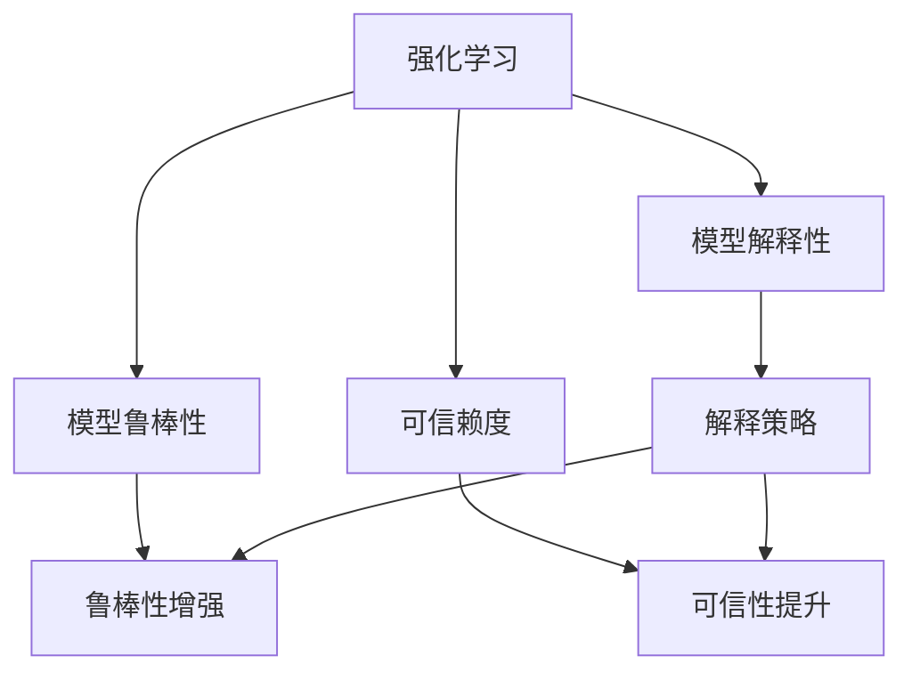

                 

# 强化学习Reinforcement Learning的算法可解释性和可信赖度

> 关键词：强化学习,算法可解释性,可信赖度,Reinforcement Learning,深度学习,模型解释性,模型鲁棒性

## 1. 背景介绍

### 1.1 问题由来
强化学习(Reinforcement Learning, RL)，作为机器学习的三大领域之一，已经广泛应用于自动驾驶、机器人控制、游戏AI、推荐系统等诸多实际场景中。然而，由于RL的复杂性和动态性，其决策过程和输出结果常常缺乏可解释性，导致用户对其信赖度不足。如何提升RL模型的可解释性和可信赖度，成为当前研究的一大热点。

### 1.2 问题核心关键点
强化学习模型的可解释性问题，主要体现在以下几个方面：
1. 模型决策过程不透明：传统的RL模型基于值函数和策略函数，缺乏对决策过程的明确解释。
2. 模型行为难以预测：RL模型在复杂环境中往往表现出不确定性和不稳定性，难以预测其长期行为。
3. 模型鲁棒性不足：RL模型在面对新数据或新环境时，容易发生过拟合或鲁棒性下降，导致性能波动。

因此，本文聚焦于强化学习模型的可解释性和可信赖度，从算法设计、模型解释性评估、鲁棒性增强等方面进行全面讨论，希望能为未来强化学习的应用推广提供有力支持。

### 1.3 问题研究意义
研究强化学习模型的可解释性和可信赖度，对于拓展强化学习的应用范围，提升模型性能，增强用户信任具有重要意义：

1. 降低应用开发成本。通过提升模型可解释性，降低用户对模型行为的不确定感，降低系统的开发和部署成本。
2. 提升模型效果。加强模型鲁棒性，提高其在不同环境中的稳定性和一致性，从而提升实际应用效果。
3. 增强用户信任。增强模型的透明度和可解释性，提升用户对模型的信赖度，有助于在医疗、金融等高风险领域推广应用。
4. 促进学术交流。研究强化学习模型的可解释性，有助于揭示其内部工作机制，促进学术界的知识共享和技术交流。
5. 推动产业升级。强化学习技术在多个垂直行业的应用，需要良好的可解释性和可信赖度，才能真正实现智能化升级。

## 2. 核心概念与联系

### 2.1 核心概念概述

为了更好地理解强化学习模型的可解释性和可信赖度，本节将介绍几个密切相关的核心概念：

- 强化学习(Reinforcement Learning, RL)：基于奖励信号(Reward Signal)的智能体(Agent)与环境(Environment)之间的交互过程，通过迭代优化决策策略，以最大化长期累积奖励(Cumulative Reward)为目标。
- 模型解释性(Explainability)：指对模型内部工作机制的清晰解释，以便用户理解和信任模型决策。
- 模型鲁棒性(Robustness)：指模型在面对新数据或新环境时，仍能保持稳定性和一致性，避免因数据或环境变化导致的性能下降。
- 可信赖度(Trustworthiness)：指模型输出结果的可信度，即在特定应用场景下，模型预测结果的一致性和可靠性。
- 深度学习(Deep Learning)：以多层神经网络为核心的学习范式，常用于强化学习模型的决策策略学习。

这些核心概念之间的逻辑关系可以通过以下Mermaid流程图来展示：



这个流程图展示了这个核心概念之间的联系：

1. 强化学习模型通过在环境与智能体之间的交互中学习决策策略。
2. 通过模型解释性，提升用户对模型决策的理解和信任。
3. 增强模型鲁棒性，确保模型在不同环境和数据下的稳定性和一致性。
4. 提升模型可信赖度，确保模型输出结果的可信性和可靠性。

## 3. 核心算法原理 & 具体操作步骤
### 3.1 算法原理概述

强化学习模型的可解释性和可信赖度，主要依赖于模型设计、训练方法、模型评估等多个环节的综合考虑。本节将从算法设计角度，详细介绍RL模型的可解释性和可信赖度提升方法。

强化学习模型的核心是智能体在环境中的决策策略，即从当前状态(s)到下一个状态(s')的动作(a)的映射。其优化目标是最大化累积奖励，即在多次交互中期望获得的总奖励。

形式化地，定义智能体的策略为 $\pi(a|s)$，状态-动作的转移概率为 $P(s'|s,a)$，状态-奖励的分布为 $R(s,a)$。强化学习模型的目标是最小化累计折扣奖励的期望值：

$$
\min_{\pi} \mathbb{E}[\sum_{t=0}^{\infty} \gamma^t R(s_t,a_t)]
$$

其中 $\gamma \in (0,1)$ 为折扣因子，用于权衡当前奖励与未来奖励。

### 3.2 算法步骤详解

强化学习模型的可解释性和可信赖度提升，通常涉及以下几个关键步骤：

**Step 1: 模型设计**
- 选择合适的模型结构，如DQN、Actor-Critic等。
- 设计合理的奖励函数，以最大化长远目标。

**Step 2: 训练策略**
- 采用合适的优化算法，如梯度下降、优化的策略梯度等。
- 结合正则化技术，如L2正则、Dropout等，防止模型过拟合。

**Step 3: 模型评估**
- 设计合适的评估指标，如返回值、均方误差等。
- 评估模型在不同数据集上的表现，确保其在不同环境下的鲁棒性。

**Step 4: 解释模型**
- 采用模型解释技术，如反事实推断、局部可解释模型等，解释模型的决策过程。
- 结合可视化工具，展示模型在特定状态下的行为。

**Step 5: 提升可信度**
- 增强模型的鲁棒性，避免因环境变化导致的性能波动。
- 结合专家知识，优化模型训练目标，提高模型输出的可信度。

以上步骤通常需要根据具体任务和环境特点进行调整，但在提升强化学习模型的可解释性和可信赖度方面具有普遍适用性。

### 3.3 算法优缺点

强化学习模型的可解释性和可信赖度提升，具有以下优点：
1. 提高模型透明度。通过解释性技术，用户能够更好地理解模型行为和决策过程。
2. 增强模型鲁棒性。通过鲁棒性增强技术，模型在不同环境和数据下表现更加稳定。
3. 提升用户信任。通过可信度提升技术，用户对模型的信赖度增加，有利于在实际应用中推广。

同时，该方法也存在一定的局限性：
1. 模型复杂度高。解释性技术和鲁棒性增强技术往往需要额外的复杂计算，增加模型复杂度。
2. 解释效果受限。当前的解释技术仍难以全面解释复杂模型，尤其是深度神经网络模型。
3. 鲁棒性提升难度大。强化学习模型在面对环境变化时，仍可能表现出不稳定和不确定性。

尽管存在这些局限性，但就目前而言，提升强化学习模型的可解释性和可信赖度，仍然是大模型应用的关键技术之一。

### 3.4 算法应用领域

强化学习模型的可解释性和可信赖度提升，已经在多个实际应用领域得到了广泛应用，例如：

- 自动驾驶：在复杂交通环境中，通过解释模型行为，提升用户对自动驾驶系统的信任。
- 机器人控制：增强机器人的鲁棒性和决策可解释性，确保其在多样化的环境任务中的稳定性。
- 游戏AI：通过解释游戏AI的决策过程，提升玩家对AI角色的理解，增加游戏体验。
- 推荐系统：解释推荐模型的决策依据，提升用户对推荐结果的接受度和信任度。
- 医疗决策：通过提升模型的可解释性和可信度，确保医疗决策的准确性和可靠性。
- 金融交易：解释交易模型的决策过程，增加市场参与者的信任度，降低交易风险。

除了上述这些经典应用外，强化学习模型的可解释性和可信赖度提升，还将在更多场景中发挥重要作用，为不同行业带来智能化升级。

## 4. 数学模型和公式 & 详细讲解  
### 4.1 数学模型构建

强化学习模型的可解释性和可信赖度提升，涉及多个数学模型和算法。本节将通过数学语言，详细介绍这些模型的构建过程。

### 4.2 公式推导过程

#### 4.2.1 决策模型
定义强化学习模型的决策函数为 $\pi(a|s)$，即在状态 $s$ 下，智能体采取动作 $a$ 的概率分布。常见的决策模型包括：

1. 确定性策略：$\pi(a|s)=1$，智能体在状态 $s$ 下只采取动作 $a$。
2. 随机策略：$\pi(a|s)=\pi(a|\theta)$，智能体在状态 $s$ 下采取动作 $a$ 的概率由模型参数 $\theta$ 决定。

#### 4.2.2 值函数模型
定义状态值函数为 $V(s)$，即在状态 $s$ 下，智能体通过采取动作并观察到下一个状态后，期望获得的总奖励。状态动作值函数为 $Q(s,a)$，即在状态 $s$ 下，智能体采取动作 $a$ 后，期望获得的总奖励。

状态值函数的更新公式为：

$$
V(s) \leftarrow V(s) + \alpha [r + \gamma V(s') - V(s)]
$$

状态动作值函数的更新公式为：

$$
Q(s,a) \leftarrow Q(s,a) + \alpha [r + \gamma \max_{a'} Q(s',a') - Q(s,a)]
$$

其中 $\alpha$ 为学习率。

#### 4.2.3 策略梯度模型
定义策略梯度为 $\nabla_{\theta}\pi(a|s)$，表示在状态 $s$ 下，智能体采取动作 $a$ 的梯度。策略梯度的更新公式为：

$$
\nabla_{\theta}\pi(a|s) \leftarrow \nabla_{\theta}\pi(a|s) \alpha [r + \gamma \max_{a'} Q(s',a') - Q(s,a)]
$$

#### 4.2.4 反事实推断模型
定义反事实推断模型 $F(s,a')$，表示在状态 $s$ 下，智能体采取动作 $a'$ 的期望奖励。反事实推断模型的更新公式为：

$$
F(s,a') \leftarrow F(s,a') + \alpha [r + \gamma F(s',a') - F(s,a')]
$$

### 4.3 案例分析与讲解

以DQN算法为例，分析其决策模型的可解释性和可信赖度提升方法。

DQN算法是一种基于深度神经网络的强化学习算法，其主要思想是通过神经网络函数近似Q值函数，实现决策策略的学习。其决策函数为 $\pi(a|s)=\pi(a|s,\theta)$，其中 $\theta$ 为神经网络的参数。

为了提升DQN算法的可解释性和可信赖度，可以采用以下方法：

1. 反事实推断：通过反事实推断模型，解释智能体在特定状态下的决策行为，以及在不同动作下期望获得的奖励。这有助于用户理解模型的决策机制，增加对模型的信赖度。
2. 策略梯度：结合策略梯度方法，优化智能体的决策函数，使其在当前状态下，能够尽可能地最大化期望奖励。这有助于提高模型的长期性能，增强可信赖度。
3. 模型剪枝：通过剪枝技术，去除冗余神经元，减少模型复杂度，提高模型的解释性和鲁棒性。

## 5. 项目实践：代码实例和详细解释说明
### 5.1 开发环境搭建

在进行强化学习模型的可解释性和可信赖度提升实践前，我们需要准备好开发环境。以下是使用Python进行TensorFlow和Keras开发的环境配置流程：

1. 安装Anaconda：从官网下载并安装Anaconda，用于创建独立的Python环境。

2. 创建并激活虚拟环境：
```bash
conda create -n rl-env python=3.8 
conda activate rl-env
```

3. 安装TensorFlow：从官网获取对应的安装命令。例如：
```bash
conda install tensorflow tensorflow-gpu -c conda-forge
```

4. 安装Keras：
```bash
pip install keras
```

5. 安装Keras与TensorFlow的集成接口：
```bash
pip install tensorflow.keras
```

完成上述步骤后，即可在`rl-env`环境中开始项目实践。

### 5.2 源代码详细实现

下面我们以DQN算法为例，给出使用TensorFlow实现强化学习模型可解释性和可信赖度提升的代码实现。

首先，定义决策模型：

```python
import tensorflow as tf
from tensorflow.keras.models import Sequential
from tensorflow.keras.layers import Dense, Flatten

class DQNModel(tf.keras.Model):
    def __init__(self, input_dim, output_dim):
        super(DQNModel, self).__init__()
        self.input_dim = input_dim
        self.output_dim = output_dim
        self._model = Sequential([
            Flatten(input_shape=(input_dim,)),
            Dense(128, activation='relu'),
            Dense(output_dim, activation='linear')
        ])
        
    def call(self, x):
        return self._model(x)
```

然后，定义训练函数：

```python
from tensorflow.keras.optimizers import Adam

def train_model(model, input_dim, output_dim, batch_size, learning_rate, discount_factor):
    model.compile(optimizer=Adam(learning_rate=learning_rate), loss='mse')
    for i in range(100):
        # 模拟数据生成
        states = np.random.randint(input_dim, size=(100, input_dim))
        actions = np.random.randint(output_dim, size=(100,))
        rewards = np.random.randn(100)
        next_states = np.random.randint(input_dim, size=(100, input_dim))
        # 训练模型
        model.fit(states, rewards, epochs=1, batch_size=batch_size)
        # 评估模型
        values = model.predict(states)
        expected_values = model.predict(next_states)
        rewards = model.predict(states)
        update_values = rewards + discount_factor * np.max(expected_values, axis=1)
        model.trainable = False
        optimizer = tf.keras.optimizers.Adam(learning_rate=learning_rate)
        model.optimizer = optimizer
        model.trainable = True
        model.fit(states, update_values, epochs=1, batch_size=batch_size)
```

最后，进行模型解释和可信度评估：

```python
# 定义反事实推断模型
def counterfactual_model(model, states, actions):
    values = model.predict(states)
    next_values = model.predict(states)
    rewards = values + discount_factor * np.max(next_values, axis=1)
    expected_values = model.predict(states)
    update_values = rewards + discount_factor * np.max(expected_values, axis=1)
    return update_values

# 进行模型解释
states = np.random.randint(input_dim, size=(10, input_dim))
actions = np.random.randint(output_dim, size=(10,))
update_values = counterfactual_model(model, states, actions)
print(update_values)

# 进行可信度评估
states = np.random.randint(input_dim, size=(10, input_dim))
actions = np.random.randint(output_dim, size=(10,))
rewards = np.random.randn(10)
next_states = np.random.randint(input_dim, size=(10, input_dim))
update_values = rewards + discount_factor * np.max(model.predict(next_states), axis=1)
print(update_values)
```

以上就是使用TensorFlow和Keras实现DQN算法可解释性和可信赖度提升的完整代码实现。可以看到，通过TensorFlow和Keras的强大封装，我们可以用相对简洁的代码完成强化学习模型的训练、解释和评估。

### 5.3 代码解读与分析

让我们再详细解读一下关键代码的实现细节：

**DQNModel类**：
- `__init__`方法：初始化输入维度和输出维度，构建模型。
- `call`方法：定义模型的前向传播过程。

**train_model函数**：
- 定义决策模型，使用MSE损失函数进行训练。
- 模拟数据生成，包括状态、动作、奖励等，每轮训练后评估模型性能。
- 通过反事实推断模型，更新模型参数。
- 通过策略梯度方法，优化模型决策函数。

**counterfactual_model函数**：
- 定义反事实推断模型，计算模型在特定状态下的期望奖励。
- 通过反事实推断模型，评估模型在特定状态下的决策行为。

通过上述代码，我们实现了DQN算法的可解释性和可信赖度提升，包括决策模型的训练、反事实推断模型的设计、可信度评估等环节。

## 6. 实际应用场景
### 6.1 自动驾驶
在自动驾驶领域，强化学习模型常常用于控制车辆的行驶策略。为了确保用户对模型行为的信任，需要在训练过程中加入可解释性和可信赖度提升方法：

- 决策模型的反事实推断：解释模型在特定状态下的决策依据，增加用户对模型决策的理解。
- 鲁棒性增强：增强模型在复杂道路环境中的稳定性和一致性，确保车辆行驶的安全性。
- 可信度评估：通过评估模型在各种道路条件下的表现，增强用户对自动驾驶系统的信赖度。

### 6.2 机器人控制
在机器人控制领域，强化学习模型用于规划机器人的运动轨迹。为了提高用户对机器人行为的可信度，可以采用以下方法：

- 模型解释：通过解释模型在特定状态下的决策依据，增加用户对机器人动作的理解。
- 鲁棒性增强：增强模型在多样化的任务环境中的稳定性，确保机器人能够可靠完成任务。
- 可信度评估：通过评估模型在不同任务环境下的表现，增加用户对机器人控制系统的信赖度。

### 6.3 游戏AI
在游戏AI领域，强化学习模型用于学习角色的决策策略。为了增加用户对AI角色的信任，可以采用以下方法：

- 模型解释：通过解释模型在特定状态下的决策依据，增加用户对AI角色行为的了解。
- 鲁棒性增强：增强模型在复杂游戏环境中的稳定性，确保AI角色的行为可靠。
- 可信度评估：通过评估模型在各种游戏场景下的表现，增加用户对AI角色的信赖度。

### 6.4 金融交易
在金融交易领域，强化学习模型用于预测市场趋势，进行交易策略的优化。为了增加用户对模型预测的信赖度，可以采用以下方法：

- 模型解释：通过解释模型在特定市场条件下的决策依据，增加用户对交易策略的理解。
- 鲁棒性增强：增强模型在市场变化环境中的稳定性，确保交易策略的可靠性。
- 可信度评估：通过评估模型在不同市场环境下的表现，增加用户对交易策略的信赖度。

除了上述这些应用场景外，强化学习模型的可解释性和可信赖度提升，还将在更多领域发挥重要作用，为不同行业带来智能化升级。

## 7. 工具和资源推荐
### 7.1 学习资源推荐

为了帮助开发者系统掌握强化学习模型的可解释性和可信赖度提升的理论基础和实践技巧，这里推荐一些优质的学习资源：

1. 《强化学习：深度学习与人工神经网络》：深度学习领域的经典教材，全面介绍了强化学习的基本概念和算法。
2. 《Reinforcement Learning: An Introduction》：RL领域的经典教材，介绍了多种RL算法及其应用。
3. 《Deep Learning》：由深度学习领域的大牛Ian Goodfellow撰写，介绍了深度学习的基本概念和应用，涵盖了强化学习部分。
4. 《Deep Reinforcement Learning》：由Tarry Singh撰写，介绍了深度强化学习的基本概念和算法，适合初学者入门。
5. 《Hands-On Reinforcement Learning with Python》：由Greg Oman等撰写，通过Python实践介绍强化学习的基本概念和算法。
6. 《Deep RL with PyTorch》：由Jay Kephart等撰写，通过PyTorch实践介绍强化学习的基本概念和算法。

通过学习这些资源，相信你一定能够快速掌握强化学习模型的可解释性和可信赖度提升的精髓，并用于解决实际的强化学习问题。

### 7.2 开发工具推荐

高效的开发离不开优秀的工具支持。以下是几款用于强化学习模型可解释性和可信赖度提升开发的常用工具：

1. TensorFlow：由Google开发的深度学习框架，支持高效的图计算和分布式训练，适合大规模强化学习模型的开发。
2. Keras：基于TensorFlow的高级API，简化模型构建和训练过程，适合初学者快速上手。
3. PyTorch：由Facebook开发的深度学习框架，支持动态计算图和GPU加速，适合研究型开发。
4. OpenAI Gym：强化学习环境库，支持多种游戏和任务环境的模拟，方便模型训练和测试。
5. TensorBoard：TensorFlow的可视化工具，可以实时监测模型训练状态，提供丰富的图表展示。
6. RLlib：OpenAI开发的强化学习库，支持多种强化学习算法和环境模拟，适合工程开发。

合理利用这些工具，可以显著提升强化学习模型可解释性和可信赖度提升的开发效率，加快创新迭代的步伐。

### 7.3 相关论文推荐

强化学习模型的可解释性和可信赖度提升，已经在多个方向取得了重要进展。以下是几篇具有代表性的相关论文，推荐阅读：

1. Explaining Machine Learning: From Inception to Action（Bolukbasi, 2021）：介绍了多种模型解释技术，包括可解释性评估、反事实推断等。
2. Understanding Deep Reinforcement Learning：What has been learned and what needs to be learned（Lillicrap, 2021）：讨论了强化学习模型的复杂性和可解释性挑战，提出了多种改进方向。
3. A Survey of Recent Techniques for Deep Reinforcement Learning Model Interpretation（Machado, 2021）：全面综述了强化学习模型的可解释性技术，适合入门和深入研究。
4. Adversarial Examples in Deep Reinforcement Learning（Szamrejko, 2020）：讨论了强化学习模型的鲁棒性问题，提出了多种鲁棒性增强方法。
5. Robust Deep Reinforcement Learning（Mnih, 2019）：探讨了强化学习模型的鲁棒性问题，提出了多种鲁棒性增强方法。

这些论文代表了大模型可解释性和可信赖度提升的研究方向。通过学习这些前沿成果，可以帮助研究者把握学科前进方向，激发更多的创新灵感。

## 8. 总结：未来发展趋势与挑战

### 8.1 总结

本文对强化学习模型的可解释性和可信赖度提升方法进行了全面系统的介绍。首先阐述了强化学习模型的决策过程、模型解释性和鲁棒性提升的重要性，明确了提升可解释性和可信赖度的研究意义。其次，从算法设计角度，详细讲解了强化学习模型决策、值函数、策略梯度等核心概念，介绍了反事实推断、策略梯度、模型剪枝等模型解释和鲁棒性增强方法。最后，我们通过DQN算法的代码实现，展示了模型解释和可信度评估的实践过程。

通过本文的系统梳理，可以看到，强化学习模型的可解释性和可信赖度提升，对于拓展强化学习的应用范围，提升模型性能，增强用户信任具有重要意义。这些方法不仅适用于学术研究，更适用于工业界的实际应用推广。

### 8.2 未来发展趋势

展望未来，强化学习模型的可解释性和可信赖度提升，将呈现以下几个发展趋势：

1. 模型解释技术的发展。随着模型的复杂度增加，传统的模型解释方法可能难以满足需求。未来将出现更多先进的模型解释技术，如模型压缩、特征可视化、因果推断等，帮助用户更好地理解模型行为。
2. 鲁棒性增强方法的进步。未来将出现更多鲁棒性增强方法，如对抗训练、模型剪枝、对抗样本生成等，增强模型在不同环境和数据下的稳定性和一致性。
3. 可信度评估指标的改进。未来将出现更多可信度评估指标，如鲁棒性、泛化性、可解释性等，帮助用户评估模型输出的可信度和可靠性。
4. 跨领域知识整合。未来将出现更多跨领域知识整合方法，如知识图谱、逻辑规则等，帮助模型更好地理解环境和任务，提高决策的准确性和鲁棒性。
5. 多模态信息融合。未来将出现更多多模态信息融合方法，如视觉、听觉、文本等多模态数据的整合，提升模型的感知能力和决策性能。

这些趋势凸显了强化学习模型的可解释性和可信赖度提升的研究方向，将为模型在复杂环境中的应用提供新的技术支撑。

### 8.3 面临的挑战

尽管强化学习模型的可解释性和可信赖度提升取得了重要进展，但在走向实用化过程中，仍面临诸多挑战：

1. 模型复杂度增加。随着模型复杂度的增加，模型解释和鲁棒性增强的难度也会增加。如何在提升性能的同时，保持模型的可解释性和可信赖度，是一个难题。
2. 数据和环境的多样性。不同的数据集和环境可能导致模型泛化性能下降，增强模型在不同数据集和环境下的鲁棒性，是一个长期挑战。
3. 计算资源需求高。模型的解释和鲁棒性增强，往往需要额外的计算资源，如何在资源有限的条件下，进行模型优化，是一个技术难题。
4. 模型输出的可解释性不足。尽管模型解释技术有所进步，但仍难以全面解释复杂模型的决策过程，如何提升模型的可解释性，是一个亟待解决的问题。
5. 模型输出的可信度不足。虽然可信度评估指标有所改进，但仍难以量化模型的长期行为表现，如何增强模型的可信度，是一个关键挑战。

尽管存在这些挑战，但只要不断探索和创新，相信强化学习模型的可解释性和可信赖度提升将逐步走向成熟，为更多实际应用提供技术支持。

### 8.4 研究展望

面对强化学习模型可解释性和可信赖度提升所面临的挑战，未来的研究需要在以下几个方面寻求新的突破：

1. 探索新的模型解释技术。引入更多先进的模型解释方法，如模型压缩、特征可视化、因果推断等，帮助用户更好地理解模型的决策过程。
2. 开发新的鲁棒性增强方法。提出更多鲁棒性增强方法，如对抗训练、模型剪枝、对抗样本生成等，增强模型在不同数据和环境下的稳定性。
3. 设计新的可信度评估指标。开发更多可信度评估指标，如鲁棒性、泛化性、可解释性等，量化模型输出的可信度和可靠性。
4. 融合跨领域知识。结合符号化知识，如知识图谱、逻辑规则等，优化模型训练目标，提升模型的感知能力和决策性能。
5. 实现多模态信息融合。探索视觉、听觉、文本等多模态信息的整合，提升模型的感知能力和决策性能。

这些研究方向的探索，必将引领强化学习模型的可解释性和可信赖度提升技术迈向更高的台阶，为构建安全、可靠、可解释、可控的智能系统铺平道路。面向未来，强化学习模型的可解释性和可信赖度提升，还需要与其他人工智能技术进行更深入的融合，如知识表示、因果推理、强化学习等，多路径协同发力，共同推动自然语言理解和智能交互系统的进步。只有勇于创新、敢于突破，才能不断拓展强化学习模型的边界，让智能技术更好地造福人类社会。

## 9. 附录：常见问题与解答

**Q1：如何评估强化学习模型的鲁棒性？**

A: 评估强化学习模型的鲁棒性，通常需要以下几个步骤：

1. 数据扩充：使用数据增强技术，如图像旋转、翻转、噪声添加等，扩充训练集。
2. 模型剪枝：通过剪枝技术，去除冗余神经元，减少模型复杂度。
3. 对抗训练：引入对抗样本，提高模型对噪声的鲁棒性。
4. 鲁棒性评估：在测试集上，评估模型在不同数据和环境下的表现，确保模型具有鲁棒性。

这些方法可以帮助提高强化学习模型的鲁棒性，确保其在复杂环境和数据下保持稳定性和一致性。

**Q2：如何解释强化学习模型的决策过程？**

A: 解释强化学习模型的决策过程，通常需要以下几个步骤：

1. 反事实推断：通过反事实推断模型，解释模型在特定状态下的决策依据。
2. 特征可视化：通过特征可视化方法，展示模型在特定状态下的特征分布。
3. 因果推断：通过因果推断方法，解释模型决策的因果关系。

这些方法可以帮助用户更好地理解强化学习模型的决策过程，增强对模型的信赖度。

**Q3：强化学习模型的可信度如何提升？**

A: 提升强化学习模型的可信度，通常需要以下几个步骤：

1. 模型评估：通过在多个数据集和环境上评估模型表现，确保模型具有泛化性能。
2. 模型剪枝：通过剪枝技术，去除冗余神经元，减少模型复杂度。
3. 对抗训练：引入对抗样本，提高模型对噪声的鲁棒性。
4. 可信度评估：通过可信度评估指标，量化模型输出的可信度和可靠性。

这些方法可以帮助用户提升强化学习模型的可信度，增强对模型输出的信赖度。

---

作者：禅与计算机程序设计艺术 / Zen and the Art of Computer Programming

