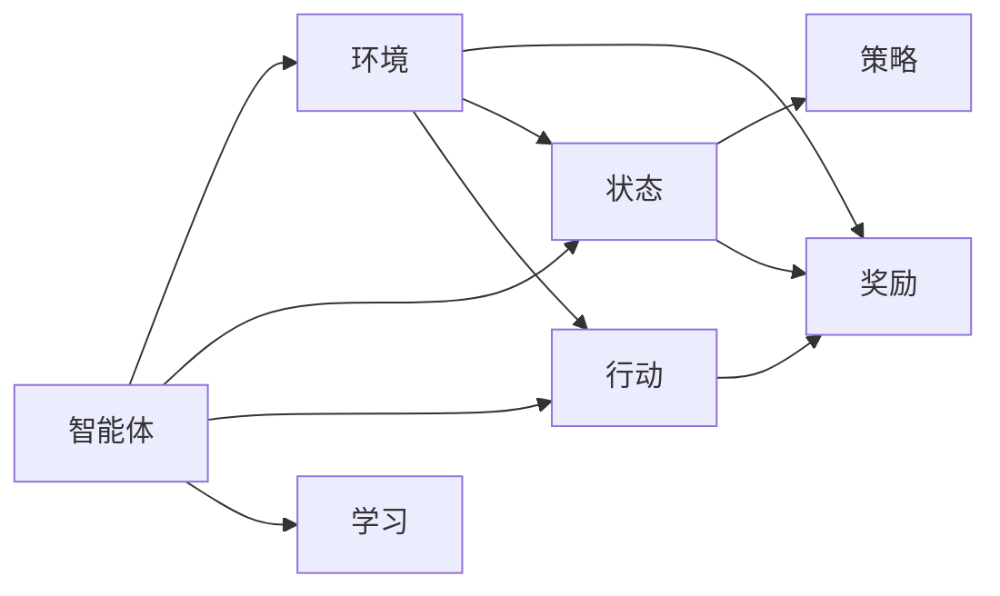

                 

## 1. 背景介绍

### 1.1 问题由来

强化学习（Reinforcement Learning, RL）是人工智能（AI）领域中的一个重要分支，旨在通过试错过程学习智能体（agent）在特定环境中达成目标的策略。在过去几十年中，强化学习在机器人、自动驾驶、游戏AI、自然语言处理等领域取得了诸多突破性进展。与此同时，深度学习的兴起为强化学习带来了新的活力，尤其是深度强化学习（Deep Reinforcement Learning, DRL），使得机器能够通过大量数据自动优化策略，在复杂环境中取得优异性能。

然而，深度强化学习仍然存在一些挑战。例如，深度学习模型的复杂性导致其难以解释，易于过拟合，以及在处理稀疏奖励信号时表现不佳。这些问题限制了深度强化学习的应用范围，特别是在需要精确决策的领域，如医疗、金融和航空航天等。

### 1.2 问题核心关键点

强化学习的主要挑战在于以下几个方面：

- **模型复杂性**：深度强化学习模型通常包含数百万或亿计的参数，这使得模型的解释性变得非常困难，也增加了过拟合的风险。
- **稀疏奖励问题**：在许多实际应用中，智能体需要很长时间才能接收到奖励信号，这使得强化学习的学习效率低下。
- **样本效率**：在训练过程中，智能体需要收集大量的经验数据来优化策略，这在实际应用中往往是不现实的。
- **策略优化**：智能体需要找到一个能够平衡探索和利用的策略，这需要高效的策略更新算法。

尽管存在这些挑战，强化学习仍然是一个充满活力的研究领域，未来有望在更多实际应用中发挥重要作用。

### 1.3 问题研究意义

研究强化学习对于推动AI技术的进步具有重要意义：

- **自动化决策**：强化学习可以用于自动化决策过程，减少人为干预，提高决策效率和质量。
- **智能优化**：强化学习可以应用于复杂的优化问题，如机器学习模型的超参数优化，自动搜索空间。
- **系统控制**：强化学习可以用于机器人、自动驾驶等系统控制，提升系统的自主性和稳定性。
- **智能游戏**：强化学习在游戏AI中取得了显著成效，如AlphaGo、星际争霸等，为AI竞赛带来了新的视角。
- **社会互动**：强化学习可以用于构建更智能的社交系统和推荐系统，提升用户体验和互动效果。

## 2. 核心概念与联系

### 2.1 核心概念概述

强化学习涉及以下几个核心概念：

- **智能体（Agent）**：执行行动以影响环境的实体。
- **环境（Environment）**：智能体进行交互的外部世界。
- **状态（State）**：描述环境的当前状态，智能体需要基于当前状态做出决策。
- **行动（Action）**：智能体可以采取的行动。
- **奖励（Reward）**：环境对智能体行动的反馈，指导智能体如何改进策略。
- **策略（Policy）**：智能体采取行动的规则或概率分布。

这些概念之间的联系可以通过以下Mermaid流程图来展示：



这个流程图展示了一个简单的强化学习过程：智能体在环境中执行行动，环境根据行动提供奖励，智能体根据奖励更新策略。

## 3. 核心算法原理 & 具体操作步骤

### 3.1 算法原理概述

强化学习的基本目标是找到最优策略，使得智能体在特定环境中最大化长期奖励。算法原理通常包括四个主要步骤：

1. **探索-利用（Exploration-Exploitation）**：智能体需要在探索新状态和利用已知的良好状态之间进行权衡。
2. **价值函数（Value Function）**：价值函数用于估计状态或行动的价值，指导智能体选择最优行动。
3. **策略更新（Policy Update）**：根据价值函数更新策略，以提高智能体的性能。
4. **学习算法**：通过与环境交互收集数据，并使用学习算法更新价值函数和策略。

### 3.2 算法步骤详解

#### 3.2.1 探索-利用

探索-利用问题可以通过ε-贪心策略解决。ε-贪心策略随机选择一个行动，概率为ε，其他时间则选择当前状态下的最优行动。这使得智能体能够在探索新状态和利用已知状态之间找到平衡。

#### 3.2.2 价值函数

价值函数是强化学习的核心组成部分。常见的价值函数包括状态价值函数（State Value Function）和行动价值函数（Action Value Function）。

状态价值函数估计当前状态的长期奖励，表示为：

$$
V(s) = \mathbb{E}\left[\sum_{t=0}^{\infty}\gamma^t r_t \mid s_0=s\right]
$$

其中，$r_t$ 是时间步 $t$ 的奖励，$\gamma$ 是折扣因子。

行动价值函数估计在特定状态下采取特定行动的长期奖励，表示为：

$$
Q(s,a) = \mathbb{E}\left[\sum_{t=0}^{\infty}\gamma^t r_t \mid s_0=s, a_0=a\right]
$$

状态价值函数和行动价值函数可以通过贝尔曼方程（Bellman Equation）进行迭代计算：

$$
V(s) = r(s) + \gamma \max_a Q(s,a)
$$

$$
Q(s,a) = r(s,a) + \gamma \max_{a'} Q(s',a')
$$

其中，$r(s)$ 和 $r(s,a)$ 是当前状态和行动的奖励，$s'$ 是采取行动 $a$ 后的下一个状态。

#### 3.2.3 策略更新

策略更新通过最大化长期奖励来更新智能体的策略。常见的策略更新算法包括Q-learning和SARSA（State-Action-Reward-State-Action）。

Q-learning算法通过更新行动价值函数来实现策略更新，表示为：

$$
Q(s,a) \leftarrow Q(s,a) + \alpha(r + \gamma \max Q(s',a') - Q(s,a))
$$

其中，$\alpha$ 是学习率。

SARSA算法通过更新状态-行动价值函数来实现策略更新，表示为：

$$
Q(s,a) \leftarrow Q(s,a) + \alpha(r + \gamma Q(s',a') - Q(s,a))
$$

其中，$(s', a')$ 是采取行动 $a$ 后的下一个状态和行动。

#### 3.2.4 学习算法

常用的强化学习算法包括Q-learning、SARSA、Deep Q-Network（DQN）等。其中，DQN算法通过使用神经网络来逼近行动价值函数，解决了深度强化学习中的样本效率问题。

DQN算法的主要步骤如下：

1. 收集环境数据，包括状态、行动、奖励等。
2. 使用神经网络逼近行动价值函数 $Q(s,a)$。
3. 在每个时间步 $t$，智能体根据策略 $\epsilon$-贪心选择行动 $a_t$。
4. 更新神经网络参数，通过经验回放（Experience Replay）收集历史数据。
5. 通过目标网络更新行动价值函数。

### 3.3 算法优缺点

强化学习的优点包括：

- **非监督学习**：强化学习不需要大量的标注数据，只需与环境交互。
- **自适应**：强化学习可以自动适应环境变化，优化策略。
- **广泛应用**：强化学习可以应用于各种领域，如游戏、机器人、自动驾驶等。

强化学习的缺点包括：

- **高维度状态空间**：在复杂环境中，状态空间可能非常庞大，导致算法难以优化。
- **样本效率低**：强化学习需要大量数据进行训练，且往往难以收敛。
- **过拟合风险**：神经网络容易过拟合，导致策略不稳定。
- **延迟奖励问题**：在许多实际应用中，智能体需要很长时间才能接收到奖励信号，学习效率低下。

### 3.4 算法应用领域

强化学习已经在多个领域取得了显著进展，具体包括：

- **游戏AI**：AlphaGo、AlphaStar等算法通过强化学习在围棋、星际争霸等游戏中取得了超越人类的成绩。
- **机器人控制**：强化学习在机器人路径规划、运动控制、协作操作等方面有广泛应用。
- **自动驾驶**：强化学习可以用于自动驾驶中的路径规划、交通决策等问题。
- **自然语言处理**：强化学习可以用于文本生成、对话系统、语音识别等领域。
- **金融交易**：强化学习可以用于股票交易、风险管理等金融领域。
- **推荐系统**：强化学习可以用于推荐系统中的个性化推荐和广告投放等问题。

## 4. 数学模型和公式 & 详细讲解 & 举例说明

### 4.1 数学模型构建

强化学习可以通过数学模型来描述智能体的学习过程。常见的数学模型包括马尔可夫决策过程（MDP）和部分可观测马尔可夫决策过程（POMDP）。

MDP模型由以下元素组成：

- **状态空间 $S$**：所有可能的状态。
- **行动空间 $A$**：所有可采取的行动。
- **状态转移概率 $P(s'|s,a)$**：从状态 $s$ 采取行动 $a$ 后转移到状态 $s'$ 的概率。
- **奖励函数 $r(s,a)$**：采取行动 $a$ 在状态 $s$ 下的奖励。
- **折扣因子 $\gamma$**：未来奖励的折扣系数。

MDP模型的价值函数可以表示为：

$$
V(s) = \mathbb{E}\left[\sum_{t=0}^{\infty}\gamma^t r_t \mid s_0=s\right]
$$

行动价值函数可以表示为：

$$
Q(s,a) = \mathbb{E}\left[\sum_{t=0}^{\infty}\gamma^t r_t \mid s_0=s, a_0=a\right]
$$

### 4.2 公式推导过程

#### 4.2.1 Q-learning

Q-learning算法通过迭代更新行动价值函数来实现策略更新。其核心公式为：

$$
Q(s,a) \leftarrow Q(s,a) + \alpha(r + \gamma \max Q(s',a') - Q(s,a))
$$

其中，$r$ 是当前状态和行动的奖励，$s'$ 是采取行动 $a$ 后的下一个状态，$a'$ 是采取行动 $a$ 后的下一个行动，$\alpha$ 是学习率。

#### 4.2.2 DQN

DQN算法通过神经网络逼近行动价值函数，解决了深度强化学习中的样本效率问题。其核心公式为：

$$
Q(s,a) \leftarrow Q(s,a) + \alpha(r + \gamma Q(s',a') - Q(s,a))
$$

其中，$r$ 是当前状态和行动的奖励，$s'$ 是采取行动 $a$ 后的下一个状态，$a'$ 是采取行动 $a$ 后的下一个行动，$\alpha$ 是学习率。

### 4.3 案例分析与讲解

#### 4.3.1 游戏AI

AlphaGo是强化学习在游戏AI领域的经典应用之一。AlphaGo通过两个神经网络来表示策略和价值函数，使用蒙特卡洛树搜索（Monte Carlo Tree Search, MCTS）来优化策略。

AlphaGo的具体步骤如下：

1. 初始化游戏状态。
2. 使用策略网络生成每个动作的概率分布。
3. 通过MCTS模拟从当前状态开始的游戏，并根据模拟结果更新价值函数。
4. 选择当前策略下最优的动作。
5. 更新状态，重复步骤2-4，直到游戏结束。

#### 4.3.2 机器人控制

强化学习在机器人控制领域也有广泛应用。例如，DeepMind开发的Petting Zoo中，通过强化学习训练一个智能体，使其能够控制机械臂完成简单的任务，如抓握、移动等。

在Petting Zoo中，智能体通过与环境的交互学习最优策略，使用神经网络逼近价值函数和策略函数，通过经验回放（Experience Replay）提高学习效率。

## 5. 项目实践：代码实例和详细解释说明

### 5.1 开发环境搭建

在进行强化学习项目实践前，需要准备好开发环境。以下是使用Python进行TensorFlow和OpenAI Gym开发的环境配置流程：

1. 安装Anaconda：从官网下载并安装Anaconda，用于创建独立的Python环境。

2. 创建并激活虚拟环境：
```bash
conda create -n rl-env python=3.8 
conda activate rl-env
```

3. 安装必要的库：
```bash
pip install tensorflow gym gym-super-mario
```

4. 安装TensorFlow：从官网获取对应的安装命令。例如：
```bash
pip install tensorflow-gpu==2.4
```

5. 安装OpenAI Gym：
```bash
pip install gym
```

完成上述步骤后，即可在`rl-env`环境中开始强化学习实践。

### 5.2 源代码详细实现

这里我们以经典环境Super Mario为例，展示如何使用TensorFlow和OpenAI Gym实现DQN算法。

首先，导入必要的库：

```python
import numpy as np
import tensorflow as tf
import gym
```

然后，定义DQN模型：

```python
class DQNModel(tf.keras.Model):
    def __init__(self, state_dim, action_dim, learning_rate=0.001):
        super(DQNModel, self).__init__()
        self.fc1 = tf.keras.layers.Dense(128, activation='relu', input_dim=state_dim)
        self.fc2 = tf.keras.layers.Dense(128, activation='relu')
        self.fc3 = tf.keras.layers.Dense(action_dim, activation='linear')
        self.learning_rate = learning_rate
    
    def call(self, inputs):
        x = self.fc1(inputs)
        x = self.fc2(x)
        q_values = self.fc3(x)
        return q_values

model = DQNModel(state_dim=24, action_dim=4)
```

接着，定义经验回放和策略选择函数：

```python
class ExperienceReplay:
    def __init__(self, buffer_size=1000):
        self.buffer_size = buffer_size
        self.memory = []
    
    def add(self, state, action, reward, next_state, done):
        if len(self.memory) < self.buffer_size:
            self.memory.append([state, action, reward, next_state, done])
        else:
            del self.memory[0]
            self.memory.append([state, action, reward, next_state, done])
    
    def sample(self, batch_size):
        return np.random.choice(self.memory, batch_size)
    
    def __len__(self):
        return min(len(self.memory), self.buffer_size)

def epsilon_greedy(epsilon, state):
    if np.random.rand() < epsilon:
        return np.random.randint(0, action_dim)
    else:
        q_values = model.predict(state)
        return np.argmax(q_values[0])
```

定义Q-learning算法：

```python
def q_learning(state_dim, action_dim, episode_length, learning_rate, gamma):
    state = gym.make('SuperMario-v0').reset()
    done = False
    rewards = []
    buffer = ExperienceReplay(buffer_size=10000)
    
    for episode in range(100):
        state = np.reshape(state, [1, -1])
        action = epsilon_greedy(0.1, state)
        next_state, reward, done, _ = gym.make('SuperMario-v0').step(action)
        next_state = np.reshape(next_state, [1, -1])
        buffer.add(state, action, reward, next_state, done)
        q_values = model.predict(state)
        q_values[0, action] += learning_rate * (reward + gamma * np.max(model.predict(next_state)[0]) - q_values[0, action])
        rewards.append(reward)
        state = next_state
        
        if done:
            buffer.add(state, np.random.randint(0, action_dim), 0, None, done)
            print('Episode:', episode, 'Reward:', sum(rewards))
            rewards = []
            state = gym.make('SuperMario-v0').reset()
            done = False
    
    return model, buffer
```

最后，启动训练流程：

```python
state_dim = 24
action_dim = 4
episode_length = 200
learning_rate = 0.001
gamma = 0.9

model, buffer = q_learning(state_dim, action_dim, episode_length, learning_rate, gamma)
```

以上就是使用TensorFlow和OpenAI Gym实现DQN算法的完整代码实现。可以看到，通过TensorFlow和Gym的强大封装，我们可以用相对简洁的代码完成强化学习的项目实践。

### 5.3 代码解读与分析

让我们再详细解读一下关键代码的实现细节：

**DQNModel类**：
- `__init__`方法：初始化模型层。
- `call`方法：定义前向传播计算。

**ExperienceReplay类**：
- `__init__`方法：初始化经验回放缓冲区。
- `add`方法：添加经验样本。
- `sample`方法：随机采样经验样本。
- `__len__`方法：返回缓冲区长度。

**epsilon_greedy函数**：
- 定义策略选择函数，epsilon-贪心策略。

**q_learning函数**：
- 定义Q-learning算法。

**训练流程**：
- 在每个时间步 $t$，智能体根据策略 $\epsilon$-贪心选择行动 $a_t$。
- 更新神经网络参数，通过经验回放收集历史数据。
- 通过目标网络更新行动价值函数。
- 在每个episode结束后，记录奖励并重置状态。

可以看到，TensorFlow和Gym的结合使用使得强化学习的代码实现变得简洁高效。开发者可以将更多精力放在数据处理、模型改进等高层逻辑上，而不必过多关注底层的实现细节。

当然，工业级的系统实现还需考虑更多因素，如模型的保存和部署、超参数的自动搜索、更灵活的策略选择等。但核心的Q-learning算法基本与此类似。

## 6. 实际应用场景

### 6.1 机器人控制

强化学习在机器人控制领域已经取得了显著进展。例如，Petting Zoo中，通过强化学习训练的智能体能够控制机械臂完成简单的任务。

在实际应用中，可以收集大量机器人与环境的交互数据，使用强化学习算法优化机器人控制策略。通过不断的试错，智能体可以学会更复杂的任务，如抓取、避障、协作等。

### 6.2 自动驾驶

强化学习在自动驾驶领域也有广泛应用。例如，DeepMind开发的Carla模拟器中，通过强化学习训练自动驾驶模型，使其能够完成基本的驾驶任务。

在自动驾驶中，强化学习可以用于路径规划、交通决策、障碍物避免等环节。通过与真实环境交互，智能体可以学习最优驾驶策略，提升安全性、舒适性和效率。

### 6.3 金融交易

强化学习在金融交易中也有应用前景。例如，AlphaZero等算法通过强化学习优化交易策略，在股票市场、期货市场等场景中取得了不错的效果。

在金融交易中，强化学习可以用于股票选择、交易时机、风险管理等问题。通过与市场数据交互，智能体可以学习最优的交易策略，实现自动化交易和风险控制。

### 6.4 未来应用展望

随着强化学习的不断发展，未来的应用场景将更加广泛。

- **智能制造**：通过强化学习优化生产流程，提高生产效率和质量。
- **物流配送**：通过强化学习优化配送路线，提升配送效率和用户体验。
- **智能家居**：通过强化学习优化家居设备，提升生活便捷性和舒适度。
- **医疗健康**：通过强化学习优化诊疗方案，提高诊断准确性和治疗效果。
- **社会治理**：通过强化学习优化公共服务，提升治理效能和市民满意度。

## 7. 工具和资源推荐

### 7.1 学习资源推荐

为了帮助开发者系统掌握强化学习的理论基础和实践技巧，这里推荐一些优质的学习资源：

1. 《强化学习：一种现代方法》（Reinforcement Learning: An Introduction）：由Richard S. Sutton和Andrew G. Barto撰写，全面介绍了强化学习的理论和算法。
2. CS294T《强化学习》课程：加州大学伯克利分校开设的强化学习课程，讲解了强化学习的基本概念和经典算法。
3. DeepMind博客：DeepMind官方博客，包含大量强化学习的研究和应用案例，值得深入阅读。
4. OpenAI Gym官方文档：OpenAI Gym是强化学习领域的重要工具库，提供了多种环境，便于开发者进行实验和测试。
5. TensorFlow官方文档：TensorFlow是深度学习领域的重要框架，提供了丰富的API和工具，便于开发者进行实验和部署。

通过对这些资源的学习实践，相信你一定能够快速掌握强化学习的精髓，并用于解决实际的强化学习问题。

### 7.2 开发工具推荐

高效的开发离不开优秀的工具支持。以下是几款用于强化学习开发的常用工具：

1. TensorFlow：由Google主导开发的深度学习框架，支持自动微分和优化算法，适用于强化学习任务。
2. PyTorch：由Facebook主导开发的深度学习框架，灵活易用，适用于强化学习任务。
3. OpenAI Gym：强化学习领域的重要工具库，提供了多种环境，便于开发者进行实验和测试。
4. Ray：用于分布式深度学习和强化学习的开源框架，支持大规模分布式训练和实验。
5. JAX：由Google开发的深度学习框架，支持自动微分和分布式计算，适用于强化学习任务。

合理利用这些工具，可以显著提升强化学习的开发效率，加快创新迭代的步伐。

### 7.3 相关论文推荐

强化学习的研究已经在学界取得了诸多进展，以下是几篇奠基性的相关论文，推荐阅读：

1. Q-learning：Watkins和Horn于1989年提出的Q-learning算法，是强化学习的基础算法之一。
2. DeepMind AlphaGo：DeepMind在2016年提出的AlphaGo算法，通过深度学习和强化学习在围棋中取得了超越人类的成绩。
3. Deep Reinforcement Learning：Bengio于2018年提出的深度强化学习概念，讨论了深度学习和强化学习结合的潜力。
4. DQN：Mnih等人在2015年提出的Deep Q-Network算法，解决了深度强化学习中的样本效率问题。
5. AlphaZero：DeepMind在2017年提出的AlphaZero算法，通过强化学习和蒙特卡洛树搜索在多种游戏中取得了优异的成绩。

这些论文代表了中国强化学习的发展脉络。通过学习这些前沿成果，可以帮助研究者把握学科前进方向，激发更多的创新灵感。

## 8. 总结：未来发展趋势与挑战

### 8.1 总结

本文对强化学习的原理和实践进行了全面系统的介绍。首先，阐述了强化学习的研究背景和意义，明确了强化学习在自动化决策、智能优化等领域的应用价值。其次，从原理到实践，详细讲解了强化学习的数学模型和算法步骤，给出了强化学习任务开发的完整代码实例。同时，本文还广泛探讨了强化学习在机器人控制、自动驾驶、金融交易等领域的实际应用，展示了强化学习的前景。此外，本文精选了强化学习的各类学习资源，力求为读者提供全方位的技术指引。

通过本文的系统梳理，可以看到，强化学习已经成为AI领域的重要分支，具有广泛的应用前景。其高效的学习机制、自适应能力、广泛的应用场景，使其成为解决复杂优化问题的有力工具。未来，随着技术的发展和应用的推广，强化学习必将在更多领域大放异彩。

### 8.2 未来发展趋势

强化学习的未来发展趋势主要包括以下几个方面：

1. **多智能体系统**：强化学习将在多智能体系统中得到应用，提升协作决策和团队管理的效率。
2. **可解释性**：强化学习模型的可解释性将成为重要研究方向，提升模型的透明性和可信度。
3. **混合学习**：强化学习将与其他AI技术（如深度学习、因果推断）结合，形成更加全面和高效的算法体系。
4. **迁移学习**：强化学习将应用于迁移学习，提升模型在不同领域和任务上的适应能力。
5. **联邦学习**：强化学习将在联邦学习中得到应用，提升模型在分布式环境中的优化效率。
6. **边缘计算**：强化学习将在边缘计算中得到应用，提升模型的实时性和资源利用率。

这些趋势将进一步拓展强化学习的应用范围，提升其在复杂环境中的优化能力和适应性。

### 8.3 面临的挑战

尽管强化学习已经取得了诸多进展，但仍面临诸多挑战：

1. **模型复杂性**：深度强化学习模型通常包含数百万或亿计的参数，导致模型的解释性变得困难。
2. **稀疏奖励问题**：在许多实际应用中，智能体需要很长时间才能接收到奖励信号，导致学习效率低下。
3. **样本效率低**：强化学习需要大量数据进行训练，且往往难以收敛。
4. **过拟合风险**：神经网络容易过拟合，导致策略不稳定。
5. **计算资源需求高**：强化学习需要大量计算资源进行训练和推理，对硬件设备提出了较高要求。
6. **安全性和伦理问题**：强化学习模型容易学习到有害的行为策略，导致安全性和伦理问题。

### 8.4 研究展望

面对强化学习面临的挑战，未来的研究需要在以下几个方面寻求新的突破：

1. **参数高效算法**：开发更加参数高效的强化学习算法，在固定大部分预训练参数的同时，只更新极少量的任务相关参数。
2. **稀疏奖励处理**：开发新的算法处理稀疏奖励问题，提高学习效率。
3. **多智能体协作**：研究多智能体强化学习，提升协作决策和团队管理的效果。
4. **可解释性和可信性**：研究强化学习模型的可解释性和可信性，提升模型的透明性和可信度。
5. **联邦学习和边缘计算**：研究联邦学习和边缘计算在强化学习中的应用，提升模型在分布式环境中的优化效率和实时性。
6. **安全性**：研究强化学习模型的安全性，避免学习到有害的行为策略。

这些研究方向的探索，将进一步提升强化学习的性能和应用价值，为构建安全、可靠、可解释、可控的智能系统提供新的路径。

## 9. 附录：常见问题与解答

**Q1：强化学习是否需要大量的标注数据？**

A: 强化学习不需要大量的标注数据，只需通过与环境的交互学习最优策略。但是，在实际应用中，智能体往往需要大量数据才能学习到稳定的策略，因此数据的收集和处理仍然是强化学习的重要环节。

**Q2：如何缓解强化学习中的过拟合问题？**

A: 强化学习中的过拟合问题可以通过以下方式缓解：
1. 经验回放：使用经验回放（Experience Replay）收集历史数据，减少模型过拟合风险。
2. 正则化：使用L2正则化等正则化技术，避免模型过拟合。
3. 随机策略：使用随机策略选择行动，避免策略集中于少数行动。
4. 目标网络更新：使用目标网络更新行动价值函数，避免模型过拟合。

**Q3：强化学习在多智能体系统中如何应用？**

A: 强化学习在多智能体系统中可以应用，例如，通过合作和竞争优化团队管理。具体实现方式包括：
1. 环境设计：设计多智能体环境，包含多个智能体和环境状态。
2. 策略学习：每个智能体学习自己的策略，并与其他智能体互动。
3. 协调机制：设计协调机制，使智能体能够协同工作。
4. 奖励设计：设计合理的奖励函数，引导智能体协同合作。

**Q4：强化学习在多领域中如何应用？**

A: 强化学习在多领域中有广泛应用，例如：
1. 机器人控制：通过强化学习优化机器人控制策略，提升机器人的自主性和安全性。
2. 自动驾驶：通过强化学习优化自动驾驶策略，提高驾驶效率和安全性。
3. 金融交易：通过强化学习优化交易策略，提升交易效率和风险控制。
4. 游戏AI：通过强化学习优化游戏AI，提高游戏的智能性和娱乐性。
5. 医疗健康：通过强化学习优化诊疗方案，提高诊断准确性和治疗效果。

**Q5：强化学习中的参数高效算法有哪些？**

A: 强化学习中的参数高效算法包括：
1. DQN（Deep Q-Network）：使用神经网络逼近行动价值函数，解决深度强化学习中的样本效率问题。
2. Dueling DQN：通过双脑网络（Dueling Network）优化DQN算法，提高学习效率。
3. Q-learning：经典的Q-learning算法，适用于小规模问题。
4. A3C（Asynchronous Advantage Actor-Critic）：通过异步更新算法提高训练效率。

这些算法通过优化模型结构和训练方式，减少了参数数量，提高了模型效率。

---

作者：禅与计算机程序设计艺术 / Zen and the Art of Computer Programming

