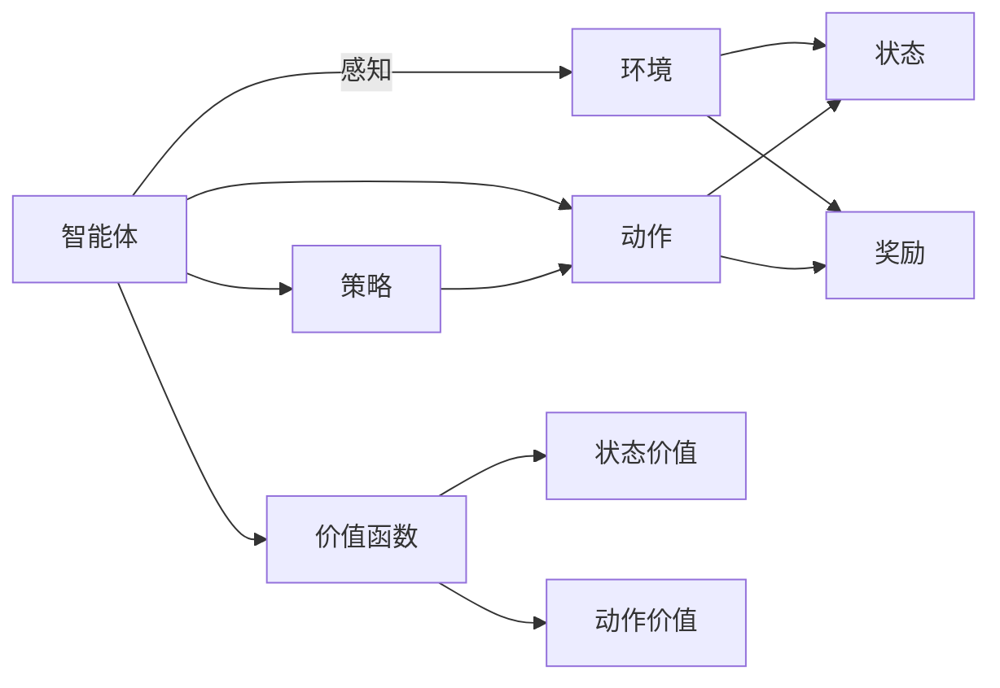

                 

# 强化学习算法：深度 Q 网络 (DQN) 原理与代码实例讲解

> 关键词：强化学习, 深度学习, 深度 Q 网络 (DQN), 蒙特卡罗方法, 经验回放 (Experience Replay), 深度学习与强化学习的结合

## 1. 背景介绍

强化学习 (Reinforcement Learning, RL) 是一种机器学习领域的重要分支，其目标是通过与环境的交互，使得智能体 (Agent) 最大化累积奖励 (Reward)。与传统的监督学习和无监督学习不同，强化学习中的智能体通过不断的试错，逐步优化决策策略，以达成特定目标。近年来，随着深度学习的融入，强化学习在游戏、机器人控制、自动驾驶等领域得到了广泛应用，显著提升了智能体的决策能力。

深度 Q 网络 (Deep Q-Network, DQN) 是强化学习中一种具有代表性的方法。DQN 通过深度神经网络来逼近 Q 值函数 (Q-value Function)，从而在未知环境中自动学习最优策略。该方法由 DeepMind 在 2015 年提出，标志着深度学习和强化学习的完美结合，并在数个经典游戏 (如 Atari) 上取得了突破性成果。DQN 的原理与实践将在这篇文章中全面介绍，并通过代码实例加以深入讲解。

## 2. 核心概念与联系

### 2.1 核心概念概述

在介绍 DQN 的原理之前，我们先来回顾一些与强化学习相关的核心概念：

- **智能体 (Agent)**：在强化学习中，智能体是决策者，它与环境进行交互，根据环境的反馈调整自身行为，以最大化累积奖励。
- **环境 (Environment)**：环境是智能体所处的外部世界，它向智能体提供状态 (State) 和奖励 (Reward)，智能体需要通过学习掌握环境的状态转换规律和奖励获取方式。
- **状态 (State)**：环境的状态是智能体可以感知到的信息，它描述了环境当前的状态，是智能体做出决策的依据。
- **动作 (Action)**：智能体的行为选择，它决定了智能体如何与环境进行交互，通常为连续或离散的变量。
- **奖励 (Reward)**：环境对智能体行为的反馈信号，用于指导智能体的行为选择，通常是标量型数值。
- **策略 (Policy)**：智能体选择动作的概率分布，用于指导智能体如何在不同状态下做出决策。
- **价值函数 (Value Function)**：用于评估状态或动作的价值，它可以是状态价值函数 (State Value Function) 或动作价值函数 (Action Value Function)。

### 2.2 核心概念原理和架构的 Mermaid 流程图

以下是一个简化的强化学习模型流程图，展示了智能体与环境之间的交互过程，以及策略更新和价值函数评估的机制：



这个图描述了智能体如何通过感知环境的状态和奖励，根据策略选择动作，并通过价值函数评估状态和动作的价值，从而在不断的试错中逐步优化策略，以最大化累积奖励。

## 3. 核心算法原理 & 具体操作步骤

### 3.1 算法原理概述

DQN 的核心思想是利用深度神经网络来逼近 Q 值函数 (Q-value Function)，从而在未知环境中自动学习最优策略。Q 值函数描述了在特定状态下，采取特定动作可以获得的累积奖励。DQN 通过以下步骤来实现 Q 值函数的逼近：

1. **经验回放 (Experience Replay)**：将智能体与环境交互过程中的状态、动作、奖励、下一个状态组成的经验元组 (Experience Tuple)，存储到经验回放记忆库中，以供后续训练使用。
2. **目标网络 (Target Network)**：为了防止目标 Q 值函数的更新对当前 Q 值函数产生过大影响，DQN 引入了目标网络，即在训练过程中，使用目标网络的输出值作为当前 Q 值函数的目标值。
3. **深度神经网络逼近 Q 值函数**：利用深度神经网络对 Q 值函数进行逼近，通过反向传播算法训练网络，最小化预测 Q 值与真实 Q 值之间的误差。
4. **更新策略**：在每个训练周期中，随机从经验回放记忆库中抽取若干个经验元组，使用当前 Q 值函数计算 Q 值，更新策略参数，以便下一次做出更好的决策。

### 3.2 算法步骤详解

以下是对 DQN 算法步骤的详细讲解：

**Step 1: 准备环境与智能体**

首先，我们需要定义一个环境 (Environment) 和一个智能体 (Agent)。在 Python 中，可以使用 Gym 库来定义各种经典环境，如 Atari 游戏环境。智能体的策略 (Policy) 可以使用深度神经网络来实现。

```python
import gym
import numpy as np
import torch
import torch.nn as nn
import torch.optim as optim

# 定义环境
env = gym.make('CartPole-v1')

# 定义策略网络
class Policy(nn.Module):
    def __init__(self, input_size, output_size):
        super(Policy, self).__init__()
        self.fc1 = nn.Linear(input_size, 64)
        self.fc2 = nn.Linear(64, output_size)

    def forward(self, x):
        x = torch.relu(self.fc1(x))
        x = self.fc2(x)
        return x

# 定义智能体
class Agent:
    def __init__(self, input_size, output_size):
        self.input_size = input_size
        self.output_size = output_size
        self.policy = Policy(input_size, output_size)

        self.optimizer = optim.Adam(self.policy.parameters(), lr=0.001)
        self.loss_fn = nn.MSELoss()

        self.target_policy = Policy(input_size, output_size)
        self.target_policy.load_state_dict(self.policy.state_dict())
        self.target_policy.eval()

    def act(self, state):
        with torch.no_grad():
            state = torch.from_numpy(state).float()
            action = self.policy(state).argmax().item()
        return action
```

**Step 2: 实现经验回放 (Experience Replay)**

经验回放是 DQN 的关键技术之一，它通过存储智能体与环境交互的经验元组，使得智能体能够在后续训练中，随机抽取历史经验，进行训练。在实际代码中，我们可以使用一个经验回放内存 (Experience Replay Memory) 来存储这些经验元组。

```python
class ExperienceReplay:
    def __init__(self, capacity):
        self.capacity = capacity
        self.memory = []
        self.position = 0

    def add(self, state, action, reward, next_state, done):
        if len(self.memory) < self.capacity:
            self.memory.append((state, action, reward, next_state, done))
        else:
            self.memory[self.position] = (state, action, reward, next_state, done)
            self.position = (self.position + 1) % self.capacity

    def sample(self, batch_size):
        return np.random.choice(len(self.memory), batch_size, replace=False)

    def __len__(self):
        return len(self.memory)
```

**Step 3: 训练智能体**

在训练过程中，我们需要循环迭代，每次从经验回放内存中抽取一定数量的经验元组，使用当前 Q 值函数计算 Q 值，并使用这些 Q 值来更新目标 Q 值函数。然后，使用目标 Q 值函数计算目标 Q 值，更新当前 Q 值函数的参数。

```python
def train(self, batch_size):
    for i in range(100):
        states, actions, rewards, next_states, dones = self.memory.sample(batch_size)

        # 将状态转换为 tensor
        states = torch.from_numpy(np.vstack(states)).float()
        next_states = torch.from_numpy(np.vstack(next_states)).float()
        actions = torch.from_numpy(actions).long()
        rewards = torch.from_numpy(np.vstack(rewards)).float()
        dones = torch.from_numpy(np.vstack(dones)).float()

        # 使用当前 Q 值函数计算 Q 值
        q_values = self.policy(states).gather(1, actions.unsqueeze(-1))
        q_next_values = self.target_policy(next_states).detach().requires_grad_()

        # 计算目标 Q 值
        q_targets = rewards + (1 - dones) * self.target_policy(next_states).detach().max(1)[0].unsqueeze(1)
        q_values = q_values - q_values.detach()

        # 计算损失函数
        loss = self.loss_fn(q_values, q_targets)
        self.optimizer.zero_grad()
        loss.backward()
        self.optimizer.step()

        # 更新目标 Q 值函数的参数
        self.target_policy.load_state_dict(self.policy.state_dict())
        self.target_policy.eval()
```

**Step 4: 完整 DQN 训练过程**

完整的 DQN 训练过程如下：

```python
def run_dqn(env, num_steps):
    agent = Agent(env.observation_space.shape[0], env.action_space.n)
    experience_replay = ExperienceReplay(50000)

    state = env.reset()
    total_reward = 0

    for step in range(num_steps):
        action = agent.act(state)
        next_state, reward, done, _ = env.step(action)
        experience_replay.add(state, action, reward, next_state, done)
        total_reward += reward

        if done:
            state = env.reset()
        else:
            state = next_state

        if len(experience_replay) > 1000:
            agent.train(1000)

    return total_reward
```

以上就是完整的 DQN 训练过程代码，通过不断训练，智能体可以在 CartPole 环境中实现稳定的控制。

### 3.3 算法优缺点

**优点：**

1. **适应性强**：DQN 能够适应复杂的环境和决策空间，通过深度神经网络逼近 Q 值函数，可以处理高维的输入和输出。
2. **可扩展性好**：DQN 可以通过增加神经网络的深度和宽度，来提升模型的表达能力，适应更复杂的任务。
3. **学习效率高**：DQN 通过经验回放和目标网络等技术，避免了直接学习目标函数的复杂性，提高了学习效率。

**缺点：**

1. **内存占用大**：DQN 需要存储大量的经验元组，内存消耗较大。
2. **参数更新不稳定**：经验回放和目标网络等技术可能会引入一些噪声，导致参数更新不稳定。
3. **样本效率低**：在早期训练阶段，样本效率可能较低，需要较多的训练数据才能达到稳定收敛。

### 3.4 算法应用领域

DQN 在强化学习中有着广泛的应用，主要包括以下几个领域：

1. **游戏 AI**：DQN 在许多 Atari 游戏上取得了突破性成果，如 "Pong"、"Breakout"、"Space Invaders" 等。
2. **机器人控制**：DQN 可以用于机器人臂的路径规划和操作，实现自动化的物理操作。
3. **自动驾驶**：DQN 可以用于自动驾驶车辆中的决策策略优化，提高行车安全性和效率。
4. **推荐系统**：DQN 可以用于推荐系统中的用户行为预测和物品推荐，提升推荐效果。

## 4. 数学模型和公式 & 详细讲解

### 4.1 数学模型构建

在 DQN 中，我们使用深度神经网络来逼近 Q 值函数。Q 值函数描述了在特定状态下，采取特定动作可以获得的累积奖励，其数学形式为：

$$
Q(s, a) = r + \gamma \max_a Q(s', a')
$$

其中，$s$ 为当前状态，$a$ 为采取的动作，$r$ 为获得的奖励，$s'$ 为下一个状态，$a'$ 为在下一个状态中的动作，$\gamma$ 为折扣因子。

在实际应用中，我们需要将 Q 值函数用深度神经网络来逼近。设神经网络为 $f_{\theta}$，则 Q 值函数可以表示为：

$$
Q(s, a) = f_{\theta}(s, a)
$$

在训练过程中，我们使用经验回放和目标网络等技术，最小化预测 Q 值与真实 Q 值之间的误差。训练目标可以表示为：

$$
\min_{\theta} \mathbb{E}_{(s, a, r, s', done) \sim \mathcal{D}} [(Q(s, a) - f_{\theta}(s, a))^2]
$$

其中，$\mathcal{D}$ 为经验回放内存中抽取的经验元组分布。

### 4.2 公式推导过程

下面我们推导 DQN 训练过程的数学公式。设当前状态为 $s$，采取动作 $a$，获得奖励 $r$，下一个状态为 $s'$，是否结束为 $done$。则 Q 值函数的训练目标可以表示为：

$$
\min_{\theta} (Q(s, a) - f_{\theta}(s, a))^2
$$

根据蒙特卡罗方法，我们计算目标 Q 值 $Q_{targ}$ 为：

$$
Q_{targ} = r + \gamma \max_a f_{\theta'}(s', a')
$$

其中，$f_{\theta'}$ 为当前策略参数的备份版本，即目标网络。

将目标 Q 值 $Q_{targ}$ 代入训练目标中，得到：

$$
\min_{\theta} (f_{\theta}(s, a) - Q_{targ})^2 = \min_{\theta} (f_{\theta}(s, a) - (r + \gamma \max_a f_{\theta'}(s', a'))^2
$$

展开平方项，得到：

$$
\min_{\theta} (f_{\theta}(s, a) - r - \gamma \max_a f_{\theta'}(s', a'))^2 = \min_{\theta} (f_{\theta}(s, a) - r - \gamma \max_a f_{\theta'}(s', a'))^2
$$

在实际训练中，我们使用批量随机梯度下降 (Stochastic Gradient Descent, SGD) 来更新参数 $\theta$，最小化上述损失函数。具体来说，我们随机抽取一批经验元组，使用当前策略计算 Q 值 $Q(s, a)$，使用目标网络计算目标 Q 值 $Q_{targ}$，然后计算并更新参数：

$$
\theta \leftarrow \theta - \eta \nabla_{\theta} \mathbb{E}_{(s, a, r, s', done) \sim \mathcal{D}} [(Q(s, a) - Q_{targ})^2]
$$

其中，$\eta$ 为学习率。

### 4.3 案例分析与讲解

下面以训练 CartPole 环境中的智能体为例，展示 DQN 的训练过程和效果：

```python
import gym
import numpy as np
import torch
import torch.nn as nn
import torch.optim as optim

# 定义环境
env = gym.make('CartPole-v1')

# 定义策略网络
class Policy(nn.Module):
    def __init__(self, input_size, output_size):
        super(Policy, self).__init__()
        self.fc1 = nn.Linear(input_size, 64)
        self.fc2 = nn.Linear(64, output_size)

    def forward(self, x):
        x = torch.relu(self.fc1(x))
        x = self.fc2(x)
        return x

# 定义智能体
class Agent:
    def __init__(self, input_size, output_size):
        self.input_size = input_size
        self.output_size = output_size
        self.policy = Policy(input_size, output_size)

        self.optimizer = optim.Adam(self.policy.parameters(), lr=0.001)
        self.loss_fn = nn.MSELoss()

        self.target_policy = Policy(input_size, output_size)
        self.target_policy.load_state_dict(self.policy.state_dict())
        self.target_policy.eval()

    def act(self, state):
        with torch.no_grad():
            state = torch.from_numpy(state).float()
            action = self.policy(state).argmax().item()
        return action

    def train(self, batch_size):
        for i in range(100):
            states, actions, rewards, next_states, dones = self.memory.sample(batch_size)

            # 将状态转换为 tensor
            states = torch.from_numpy(np.vstack(states)).float()
            next_states = torch.from_numpy(np.vstack(next_states)).float()
            actions = torch.from_numpy(actions).long()
            rewards = torch.from_numpy(np.vstack(rewards)).float()
            dones = torch.from_numpy(np.vstack(dones)).float()

            # 使用当前 Q 值函数计算 Q 值
            q_values = self.policy(states).gather(1, actions.unsqueeze(-1))
            q_next_values = self.target_policy(next_states).detach().requires_grad_()

            # 计算目标 Q 值
            q_targets = rewards + (1 - dones) * self.target_policy(next_states).detach().max(1)[0].unsqueeze(1)
            q_values = q_values - q_values.detach()

            # 计算损失函数
            loss = self.loss_fn(q_values, q_targets)
            self.optimizer.zero_grad()
            loss.backward()
            self.optimizer.step()

            # 更新目标 Q 值函数的参数
            self.target_policy.load_state_dict(self.policy.state_dict())
            self.target_policy.eval()

    def run_dqn(env, num_steps):
        agent = Agent(env.observation_space.shape[0], env.action_space.n)
        experience_replay = ExperienceReplay(50000)

        state = env.reset()
        total_reward = 0

        for step in range(num_steps):
            action = agent.act(state)
            next_state, reward, done, _ = env.step(action)
            experience_replay.add(state, action, reward, next_state, done)
            total_reward += reward

            if done:
                state = env.reset()
            else:
                state = next_state

            if len(experience_replay) > 1000:
                agent.train(1000)

        return total_reward
```

在训练过程中，我们可以观察到智能体在 CartPole 环境中逐步学习如何保持杆子平衡，实现了稳定的控制。通过不断训练，智能体的累积奖励 (即总分) 会逐步提升，最终达到稳定状态。

## 5. 项目实践：代码实例和详细解释说明

### 5.1 开发环境搭建

在 DQN 的实现中，我们需要使用 Gym 库来定义环境和智能体，使用 PyTorch 来实现深度神经网络。

**Step 1: 安装依赖**

首先，我们需要安装 Gym 和 PyTorch：

```bash
pip install gym
pip install torch torchvision torchaudio
```

**Step 2: 定义环境和智能体**

然后，我们可以定义 CartPole 环境和智能体：

```python
import gym
import numpy as np
import torch
import torch.nn as nn
import torch.optim as optim

# 定义环境
env = gym.make('CartPole-v1')

# 定义策略网络
class Policy(nn.Module):
    def __init__(self, input_size, output_size):
        super(Policy, self).__init__()
        self.fc1 = nn.Linear(input_size, 64)
        self.fc2 = nn.Linear(64, output_size)

    def forward(self, x):
        x = torch.relu(self.fc1(x))
        x = self.fc2(x)
        return x

# 定义智能体
class Agent:
    def __init__(self, input_size, output_size):
        self.input_size = input_size
        self.output_size = output_size
        self.policy = Policy(input_size, output_size)

        self.optimizer = optim.Adam(self.policy.parameters(), lr=0.001)
        self.loss_fn = nn.MSELoss()

        self.target_policy = Policy(input_size, output_size)
        self.target_policy.load_state_dict(self.policy.state_dict())
        self.target_policy.eval()

    def act(self, state):
        with torch.no_grad():
            state = torch.from_numpy(state).float()
            action = self.policy(state).argmax().item()
        return action

    def train(self, batch_size):
        for i in range(100):
            states, actions, rewards, next_states, dones = self.memory.sample(batch_size)

            # 将状态转换为 tensor
            states = torch.from_numpy(np.vstack(states)).float()
            next_states = torch.from_numpy(np.vstack(next_states)).float()
            actions = torch.from_numpy(actions).long()
            rewards = torch.from_numpy(np.vstack(rewards)).float()
            dones = torch.from_numpy(np.vstack(dones)).float()

            # 使用当前 Q 值函数计算 Q 值
            q_values = self.policy(states).gather(1, actions.unsqueeze(-1))
            q_next_values = self.target_policy(next_states).detach().requires_grad_()

            # 计算目标 Q 值
            q_targets = rewards + (1 - dones) * self.target_policy(next_states).detach().max(1)[0].unsqueeze(1)
            q_values = q_values - q_values.detach()

            # 计算损失函数
            loss = self.loss_fn(q_values, q_targets)
            self.optimizer.zero_grad()
            loss.backward()
            self.optimizer.step()

            # 更新目标 Q 值函数的参数
            self.target_policy.load_state_dict(self.policy.state_dict())
            self.target_policy.eval()
```

**Step 3: 训练智能体**

在训练过程中，我们需要不断调用 `train` 方法，更新策略参数。

```python
def run_dqn(env, num_steps):
    agent = Agent(env.observation_space.shape[0], env.action_space.n)
    experience_replay = ExperienceReplay(50000)

    state = env.reset()
    total_reward = 0

    for step in range(num_steps):
        action = agent.act(state)
        next_state, reward, done, _ = env.step(action)
        experience_replay.add(state, action, reward, next_state, done)
        total_reward += reward

        if done:
            state = env.reset()
        else:
            state = next_state

        if len(experience_replay) > 1000:
            agent.train(1000)

    return total_reward
```

**Step 4: 运行训练**

最后，我们可以运行训练过程，观察智能体在 CartPole 环境中的表现：

```python
total_reward = run_dqn(env, 10000)
print("Total reward:", total_reward)
```

## 6. 实际应用场景

### 6.1 游戏 AI

DQN 在游戏 AI 领域有着广泛的应用，已经在许多 Atari 游戏上取得了突破性成果。DQN 可以通过学习游戏中的策略，实现自主游戏控制。

### 6.2 机器人控制

DQN 可以用于机器人臂的路径规划和操作，实现自动化的物理操作。通过 DQN，机器人可以学习如何在不同的环境中完成任务，提高操作效率和精度。

### 6.3 自动驾驶

DQN 可以用于自动驾驶车辆中的决策策略优化，提高行车安全性和效率。DQN 可以学习如何在复杂交通环境中做出最优决策，实现自主驾驶。

### 6.4 推荐系统

DQN 可以用于推荐系统中的用户行为预测和物品推荐，提升推荐效果。DQN 可以学习用户在不同商品上的行为模式，预测其对特定物品的兴趣程度，实现个性化推荐。

## 7. 工具和资源推荐

### 7.1 学习资源推荐

为了帮助开发者系统掌握 DQN 的理论基础和实践技巧，这里推荐一些优质的学习资源：

1. 《Reinforcement Learning: An Introduction》（伯克利大学的在线课程）：介绍了强化学习的核心概念和算法，包括蒙特卡罗方法、价值函数等基础内容。
2. 《Deep Q-Learning with Python》（DeepMind 官方博客）：深入讲解了 DQN 的原理和实现细节，通过代码示例展示了 DQN 的训练过程。
3. 《Reinforcement Learning》（Sutton 和 Barto 的书籍）：经典的强化学习教材，详细介绍了强化学习的理论和算法，包括 DQN 的实现。
4. OpenAI Gym：Python 中的环境库，包含许多经典的强化学习环境，方便开发者进行实验和调试。
5. TensorFlow 和 PyTorch：深度学习框架，提供了强大的神经网络实现，方便开发者进行 DQN 的开发和优化。

### 7.2 开发工具推荐

DQN 的开发需要依赖深度学习框架和环境库，以下是推荐的开发工具：

1. TensorFlow：由 Google 主导的深度学习框架，提供了丰富的神经网络实现和优化算法。
2. PyTorch：由 Facebook 主导的深度学习框架，提供了灵活的动态计算图和丰富的深度学习模型。
3. OpenAI Gym：Python 中的环境库，包含许多经典的强化学习环境，方便开发者进行实验和调试。
4. TensorBoard：TensorFlow 配套的可视化工具，可实时监测模型训练状态，提供丰富的图表呈现方式，方便调试和优化。
5. Weights & Biases：模型训练的实验跟踪工具，可以记录和可视化模型训练过程中的各项指标，方便对比和调优。

### 7.3 相关论文推荐

DQN 的提出和应用引发了大量研究，以下是几篇奠基性的相关论文：

1. Deep Q-Learning：Hassanic et al.，2013：首次提出了深度 Q 网络，通过深度神经网络逼近 Q 值函数，实现自主学习。
2. Human-level Control through Deep Reinforcement Learning：Mnih et al.，2013：在 Atari 游戏上实现了突破性成果，展示了 DQN 的强大能力。
3. Prioritized Experience Replay：Schaul et al.，2015：提出了优先经验回放技术，通过重要性采样提升训练效果。
4. Dueling Network Architectures for Deep Reinforcement Learning：Wang et al.，2016：提出了双重 Q 网络，通过引入价值函数分解提升学习效率。
5. Curiosity-Based Exploration in Deep Reinforcement Learning：Zahavy et al.，2016：通过引入好奇心机制，促进智能体的探索和学习。

## 8. 总结：未来发展趋势与挑战

### 8.1 总结

本文对 DQN 算法的原理和实践进行了全面系统的介绍。首先阐述了强化学习的核心概念和 DQN 的基本思想，明确了 DQN 在自动化决策和自主学习中的重要地位。其次，从原理到代码，详细讲解了 DQN 的数学模型、训练流程和实现细节，并通过代码实例加以深入讲解。同时，本文还探讨了 DQN 在多个实际应用场景中的应用，展示了 DQN 的强大潜力。

通过本文的系统梳理，可以看到，DQN 算法通过深度学习和强化学习的结合，在自动化决策和自主学习方面取得了显著成果。未来的研究需要进一步优化训练过程，提升模型泛化能力和鲁棒性，以应对复杂环境和任务。同时，需要深入探索深度 Q 网络与其他强化学习算法的结合，进一步提升学习效率和效果。

### 8.2 未来发展趋势

展望未来，DQN 算法将呈现以下几个发展趋势：

1. **模型复杂化**：随着深度学习的发展，未来的 DQN 算法将更加复杂，能够处理更加复杂的环境和决策空间。
2. **多智能体学习**：未来的 DQN 算法将支持多智能体系统，能够更好地处理多个智能体之间的交互和协作。
3. **元学习**：未来的 DQN 算法将支持元学习技术，能够自动学习学习策略，适应新的环境和任务。
4. **强化学习与深度学习的结合**：未来的 DQN 算法将更加深入地结合强化学习和深度学习，提升模型的表达能力和泛化能力。
5. **在线学习**：未来的 DQN 算法将支持在线学习技术，能够在不断变化的环境中持续学习，保持模型的性能。

### 8.3 面临的挑战

尽管 DQN 算法在许多领域取得了突破性成果，但在实际应用中仍面临诸多挑战：

1. **样本效率低**：在早期训练阶段，DQN 需要大量训练数据才能达到稳定收敛，训练效率较低。
2. **过拟合问题**：DQN 的深度神经网络可能出现过拟合问题，需要更多的正则化和数据增强技术。
3. **鲁棒性不足**：DQN 在面对复杂环境和任务时，泛化性能可能不足，需要更多的探索学习和鲁棒性增强技术。
4. **计算资源消耗大**：DQN 需要存储大量经验元组，对计算资源和存储空间的需求较大。
5. **模型可解释性差**：DQN 的深度神经网络模型往往缺乏可解释性，难以进行模型调试和优化。

### 8.4 研究展望

未来的研究需要在以下几个方面寻求新的突破：

1. **样本效率提升**：开发更加高效的样本采集和优化技术，提升 DQN 在早期训练阶段的学习效率。
2. **正则化和数据增强**：引入更多的正则化技术和数据增强策略，提升模型的泛化能力和鲁棒性。
3. **多智能体学习和元学习**：开发多智能体学习技术和元学习算法，提升模型的协作和适应能力。
4. **在线学习和强化学习与深度学习的结合**：结合在线学习和强化学习与深度学习的技术，支持持续学习和高效表达。
5. **模型可解释性和优化**：开发模型可解释性和优化技术，提升模型的透明度和可调优性。

## 9. 附录：常见问题与解答

**Q1: DQN 的训练过程如何实现？**

A: DQN 的训练过程主要包括以下几个步骤：
1. 将智能体与环境交互，获得状态、动作、奖励和下一个状态。
2. 将经验元组 (状态、动作、奖励、下一个状态、是否结束) 存储到经验回放内存中。
3. 随机抽取一批经验元组，使用当前 Q 值函数计算 Q 值。
4. 使用目标网络计算目标 Q 值。
5. 计算并更新当前 Q 值函数的参数。
6. 更新目标网络的参数，以便下一次更新。

**Q2: DQN 的训练过程中，如何选择目标网络？**

A: 在 DQN 中，目标网络用于计算目标 Q 值，通常设置为当前策略的备份版本，以便在训练过程中不影响当前策略的稳定。具体来说，可以在训练过程中，每隔一定步数更新目标网络的参数，保持与当前网络的同步。

**Q3: DQN 的训练过程中，如何选择批量大小？**

A: 在 DQN 的训练过程中，批量大小的选择需要根据具体情况进行调试。通常情况下，批量大小越大，训练效率越高，但计算资源消耗也越大。可以通过实验对比不同批量大小下的训练效果，选择最优值。

**Q4: DQN 的训练过程中，如何选择学习率？**

A: 在 DQN 的训练过程中，学习率的选择需要根据具体情况进行调试。通常情况下，学习率越大，训练速度越快，但模型可能会过拟合；学习率越小，模型收敛速度越慢，但稳定性更好。可以通过实验对比不同学习率下的训练效果，选择最优值。

**Q5: DQN 的训练过程中，如何选择折扣因子？**

A: 在 DQN 的训练过程中，折扣因子 $\gamma$ 的选择需要根据具体情况进行调试。通常情况下，折扣因子越大，模型更容易记住历史奖励，但可能会忽略短期奖励；折扣因子越小，模型更注重短期奖励，但可能会忽视长期奖励。可以通过实验对比不同折扣因子下的训练效果，选择最优值。

**Q6: DQN 的训练过程中，如何选择经验回放内存的容量？**

A: 在 DQN 的训练过程中，经验回放内存的容量需要根据具体情况进行调试。通常情况下，内存容量越大，经验回放的效果越好，但计算资源消耗也越大。可以通过实验对比不同内存容量下的训练效果，选择最优值。

**Q7: DQN 的训练过程中，如何选择目标网络更新频率？**

A: 在 DQN 的训练过程中，目标网络更新频率的选择需要根据具体情况进行调试。通常情况下，更新频率越高，目标网络的参数更新越频繁，但可能会影响当前策略的稳定性；更新频率越低，目标网络的参数更新越少，但可能会影响模型的学习效果。可以通过实验对比不同更新频率下的训练效果，选择最优值。

---

作者：禅与计算机程序设计艺术 / Zen and the Art of Computer Programming

