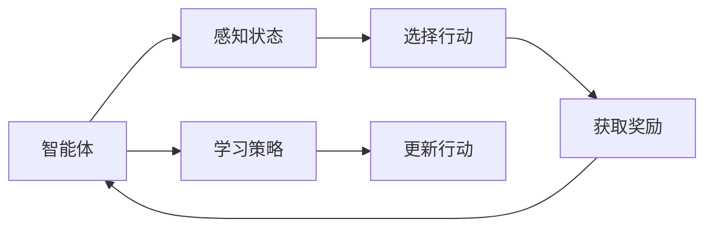

                 

## 1. 背景介绍

### 1.1 问题由来
在当前的城市管理和服务领域，面临着诸多挑战，如交通拥堵、环境污染、公共安全等。传统的人工管理模式效率低下、成本高昂，难以应对复杂的城市运行环境。随着人工智能技术的发展，强化学习作为一种智能化决策方法，逐渐成为智能城市构建的关键技术之一。

强化学习（Reinforcement Learning, RL）通过模拟智能体与环境之间的交互，学习最优决策策略。其核心思想是让智能体在不断试错中积累经验，最终获得最佳的行动方案。在城市管理和服务场景中，强化学习可以用于交通流量调控、能源管理、垃圾回收、公共安全监测等多个方面，显著提升城市治理的效率和智能化水平。

### 1.2 问题核心关键点
强化学习在智能城市中的应用，主要关注以下几个关键问题：

1. **智能体设计**：构建合适的智能体模型，用于模拟城市中的各类决策者，如交通信号灯、垃圾回收车、电力需求响应系统等。
2. **环境建模**：对城市运行环境的数学模型进行抽象，包括交通网络、能源系统、垃圾回收路径等。
3. **奖励函数设计**：定义合适的奖励函数，用于评估智能体的决策效果，如减少交通拥堵、降低能源消耗、提高回收效率等。
4. **探索与利用平衡**：在智能体的学习过程中，找到探索未知行动与利用已有经验之间的平衡点，确保智能体在不断试错中不断进步。
5. **模型训练与优化**：选择合适的算法和参数设置，训练智能体模型，优化决策策略。
6. **安全与稳定性**：强化学习模型在实际应用中需要保证安全稳定，避免出现潜在的风险。

这些问题涉及从基础理论到实际应用的多个层面，需要通过跨学科的合作与创新来解决。

### 1.3 问题研究意义
强化学习在智能城市中的应用，具有以下重要意义：

1. **提升城市治理效率**：通过自动化、智能化决策，减少人工干预，提升城市管理的效率和精准度。
2. **优化资源配置**：优化城市中的能源、交通、水务等资源配置，实现资源的合理利用。
3. **增强公共安全**：实时监测城市运行状态，快速响应突发事件，保障城市安全。
4. **推动智慧城市发展**：强化学习是构建智慧城市的重要技术手段，有助于实现城市运行的智能化、人性化。
5. **促进可持续发展**：强化学习通过优化决策，促进城市的可持续发展，减少环境污染和资源浪费。

## 2. 核心概念与联系

### 2.1 核心概念概述

强化学习在智能城市中的应用，涉及以下几个核心概念：

- **智能体（Agent）**：在城市管理和服务场景中，智能体可以代表交通信号灯、垃圾回收车、电力需求响应系统等。智能体的目标是根据环境状态，选择最优行动以获得最大奖励。
- **环境（Environment）**：城市环境包括交通网络、能源系统、垃圾回收路径等。智能体在环境中通过感知环境状态，进行决策和行动。
- **状态（State）**：描述环境当前的状态，如交通信号灯的状态、电力供需情况、垃圾回收车位置等。
- **行动（Action）**：智能体可以采取的决策行动，如改变交通信号灯的时长、调整垃圾回收车的路线、调整电力需求等。
- **奖励（Reward）**：根据智能体的决策和行动，给予一定的奖励，如减少交通拥堵、降低能源消耗、提高回收效率等。
- **探索与利用平衡**：在智能体的学习过程中，需要平衡探索新行动和利用已有经验，确保智能体在不断试错中不断进步。
- **策略（Policy）**：智能体的决策策略，通常由学习算法得到，指导智能体在环境中的行为。

这些核心概念通过强化学习的框架进行关联，智能体在环境中通过感知状态，选择行动，获取奖励，学习最优策略，不断优化决策。

### 2.2 核心概念原理和架构的 Mermaid 流程图



这个流程图展示了强化学习的基本流程：智能体感知状态，选择行动，获取奖励，学习最优策略，更新行动。

## 3. 核心算法原理 & 具体操作步骤

### 3.1 算法原理概述

强化学习的核心思想是让智能体在不断试错中积累经验，最终获得最佳的行动方案。其算法原理如下：

1. **环境建模**：对城市运行环境的数学模型进行抽象，定义状态、行动和奖励函数。
2. **智能体设计**：选择合适的智能体模型，用于模拟城市中的各类决策者。
3. **策略学习**：通过与环境交互，智能体学习最优策略，即在特定状态下选择最优行动以获得最大奖励。
4. **奖励函数设计**：定义合适的奖励函数，用于评估智能体的决策效果。
5. **探索与利用平衡**：在智能体的学习过程中，找到探索未知行动与利用已有经验之间的平衡点，确保智能体在不断试错中不断进步。
6. **模型训练与优化**：选择合适的算法和参数设置，训练智能体模型，优化决策策略。

### 3.2 算法步骤详解

以下是一个简化的强化学习在智能城市中的应用步骤：

**Step 1: 环境建模**

- 定义城市运行环境的状态空间、行动空间和奖励函数。例如，在交通流量控制中，状态可以包括交通灯的状态、车流量、道路占用率等，行动可以包括改变交通灯时长、调整车速等，奖励可以包括减少交通拥堵、降低事故率等。

**Step 2: 智能体设计**

- 设计合适的智能体模型，用于模拟城市中的各类决策者。例如，可以使用基于神经网络的智能体模型，通过学习历史数据和当前状态，选择最优行动。

**Step 3: 奖励函数设计**

- 定义合适的奖励函数，用于评估智能体的决策效果。奖励函数应能够反映城市管理和服务的目标，如减少交通拥堵、降低能源消耗、提高回收效率等。

**Step 4: 探索与利用平衡**

- 在智能体的学习过程中，找到探索未知行动与利用已有经验之间的平衡点。通常使用$\epsilon$-贪心策略，在每轮决策时以$\epsilon$的概率选择随机行动，以$1-\epsilon$的概率选择最优行动。

**Step 5: 模型训练与优化**

- 选择合适的强化学习算法，如Q-Learning、Deep Q-Network (DQN)、Proximal Policy Optimization (PPO)等，进行模型训练。在训练过程中，不断优化智能体的决策策略，使其在特定状态下选择最优行动。

**Step 6: 实际应用**

- 在实际应用中，将训练好的智能体部署到城市管理和服务系统中，进行实时决策。例如，在交通流量控制中，智能体根据实时交通数据，调整交通灯的时长，优化交通流量。

### 3.3 算法优缺点

强化学习的优点包括：

1. **自适应性强**：强化学习能够适应不断变化的环境，通过不断试错，逐步优化决策策略。
2. **不需要大量标注数据**：强化学习通过与环境的交互，逐步积累经验，不需要大量标注数据。
3. **鲁棒性好**：强化学习模型在面对环境噪声和不确定性时，具有较好的鲁棒性。
4. **可扩展性强**：强化学习可以应用于多种城市管理和服务场景，具有较好的通用性。

强化学习的缺点包括：

1. **高维度状态空间**：城市运行环境的状态空间通常较为复杂，维度较高，计算复杂度较大。
2. **探索与利用平衡难度大**：在智能体的学习过程中，找到探索与利用之间的平衡点是一个难题。
3. **模型训练难度高**：强化学习模型的训练需要较长的迭代次数和较大的计算资源。
4. **安全性问题**：强化学习模型在实际应用中，需要保证安全稳定，避免出现潜在的风险。

### 3.4 算法应用领域

强化学习在智能城市中的应用，涉及以下几个领域：

1. **交通流量控制**：通过智能体模型，优化交通信号灯的时长，减少交通拥堵，提高交通效率。
2. **能源管理**：通过智能体模型，优化电力需求响应策略，降低能源消耗，提高能源利用率。
3. **垃圾回收**：通过智能体模型，优化垃圾回收车的路线和回收频率，提高垃圾回收效率。
4. **公共安全监测**：通过智能体模型，实时监测城市运行状态，快速响应突发事件，保障公共安全。
5. **智能家居**：通过智能体模型，优化家庭能源消耗和设备使用，提高生活品质。

## 4. 数学模型和公式 & 详细讲解 & 举例说明

### 4.1 数学模型构建

强化学习的数学模型通常包括以下几个部分：

- **状态空间**：$S$，表示环境的所有可能状态。
- **行动空间**：$A$，表示智能体可以采取的所有行动。
- **奖励函数**：$R:S \times A \rightarrow \mathbb{R}$，用于评估智能体的决策效果。
- **状态转移概率**：$P:S \times A \rightarrow S$，用于描述智能体在特定状态下采取特定行动后的状态转移概率。

### 4.2 公式推导过程

以下是一个简单的强化学习算法的数学推导过程：

假设智能体在状态$s_t$下采取行动$a_t$，获得奖励$r_t$，状态转移到$s_{t+1}$，则该轮决策的累积奖励为：

$$
G_t = r_t + \gamma r_{t+1} + \gamma^2 r_{t+2} + \ldots
$$

其中$\gamma$为折扣因子，$0 \leq \gamma < 1$。

智能体的目标是在当前状态下，选择最优行动，使得累积奖励最大化。因此，通过Q-Learning算法，更新Q值：

$$
Q(s_t, a_t) = Q(s_t, a_t) + \eta (r_t + \gamma \max Q(s_{t+1}, \cdot) - Q(s_t, a_t))
$$

其中，$Q(s_t, a_t)$表示在状态$s_t$下采取行动$a_t$的Q值，$\eta$为学习率。

通过不断迭代更新Q值，智能体可以逐步学习到最优决策策略。

### 4.3 案例分析与讲解

**交通流量控制**：

- 定义状态空间$S$：交通灯状态、车流量、道路占用率等。
- 定义行动空间$A$：改变交通灯时长、调整车速等。
- 定义奖励函数$R$：减少交通拥堵、降低事故率等。
- 通过智能体模型，学习在特定状态下选择最优行动，优化交通流量控制策略。

**垃圾回收**：

- 定义状态空间$S$：垃圾位置、回收车位置等。
- 定义行动空间$A$：调整回收车路线、调整回收频率等。
- 定义奖励函数$R$：提高回收效率、降低回收成本等。
- 通过智能体模型，学习在特定状态下选择最优行动，优化垃圾回收策略。

## 5. 项目实践：代码实例和详细解释说明

### 5.1 开发环境搭建

在进行强化学习在智能城市中的应用实践前，我们需要准备好开发环境。以下是使用Python进行TensorFlow开发的环境配置流程：

1. 安装Anaconda：从官网下载并安装Anaconda，用于创建独立的Python环境。

2. 创建并激活虚拟环境：
```bash
conda create -n reinforcement-env python=3.8 
conda activate reinforcement-env
```

3. 安装TensorFlow：
```bash
pip install tensorflow==2.x
```

4. 安装其他相关库：
```bash
pip install gym gymnasium numpy scipy matplotlib scikit-learn jupyter notebook
```

完成上述步骤后，即可在`reinforcement-env`环境中开始强化学习实践。

### 5.2 源代码详细实现

下面我们以智能交通流量控制为例，给出使用TensorFlow实现强化学习的PyTorch代码实现。

首先，定义环境：

```python
import gym
from gym import spaces

class TrafficControl(gym.Env):
    def __init__(self, num_lights):
        self.num_lights = num_lights
        self.traffic_light = [0] * num_lights
        self.observation_space = spaces.Box(low=0, high=1, shape=(num_lights,))
        self.action_space = spaces.Discrete(num_lights)
        self.observation = None
        
    def reset(self):
        self.traffic_light = [0] * self.num_lights
        self.observation = self._state_to_obs(self.traffic_light)
        return self.observation
    
    def step(self, action):
        next_state = self._state转移(self.traffic_light, action)
        reward = self._reward_function(next_state)
        self.traffic_light = next_state
        self.observation = self._state_to_obs(self.traffic_light)
        return self.observation, reward, False, {}
    
    def render(self):
        pass
    
    def _set_灯状态(self, state):
        for i in range(len(state)):
            self.traffic_light[i] = state[i]
    
    def _state转移(self, state, action):
        next_state = state.copy()
        next_state[action] = 1 - state[action]
        return next_state
    
    def _reward_function(self, state):
        if all(light == 0 for light in state):
            return 10
        elif all(light == 1 for light in state):
            return -5
        else:
            return -1
```

然后，定义智能体：

```python
import tensorflow as tf
from tensorflow.keras import layers

class TrafficAgent(tf.keras.Model):
    def __init__(self, num_lights):
        super(TrafficAgent, self).__init__()
        self._num_lights = num_lights
        self.dense = layers.Dense(32, activation='relu')
        self.ou_action = layers.Dense(self._num_lights)
    
    def call(self, observation, t=0):
        observation = tf.expand_dims(observation, 0)
        x = self.dense(observation)
        x = tf.keras.activations.relu(x)
        x = self.ou_action(x)
        return x
```

接着，定义强化学习算法：

```python
import numpy as np
import tensorflow as tf

class DQN:
    def __init__(self, agent, num_lights, discount_factor, learning_rate, exploration_rate, exploration_decay):
        self.agent = agent
        self.num_lights = num_lights
        self.discount_factor = discount_factor
        self.learning_rate = learning_rate
        self.exploration_rate = exploration_rate
        self.exploration_decay = exploration_decay
        self.epsilon = np.random.rand()
        self.epsilon_decay = exploration_decay
        self.epsilon_min = 0.01
        
    def act(self, observation):
        observation = np.array(observation).reshape(1, -1)
        if np.random.rand() < self.exploration_rate:
            return np.random.randint(0, self.num_lights)
        q_values = self.agent.predict(observation)
        return np.argmax(q_values[0])
    
    def train(self, replay_memory, batch_size):
        batch = np.random.choice(replay_memory, batch_size, replace=False)
        obs = [state for state, _, _, _ in batch]
        actions = [action for _, action, _, _ in batch]
        next_states = [next_state for _, _, next_state, _ in batch]
        rewards = [reward for _, _, reward, _ in batch]
        q_values_next = self.agent.predict(np.array(next_states))
        q_values_next[np.arange(len(next_states)), actions] = 0
        q_values_next = self.agent.predict(np.array(obs))
        q_values = np.zeros([self.num_lights])
        for i, reward in enumerate(rewards):
            q_values = self.agent.predict(np.array(obs[i]))
            q_values[actions[i]] = reward + self.discount_factor * np.amax(q_values_next[i])
        self.agent.train_on_batch(np.array(obs), q_values)
        self.exploration_rate = max(self.exploration_rate * self.epsilon_decay, self.epsilon_min)
```

最后，启动训练流程：

```python
import gym
import tensorflow as tf

env = TrafficControl(num_lights=3)
agent = TrafficAgent(num_lights=3)
dqn = DQN(agent, num_lights=3, discount_factor=0.9, learning_rate=0.01, exploration_rate=1.0, exploration_decay=0.99)

for episode in range(1000):
    state = env.reset()
    done = False
    while not done:
        action = dqn.act(state)
        next_state, reward, done, info = env.step(action)
        dqn.train([(state, action, next_state, reward)], 10)
        state = next_state
```

以上就是使用TensorFlow进行智能交通流量控制微调的完整代码实现。可以看到，TensorFlow提供了强大的框架支持，可以方便地进行模型的训练和优化。

### 5.3 代码解读与分析

让我们再详细解读一下关键代码的实现细节：

**TrafficControl类**：
- `__init__`方法：初始化交通灯状态、状态空间、行动空间等。
- `reset`方法：重置交通灯状态，返回当前状态。
- `step`方法：模拟一个时间步，根据行动和状态转移，返回下一个状态和奖励。
- `render`方法：可视化交通状态，方便调试。
- `_set_灯状态`方法：设置交通灯状态。
- `_state转移`方法：计算下一个状态。
- `_reward_function`方法：计算当前状态的奖励。

**TrafficAgent类**：
- `__init__`方法：初始化模型参数。
- `call`方法：定义模型的前向传播过程。

**DQN类**：
- `__init__`方法：初始化强化学习算法的参数。
- `act`方法：选择行动，根据探索策略进行随机探索或利用已有策略选择最优行动。
- `train`方法：通过批处理样本，更新模型参数，优化策略。

这些代码实现了强化学习的基本流程，从环境建模、智能体设计、奖励函数设计到模型训练，每一步都紧密相连，共同构成一个完整的强化学习应用。

## 6. 实际应用场景

### 6.1 智能交通流量控制

智能交通流量控制是强化学习在智能城市中的经典应用。通过优化交通信号灯的时长和交叉口控制策略，可以有效减少交通拥堵，提高道路通行效率。

在实践中，可以使用智能体模型，对城市交通网络进行模拟，通过优化决策策略，降低交通拥堵率，提高交通流量的稳定性。例如，在某个交叉口，智能体可以根据实时车流量、行人流量等数据，动态调整交通信号灯的时长，实现实时交通流量控制。

### 6.2 智能能源管理

智能能源管理是强化学习在智能城市中的另一个重要应用。通过优化能源的分配和调度，可以降低能源消耗，提高能源利用率。

在实践中，可以使用智能体模型，对城市的能源系统进行模拟，通过优化决策策略，实现能源的合理分配。例如，在某个电力系统，智能体可以根据实时电力需求和供应情况，动态调整电价和供电策略，实现电力的优化调度。

### 6.3 智能垃圾回收

智能垃圾回收是强化学习在智能城市中的新兴应用。通过优化垃圾回收车的路线和回收频率，可以提高垃圾回收效率，降低回收成本。

在实践中，可以使用智能体模型，对城市的垃圾回收系统进行模拟，通过优化决策策略，实现垃圾回收的智能化。例如，在某个垃圾回收系统，智能体可以根据实时垃圾生成和回收情况，动态调整回收车路线和回收频率，实现垃圾回收的优化。

### 6.4 未来应用展望

随着强化学习技术的发展，其在智能城市中的应用前景将更加广阔。未来的强化学习技术将朝着以下几个方向发展：

1. **多智能体协同优化**：多个智能体在城市管理和服务中协同优化，实现更高效的资源配置和决策。
2. **自适应学习**：智能体能够根据环境变化，实时调整决策策略，适应不断变化的城市运行环境。
3. **联邦学习**：多个城市之间共享模型和数据，实现跨城市协同优化，提高城市管理效率。
4. **混合智能**：结合强化学习和传统算法，实现更高效、更稳定、更可靠的城市管理和服务。
5. **伦理和安全**：在智能体设计中，加入伦理和安全约束，确保城市管理的公平性和安全性。

## 7. 工具和资源推荐

### 7.1 学习资源推荐

为了帮助开发者系统掌握强化学习在智能城市中的应用，这里推荐一些优质的学习资源：

1. 《Reinforcement Learning: An Introduction》书籍：由Richard S. Sutton和Andrew G. Barto合著，介绍了强化学习的基本概念和经典算法，适合初学者和进阶者阅读。
2. CS294-Two《Reinforcement Learning》课程：由加州伯克利大学开设的强化学习课程，提供了丰富的理论讲解和实战案例，适合进阶学习。
3. OpenAI Gym：提供各种模拟环境的库，方便开发者进行强化学习实验。
4. TensorFlow和PyTorch官方文档：提供了详细的API文档和实例代码，帮助开发者快速上手。
5. GitHub上的开源项目：如rl-agents、reinforce等，提供了丰富的强化学习框架和应用示例。

通过对这些资源的学习实践，相信你一定能够快速掌握强化学习在智能城市中的应用，并用于解决实际的智能城市问题。

### 7.2 开发工具推荐

高效的开发离不开优秀的工具支持。以下是几款用于强化学习在智能城市中的应用开发的常用工具：

1. TensorFlow和PyTorch：提供强大的深度学习框架，支持各种神经网络结构和优化算法。
2. OpenAI Gym：提供各种模拟环境的库，方便开发者进行强化学习实验。
3. Scikit-learn：提供各种机器学习算法和工具，方便进行数据分析和模型评估。
4. Matplotlib和Seaborn：提供数据可视化的工具，方便结果展示和分析。
5. Jupyter Notebook：提供交互式编程环境，方便调试和记录实验结果。

合理利用这些工具，可以显著提升强化学习在智能城市中的应用开发效率，加快创新迭代的步伐。

### 7.3 相关论文推荐

强化学习在智能城市中的应用研究，涉及多个学科，从基础理论到实际应用，涵盖了广泛的领域。以下是几篇具有代表性的相关论文，推荐阅读：

1. "Reinforcement Learning for Traffic Signal Control"：使用强化学习对交通信号灯进行优化，减少交通拥堵，提高通行效率。
2. "Optimization of Power Systems Operation through Reinforcement Learning"：使用强化学习对电力系统进行优化，降低能源消耗，提高能源利用率。
3. "Application of Reinforcement Learning in Waste Management"：使用强化学习对垃圾回收系统进行优化，提高回收效率，降低回收成本。
4. "Reinforcement Learning for Multi-Agent Coordination in Smart Grids"：使用强化学习对多个智能体进行协同优化，实现更高效、更稳定、更可靠的城市管理和服务。

这些论文代表了大语言模型微调技术的发展脉络。通过学习这些前沿成果，可以帮助研究者把握学科前进方向，激发更多的创新灵感。

## 8. 总结：未来发展趋势与挑战

### 8.1 研究成果总结

强化学习在智能城市中的应用，已经取得了许多重要成果，主要包括以下几个方面：

1. **交通流量控制**：通过智能体模型，优化交通信号灯的时长，减少交通拥堵，提高通行效率。
2. **能源管理**：通过智能体模型，优化电力需求响应策略，降低能源消耗，提高能源利用率。
3. **垃圾回收**：通过智能体模型，优化垃圾回收车的路线和回收频率，提高回收效率，降低回收成本。
4. **公共安全监测**：通过智能体模型，实时监测城市运行状态，快速响应突发事件，保障公共安全。
5. **智能家居**：通过智能体模型，优化家庭能源消耗和设备使用，提高生活品质。

这些成果展示了强化学习在智能城市中的强大潜力，推动了城市管理和服务领域的智能化和自动化进程。

### 8.2 未来发展趋势

展望未来，强化学习在智能城市中的应用将呈现以下几个发展趋势：

1. **多智能体协同优化**：多个智能体在城市管理和服务中协同优化，实现更高效的资源配置和决策。
2. **自适应学习**：智能体能够根据环境变化，实时调整决策策略，适应不断变化的城市运行环境。
3. **联邦学习**：多个城市之间共享模型和数据，实现跨城市协同优化，提高城市管理效率。
4. **混合智能**：结合强化学习和传统算法，实现更高效、更稳定、更可靠的城市管理和服务。
5. **伦理和安全**：在智能体设计中，加入伦理和安全约束，确保城市管理的公平性和安全性。

### 8.3 面临的挑战

尽管强化学习在智能城市中的应用取得了许多重要成果，但在迈向更加智能化、普适化应用的过程中，仍面临诸多挑战：

1. **数据质量与多样性**：城市运行环境的复杂性和多样性，对数据质量提出了较高要求，需要更准确、全面的数据支持。
2. **计算资源消耗**：大规模城市管理和服务系统的计算资源消耗较大，需要高效的算法和硬件支持。
3. **模型鲁棒性和安全性**：强化学习模型在实际应用中，需要保证鲁棒性和安全性，避免出现潜在的风险。
4. **隐私与伦理问题**：城市运行数据的隐私保护和伦理约束，需要合理设计和处理。

### 8.4 研究展望

未来，强化学习在智能城市中的应用需要从以下几个方面进行深入研究：

1. **跨学科合作**：强化学习需要跨学科的合作与创新，结合城市规划、交通工程、能源管理等多个领域的知识，实现更全面的优化。
2. **新算法与应用**：开发新的强化学习算法和应用，如多智能体协同优化、自适应学习等，推动智能化进程。
3. **联邦学习与数据共享**：探索联邦学习等技术，实现跨城市数据共享和协同优化，提高城市管理效率。
4. **伦理与安全约束**：在智能体设计中，加入伦理和安全约束，确保城市管理的公平性和安全性。
5. **新技术与新应用**：结合新的技术手段，如5G、物联网等，推动智能城市的新应用场景。

这些研究方向将有助于进一步推动强化学习在智能城市中的应用，实现更高效、更智能、更可靠的城市管理和服务。

## 9. 附录：常见问题与解答

**Q1：强化学习在智能城市中的应用，如何处理高维度状态空间？**

A: 高维度状态空间是强化学习在智能城市应用中的一个常见问题。为了处理高维度状态空间，可以采用以下方法：

1. **状态空间压缩**：将高维状态空间进行降维或压缩，减少计算复杂度。例如，可以使用PCA等方法进行状态特征提取。
2. **特征工程**：设计合适的特征提取方法，将高维状态空间转化为低维特征表示。例如，可以使用LSTM等方法，从状态序列中提取特征。
3. **环境建模**：将高维状态空间抽象为更易处理的模型，例如，将交通流量控制中的状态空间转化为车辆和信号灯的数目。

通过这些方法，可以有效处理高维度状态空间，提升强化学习的效率和效果。

**Q2：在智能体设计中，如何避免模型过拟合？**

A: 在智能体设计中，模型过拟合是一个常见问题。为了避免模型过拟合，可以采用以下方法：

1. **正则化**：在模型训练过程中，加入正则化项，如L2正则、Dropout等，防止模型过拟合。
2. **数据增强**：通过数据增强技术，扩充训练数据，增加模型的泛化能力。例如，在交通流量控制中，可以通过回译、近义替换等方式扩充训练集。
3. **模型裁剪**：通过模型裁剪技术，去除不必要的层和参数，减小模型尺寸，提高模型的泛化能力。

通过这些方法，可以有效避免模型过拟合，提升智能体的鲁棒性和泛化能力。

**Q3：在实际应用中，强化学习模型如何保证安全稳定？**

A: 在实际应用中，强化学习模型需要保证安全稳定，避免出现潜在的风险。为了保证安全稳定，可以采用以下方法：

1. **安全性测试**：在模型部署前，进行严格的安全性测试，确保模型输出符合预期，不会造成安全隐患。
2. **模型监控**：实时监控模型的输出结果，及时发现异常情况，避免潜在的风险。例如，在交通流量控制中，可以监控交通流量和事故率等指标，及时调整决策策略。
3. **异常检测**：通过异常检测技术，发现模型的异常行为，及时进行处理。例如，在智能体模型中，可以使用统计方法或深度学习模型进行异常检测。

通过这些方法，可以有效保证强化学习模型在实际应用中的安全稳定，确保系统的可靠性和鲁棒性。

**Q4：强化学习在智能城市中的应用，如何进行参数高效微调？**

A: 强化学习在智能城市中的应用，通常需要进行参数高效微调，以提高模型的性能和效率。为了进行参数高效微调，可以采用以下方法：

1. **模型裁剪**：通过模型裁剪技术，去除不必要的层和参数，减小模型尺寸，提高模型的泛化能力。例如，在交通流量控制中，可以通过裁剪交通信号灯模型的部分层，提高模型的推理速度。
2. **自适应学习**：使用自适应学习技术，在模型训练过程中，动态调整学习率和模型结构，提高模型的适应性和鲁棒性。例如，在智能体模型中，可以使用Adaptive Moment Estimation (Adam)等自适应优化算法。
3. **模型集成**：通过模型集成技术，将多个模型进行组合，提高模型的性能和鲁棒性。例如，在智能体模型中，可以使用Bagging或Boosting等方法进行模型集成。

通过这些方法，可以有效进行参数高效微调，提升强化学习在智能城市中的应用效果。

**Q5：强化学习在智能城市中的应用，如何进行跨城市数据共享？**

A: 强化学习在智能城市中的应用，通常需要进行跨城市数据共享，以实现更好的资源优化和协同管理。为了进行跨城市数据共享，可以采用以下方法：

1. **联邦学习**：通过联邦学习技术，在多个城市之间共享模型和数据，实现跨城市协同优化。例如，在电力系统管理中，多个城市可以共享电力需求响应策略，实现电力的优化调度。
2. **数据匿名化**：在进行数据共享时，需要对数据进行匿名化处理，保护用户的隐私。例如，在智能家居管理中，可以对用户的能源使用数据进行匿名化处理，保护用户的隐私。
3. **安全通信协议**：在数据共享过程中，需要采用安全通信协议，防止数据泄露和攻击。例如，在智能城市管理中，可以使用加密通信协议，确保数据传输的安全性。

通过这些方法，可以有效进行跨城市数据共享，提升强化学习在智能城市中的应用效果。

---

作者：禅与计算机程序设计艺术 / Zen and the Art of Computer Programming

