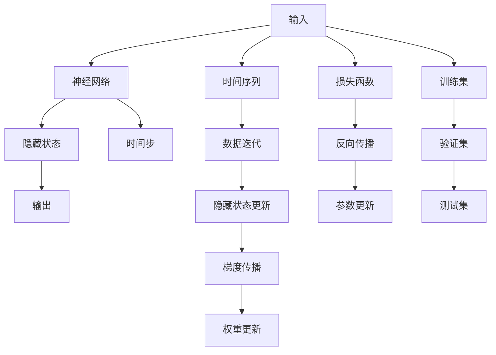

                 

# 循环神经网络 (RNN) 原理与代码实例讲解

> 关键词：循环神经网络(RNN), 长短时记忆网络(LSTM), 门控循环单元(GRU), 时间序列预测, 自然语言处理(NLP), 语音识别, 序列生成

## 1. 背景介绍

### 1.1 问题由来

循环神经网络(RNN)是一种能够处理序列数据的神经网络结构。它的核心思想是将序列中的每个时间步的信息，通过隐藏状态传递到下一个时间步，从而能够捕捉序列数据中的时间依赖关系。RNN最早由Hochreiter和Schmidhuber在1997年提出，很快成为了序列数据处理领域的主流技术。

然而，由于梯度消失和梯度爆炸的问题，传统的RNN在长序列数据上的训练效果不佳。为解决这一问题，研究者们先后提出了长短时记忆网络(LSTM)和门控循环单元(GRU)等改进型RNN结构，显著提升了序列数据处理的性能。

在实际应用中，RNN被广泛应用于时间序列预测、语音识别、自然语言处理(NLP)、序列生成等任务。例如，在语音识别中，RNN能够对音频信号进行建模，提取语音特征，从而实现语音到文本的自动转录。在机器翻译中，RNN可以将源语言句子转换为目标语言句子，得到翻译结果。

## 2. 核心概念与联系

### 2.1 核心概念概述

为了更好地理解RNN，我们需要先了解几个核心概念：

- **神经网络**：由许多神经元通过权重连接构成的图，用于处理和预测数据。
- **时间序列**：按照时间顺序排列的数据序列，如音频、文本、股市数据等。
- **隐藏状态**：在RNN中，每个时间步都会产生一个隐藏状态，用于记录前一时间步的状态信息，并传递到当前时间步。
- **梯度消失和梯度爆炸**：传统的RNN在长序列上的训练过程中，梯度会逐渐消失或爆炸，导致训练效果不佳。

### 2.2 核心概念原理和架构的 Mermaid 流程图



该图展示了RNN的基本架构和流程。输入数据先通过神经网络进行特征提取，产生隐藏状态。然后根据时间步更新隐藏状态，并将更新后的隐藏状态作为输出。最后通过损失函数计算模型的预测误差，反向传播计算梯度，并更新网络参数。

## 3. 核心算法原理 & 具体操作步骤

### 3.1 算法原理概述

RNN的核心算法原理是利用隐藏状态来捕捉序列数据中的时间依赖关系。在每个时间步，RNN会接收当前时间步的输入$x_t$，并根据前一时间步的隐藏状态$h_{t-1}$，计算出当前时间步的隐藏状态$h_t$。具体公式如下：

$$
h_t = f(W_{h_i} h_{t-1} + W_{x_i} x_t + b)
$$

其中，$W_{h_i}$和$W_{x_i}$是权重矩阵，$b$是偏置项，$f$是激活函数。

在输出层，根据当前时间步的隐藏状态$h_t$，计算输出$y_t$。输出层可以是一个简单的线性层，也可以是一个非线性的神经网络。

$$
y_t = g(W_{y_i} h_t + b_y)
$$

其中，$W_{y_i}$是权重矩阵，$b_y$是偏置项，$g$是激活函数。

### 3.2 算法步骤详解

RNN的训练过程主要分为前向传播和反向传播两个阶段。

#### 前向传播
1. **初始化隐藏状态**：将$h_0$初始化为0或随机向量。
2. **时间步迭代**：对于每个时间步$t$，根据输入$x_t$和前一时间步的隐藏状态$h_{t-1}$，计算当前时间步的隐藏状态$h_t$。
3. **输出计算**：根据当前时间步的隐藏状态$h_t$，计算输出$y_t$。
4. **迭代计算**：重复上述步骤，直到所有时间步计算完毕。

#### 反向传播
1. **输出层梯度计算**：根据预测输出$y_t$和真实输出$y_t^*$，计算输出层梯度。
2. **隐藏状态梯度计算**：通过反向传播，计算当前时间步的隐藏状态梯度。
3. **权重更新**：根据梯度信息，更新权重矩阵$W_{h_i}$和$W_{x_i}$。
4. **损失函数计算**：计算损失函数值，评估模型预测误差。
5. **迭代更新**：重复上述步骤，直到损失函数收敛或达到预设轮数。

### 3.3 算法优缺点

#### 优点
- **可处理序列数据**：RNN能够处理任意长度的序列数据，适应性强。
- **时间依赖关系建模**：RNN能够捕捉序列数据中的时间依赖关系，具有很强的表达能力。
- **序列生成能力**：RNN可以通过解码器生成新的序列数据，如自然语言生成。

#### 缺点
- **梯度消失和梯度爆炸**：传统的RNN在长序列上训练效果不佳，存在梯度消失和梯度爆炸的问题。
- **计算复杂度高**：RNN的计算复杂度随着序列长度呈线性增长，训练速度较慢。
- **模型难以训练**：RNN的隐藏状态在训练过程中可能会失去记忆能力，导致模型训练效果不佳。

### 3.4 算法应用领域

RNN被广泛应用于以下几个领域：

- **时间序列预测**：如股票价格预测、天气预报、销售预测等。
- **语音识别**：如语音到文本的自动转录。
- **自然语言处理(NLP)**：如机器翻译、情感分析、文本生成等。
- **序列生成**：如对话生成、音乐生成等。

## 4. 数学模型和公式 & 详细讲解 & 举例说明

### 4.1 数学模型构建

RNN的数学模型可以描述为：

$$
h_t = f(W_{h_i} h_{t-1} + W_{x_i} x_t + b)
$$

$$
y_t = g(W_{y_i} h_t + b_y)
$$

其中，$h_t$表示时间步$t$的隐藏状态，$x_t$表示时间步$t$的输入，$y_t$表示时间步$t$的输出，$W_{h_i}$、$W_{x_i}$、$W_{y_i}$是权重矩阵，$b$、$b_y$是偏置项，$f$、$g$是激活函数。

### 4.2 公式推导过程

以LSTM为例，LSTM引入了三个门控机制（输入门、遗忘门、输出门），用于控制隐藏状态的更新。

1. **输入门**：决定哪些信息应该被保留在隐藏状态中。
2. **遗忘门**：决定哪些信息应该被从隐藏状态中删除。
3. **输出门**：决定哪些信息应该被输出。

具体公式如下：

$$
i_t = \sigma(W_i h_{t-1} + W_x x_t + b_i)
$$

$$
f_t = \sigma(W_f h_{t-1} + W_x x_t + b_f)
$$

$$
o_t = \sigma(W_o h_{t-1} + W_x x_t + b_o)
$$

$$
c_t = \tanh(W_c h_{t-1} + W_x x_t + b_c)
$$

$$
h_t = o_t \odot \tanh(c_t)
$$

其中，$i_t$、$f_t$、$o_t$表示门的激活函数，$c_t$表示细胞状态，$\odot$表示元素乘法，$\sigma$表示sigmoid函数。

### 4.3 案例分析与讲解

以情感分析为例，我们可以使用RNN对电影评论进行情感分类。具体步骤如下：

1. **数据预处理**：将电影评论转换成数字向量，作为输入序列。
2. **模型构建**：使用LSTM模型，设置隐藏状态维度、输出维度等参数。
3. **训练模型**：使用训练集数据对模型进行训练，优化损失函数。
4. **预测结果**：使用测试集数据对模型进行测试，评估分类准确率。

下面给出一个简单的RNN代码实现示例：

```python
import torch
import torch.nn as nn

class RNN(nn.Module):
    def __init__(self, input_size, hidden_size, output_size):
        super(RNN, self).__init__()
        self.hidden_size = hidden_size
        self.rnn = nn.RNN(input_size, hidden_size, 1, batch_first=True)
        self.fc = nn.Linear(hidden_size, output_size)
    
    def forward(self, input, hidden):
        output, hidden = self.rnn(input, hidden)
        output = self.fc(output[:, -1, :])
        return output, hidden
    
    def initHidden(self):
        return torch.zeros(1, input_size, self.hidden_size)

input = torch.randn(10, 1, input_size)  # 构造随机输入序列
hidden = self.initHidden()  # 初始化隐藏状态
output, hidden = model(input, hidden)  # 前向传播计算输出
```

## 5. 项目实践：代码实例和详细解释说明

### 5.1 开发环境搭建

RNN的实现需要Python编程语言和PyTorch深度学习框架的支持。

1. **安装Python**：从官网下载安装Python，选择3.7或以上版本。
2. **安装PyTorch**：通过conda或pip安装PyTorch，建议选择GPU版本。
3. **配置环境变量**：将Python和PyTorch路径添加到系统环境变量中。

### 5.2 源代码详细实现

以下是使用PyTorch实现RNN的示例代码：

```python
import torch
import torch.nn as nn

class RNN(nn.Module):
    def __init__(self, input_size, hidden_size, output_size):
        super(RNN, self).__init__()
        self.hidden_size = hidden_size
        self.rnn = nn.RNN(input_size, hidden_size, 1, batch_first=True)
        self.fc = nn.Linear(hidden_size, output_size)
    
    def forward(self, input, hidden):
        output, hidden = self.rnn(input, hidden)
        output = self.fc(output[:, -1, :])
        return output, hidden
    
    def initHidden(self):
        return torch.zeros(1, input_size, self.hidden_size)

input = torch.randn(10, 1, input_size)  # 构造随机输入序列
hidden = self.initHidden()  # 初始化隐藏状态
output, hidden = model(input, hidden)  # 前向传播计算输出
```

### 5.3 代码解读与分析

- **RNN类**：定义了RNN模型，包括隐藏状态大小、RNN层和全连接层。
- **forward方法**：实现模型的前向传播计算，返回输出和隐藏状态。
- **initHidden方法**：初始化隐藏状态。
- **输入序列构造**：构造随机输入序列，作为模型的输入。
- **模型前向传播**：调用forward方法进行前向传播计算。

## 6. 实际应用场景

### 6.1 时间序列预测

RNN在时间序列预测中表现出色。例如，使用RNN对股票价格进行预测，可以通过历史价格序列生成未来价格序列。

### 6.2 语音识别

RNN在语音识别中应用广泛。例如，使用RNN对音频信号进行建模，提取语音特征，从而实现语音到文本的自动转录。

### 6.3 自然语言处理(NLP)

RNN在NLP领域也有广泛应用。例如，使用RNN对电影评论进行情感分类，可以通过文本序列生成情感标签。

### 6.4 未来应用展望

未来，RNN将在更多领域得到应用。例如，使用RNN对医疗记录进行建模，辅助医生诊断疾病；使用RNN对金融数据进行建模，预测市场走势。

## 7. 工具和资源推荐

### 7.1 学习资源推荐

- **《深度学习》**：Ian Goodfellow、Yoshua Bengio和Aaron Courville所著，深入介绍了深度学习的基本概念和算法。
- **《自然语言处理综论》**：Daniel Jurafsky和James H. Martin所著，全面介绍了NLP的基本概念和应用。
- **《Python深度学习》**：Francois Chollet所著，讲解了如何使用Python和Keras实现深度学习算法。

### 7.2 开发工具推荐

- **PyTorch**：由Facebook开发的深度学习框架，支持动态计算图和GPU加速。
- **TensorFlow**：由Google开发的深度学习框架，支持静态计算图和分布式训练。
- **Keras**：一个高层次的深度学习框架，基于TensorFlow实现，简单易用。

### 7.3 相关论文推荐

- **Long Short-Term Memory**：Hochreiter和Schmidhuber在1997年提出的LSTM，解决了梯度消失和梯度爆炸的问题。
- **A Simple Neural Network Model for Named Entity Recognition**：Yu et al.在1997年提出的RNN模型，用于命名实体识别任务。
- **LSTM Network for Language Modeling**：Hochreiter和Schmidhuber在1997年提出的LSTM模型，用于语言建模任务。

## 8. 总结：未来发展趋势与挑战

### 8.1 研究成果总结

RNN作为一种处理序列数据的神经网络结构，具有很强的时间依赖关系建模能力。其优点是能够处理任意长度的序列数据，缺点是存在梯度消失和梯度爆炸的问题。LSTM和GRU等改进型RNN结构，通过引入门控机制，解决了这一问题，提升了序列数据处理的性能。

### 8.2 未来发展趋势

未来的RNN将向着更加高效、智能、可解释的方向发展。例如，使用更高效的神经网络结构，如Transformer、注意力机制等，提升序列数据处理的性能。同时，研究更复杂的序列建模任务，如序列生成、对话生成等，探索新的应用场景。

### 8.3 面临的挑战

RNN在未来发展中仍面临一些挑战，如计算复杂度高、模型难以训练等问题。未来的研究需要进一步优化计算图，降低计算复杂度。同时，需要探索新的训练方法，如迁移学习、自监督学习等，提升模型训练效果。

### 8.4 研究展望

未来，RNN将在更多领域得到应用。例如，使用RNN对医疗记录进行建模，辅助医生诊断疾病；使用RNN对金融数据进行建模，预测市场走势。同时，探索新的应用场景，如序列生成、对话生成等，推动RNN技术的不断进步。

## 9. 附录：常见问题与解答

### Q1: RNN在长序列上的训练效果不佳，原因是什么？

A: RNN在长序列上的训练效果不佳，主要是由于梯度消失和梯度爆炸的问题。梯度消失使得隐藏状态难以更新，梯度爆炸则会导致模型训练不稳定。LSTM和GRU等改进型RNN结构通过引入门控机制，解决了这一问题，提升了序列数据处理的性能。

### Q2: RNN的计算复杂度随着序列长度呈线性增长，如何降低计算复杂度？

A: 可以使用更高效的神经网络结构，如Transformer、注意力机制等，提升序列数据处理的性能。同时，可以采用分布式训练、混合精度训练等方法，降低计算复杂度。

### Q3: 如何使用RNN进行序列生成？

A: 可以使用RNN的解码器进行序列生成。具体步骤如下：
1. 使用RNN模型对输入序列进行编码，得到隐藏状态。
2. 使用解码器对隐藏状态进行解码，生成新的序列。
3. 重复上述步骤，生成新的序列。

---

作者：禅与计算机程序设计艺术 / Zen and the Art of Computer Programming

