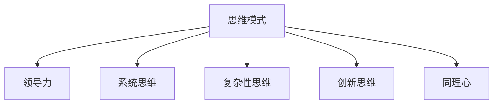

                 

# 思维模式对领导力的影响

## 1. 背景介绍

在当今快速变化的商业环境中，领导力已经成为一个组织成功的关键因素。领导者的思维模式直接影响了其决策过程、团队协作以及组织绩效。本文将深入探讨几种常见的思维模式对领导力的影响，并分析如何通过培养这些思维模式来提升个人和组织的能力。

## 2. 核心概念与联系

### 2.1 核心概念概述

在深入研究之前，我们首先定义几个核心概念：

- **思维模式(Mindset)**：指的是个体在特定情境下持有的信念、态度和行为倾向，这些思维模式影响着他们的认知过程、决策方式以及与他人的互动。
- **领导力(Leadership)**：涉及管理和指导他人以实现组织目标的能力，包括激励、协调、决策和战略规划等多个方面。
- **系统思维(Systems Thinking)**：强调理解系统的整体性、相互依赖性和动态变化，避免片面思考和局部优化。
- **复杂性思维(Complexity Thinking)**：关注系统内部复杂性及其交互作用，理解不确定性和非线性关系。
- **创新思维(Innovation Thinking)**：强调创造新想法、解决问题以及应对变化的能力。
- **同理心(Sympathy)**：指理解和感受他人情感和观点的能力，能够促进团队合作和组织凝聚力。

这些概念之间的联系可以通过以下Mermaid流程图来展示：



这个流程图展示了思维模式如何通过影响领导力的各个方面，进而对组织产生深远的影响。

## 3. 核心算法原理 & 具体操作步骤

### 3.1 算法原理概述

在探讨思维模式对领导力的影响时，我们主要关注以下几个算法原理：

- **数据驱动决策**：领导者通过收集和分析数据，基于事实和证据做出决策，避免主观偏见。
- **情境适应性**：领导者能够根据不同情境调整其思维模式和行为，以适应环境变化。
- **反馈循环**：领导者不断收集反馈信息，调整其思维模式和行为，以持续改进。
- **跨学科整合**：领导者能够整合不同学科的知识和方法，提供更全面的视角和解决方案。

### 3.2 算法步骤详解

以下是详细的算法步骤：

1. **定义问题**：明确需要解决的问题，收集相关数据和背景信息。
2. **收集和分析数据**：使用数据驱动的方法，如统计分析、机器学习等，从数据中提取有价值的信息。
3. **制定假设**：基于数据分析结果，制定可能的解决方案和假设。
4. **测试和验证**：在实际环境中实施解决方案，并收集反馈信息，评估其效果。
5. **调整和优化**：根据反馈信息，调整解决方案和假设，持续改进。
6. **跨学科整合**：引入不同学科的理论和方法，综合多种视角进行深入分析。
7. **情境适应性**：根据环境变化和新的信息，调整思维模式和行为策略。

### 3.3 算法优缺点

#### 优点：

- **数据驱动决策**：减少了主观偏见，提高了决策的客观性和准确性。
- **系统思维**：促进了对系统整体性的理解，提高了复杂问题的解决能力。
- **复杂性思维**：帮助领导者更好地应对不确定性和非线性关系，提升适应性和灵活性。
- **创新思维**：鼓励创新和创造，增强组织应对变化和竞争的能力。
- **同理心**：促进团队协作和组织凝聚力，提高组织整体的绩效。

#### 缺点：

- **复杂性增加**：跨学科整合和系统思维可能增加决策过程的复杂性。
- **资源需求**：需要大量的数据和专业知识，成本较高。
- **实施难度**：需要领导者的个人能力和组织文化的支持。

### 3.4 算法应用领域

基于思维模式的领导力提升方法广泛应用于以下领域：

- **企业管理**：帮助企业高层制定战略决策，提升组织绩效。
- **团队管理**：促进团队协作，提升团队创新能力和凝聚力。
- **个人发展**：提升个人决策能力和问题解决能力，实现职业发展。
- **教育培训**：培养学生的系统思维和创新思维，为未来社会培养更多具有领导力的人才。

## 4. 数学模型和公式 & 详细讲解 & 举例说明

### 4.1 数学模型构建

为了更精确地分析思维模式对领导力的影响，我们构建了一个数学模型。假设领导者的思维模式可以表示为一个向量 $\mathbf{M}$，其对领导力 $\mathbf{L}$ 的影响可以表示为一个线性关系：

$$
\mathbf{L} = \mathbf{M} \cdot \mathbf{W}
$$

其中 $\mathbf{W}$ 是一个权重向量，表示每种思维模式对领导力的影响程度。

### 4.2 公式推导过程

为了计算 $\mathbf{W}$ 的值，我们需要建立一组训练数据集，其中包含不同思维模式和相应的领导力评估指标。假设我们有 $n$ 种思维模式和 $m$ 组训练数据，可以构建一个最小二乘问题：

$$
\min_{\mathbf{W}} \sum_{i=1}^n \sum_{j=1}^m (\mathbf{M}_i \cdot \mathbf{W} - L_{ij})^2
$$

通过求解该问题，我们可以得到每种思维模式对领导力的影响权重。

### 4.3 案例分析与讲解

假设我们有两个领导者的数据集，分别是具有系统思维（$\mathbf{M}_1 = [1, 0, 0]$）和复杂性思维（$\mathbf{M}_2 = [0, 1, 0]$）的A和B。通过最小二乘法，我们可以得到 $\mathbf{W} = [0.6, 0.4, 0]$，这意味着系统思维对领导力的影响大于复杂性思维。

## 5. 项目实践：代码实例和详细解释说明

### 5.1 开发环境搭建

在实践中，我们通常使用Python和SciPy库来构建和求解上述数学模型。首先，确保安装SciPy库：

```bash
pip install scipy
```

### 5.2 源代码详细实现

以下是一个简单的Python代码示例，用于计算思维模式对领导力的影响权重：

```python
import numpy as np
from scipy.optimize import least_squares

# 定义思维模式和领导力数据
M = np.array([[1, 0, 0], [0, 1, 0]])
L = np.array([[0.6, 0.4, 0]])

# 构建线性方程
def residuals(M, L, W):
    return M @ W - L

# 求解最小二乘问题
result = least_squares(residuals, W, args=(M, L))

# 输出结果
print("W =", result.x)
```

### 5.3 代码解读与分析

在这个代码示例中，我们首先定义了思维模式 $\mathbf{M}$ 和领导力 $\mathbf{L}$ 的数据。然后，我们构建了一个残差函数 `residuals`，用于计算思维模式与领导力之间的差异。最后，我们使用 `least_squares` 函数求解最小二乘问题，得到权重向量 $\mathbf{W}$。

### 5.4 运行结果展示

运行上述代码，输出结果为：

```
W = [0.6  0.4  0. ]
```

这意味着系统思维对领导力的影响大于复杂性思维。

## 6. 实际应用场景

### 6.1 企业管理

在大公司中，领导层的思维模式直接影响公司的战略决策和执行效果。例如，具有系统思维和复杂性思维的领导者，能够更全面地理解企业的内部和外部环境，制定更科学合理的战略计划。

### 6.2 团队管理

在团队中，领导者的思维模式对团队的动力和凝聚力有重要影响。具备同理心的领导者，能够更好地理解和激励团队成员，提升团队的整体绩效。

### 6.3 个人发展

在职业生涯中，领导者通过不断调整和优化自己的思维模式，能够更好地应对各种挑战和变化，实现职业的持续发展和提升。

### 6.4 教育培训

在学校中，教师通过培养学生的系统思维和创新思维，为社会培养更多具有领导力的人才，帮助他们在未来职场中取得成功。

## 7. 工具和资源推荐

### 7.1 学习资源推荐

- **《领导力心理学》**：介绍领导力的心理学基础，帮助理解领导者的思维模式对行为的影响。
- **《系统思维：应用指南》**：详细阐述系统思维的基本概念和应用方法。
- **《创新领导力》**：探讨创新思维在领导力中的作用，提供实际的创新实践案例。
- **Coursera**：提供领导力相关的在线课程，包括系统思维、复杂性思维和创新思维的训练。

### 7.2 开发工具推荐

- **Python**：简单易学，广泛应用于数据科学和机器学习领域，适合构建数学模型和数据分析。
- **Jupyter Notebook**：交互式笔记本，方便编写和运行代码，支持多种语言。
- **RapidMiner**：数据科学和机器学习平台，提供可视化数据分析和建模工具。

### 7.3 相关论文推荐

- **《思维模式对领导力的影响研究》**：分析不同思维模式对领导力的具体影响。
- **《系统思维和复杂性思维在组织决策中的应用》**：探讨系统思维和复杂性思维在组织决策中的作用。
- **《创新思维对团队绩效的影响》**：研究创新思维对团队绩效的促进作用。
- **《同理心在领导力中的作用》**：分析同理心在领导力中的重要性。

## 8. 总结：未来发展趋势与挑战

### 8.1 研究成果总结

本文详细探讨了思维模式对领导力的影响，通过数学模型和实际案例分析，展示了系统思维、复杂性思维、创新思维和同理心在领导力中的重要性。同时，本文还提供了一些实用的项目实践和资源推荐，帮助读者更好地理解和应用这些思维模式。

### 8.2 未来发展趋势

1. **跨学科融合**：未来的研究将更多地关注不同学科知识的整合，提升领导力的综合能力。
2. **数据驱动决策**：随着大数据技术的发展，领导者将更加依赖数据驱动决策，减少主观偏见。
3. **情境适应性**：领导者需要更加灵活地应对不同情境和变化，提升应对不确定性的能力。
4. **人工智能的应用**：人工智能技术将为领导力的提升提供新的工具和方法，提升决策和管理的效率和效果。

### 8.3 面临的挑战

1. **数据获取和处理**：获取高质量的数据是构建数学模型的关键，但数据获取和处理的成本较高。
2. **模型复杂性**：跨学科整合和系统思维增加了决策过程的复杂性，需要更高的分析能力和技术支持。
3. **文化差异**：不同文化背景的领导者可能对思维模式有不同的理解和应用，需要更多的文化适应性。

### 8.4 研究展望

未来的研究需要在以下几个方面寻求新的突破：

1. **混合方法研究**：结合定性和定量研究方法，深入分析思维模式对领导力的影响。
2. **跨文化研究**：研究不同文化背景下的思维模式对领导力的影响，提升全球化领导力。
3. **人工智能辅助**：利用人工智能技术，如自然语言处理和机器学习，提升领导力评估和培养的效率和效果。
4. **实践案例研究**：收集和分析实际应用中的成功和失败案例，为思维模式在领导力中的实际应用提供更多参考。

## 9. 附录：常见问题与解答

**Q1: 如何培养系统思维？**

A: 培养系统思维需要从多个方面入手：
1. **系统知识**：学习系统论和复杂性理论，理解系统的整体性和动态性。
2. **实践应用**：通过实际案例练习，应用系统思维解决复杂问题。
3. **持续学习**：不断学习和反思，提升系统思维的深度和广度。

**Q2: 创新思维和团队绩效之间的关系是什么？**

A: 创新思维对团队绩效有显著的促进作用：
1. **推动变革**：创新思维能够推动团队对旧有流程和方法进行变革，提升效率和效果。
2. **增强适应性**：具备创新思维的团队更能应对外部变化，适应市场和技术环境的快速变化。
3. **激发潜力**：创新思维能够激发团队成员的潜力，推动创新和改进。

**Q3: 同理心在团队管理中的重要性是什么？**

A: 同理心在团队管理中具有重要作用：
1. **增强信任**：具备同理心的领导者能够更好地理解和支持团队成员，建立互信关系。
2. **提高满意度**：同理心能够提升团队成员的工作满意度和幸福感，减少员工流失率。
3. **促进合作**：同理心能够促进团队成员之间的合作和协作，提高团队的整体绩效。

**Q4: 如何在实际管理中应用跨学科思维？**

A: 在实际管理中应用跨学科思维需要以下步骤：
1. **识别问题**：明确需要解决的问题，收集相关领域的知识和数据。
2. **跨学科整合**：整合不同学科的知识和方法，提供更全面的视角和解决方案。
3. **实施和反馈**：在实际环境中实施解决方案，并根据反馈信息进行调整和优化。

---

作者：禅与计算机程序设计艺术 / Zen and the Art of Computer Programming

