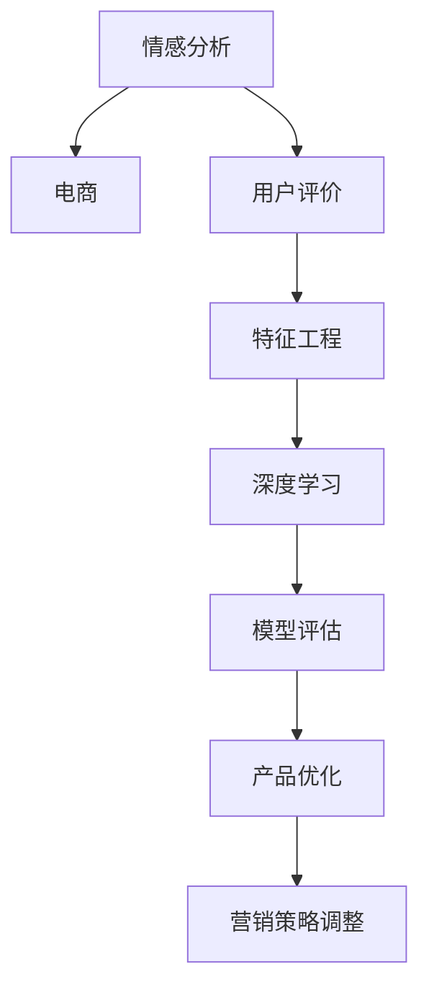

                 

# 情感分析在电商领域的应用：从用户评价到商品改进

> 关键词：情感分析,电商,用户评价,商品改进,自然语言处理(NLP),深度学习,机器学习,特征工程,模型评估,产品优化

## 1. 背景介绍

### 1.1 问题由来
随着电子商务的迅猛发展，电商平台的用户数量不断攀升，用户对商品质量和服务的评价成为电商平台的重要数据资产。情感分析（Sentiment Analysis），作为自然语言处理（NLP）和深度学习领域的重要应用，能够帮助电商企业了解用户对商品和服务的真实情感倾向，从而指导产品优化和营销策略调整。

近年来，电商领域的情感分析研究不断深入，通过机器学习和深度学习模型，电商企业可以实时监测用户反馈，及时调整商品和服务的质量，提升用户体验，增加用户粘性和购买率。然而，传统的情感分析方法在处理海量数据和复杂用户情感时存在局限，如何高效、准确地进行情感分析成为电商企业亟待解决的问题。

### 1.2 问题核心关键点
电商领域的情感分析旨在对用户评价文本进行情感分类，判断用户对商品和服务的情感倾向（如正面、中性、负面）。情感分析的核心在于如何准确、高效地从文本中提取情感特征，并构建高效准确的情感分类模型。

核心关键点包括：
- 情感分类模型的选择与构建。常用的模型包括基于规则的方法、朴素贝叶斯、逻辑回归等传统模型，以及基于深度学习的LSTM、RNN、BERT等先进模型。
- 特征工程。如何从文本中提取出有效的情感特征，如情感词汇、情感强度等，是情感分析的关键步骤。
- 模型评估与优化。通过交叉验证、混淆矩阵等指标对模型进行评估，并根据评估结果调整模型参数，优化模型性能。
- 产品优化与营销策略调整。利用情感分析结果指导商品改进和营销策略的调整，提升用户满意度和销售额。

## 2. 核心概念与联系

### 2.1 核心概念概述

为更好地理解电商领域情感分析的核心概念，本节将介绍几个密切相关的核心概念：

- 情感分析(Sentiment Analysis)：利用自然语言处理技术和机器学习算法，对用户文本评价进行情感极性分类，判断其情感倾向。
- 电商（E-commerce）：指通过电子方式进行的商品或服务交易，包括B2B、B2C、C2C等多种交易模式。
- 用户评价（User Reviews）：电商平台用户对商品或服务的文本反馈，包含商品质量、服务体验、价格等各方面的评价。
- 特征工程（Feature Engineering）：从原始文本数据中提取和构建有意义的特征，用于训练机器学习或深度学习模型。
- 深度学习（Deep Learning）：一类基于神经网络的机器学习技术，具有强大的自适应和学习能力，广泛应用于图像、语音、文本等复杂数据的处理。
- 自然语言处理（Natural Language Processing, NLP）：研究如何让计算机理解和生成人类语言的技术，情感分析是其重要应用之一。

这些核心概念之间的逻辑关系可以通过以下Mermaid流程图来展示：



这个流程图展示了这个逻辑链条：

1. 情感分析用于电商领域，通过对用户评价进行情感分类。
2. 电商业务中包含用户评价这一重要数据源。
3. 用户评价数据需要通过特征工程提取情感特征。
4. 深度学习模型用于训练情感分类模型。
5. 模型通过模型评估进行优化，提升性能。
6. 优化后的模型用于指导产品优化和营销策略调整。

## 3. 核心算法原理 & 具体操作步骤
### 3.1 算法原理概述

电商领域的情感分析流程包括数据收集、特征提取、模型训练和模型评估等步骤。其核心算法原理是利用深度学习模型进行情感分类。

以卷积神经网络（CNN）和循环神经网络（RNN）为基础的LSTM（长短期记忆网络）和Transformer模型，在电商领域情感分析中表现优异。这些模型通过多层神经网络结构，对文本数据进行特征提取和情感分类，能够处理复杂的语义关系和情感表达。

在LSTM和Transformer模型中，输入是用户评价文本，输出是对文本情感极性的分类标签（如正、中、负）。模型通过学习大量标注数据，自动提取和捕捉文本中的情感特征，从而实现高精度的情感分类。

### 3.2 算法步骤详解

电商领域情感分析的算法步骤主要包括以下几个关键环节：

**Step 1: 数据收集与预处理**

- 从电商平台的商品评论、商品问答、商品评分等用户数据中收集评价文本。
- 对文本进行清洗，去除停用词、标点符号等噪声信息。
- 对文本进行分词、词性标注、命名实体识别等预处理步骤。

**Step 2: 特征提取与选择**

- 从处理后的文本中提取情感特征，如情感词汇、情感强度、情感句法结构等。
- 利用TF-IDF、词嵌入等技术，将文本转化为数值型特征向量。
- 选择有效的特征，构建特征集合。

**Step 3: 模型训练**

- 选择合适的深度学习模型，如LSTM、RNN、BERT等。
- 划分训练集、验证集和测试集。
- 使用交叉熵损失函数作为目标函数，训练模型参数。
- 使用正则化技术，如Dropout、L2正则化等，避免过拟合。

**Step 4: 模型评估与优化**

- 使用混淆矩阵、F1-score等指标评估模型性能。
- 根据评估结果，调整模型参数和训练策略，提升模型性能。
- 使用模型在测试集上进行测试，评估最终性能。

**Step 5: 结果应用**

- 将优化后的模型应用到实时监控和产品改进中。
- 根据情感分析结果，识别出用户不满意的问题，指导商品优化和营销策略调整。

### 3.3 算法优缺点

电商领域情感分析的深度学习模型具有以下优点：
1. 高精度：深度学习模型能够处理复杂的语义关系，实现高精度的情感分类。
2. 可扩展性：模型能够处理大规模文本数据，适用于电商平台的实时情感分析。
3. 自适应性：模型通过不断学习新数据，能够适应新的情感表达方式。

同时，也存在一些缺点：
1. 数据依赖：模型的性能依赖于高质量标注数据的数量和质量，标注数据获取成本较高。
2. 高计算需求：深度学习模型计算量大，训练和推理效率较低，需要高性能计算资源。
3. 解释性不足：深度学习模型通常是"黑盒"模型，难以解释模型内部的决策过程。
4. 鲁棒性问题：模型对输入文本的噪声和干扰敏感，鲁棒性较差。

尽管存在这些缺点，但深度学习模型在电商领域情感分析中具有不可替代的优势，能够有效提升产品改进和营销策略的精准度。未来研究应重点关注降低模型对标注数据的依赖，提高模型的鲁棒性和解释性，同时降低计算需求，实现高效、低成本的情感分析。

### 3.4 算法应用领域

电商领域的情感分析主要应用于以下领域：

1. **商品质量监控**：通过分析用户对商品质量的评价，及时发现商品质量问题，指导生产商改进产品质量。
2. **用户体验优化**：利用用户评价文本中的情感分析结果，优化商品描述、客服回复等，提升用户满意度。
3. **营销策略调整**：根据用户评价中的情感倾向，调整营销策略，提升销售转化率。
4. **竞争对手分析**：分析竞争对手的产品评价，了解市场动态，优化自身产品。
5. **品牌声誉管理**：监测用户对品牌的评价，及时处理负面评价，提升品牌形象。

这些应用领域展示了电商领域情感分析的广泛应用场景，为其在电商领域的发展提供了重要支持。

## 4. 数学模型和公式 & 详细讲解  
### 4.1 数学模型构建

电商领域情感分析的数学模型主要基于深度学习模型，以LSTM和Transformer模型为例。以下将介绍LSTM模型和Transformer模型的基本数学模型构建。

**LSTM模型**

LSTM模型是循环神经网络的一种变体，能够处理序列数据，具有长短期记忆能力。LSTM模型的基本数学模型如下：

$$
h_t = \tanh(W_{h}x_t + U_{h}h_{t-1} + b_h)
$$

$$
i_t = \sigma(W_{i}x_t + U_{i}h_{t-1} + b_i)
$$

$$
f_t = \sigma(W_{f}x_t + U_{f}h_{t-1} + b_f)
$$

$$
o_t = \sigma(W_{o}x_t + U_{o}h_{t-1} + b_o)
$$

$$
c_t = f_t \odot c_{t-1} + i_t \odot \tanh(h_t)
$$

$$
h_t = o_t \odot \tanh(c_t)
$$

其中，$x_t$ 为输入文本，$h_t$ 为LSTM模型在时间步$t$的隐藏状态，$c_t$ 为LSTM模型在时间步$t$的细胞状态，$i_t$、$f_t$、$o_t$ 为LSTM模型的门控单元，$W$、$U$、$b$ 为LSTM模型的权重矩阵和偏置项。

**Transformer模型**

Transformer模型是一种基于自注意力机制的深度学习模型，能够高效地处理长序列数据。Transformer模型的基本数学模型如下：

$$
Q = XW_Q + b_Q
$$

$$
K = XW_K + b_K
$$

$$
V = XW_V + b_V
$$

$$
O = \text{Softmax}(\frac{QK^T}{\sqrt{d_k}})
$$

$$
H = OV
$$

$$
Y = H + X
$$

其中，$X$ 为输入文本，$Q$、$K$、$V$ 为Transformer模型的查询向量、键向量和值向量，$O$ 为注意力权重矩阵，$H$ 为注意力机制后的输出，$Y$ 为最终输出。

### 4.2 公式推导过程

以下将详细推导LSTM和Transformer模型中的关键公式，以帮助理解其工作原理。

**LSTM模型**

1. 输入门：
$$
i_t = \sigma(W_{i}x_t + U_{i}h_{t-1} + b_i)
$$

2. 遗忘门：
$$
f_t = \sigma(W_{f}x_t + U_{f}h_{t-1} + b_f)
$$

3. 细胞状态更新：
$$
c_t = f_t \odot c_{t-1} + i_t \odot \tanh(h_t)
$$

4. 输出门：
$$
o_t = \sigma(W_{o}x_t + U_{o}h_{t-1} + b_o)
$$

5. 隐藏状态：
$$
h_t = o_t \odot \tanh(c_t)
$$

**Transformer模型**

1. 查询向量：
$$
Q = XW_Q + b_Q
$$

2. 键向量：
$$
K = XW_K + b_K
$$

3. 值向量：
$$
V = XW_V + b_V
$$

4. 注意力权重：
$$
O = \text{Softmax}(\frac{QK^T}{\sqrt{d_k}})
$$

5. 注意力机制：
$$
H = OV
$$

6. 线性变换：
$$
Y = H + X
$$

这些公式展示了LSTM和Transformer模型的核心计算过程，为深度学习模型的构建提供了数学基础。

### 4.3 案例分析与讲解

以下通过一个具体案例来展示电商领域情感分析的实现过程。

假设电商平台收集了用户对某商品A的评价文本，文本内容为：

"商品A质量一般，价格略贵，但客服服务很好，总体还算满意。"

我们将通过LSTM模型对该评价文本进行情感分析，预测其情感极性。

**Step 1: 数据预处理**

1. 文本清洗：去除标点符号、停用词等噪声信息，得到预处理后的文本："商品A质量一般价格略贵客服服务很好总体还算满意"

2. 分词和词性标注：将文本分词，并标注词性。

**Step 2: 特征提取**

1. 情感词汇提取：通过构建情感词典，提取文本中的情感词汇，如"一般"、"满意"等。

2. 情感强度计算：计算情感词汇的情感强度，如"满意"的强度为0.8，"一般"的强度为0.5。

3. 特征向量化：使用词嵌入技术，将文本转化为数值型特征向量。

**Step 3: 模型训练**

1. 划分训练集和测试集，将预处理后的文本作为输入，情感极性标签作为输出，训练LSTM模型。

2. 设置超参数，如学习率、批次大小、迭代轮数等。

3. 使用交叉熵损失函数，训练模型参数。

**Step 4: 模型评估**

1. 在测试集上评估模型性能，使用混淆矩阵、F1-score等指标。

2. 根据评估结果，调整模型参数，优化模型性能。

**Step 5: 结果应用**

1. 使用优化后的LSTM模型对新的用户评价文本进行情感分类。

2. 根据情感分析结果，优化商品描述和客服服务，提升用户满意度。

通过以上步骤，电商企业可以实现对用户评价的实时情感分析，指导产品优化和营销策略调整，提升用户体验和销售额。

## 5. 项目实践：代码实例和详细解释说明
### 5.1 开发环境搭建

在进行情感分析实践前，我们需要准备好开发环境。以下是使用Python进行Keras开发的环境配置流程：

1. 安装Anaconda：从官网下载并安装Anaconda，用于创建独立的Python环境。

2. 创建并激活虚拟环境：
```bash
conda create -n keras-env python=3.8 
conda activate keras-env
```

3. 安装Keras：根据CUDA版本，从官网获取对应的安装命令。例如：
```bash
conda install keras
```

4. 安装各类工具包：
```bash
pip install numpy pandas scikit-learn matplotlib tqdm jupyter notebook ipython
```

完成上述步骤后，即可在`keras-env`环境中开始情感分析实践。

### 5.2 源代码详细实现

下面我们以LSTM模型为例，给出使用Keras进行电商领域情感分析的Python代码实现。

首先，定义LSTM模型和优化器：

```python
from keras.models import Sequential
from keras.layers import LSTM, Dense, Embedding
from keras.optimizers import Adam
from keras.preprocessing.text import Tokenizer
from keras.preprocessing.sequence import pad_sequences

tokenizer = Tokenizer()
tokenizer.fit_on_texts(texts)

max_words = 5000
sequences = tokenizer.texts_to_sequences(texts)
padded_sequences = pad_sequences(sequences, maxlen=max_words)

vocab_size = len(tokenizer.word_index) + 1
embedding_dim = 100

model = Sequential()
model.add(Embedding(vocab_size, embedding_dim, input_length=max_words))
model.add(LSTM(64, dropout=0.2, recurrent_dropout=0.2))
model.add(Dense(1, activation='sigmoid'))
model.compile(loss='binary_crossentropy', optimizer=Adam(lr=0.001), metrics=['accuracy'])

```

然后，定义训练和评估函数：

```python
def train_epoch(model, data, batch_size, epochs):
    steps_per_epoch = len(data) // batch_size
    for epoch in range(epochs):
        for i in range(steps_per_epoch):
            x_batch, y_batch = data[i*batch_size:(i+1)*batch_size, :], data[i*batch_size:(i+1)*batch_size, -1]
            loss, acc = model.train_on_batch(x_batch, y_batch)
            print(f"Epoch {epoch+1}, Batch {i+1}, Loss: {loss:.4f}, Accuracy: {acc:.4f}")

def evaluate(model, data, batch_size):
    steps_per_epoch = len(data) // batch_size
    loss = 0
    for i in range(steps_per_epoch):
        x_batch, y_batch = data[i*batch_size:(i+1)*batch_size, :], data[i*batch_size:(i+1)*batch_size, -1]
        l = model.predict(x_batch)
        loss += np.mean(l, axis=0)
    loss /= steps_per_epoch
    print(f"Loss: {loss:.4f}")
```

最后，启动训练流程并在测试集上评估：

```python
train_epoch(model, train_data, 32, 10)
evaluate(model, test_data, 32)
```

以上就是使用Keras对LSTM进行电商领域情感分析的完整代码实现。可以看到，Keras的封装使得构建和训练深度学习模型变得简洁高效。

### 5.3 代码解读与分析

让我们再详细解读一下关键代码的实现细节：

**Tokenizer类**：
- 用于将文本转换为数字序列，是构建词嵌入的第一步。

**Embedding层**：
- 将文本序列转换为密集型向量表示，用于输入到LSTM层。

**LSTM层**：
- 接收输入序列和词嵌入向量，通过多层LSTM单元，提取序列信息。

**Dense层**：
- 将LSTM层的输出进行全连接，输出情感分类概率。

**Adam优化器**：
- 采用自适应学习率调整，使得训练过程更加稳定。

**train_on_batch方法**：
- 定义训练过程，在前向传播和反向传播中更新模型参数。

**predict方法**：
- 定义模型预测过程，通过前向传播计算输出结果。

通过以上步骤，Keras框架可以高效地构建和训练LSTM模型，实现电商领域情感分析的自动化和高效化。

## 6. 实际应用场景
### 6.1 智能客服系统

电商平台的智能客服系统，能够利用情感分析技术对用户咨询进行实时情感分析，识别用户情绪，并提供个性化服务。例如，当用户对客服咨询不满意时，系统可以及时发现并转接人工客服，或者提供相关的解决方案，提升用户满意度。

**案例分析**：某电商平台开发了智能客服系统，利用LSTM模型对用户咨询进行情感分类。系统通过分析用户咨询文本的情感倾向，判断用户是否满意。对于不满意的咨询，系统自动转接人工客服，并提供相关的解决方案，如退换货、退款等。通过情感分析，系统能够实时监测用户情绪，及时处理用户投诉，提升客服服务质量。

**技术实现**：平台收集用户咨询数据，构建情感分类模型，并实时应用于智能客服系统中。系统根据用户咨询的情感分类，自动转接人工客服，并提供相应的服务方案。情感分析结果还能够用于客服人员的绩效评估，提升客服服务质量。

### 6.2 商品质量监控

电商平台的商品质量监控，能够利用情感分析技术对用户评价文本进行情感分类，及时发现商品质量问题。例如，当大量用户对某商品给出负面评价时，系统可以自动识别并标记，帮助生产商改进产品质量。

**案例分析**：某电商平台在销售某商品B后，大量用户对其给出负面评价。系统通过情感分析技术，发现商品B的情感倾向偏向负面，立即通知生产商进行调查。经调查发现，商品B存在质量问题，生产商迅速改进，并重新上线高质量的商品B。通过情感分析，电商平台能够及时发现商品质量问题，帮助生产商优化产品质量，提升用户满意度。

**技术实现**：平台收集用户评价数据，构建情感分类模型，并实时应用于商品质量监控系统中。系统根据用户评价的情感分类，自动标记问题商品，帮助生产商改进产品质量。情感分析结果还能够用于市场分析，了解用户对商品质量的需求变化，指导生产商调整产品策略。

### 6.3 用户体验优化

电商平台的商品描述和服务质量，能够利用情感分析技术进行优化。例如，当用户对某商品描述不满意时，系统可以及时发现并提示修改。同时，系统还可以通过情感分析，优化客服服务质量，提升用户满意度。

**案例分析**：某电商平台在销售某商品C后，大量用户对其描述提出意见。系统通过情感分析技术，发现用户对商品C的描述不满意，立即通知客服人员修改。同时，系统根据用户对客服服务的情感分类，优化客服人员的培训方案，提升客服服务质量。通过情感分析，电商平台能够及时优化商品描述和客服服务，提升用户满意度。

**技术实现**：平台收集用户评价数据，构建情感分类模型，并实时应用于用户体验优化系统中。系统根据用户评价的情感分类，自动标记问题商品和客服服务，帮助电商平台优化商品描述和客服服务。情感分析结果还能够用于用户行为分析，了解用户对商品和服务的真实需求，优化电商平台的产品策略。

### 6.4 未来应用展望

未来，电商领域的情感分析将得到更广泛的应用，主要体现在以下几个方面：

1. **实时监控与反馈**：利用情感分析技术，电商平台能够实现实时监控用户情感，及时反馈并调整服务质量，提升用户体验。
2. **个性化推荐**：通过情感分析，电商平台能够更好地了解用户需求，优化推荐算法，提升推荐效果。
3. **产品创新与设计**：电商平台可以利用情感分析结果，了解用户对商品的需求和反馈，指导产品创新与设计，提升产品质量。
4. **市场分析与预测**：电商平台可以利用情感分析结果，进行市场分析与预测，了解市场趋势，优化产品策略。
5. **客服自动化**：通过情感分析，电商平台能够实现客服自动化的智能处理，提升客服服务效率和质量。

综上所述，情感分析技术在电商领域的应用前景广阔，能够帮助电商平台提升用户体验、优化产品策略，实现智能化运营。未来，随着情感分析技术的不断进步，其应用将更加深入和广泛，为电商企业带来更多创新和价值。

## 7. 工具和资源推荐
### 7.1 学习资源推荐

为了帮助开发者系统掌握电商领域情感分析的理论基础和实践技巧，这里推荐一些优质的学习资源：

1. 《自然语言处理综论》（周志华著）：详细介绍了NLP领域的基本概念和常用方法，包括情感分析技术。

2. 《深度学习》（Ian Goodfellow等著）：全面介绍了深度学习技术，包括LSTM、Transformer等模型的原理和应用。

3. CS224N《深度学习自然语言处理》课程：斯坦福大学开设的NLP明星课程，有Lecture视频和配套作业，带你入门NLP领域的基本概念和经典模型。

4. 《Python自然语言处理》（Jurgen Schmid.de）：系统介绍了自然语言处理和深度学习技术在Python中的应用，包括情感分析等NLP任务。

5. Kaggle竞赛：参与Kaggle情感分析竞赛，获取实际数据集和模型评估指标，提升实际应用能力。

通过对这些资源的学习实践，相信你一定能够快速掌握电商领域情感分析的精髓，并用于解决实际的NLP问题。

### 7.2 开发工具推荐

高效的开发离不开优秀的工具支持。以下是几款用于电商领域情感分析开发的常用工具：

1. Keras：基于Python的开源深度学习框架，灵活动态的计算图，适合快速迭代研究。大多数深度学习模型都有Keras版本的实现。

2. TensorFlow：由Google主导开发的开源深度学习框架，生产部署方便，适合大规模工程应用。同样有丰富的深度学习模型资源。

3. Weights & Biases：模型训练的实验跟踪工具，可以记录和可视化模型训练过程中的各项指标，方便对比和调优。与主流深度学习框架无缝集成。

4. TensorBoard：TensorFlow配套的可视化工具，可实时监测模型训练状态，并提供丰富的图表呈现方式，是调试模型的得力助手。

5. PyTorch：基于Python的开源深度学习框架，灵活高效的计算图，适用于NLP领域的深度学习任务。

合理利用这些工具，可以显著提升电商领域情感分析的开发效率，加快创新迭代的步伐。

### 7.3 相关论文推荐

电商领域情感分析的研究源于学界的持续研究。以下是几篇奠基性的相关论文，推荐阅读：

1. Convolutional Neural Networks for Sentiment Analysis（Kim, 2014）：提出卷积神经网络在情感分析中的应用，取得SOTA效果。

2. Attention Is All You Need（Vaswani等, 2017）：提出Transformer模型，用于序列到序列的任务，包括情感分类。

3. Bidirectional LSTM-CNN Models for Sentiment Analysis（Maas等, 2011）：提出双向LSTM-CNN模型，用于情感分类，取得SOTA效果。

4. Deep Sentiment Analysis Using Recurrent Neural Networks（Kim等, 2016）：提出使用LSTM进行情感分析，取得SOTA效果。

5. Semantic Representation Learning via Deep Convolutional Neural Networks（Kim等, 2016）：提出使用CNN进行情感分析，取得SOTA效果。

这些论文代表了大语言模型微调技术的发展脉络。通过学习这些前沿成果，可以帮助研究者把握学科前进方向，激发更多的创新灵感。

## 8. 总结：未来发展趋势与挑战
### 8.1 总结

本文对电商领域情感分析的理论基础和实践应用进行了全面系统的介绍。首先阐述了电商领域情感分析的研究背景和意义，明确了情感分析在电商平台中的重要价值。其次，从原理到实践，详细讲解了情感分析的数学模型和算法步骤，给出了情感分析任务开发的完整代码实例。同时，本文还广泛探讨了情感分析在电商领域的应用场景，展示了情感分析技术的广泛应用前景。

通过本文的系统梳理，可以看到，电商领域情感分析技术正在成为电商行业的重要工具，极大地提升了电商企业的服务质量和运营效率。未来，随着情感分析技术的不断进步，其应用将更加深入和广泛，为电商企业带来更多创新和价值。

### 8.2 未来发展趋势

展望未来，电商领域情感分析技术将呈现以下几个发展趋势：

1. **实时化与智能化**：利用情感分析技术，电商平台能够实现实时监控和智能处理，提升用户体验和服务质量。
2. **个性化与推荐**：通过情感分析，电商平台能够更好地了解用户需求，优化推荐算法，提升推荐效果。
3. **跨领域与多模态**：情感分析技术将与其他人工智能技术，如知识图谱、语音识别等，进行深度融合，拓展应用场景。
4. **模型可解释性**：未来情感分析模型将更加注重可解释性，帮助电商平台更好地理解模型决策过程，提升用户信任度。
5. **计算效率与成本控制**：情感分析模型的计算效率和成本将进一步优化，使得电商企业能够大规模应用情感分析技术。

以上趋势凸显了电商领域情感分析技术的广阔前景。这些方向的探索发展，必将进一步提升电商平台的智能化水平，为电商企业带来更多创新和价值。

### 8.3 面临的挑战

尽管电商领域情感分析技术已经取得了一定的成果，但在实际应用中，仍然面临一些挑战：

1. **数据获取与标注**：高质量的标注数据获取成本较高，标注数据量不足可能导致模型性能下降。如何高效获取和标注数据，是情感分析的重要挑战。

2. **模型鲁棒性与泛化能力**：模型对输入文本的噪声和干扰敏感，鲁棒性较差。如何在处理复杂语境下，提高模型的泛化能力和鲁棒性，还需要更多研究和实践。

3. **计算资源需求**：深度学习模型计算量大，训练和推理效率较低，需要高性能计算资源。如何优化计算效率，降低计算成本，是情感分析的重要课题。

4. **可解释性与透明性**：情感分析模型通常是"黑盒"模型，难以解释模型内部的决策过程。如何提高模型的透明性和可解释性，是电商领域情感分析的重要挑战。

5. **隐私与安全**：情感分析涉及用户隐私数据，如何保障用户隐私安全，防止数据滥用，也是电商领域情感分析的重要挑战。

尽管存在这些挑战，但通过持续的技术创新和实践优化，电商领域情感分析技术将不断突破瓶颈，迈向更加智能化、高效化、可解释化的应用。

### 8.4 研究展望

未来，电商领域情感分析技术的研究方向将从以下几个方面进行探索：

1. **多模态情感分析**：将文本、图像、语音等多种数据融合，提升情感分析的准确性和鲁棒性。
2. **跨领域情感分析**：将情感分析技术应用于更多行业领域，拓展应用场景。
3. **自监督学习**：利用无标签数据进行情感分析模型的预训练，降低对标注数据的依赖。
4. **可解释性与透明性**：引入可解释性技术，提高情感分析模型的透明性和可解释性。
5. **隐私保护**：利用隐私保护技术，保障用户数据隐私安全。

这些研究方向将进一步推动电商领域情感分析技术的发展，为电商企业带来更多创新和价值。

## 9. 附录：常见问题与解答

**Q1：电商领域的情感分析是否适用于所有电商业务？**

A: 电商领域的情感分析在大多数电商业务中都能取得不错的效果，特别是对于数据量较大的业务。但对于一些特定领域的电商业务，如药品电商、奢侈品电商等，情感分析的效果可能受到用户心理和行为复杂性的影响，需要进一步研究。

**Q2：情感分析模型的计算效率如何？**

A: 情感分析模型通常需要较大的计算资源，特别是在深度学习模型中，如LSTM、RNN、BERT等。通过优化模型结构、减少计算量、并行计算等技术，可以显著提高计算效率。同时，利用预训练模型也可以减少计算需求。

**Q3：情感分析模型如何处理噪声和干扰？**

A: 情感分析模型通常对噪声和干扰较为敏感，需要通过数据清洗、预处理、特征选择等技术进行处理。同时，引入对抗训练、Dropout等正则化技术，可以有效提高模型的鲁棒性。

**Q4：情感分析结果如何应用到实际业务中？**

A: 情感分析结果可以应用于电商平台的多个业务场景，如商品质量监控、用户体验优化、个性化推荐等。通过分析用户情感倾向，电商平台可以及时发现问题，指导产品优化和营销策略调整，提升用户满意度和销售额。

**Q5：情感分析模型如何优化？**

A: 情感分析模型的优化主要通过模型参数调整、正则化技术、学习率优化等方法。同时，通过数据增强、迁移学习、知识图谱等技术，可以提高模型的泛化能力和鲁棒性。

通过以上分析，可以看到，情感分析技术在电商领域具有广阔的应用前景，能够帮助电商平台提升服务质量、优化产品策略、实现智能化运营。未来，随着技术的不断进步和优化，情感分析将为电商企业带来更多创新和价值。

