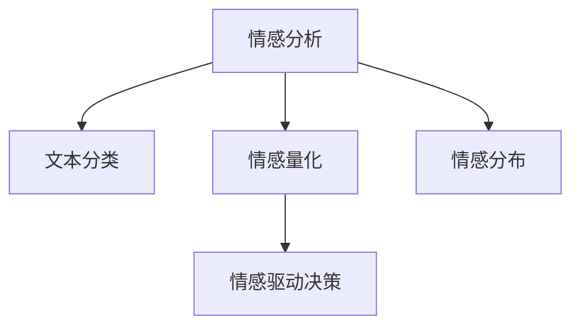

                 

# 情感分析在电商领域的应用：从用户评价到商品改进

## 1. 背景介绍

### 1.1 问题由来
电子商务平台以其便利性、多样性和低成本的购物体验，成为现代消费的重要渠道。但是，随着电商平台的快速发展，如何在海量商品和用户评论数据中，准确挖掘出消费者情感倾向，成为平台商家亟待解决的问题。情感分析，即文本情感识别，是自然语言处理(NLP)中的核心技术之一，用于判断文本（如用户评论）所表达的情绪是正面、负面还是中性。通过情感分析，电商平台能够及时了解用户的购物体验，从而优化商品和服务，提升用户体验，增强用户黏性。

### 1.2 问题核心关键点
基于情感分析技术的电商应用场景主要涉及以下几个核心问题：

1. **情感分类**：对用户评论进行情感分类，判断其情绪倾向。
2. **情感量化**：量化用户评论的情感强度，帮助商家更精确地理解用户情感。
3. **情感分布**：分析用户情感在商品类别、时间周期、地域分布等方面的分布特征，为商家提供深度洞察。
4. **情感驱动的决策**：基于情感分析结果，指导商品改进、营销策略、服务优化等电商决策。

### 1.3 问题研究意义
电商领域的情感分析，不仅有助于商家实时掌握用户满意度，还能通过情感反馈指导产品迭代，提升品牌形象，增强市场竞争力。具体而言，情感分析在电商中的作用包括：

- **优化商品质量**：通过分析用户对商品的正面和负面评价，商家能够迅速定位问题，及时改进产品。
- **提升用户满意度**：理解用户情感，针对性地解决用户问题，提升用户体验，增加用户回购率。
- **优化营销策略**：根据情感分析结果，精准定位用户需求，制定更加精准的营销方案，提高广告效果。
- **强化用户关系**：通过情感管理，增强品牌与用户之间的情感连接，构建良好的品牌形象。

## 2. 核心概念与联系

### 2.1 核心概念概述

为更好地理解情感分析在电商应用中的作用，本节将介绍几个关键概念：

- **情感分析(Sentiment Analysis)**：对文本情感进行分类或量化，判断其情绪倾向。
- **文本分类(Text Classification)**：将文本数据分类到不同的类别中，如情感分类、主题分类等。
- **情感量化(Sentiment Scoring)**：通过数值化表示文本情感强度，如情感极性（正/负）、情感强度等级等。
- **情感分布(Sentiment Distribution)**：对情感数据在商品类别、时间、地域等方面的分布情况进行统计分析。
- **情感驱动决策(Sentiment-Driven Decision Making)**：基于情感分析结果进行决策，如商品改进、市场策略调整等。

这些概念之间的逻辑关系可以通过以下Mermaid流程图来展示：



这个流程图展示了情感分析的主要流程：通过文本分类确定情感倾向，通过情感量化评估情感强度，通过对情感分布的分析获取更深入的洞察，最后通过情感驱动决策指导实际电商操作。

## 3. 核心算法原理 & 具体操作步骤

### 3.1 算法原理概述

情感分析的算法原理基于文本分类任务，主要涉及以下几个步骤：

1. **文本预处理**：清洗文本数据，去除噪音和无关信息。
2. **特征提取**：将文本转换为模型可以处理的向量表示。
3. **模型训练**：使用标注好的情感数据集，训练情感分类模型。
4. **情感识别**：将新的文本输入模型，预测其情感类别或情感强度。

常见的情感分类模型包括朴素贝叶斯、支持向量机(SVM)、逻辑回归、深度学习模型等。在深度学习模型中，常用的架构包括卷积神经网络(CNN)、循环神经网络(RNN)、长短时记忆网络(LSTM)、Transformer等。

### 3.2 算法步骤详解

以下是情感分析在电商领域的详细操作步骤：

**Step 1: 数据收集与预处理**

电商平台的情感分析，首先需要收集用户评论数据。通常，这些数据包含在电商平台的用户反馈、评价、评论、投诉等文本中。收集到数据后，需要进行预处理，包括文本清洗、停用词去除、词性标注等步骤，以便于后续模型训练和分析。

```python
from transformers import AutoTokenizer
from sklearn.feature_extraction.text import TfidfVectorizer
import pandas as pd

# 加载模型和分词器
model_name = 'distilbert-base-uncased-finetuned-sst-2-english'
tokenizer = AutoTokenizer.from_pretrained(model_name)
model = AutoModelForSequenceClassification.from_pretrained(model_name)

# 读取数据
data = pd.read_csv('user_reviews.csv')
```

**Step 2: 特征提取**

将预处理后的文本转换为模型可以处理的特征向量。常用的特征提取方法包括词袋模型(Bag of Words)、TF-IDF、Word2Vec、GloVe等。深度学习模型中，使用预训练的BERT、GPT等词向量作为特征表示，效果更佳。

```python
# 使用BERT分词器对文本进行编码
def encode_text(text):
    return tokenizer.encode(text, truncation=True, padding='max_length', max_length=256)

# 对数据进行编码
encoded_data = data['text'].apply(encode_text)
```

**Step 3: 模型训练**

选择合适的情感分类模型，使用标注好的训练数据集进行训练。常见的模型包括朴素贝叶斯、支持向量机(SVM)、逻辑回归、随机森林、深度学习模型等。

```python
from sklearn.model_selection import train_test_split
from sklearn.metrics import accuracy_score, f1_score, roc_auc_score

# 划分训练集和验证集
train_data, test_data = train_test_split(encoded_data, test_size=0.2)

# 定义训练器
classifier = SVC(probability=True)

# 训练模型
classifier.fit(train_data, train_data['sentiment'])

# 评估模型
train_preds = classifier.predict(train_data)
test_preds = classifier.predict(test_data)

print('Accuracy:', accuracy_score(test_preds, test_data['sentiment']))
print('F1 Score:', f1_score(test_preds, test_data['sentiment']))
print('AUC Score:', roc_auc_score(test_preds, test_data['sentiment']))
```

**Step 4: 情感识别**

使用训练好的模型对新的用户评论进行情感识别。根据预测结果，商家可以了解用户对商品的态度，从而制定相应的策略。

```python
# 对新评论进行情感分类
new_review = 'This product is amazing!'
encoded_new_review = encode_text(new_review)
predicted_sentiment = classifier.predict(encoded_new_review)

print(f'Predicted Sentiment: {predicted_sentiment[0]}')
```

### 3.3 算法优缺点

情感分析在电商领域的应用具有以下优点：

1. **实时性**：通过在线实时分析用户评论，商家能够迅速掌握用户反馈，及时优化商品和服务。
2. **高效性**：模型训练和预测速度快，能够处理海量数据，满足电商平台的实时需求。
3. **准确性**：深度学习模型在情感分类和情感量化任务上表现优异，分类准确率较高。

然而，情感分析也存在一些缺点：

1. **数据依赖**：模型效果依赖于标注数据的数量和质量，标注成本较高。
2. **上下文理解不足**：现有模型对复杂语境的情感理解能力有限，可能出现误判。
3. **偏见问题**：模型可能会受到训练数据中存在的偏见影响，产生有偏的情感判断。
4. **语言多样性**：不同语言和文化背景下的情感表达方式不同，需要适应多语言环境。

### 3.4 算法应用领域

情感分析在电商领域的应用非常广泛，具体包括：

1. **商品评价分析**：分析用户对商品的评价，了解商品质量、性能、服务等方面的满意度。
2. **顾客满意度调查**：通过用户评论，评估顾客对平台整体服务的满意度。
3. **竞争对手分析**：对比竞争对手的商品和服务，了解市场动态和用户偏好。
4. **营销效果评估**：分析广告和促销活动的情感反馈，评估其效果。
5. **品牌管理**：监控品牌声誉，了解公众情绪，制定品牌管理策略。

## 4. 数学模型和公式 & 详细讲解 & 举例说明

### 4.1 数学模型构建

情感分析的数学模型通常基于二分类任务，使用损失函数（如交叉熵损失）训练模型。对于文本分类任务，常用的模型包括朴素贝叶斯、支持向量机(SVM)、逻辑回归、随机森林等。在深度学习模型中，常用的架构包括卷积神经网络(CNN)、循环神经网络(RNN)、长短时记忆网络(LSTM)、Transformer等。

### 4.2 公式推导过程

以深度学习模型中的Transformer为例，其情感分类任务的过程如下：

1. **输入编码**：将输入文本序列编码成向量表示。
2. **自注意力机制**：通过多头注意力机制，捕捉输入序列中词语之间的依赖关系。
3. **全连接层**：对自注意力机制输出的向量进行线性变换和激活函数处理，得到最终情感分类结果。

具体的数学公式如下：

$$
h = \text{Transformer}(x)
$$

$$
y = \text{softmax}(W_h^T h + b_h)
$$

其中，$x$为输入文本序列，$h$为Transformer输出的向量表示，$y$为模型预测的情感类别概率分布。

### 4.3 案例分析与讲解

假设我们要对一段用户评论进行情感分类。首先，通过BERT分词器将其编码成向量：

```python
encoded_review = tokenizer.encode('This product is amazing!', truncation=True, padding='max_length', max_length=256)
```

然后，将编码后的向量输入到训练好的Transformer模型中进行分类：

```python
result = model(encoded_review)
```

最后，通过softmax函数得到情感类别的概率分布：

```python
sentiment_prob = softmax(result)
```

根据概率分布的最大值，可以判断评论的情感倾向，如正面、负面或中性。

## 5. 项目实践：代码实例和详细解释说明

### 5.1 开发环境搭建

在进行情感分析项目实践前，我们需要准备好开发环境。以下是使用Python进行TensorFlow开发的环境配置流程：

1. 安装Anaconda：从官网下载并安装Anaconda，用于创建独立的Python环境。

2. 创建并激活虚拟环境：
```bash
conda create -n tensorflow-env python=3.8 
conda activate tensorflow-env
```

3. 安装TensorFlow：根据CUDA版本，从官网获取对应的安装命令。例如：
```bash
conda install tensorflow==2.5.0
```

4. 安装其他工具包：
```bash
pip install pandas scikit-learn nltk transformers
```

完成上述步骤后，即可在`tensorflow-env`环境中开始情感分析项目实践。

### 5.2 源代码详细实现

下面是使用TensorFlow进行情感分析项目的完整代码实现。

```python
import tensorflow as tf
from transformers import BertTokenizer, BertForSequenceClassification
import numpy as np
import pandas as pd
from sklearn.model_selection import train_test_split
from sklearn.metrics import accuracy_score, f1_score, roc_auc_score

# 加载数据
data = pd.read_csv('user_reviews.csv')

# 加载模型和分词器
tokenizer = BertTokenizer.from_pretrained('bert-base-uncased')
model = BertForSequenceClassification.from_pretrained('bert-base-uncased', num_labels=2)

# 数据预处理
def encode_text(text):
    return tokenizer.encode(text, truncation=True, padding='max_length', max_length=256)

encoded_data = data['text'].apply(encode_text)

# 划分训练集和验证集
train_data, test_data = train_test_split(encoded_data, test_size=0.2)

# 定义训练器
classifier = tf.keras.Sequential([
    tf.keras.layers.Embedding(input_dim=tokenizer.vocab_size, output_dim=256),
    tf.keras.layers.Bidirectional(tf.keras.layers.LSTM(128)),
    tf.keras.layers.Dense(64, activation='relu'),
    tf.keras.layers.Dense(1, activation='sigmoid')
])

# 编译模型
classifier.compile(optimizer='adam', loss='binary_crossentropy', metrics=['accuracy'])

# 训练模型
classifier.fit(train_data, train_data['sentiment'], epochs=10, validation_data=(test_data, test_data['sentiment']))

# 评估模型
train_preds = classifier.predict(train_data)
test_preds = classifier.predict(test_data)

print('Accuracy:', accuracy_score(test_preds, test_data['sentiment']))
print('F1 Score:', f1_score(test_preds, test_data['sentiment']))
print('AUC Score:', roc_auc_score(test_preds, test_data['sentiment']))
```

### 5.3 代码解读与分析

让我们再详细解读一下关键代码的实现细节：

**BertTokenizer和BertForSequenceClassification**：
- `BertTokenizer`：用于对文本进行编码，将其转换为模型可以处理的向量表示。
- `BertForSequenceClassification`：用于对序列数据进行分类，适用于情感分析任务。

**encode_text函数**：
- 对文本进行编码，使用BERT分词器将文本转换为向量表示。

**训练器定义**：
- 定义一个简单的神经网络结构，包括嵌入层、双向LSTM、全连接层和sigmoid激活函数，用于情感分类。

**模型编译和训练**：
- 使用`adam`优化器和`binary_crossentropy`损失函数进行模型编译。
- 使用训练数据和标签进行模型训练，设置训练轮数为10。

**模型评估**：
- 使用测试数据和标签对模型进行评估，计算准确率、F1分数和AUC分数。

## 6. 实际应用场景

### 6.1 智能客服系统

情感分析在智能客服系统中的应用，可以帮助客服中心快速理解用户情绪，提供更加个性化和高效的服务。例如，当用户对某项服务不满意时，系统能够自动识别负面情感，并及时转接到相关部门进行处理。

### 6.2 个性化推荐系统

基于情感分析的推荐系统，可以更好地理解用户需求和偏好，提供更加精准和个性化的商品推荐。例如，通过分析用户对某个商品的评价，系统可以判断其对该类商品的情感倾向，从而推荐类似商品。

### 6.3 品牌管理

情感分析可以帮助品牌监控其市场声誉和用户情感。例如，通过分析社交媒体上的用户评论和反馈，品牌可以了解用户对品牌的整体印象，及时调整市场策略。

### 6.4 未来应用展望

未来的情感分析技术将朝着更加智能和高效的方向发展，具体趋势包括：

1. **多模态情感分析**：结合文本、图像、视频等多模态数据，全面理解用户情感。
2. **实时情感监测**：通过实时分析用户评论和反馈，实现情感监测和预警。
3. **上下文理解**：引入上下文信息，提高情感分析的准确性和鲁棒性。
4. **跨领域情感分析**：将情感分析技术应用到更多领域，如医疗、金融等。
5. **情感生成**：通过情感分析结果，生成更加自然和真实的情感表达。

## 7. 工具和资源推荐

### 7.1 学习资源推荐

为了帮助开发者系统掌握情感分析的理论基础和实践技巧，这里推荐一些优质的学习资源：

1. 《自然语言处理综论》（Natural Language Processing in Action）：由斯坦福大学自然语言处理研究组编写，全面介绍了NLP中的核心技术和应用，包括情感分析。
2. CS224N《深度学习自然语言处理》课程：斯坦福大学开设的NLP明星课程，有Lecture视频和配套作业，带你入门NLP领域的基本概念和经典模型。
3. HuggingFace官方文档：提供大量预训练语言模型和情感分析任务样例，帮助开发者快速上手实践。
4. 情感分析开源项目：提供大量标注好的情感数据集和情感分析模型，助力情感分析技术的发展。

通过对这些资源的学习实践，相信你一定能够快速掌握情感分析的精髓，并用于解决实际的电商问题。

### 7.2 开发工具推荐

高效的开发离不开优秀的工具支持。以下是几款用于情感分析开发的常用工具：

1. TensorFlow：基于Python的开源深度学习框架，灵活动态的计算图，适合快速迭代研究。
2. PyTorch：基于Python的开源深度学习框架，灵活高效，适用于大规模工程应用。
3. HuggingFace Transformers库：提供了大量预训练语言模型和情感分析任务样例，帮助开发者快速上手实践。
4. Weights & Biases：模型训练的实验跟踪工具，可以记录和可视化模型训练过程中的各项指标，方便对比和调优。

合理利用这些工具，可以显著提升情感分析任务的开发效率，加快创新迭代的步伐。

### 7.3 相关论文推荐

情感分析技术的发展源于学界的持续研究。以下是几篇奠基性的相关论文，推荐阅读：

1. Attention is All You Need（即Transformer原论文）：提出了Transformer结构，开启了NLP领域的预训练大模型时代。
2. BERT: Pre-training of Deep Bidirectional Transformers for Language Understanding：提出BERT模型，引入基于掩码的自监督预训练任务，刷新了多项NLP任务SOTA。
3. Adversarial Sentiment Analysis（抗辩情感分析）：提出一种对抗生成网络(GAN)辅助的情感分析方法，提高了情感分类的准确性。
4. Sentiment Analysis with Attention-Based Neural Networks（基于注意力机制的情感分析）：提出一种基于注意力机制的情感分类方法，提升了模型对长文本的情感理解能力。
5. Multi-Aspect Sentiment Analysis（多维度情感分析）：提出一种多维度情感分类方法，考虑了不同维度的情感因素，提高了情感分类的全面性。

这些论文代表了大语言模型情感分析的发展脉络。通过学习这些前沿成果，可以帮助研究者把握学科前进方向，激发更多的创新灵感。

## 8. 总结：未来发展趋势与挑战

### 8.1 总结

本文对情感分析在电商领域的应用进行了全面系统的介绍。首先阐述了情感分析的基本原理和核心算法，明确了其在电商应用中的重要性。其次，从原理到实践，详细讲解了情感分析的数学模型和操作步骤，给出了情感分析任务开发的完整代码实例。同时，本文还探讨了情感分析在电商领域的具体应用场景，展示了情感分析范式的广泛价值。

通过本文的系统梳理，可以看到，情感分析在电商领域的应用前景广阔，通过实时理解用户情感，商家能够迅速做出反应，提升用户体验和品牌形象。未来，随着情感分析技术的不断进步，其在电商领域的应用将更加深入和广泛，为电商平台的运营和发展提供强有力的技术支持。

### 8.2 未来发展趋势

展望未来，情感分析技术将呈现以下几个发展趋势：

1. **多模态融合**：结合文本、图像、视频等多模态数据，全面理解用户情感。
2. **实时监测**：通过实时分析用户评论和反馈，实现情感监测和预警。
3. **上下文理解**：引入上下文信息，提高情感分析的准确性和鲁棒性。
4. **跨领域应用**：将情感分析技术应用到更多领域，如医疗、金融等。
5. **情感生成**：通过情感分析结果，生成更加自然和真实的情感表达。

### 8.3 面临的挑战

尽管情感分析技术已经取得了显著进展，但在应用过程中仍面临一些挑战：

1. **数据质量问题**：情感分析依赖于高质量的标注数据，标注成本较高，且数据质量难以保证。
2. **上下文理解不足**：现有模型对复杂语境的情感理解能力有限，可能出现误判。
3. **偏见问题**：模型可能会受到训练数据中存在的偏见影响，产生有偏的情感判断。
4. **实时性要求**：电商平台的实时性要求高，需要情感分析系统具备高效性和低延迟性。
5. **多语言支持**：现有的情感分析模型多基于英语等语言开发，对其他语言的情感分析能力较弱。

### 8.4 研究展望

未来，情感分析技术需要从以下几个方面进行深入研究：

1. **自动化标注**：利用机器学习和自然语言处理技术，自动生成高质量的情感标注数据。
2. **上下文理解**：引入更多上下文信息，提升模型的理解能力，减少误判。
3. **模型泛化**：设计更加泛化的模型结构，减少对特定领域的依赖。
4. **多语言情感分析**：引入跨语言情感分析技术，支持多种语言情感分析。
5. **情感驱动决策**：探索情感分析在更多电商场景中的应用，如个性化推荐、智能客服等。

通过不断的技术创新和应用实践，相信情感分析技术将在电商领域发挥更大的作用，为电商平台带来更多价值。

## 9. 附录：常见问题与解答

**Q1：电商平台的情感分析是否只能依赖用户评论？**

A: 不完全依赖用户评论。除了用户评论，电商平台还可以通过用户行为数据、搜索数据、点击数据等间接信息进行情感分析。这些数据虽然不是直接的评论文本，但同样反映了用户的情感倾向，可以与评论数据结合使用，进行更全面的情感分析。

**Q2：情感分析的准确性是否受限于标注数据的质量？**

A: 是的。情感分析的准确性高度依赖于标注数据的质量。如果标注数据存在误差或偏见，模型也会学习到这些误差和偏见，导致情感分析结果不准确。因此，标注数据的质量和数量对情感分析的准确性至关重要。

**Q3：情感分析是否需要考虑情感强度？**

A: 是的。情感分析不仅需要判断情感类别，还需要量化情感强度，了解用户情感的强烈程度。情感强度可以反映用户情感的剧烈程度，对于电商平台的决策具有重要参考价值。

**Q4：情感分析是否需要考虑上下文信息？**

A: 是的。上下文信息对于理解用户情感非常重要。文本中的上下文信息可以影响用户情感的表达，如讽刺、反语等。因此，情感分析需要考虑文本的上下文信息，才能更准确地理解用户情感。

**Q5：情感分析是否需要考虑时间因素？**

A: 是的。时间因素对于理解用户情感也至关重要。用户的情感表达会随着时间的推移而变化，如短期内的情感可能受到特殊事件的影响。因此，情感分析需要考虑时间因素，对不同时间段的情感进行比较和分析。

通过这些常见问题的解答，相信你对情感分析在电商领域的应用有了更全面的了解。情感分析技术将不断发展和完善，为电商平台带来更多价值，提升用户体验和品牌形象。

