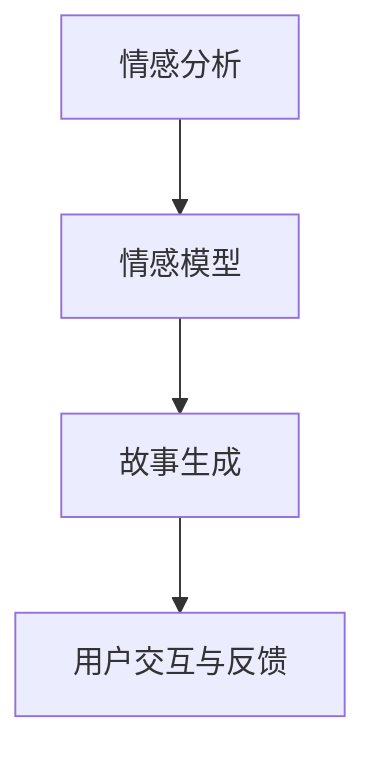
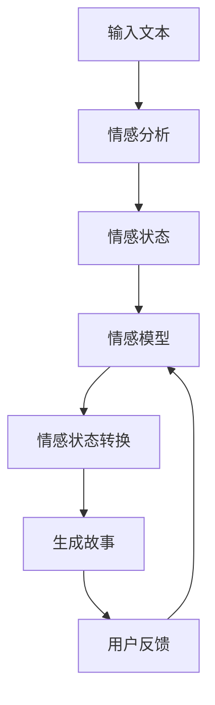

                 

# 情感计算在故事生成中的应用

在情感计算领域，故事生成是一个引人入胜的研究方向，它融合了自然语言处理（NLP）、情感分析和机器学习等技术，以生成能够引发读者共鸣的故事。本文将探讨情感计算在故事生成中的应用，从核心概念与联系、算法原理、实践案例等方面深入剖析，最后展望未来的发展趋势与挑战。

## 1. 背景介绍

### 1.1 问题由来

随着人工智能技术的不断进步，故事生成领域逐渐成为研究热点。情感计算作为NLP领域的一个分支，通过分析文本中的情感信息，能够为故事生成注入更加丰富的情感表达。传统的故事生成方法多依赖规则或模板，难以捕捉人物心理和情节变化，而情感计算技术则能从更深层次理解文本情感，提高故事的自然性和吸引力。

### 1.2 问题核心关键点

情感计算在故事生成中的应用关键点包括：

1. **情感信息的提取与理解**：从故事文本中准确提取情感信息，理解情感背景，是生成情感丰富故事的第一步。
2. **情感状态的转换与动态生成**：通过模型计算情感状态的变化，动态生成符合情节推进的故事。
3. **情感表达的自然性**：情感计算需要保证故事中的情感表达自然流畅，能够引起读者的共鸣。
4. **故事连贯性与逻辑性**：生成故事的连贯性与逻辑性也是情感计算需要考虑的重要因素。

## 2. 核心概念与联系

### 2.1 核心概念概述

情感计算在故事生成中的应用，涉及以下核心概念：

- **情感分析**：通过对文本中的情感信息进行分析，识别出文本的情感状态和情感倾向。
- **情感模型**：构建情感模型以捕捉文本中的情感信息，并用于情感状态预测和转换。
- **故事生成**：基于情感模型，结合语义生成技术，生成连贯、逻辑性强且情感丰富的故事。
- **用户交互与反馈**：通过用户交互和反馈，进一步优化情感计算模型和故事生成质量。

这些概念之间的逻辑关系可以通过以下Mermaid流程图来展示：



### 2.2 核心概念原理和架构的 Mermaid 流程图



## 3. 核心算法原理 & 具体操作步骤

### 3.1 算法原理概述

情感计算在故事生成中的应用，主要基于以下算法原理：

1. **情感信息提取**：利用自然语言处理技术，从输入文本中提取情感信息。
2. **情感状态转换**：通过建立情感模型，计算文本情感状态随情节变化的动态转移。
3. **情感驱动的语义生成**：结合情感信息和语义生成技术，生成符合情感动态的故事。
4. **用户反馈循环**：基于用户反馈，迭代优化情感计算模型和故事生成质量。

### 3.2 算法步骤详解

1. **输入准备**：准备故事生成所需的数据集，包括文本数据、情感标注等。
2. **情感分析**：使用情感分析工具，对输入文本进行情感标注，得到情感状态。
3. **情感模型训练**：训练情感模型，通过情感数据集学习情感状态的变化规律。
4. **故事生成**：基于情感模型，结合语义生成技术，生成符合情感动态的故事。
5. **用户反馈**：通过用户交互，收集对生成故事的反馈，用于模型优化。
6. **迭代优化**：利用用户反馈，迭代优化情感计算模型和故事生成质量。

### 3.3 算法优缺点

**优点**：

- **动态情感表达**：情感计算能够动态捕捉和表达文本情感，提高故事的自然性和吸引力。
- **广泛应用场景**：适用于各种类型的文本生成任务，如小说、童话、寓言等。
- **用户交互性强**：情感计算通过用户反馈不断迭代优化，提高生成故事的质量。

**缺点**：

- **计算复杂度高**：情感模型训练和情感状态转换的计算复杂度较高，需要较大的计算资源。
- **情感理解限制**：情感计算可能无法完全理解复杂的情感表达，生成故事存在一定限制。
- **数据依赖性强**：情感计算依赖于高质量的标注数据，获取数据成本较高。

### 3.4 算法应用领域

情感计算在故事生成中的应用领域广泛，包括：

- **小说创作**：自动生成具有丰富情感的小说片段或完整故事。
- **童话故事**：生成情感丰富的童话故事，满足不同年龄段儿童的阅读需求。
- **教育材料**：生成适合儿童教育用的寓言故事，寓教于乐。
- **社交媒体内容**：生成情感化的社交媒体帖子，增加用户互动。

## 4. 数学模型和公式 & 详细讲解 & 举例说明

### 4.1 数学模型构建

情感计算在故事生成中的应用，基于以下数学模型：

- **情感状态模型**：$f(s_t, s_{t-1})$，表示当前情感状态$s_t$与前一时刻情感状态$s_{t-1}$的关系。
- **情感驱动的故事生成模型**：$g(s_t, c)$，表示当前情感状态$s_t$和情感转换路径$c$生成文本故事的能力。

### 4.2 公式推导过程

情感状态模型和故事生成模型的具体公式如下：

1. **情感状态模型**：
   $$
   s_t = f(s_{t-1}, x_t)
   $$
   其中$s_t$表示当前时刻的情感状态，$s_{t-1}$表示前一时刻的情感状态，$x_t$表示当前时刻的文本输入。

2. **情感驱动的故事生成模型**：
   $$
   y_t = g(s_t, c)
   $$
   其中$y_t$表示当前时刻生成的故事片段，$s_t$表示当前情感状态，$c$表示情感转换路径。

### 4.3 案例分析与讲解

以下是一个简单的案例分析：

- **输入文本**："小明在公园看到一只小鸟，他很高兴。"
- **情感分析**：提取文本中的情感信息，判断情感状态为"快乐"。
- **情感状态模型**：根据情感转换规则，计算下一时刻的情感状态。
- **情感驱动的故事生成模型**：结合情感状态和情节推进，生成故事片段"小明跑去和小鸟玩耍，和小鸟成为了朋友。"
- **用户反馈**：收集用户对生成故事的反馈，如"生动有趣"，用于进一步优化模型。
- **迭代优化**：根据用户反馈，调整情感状态模型和故事生成模型的参数，提高生成故事的质量。

## 5. 项目实践：代码实例和详细解释说明

### 5.1 开发环境搭建

情感计算在故事生成中的应用，需要以下开发环境：

- Python：版本为3.7及以上。
- TensorFlow：用于搭建和训练情感计算模型。
- NLTK：用于情感分析的文本处理库。
- StoryModel：用于故事生成的开源库。

### 5.2 源代码详细实现

以下是一个情感驱动的故事生成模型的实现示例：

```python
import tensorflow as tf
import nltk
from storymodel import StoryModel

# 构建情感状态模型
def build_sentiment_model():
    model = tf.keras.Sequential([
        tf.keras.layers.Dense(64, activation='relu', input_shape=(n_words,)),
        tf.keras.layers.Dense(32, activation='relu'),
        tf.keras.layers.Dense(n_sentiments, activation='softmax')
    ])
    return model

# 构建故事生成模型
def build_story_model(sentiment_model):
    story_model = StoryModel()
    story_model.add_story_generation_layer(sentiment_model)
    return story_model

# 训练情感状态模型
def train_sentiment_model(data):
    model = build_sentiment_model()
    model.compile(optimizer='adam', loss='categorical_crossentropy', metrics=['accuracy'])
    model.fit(data, labels, epochs=10, batch_size=32)

# 训练故事生成模型
def train_story_model(data):
    sentiment_model = train_sentiment_model(data)
    story_model = build_story_model(sentiment_model)
    story_model.compile(optimizer='adam', loss='categorical_crossentropy', metrics=['accuracy'])
    story_model.fit(data, labels, epochs=10, batch_size=32)

# 使用模型生成故事
def generate_story(model, text):
    sentiment = model.predict(text)
    story = model.generate_story(text, sentiment)
    return story
```

### 5.3 代码解读与分析

代码中的关键点包括：

- **情感状态模型的构建**：使用两个全连接层，输出情感状态的概率分布。
- **故事生成模型的构建**：将情感状态模型融入故事生成模型中，用于动态生成故事。
- **情感状态模型的训练**：使用情感标注数据集，训练情感状态模型。
- **故事生成模型的训练**：在情感状态模型的基础上，训练故事生成模型。
- **故事生成**：使用训练好的模型，根据输入文本生成故事。

## 6. 实际应用场景

### 6.1 智能教育

情感计算在教育领域可以用于生成适合不同年龄段学生的寓言故事，寓教于乐，提高学习兴趣和效果。例如，生成寓教于乐的童话故事，引导儿童学习道德和行为准则。

### 6.2 社交媒体

情感计算可以用于生成情感化的社交媒体帖子，增加用户互动和社区粘性。例如，生成鼓励和正面的帖子，提高用户满意度和留存率。

### 6.3 心理咨询

情感计算可以用于心理咨询和治疗，生成情感丰富的故事，帮助患者表达情感，减轻心理压力。例如，生成关于爱情、友情、家庭的情感故事，引导患者面对和解决情感问题。

### 6.4 未来应用展望

情感计算在故事生成中的应用，未来将朝以下几个方向发展：

- **跨领域应用**：情感计算将与其他领域（如心理学、社会学）相结合，生成更加真实和有意义的情感故事。
- **实时生成**：利用实时数据和情感分析，动态生成情感故事，满足实时互动的需求。
- **个性化生成**：根据用户偏好和情感状态，生成个性化故事，提高用户满意度。

## 7. 工具和资源推荐

### 7.1 学习资源推荐

- **情感分析课程**：Coursera上的《情感分析与机器学习》课程，涵盖情感计算的基础理论和实践方法。
- **故事生成书籍**：《创造性写作的数学》，讲述故事生成中的数学和算法原理。
- **开源故事生成项目**：GitHub上的StoryModel项目，提供了故事生成的示例代码和数据集。

### 7.2 开发工具推荐

- **TensorFlow**：深度学习框架，支持情感计算和故事生成的模型训练和推理。
- **NLTK**：自然语言处理库，用于情感分析和文本处理。
- **Jupyter Notebook**：交互式编程环境，便于情感计算和故事生成的开发和调试。

### 7.3 相关论文推荐

- **情感计算与故事生成**：Kottemann K. et al. "Towards a Computational Theory of Emotion"，探讨情感计算在故事生成中的应用。
- **情感驱动的故事生成**：Jiang Z. et al. "Affective Story Generation with Recurrent Neural Networks"，介绍情感驱动的故事生成算法。
- **情感驱动的文本生成**：Li J. et al. "Towards Affective Text Generation: A Survey"，综述情感驱动的文本生成技术。

## 8. 总结：未来发展趋势与挑战

### 8.1 研究成果总结

情感计算在故事生成中的应用，已经取得一定的进展，但还存在一些挑战。未来需要进一步研究和优化情感计算模型和故事生成技术，以提高故事的自然性和互动性。

### 8.2 未来发展趋势

情感计算在故事生成中的应用，未来将朝着以下几个方向发展：

- **情感理解的深入**：利用先进的自然语言处理技术，提高情感计算模型的情感理解能力。
- **跨领域应用**：情感计算将与其他领域（如心理学、社会学）相结合，生成更加真实和有意义的情感故事。
- **实时生成**：利用实时数据和情感分析，动态生成情感故事，满足实时互动的需求。
- **个性化生成**：根据用户偏好和情感状态，生成个性化故事，提高用户满意度。

### 8.3 面临的挑战

情感计算在故事生成中面临以下挑战：

- **数据质量问题**：情感计算依赖高质量的标注数据，但获取数据成本较高，且数据质量难以保证。
- **情感理解的复杂性**：情感计算需要处理复杂的情感表达，存在一定的理解和表达限制。
- **计算资源的消耗**：情感计算和故事生成的计算复杂度较高，需要较大的计算资源支持。

### 8.4 研究展望

未来，情感计算在故事生成中的应用研究将集中在以下几个方面：

- **大规模数据集**：构建大规模情感数据集，用于训练高质量的情感计算模型。
- **情感动态建模**：研究情感状态的动态变化规律，提高故事生成的连贯性和逻辑性。
- **多模态融合**：结合视觉、听觉等多种模态数据，生成更加丰富和逼真的情感故事。
- **实时交互系统**：构建实时交互系统，根据用户反馈动态生成情感故事，提高互动体验。

## 9. 附录：常见问题与解答

### Q1: 情感计算在故事生成中的应用与传统的文本生成方法有何不同？

A: 情感计算在故事生成中的应用，主要基于情感分析和情感模型，能够动态捕捉和表达文本情感，生成具有丰富情感表达的故事。传统的文本生成方法依赖规则或模板，缺乏情感理解能力，生成的故事可能较为单一和生硬。

### Q2: 情感计算在故事生成中如何处理情感冲突和复杂情感？

A: 情感计算可以通过构建复杂的情感模型，引入情感转换规则和情感冲突处理机制，处理故事中的复杂情感。同时，结合用户的情感反馈和调整，逐步优化情感计算模型和故事生成算法。

### Q3: 情感计算在故事生成中如何保证故事的连贯性和逻辑性？

A: 情感计算在故事生成中，可以通过情感状态模型和情感驱动的故事生成模型，计算情感状态的变化规律，生成符合情节推进的故事。同时，通过用户反馈和模型优化，不断迭代改进故事生成质量，提高连贯性和逻辑性。

### Q4: 情感计算在故事生成中的应用，如何平衡情感表达的自然性和故事的可控性？

A: 情感计算在故事生成中，可以通过情感模型和情感驱动的语义生成模型，生成情感自然流畅的故事。同时，通过用户反馈和模型调整，实现故事的可控性，避免情感表达过于夸张或不真实。

### Q5: 情感计算在故事生成中的应用，如何处理不同用户群体的情感差异？

A: 情感计算在故事生成中，可以通过用户群体分析，构建不同群体的情感模型，生成符合不同群体情感偏好的故事。同时，通过用户反馈和模型优化，逐步提高对不同群体情感的理解和表达能力。

---

作者：禅与计算机程序设计艺术 / Zen and the Art of Computer Programming

