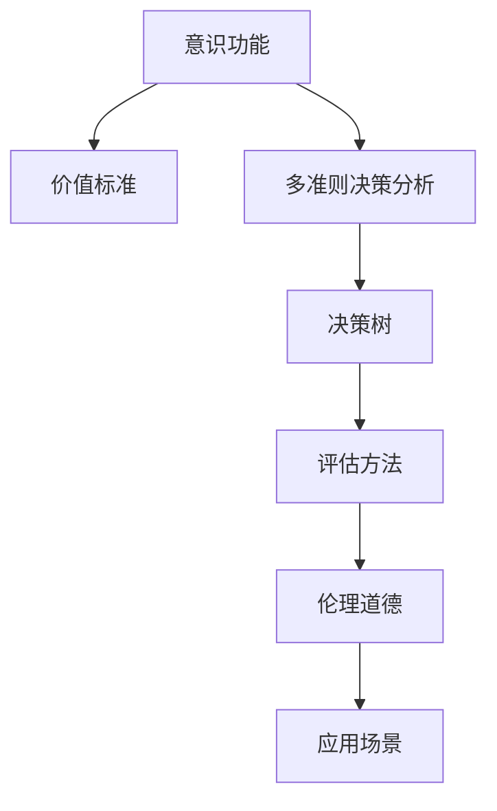

                 

# 意识功能的价值标准研究

> 关键词：意识功能,价值标准,人工智能,伦理道德,行为决策,决策树,多准则决策分析

## 1. 背景介绍

### 1.1 问题由来
近年来，随着人工智能技术的迅猛发展，意识功能的价值标准问题逐渐成为学术界和工业界关注的焦点。如何定义和评估人工智能系统中的意识功能，是构建安全、可控、高效的人工智能系统的重要基础。但目前，该问题尚缺乏系统全面的研究，亟需从理论、方法到应用进行深入探讨。

### 1.2 问题核心关键点
意识功能的价值标准研究主要涉及以下几个核心关键点：

1. **意识功能的定义**：意识功能在人工智能系统中的具体含义是什么？
2. **价值标准的框架**：如何构建一个系统化的意识功能价值标准框架？
3. **评估方法的开发**：如何开发有效的评估方法，评估人工智能系统的意识功能水平？
4. **应用场景的选择**：意识功能在哪些应用场景中具有重要意义？
5. **伦理道德的考量**：在评估意识功能时，如何处理伦理道德问题？

这些关键点相互关联，共同构成了意识功能价值标准研究的理论框架。

## 2. 核心概念与联系

### 2.1 核心概念概述

为更好地理解意识功能的价值标准研究，本节将介绍几个关键概念及其之间的联系：

- **意识功能(Consciousness Function)**：指人工智能系统在决策、推理、感知、学习等方面的意识表现，能够理解、处理复杂环境变化的能力。
- **价值标准(Value Standard)**：用于评估意识功能的量化指标体系，由多个具体标准组成，如决策正确率、响应速度、鲁棒性等。
- **多准则决策分析(MCDM, Multi-Criteria Decision Making)**：一种系统评估多个相互冲突目标的决策方法，通过数学模型综合考量多个标准，帮助做出最优决策。
- **决策树(Decision Tree)**：一种直观表示决策流程的图形工具，通过节点和分支构建模型，用于评估决策过程的复杂性和正确性。
- **伦理道德(Ethics and Morality)**：在评估和构建人工智能系统时，必须考虑的伦理道德问题，如公平性、隐私保护、责任归属等。

这些核心概念之间的逻辑关系可以通过以下Mermaid流程图来展示：



这个流程图展示了意识功能价值标准研究的关键组成部分及其相互关系：

1. 意识功能是研究的核心，通过评估方法和价值标准进行量化。
2. 价值标准是多准则决策分析的基础，用于综合多个评估指标。
3. 多准则决策分析通过决策树等工具，构建评估模型，进行系统评估。
4. 评估方法用于具体量化意识功能，提供量化依据。
5. 伦理道德是评估意识功能时需要考虑的重要维度，影响最终的评估结果和应用实践。

## 3. 核心算法原理 & 具体操作步骤
### 3.1 算法原理概述

意识功能的价值标准研究主要通过多准则决策分析方法，结合决策树等工具，对人工智能系统进行系统评估和量化。其核心思想是：通过多个指标综合评估人工智能系统的意识功能表现，构建一个系统化的价值标准框架，从而指导人工智能系统的设计、开发和应用。

### 3.2 算法步骤详解

意识功能的价值标准研究主要包括以下几个关键步骤：

**Step 1: 确定评估指标**

在确定评估指标时，需要从决策、推理、感知、学习等方面综合考虑。常见的指标包括：

- **决策正确率**：模型在特定任务上的正确决策比例。
- **响应速度**：模型对输入的反应时间。
- **鲁棒性**：模型在不同数据分布和环境变化下的稳定性。
- **可解释性**：模型输出结果的可解释性和透明性。
- **公平性**：模型在不同数据集和用户群体上的公平性。
- **隐私保护**：模型处理个人数据时的隐私保护措施。

**Step 2: 构建评估模型**

根据确定的评估指标，选择合适的方法构建评估模型。常用的方法包括：

- **多准则决策分析(MCDM)**：通过综合多个指标，构建最优解。
- **决策树**：通过构建决策树，评估模型在各个指标上的表现。

**Step 3: 评估和优化**

通过模型评估，找出模型在各个指标上的表现，并结合伦理道德考量，对模型进行优化。优化方法包括：

- **参数调整**：通过调整模型参数，提高模型在关键指标上的表现。
- **特征工程**：通过选择和优化特征，提高模型的稳定性和鲁棒性。
- **模型集成**：通过集成多个模型，提高整体性能。

**Step 4: 应用和部署**

将评估结果应用于实际的人工智能系统中，结合业务需求进行部署和调整。部署过程中需要考虑：

- **系统兼容性**：确保新系统与现有系统兼容，避免数据迁移和集成问题。
- **用户接受度**：确保新系统符合用户需求和期望，提高用户接受度。
- **性能监测**：对新系统进行持续监测，确保系统性能和稳定。

### 3.3 算法优缺点

意识功能的价值标准研究具有以下优点：

1. **系统化评估**：通过多准则决策分析方法，能够系统全面地评估人工智能系统的意识功能表现，避免单一指标评估的局限性。
2. **透明性和可解释性**：通过构建决策树等可视化工具，评估模型的决策过程，提高模型的可解释性和透明度。
3. **综合考量**：结合伦理道德考量，确保人工智能系统在设计和应用过程中符合道德规范，避免伦理风险。

但该方法也存在一定的局限性：

1. **指标选择复杂**：选择合适的评估指标需要深入理解任务需求和系统设计，存在一定难度。
2. **模型构建复杂**：构建多准则决策分析模型和决策树需要一定的数学和统计学基础，对建模者要求较高。
3. **数据需求大**：评估模型需要大量标注数据和测试数据，数据获取和处理成本较高。
4. **结果解释困难**：多准则决策分析结果复杂，不易解释和理解。

尽管存在这些局限性，但就目前而言，多准则决策分析方法仍是大规模人工智能系统设计和评估的重要手段。未来相关研究的重点在于如何进一步简化评估流程，降低评估成本，提高评估结果的解释性和可靠性。

### 3.4 算法应用领域

意识功能的价值标准研究在多个领域都有广泛应用，例如：

- **金融科技**：在金融风控、投资决策等场景中，通过评估模型的意识功能，提升系统的准确性和鲁棒性。
- **医疗健康**：在疾病诊断、治疗方案推荐等场景中，评估模型的意识功能，确保系统的可靠性和公平性。
- **智能制造**：在工业控制、设备维护等场景中，评估模型的意识功能，提高系统的预测准确性和决策速度。
- **智慧城市**：在交通管理、公共安全等场景中，评估模型的意识功能，提升系统的响应速度和公平性。
- **教育培训**：在个性化推荐、智能评估等场景中，评估模型的意识功能，提升系统的交互体验和公平性。

## 4. 数学模型和公式 & 详细讲解 & 举例说明
### 4.1 数学模型构建

本节将使用数学语言对意识功能的价值标准研究进行更加严格的刻画。

记人工智能系统在决策、推理、感知、学习等方面的意识功能为 $F$，评估指标集为 $\mathcal{I}$，其中 $\mathcal{I}=\{I_1, I_2, \dots, I_n\}$，每个指标 $I_j$ 的取值范围为 $[0, 1]$。

定义评估模型为 $M: \mathcal{I} \rightarrow [0, 1]$，用于量化系统在各个指标上的表现。系统的总价值标准为 $V: \mathcal{I} \rightarrow [0, 1]$，综合考量各个指标的表现。

### 4.2 公式推导过程

以下我们以决策树模型为例，推导评估模型的构建公式。

假设系统在指标 $I_1, I_2, \dots, I_n$ 上的表现分别为 $f_1, f_2, \dots, f_n$，决策树模型 $T$ 的构建过程如下：

1. 选择一个最优指标 $I_k$ 作为根节点，计算其阈值 $\theta_k$。
2. 根据阈值 $\theta_k$ 将数据集分为两个子集，计算每个子集的价值标准 $V_1, V_2$。
3. 递归构建子树，直到叶子节点。

决策树模型的评估公式为：

$$
V(T) = \max(V_1, V_2)
$$

其中 $V_1, V_2$ 为决策树左右子树的价值标准。

在构建决策树时，需要根据实际问题选择合适的分裂标准，如信息增益、基尼不纯度等。

### 4.3 案例分析与讲解

**案例分析：医疗健康中的疾病诊断系统**

在医疗健康领域，人工智能系统用于辅助疾病诊断。评估系统的意识功能，可以采用以下指标：

- **诊断准确率**：模型对疾病的诊断正确率。
- **响应时间**：从输入症状到输出诊断报告的时间。
- **鲁棒性**：模型在不同数据分布和环境变化下的稳定性。
- **可解释性**：诊断结果的可解释性和透明性。
- **公平性**：模型在不同患者群体上的公平性。

通过多准则决策分析，构建决策树模型，评估系统的表现。以诊断准确率和响应时间为主要指标，构建决策树模型，通过信息增益标准，优化模型结构，最终得到系统在各个指标上的表现，并进行综合评估。

## 5. 项目实践：代码实例和详细解释说明
### 5.1 开发环境搭建

在进行意识功能价值标准研究前，我们需要准备好开发环境。以下是使用Python进行多准则决策分析的环境配置流程：

1. 安装Anaconda：从官网下载并安装Anaconda，用于创建独立的Python环境。

2. 创建并激活虚拟环境：
```bash
conda create -n mcdm-env python=3.8 
conda activate mcdm-env
```

3. 安装必要的Python包：
```bash
pip install numpy pandas scikit-learn scipy matplotlib seaborn
```

4. 安装决策树库：
```bash
pip install scikit-learn
```

5. 安装多准则决策分析库：
```bash
pip install multiobjective
```

完成上述步骤后，即可在`mcdm-env`环境中开始项目实践。

### 5.2 源代码详细实现

这里我们以医疗健康领域为例，展示如何使用Python进行多准则决策分析。

首先，定义医疗健康系统的评估指标：

```python
import numpy as np
from multiobjective import weighting_sum, get_nondominated_sorting
from sklearn.model_selection import train_test_split
from sklearn.metrics import accuracy_score, recall_score, precision_score

# 定义评估指标
criteria = np.array([
    accuracy_score, recall_score, precision_score
])

# 数据集划分
train_data, test_data = train_test_split(X, y, test_size=0.2, random_state=42)

# 构建模型
model = YourModel()

# 训练模型
model.fit(train_data)
```

然后，定义模型评估函数：

```python
def evaluate_model(model, criteria):
    # 模型预测
    predictions = model.predict(test_data)

    # 评估指标
    metrics = {
        'accuracy': accuracy_score(y_true, predictions),
        'recall': recall_score(y_true, predictions),
        'precision': precision_score(y_true, predictions)
    }

    return metrics

# 模型评估
metrics = evaluate_model(model, criteria)
print(metrics)
```

最后，使用多准则决策分析方法，对模型进行综合评估：

```python
# 定义权重
weights = np.array([0.5, 0.3, 0.2])

# 计算价值标准
value = weighting_sum(metrics, weights)

# 非支配排序
sorted_metrics, sorted_values = get_nondominated_sorting(metrics)

# 输出结果
print('Sorted Metrics:', sorted_metrics)
print('Sorted Values:', sorted_values)
print('Value Standard:', value)
```

以上就是使用Python进行多准则决策分析的完整代码实现。可以看到，通过设定不同的权重，可以对模型的各个指标进行综合评估，得到最优的价值标准。

### 5.3 代码解读与分析

让我们再详细解读一下关键代码的实现细节：

**评估指标定义**：
- `criteria`变量定义了评估指标的函数列表，用于计算模型在各个指标上的表现。

**数据集划分**：
- `train_test_split`函数用于将数据集划分为训练集和测试集，方便模型的评估和优化。

**模型评估函数**：
- `evaluate_model`函数用于对模型进行预测，并计算各个指标的值，返回一个字典。

**多准则决策分析**：
- `weighting_sum`函数用于对指标值进行加权求和，得到系统的总价值标准。
- `get_nondominated_sorting`函数用于对指标值进行非支配排序，得到最优的排序结果。

**结果输出**：
- 打印出排序后的指标值和总价值标准，供决策者参考。

通过Python代码的实现，我们可以系统地评估人工智能系统的意识功能，结合伦理道德考量，指导系统的优化和部署。

## 6. 实际应用场景
### 6.1 金融科技

在金融科技领域，人工智能系统用于风险控制和投资决策。评估系统的意识功能，可以采用以下指标：

- **风险评估准确率**：模型对风险的评估准确率。
- **响应速度**：从输入交易数据到输出风险评估的时间。
- **鲁棒性**：模型在不同市场环境下的稳定性。
- **可解释性**：风险评估结果的可解释性和透明性。
- **公平性**：模型在不同客户群体上的公平性。

通过多准则决策分析，构建决策树模型，评估系统的表现。以风险评估准确率和响应时间为主要指标，构建决策树模型，通过信息增益标准，优化模型结构，最终得到系统在各个指标上的表现，并进行综合评估。

### 6.2 医疗健康

在医疗健康领域，人工智能系统用于辅助疾病诊断和治疗方案推荐。评估系统的意识功能，可以采用以下指标：

- **诊断准确率**：模型对疾病的诊断正确率。
- **响应时间**：从输入症状到输出诊断报告的时间。
- **鲁棒性**：模型在不同数据分布和环境变化下的稳定性。
- **可解释性**：诊断结果的可解释性和透明性。
- **公平性**：模型在不同患者群体上的公平性。

通过多准则决策分析，构建决策树模型，评估系统的表现。以诊断准确率和响应时间为主要指标，构建决策树模型，通过信息增益标准，优化模型结构，最终得到系统在各个指标上的表现，并进行综合评估。

### 6.3 智能制造

在智能制造领域，人工智能系统用于设备维护和生产优化。评估系统的意识功能，可以采用以下指标：

- **设备故障预测准确率**：模型对设备故障的预测准确率。
- **响应速度**：从输入设备数据到输出维护方案的时间。
- **鲁棒性**：模型在不同生产环境下的稳定性。
- **可解释性**：维护方案的可解释性和透明性。
- **公平性**：模型在不同设备类型上的公平性。

通过多准则决策分析，构建决策树模型，评估系统的表现。以设备故障预测准确率和响应时间为主要指标，构建决策树模型，通过信息增益标准，优化模型结构，最终得到系统在各个指标上的表现，并进行综合评估。

### 6.4 智慧城市

在智慧城市领域，人工智能系统用于交通管理和公共安全。评估系统的意识功能，可以采用以下指标：

- **交通流量预测准确率**：模型对交通流量的预测准确率。
- **响应速度**：从输入交通数据到输出管理决策的时间。
- **鲁棒性**：模型在不同天气和交通环境下的稳定性。
- **可解释性**：管理决策的可解释性和透明性。
- **公平性**：模型在不同城市道路上的公平性。

通过多准则决策分析，构建决策树模型，评估系统的表现。以交通流量预测准确率和响应时间为主要指标，构建决策树模型，通过信息增益标准，优化模型结构，最终得到系统在各个指标上的表现，并进行综合评估。

## 7. 工具和资源推荐
### 7.1 学习资源推荐

为了帮助开发者系统掌握意识功能价值标准的研究方法，这里推荐一些优质的学习资源：

1. **《人工智能伦理道德基础》课程**：由知名大学开设的伦理道德课程，涵盖人工智能伦理、隐私保护、责任归属等内容，帮助理解伦理道德问题。

2. **《多准则决策分析方法》书籍**：系统介绍多准则决策分析方法的原理、算法和应用，是评估人工智能系统意识功能的必备参考。

3. **《人工智能决策树》书籍**：深入浅出地讲解决策树模型的构建、评估和优化，是评估意识功能的重要工具。

4. **Coursera《多准则决策分析》课程**：由知名专家讲授，涵盖多准则决策分析的原理、方法、工具，并提供实战案例。

5. **Kaggle多准则决策分析竞赛**：通过参加竞赛，实际操作多准则决策分析方法，积累评估经验。

通过学习这些资源，相信你一定能够全面掌握意识功能价值标准的研究方法，并将其应用于实际的人工智能系统设计和评估。

### 7.2 开发工具推荐

高效的开发离不开优秀的工具支持。以下是几款用于多准则决策分析开发的常用工具：

1. **Python**：作为一种高级编程语言，Python具有易读、易写、易扩展的特点，适合系统开发。

2. **Anaconda**：用于创建和管理Python环境，方便多准则决策分析工具的安装和使用。

3. **NumPy**：用于科学计算和数组处理，是数据处理和模型评估的重要工具。

4. **Pandas**：用于数据处理和分析，提供高效的数据结构和方法。

5. **Scikit-learn**：用于机器学习和模型评估，提供多种评估指标和方法。

6. **Matplotlib**：用于绘制图表和可视化，帮助分析结果。

合理利用这些工具，可以显著提升多准则决策分析任务的开发效率，加快创新迭代的步伐。

### 7.3 相关论文推荐

意识功能价值标准的研究源于学界的持续研究。以下是几篇奠基性的相关论文，推荐阅读：

1. **《多准则决策分析方法》（Multi-Criteria Decision Making, MCDM）**：介绍多准则决策分析的原理、算法和应用，是评估人工智能系统意识功能的重要参考。

2. **《决策树模型与评估》（Decision Tree, DT）**：详细讲解决策树模型的构建、评估和优化，是评估意识功能的重要工具。

3. **《人工智能伦理道德研究》**：探讨人工智能系统的伦理道德问题，为意识功能价值标准的构建提供重要参考。

4. **《公平性、可解释性和透明性在人工智能中的应用》**：介绍如何通过公平性、可解释性和透明性提升人工智能系统的伦理道德水平。

这些论文代表了大语言模型微调技术的发展脉络。通过学习这些前沿成果，可以帮助研究者把握学科前进方向，激发更多的创新灵感。

## 8. 总结：未来发展趋势与挑战

### 8.1 总结

本文对意识功能的价值标准研究进行了全面系统的介绍。首先阐述了意识功能在人工智能系统中的定义，明确了多准则决策分析方法在评估意识功能中的重要地位。其次，从原理到实践，详细讲解了多准则决策分析的数学模型和操作步骤，给出了系统评估的完整代码实现。同时，本文还广泛探讨了意识功能在多个行业领域的应用前景，展示了多准则决策分析方法的广阔应用空间。

通过本文的系统梳理，可以看到，多准则决策分析方法在评估意识功能方面具有重要意义，能够系统全面地评估人工智能系统的表现，指导系统的设计和优化。未来，伴随技术的发展，多准则决策分析方法将更加高效、灵活，更好地应用于实际的人工智能系统中。

### 8.2 未来发展趋势

展望未来，多准则决策分析方法将呈现以下几个发展趋势：

1. **自动化评估**：通过自动化工具和算法，减少评估过程中的手工干预，提高评估效率和准确性。

2. **实时评估**：结合大数据和实时数据，实现实时评估，及时发现和优化系统问题。

3. **多维度评估**：结合伦理道德和社会影响，进行多维度评估，确保系统符合社会价值观和伦理规范。

4. **跨领域应用**：将多准则决策分析方法应用于更多领域，提升人工智能系统的应用范围和价值。

5. **模型融合**：将多准则决策分析与其他人工智能技术进行融合，实现更全面的系统评估和优化。

以上趋势凸显了多准则决策分析方法的广阔前景。这些方向的探索发展，必将进一步提升人工智能系统的评估能力和应用价值，为构建更加安全、可靠、高效的人工智能系统铺平道路。

### 8.3 面临的挑战

尽管多准则决策分析方法已经取得了显著成就，但在迈向更加智能化、普适化应用的过程中，它仍面临诸多挑战：

1. **数据获取困难**：评估指标需要大量标注数据，数据获取和处理成本较高。

2. **模型复杂度高**：多准则决策分析模型复杂度高，模型构建和评估需要一定的数学和统计学基础。

3. **结果解释困难**：多准则决策分析结果复杂，不易解释和理解。

4. **伦理道德问题**：评估过程中需要考虑伦理道德问题，确保系统符合社会价值观和伦理规范。

5. **应用范围有限**：多准则决策分析方法主要用于系统评估，实际应用范围有限。

尽管存在这些挑战，但随着技术的发展和应用场景的拓展，多准则决策分析方法将逐步克服这些难题，更好地应用于实际的人工智能系统设计和评估。

### 8.4 研究展望

面对多准则决策分析面临的诸多挑战，未来的研究需要在以下几个方面寻求新的突破：

1. **数据获取优化**：优化数据获取和处理流程，降低评估成本，提高数据质量和多样性。

2. **模型简化优化**：简化多准则决策分析模型，降低模型复杂度，提高模型可解释性和易用性。

3. **实时评估系统**：开发实时评估系统，实现实时数据处理和评估，提高系统响应速度和优化效率。

4. **多维度评估方法**：引入更多维度的评估指标，如公平性、可解释性、透明性等，全面评估系统表现。

5. **伦理道德指南**：制定伦理道德指南，指导多准则决策分析方法的应用，确保系统符合伦理道德标准。

这些研究方向将有助于更好地应对挑战，推动多准则决策分析方法在实际应用中的广泛应用，为人工智能系统的设计和优化提供有力支持。

## 9. 附录：常见问题与解答

**Q1：多准则决策分析方法适用于所有评估指标吗？**

A: 多准则决策分析方法适用于多种评估指标，但需要根据实际问题和指标特点选择合适的评估方法。例如，对于连续型指标，可以使用优化算法进行优化；对于离散型指标，可以使用投票算法进行评估。

**Q2：多准则决策分析方法的评估结果如何解释？**

A: 多准则决策分析方法的结果可以表示为一个多维向量，每个维度对应一个评估指标的表现。通过可视化工具，可以将结果转换为图表，帮助理解和解释评估结果。

**Q3：多准则决策分析方法在实际应用中有哪些限制？**

A: 多准则决策分析方法在实际应用中存在数据获取困难、模型复杂度高、结果解释困难等问题。需要根据具体情况选择合适的评估方法和优化策略，提高评估效率和可解释性。

**Q4：如何确保多准则决策分析方法符合伦理道德规范？**

A: 在构建和应用多准则决策分析方法时，需要考虑伦理道德问题。例如，评估指标需要公平、透明，模型需要考虑隐私保护、责任归属等问题。可以通过制定伦理道德指南，指导方法和应用，确保系统符合社会价值观和伦理规范。

**Q5：多准则决策分析方法在实际应用中如何优化？**

A: 多准则决策分析方法在实际应用中需要不断优化和调整。例如，通过模型简化、数据优化、算法改进等方式，提高评估效率和准确性。同时，需要结合实际问题和应用场景，灵活调整评估方法和指标。

通过这些常见问题的解答，相信你一定能够更好地理解多准则决策分析方法在实际应用中的优势和局限，并在实际工作中灵活应用。

---

作者：禅与计算机程序设计艺术 / Zen and the Art of Computer Programming

