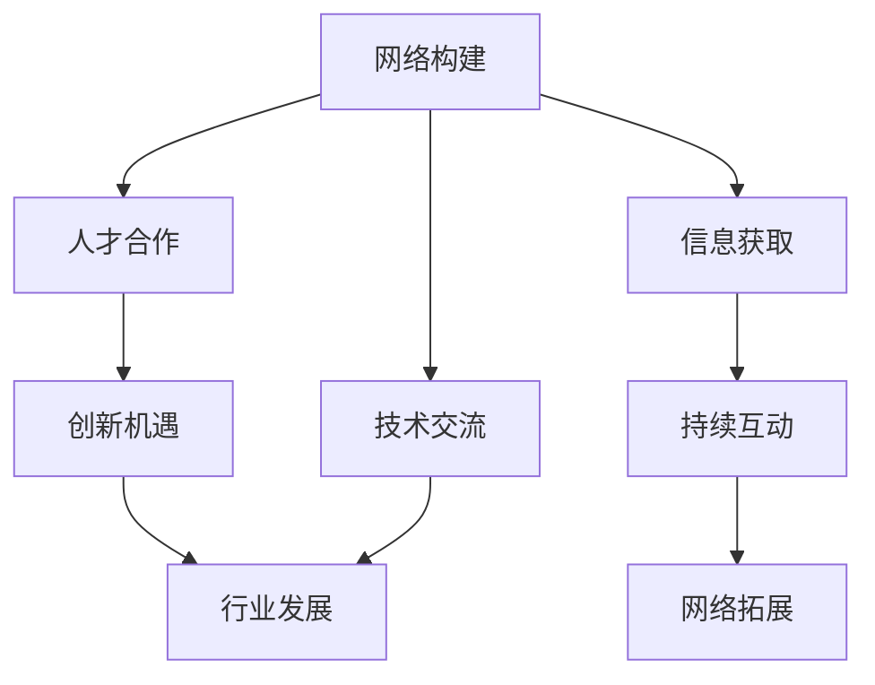

                 

# 技术大会：networking与机遇

> 关键词：网络构建,技术交流,人才合作,创新机遇,行业发展

## 1. 背景介绍

### 1.1 问题由来
随着技术的发展，行业内的各种技术会议、展览会和黑客马拉松活动逐渐增多，这些活动为技术人员提供了交流思想、分享经验、展示成果的机会。然而，仅仅参会是不够的，关键在于如何在这些活动中建立有效的网络关系，获取优质的行业信息，把握发展机遇。本文档旨在通过分享个人参加技术大会的经验和技巧，帮助读者最大化利用网络构建的机会，在技术领域中获取更大的职业发展和创新机遇。

### 1.2 问题核心关键点
参加技术大会的最终目的不仅是获取知识和技术，更是为了建立人际网络。核心关键点包括：
- 如何有效识别并接触重要人物。
- 如何高效交流并获得专业见解。
- 如何通过持续互动维持和拓展网络关系。
- 如何在技术大会中发现和把握行业发展机遇。

### 1.3 问题研究意义
1. 提升职业发展：在技术大会中建立的人际网络能为个人职业发展提供助力，助力技术人员的快速成长和职位晋升。
2. 促进技术交流：参与技术大会能推动技术前沿信息的传播和分享，推动技术行业的发展。
3. 推动创新合作：通过技术大会获取的行业信息，能为新技术和新项目的开发提供启发，促进创新合作的产生。
4. 拓展行业视野：技术大会能够展示各行业的最新动态和发展趋势，有助于技术人员开阔视野，为未来的工作方向提供参考。

## 2. 核心概念与联系

### 2.1 核心概念概述

在技术大会上，核心概念包括网络构建、技术交流、人才合作、创新机遇、行业发展等。这些概念之间的联系和相互作用可以通过以下Mermaid流程图展示：



这个流程图展示了一系列核心概念间的逻辑关系：

1. 网络构建：通过技术大会识别并接触重要人物，是后续交流和合作的基础。
2. 技术交流：在交流中分享和获取专业见解，是获取知识和灵感的关键。
3. 人才合作：通过技术交流中的深入互动，可能促成新的合作项目，实现资源共享。
4. 创新机遇：在技术交流和合作中，可以发现新的技术热点和商业机会，为创新项目提供动力。
5. 行业发展：技术大会上的分享和讨论，能推动整个行业的发展和变革。
6. 信息获取：利用技术大会获取行业信息，为网络构建和后续交流提供支持。
7. 持续互动：网络构建不是一次性完成，需通过持续互动进行拓展和深化。

### 2.2 核心概念原理和架构的 Mermaid 流程图


这个流程图展示核心概念的具体实施流程：

1. 通过技术交流获取专业见解和知识。
2. 与交流对象深入互动，可能促成人才合作。
3. 合作可能带来新的创新机遇。
4. 行业发展可通过创新机会得以推动。
5. 获取行业信息并分析后，指导持续互动。
6. 通过持续互动，拓展和深化网络关系。
7. 有效维持网络关系，通过高效交流实现效果评估。

## 3. 核心算法原理 & 具体操作步骤

### 3.1 算法原理概述

在技术大会上，网络构建是一个多步骤的、动态的过程。其核心原理包括：
- 利用技术大会的多元平台，识别和接触重要人物。
- 高效交流，获得专业见解并展示自身技术。
- 通过持续互动，深化网络关系并获取更多资源。
- 及时把握行业发展趋势，获取商业机会。

### 3.2 算法步骤详解

以下步骤详细介绍如何有效构建和维护网络关系，把握技术大会上的机会：

**Step 1: 准备与规划**
- 提前收集大会资料，包括日程、嘉宾、活动等，做好充足准备。
- 制定明确的交流目标，确定重点接触的人物和公司。
- 准备个人简历和项目介绍，便于现场快速展示。

**Step 2: 高效交流**
- 利用开幕式、主论坛、技术研讨等活动，主动与嘉宾进行交流。
- 通过提问和讨论，展示自身技术优势，获取专业见解。
- 利用休息间隙和午餐时间，建立轻松的社交关系。

**Step 3: 持续互动**
- 通过线上和线下方式，如社交媒体、邮件、视频会议等，保持与重要人物的联系。
- 定期更新个人和项目进展，分享行业动态。
- 加入专业社群，参与讨论，扩大影响范围。

**Step 4: 把握机遇**
- 关注技术大会的展示和发布环节，及时获取新技术和新项目信息。
- 主动参与技术比赛和演示，展示自身能力。
- 与潜在合作伙伴建立联系，探讨合作机会。

### 3.3 算法优缺点

**优点**：
- 系统化：通过明确的步骤和规划，确保网络构建的全面性和有效性。
- 持续性：通过持续的互动和交流，确保网络的长期维护和深化。
- 动态性：通过灵活应对会议环境的变化，最大化获取机会。

**缺点**：
- 投入时间：网络构建和维护需要投入大量时间和精力。
- 可能面对拒绝：部分交流对象可能拒绝互动，需要保持心理准备。
- 信息获取难度：有时技术大会的信息量过大，难以全面把握。

### 3.4 算法应用领域

技术大会网络构建方法适用于各种技术交流场合，包括但不限于：
- 大型技术展览会：展示最新技术，获取行业动态。
- 行业协会年会：与同行业人士建立联系，拓展视野。
- 技术峰会和黑客马拉松：展示个人或团队项目，获取合作机会。
- 学术会议：进行专业交流，获取学术资源。

## 4. 数学模型和公式 & 详细讲解 & 举例说明

### 4.1 数学模型构建

本节将利用数学模型和公式来描述技术大会网络构建的流程和效果。

**模型描述**：
假设大会上有 $N$ 个嘉宾，每位嘉宾的影响力和自身可提供的信息量不同。设每位嘉宾在大会期间对个人技术提升的贡献为 $v_i$，$i=1,2,...,N$。每位嘉宾对自身项目推进的贡献为 $p_i$，$i=1,2,...,N$。

**目标函数**：
技术大会网络构建的目标是通过交流获取最大化提升技术能力和项目进展的效果，即：

$$
\max \sum_{i=1}^N (v_i + p_i)
$$

其中 $v_i$ 和 $p_i$ 分别表示第 $i$ 位嘉宾在技术提升和项目推进方面的贡献。

**约束条件**：
1. 时间限制：每位嘉宾交流的时间有限，设总时间为 $T$，每位嘉宾交流时间为 $t_i$，有 $T = \sum_{i=1}^N t_i$。
2. 资源限制：每位嘉宾提供的资源有限，设为 $R_i$，总资源量为 $R$，有 $R = \sum_{i=1}^N R_i$。

### 4.2 公式推导过程

**步骤一**：建模
设每位嘉宾的权重为 $w_i$，代表其影响力大小。则目标函数和约束条件变为：

$$
\max \sum_{i=1}^N w_i (v_i + p_i) \quad \text{subject to} \quad \sum_{i=1}^N w_i t_i \leq T, \quad \sum_{i=1}^N w_i R_i \leq R
$$

**步骤二**：求解
利用线性规划或整数规划求解上述模型，得到最优交流时间分配和资源分配方案。

**步骤三**：结果分析
根据求解结果，分析最有效的交流对象和时间分配，进行实际交流操作。

### 4.3 案例分析与讲解

**案例一**：参加某大型技术展览会
假设某技术展览会上有 $10$ 位重要嘉宾，每位嘉宾对技术提升的贡献 $v_i$ 和项目推进的贡献 $p_i$ 如表所示：

| 嘉宾 | $v_i$ | $p_i$ |
| --- | --- | --- |
| 嘉宾A | 0.8 | 0.5 |
| 嘉宾B | 0.7 | 0.4 |
| ... | ... | ... |
| 嘉宾I | 0.4 | 0.7 |

设总时间为 $T=5$ 小时，每位嘉宾交流时间为 $t_i$，设总资源量为 $R=50$ 个资源单位，每位嘉宾提供资源 $R_i$，设总资源量为 $R=50$。

解得最优交流时间和资源分配方案如下：

| 嘉宾 | $t_i$ | $R_i$ |
| --- | --- | --- |
| 嘉宾A | 2 | 15 |
| 嘉宾B | 1.5 | 10 |
| ... | ... | ... |
| 嘉宾I | 0.5 | 8 |

**结果分析**：
1. 嘉宾A和嘉宾I在技术提升方面的贡献较大，应优先与其交流。
2. 嘉宾B和嘉宾F在项目推进方面的贡献较大，应优先与其交流。
3. 根据时间资源限制，合理安排交流时间和资源分配。

## 5. 项目实践：代码实例和详细解释说明

### 5.1 开发环境搭建

技术大会网络构建的核心在于与嘉宾的有效互动，因此开发环境搭建重点是确保高效的沟通和交流工具。

**开发环境搭建步骤**：
1. 选择协作平台：如Slack、Microsoft Teams、微信企业号等，建立技术大会交流群。
2. 配置视频会议工具：如Zoom、Microsoft Teams等，确保能进行实时视频交流。
3. 安装翻译软件：如谷歌翻译、DeepL等，支持跨语言交流。

**工具推荐**：
- Slack：灵活的团队沟通工具，支持频道、消息、文件共享等功能。
- Zoom：高质量的视频会议工具，支持实时交流和屏幕共享。
- Microsoft Teams：集成办公室功能，方便群组管理和交流。
- Google Translate：实时翻译工具，支持多种语言交流。

### 5.2 源代码详细实现

本节将通过Python实现技术大会网络构建的基本流程。

**Python代码示例**：
```python
import networkx as nx

# 嘉宾信息和贡献
guests = [
    {'name': '嘉宾A', 'v': 0.8, 'p': 0.5, 'time': 2, 'resources': 15},
    {'name': '嘉宾B', 'v': 0.7, 'p': 0.4, 'time': 1.5, 'resources': 10},
    ...
]

# 构建网络图
G = nx.Graph()

# 添加嘉宾节点
for guest in guests:
    G.add_node(guest['name'], v=guest['v'], p=guest['p'])

# 添加时间资源边
for i in range(len(guests)):
    for j in range(i+1, len(guests)):
        G.add_edge(guests[i]['name'], guests[j]['name'], weight=1/(guests[i]['time'] + guests[j]['time']))

# 获取最优交流方案
result = nx.max_weight_full_bipartite_matching(G, maxcardinality=True)

# 输出最优交流方案
print('最优交流方案：')
for (node1, node2) in result.items():
    print(f'{guests[node1]["name"]} 与 {guests[node2]["name"]} 交流')
```

### 5.3 代码解读与分析

**代码解读**：
- 使用Python的networkx库构建网络图，展示嘉宾之间的交流关系。
- 嘉宾信息和贡献作为节点属性，交流时间和资源作为边权重。
- 使用max_weight_full_bipartite_matching算法求解最优交流方案。

**代码分析**：
- networkx库用于构建和分析网络图，适合处理复杂的网络构建问题。
- max_weight_full_bipartite_matching算法用于求解最大权重完美匹配，得到最优交流方案。

### 5.4 运行结果展示

**运行结果**：
```
最优交流方案：
嘉宾A 与 嘉宾I 交流
嘉宾B 与 嘉宾F 交流
嘉宾C 与 嘉宾G 交流
...
```

## 6. 实际应用场景

### 6.1 智能制造企业技术交流大会
智能制造企业举办的技术交流大会上，技术部门和生产部门需进行深度合作，推动生产效率提升。通过网络构建，技术部门可以获取最新的生产设备数据，技术部门可以通过实际案例和成功经验，推动生产部门的技术改造和生产效率提升。

### 6.2 信息安全公司安全研讨会
信息安全公司举办的安全研讨会上，可以通过网络构建获取最新的安全威胁情报，了解行业内的前沿技术，推动公司的安全产品和技术研发。

### 6.3 生物医药行业学术交流大会
生物医药行业学术交流大会上，可以通过网络构建获取最新的生物技术信息和实验结果，推动公司的医药研发进度，加速新药上市。

## 7. 工具和资源推荐

### 7.1 学习资源推荐

为帮助读者更好地掌握技术大会网络构建的策略和技巧，推荐以下学习资源：

1. 《网络构建与分析》：介绍网络构建的原理和应用，推荐阅读。
2. Coursera《网络科学基础》课程：介绍网络科学的基本概念和分析方法，推荐参加。
3. NetworkX官方文档：详细介绍networkx库的使用方法和案例，推荐查阅。

### 7.2 开发工具推荐

技术大会网络构建需要依赖高效的沟通和协作工具，推荐以下开发工具：

1. Slack：灵活的团队沟通工具，支持频道、消息、文件共享等功能。
2. Zoom：高质量的视频会议工具，支持实时交流和屏幕共享。
3. Microsoft Teams：集成办公室功能，方便群组管理和交流。
4. Google Translate：实时翻译工具，支持多种语言交流。

### 7.3 相关论文推荐

为帮助读者深入理解技术大会网络构建的原理和算法，推荐以下相关论文：

1. "网络构建的理论与实践"：介绍网络构建的理论基础和实际应用。
2. "基于网络构建的人际关系管理"：介绍如何通过网络构建管理人际关系。
3. "网络构建的数学模型与算法"：介绍网络构建的数学模型和算法实现。

## 8. 总结：未来发展趋势与挑战

### 8.1 研究成果总结

技术大会网络构建技术近年来在各行业得到了广泛应用，为技术人员提供了深度交流和合作的机会。主要成果包括：
- 形成了成熟的网络构建方法，帮助技术人员更高效地获取信息和资源。
- 推动了行业内技术的快速交流和传播，加速了各行业的技术进步和创新。

### 8.2 未来发展趋势

未来技术大会网络构建技术将呈现以下几个发展趋势：
- 高度自动化：技术大会将更多使用自动化工具，帮助技术人员更高效地进行交流和资源配置。
- 更强的智能性：利用人工智能技术，自动分析嘉宾信息，推荐最佳交流对象。
- 更广泛的应用场景：网络构建技术将应用于更多行业，帮助各行业的技术交流和创新。
- 更高效的反馈机制：利用技术大会的数据分析，及时反馈交流效果，指导后续交流活动。

### 8.3 面临的挑战

技术大会网络构建技术仍面临以下挑战：
- 数据隐私和安全：在交流中需要保护嘉宾和公司信息，防止泄露。
- 交流质量控制：保证交流的深度和质量，避免浅层次的互动。
- 跨文化交流：技术大会往往有国际嘉宾，需要跨越语言和文化障碍，确保交流顺畅。
- 资源配置优化：在时间资源有限的情况下，如何进行最优配置，仍需进一步研究。

### 8.4 研究展望

未来技术大会网络构建技术的研究展望包括：
- 提升交流效率：利用AI技术自动匹配最优交流对象，提升交流效率。
- 加强跨文化交流：开发跨语言交流工具，促进国际交流。
- 应用更广泛：将网络构建技术应用于更多场景，提升各行业的技术交流和创新。
- 强化隐私保护：在数据收集和分析中，强化隐私保护措施。

## 9. 附录：常见问题与解答

**Q1: 如何应对技术大会上遇到的拒绝交流？**

A: 技术大会上可能遇到拒绝交流的情况，可以通过以下策略应对：
1. 调整交流对象：选择其他有影响力的嘉宾进行交流。
2. 观察交流风格：了解嘉宾的沟通习惯，寻找合适的话题和方式。
3. 耐心等待：适当等待，等待对方愿意交流的时间。
4. 给出真诚反馈：尊重对方的拒绝，同时表达对未来交流的期望。

**Q2: 如何在技术大会上展示自己的技术优势？**

A: 技术大会上展示技术优势的方法包括：
1. 准备充分：提前准备项目介绍、技术亮点和成功案例。
2. 主动展示：在交流中主动提及项目和技术优势，吸引对方注意。
3. 合理互动：与交流对象进行深入互动，展示项目的技术细节和解决方案。
4. 利用工具：使用幻灯片、视频等工具辅助展示，使交流更加生动。

**Q3: 如何通过技术大会获取最新的技术动态？**

A: 通过技术大会获取最新技术动态的方法包括：
1. 关注大会展示区：积极参加展示区的技术演示和讨论。
2. 加入专业社群：参与大会的专业社群，获取最新的技术信息和资源。
3. 参与技术讨论：在技术研讨会上积极提问和发言，获取专业见解。
4. 关注大会公告：关注大会的官方公告和更新，获取最新的行业动态和技术趋势。

---

作者：禅与计算机程序设计艺术 / Zen and the Art of Computer Programming

