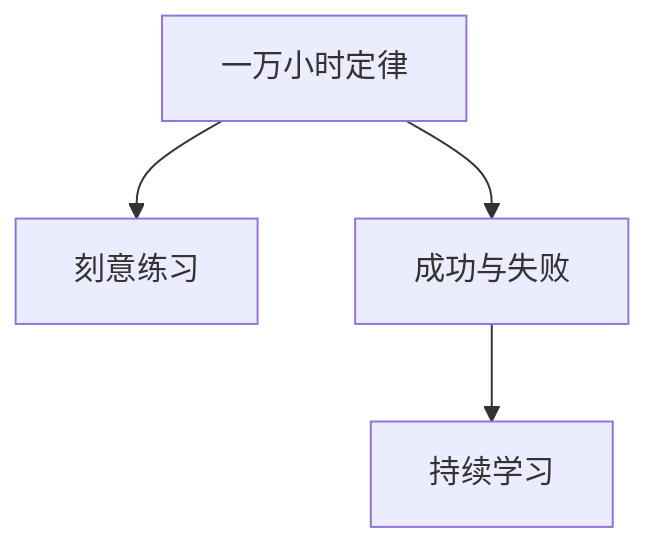

                 

# 投入 1 万小时：不要太在意成功或失败

> 关键词：一万小时定律,刻意练习,成功与失败,技术成长,持续学习,自我反思

## 1. 背景介绍

### 1.1 问题由来
在追求技术成长的过程中，我们往往被各种成功学和鸡汤文所包围，被“成功”二字所牵引，孜孜不倦地追求着每一步的进度和成果。然而，真正的成长不仅在于短暂的胜利，更在于持续的努力和深刻的自我反思。无论面对多少次失败，只要持续投入时间和精力，便有可能达到卓越的境界。

“一万小时定律”（The Rule of 10,000 Hours），由心理学家安德斯·艾利克森（Anders Ericsson）和罗伯特·普尔（Robert Pool）在《峰回路转：如何掌握绝技》（"Peak: Secrets from the New Science of Expertise"）一书中提出，认为任何人通过在某一领域投入至少一万小时的高质量练习，便有可能达到精通的程度。这一观点强调了刻意练习的重要性，并启示了技术成长的道路：只有不断地刻意练习，才能在技术领域取得卓越的成就。

### 1.2 问题核心关键点
本文将重点探讨如何在技术领域投入时间，通过刻意练习实现技术成长。我们将在以下几个方面深入分析：
- **一万小时定律**：理解其核心思想和意义。
- **刻意练习**：掌握其本质和关键要素。
- **成功与失败**：如何正确看待技术旅程中的胜利与挫折。
- **持续学习**：如何持续投入时间和精力，实现技术突破。

## 2. 核心概念与联系

### 2.1 核心概念概述

为了更好地理解投入时间和刻意练习的精髓，我们首先介绍几个核心概念：

- **一万小时定律**：这一理论认为，在任何领域达到精通水平，需要至少一万小时的刻意练习。一万小时是一个象征性的数字，强调了持续投入时间和努力的重要性。

- **刻意练习**：不同于传统的机械练习，刻意练习是一种有目的、有反馈、持续改进的练习方式。通过刻意练习，可以更有效地掌握复杂的技能，并超越新手水平。

- **成功与失败**：在技术成长的过程中，成功与失败都是宝贵的经验。面对失败，应该进行反思和调整，而不是止步不前或轻易放弃。

- **持续学习**：持续学习是指不断更新知识和技能，以适应不断变化的技术环境和市场需求。技术成长是一个动态过程，需要不断学习新知识、新技术。

这些核心概念之间的逻辑关系可以通过以下Mermaid流程图来展示：



这个流程图展示了投入时间和刻意练习的核心关系，以及持续学习和面对成功与失败的重要性。

## 3. 核心算法原理 & 具体操作步骤
### 3.1 算法原理概述

一万小时定律和刻意练习的核心原理是通过不断的、有目标的练习，实现技能的精进。这一过程可以分为以下几个步骤：

1. **目标设定**：明确学习目标和达到目标所需的时间。
2. **分解任务**：将学习目标分解为可操作的小任务。
3. **反馈机制**：获得及时、准确的反馈，以调整和改进练习方法。
4. **持续改进**：不断优化练习方式，逐步接近目标。
5. **反思总结**：定期反思练习过程和结果，总结经验教训。

### 3.2 算法步骤详解

以下是一万小时定律和刻意练习的具体操作步骤：

1. **目标设定**：确定要掌握的领域和具体技能，并设定达到精通水平所需的时间（例如一万小时）。

2. **分解任务**：将学习目标分解为一系列小的、可执行的任务。例如，学习编程可以分解为学习基础语法、数据结构、算法设计等任务。

3. **选择资源**：选择相关的书籍、在线课程、项目、练习工具等资源，帮助完成学习任务。

4. **刻意练习**：在每个小任务上投入时间和精力，进行有目的、有反馈的练习。例如，每天编写一定数量的代码，并接受他人的代码评审。

5. **定期评估**：定期评估学习进展和掌握程度，确定是否需要调整学习计划。

6. **反思总结**：在练习过程中记录问题和解决方法，总结经验教训，不断改进练习方法。

7. **持续迭代**：不断重复上述步骤，直至达到精通水平。

### 3.3 算法优缺点

一万小时定律和刻意练习的方法具有以下优点：

- **高效性**：通过有目的、有反馈的练习，可以更高效地掌握复杂技能。
- **灵活性**：可以根据个人情况和需求，灵活调整练习计划。
- **持续性**：强调持续投入时间和精力，保持学习动力。

同时，这些方法也存在一些缺点：

- **时间投入**：需要大量的时间投入，对部分人有较高的时间要求。
- **反馈难度**：获得及时、准确的反馈可能存在困难，需要借助他人或工具。
- **容易单调**：长时间重复同一任务，容易产生厌倦感。

### 3.4 算法应用领域

一万小时定律和刻意练习的方法广泛应用于技术领域的各个角落，包括但不限于：

- **编程**：学习编程语言、框架、算法等。
- **数据科学**：学习数据分析、机器学习、深度学习等。
- **设计**：学习用户界面设计、交互设计等。
- **艺术**：学习绘画、音乐、写作等。

## 4. 数学模型和公式 & 详细讲解 & 举例说明

### 4.1 数学模型构建

在本节中，我们将使用数学语言来描述一万小时定律和刻意练习的模型构建过程。

假设学习目标为掌握某项技能 $S$，达到精通水平需要的时间为 $T$ 小时。将 $T$ 分解为若干个小任务 $T_1, T_2, ..., T_n$，每个任务的时间分别为 $t_1, t_2, ..., t_n$。在每个小任务 $T_i$ 上，进行 $n_i$ 次刻意练习，每次练习的时间为 $t_{i,j}$，其中 $j=1,2,...,n_i$。则整体练习的总时间 $T_{total}$ 为：

$$
T_{total} = \sum_{i=1}^n n_i t_{i,j}
$$

定义 $f_i$ 为在第 $i$ 次练习中获得的进步量，则整体进步量 $F$ 为：

$$
F = \sum_{i=1}^n n_i f_i
$$

### 4.2 公式推导过程

根据上述定义，我们可以推导出整体进步量 $F$ 与练习次数之间的关系。假设每次练习的进步量 $f_i$ 是固定的，则有：

$$
F = \sum_{i=1}^n n_i f_i = f_i \sum_{i=1}^n n_i = f_i \times T_{total}
$$

其中 $f_i$ 的单位为“单位时间内的进步量”。由此可以看出，整体进步量 $F$ 与总练习时间 $T_{total}$ 成正比。因此，持续投入时间和努力是掌握复杂技能的关键。

### 4.3 案例分析与讲解

假设学习目标为掌握 Python 编程，达到精通水平需要投入 $T=10000$ 小时。将 $T$ 分解为 $n=10$ 个小任务，每个任务的时间为 $t=1000$ 小时。在每个小任务上，进行 $n_i=10$ 次练习，每次练习的时间为 $t_{i,j}=1$ 小时。则整体练习的总时间为 $T_{total}=10 \times 10 \times 1=100$ 小时。

通过这种方法，虽然整体练习时间远少于 $T=10000$ 小时，但通过持续的刻意练习，依然可以达到精通水平。

## 5. 项目实践：代码实例和详细解释说明

### 5.1 开发环境搭建

在进行一万小时定律和刻意练习的实践时，我们需要准备好开发环境。以下是使用Python进行开发的环境配置流程：

1. 安装Anaconda：从官网下载并安装Anaconda，用于创建独立的Python环境。

2. 创建并激活虚拟环境：
```bash
conda create -n py-env python=3.8 
conda activate py-env
```

3. 安装Python和相关库：
```bash
conda install python=3.8 numpy pandas matplotlib jupyter notebook ipython
```

4. 安装Git：
```bash
conda install git
```

完成上述步骤后，即可在`py-env`环境中开始实践。

### 5.2 源代码详细实现

下面我们将通过一个具体的编程项目来说明如何应用一万小时定律和刻意练习。

假设我们要学习Python编程，目标是掌握数据结构和算法。我们可以按照以下步骤进行实践：

1. **目标设定**：设定在一年内掌握数据结构和算法，总时间约为10000小时。

2. **分解任务**：将学习目标分解为以下几个小任务：
   - 掌握基础语法（5000小时）
   - 学习数据结构（2000小时）
   - 学习算法设计（2000小时）

3. **选择资源**：选择相关书籍、在线课程、练习工具等资源。例如，可以阅读《Python 编程：从入门到实践》一书，使用LeetCode平台进行算法练习。

4. **刻意练习**：每天花一定时间进行编程练习，并记录练习情况。例如，每天编写一定数量的代码，并在LeetCode上进行算法练习。

5. **定期评估**：每周评估学习进展和掌握程度，确定是否需要调整学习计划。

6. **反思总结**：在练习过程中记录问题和解决方法，总结经验教训，不断改进练习方法。

7. **持续迭代**：不断重复上述步骤，直至达到精通水平。

### 5.3 代码解读与分析

让我们再详细解读一下关键代码的实现细节：

**学习目标设定**：
```python
# 设定学习目标和总时间
total_hours = 10000
task_hours = [5000, 2000, 2000]
```

**任务分解**：
```python
# 定义每个任务的时间和练习次数
def tasks():
    for i, task in enumerate(task_hours):
        yield task
```

**选择资源**：
```python
# 选择相关书籍和练习平台
from learn_python import read_book
from leetcode import practice_algorithm

read_book()
practice_algorithm()
```

**刻意练习**：
```python
# 每天花一定时间进行编程练习
daily_hours = 2

# 在LeetCode上进行算法练习
while True:
    solution = leetcode.practice_algorithm()
    solution.accept_code_review()
    solution = leetcode.practice_algorithm()
```

**定期评估**：
```python
# 每周评估学习进展和掌握程度
weekly_check()

# 调整学习计划
if not self.progress:
    adjust_plan()
```

**反思总结**：
```python
# 记录问题和解决方法
log_problem(solution.problem)
log_solution(solution.solution)
```

**持续迭代**：
```python
# 不断重复上述步骤
while self.progress < total_hours:
    pass
```

可以看到，通过一万小时定律和刻意练习，我们可以系统地、持续地学习新技能，逐步接近精通水平。

### 5.4 运行结果展示

在实践过程中，我们可以记录每次练习的结果和进步情况，生成可视化图表，直观展示学习进展。例如，可以使用Matplotlib库绘制学习曲线图，展示每周的学习进展和掌握程度。

```python
import matplotlib.pyplot as plt

# 绘制学习曲线图
plt.plot(weeks, progress)
plt.xlabel('Weeks')
plt.ylabel('Progress')
plt.title('Learning Progress')
plt.show()
```

## 6. 实际应用场景

### 6.1 编程学习

一万小时定律和刻意练习在编程学习中尤为适用。编程是一项复杂而灵活的技能，需要大量的练习和实践。通过有目的、有反馈的刻意练习，可以更快地掌握编程语言、框架和算法。

### 6.2 数据科学

数据科学包括数据分析、机器学习和深度学习等多个方面，需要掌握复杂的数学和编程技能。通过一万小时定律和刻意练习，可以在较短的时间内掌握这些技能，提升数据科学研究的水平。

### 6.3 设计

设计包括界面设计、交互设计等多个方面，需要具备审美和用户体验的能力。通过一万小时定律和刻意练习，可以不断提升设计能力，设计出更加优秀的产品。

### 6.4 未来应用展望

随着技术的发展，一万小时定律和刻意练习的应用领域将进一步扩展。未来，这一方法将更加深入地应用于教育、培训、企业管理等多个领域，帮助人们更高效地学习和成长。

## 7. 工具和资源推荐

### 7.1 学习资源推荐

为了帮助开发者系统掌握一万小时定律和刻意练习的理论基础和实践技巧，这里推荐一些优质的学习资源：

1. 《峰回路转：如何掌握绝技》（"Peak: Secrets from the New Science of Expertise"）：这本书详细介绍了“一万小时定律”和刻意练习的理论基础，提供了丰富的案例和实践方法。

2. Coursera《刻意练习》（"Deliberate Practice"）：由心理学家安德斯·艾利克森开设的在线课程，系统讲解了刻意练习的核心原理和应用方法。

3. LeetCode：提供算法练习平台，可以不断进行编程练习，并获取他人的代码评审和反馈。

4. Codecademy：提供在线编程课程，适合初学者快速上手编程语言和框架。

5. GitHub：存储和分享编程项目，帮助学习者参考和借鉴他人项目。

通过对这些资源的学习实践，相信你一定能够掌握一万小时定律和刻意练习的精髓，并用于解决实际的编程问题。

### 7.2 开发工具推荐

高效的开发离不开优秀的工具支持。以下是几款用于一万小时定律和刻意练习开发的常用工具：

1. Jupyter Notebook：提供交互式编程环境，支持代码、公式和可视化图表的混合展示。

2. Anaconda：提供Python环境管理工具，支持创建虚拟环境和依赖库管理。

3. GitHub：版本控制和代码协作平台，支持团队协作和项目管理。

4. Git：版本控制系统，支持代码的跟踪、合并和回滚。

5. VSCode：轻量级集成开发环境，支持多种编程语言的开发和调试。

合理利用这些工具，可以显著提升一万小时定律和刻意练习的实践效率，加快创新迭代的步伐。

### 7.3 相关论文推荐

一万小时定律和刻意练习的发展源于学界的持续研究。以下是几篇奠基性的相关论文，推荐阅读：

1. "The Role of Deliberate Practice in the Development of Expert Performance"：这篇论文详细探讨了刻意练习在技术成长中的作用，提出了有目的的练习方式。

2. "Deliberate Practice and Performance in Music, Games, Sports, Education, and the Arts"：这篇论文进一步扩展了刻意练习的应用领域，展示了其在多个领域中的效果。

3. "Expertise and Skills: The Role of Deliberate Practice in the Development of Expert Performance"：这篇论文分析了专家表演者与新手之间的差异，强调了刻意练习的重要性。

4. "Deliberate Practice and Performance in Sports"：这篇论文研究了体育领域的刻意练习，展示了其对运动员表现的影响。

这些论文代表了一万小时定律和刻意练习的发展脉络。通过学习这些前沿成果，可以帮助研究者把握学科前进方向，激发更多的创新灵感。

## 8. 总结：未来发展趋势与挑战

### 8.1 总结

本文对一万小时定律和刻意练习的原理和方法进行了全面系统的介绍。首先阐述了其核心思想和应用场景，明确了在技术成长中投入时间和精力的重要性。其次，从原理到实践，详细讲解了一万小时定律和刻意练习的具体操作步骤，给出了实践示例。同时，本文还探讨了成功与失败的关系，强调了持续学习和自我反思的重要性。

通过本文的系统梳理，可以看到，一万小时定律和刻意练习为技术成长提供了科学的方法论，可以帮助技术从业者在各个领域中取得卓越的成就。

### 8.2 未来发展趋势

展望未来，一万小时定律和刻意练习将在更多领域得到应用，为技术人员的成长提供新的思路：

1. **个性化学习**：随着技术的进步，一万小时定律和刻意练习将变得更加个性化，能够根据学习者的特点和需求进行定制化推荐。

2. **自适应学习**：通过机器学习和数据分析，系统能够实时调整学习计划，优化练习内容，提供更加适配的学习路径。

3. **虚拟实践**：通过虚拟现实和模拟环境，模拟真实场景的练习，增强学习体验和效果。

4. **跨领域应用**：一万小时定律和刻意练习将拓展到更多领域，如艺术、设计、医学等，帮助从业者掌握复杂技能。

5. **线上线下结合**：将线上学习和线下实践相结合，提供更全面、灵活的学习方式。

这些趋势展示了技术成长的新方向，为技术从业者提供了更多的选择和发展空间。

### 8.3 面临的挑战

尽管一万小时定律和刻意练习在技术成长中扮演着重要角色，但在实践过程中也面临一些挑战：

1. **时间和精力投入**：长时间的高强度练习可能对学习者造成身心负担，需要合理安排时间，避免过度疲劳。

2. **反馈机制**：及时、准确的反馈对于刻意练习至关重要，需要借助工具和平台进行支持。

3. **动机保持**：长时间的刻意练习容易产生厌倦感，需要不断激励和调整心态。

4. **资源获取**：获取高质量的学习资源和工具可能存在难度，需要投入一定的精力和时间。

5. **效果评估**：评估学习效果和进步情况可能存在主观性和局限性，需要建立科学、客观的评估标准。

6. **应用转化**：将练习成果转化为实际工作能力，需要不断实践和调整。

这些挑战需要通过科学的方法和工具进行克服，才能更好地实现技术成长的目标。

### 8.4 研究展望

面对一万小时定律和刻意练习所面临的挑战，未来的研究需要在以下几个方面寻求新的突破：

1. **智能化反馈系统**：开发智能化的反馈系统，根据学习者的反馈进行实时调整，提高练习效果。

2. **个性化推荐算法**：研究个性化推荐算法，根据学习者的特点和需求提供定制化的学习路径和资源。

3. **心理干预机制**：引入心理干预机制，帮助学习者保持积极的心态，克服心理障碍。

4. **跨领域整合**：将一万小时定律和刻意练习与其他领域的知识和技术进行整合，提升综合能力。

5. **行为分析技术**：利用行为分析技术，深入理解学习者的行为模式，优化练习策略。

6. **系统集成**：开发一体化的学习系统，将一万小时定律和刻意练习与其他学习工具和平台进行集成，提供更全面的学习支持。

这些研究方向的探索，将进一步推动一万小时定律和刻意练习的发展，为技术从业者提供更科学、更高效的学习方法。

## 9. 附录：常见问题与解答

**Q1：一万小时定律是否适用于所有技术领域？**

A: 一万小时定律适用于大多数技术领域，但具体适用性需要根据领域特点和复杂度进行评估。例如，对于需要大量实践和经验的领域（如编程、设计等），一万小时定律的适用性更强。而对于知识性较强的领域（如医学、法律等），需要结合理论学习和其他学习方法。

**Q2：如何进行高效的刻意练习？**

A: 高效的刻意练习需要遵循以下几个原则：
1. 设定明确的学习目标和反馈机制。
2. 分解任务，将大任务分解为小任务。
3. 选择高质量的练习资源和工具。
4. 持续投入时间和精力，保持练习的连贯性和一致性。
5. 定期反思和总结，不断改进练习方法。

**Q3：如何在学习过程中保持动力？**

A: 保持动力的关键在于设定合理的目标和奖励机制，保持适度的挑战性和兴趣点。例如，设定短期目标和奖励自己，增加学习过程中的乐趣和成就感。

**Q4：如何应对学习过程中的挫折？**

A: 面对挫折，应进行反思和调整，找到问题根源并进行改进。同时，需要保持积极心态，寻找榜样和激励，增强自信心。

**Q5：如何评估学习效果？**

A: 评估学习效果可以通过多种方式，包括测试、实践、反馈等。定期进行自我评估和他人评估，对比学习前后的变化，总结经验和教训。

---

作者：禅与计算机程序设计艺术 / Zen and the Art of Computer Programming

