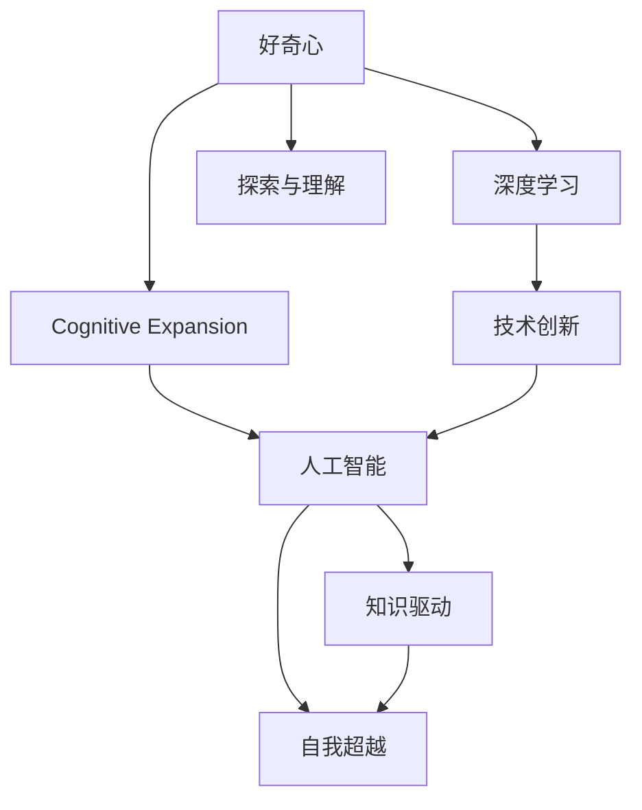

                 

# 探索与理解：好奇心的力量

> 关键词：
**好奇心**、**认知拓展**、**人工智能**、**知识驱动**、**自我超越**、**深度学习**、**技术创新**

## 1. 背景介绍

### 1.1 问题由来
好奇心作为人类与生俱来的本能，自古以来就推动着人类文明的前进。在现代社会，好奇心驱动着科学技术不断进步，催生了无数的创新成果。特别是在科技领域，好奇心驱动了从理论研究到实践应用的全链条创新，推动了人工智能（AI）技术的飞速发展。

### 1.2 问题核心关键点
好奇心在AI领域的应用，体现为对新技术、新问题的持续探索和创新。AI技术的发展过程本身就是好奇心驱动的自我超越与知识驱动的结合。这一过程中，从学术界到工业界，从实验室到实际应用，好奇心始终是推动技术进步的原动力。

### 1.3 问题研究意义
好奇心不仅是人类探索未知世界的动力，也是推动AI技术不断突破的关键因素。对未知的探索和对现有技术的超越，使得AI技术能够跨越领域边界，融合多学科知识，实现新的创新突破。研究好奇心在AI技术中的作用，对于理解AI技术的本质、拓展AI技术的应用范围、提升AI技术的创新能力具有重要意义。

## 2. 核心概念与联系

### 2.1 核心概念概述

在探索好奇心如何影响和驱动AI技术发展的过程中，我们需要理解几个核心概念及其相互联系：

- **好奇心（Curiosity）**：推动个体对新知识和新事物的探索欲望，是人类认知与创新的原动力。
- **认知拓展（Cognitive Expansion）**：指个体认知能力的提升和认知结构的扩展，通过学习新的知识和技能，实现思维能力的飞跃。
- **人工智能（Artificial Intelligence, AI）**：通过算法和计算技术模拟人类智能行为，解决复杂问题的能力。
- **知识驱动（Knowledge-Driven）**：指利用现有知识和理论作为基础，指导AI技术的研发和应用。
- **自我超越（Self-Transcendence）**：指在好奇心驱动下，AI系统不断学习和自我改进，超越现有限制，实现更高层次的智能。
- **深度学习（Deep Learning）**：一种基于神经网络的AI技术，通过多层非线性映射实现对复杂模式的学习和理解。
- **技术创新（Technological Innovation）**：通过不断探索和改进，推动AI技术不断发展，实现新算法、新模型、新应用的出现。

这些核心概念之间的逻辑关系可以通过以下Mermaid流程图来展示：



这个流程图展示了好奇心在AI技术中的作用路径：

1. 好奇心激发个体探索新知识。
2. 新知识的获取拓展了认知能力。
3. 认知拓展促进了AI技术的研发。
4. AI技术在知识驱动下不断改进。
5. AI系统通过自我超越实现能力提升。
6. 深度学习提供了技术支持。
7. 技术创新推动AI技术前进。
8. 好奇心驱动的持续探索，使AI技术不断前进。

## 3. 核心算法原理 & 具体操作步骤

### 3.1 算法原理概述

好奇心驱动的AI技术探索与创新，本质上是一个知识驱动的学习与优化过程。其核心思想是：通过不断探索和吸收新知识，AI系统能够持续改进，超越现有能力，实现新的突破。

形式化地，假设当前AI系统的初始知识表示为 $\mathcal{K}_0$，通过不断的探索和吸收新知识，系统的知识表示演化为 $\mathcal{K}_t$。知识探索和吸收的过程可以表示为：

$$
\mathcal{K}_{t+1} = f(\mathcal{K}_t, \mathcal{D}_t)
$$

其中 $\mathcal{D}_t$ 表示在第 $t$ 次探索中获取的新知识，$f$ 为知识融合和优化算法。在探索过程中，AI系统通过算法 $\alpha$ 选择探索方向和探索方式，以最大化新知识的获取效率和质量。

### 3.2 算法步骤详解

好奇心驱动的AI技术探索与创新一般包括以下几个关键步骤：

**Step 1: 准备探索框架**
- 定义AI系统的初始知识表示 $\mathcal{K}_0$，可以是已有模型、算法、数据等。
- 选择探索算法 $\alpha$，包括信息检索、数据生成、模型微调等。

**Step 2: 知识获取与融合**
- 通过探索算法 $\alpha$，选择探索方向 $\mathcal{D}_t$，获取新知识。
- 对新知识 $\mathcal{D}_t$ 进行预处理和融合，更新知识表示 $\mathcal{K}_{t+1}$。

**Step 3: 知识优化与验证**
- 对更新后的知识表示 $\mathcal{K}_{t+1}$ 进行优化和验证，确保其有效性。
- 将优化后的知识表示 $\mathcal{K}_{t+1}$ 用于进一步探索和创新。

**Step 4: 探索与创新**
- 在优化后的知识表示 $\mathcal{K}_{t+1}$ 的基础上，进行更深层次的探索和创新。
- 循环迭代，不断获取新知识，更新知识表示，直到满足预设的探索目标。

### 3.3 算法优缺点

好奇心驱动的AI技术探索与创新具有以下优点：
1. 持续改进。通过不断的探索和吸收新知识，AI系统能够持续改进，超越现有限制，实现新的突破。
2. 自我超越。好奇心驱动的探索过程使AI系统不断学习和自我改进，实现能力提升。
3. 知识驱动。利用现有知识和理论作为基础，指导AI技术的研发和应用。
4. 创新驱动。探索和创新的过程不断产生新的算法、模型和应用，推动AI技术的前进。

同时，该方法也存在一定的局限性：
1. 探索成本高。探索新知识需要投入大量的时间和资源，可能会增加系统开发和维护的复杂度。
2. 探索方向不确定。探索过程中可能遇到未知的风险和挑战，需要系统的鲁棒性和自适应能力。
3. 数据依赖强。新知识的获取往往依赖于高质量的数据和标注，数据获取的难度和成本较高。
4. 探索目标不明确。探索过程中可能难以明确目标和路径，需要系统的探索策略和算法优化。

尽管存在这些局限性，但就目前而言，好奇心驱动的探索与创新方法仍是推动AI技术进步的重要手段。未来相关研究的重点在于如何更好地融合多种探索策略，提升系统的探索效率和创新能力，同时兼顾可解释性和伦理安全性等因素。

### 3.4 算法应用领域

好奇心驱动的AI技术探索与创新已经在多个领域得到了应用，展示了其强大的潜力：

- **科学研究**：在基因组学、天文学、物理学等领域，好奇心驱动的探索与创新推动了新理论的发现和现有理论的改进。
- **工业生产**：在智能制造、自动化设计、智能运维等领域，好奇心驱动的AI技术提升了生产效率和产品质量。
- **医疗健康**：在疾病诊断、药物研发、个性化医疗等领域，好奇心驱动的探索与创新提高了诊疗水平和患者体验。
- **教育培训**：在智能辅助教学、在线教育、个性化学习等领域，好奇心驱动的AI技术促进了教育资源的优化和教学方法的创新。
- **金融服务**：在风险评估、智能投顾、客户服务等领域，好奇心驱动的AI技术提升了金融服务的智能化和个性化。

除了上述这些领域，好奇心驱动的探索与创新还将广泛应用于更多场景，如智慧城市、环境保护、社会治理等，为社会发展和人类福祉带来新的突破。

## 4. 数学模型和公式 & 详细讲解  
### 4.1 数学模型构建

在好奇心驱动的AI技术探索与创新过程中，数学模型和公式提供了科学的基础和定量的分析方法。

假设AI系统的初始知识表示为 $\mathcal{K}_0$，新知识表示为 $\mathcal{K}_t$，探索算法为 $\alpha$，则知识演化过程可以表示为：

$$
\mathcal{K}_{t+1} = f(\mathcal{K}_t, \mathcal{D}_t)
$$

其中 $f$ 为知识融合和优化算法，通常包括神经网络、进化算法、遗传算法等。

### 4.2 公式推导过程

以下我们以神经网络为例，推导知识演化过程的数学公式。

假设初始知识表示 $\mathcal{K}_0$ 为一组参数 $\theta$，新知识 $\mathcal{D}_t$ 为一组输入数据 $x$，通过神经网络进行知识融合和优化，则知识演化过程可以表示为：

$$
\theta_{t+1} = \theta_t - \eta \nabla_{\theta} L(\theta_t, x)
$$

其中 $\eta$ 为学习率，$L(\theta_t, x)$ 为损失函数，$\nabla_{\theta} L(\theta_t, x)$ 为损失函数对参数 $\theta$ 的梯度。

通过反向传播算法，可以得到梯度 $\nabla_{\theta} L(\theta_t, x)$，从而更新参数 $\theta$，实现知识融合和优化。

### 4.3 案例分析与讲解

以一个简单的神经网络为例，说明好奇心驱动的AI技术探索与创新的数学模型和公式。

假设初始知识表示 $\mathcal{K}_0$ 为一组参数 $\theta$，新知识 $\mathcal{D}_t$ 为一组输入数据 $x$，目标为将 $x$ 映射到输出 $y$。假设神经网络模型为：

$$
y = f(x; \theta)
$$

其中 $f(x; \theta)$ 为神经网络模型，$\theta$ 为模型参数。通过反向传播算法计算损失函数 $L(\theta, x, y)$，可以得到梯度 $\nabla_{\theta} L(\theta, x, y)$。

根据梯度下降算法，更新参数 $\theta$ 的过程可以表示为：

$$
\theta_{t+1} = \theta_t - \eta \nabla_{\theta} L(\theta_t, x, y)
$$

在每轮探索中，通过不断地输入新的数据 $x$ 并计算梯度 $\nabla_{\theta} L(\theta_t, x, y)$，更新参数 $\theta$，实现知识的融合和优化。

## 5. 项目实践：代码实例和详细解释说明
### 5.1 开发环境搭建

在进行好奇心驱动的AI技术探索与创新实践前，我们需要准备好开发环境。以下是使用Python进行PyTorch开发的环境配置流程：

1. 安装Anaconda：从官网下载并安装Anaconda，用于创建独立的Python环境。

2. 创建并激活虚拟环境：
```bash
conda create -n pytorch-env python=3.8 
conda activate pytorch-env
```

3. 安装PyTorch：根据CUDA版本，从官网获取对应的安装命令。例如：
```bash
conda install pytorch torchvision torchaudio cudatoolkit=11.1 -c pytorch -c conda-forge
```

4. 安装TensorBoard：
```bash
pip install tensorboard
```

5. 安装必要的学习资源：
```bash
pip install numpy pandas scikit-learn matplotlib tqdm jupyter notebook ipython
```

完成上述步骤后，即可在`pytorch-env`环境中开始探索与创新的实践。

### 5.2 源代码详细实现

这里我们以一个简单的神经网络探索为例，展示好奇心驱动的AI技术探索与创新的代码实现。

首先，定义一个简单的神经网络模型：

```python
import torch
import torch.nn as nn
import torch.optim as optim

class Net(nn.Module):
    def __init__(self):
        super(Net, self).__init__()
        self.fc1 = nn.Linear(784, 128)
        self.fc2 = nn.Linear(128, 10)

    def forward(self, x):
        x = x.view(-1, 784)
        x = torch.relu(self.fc1(x))
        x = self.fc2(x)
        return x
```

然后，定义训练函数：

```python
def train(model, train_loader, optimizer, device):
    model.train()
    for batch_idx, (data, target) in enumerate(train_loader):
        data, target = data.to(device), target.to(device)
        optimizer.zero_grad()
        output = model(data)
        loss = nn.CrossEntropyLoss()(output, target)
        loss.backward()
        optimizer.step()
```

接下来，定义测试函数：

```python
def test(model, test_loader, device):
    model.eval()
    correct = 0
    total = 0
    with torch.no_grad():
        for data, target in test_loader:
            data, target = data.to(device), target.to(device)
            output = model(data)
            _, predicted = torch.max(output.data, 1)
            total += target.size(0)
            correct += (predicted == target).sum().item()
    print('Accuracy: %d %%' % (100 * correct / total))
```

最后，启动训练流程并测试模型性能：

```python
train_loader = torch.utils.data.DataLoader(train_dataset, batch_size=64, shuffle=True)
test_loader = torch.utils.data.DataLoader(test_dataset, batch_size=64, shuffle=False)

model = Net().to(device)
optimizer = optim.SGD(model.parameters(), lr=0.01, momentum=0.5)

for epoch in range(10):
    train(model, train_loader, optimizer, device)
    test(model, test_loader, device)
```

以上代码展示了如何利用PyTorch实现一个简单的神经网络，并通过训练和测试过程探索与创新。

### 5.3 代码解读与分析

让我们再详细解读一下关键代码的实现细节：

**Net类**：
- `__init__`方法：定义神经网络的层结构。
- `forward`方法：定义神经网络的前向传播过程。

**train函数**：
- 设置模型为训练模式，遍历训练集中的每个批次。
- 将数据和标签迁移到GPU或TPU设备上。
- 前向传播计算输出，并计算损失函数。
- 反向传播计算梯度，并使用优化器更新模型参数。

**test函数**：
- 设置模型为评估模式，遍历测试集中的每个批次。
- 将数据和标签迁移到GPU或TPU设备上。
- 前向传播计算输出，并计算准确率。
- 输出模型的测试准确率。

**训练流程**：
- 定义训练集和测试集的数据加载器。
- 初始化模型和优化器。
- 循环进行训练，每轮训练后测试模型性能。

可以看到，PyTorch使得神经网络模型的构建和训练过程变得简洁高效。开发者可以将更多精力放在探索新的知识、优化模型架构等方面，而不必过多关注底层的实现细节。

## 6. 实际应用场景
### 6.1 科学研究

在科学研究领域，好奇心驱动的AI技术探索与创新极大地推动了新知识的发现和现有知识的改进。例如，在天文学中，AI系统可以自动分析海量观测数据，识别出潜在的恒星、行星、星系等天体，并进行进一步的观测和研究。通过探索与创新，AI系统可以在传统方法难以企及的领域发现新的现象和规律，推动科学研究的进步。

### 6.2 工业生产

在工业生产领域，好奇心驱动的AI技术探索与创新可以提升生产效率和产品质量。例如，在智能制造中，AI系统可以通过对生产数据的分析，预测设备故障，优化生产流程，降低生产成本。在自动化设计中，AI系统可以自动生成复杂的设计方案，提高设计的效率和精度。

### 6.3 医疗健康

在医疗健康领域，好奇心驱动的AI技术探索与创新可以提高诊疗水平和患者体验。例如，在疾病诊断中，AI系统可以通过对患者病历、影像等数据的分析，辅助医生进行精准诊断。在药物研发中，AI系统可以自动设计新的化合物，并进行筛选和验证，加速新药的研发进程。

### 6.4 教育培训

在教育培训领域，好奇心驱动的AI技术探索与创新可以提升教育资源的优化和教学方法的创新。例如，在智能辅助教学中，AI系统可以根据学生的学习情况，自动生成个性化的学习计划，提供个性化的学习资源。在在线教育中，AI系统可以分析学生的学习行为，提供实时的反馈和建议，提高学习效果。

### 6.5 金融服务

在金融服务领域，好奇心驱动的AI技术探索与创新可以提高风险评估和客户服务的智能化水平。例如，在风险评估中，AI系统可以通过对市场数据的分析，预测金融风险，提供风险管理建议。在智能投顾中，AI系统可以分析市场动态，提供个性化的投资建议，提升投资回报。

### 6.6 未来应用展望

随着AI技术的不断进步，好奇心驱动的探索与创新将在更多领域得到应用，为社会发展和人类福祉带来新的突破。

在智慧城市治理中，AI系统可以通过对城市数据的分析，实现智能交通、智能安防、智能垃圾处理等功能，提升城市管理的智能化和高效性。在环境保护中，AI系统可以通过对环境数据的分析，识别出污染源，提供治理方案，保护生态环境。

未来，AI技术将更多地应用于社会治理、文化创意、娱乐传媒等领域，推动社会全面进步和人类福祉提升。

## 7. 工具和资源推荐
### 7.1 学习资源推荐

为了帮助开发者系统掌握好奇心驱动的AI技术探索与创新的理论基础和实践技巧，这里推荐一些优质的学习资源：

1. 《深度学习》（Deep Learning）书籍：Ian Goodfellow等人合著，全面介绍了深度学习的基本概念和算法。
2. 《Python深度学习》（Python Deep Learning）书籍：Francois Chollet撰写，通过实例介绍了TensorFlow和Keras等深度学习框架的使用。
3. 《Hands-On Machine Learning with Scikit-Learn and TensorFlow》书籍：Aurélien Géron撰写，介绍了Scikit-Learn和TensorFlow等机器学习框架的实践应用。
4. 《CS231n: 卷积神经网络与视觉识别》课程：斯坦福大学开设的计算机视觉课程，详细介绍了卷积神经网络的应用。
5. 《Natural Language Processing with Transformers》书籍：Transformer库的作者HuggingFace撰写，全面介绍了Transformers库的应用和优化。

通过对这些资源的学习实践，相信你一定能够快速掌握好奇心驱动的AI技术探索与创新的精髓，并用于解决实际的AI问题。

### 7.2 开发工具推荐

高效的开发离不开优秀的工具支持。以下是几款用于AI技术探索与创新开发的常用工具：

1. PyTorch：基于Python的开源深度学习框架，灵活动态的计算图，适合快速迭代研究。
2. TensorFlow：由Google主导开发的开源深度学习框架，生产部署方便，适合大规模工程应用。
3. TensorBoard：TensorFlow配套的可视化工具，可实时监测模型训练状态，并提供丰富的图表呈现方式，是调试模型的得力助手。
4. Weights & Biases：模型训练的实验跟踪工具，可以记录和可视化模型训练过程中的各项指标，方便对比和调优。
5. Jupyter Notebook：用于编写、执行和分享Python代码的环境，支持多种编程语言和框架。
6. Anaconda：Python发行版，提供了大量的科学计算包和工具，方便快速开发和部署。

合理利用这些工具，可以显著提升AI技术探索与创新的开发效率，加快创新迭代的步伐。

### 7.3 相关论文推荐

好奇心驱动的AI技术探索与创新源于学界的持续研究。以下是几篇奠基性的相关论文，推荐阅读：

1. "Curiosity, Interest, and Achievement: A Mechanism for Lifelong Adaptive Learning"（Curiosity, Interest, and Achievement: A Mechanism for Lifelong Adaptive Learning）：该论文探讨了好奇心在终身学习中的作用，提出了一种基于好奇心的学习机制。
2. "Curious AI: Inverse Curiosity Machine"（Curious AI: Inverse Curiosity Machine）：该论文提出了一种基于逆好奇心的AI模型，通过最大化探索奖励来学习新知识。
3. "Curious Networks"（Curious Networks）：该论文提出了一种好奇心驱动的神经网络模型，通过自我探索和学习新知识来提升性能。
4. "Curiosity-Driven Machine Learning"（Curiosity-Driven Machine Learning）：该论文综述了多种好奇心驱动的机器学习算法，并讨论了其应用和前景。
5. "Leveraging Curiosity in Machine Learning"（Leveraging Curiosity in Machine Learning）：该论文探讨了如何在机器学习中利用好奇心进行探索和创新，提出了一种基于信息增益的探索策略。

这些论文代表了好奇心在AI技术探索与创新中的研究脉络。通过学习这些前沿成果，可以帮助研究者把握学科前进方向，激发更多的创新灵感。

## 8. 总结：未来发展趋势与挑战

### 8.1 总结

本文对好奇心驱动的AI技术探索与创新的过程进行了全面系统的介绍。首先阐述了好奇心在AI技术中的驱动作用，明确了探索与创新在AI技术发展中的重要意义。其次，从原理到实践，详细讲解了好奇心驱动的探索与创新的数学模型和关键步骤，给出了探索与创新的完整代码实例。同时，本文还广泛探讨了好奇心驱动的AI技术在科学研究、工业生产、医疗健康、教育培训、金融服务等多个领域的应用前景，展示了其强大的潜力。

通过本文的系统梳理，可以看到，好奇心驱动的AI技术探索与创新，通过不断探索和吸收新知识，使得AI系统能够持续改进，超越现有能力，实现新的突破。未来，随着AI技术的不断进步，好奇心驱动的探索与创新将在更多领域得到应用，为社会发展和人类福祉带来新的突破。

### 8.2 未来发展趋势

展望未来，好奇心驱动的AI技术探索与创新将呈现以下几个发展趋势：

1. **深度学习与大数据的结合**：深度学习技术将在大数据驱动下，实现更强大的知识表示和探索能力。
2. **多模态融合**：通过融合视觉、语音、文本等多模态数据，AI系统能够更好地理解复杂场景和情境。
3. **自适应学习**：AI系统将具备更高的自适应能力，能够根据环境变化和任务需求进行动态调整和优化。
4. **智能系统**：通过好奇心驱动的探索与创新，AI系统将具备更强的智能化和自动化能力，实现更高的自主性和决策能力。
5. **伦理与安全**：随着AI技术在社会各个领域的广泛应用，其伦理与安全问题将受到更多关注，好奇心驱动的探索与创新也将更加注重伦理和安全导向。
6. **跨领域融合**：AI技术将与其他学科技术深度融合，推动知识驱动的创新跨越领域边界，实现更多应用场景。

以上趋势凸显了好奇心驱动的AI技术探索与创新的广阔前景。这些方向的探索发展，必将进一步提升AI技术的前进速度，推动AI技术在更多领域的应用。

### 8.3 面临的挑战

尽管好奇心驱动的AI技术探索与创新已经取得了瞩目成就，但在迈向更加智能化、普适化应用的过程中，它仍面临着诸多挑战：

1. **数据质量与多样性**：获取高质量、多样性的数据是好奇心驱动的AI技术探索与创新的基础，但数据获取的难度和成本较高。
2. **探索效率与方向**：探索过程中可能遇到未知的风险和挑战，需要系统的鲁棒性和自适应能力，探索效率与方向的不确定性也增加了探索成本。
3. **模型复杂性与可解释性**：好奇心驱动的AI技术探索与创新需要复杂模型和算法支持，模型的可解释性和可审计性也成为新的关注点。
4. **伦理与安全问题**：AI技术在实际应用中可能存在伦理和安全风险，如何在探索与创新过程中避免这些问题，需要系统的设计和规范。
5. **跨学科融合**：好奇心驱动的AI技术探索与创新需要跨学科融合，不同学科之间的协同工作难度较大，需要建立更高效的协同机制。

这些挑战需要学界和工业界共同努力，通过技术创新和规范建设，推动好奇心驱动的AI技术探索与创新走向成熟。

### 8.4 研究展望

面对好奇心驱动的AI技术探索与创新所面临的挑战，未来的研究需要在以下几个方面寻求新的突破：

1. **跨学科融合与协同**：通过跨学科融合和协同创新，推动AI技术在更广泛领域的应用。
2. **自适应与智能系统**：通过自适应学习，使AI系统具备更高的自主性和智能化，实现更强的决策能力。
3. **伦理与安全导向**：在探索与创新过程中，注重伦理与安全导向，确保AI技术的应用符合社会价值观和法律法规。
4. **深度学习与大数据**：通过深度学习与大数据的结合，提升AI系统的知识表示和探索能力。
5. **多模态融合**：通过融合视觉、语音、文本等多模态数据，提升AI系统的理解能力和应用场景。

这些研究方向的探索，必将引领好奇心驱动的AI技术探索与创新走向更高的台阶，为构建智能社会提供新的动力。面向未来，AI技术需要在好奇心驱动的探索与创新中不断突破，实现更广泛的应用和更高的价值。

## 9. 附录：常见问题与解答

**Q1：好奇心驱动的AI技术探索与创新是否适用于所有AI任务？**

A: 好奇心驱动的AI技术探索与创新在大多数AI任务上都能取得不错的效果，特别是对于数据量较小的任务。但对于一些特定领域的任务，如医学、法律等，仅仅依靠通用语料预训练的模型可能难以很好地适应。此时需要在特定领域语料上进一步预训练，再进行微调，才能获得理想效果。此外，对于一些需要时效性、个性化很强的任务，如对话、推荐等，好奇心驱动的探索与创新方法也需要针对性的改进优化。

**Q2：探索过程中如何选择探索方向？**

A: 探索方向的选择需要根据具体任务和目标进行，一般可以通过以下方式：
1. 利用数据分布分析，识别出数据中未被覆盖的领域和特征。
2. 引入领域专家的知识，提供探索方向和目标。
3. 通过强化学习等方法，学习探索策略，自动选择探索方向。

**Q3：好奇心驱动的探索与创新是否需要大量标注数据？**

A: 好奇心驱动的探索与创新通常需要大量标注数据来指导探索方向和目标，但在探索过程中也可以利用未标注数据进行探索，减少对标注数据的依赖。

**Q4：探索与创新的过程中如何平衡探索与利用？**

A: 在探索与创新的过程中，需要平衡探索与利用，避免过度探索导致资源浪费和性能下降。可以通过以下方式实现：
1. 设定探索与利用的比例，根据任务需求进行动态调整。
2. 引入早停机制，在探索过程中及时停止探索，避免过拟合。
3. 利用贝叶斯优化等方法，高效选择探索方向和目标。

**Q5：好奇心驱动的探索与创新如何应用于实际业务？**

A: 好奇心驱动的探索与创新可以应用于实际业务中，提升业务的智能化和自动化水平。具体应用方法包括：
1. 通过探索与创新，发现新的业务机会和改进方案。
2. 利用探索与创新的结果，优化业务流程和运营效率。
3. 引入探索与创新的技术，提升业务决策的准确性和科学性。

**Q6：好奇心驱动的探索与创新是否适用于小规模团队？**

A: 好奇心驱动的探索与创新可以适用于小规模团队，通过有效的沟通和协作，利用团队的智慧和资源进行探索与创新。但需要合理的资源配置和任务分配，确保探索与创新的高效性。

**Q7：好奇心驱动的探索与创新是否可以与其他AI技术结合？**

A: 好奇心驱动的探索与创新可以与其他AI技术结合，如深度学习、强化学习、迁移学习等，通过多技术融合，提升系统的综合能力。例如，可以通过深度学习进行知识表示和探索，通过强化学习进行策略优化，通过迁移学习进行跨领域应用。

---

作者：禅与计算机程序设计艺术 / Zen and the Art of Computer Programming

