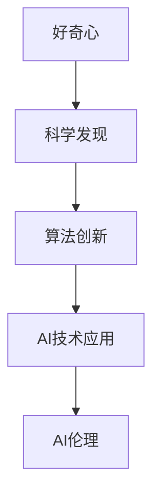

                 

# 探索未知：好奇心与科学发现

> 关键词：探索未知, 科学发现, 人工智能, 算法, 数据分析, 人工智能伦理, 数据科学

## 1. 背景介绍

### 1.1 问题由来
人类历史上的每一次重大科学发现，往往都源于对未知世界的好奇和探索。从最早的石器时代，到后来的电能、核能、互联网、量子计算，无不体现了人类对未知世界永无止境的探索精神。这种精神也驱动着人工智能（AI）技术的持续发展和突破。

人工智能在过去几十年中，从最初的专家系统，到后来的机器学习、深度学习，再到如今的无监督学习、自监督学习等高级技术，其进步的每一步都离不开对未知领域的不懈探索和科学发现。例如，深度学习算法在图像识别、自然语言处理、语音识别等领域的突破，正是基于对大数据分析、神经网络架构的深入研究和科学发现。

### 1.2 问题核心关键点
要推动人工智能技术的持续进步，必须把握好奇心与科学发现之间的内在联系，理解如何将好奇心转化为科研活动，以及科学发现如何推动技术创新。本文旨在探讨好奇心在科学发现中的驱动作用，并分析科学发现对人工智能技术发展的贡献。

### 1.3 问题研究意义
理解好奇心与科学发现的关系，不仅有助于推动人工智能技术的创新，还能提升公众对AI技术的认知和信任。科学发现往往涉及复杂的理论和技术，通过深入浅出的阐述，可以帮助更多非专业人士理解这一领域的进展和未来趋势。

## 2. 核心概念与联系

### 2.1 核心概念概述

要探讨好奇心与科学发现之间的关系，首先需要理解以下核心概念：

- **好奇心**：对未知领域的探索欲望，是科学发现的重要驱动力。好奇心驱动了人类对新知识、新现象的追求，促进了科学技术的进步。

- **科学发现**：通过对已有知识和现象的深入研究和实验，提出新的理论、方法或技术。科学发现是人类知识积累和技术进步的核心。

- **人工智能**：模拟人类智能行为的机器系统，包括但不限于机器学习、深度学习、自然语言处理等。AI技术的突破离不开科学发现和技术创新。

- **数据分析**：从大量数据中提取有用信息，通过数据驱动的方式推动科学发现和技术创新。

- **算法**：实现特定功能或任务的一组规则和步骤，是人工智能技术的基础。

- **人工智能伦理**：在AI技术发展中，需考虑伦理道德问题，确保技术应用符合社会价值观和法律法规。

这些核心概念相互联系，共同构成了推动人工智能技术不断进步的核心机制。好奇心驱动科学发现，科学发现推动算法创新，算法创新则推动AI技术的实际应用，而伦理则保障这些技术的健康发展。

### 2.2 核心概念原理和架构的 Mermaid 流程图



这个流程图展示了好奇心、科学发现、算法创新和AI伦理之间的关系。好奇心推动科学发现，科学发现促进算法创新，算法创新支撑AI技术应用，伦理则保障这些技术的合理使用。

## 3. 核心算法原理 & 具体操作步骤

### 3.1 算法原理概述

人工智能技术的进步，很大程度上依赖于科学发现和技术创新。科学发现通过提出新的理论和方法，推动算法的发展，从而提升AI技术的性能。以深度学习算法为例，其核心原理是通过大量数据训练神经网络，使其能够识别和处理复杂的非线性关系。

科学发现不仅包括理论上的突破，也包括技术上的创新。例如，卷积神经网络（CNN）的发明，极大提升了图像识别任务的准确率；生成对抗网络（GAN）的出现，使得图像生成和风格转换成为可能。这些技术上的突破，都是基于对现有算法的不懈探索和科学发现。

### 3.2 算法步骤详解

科学发现和算法创新涉及多个步骤，包括理论研究、实验验证、算法实现和应用测试等。以下以深度学习算法的创新为例，详细介绍这一过程：

**Step 1: 理论研究**
- 提出新的理论假设：例如，激活函数的非线性特性是神经网络的重要组成部分。
- 设计实验验证：通过实验数据验证理论假设的正确性。

**Step 2: 算法实现**
- 实现算法模型：基于理论假设，设计并实现算法模型。例如，ReLU激活函数。
- 优化算法性能：通过调整模型参数、改进算法结构等方式，提高算法效率和精度。

**Step 3: 实验验证**
- 数据集准备：收集大量数据，如ImageNet数据集。
- 模型训练：使用数据集训练模型，验证理论假设。
- 结果分析：分析模型性能，识别算法优点和缺点。

**Step 4: 应用测试**
- 实际应用：将算法应用于实际问题，如图像识别、语音识别等。
- 效果评估：评估算法在实际应用中的表现，收集用户反馈。

**Step 5: 持续优化**
- 改进算法：根据实际应用中的问题，持续优化算法模型。
- 技术推广：将算法应用到更多领域，推动技术普及。

### 3.3 算法优缺点

科学发现和技术创新推动了人工智能技术的快速发展，但也存在一些局限性：

- **优点**：
  - **提升效率**：科学发现和技术创新能够显著提升算法的性能，提高AI技术处理复杂任务的能力。
  - **推动应用**：新的算法和技术能够应用于更多领域，推动AI技术的广泛应用。
  - **促进创新**：科学发现和技术创新不断推动AI技术的前沿研究，激发新的创新灵感。

- **缺点**：
  - **资源消耗大**：科学研究和算法开发需要大量的时间、金钱和人力资源，且失败风险较高。
  - **伦理风险**：新技术的出现可能带来伦理道德问题，需仔细权衡。
  - **应用复杂**：新算法的应用可能需要较高的技术门槛，难以普及。

### 3.4 算法应用领域

科学发现和技术创新推动了人工智能技术在多个领域的应用，包括但不限于：

- **自然语言处理（NLP）**：通过语言模型、序列到序列（Seq2Seq）等技术，实现机器翻译、情感分析、文本生成等应用。
- **计算机视觉（CV）**：通过卷积神经网络（CNN）、循环神经网络（RNN）等技术，实现图像识别、目标检测、图像生成等应用。
- **语音识别**：通过深度学习技术，实现语音转文本、语音合成等应用。
- **推荐系统**：通过协同过滤、深度学习等技术，实现个性化推荐、商品推荐等应用。
- **智能家居**：通过物联网、自然语言处理等技术，实现智能家居控制、智能音箱等应用。

## 4. 数学模型和公式 & 详细讲解 & 举例说明

### 4.1 数学模型构建

在AI技术中，数学模型和公式是其核心组成部分。以下以深度学习模型为例，介绍常用的数学模型和公式：

**神经网络模型**：深度学习模型通常由多层神经网络组成，每层由多个神经元（节点）和连接权重（权重矩阵）构成。以一个简单的单层神经网络为例，其数学模型如下：

$$
\text{output} = \text{activation}(\text{weight} \cdot \text{input} + \text{bias})
$$

其中，$\text{output}$ 表示输出，$\text{activation}$ 表示激活函数，$\text{weight}$ 表示权重矩阵，$\text{input}$ 表示输入，$\text{bias}$ 表示偏置项。

**损失函数**：损失函数用于衡量模型输出与真实标签之间的差异。以分类任务为例，常用的损失函数包括交叉熵损失（Cross-Entropy Loss）：

$$
\text{loss} = -\frac{1}{N}\sum_{i=1}^N \text{y}_i \log \text{p}_i + (1-\text{y}_i) \log (1-\text{p}_i)
$$

其中，$N$ 表示样本数量，$\text{y}_i$ 表示真实标签，$\text{p}_i$ 表示模型预测的概率。

### 4.2 公式推导过程

以交叉熵损失函数的推导过程为例：

在二分类任务中，假设模型输出为 $\text{p}_i$，真实标签为 $\text{y}_i$，则交叉熵损失函数为：

$$
\text{loss} = -\frac{1}{N}\sum_{i=1}^N \text{y}_i \log \text{p}_i + (1-\text{y}_i) \log (1-\text{p}_i)
$$

假设 $\text{y}_i = 1$，则：

$$
\text{loss} = -\frac{1}{N}\sum_{i=1}^N \log \text{p}_i
$$

即：

$$
\text{loss} = -\frac{1}{N}\sum_{i=1}^N \log \text{p}_i
$$

同理，假设 $\text{y}_i = 0$，则：

$$
\text{loss} = -\frac{1}{N}\sum_{i=1}^N \log (1-\text{p}_i)
$$

综合两种情况，得到完整的交叉熵损失函数：

$$
\text{loss} = -\frac{1}{N}\sum_{i=1}^N [\text{y}_i \log \text{p}_i + (1-\text{y}_i) \log (1-\text{p}_i)]
$$

### 4.3 案例分析与讲解

以图像识别任务为例，介绍如何使用卷积神经网络（CNN）进行模型构建和训练：

**Step 1: 数据准备**
- 收集大量标注图像数据。
- 将数据集分为训练集、验证集和测试集。

**Step 2: 网络设计**
- 设计卷积神经网络结构。以LeNet-5为例：
  - 输入层：28x28的灰度图像。
  - 卷积层：使用多个卷积核进行特征提取。
  - 池化层：对卷积层输出进行下采样。
  - 全连接层：将特征图转换为分类结果。
  - 输出层：使用softmax激活函数进行多分类预测。

**Step 3: 模型训练**
- 加载数据集。
- 定义模型结构。
- 选择优化器（如SGD）和损失函数（如交叉熵损失）。
- 设置超参数，如学习率、批大小等。
- 训练模型：
  - 前向传播：输入图像，输出分类概率。
  - 反向传播：计算损失函数梯度，更新模型参数。

**Step 4: 模型评估**
- 使用测试集评估模型性能。
- 计算准确率、精确率、召回率等指标。
- 分析模型输出，发现问题并优化模型结构。

## 5. 项目实践：代码实例和详细解释说明

### 5.1 开发环境搭建

进行深度学习项目开发，需要搭建合适的开发环境。以下是使用Python和TensorFlow进行深度学习开发的环境配置流程：

1. 安装Anaconda：从官网下载并安装Anaconda，用于创建独立的Python环境。

2. 创建并激活虚拟环境：
```bash
conda create -n tf-env python=3.7 
conda activate tf-env
```

3. 安装TensorFlow：根据CUDA版本，从官网获取对应的安装命令。例如：
```bash
conda install tensorflow
```

4. 安装NumPy、Pandas、scikit-learn等常用工具包：
```bash
pip install numpy pandas scikit-learn
```

5. 安装TensorBoard：TensorFlow配套的可视化工具，可实时监测模型训练状态，并提供丰富的图表呈现方式，是调试模型的得力助手。

6. 安装TensorFlow Addons：提供更多的深度学习工具和算法。

完成上述步骤后，即可在`tf-env`环境中开始深度学习项目开发。

### 5.2 源代码详细实现

这里我们以手写数字识别任务为例，给出使用TensorFlow进行卷积神经网络（CNN）模型的代码实现。

```python
import tensorflow as tf
from tensorflow.keras import datasets, layers, models

# 加载数据集
(train_images, train_labels), (test_images, test_labels) = datasets.mnist.load_data()

# 数据预处理
train_images = train_images / 255.0
test_images = test_images / 255.0

# 构建模型
model = models.Sequential()
model.add(layers.Conv2D(32, (3, 3), activation='relu', input_shape=(28, 28, 1)))
model.add(layers.MaxPooling2D((2, 2)))
model.add(layers.Conv2D(64, (3, 3), activation='relu'))
model.add(layers.MaxPooling2D((2, 2)))
model.add(layers.Flatten())
model.add(layers.Dense(64, activation='relu'))
model.add(layers.Dense(10))

# 编译模型
model.compile(optimizer='adam',
              loss=tf.keras.losses.SparseCategoricalCrossentropy(from_logits=True),
              metrics=['accuracy'])

# 训练模型
model.fit(train_images, train_labels, epochs=5, 
          validation_data=(test_images, test_labels))

# 评估模型
test_loss, test_acc = model.evaluate(test_images,  test_labels, verbose=2)
print('\nTest accuracy:', test_acc)
```

这段代码实现了使用CNN对手写数字进行识别。首先加载并预处理MNIST数据集，然后定义CNN模型结构，使用Adam优化器和交叉熵损失函数进行模型训练和评估。

### 5.3 代码解读与分析

让我们再详细解读一下关键代码的实现细节：

**数据预处理**：
- `train_images` 和 `test_images` 的像素值均被归一化到 [0, 1] 的范围内。
- `train_images` 和 `test_images` 被转换为4D张量，维度为 (样本数, 高度, 宽度, 通道数)。

**模型结构**：
- `Conv2D` 层进行特征提取，使用32个大小为3x3的卷积核，使用 ReLU 激活函数。
- `MaxPooling2D` 层进行下采样，保留重要特征。
- `Flatten` 层将卷积层输出展开成一维向量。
- `Dense` 层将特征映射到输出类别。

**模型编译和训练**：
- `compile` 方法设置优化器、损失函数和评价指标。
- `fit` 方法进行模型训练，使用验证集进行评估。

**模型评估**：
- `evaluate` 方法计算模型在测试集上的损失和准确率。
- 打印测试集的准确率。

## 6. 实际应用场景

### 6.1 智能推荐系统

智能推荐系统已经成为电商、视频、音乐等多个领域的重要组成部分。通过深度学习模型，智能推荐系统能够分析用户行为数据，预测用户偏好，提供个性化的推荐内容。

在实践中，可以使用深度学习模型构建推荐系统。首先，收集用户的历史行为数据，如浏览记录、购买记录等。然后，构建推荐模型，使用神经网络对用户行为进行建模，预测用户可能感兴趣的内容。在推荐系统中，还可以引入协同过滤、兴趣分类等技术，进一步提升推荐效果。

### 6.2 医疗影像分析

医疗影像分析是人工智能在医疗领域的重要应用之一。通过深度学习模型，医疗影像分析系统能够自动识别和诊断疾病，如肺癌、乳腺癌、脑部肿瘤等。

在实践中，可以使用卷积神经网络（CNN）对医疗影像进行分类和分割。首先，收集大量标注的医疗影像数据，如 X 光片、CT 图像、MRI 图像等。然后，构建卷积神经网络模型，使用分类和分割任务进行训练和评估。在医疗影像分析中，还可以引入注意力机制、迁移学习等技术，进一步提升模型的诊断能力。

### 6.3 金融风险评估

金融风险评估是金融行业的重要任务。通过深度学习模型，金融风险评估系统能够自动识别和预测金融风险，如信用风险、市场风险、操作风险等。

在实践中，可以使用循环神经网络（RNN）和长短期记忆网络（LSTM）对金融数据进行建模。首先，收集金融市场的交易数据、财务报表等数据。然后，构建 RNN 或 LSTM 模型，使用时间序列预测任务进行训练和评估。在金融风险评估中，还可以引入深度强化学习、时间序列异常检测等技术，进一步提升模型的风险预测能力。

### 6.4 未来应用展望

随着深度学习技术的不断发展，未来人工智能将在更多领域得到应用，为人类生产生活带来变革性影响。

在智慧城市治理中，智能交通系统、智能安防系统、智能能源管理系统等都将受益于人工智能技术，提升城市管理的智能化水平，构建更加安全、高效的城市环境。

在智能制造领域，通过深度学习模型，可以实现生产流程优化、设备维护预测、产品质量检测等应用，推动制造业向智能化、自动化转型。

在社交媒体分析中，深度学习模型可以自动识别和分析社交媒体数据，如情感分析、舆情监控、用户行为分析等，提升社交媒体平台的智能化水平，更好地服务用户。

## 7. 工具和资源推荐

### 7.1 学习资源推荐

为了帮助开发者系统掌握深度学习技术，以下是一些优质的学习资源：

1. 《深度学习》（Ian Goodfellow 著）：深度学习领域的经典教材，全面介绍了深度学习的基本概念、算法和应用。
2. TensorFlow官方文档：提供了详细的API文档、教程和示例，帮助开发者快速上手深度学习开发。
3. PyTorch官方文档：提供了详细的API文档、教程和示例，帮助开发者快速上手深度学习开发。
4. Coursera深度学习课程：斯坦福大学开设的深度学习课程，涵盖深度学习的基本概念、算法和应用，适合初学者。
5. Deep Learning Specialization（吴恩达深度学习专项课程）：由深度学习领域的专家吴恩达主讲，涵盖深度学习的基本概念、算法和应用，适合进阶学习者。

通过对这些资源的学习实践，相信你一定能够快速掌握深度学习技术，并用于解决实际的AI问题。

### 7.2 开发工具推荐

以下是一些常用的深度学习开发工具：

1. TensorFlow：由Google主导开发的开源深度学习框架，生产部署方便，适合大规模工程应用。
2. PyTorch：由Facebook开发的开源深度学习框架，灵活易用，适合快速迭代研究。
3. Jupyter Notebook：免费的交互式编程环境，支持Python和其他编程语言，适合快速原型开发和实验。
4. Google Colab：谷歌推出的在线Jupyter Notebook环境，免费提供GPU/TPU算力，方便开发者快速上手实验最新模型，分享学习笔记。
5. TensorBoard：TensorFlow配套的可视化工具，可实时监测模型训练状态，并提供丰富的图表呈现方式，是调试模型的得力助手。

合理利用这些工具，可以显著提升深度学习开发的效率，加快创新迭代的步伐。

### 7.3 相关论文推荐

深度学习技术的快速发展得益于学界的持续研究。以下是几篇奠基性的相关论文，推荐阅读：

1. AlexNet：ImageNet图像识别竞赛中获胜的深度学习模型，推动了深度学习在图像识别领域的应用。
2. ResNet：提出了残差网络（Residual Network），解决了深度神经网络训练过程中梯度消失问题，推动了深度学习的发展。
3. VGG：提出了卷积神经网络（VGG），使得卷积神经网络成为图像识别领域的主流架构。
4. Inception：提出了Inception模块，提升了卷积神经网络的计算效率和准确率。
5. AlphaGo：提出了深度强化学习算法，实现了人工智能在围棋等复杂游戏中的突破。

这些论文代表了大深度学习技术的发展脉络。通过学习这些前沿成果，可以帮助研究者把握学科前进方向，激发更多的创新灵感。

## 8. 总结：未来发展趋势与挑战

### 8.1 研究成果总结

本文对深度学习技术的发展历程和未来趋势进行了全面系统的介绍。深度学习技术通过科学发现和技术创新，推动了计算机视觉、自然语言处理、语音识别等领域的突破，极大地提升了人工智能技术的能力和应用范围。未来，深度学习技术还将继续在更多领域得到应用，为人类生产生活带来变革性影响。

### 8.2 未来发展趋势

展望未来，深度学习技术将呈现以下几个发展趋势：

1. 模型规模持续增大。随着算力成本的下降和数据规模的扩张，深度学习模型的参数量还将持续增长。超大规模深度学习模型蕴含的丰富知识，有望支撑更加复杂多变的任务。
2. 模型鲁棒性提升。深度学习模型的鲁棒性将进一步提升，能够更好地处理噪声数据和异常情况。
3. 模型可解释性增强。深度学习模型将更加注重可解释性和可解释性，便于用户理解和调试。
4. 跨模态深度学习发展。深度学习技术将更多地应用于跨模态数据融合和分析，提升模型对不同类型数据的理解能力。
5. 深度学习与AI伦理结合。深度学习技术将更多地考虑伦理和道德问题，确保技术应用符合社会价值观和法律法规。

以上趋势凸显了深度学习技术的广阔前景。这些方向的探索发展，将进一步提升深度学习模型的性能和应用范围，为构建更加智能化、普适化的人工智能系统铺平道路。

### 8.3 面临的挑战

尽管深度学习技术取得了瞩目成就，但在迈向更加智能化、普适化应用的过程中，它仍面临着诸多挑战：

1. 数据需求大。深度学习模型需要大量标注数据进行训练，数据获取成本较高。
2. 模型复杂度高。深度学习模型结构复杂，训练和推理过程需要高计算资源。
3. 模型可解释性差。深度学习模型难以解释其内部工作机制和决策逻辑，存在“黑盒”问题。
4. 模型应用风险高。深度学习模型可能引入伦理道德风险，需仔细权衡。
5. 模型推广难度大。深度学习模型的应用需要较高的技术门槛，难以普及。

### 8.4 研究展望

面对深度学习技术面临的挑战，未来的研究需要在以下几个方面寻求新的突破：

1. 探索无监督和半监督学习范式。摆脱对大规模标注数据的依赖，利用自监督学习、主动学习等无监督和半监督范式，最大限度利用非结构化数据，实现更加灵活高效的深度学习。
2. 研究参数高效和计算高效的深度学习范式。开发更加参数高效的深度学习方法，在固定大部分模型参数的同时，只更新极少量的任务相关参数。同时优化深度学习模型的计算图，减少前向传播和反向传播的资源消耗，实现更加轻量级、实时性的部署。
3. 引入更多先验知识。将符号化的先验知识，如知识图谱、逻辑规则等，与神经网络模型进行巧妙融合，引导深度学习过程学习更准确、合理的语言模型。同时加强不同模态数据的整合，实现视觉、语音等多模态信息与文本信息的协同建模。
4. 结合因果分析和博弈论工具。将因果分析方法引入深度学习模型，识别出模型决策的关键特征，增强输出解释的因果性和逻辑性。借助博弈论工具刻画人机交互过程，主动探索并规避模型的脆弱点，提高系统稳定性。
5. 纳入伦理道德约束。在深度学习模型训练目标中引入伦理导向的评估指标，过滤和惩罚有偏见、有害的输出倾向。同时加强人工干预和审核，建立模型行为的监管机制，确保输出符合人类价值观和伦理道德。

这些研究方向的探索，必将引领深度学习技术迈向更高的台阶，为构建安全、可靠、可解释、可控的智能系统铺平道路。面向未来，深度学习技术还需要与其他人工智能技术进行更深入的融合，如知识表示、因果推理、强化学习等，多路径协同发力，共同推动人工智能技术的发展。

## 9. 附录：常见问题与解答

**Q1：深度学习算法是否适用于所有数据类型？**

A: 深度学习算法主要适用于结构化数据，如数值型数据、文本数据等。对于非结构化数据，如图像、视频、语音等，需要结合其他技术进行处理，如卷积神经网络（CNN）、循环神经网络（RNN）等。

**Q2：如何选择合适的深度学习算法？**

A: 选择合适的深度学习算法需要考虑数据类型、任务类型和模型复杂度等因素。一般而言，图像识别任务适合使用卷积神经网络（CNN），自然语言处理任务适合使用循环神经网络（RNN），语音识别任务适合使用深度神经网络（DNN）等。同时，还可以根据实际需求进行调整和优化。

**Q3：深度学习模型是否需要大规模标注数据？**

A: 深度学习模型需要大量标注数据进行训练，数据获取成本较高。对于数据稀缺的情况，可以考虑利用无监督学习和半监督学习等技术，最大限度利用非结构化数据进行训练。

**Q4：如何提升深度学习模型的鲁棒性？**

A: 提升深度学习模型的鲁棒性，可以通过数据增强、对抗样本生成、正则化等技术进行优化。同时，还可以引入先验知识，如知识图谱、逻辑规则等，引导深度学习模型学习更准确、合理的表示。

**Q5：深度学习模型是否需要持续更新？**

A: 深度学习模型需要持续更新，以适应数据分布的变化。通过增量学习、迁移学习等技术，可以实现模型的持续更新，确保其在实际应用中的性能和鲁棒性。

**Q6：深度学习模型是否需要考虑伦理道德问题？**

A: 深度学习模型在应用过程中需要考虑伦理道德问题，确保技术应用符合社会价值观和法律法规。在模型设计、训练和应用过程中，需要引入伦理导向的评估指标，过滤和惩罚有偏见、有害的输出倾向，加强人工干预和审核，建立模型行为的监管机制。

**Q7：深度学习模型是否需要考虑计算资源消耗？**

A: 深度学习模型结构复杂，训练和推理过程需要高计算资源。合理利用计算资源，可以通过优化模型结构、使用混合精度训练、模型并行等技术进行优化，实现更加轻量级、实时性的部署。

通过本文的系统梳理，可以看到，深度学习技术的发展离不开好奇心与科学发现的内在联系。好奇心驱动科学发现，科学发现推动深度学习技术的不断进步，而深度学习技术的应用又反哺科学发现，形成良性循环。只有勇于创新、敢于突破，才能不断拓展深度学习技术的边界，让智能技术更好地造福人类社会。

