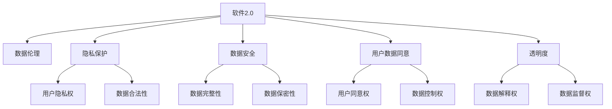

                 

## 1. 背景介绍

在过去几十年中，软件行业经历了从软件1.0时代到软件2.0时代的转变。软件1.0时代，软件主要应用于企业内部，目标是提高工作效率，改善业务流程。而软件2.0时代，软件则主要面向用户，目标是提供更好的用户体验，创造商业价值。在这个过程中，数据的作用变得越来越重要。数据驱动的决策、数据驱动的产品设计、数据驱动的运营优化，已经成为软件2.0时代的主流理念。

然而，随着数据的重要性日益提升，收集和使用数据的责任也变得愈发重大。尤其是在隐私保护、数据安全、数据伦理等方面，软件开发者和运营者面临着前所未有的挑战。如何在追求数据驱动的同时，保障用户隐私和数据安全，遵守数据伦理规范，成为软件2.0时代的重要课题。

## 2. 核心概念与联系

### 2.1 核心概念概述

为了更好地理解数据伦理在软件2.0时代的意义，本节将介绍几个关键概念：

- **软件2.0（Software 2.0）**：指以数据为核心驱动的，面向用户的产品和服务的时代。在这个时代，数据采集、数据处理、数据应用等成为产品设计、运营和优化的重要基础。

- **数据伦理（Data Ethics）**：指在数据采集、存储、处理和应用等环节中，遵循的原则、规范和准则，确保数据的使用符合伦理道德要求，保障用户权益和隐私安全。

- **隐私保护（Privacy Protection）**：指在数据处理和应用过程中，采取技术和政策措施，确保用户个人信息和数据隐私不被泄露或滥用。

- **数据安全（Data Security）**：指在数据存储和传输过程中，采取措施防止数据被非法访问、篡改或破坏。

- **用户数据同意（User Consent）**：指在数据收集和使用前，征得用户同意，明确告知数据使用目的和范围，保障用户对自身数据的使用有知情权和控制权。

- **透明度（Transparency）**：指在数据处理和应用过程中，确保数据使用过程和结果可解释、可追溯，便于用户和监管机构理解和监督。

这些概念之间的逻辑关系可以通过以下Mermaid流程图来展示：



这个流程图展示了一些核心概念之间的关系：

1. 软件2.0时代的数据驱动特性，使得数据采集、存储、处理和应用成为软件设计、运营和优化的重要环节。
2. 数据伦理、隐私保护、数据安全等原则和规范，确保数据的使用符合伦理道德要求。
3. 用户数据同意、透明度等措施，保障用户对自身数据的使用有知情权和控制权。
4. 隐私权、数据合法性、数据完整性、数据保密性等隐私保护和安全措施，确保数据的安全性和合法性。
5. 用户同意权、数据控制权、数据解释权、数据监督权等用户权益保障机制，使数据的使用更加透明和可控。

这些概念共同构成了软件2.0时代的数据处理和使用框架，使得数据驱动的产品和服务在提供商业价值的同时，也要重视数据伦理和用户权益。

## 3. 核心算法原理 & 具体操作步骤
### 3.1 算法原理概述

软件2.0时代的数据处理和应用，通常涉及大量数据的采集、存储、处理和应用。这些操作需要通过算法和技术手段来实现，确保数据使用的合法性、公正性和安全性。

以下是数据处理和应用的基本原理：

1. **数据采集**：通过各种方式（如传感器、用户输入、网络爬虫等）收集用户数据。
2. **数据存储**：将采集到的数据存储在数据库或分布式存储系统中，确保数据的安全性和可靠性。
3. **数据处理**：对存储的数据进行清洗、转换和分析，提取有价值的信息。
4. **数据应用**：基于处理后的数据，设计算法和模型，为用户提供服务或优化产品。

### 3.2 算法步骤详解

软件2.0时代的数据处理和应用，通常涉及以下几个关键步骤：

**Step 1: 数据采集**

数据采集是软件2.0时代数据处理的起点。采集数据的来源多种多样，包括：

- **用户行为数据**：通过跟踪用户在应用程序中的行为（如点击、滑动、浏览等），获取用户使用习惯和偏好。
- **传感器数据**：通过手机、可穿戴设备等传感器，采集用户的生理数据（如步数、心率、血压等）。
- **网络数据**：通过网络爬虫、API接口等手段，获取互联网上的公开数据。

数据采集过程中需要注意：

- 采集数据的合法性。确保数据采集行为符合法律法规要求，不侵犯用户隐私。
- 数据采集的透明性。向用户明确告知数据采集的目的和范围，获取用户同意。

**Step 2: 数据存储**

数据采集完成后，需要进行存储。数据存储通常涉及以下几个方面：

- **数据格式**：选择合适的数据格式（如JSON、CSV、Parquet等），以便后续处理和应用。
- **数据规模**：根据数据规模，选择合适的数据存储方式（如关系型数据库、NoSQL数据库、分布式文件系统等）。
- **数据备份**：定期备份数据，防止数据丢失或损坏。

数据存储过程中需要注意：

- 数据存储的安全性。采用加密、权限控制等措施，防止数据泄露或篡改。
- 数据存储的可靠性。采用冗余存储、故障恢复等技术，确保数据的高可用性。

**Step 3: 数据处理**

数据处理是数据应用的基础，通常涉及以下几个步骤：

- **数据清洗**：对采集到的数据进行去重、去噪、格式化等处理，确保数据质量。
- **数据转换**：将数据转换为适合算法和模型处理的格式（如向量化、归一化等）。
- **数据分析**：基于处理后的数据，设计算法和模型，提取有价值的信息。

数据处理过程中需要注意：

- 数据处理的合法性。确保数据处理行为符合法律法规要求，不侵犯用户隐私。
- 数据处理的透明性。向用户明确告知数据处理的目的和范围，获取用户同意。

**Step 4: 数据应用**

数据应用是数据处理的最终目标，通常涉及以下几个方面：

- **算法和模型**：基于处理后的数据，设计算法和模型，为用户提供服务或优化产品。
- **应用接口**：将算法和模型封装成服务接口，供前端应用调用。
- **用户反馈**：收集用户对应用的反馈，不断优化算法和模型。

数据应用过程中需要注意：

- 数据应用的安全性。采用加密、权限控制等措施，防止数据泄露或篡改。
- 数据应用的透明性。向用户明确告知数据应用的目的和范围，获取用户同意。

### 3.3 算法优缺点

软件2.0时代的数据处理和应用，具有以下优点：

1. **数据驱动的决策**：数据驱动的产品和服务，可以更科学、更精确地进行决策和优化。
2. **提高用户体验**：基于用户数据的产品和服务，可以更好地满足用户需求，提升用户体验。
3. **优化运营效率**：数据驱动的运营优化，可以提高产品和服务运营的效率和效果。

同时，数据处理和应用也存在以下缺点：

1. **隐私风险**：数据采集、存储和应用过程中，可能存在隐私泄露的风险。
2. **安全风险**：数据存储和传输过程中，可能存在数据被篡改、破坏的风险。
3. **伦理争议**：数据使用过程中，可能存在伦理争议，如数据滥用、算法偏见等。
4. **法律风险**：数据处理和应用过程中，可能存在法律风险，如违反法律法规，导致法律纠纷。

### 3.4 算法应用领域

软件2.0时代的数据处理和应用，在各个领域都有广泛的应用，例如：

- **智能推荐**：通过用户行为数据，推荐个性化的产品或服务。
- **个性化广告**：通过用户兴趣数据，提供个性化的广告。
- **风险控制**：通过用户信用数据，进行贷款、保险等风险评估。
- **智能客服**：通过用户对话数据，提高客服响应速度和准确率。
- **健康监测**：通过用户生理数据，提供健康监测和预警。
- **营销分析**：通过用户行为数据，优化营销策略和方案。

除了这些传统应用外，软件2.0时代的数据处理和应用还在不断拓展，如智能制造、智慧城市、智能家居等，为各个行业带来变革性影响。

## 4. 数学模型和公式 & 详细讲解 & 举例说明
### 4.1 数学模型构建

软件2.0时代的数据处理和应用，通常涉及复杂的数据模型和算法。以下是一个简化的数学模型构建过程：

假设我们有一个数据集 $D=\{(x_i,y_i)\}_{i=1}^N$，其中 $x_i$ 是特征向量，$y_i$ 是目标变量。我们的目标是通过数据集 $D$ 训练一个模型 $f$，使得模型能够根据新的输入 $x$ 预测目标变量 $y$。

定义模型的损失函数为 $L(f;D)=\frac{1}{N}\sum_{i=1}^N\ell(f(x_i),y_i)$，其中 $\ell$ 是损失函数，常用的有均方误差损失、交叉熵损失等。

基于最小化损失函数的目标，使用梯度下降等优化算法求解模型参数 $f$。设参数更新公式为 $f \leftarrow f - \eta \nabla_{f}L(f;D)$，其中 $\eta$ 是学习率。

### 4.2 公式推导过程

以下是一个简单的线性回归模型的推导过程。

假设模型的输入 $x_i$ 为一个 $d$ 维向量，目标变量 $y_i$ 为一个实数。我们假设模型 $f$ 为线性模型，即 $f(x)=\theta^Tx$，其中 $\theta$ 为模型参数。

定义损失函数为均方误差损失，即 $\ell(f(x_i),y_i)=\frac{1}{2}(f(x_i)-y_i)^2$。则总损失函数为：

$$
L(f;D)=\frac{1}{N}\sum_{i=1}^N(f(x_i)-y_i)^2
$$

根据链式法则，损失函数对模型参数 $\theta$ 的梯度为：

$$
\nabla_{\theta}L(f;D)=\frac{1}{N}\sum_{i=1}^N(x_i-\bar{x})(y_i-f(x_i))
$$

其中 $\bar{x}=\frac{1}{N}\sum_{i=1}^Nx_i$ 为特征向量的均值。

在得到梯度后，可以使用梯度下降算法更新模型参数，迭代优化模型：

$$
\theta \leftarrow \theta - \eta\nabla_{\theta}L(f;D)
$$

在数据集 $D$ 上进行多次迭代后，得到最优模型参数 $\theta^*$。

### 4.3 案例分析与讲解

假设我们有一个电商平台的销售数据，目标是预测用户的购买行为。我们首先进行数据预处理：

- **数据清洗**：去除缺失值、异常值等。
- **数据转换**：将数据转换为数值型特征。
- **数据划分**：将数据划分为训练集和测试集。

接下来，我们设计一个线性回归模型进行预测：

- **模型设计**：定义模型 $f(x)=\theta^Tx$，其中 $\theta^*$ 为最优参数。
- **参数优化**：使用梯度下降算法优化模型参数 $\theta$。
- **模型评估**：在测试集上评估模型性能。

最终，我们得到预测结果，并将其应用到实际业务中，如推荐商品、优化库存等。

## 5. 项目实践：代码实例和详细解释说明
### 5.1 开发环境搭建

在进行数据处理和应用实践前，我们需要准备好开发环境。以下是使用Python进行TensorFlow开发的环境配置流程：

1. 安装Anaconda：从官网下载并安装Anaconda，用于创建独立的Python环境。

2. 创建并激活虚拟环境：
```bash
conda create -n tf-env python=3.8 
conda activate tf-env
```

3. 安装TensorFlow：根据CUDA版本，从官网获取对应的安装命令。例如：
```bash
conda install tensorflow -c tensorflow -c conda-forge
```

4. 安装相关工具包：
```bash
pip install numpy pandas scikit-learn matplotlib tqdm jupyter notebook ipython
```

完成上述步骤后，即可在`tf-env`环境中开始项目实践。

### 5.2 源代码详细实现

下面我们以电商平台的销售数据为例，给出使用TensorFlow进行线性回归模型的PyTorch代码实现。

首先，定义数据处理函数：

```python
import numpy as np
from tensorflow.keras.datasets import boston_housing

def load_data():
    x_train, y_train, x_test, y_test = boston_housing.load_data()
    x_train = x_train.reshape(-1, 13)
    x_test = x_test.reshape(-1, 13)
    y_train = y_train.reshape(-1, 1)
    y_test = y_test.reshape(-1, 1)
    return x_train, y_train, x_test, y_test

# 加载数据
x_train, y_train, x_test, y_test = load_data()
```

然后，定义模型和优化器：

```python
from tensorflow.keras.models import Sequential
from tensorflow.keras.layers import Dense
from tensorflow.keras.optimizers import SGD

model = Sequential([
    Dense(64, activation='relu', input_dim=13),
    Dense(1, activation='linear')
])
model.compile(optimizer=SGD(lr=0.01), loss='mse')
```

接着，定义训练和评估函数：

```python
from tensorflow.keras.metrics import MeanSquaredError

def train_model(model, x_train, y_train, x_test, y_test, epochs=100):
    model.fit(x_train, y_train, epochs=epochs, batch_size=32, validation_data=(x_test, y_test))
    mse = MeanSquaredError()
    train_loss = mse(model.predict(x_train), y_train).numpy()
    test_loss = mse(model.predict(x_test), y_test).numpy()
    return train_loss, test_loss

def evaluate_model(model, x_test, y_test):
    mse = MeanSquaredError()
    test_loss = mse(model.predict(x_test), y_test).numpy()
    return test_loss
```

最后，启动训练流程并在测试集上评估：

```python
train_loss, test_loss = train_model(model, x_train, y_train, x_test, y_test)
print(f"Train Loss: {train_loss}")
print(f"Test Loss: {test_loss}")
```

以上就是使用TensorFlow进行线性回归模型的完整代码实现。可以看到，TensorFlow提供了方便的Keras API，使得模型的构建和训练变得简洁高效。

### 5.3 代码解读与分析

让我们再详细解读一下关键代码的实现细节：

**load_data函数**：
- 使用Boston Housing数据集作为示例，加载训练集和测试集的数据。
- 将数据转换为numpy数组，并按照模型要求进行形状调整。

**model定义**：
- 使用Keras的Sequential模型，定义了一个包含一个隐藏层和一个输出层的神经网络。
- 隐藏层使用ReLU激活函数，输出层使用线性激活函数，适合线性回归任务。

**train_model函数**：
- 使用训练集数据进行模型训练，设置训练轮数、批次大小等参数。
- 使用均方误差损失函数，优化器为随机梯度下降（SGD）。
- 训练过程中，记录训练损失和测试损失。

**evaluate_model函数**：
- 使用测试集数据进行模型评估，计算均方误差损失。

**训练流程**：
- 定义训练轮数，启动训练流程。
- 在训练过程中，记录训练损失和测试损失。
- 训练结束后，输出训练损失和测试损失。

可以看到，TensorFlow的Keras API使得模型的构建和训练变得非常简单，开发者可以将更多精力放在数据处理和业务逻辑上，而不必过多关注底层的实现细节。

## 6. 实际应用场景
### 6.1 智能推荐系统

智能推荐系统是软件2.0时代的一个重要应用。通过用户行为数据，推荐系统能够为用户推荐个性化的产品或服务，提升用户体验。

在技术实现上，推荐系统通常涉及以下几个关键环节：

- **数据采集**：通过用户浏览、点击、收藏等行为数据，采集用户偏好。
- **数据存储**：将用户行为数据存储在数据库中，以便后续处理和应用。
- **数据处理**：对用户行为数据进行清洗、转换和分析，提取用户兴趣和偏好。
- **模型训练**：基于处理后的数据，设计推荐模型，预测用户可能感兴趣的商品。
- **推荐应用**：将推荐结果应用到产品和服务中，提升用户体验。

推荐系统可以应用于电商、视频、音乐等多个领域，为用户推荐个性化的商品、视频、音乐等，提升用户满意度。

### 6.2 个性化广告系统

个性化广告系统是软件2.0时代的另一个重要应用。通过用户行为数据，广告系统能够为用户推荐个性化的广告，提升广告效果。

在技术实现上，广告系统通常涉及以下几个关键环节：

- **数据采集**：通过用户浏览、点击、购买等行为数据，采集用户兴趣。
- **数据存储**：将用户行为数据存储在数据库中，以便后续处理和应用。
- **数据处理**：对用户行为数据进行清洗、转换和分析，提取用户兴趣和偏好。
- **模型训练**：基于处理后的数据，设计广告模型，预测用户可能感兴趣的广告。
- **广告投放**：将广告结果应用到广告投放中，提升广告效果。

广告系统可以应用于互联网、社交媒体等多个领域，为用户推荐个性化的广告，提升广告效果和用户满意度。

### 6.3 智能客服系统

智能客服系统是软件2.0时代的另一个重要应用。通过用户对话数据，智能客服系统能够自动回答用户问题，提升客服效率和用户体验。

在技术实现上，智能客服系统通常涉及以下几个关键环节：

- **数据采集**：通过用户对话数据，采集用户问题和回复。
- **数据存储**：将用户对话数据存储在数据库中，以便后续处理和应用。
- **数据处理**：对用户对话数据进行清洗、转换和分析，提取用户问题和回答。
- **模型训练**：基于处理后的数据，设计客服模型，预测用户问题和回答。
- **客服应用**：将客服结果应用到客服系统中，提升客服效率和用户体验。

智能客服系统可以应用于电商、银行、医疗等多个领域，自动回答用户问题，提升客服效率和用户体验。

### 6.4 未来应用展望

随着软件2.0时代的不断发展，基于数据驱动的应用场景将会不断拓展，未来可能的应用领域包括：

- **智能制造**：通过工业数据，优化制造过程和质量控制。
- **智慧城市**：通过城市数据，提升城市管理和运营效率。
- **智能家居**：通过家居数据，提升家庭生活和居住体验。
- **健康医疗**：通过医疗数据，提高疾病诊断和治疗效果。
- **金融服务**：通过金融数据，提升金融产品和服务的个性化和智能化。

这些应用场景将进一步拓展软件2.0时代的数据处理和应用范围，为各个行业带来变革性影响。

## 7. 工具和资源推荐
### 7.1 学习资源推荐

为了帮助开发者系统掌握软件2.0时代的数据处理和应用，这里推荐一些优质的学习资源：

1. **《深度学习》（Deep Learning）**：由深度学习领域的知名学者Ian Goodfellow撰写，深入浅出地介绍了深度学习的基本原理和应用。
2. **《Python深度学习》（Python Deep Learning）**：由Keras之父François Chollet撰写，介绍了使用Python和Keras进行深度学习项目开发的实践经验。
3. **《TensorFlow官方文档》（TensorFlow Documentation）**：TensorFlow的官方文档，提供了详尽的API和示例代码，适合深入学习和实践。
4. **《PyTorch官方文档》（PyTorch Documentation）**：PyTorch的官方文档，提供了详尽的API和示例代码，适合深入学习和实践。
5. **《数据科学与机器学习速成课程》（Data Science and Machine Learning Bootcamp）**：由Coursera提供的免费课程，系统介绍了数据科学和机器学习的基本概念和实践。

通过对这些资源的学习实践，相信你一定能够快速掌握软件2.0时代的数据处理和应用技能，并用于解决实际问题。

### 7.2 开发工具推荐

高效的开发离不开优秀的工具支持。以下是几款用于软件2.0时代数据处理和应用开发的常用工具：

1. **TensorFlow**：由Google主导开发的开源深度学习框架，生产部署方便，适合大规模工程应用。
2. **PyTorch**：由Facebook主导开发的开源深度学习框架，灵活易用，适合研究和原型开发。
3. **Keras**：基于TensorFlow和Theano的高级API，使得深度学习模型的构建和训练变得简单高效。
4. **Jupyter Notebook**：免费的交互式开发环境，适合快速迭代和调试。
5. **Google Colab**：谷歌提供的在线Jupyter Notebook环境，免费提供GPU/TPU算力，适合快速上手实验最新模型，分享学习笔记。

合理利用这些工具，可以显著提升数据处理和应用开发的效率，加快创新迭代的步伐。

### 7.3 相关论文推荐

软件2.0时代的数据处理和应用，需要结合最新的研究成果和技术进展。以下是几篇奠基性的相关论文，推荐阅读：

1. **《Deep Learning》（Deep Learning）**：由Ian Goodfellow撰写，介绍了深度学习的基本原理和应用。
2. **《Practical Deep Learning for Coders》（Practical Deep Learning for Coders）**：由François Chollet撰写，介绍了使用TensorFlow和Keras进行深度学习项目开发的实践经验。
3. **《AlphaGo Zero: Mastering the Game of Go without Human Knowledge》（AlphaGo Zero: Mastering the Game of Go without Human Knowledge）**：由DeepMind团队撰写，展示了使用深度学习实现游戏AI的成功案例。
4. **《BERT: Pre-training of Deep Bidirectional Transformers for Language Understanding》（BERT: Pre-training of Deep Bidirectional Transformers for Language Understanding）**：由Google团队撰写，展示了使用BERT模型进行文本理解的成功案例。

这些论文代表了大数据处理和应用领域的最新进展，通过学习这些前沿成果，可以帮助研究者把握学科前进方向，激发更多的创新灵感。

## 8. 总结：未来发展趋势与挑战
### 8.1 总结

本文对软件2.0时代的数据处理和应用进行了全面系统的介绍。首先阐述了软件2.0时代的数据驱动特性，明确了数据处理和应用的重要地位。其次，从原理到实践，详细讲解了数据采集、存储、处理和应用的基本流程，给出了数据处理和应用的全景视图。同时，本文还广泛探讨了数据处理和应用在各个领域的应用前景，展示了数据驱动的巨大潜力。

通过本文的系统梳理，可以看到，软件2.0时代的数据处理和应用已经成为各行各业的核心竞争力，对提升产品和服务的质量、效率和用户体验起到了重要的推动作用。未来，随着数据处理和应用技术的不断进步，基于数据驱动的产品和服务将变得更加智能化、个性化和多样化。

### 8.2 未来发展趋势

展望未来，软件2.0时代的数据处理和应用将呈现以下几个发展趋势：

1. **数据规模持续增大**：随着物联网、智能设备等技术的发展，数据规模将持续增长，数据驱动的决策和应用也将更加广泛和深入。
2. **数据质量持续提升**：数据处理和应用技术的发展，将使得数据采集、清洗和处理变得更加高效和准确。
3. **数据安全性和隐私保护**：数据处理和应用过程中，隐私保护和数据安全将变得更加重要，法律法规也将更加严格。
4. **数据驱动的智能化应用**：数据处理和应用技术的发展，将使得智能化应用变得更加普及和深入。
5. **数据驱动的创新能力**：数据处理和应用技术的发展，将使得各个行业更加注重数据的利用，提升创新能力。

以上趋势凸显了软件2.0时代的数据处理和应用技术的广阔前景，这些方向的探索发展，必将进一步提升数据驱动的产品和服务的质量和效率，推动人类社会的数字化进程。

### 8.3 面临的挑战

尽管软件2.0时代的数据处理和应用技术取得了显著进展，但在迈向更加智能化、普适化应用的过程中，它仍面临着诸多挑战：

1. **数据质量问题**：数据采集、清洗和处理过程中，可能会出现数据缺失、噪声、异常等问题，影响数据驱动的决策和应用效果。
2. **数据隐私和伦理问题**：数据处理和应用过程中，可能会出现隐私泄露、数据滥用等问题，影响用户权益和伦理道德。
3. **数据安全和风险问题**：数据存储和传输过程中，可能会出现数据泄露、篡改、破坏等问题，影响数据驱动的安全性和可靠性。
4. **法律法规和合规问题**：数据处理和应用过程中，可能会出现法律法规不完善、合规性问题，影响数据的合法性和合规性。
5. **数据驱动的智能化应用**：数据处理和应用过程中，可能会出现智能化应用的不稳定性和不可解释性，影响数据驱动的智能化应用效果。

正视这些挑战，积极应对并寻求突破，将是大数据处理和应用技术迈向成熟的必由之路。相信随着学界和产业界的共同努力，这些挑战终将一一被克服，大数据处理和应用技术必将在构建人机协同的智能社会中扮演越来越重要的角色。

### 8.4 研究展望

面对大数据处理和应用所面临的种种挑战，未来的研究需要在以下几个方面寻求新的突破：

1. **数据采集和清洗技术**：开发更加高效、准确的数据采集和清洗技术，提高数据质量。
2. **数据隐私保护技术**：研究数据隐私保护技术，确保数据处理的合法性和合规性。
3. **数据安全和风险控制技术**：研究数据安全和风险控制技术，确保数据的安全性和可靠性。
4. **数据驱动的智能化应用**：研究数据驱动的智能化应用技术，提升数据驱动的智能化应用效果。
5. **数据驱动的伦理和技术规范**：研究数据驱动的伦理和技术规范，确保数据驱动的合法性和合规性。

这些研究方向的探索，必将引领大数据处理和应用技术的不断进步，为构建安全、可靠、可解释、可控的智能社会铺平道路。面向未来，大数据处理和应用技术还需要与其他人工智能技术进行更深入的融合，如知识表示、因果推理、强化学习等，多路径协同发力，共同推动人工智能技术的发展。只有勇于创新、敢于突破，才能不断拓展数据驱动的产品和服务边界，让人工智能技术更好地造福人类社会。

## 9. 附录：常见问题与解答

**Q1：数据处理和应用中如何保证数据的质量？**

A: 数据质量问题是数据处理和应用中非常关键的问题。为了保证数据质量，可以采取以下措施：

1. **数据采集**：在数据采集阶段，保证数据的完整性、准确性和一致性，避免数据缺失、噪声和异常。
2. **数据清洗**：对采集到的数据进行清洗，去除重复、缺失、异常等数据，确保数据的准确性和一致性。
3. **数据转换**：对清洗后的数据进行转换，确保数据格式符合后续处理和应用的需求。
4. **数据验证**：在数据处理和应用过程中，定期对数据进行验证，确保数据的质量和一致性。

这些措施可以显著提升数据处理和应用的质量，保障数据驱动的决策和应用效果。

**Q2：数据处理和应用中如何保护用户隐私？**

A: 用户隐私保护是数据处理和应用中必须考虑的重要问题。为了保护用户隐私，可以采取以下措施：

1. **数据匿名化**：对用户数据进行匿名化处理，避免直接关联到个人身份。
2. **数据加密**：对存储和传输的数据进行加密，确保数据的安全性。
3. **数据访问控制**：对数据的访问进行严格的权限控制，确保只有授权人员能够访问数据。
4. **数据共享协议**：在数据共享过程中，制定严格的数据共享协议，确保数据使用的合法性和合规性。

这些措施可以显著提升数据处理和应用中用户隐私的保护，保障用户权益和数据安全。

**Q3：数据处理和应用中如何确保数据的安全性？**

A: 数据安全性是数据处理和应用中必须考虑的重要问题。为了确保数据的安全性，可以采取以下措施：

1. **数据加密**：对存储和传输的数据进行加密，确保数据的安全性。
2. **访问控制**：对数据的访问进行严格的权限控制，确保只有授权人员能够访问数据。
3. **监控和审计**：对数据的访问和使用进行监控和审计，确保数据的合法性和合规性。
4. **数据备份**：定期备份数据，防止数据丢失或损坏。

这些措施可以显著提升数据处理和应用中数据的安全性，保障数据的安全性和可靠性。

**Q4：数据处理和应用中如何提高算法的透明性和可解释性？**

A: 算法的透明性和可解释性是数据处理和应用中必须考虑的重要问题。为了提高算法的透明性和可解释性，可以采取以下措施：

1. **模型解释性技术**：研究模型解释性技术，使算法的决策过程可解释、可追溯。
2. **可视化技术**：使用可视化技术，将算法的决策过程可视化，便于用户和监管机构理解和监督。
3. **透明性设计**：在算法设计过程中，考虑算法的透明性和可解释性，使其更易于理解和使用。

这些措施可以显著提升数据处理和应用中算法的透明性和可解释性，保障算法的合法性和合规性。

**Q5：数据处理和应用中如何应对法律法规的挑战？**

A: 数据处理和应用过程中，法律法规的合规性是一个必须考虑的重要问题。为了应对法律法规的挑战，可以采取以下措施：

1. **法律法规研究**：研究相关法律法规，确保数据处理和应用符合法律法规要求。
2. **合规性审核**：在数据处理和应用过程中，进行合规性审核，确保数据使用的合法性和合规性。
3. **用户同意**：在数据处理和应用过程中，明确告知用户数据的使用目的和范围，获取用户同意。

这些措施可以显著提升数据处理和应用中法律法规的合规性，保障数据使用的合法性和合规性。

---

作者：禅与计算机程序设计艺术 / Zen and the Art of Computer Programming

