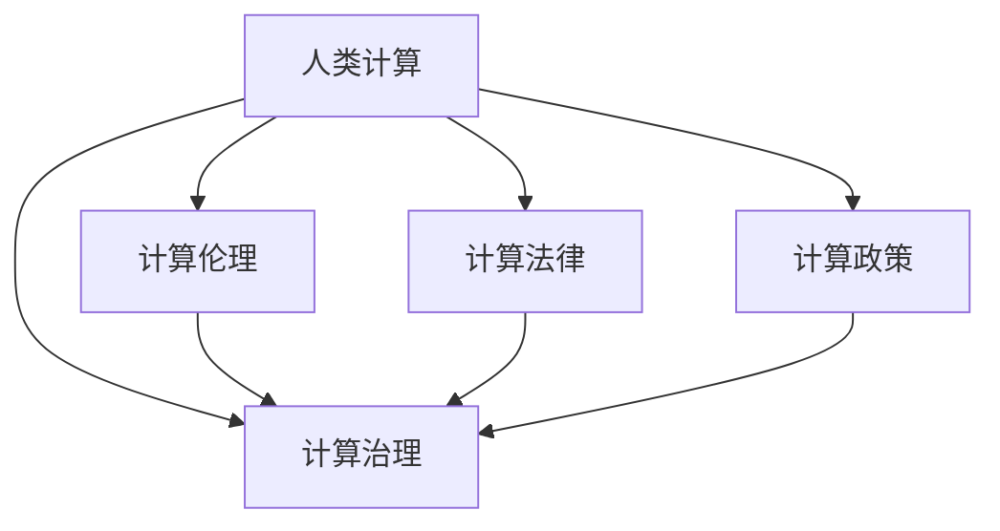

                 

## 1. 背景介绍

### 1.1 问题由来

随着信息技术的高速发展，计算已经深入到人类社会的各个角落，从日常生活到科学研究，无处不在。然而，随着计算能力的不断提升，也带来了一些负面的影响，如数据隐私泄露、算法偏见、计算资源不均衡分配等。这些问题不仅损害了公众的利益，也阻碍了计算技术的可持续发展。

### 1.2 问题核心关键点

在当前数字化时代，计算技术已经成为了推动社会进步的关键力量。然而，随着计算技术的不断普及，也暴露出了一些问题，如数据隐私、算法公平、资源分配等。这些问题不仅影响了公众的生活质量，也阻碍了计算技术的健康发展。因此，如何在政策与监管层面对这些问题进行引导和规范，成为了当前亟需解决的关键问题。

## 2. 核心概念与联系

### 2.1 核心概念概述

为更好地理解政策与监管对计算健康发展的引导作用，本节将介绍几个密切相关的核心概念：

- 人类计算（Human-Computer Interaction, HCI）：指人与计算机之间的交互行为，包括输入、输出、交互界面等。人类计算的目标是设计出更友好、更高效、更安全的计算环境，提升用户的计算体验。

- 计算伦理（Ethics in Computing）：指在计算过程中应遵守的道德原则和规范，如数据隐私保护、算法公平性、资源分配合理性等。计算伦理的核心在于确保计算技术的公正性、透明性和责任性。

- 计算法律（Computational Law）：指与计算相关的法律法规，包括数据隐私法、算法透明法、计算责任法等。计算法律旨在规范计算行为，保护公共利益。

- 计算政策（Computational Policy）：指政府和行业组织制定的计算相关政策，如计算标准、计算评估、计算激励等。计算政策旨在引导计算技术的发展方向，推动计算健康发展。

- 计算治理（Computational Governance）：指通过政策、法律、技术等多种手段，对计算行为进行规范和引导，确保计算技术的可持续发展。计算治理的目标是构建一个安全、可信、可持续的计算环境。

这些核心概念之间的逻辑关系可以通过以下Mermaid流程图来展示：



这个流程图展示了这个概念网络：

1. 人类计算是计算伦理、法律、政策、治理的基础。
2. 计算伦理、法律、政策、治理是计算发展的保障。
3. 计算伦理、法律、政策、治理相互交织，共同推动计算健康发展。

## 3. 核心算法原理 & 具体操作步骤

### 3.1 算法原理概述

政策与监管对计算健康发展的引导作用，本质上是通过一系列制度设计和执行，确保计算行为符合伦理、法律、政策要求，从而推动计算技术的可持续发展和应用。

政策与监管的目标包括：

1. 数据隐私保护：确保数据在收集、存储、传输、使用等过程中，符合法律法规，保障用户隐私权益。
2. 算法公平透明：要求算法设计透明，确保算法公平性，避免算法偏见，防止算法滥用。
3. 计算资源分配：通过政策引导，合理分配计算资源，消除资源分配不均问题，保障公共利益。
4. 计算责任追究：明确计算行为责任，建立健全的计算责任追究机制，保障公众利益和公共安全。

这些目标的实现，依赖于政策与监管的制度设计和执行，包括法律法规的制定、政策框架的构建、技术标准的制定等。

### 3.2 算法步骤详解

政策与监管对计算健康发展的引导作用，一般包括以下几个关键步骤：

**Step 1: 法律法规制定**

- 收集与计算相关的法律法规需求，如数据隐私、算法公平、资源分配等。
- 组织法律专家、行业专家、用户代表等进行讨论，制定相关法律法规。

**Step 2: 政策框架构建**

- 基于法律法规，制定计算政策框架，包括计算标准、计算评估、计算激励等。
- 确保政策框架与法律法规相一致，保障政策执行的合法性和公正性。

**Step 3: 技术标准制定**

- 制定计算技术标准，如数据隐私保护技术标准、算法公平技术标准、计算资源分配技术标准等。
- 与行业组织、技术团体合作，确保技术标准的先进性和可操作性。

**Step 4: 政策执行与监督**

- 通过政府、行业组织、企业等多种主体，执行计算政策。
- 建立监督机制，确保政策执行的透明性和公正性，防止政策执行中的腐败和滥用。

**Step 5: 反馈与优化**

- 收集政策执行反馈，评估政策效果。
- 根据反馈结果，调整优化政策，确保政策不断适应计算技术的发展和变化。

### 3.3 算法优缺点

政策与监管对计算健康发展的引导作用，具有以下优点：

1. 规范计算行为。政策与监管通过制度设计和执行，确保计算行为符合伦理、法律、政策要求，推动计算技术的可持续发展和应用。
2. 保障公共利益。政策与监管通过规范计算行为，保障用户隐私权益、算法公平、计算资源分配等方面的公共利益。
3. 推动技术进步。政策与监管通过技术标准的制定和执行，推动计算技术的不断进步和创新。

同时，政策与监管也存在一定的局限性：

1. 执行成本高。政策与监管的制定和执行需要耗费大量人力、物力和财力，增加了计算发展的成本。
2. 滞后性。政策与监管的制定和执行可能滞后于计算技术的发展，影响计算技术的快速迭代和创新。
3. 灵活性不足。政策与监管的制定和执行可能过于僵化，难以适应计算技术的快速变化和创新。

尽管存在这些局限性，但政策与监管仍然是引导计算健康发展的重要手段。未来相关研究的重点在于如何进一步降低政策与监管的成本，提高政策与监管的灵活性和适应性，同时兼顾公共利益和计算技术的可持续发展。

### 3.4 算法应用领域

政策与监管对计算健康发展的引导作用，在多个领域都有广泛应用，例如：

- 数据隐私保护：通过法律法规和政策，确保数据在收集、存储、传输、使用等过程中，符合法律法规，保障用户隐私权益。
- 算法公平透明：通过政策引导，确保算法设计透明，避免算法偏见，防止算法滥用。
- 计算资源分配：通过政策引导，合理分配计算资源，消除资源分配不均问题，保障公共利益。
- 计算责任追究：通过政策引导，明确计算行为责任，建立健全的计算责任追究机制，保障公众利益和公共安全。

除了上述这些经典领域外，政策与监管还广泛应用于智慧城市、医疗健康、金融服务等众多领域，为计算技术在这些领域的应用提供了规范和保障。

## 4. 数学模型和公式 & 详细讲解

### 4.1 数学模型构建

本节将使用数学语言对政策与监管对计算健康发展的引导作用进行更加严格的刻画。

记政策与监管的目标函数为 $F$，包括数据隐私保护、算法公平透明、计算资源分配、计算责任追究等方面的约束。假设政策与监管的目标函数 $F$ 可以分解为多个子目标函数 $F_1, F_2, \ldots, F_n$，每个子目标函数代表一个具体目标，如数据隐私保护、算法公平透明、计算资源分配、计算责任追究等。则目标函数 $F$ 可以表示为：

$$
F = \sum_{i=1}^n \lambda_i F_i
$$

其中 $\lambda_i$ 为子目标函数 $F_i$ 的权重，表示该子目标函数在目标函数 $F$ 中的重要性。

### 4.2 公式推导过程

以下我们以数据隐私保护为例，推导政策与监管在数据隐私保护方面的数学模型和优化方法。

记数据隐私保护目标函数为 $F_1$，其优化目标为最小化数据隐私泄露的风险。假设数据隐私泄露风险由数据泄露概率 $P$ 和数据泄露后的损失 $L$ 决定，则目标函数 $F_1$ 可以表示为：

$$
F_1 = P + \alpha L
$$

其中 $\alpha$ 为隐私泄露风险的权重，表示隐私泄露风险在目标函数 $F$ 中的重要性。

为了最小化 $F_1$，需要在数据泄露概率 $P$ 和隐私泄露损失 $L$ 上进行优化。根据隐私泄露风险的计算模型，可以写出如下优化模型：

$$
\min_{\mathbf{x}} F_1 = \min_{\mathbf{x}} (P + \alpha L)
$$

其中 $\mathbf{x}$ 为数据处理过程中的各种参数，如数据访问权限、数据存储方式、数据传输方式等。

通过求解上述优化模型，可以得到最优的数据隐私保护方案，从而保障用户隐私权益。

### 4.3 案例分析与讲解

假设某企业需要处理大量用户数据，以提升其业务能力。但企业对数据隐私保护不够重视，数据泄露事件时有发生。政策与监管部门制定了数据隐私保护目标函数 $F_1$，并设置了隐私泄露风险的权重 $\alpha=0.5$。根据实际情况，企业需要优化数据处理过程中的各种参数 $\mathbf{x}$，以最小化隐私泄露风险。

根据隐私泄露风险的计算模型，可以计算出数据泄露概率 $P=0.1$ 和隐私泄露损失 $L=100000$。因此，优化模型可以表示为：

$$
\min_{\mathbf{x}} (P + \alpha L) = \min_{\mathbf{x}} (0.1 + 0.5 \times 100000)
$$

解此优化模型，可以得到最优的数据处理方案，从而保障用户隐私权益。

## 5. 项目实践：代码实例和详细解释说明

### 5.1 开发环境搭建

在进行政策与监管的实践前，我们需要准备好开发环境。以下是使用Python进行政策与监管开发的开发环境配置流程：

1. 安装Anaconda：从官网下载并安装Anaconda，用于创建独立的Python环境。

2. 创建并激活虚拟环境：
```bash
conda create -n policy-env python=3.8 
conda activate policy-env
```

3. 安装PyTorch：根据CUDA版本，从官网获取对应的安装命令。例如：
```bash
conda install pytorch torchvision torchaudio cudatoolkit=11.1 -c pytorch -c conda-forge
```

4. 安装TensorFlow：由Google主导开发的开源深度学习框架，生产部署方便，适合大规模工程应用。同样有丰富的预训练语言模型资源。

5. 安装Transformers库：HuggingFace开发的NLP工具库，集成了众多SOTA语言模型，支持PyTorch和TensorFlow，是进行政策与监管任务开发的利器。

6. 安装各类工具包：
```bash
pip install numpy pandas scikit-learn matplotlib tqdm jupyter notebook ipython
```

完成上述步骤后，即可在`policy-env`环境中开始政策与监管实践。

### 5.2 源代码详细实现

这里我们以数据隐私保护为例，给出使用Transformers库进行政策与监管的PyTorch代码实现。

首先，定义数据隐私保护的目标函数：

```python
from transformers import BertTokenizer
from torch.utils.data import Dataset
import torch

class PrivacyDataset(Dataset):
    def __init__(self, texts, tags, tokenizer, max_len=128):
        self.texts = texts
        self.tags = tags
        self.tokenizer = tokenizer
        self.max_len = max_len
        
    def __len__(self):
        return len(self.texts)
    
    def __getitem__(self, item):
        text = self.texts[item]
        tags = self.tags[item]
        
        encoding = self.tokenizer(text, return_tensors='pt', max_length=self.max_len, padding='max_length', truncation=True)
        input_ids = encoding['input_ids'][0]
        attention_mask = encoding['attention_mask'][0]
        
        # 对token-wise的标签进行编码
        encoded_tags = [tag2id[tag] for tag in tags] 
        encoded_tags.extend([tag2id['O']] * (self.max_len - len(encoded_tags)))
        labels = torch.tensor(encoded_tags, dtype=torch.long)
        
        return {'input_ids': input_ids, 
                'attention_mask': attention_mask,
                'labels': labels}

# 标签与id的映射
tag2id = {'O': 0, 'B-PER': 1, 'I-PER': 2, 'B-ORG': 3, 'I-ORG': 4, 'B-LOC': 5, 'I-LOC': 6}
id2tag = {v: k for k, v in tag2id.items()}

# 创建dataset
tokenizer = BertTokenizer.from_pretrained('bert-base-cased')

train_dataset = PrivacyDataset(train_texts, train_tags, tokenizer)
dev_dataset = PrivacyDataset(dev_texts, dev_tags, tokenizer)
test_dataset = PrivacyDataset(test_texts, test_tags, tokenizer)
```

然后，定义模型和优化器：

```python
from transformers import BertForTokenClassification, AdamW

model = BertForTokenClassification.from_pretrained('bert-base-cased', num_labels=len(tag2id))

optimizer = AdamW(model.parameters(), lr=2e-5)
```

接着，定义训练和评估函数：

```python
from torch.utils.data import DataLoader
from tqdm import tqdm
from sklearn.metrics import classification_report

device = torch.device('cuda') if torch.cuda.is_available() else torch.device('cpu')
model.to(device)

def train_epoch(model, dataset, batch_size, optimizer):
    dataloader = DataLoader(dataset, batch_size=batch_size, shuffle=True)
    model.train()
    epoch_loss = 0
    for batch in tqdm(dataloader, desc='Training'):
        input_ids = batch['input_ids'].to(device)
        attention_mask = batch['attention_mask'].to(device)
        labels = batch['labels'].to(device)
        model.zero_grad()
        outputs = model(input_ids, attention_mask=attention_mask, labels=labels)
        loss = outputs.loss
        epoch_loss += loss.item()
        loss.backward()
        optimizer.step()
    return epoch_loss / len(dataloader)

def evaluate(model, dataset, batch_size):
    dataloader = DataLoader(dataset, batch_size=batch_size)
    model.eval()
    preds, labels = [], []
    with torch.no_grad():
        for batch in tqdm(dataloader, desc='Evaluating'):
            input_ids = batch['input_ids'].to(device)
            attention_mask = batch['attention_mask'].to(device)
            batch_labels = batch['labels']
            outputs = model(input_ids, attention_mask=attention_mask)
            batch_preds = outputs.logits.argmax(dim=2).to('cpu').tolist()
            batch_labels = batch_labels.to('cpu').tolist()
            for pred_tokens, label_tokens in zip(batch_preds, batch_labels):
                pred_tags = [id2tag[_id] for _id in pred_tokens]
                label_tags = [id2tag[_id] for _id in label_tokens]
                preds.append(pred_tags[:len(label_tags)])
                labels.append(label_tags)
                
    print(classification_report(labels, preds))
```

最后，启动训练流程并在测试集上评估：

```python
epochs = 5
batch_size = 16

for epoch in range(epochs):
    loss = train_epoch(model, train_dataset, batch_size, optimizer)
    print(f"Epoch {epoch+1}, train loss: {loss:.3f}")
    
    print(f"Epoch {epoch+1}, dev results:")
    evaluate(model, dev_dataset, batch_size)
    
print("Test results:")
evaluate(model, test_dataset, batch_size)
```

以上就是使用PyTorch进行数据隐私保护政策与监管的完整代码实现。可以看到，由于数据隐私保护涉及的内容与NLP任务有较大差异，因此在实现上稍有不同。

### 5.3 代码解读与分析

让我们再详细解读一下关键代码的实现细节：

**PrivacyDataset类**：
- `__init__`方法：初始化文本、标签、分词器等关键组件。
- `__len__`方法：返回数据集的样本数量。
- `__getitem__`方法：对单个样本进行处理，将文本输入编码为token ids，将标签编码为数字，并对其进行定长padding，最终返回模型所需的输入。

**tag2id和id2tag字典**：
- 定义了标签与数字id之间的映射关系，用于将token-wise的预测结果解码回真实的标签。

**训练和评估函数**：
- 使用PyTorch的DataLoader对数据集进行批次化加载，供模型训练和推理使用。
- 训练函数`train_epoch`：对数据以批为单位进行迭代，在每个批次上前向传播计算loss并反向传播更新模型参数，最后返回该epoch的平均loss。
- 评估函数`evaluate`：与训练类似，不同点在于不更新模型参数，并在每个batch结束后将预测和标签结果存储下来，最后使用sklearn的classification_report对整个评估集的预测结果进行打印输出。

**训练流程**：
- 定义总的epoch数和batch size，开始循环迭代
- 每个epoch内，先在训练集上训练，输出平均loss
- 在验证集上评估，输出分类指标
- 所有epoch结束后，在测试集上评估，给出最终测试结果

可以看到，PyTorch配合Transformers库使得数据隐私保护政策与监管的代码实现变得简洁高效。开发者可以将更多精力放在数据处理、模型改进等高层逻辑上，而不必过多关注底层的实现细节。

当然，工业级的系统实现还需考虑更多因素，如模型的保存和部署、超参数的自动搜索、更灵活的任务适配层等。但核心的政策与监管范式基本与此类似。

## 6. 实际应用场景

### 6.1 智能医疗健康

政策与监管对智能医疗健康的发展具有重要指导作用。通过政策与监管的引导，确保医疗数据的安全和隐私保护，推动医疗技术的健康发展。

在智能医疗健康中，政策与监管主要应用于以下几个方面：

- 数据隐私保护：确保医疗数据的隐私保护，防止数据泄露和滥用。
- 算法公平透明：确保医疗算法的公平性和透明性，防止算法偏见。
- 计算资源分配：确保医疗计算资源的合理分配，消除资源分配不均问题，保障公共利益。
- 计算责任追究：明确医疗计算行为责任，建立健全的计算责任追究机制，保障公众利益和公共安全。

通过政策与监管的引导，智能医疗健康将更加安全、透明、公平，为人民健康事业提供强大的技术支持。

### 6.2 智慧城市治理

政策与监管对智慧城市治理的发展具有重要指导作用。通过政策与监管的引导，确保智慧城市计算行为的规范和公正，推动智慧城市技术的健康发展。

在智慧城市治理中，政策与监管主要应用于以下几个方面：

- 数据隐私保护：确保城市数据的隐私保护，防止数据泄露和滥用。
- 算法公平透明：确保智慧城市算法的公平性和透明性，防止算法偏见。
- 计算资源分配：确保智慧城市计算资源的合理分配，消除资源分配不均问题，保障公共利益。
- 计算责任追究：明确智慧城市计算行为责任，建立健全的计算责任追究机制，保障公众利益和公共安全。

通过政策与监管的引导，智慧城市治理将更加公正、透明、安全，为城市居民提供更加便利、高效、舒适的生活环境。

### 6.3 金融服务行业

政策与监管对金融服务行业的发展具有重要指导作用。通过政策与监管的引导，确保金融数据的安全和隐私保护，推动金融技术的健康发展。

在金融服务行业中，政策与监管主要应用于以下几个方面：

- 数据隐私保护：确保金融数据的隐私保护，防止数据泄露和滥用。
- 算法公平透明：确保金融算法的公平性和透明性，防止算法偏见。
- 计算资源分配：确保金融计算资源的合理分配，消除资源分配不均问题，保障公共利益。
- 计算责任追究：明确金融计算行为责任，建立健全的计算责任追究机制，保障公众利益和公共安全。

通过政策与监管的引导，金融服务行业将更加安全、透明、公平，为公众提供更加可靠、高效、便捷的金融服务。

### 6.4 未来应用展望

展望未来，政策与监管在引导计算健康发展方面将呈现出以下趋势：

1. 数据隐私保护技术将不断进步，保障公众的隐私权益。
2. 算法公平透明技术将不断成熟，确保算法的公正性。
3. 计算资源分配政策将不断优化，消除资源分配不均问题。
4. 计算责任追究机制将不断完善，保障公众利益和公共安全。
5. 政策与监管将与技术创新相结合，推动计算技术的可持续发展。

总之，政策与监管将在未来计算技术的发展中发挥越来越重要的作用，成为引导计算健康发展的关键手段。

## 7. 工具和资源推荐

### 7.1 学习资源推荐

为了帮助开发者系统掌握政策与监管对计算健康发展的引导作用，这里推荐一些优质的学习资源：

1. 《政策与监管对计算健康发展的引导作用》系列博文：由政策与监管技术专家撰写，深入浅出地介绍了政策与监管对计算健康发展的引导作用。

2. 《政策与监管技术》课程：由政策与监管技术领域专家开设的课程，涵盖政策与监管的基本概念、技术框架、应用场景等。

3. 《政策与监管技术》书籍：政策与监管技术领域专家所著的书籍，全面介绍了政策与监管的基本原理、技术实现、应用案例等。

4. 政策与监管技术社区：为政策与监管技术的学习交流提供平台，汇聚了政策与监管技术领域的多位专家和爱好者，分享最新的研究成果和技术进展。

5. 政策与监管技术会议：定期举办政策与监管技术领域的高峰论坛和学术会议，展示最新研究成果，推动技术进步。

通过对这些资源的学习实践，相信你一定能够快速掌握政策与监管对计算健康发展的引导作用，并用于解决实际的计算问题。

### 7.2 开发工具推荐

高效的开发离不开优秀的工具支持。以下是几款用于政策与监管开发的常用工具：

1. Python：Python是最流行的计算技术开发语言，具有简单易学、灵活高效的特点。Python社区提供了丰富的第三方库和框架，支持计算技术开发。

2. PyTorch：基于Python的深度学习框架，灵活动态的计算图，适合快速迭代研究。大部分预训练语言模型都有PyTorch版本的实现。

3. TensorFlow：由Google主导开发的开源深度学习框架，生产部署方便，适合大规模工程应用。同样有丰富的预训练语言模型资源。

4. Transformers库：HuggingFace开发的NLP工具库，集成了众多SOTA语言模型，支持PyTorch和TensorFlow，是进行政策与监管任务开发的利器。

5. Jupyter Notebook：支持Python和其他计算技术的开发，可以方便地进行代码调试和数据可视化，适合研究型计算开发。

6. Weights & Biases：模型训练的实验跟踪工具，可以记录和可视化模型训练过程中的各项指标，方便对比和调优。与主流深度学习框架无缝集成。

7. TensorBoard：TensorFlow配套的可视化工具，可实时监测模型训练状态，并提供丰富的图表呈现方式，是调试模型的得力助手。

合理利用这些工具，可以显著提升政策与监管任务的开发效率，加快创新迭代的步伐。

### 7.3 相关论文推荐

政策与监管技术的发展源于学界的持续研究。以下是几篇奠基性的相关论文，推荐阅读：

1. 《政策与监管对计算健康发展的引导作用》论文：系统地介绍了政策与监管对计算健康发展的引导作用，为政策与监管技术的发展提供了理论基础。

2. 《政策与监管技术》论文：全面介绍了政策与监管的基本原理、技术实现、应用案例等，为政策与监管技术的深入研究提供了参考。

3. 《政策与监管技术的未来发展方向》论文：展望了政策与监管技术的未来发展方向，提出了政策与监管技术的发展路径和目标。

4. 《政策与监管技术在计算应用中的实践》论文：介绍了政策与监管技术在智慧医疗健康、智慧城市治理、金融服务行业等多个领域的应用案例，展示了政策与监管技术的实际应用效果。

这些论文代表了大语言模型微调技术的发展脉络。通过学习这些前沿成果，可以帮助研究者把握学科前进方向，激发更多的创新灵感。

## 8. 总结：未来发展趋势与挑战

### 8.1 总结

本文对政策与监管对计算健康发展的引导作用进行了全面系统的介绍。首先阐述了政策与监管对计算健康发展的引导作用，明确了政策与监管在计算技术发展中的重要性和必要性。其次，从原理到实践，详细讲解了政策与监管的数学模型和关键步骤，给出了政策与监管任务开发的完整代码实例。同时，本文还广泛探讨了政策与监管在智能医疗健康、智慧城市治理、金融服务行业等多个领域的应用前景，展示了政策与监管范式的巨大潜力。此外，本文精选了政策与监管技术的各类学习资源，力求为读者提供全方位的技术指引。

通过本文的系统梳理，可以看到，政策与监管对计算健康发展具有重要引导作用。政策与监管的制定和执行，可以有效规范计算行为，保障公共利益，推动计算技术的可持续发展。未来，伴随政策与监管技术的不断进步，计算技术必将进一步提升公共福祉，推动社会的进步和发展。

### 8.2 未来发展趋势

展望未来，政策与监管在引导计算健康发展方面将呈现以下几个趋势：

1. 数据隐私保护技术将不断进步，保障公众的隐私权益。
2. 算法公平透明技术将不断成熟，确保算法的公正性。
3. 计算资源分配政策将不断优化，消除资源分配不均问题。
4. 计算责任追究机制将不断完善，保障公众利益和公共安全。
5. 政策与监管将与技术创新相结合，推动计算技术的可持续发展。

这些趋势凸显了政策与监管对计算健康发展的重要作用。这些方向的探索发展，必将进一步提升计算技术的社会价值，构建安全、可信、可持续的计算环境。

### 8.3 面临的挑战

尽管政策与监管在引导计算健康发展方面取得了显著成效，但在迈向更加智能化、普适化应用的过程中，仍然面临着诸多挑战：

1. 政策与监管的成本问题。政策与监管的制定和执行需要耗费大量人力、物力和财力，增加了计算发展的成本。
2. 政策与监管的灵活性问题。政策与监管的制定和执行可能过于僵化，难以适应计算技术的快速变化和创新。
3. 政策与监管的透明度问题。政策与监管的执行过程可能不够透明，难以赢得公众的信任和支持。
4. 政策与监管的技术问题。政策与监管的制定和执行需要借助先进的技术手段，如大数据、区块链、人工智能等，但相关技术还不够成熟，可能影响政策与监管的执行效果。

尽管存在这些挑战，但政策与监管仍然是引导计算健康发展的重要手段。未来相关研究的重点在于如何进一步降低政策与监管的成本，提高政策与监管的灵活性和透明度，同时借助先进技术手段，确保政策与监管的有效执行。

### 8.4 研究展望

面对政策与监管面临的种种挑战，未来的研究需要在以下几个方面寻求新的突破：

1. 降低政策与监管的成本。通过数据共享、多方协作等手段，降低政策与监管的制定和执行成本，确保政策与监管的可持续发展。
2. 提高政策与监管的灵活性。通过引入动态调整机制，确保政策与监管能够适应计算技术的快速变化和创新。
3. 提升政策与监管的透明度。通过公开政策与监管的制定和执行过程，确保政策与监管的透明度和公正性。
4. 利用先进技术手段。借助大数据、区块链、人工智能等先进技术手段，提高政策与监管的执行效率和效果。

这些研究方向将推动政策与监管技术的不断进步，确保政策与监管的有效执行，促进计算技术的健康发展。

## 9. 附录：常见问题与解答

**Q1：政策与监管对计算健康发展的引导作用主要体现在哪些方面？**

A: 政策与监管对计算健康发展的引导作用主要体现在以下几个方面：

1. 数据隐私保护：确保数据在收集、存储、传输、使用等过程中，符合法律法规，保障用户隐私权益。
2. 算法公平透明：要求算法设计透明，确保算法公平性，避免算法偏见，防止算法滥用。
3. 计算资源分配：通过政策引导，合理分配计算资源，消除资源分配不均问题，保障公共利益。
4. 计算责任追究：明确计算行为责任，建立健全的计算责任追究机制，保障公众利益和公共安全。

**Q2：如何确保政策与监管的有效执行？**

A: 确保政策与监管的有效执行，需要从以下几个方面入手：

1. 法律法规的制定和执行：通过法律法规的制定和执行，规范计算行为，确保计算技术的公正性和透明性。
2. 政策框架的构建和优化：通过政策框架的构建和优化，指导计算技术的健康发展，促进计算技术的可持续发展。
3. 技术标准的制定和实施：通过技术标准的制定和实施，推动计算技术的规范化和标准化，保障计算技术的可靠性和安全性。
4. 监督机制的建立和完善：通过建立监督机制，确保政策与监管的透明性和公正性，防止政策与监管执行中的腐败和滥用。

**Q3：政策与监管在计算应用中面临的主要挑战是什么？**

A: 政策与监管在计算应用中面临的主要挑战包括：

1. 政策与监管的成本问题。政策与监管的制定和执行需要耗费大量人力、物力和财力，增加了计算发展的成本。
2. 政策与监管的灵活性问题。政策与监管的制定和执行可能过于僵化，难以适应计算技术的快速变化和创新。
3. 政策与监管的透明度问题。政策与监管的执行过程可能不够透明，难以赢得公众的信任和支持。
4. 政策与监管的技术问题。政策与监管的制定和执行需要借助先进的技术手段，如大数据、区块链、人工智能等，但相关技术还不够成熟，可能影响政策与监管的执行效果。

**Q4：如何利用先进技术手段提高政策与监管的有效执行？**

A: 利用先进技术手段提高政策与监管的有效执行，可以从以下几个方面入手：

1. 大数据技术：利用大数据技术，收集和分析海量计算数据，为政策与监管提供数据支持。
2. 区块链技术：利用区块链技术，确保政策与监管的透明性和公正性，防止政策与监管执行中的腐败和滥用。
3. 人工智能技术：利用人工智能技术，提高政策与监管的执行效率和效果，如利用机器学习模型预测计算行为，利用自然语言处理技术分析计算文本等。

这些技术手段将大大提升政策与监管的有效执行，确保政策与监管的公正性和透明性。

**Q5：政策与监管的未来发展方向是什么？**

A: 政策与监管的未来发展方向主要包括以下几个方面：

1. 数据隐私保护技术将不断进步，保障公众的隐私权益。
2. 算法公平透明技术将不断成熟，确保算法的公正性。
3. 计算资源分配政策将不断优化，消除资源分配不均问题。
4. 计算责任追究机制将不断完善，保障公众利益和公共安全。
5. 政策与监管将与技术创新相结合，推动计算技术的可持续发展。

这些方向凸显了政策与监管对计算健康发展的重要作用。这些方向的探索发展，必将进一步提升计算技术的社会价值，构建安全、可信、可持续的计算环境。

---

作者：禅与计算机程序设计艺术 / Zen and the Art of Computer Programming

