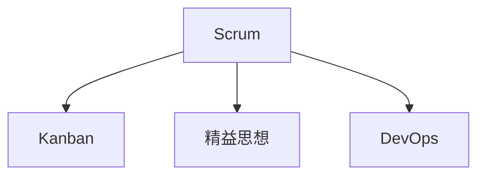

                 

# 敏捷管理：适应快速变化的组织策略

敏捷管理（Agile Management）是一种灵活且响应速度快的项目管理方法，特别适用于快速变化的环境。该方法强调团队协作、客户反馈、迭代开发和持续改进，以应对市场需求和竞争环境的快速变化。本文将深入探讨敏捷管理的核心概念、算法原理、操作步骤和实际应用，并通过具体的项目实践、数学模型和未来展望，提供一套完整的敏捷管理实施策略。

## 1. 背景介绍

### 1.1 问题由来

在当今数字化和全球化的浪潮下，企业面临的市场环境日益复杂多变。客户需求快速变化，新技术不断涌现，传统项目管理方法难以适应这种快速变化的需求。敏捷管理应运而生，成为企业应对这一挑战的重要工具。

敏捷管理最初由软件行业引入，用于应对快速变化的软件需求和市场竞争。其核心理念是“快速响应变化、持续交付价值”，将传统瀑布式的项目管理模式转变为迭代开发和持续交付，从而实现更高的灵活性和效率。

### 1.2 问题核心关键点

敏捷管理的关键在于其响应变化的能力和持续交付的价值。敏捷管理强调以下几个核心点：

1. **客户参与**：敏捷管理的核心是客户参与，强调项目开发过程中客户的持续反馈和参与，确保项目始终满足客户需求。
2. **迭代开发**：敏捷管理采用迭代开发的方式，每次迭代完成一个可交付的增量，确保项目始终处于可控状态。
3. **持续改进**：敏捷管理鼓励持续改进，通过回顾会议和持续反馈机制，不断优化项目过程和团队协作方式。
4. **团队协作**：敏捷管理强调团队协作和自组织，通过跨职能团队的紧密合作，实现高效的项目执行和问题解决。

### 1.3 问题研究意义

敏捷管理在企业中的应用具有重要意义：

1. **提高项目成功率**：敏捷管理通过快速响应变化和持续交付价值，有效降低项目失败的风险，提高项目成功率。
2. **提升客户满意度**：客户参与和持续反馈机制使得项目始终符合客户需求，提升客户满意度。
3. **增强团队协作**：敏捷管理通过跨职能团队和持续改进，增强团队的协作效率和问题解决能力。
4. **快速响应市场变化**：敏捷管理通过迭代开发和持续改进，快速适应市场变化和新技术，保持企业的竞争优势。

## 2. 核心概念与联系

### 2.1 核心概念概述

敏捷管理的核心概念包括：

1. **Scrum**：敏捷管理中最广泛使用的框架之一，通过迭代周期（Sprint）、产品待办项（Product Backlog）和每日站会（Daily Stand-up）等方式，实现敏捷开发。
2. **Kanban**：另一种敏捷管理框架，通过看板（Kanban Board）和流程管理，实现可视化和流程优化。
3. **精益思想**：敏捷管理的核心理念之一，通过精益生产的方式，消除浪费，提升效率和价值。
4. **DevOps**：敏捷管理与持续集成和持续部署（CI/CD）的结合，实现软件交付的高效和自动化。

这些核心概念通过以下Mermaid流程图展现其联系：



### 2.2 核心概念原理和架构

敏捷管理的核心原理和架构可以通过以下几个方面进行理解：

1. **周期迭代**：敏捷管理采用迭代周期（Sprint）的方式，每次迭代完成一个可交付的增量。通常每个Sprint为2-4周。
2. **产品待办项**：每个Sprint开始时，定义一个产品待办项列表（Product Backlog），列出所有需要完成的任务。优先级最高的任务优先完成。
3. **每日站会**：每个Sprint中，每天进行一次每日站会（Daily Stand-up），团队成员汇报当前任务进度和遇到的问题，确保团队协作顺畅。
4. **回顾会议**：每个Sprint结束时，进行回顾会议（Retrospective），团队成员总结Sprint中的经验和教训，持续改进项目过程。
5. **持续集成和持续部署**：通过CI/CD工具，实现代码的持续集成和持续部署，提升软件交付的速度和质量。

## 3. 核心算法原理 & 具体操作步骤

### 3.1 算法原理概述

敏捷管理的关键在于其周期迭代和持续改进的机制。每次迭代结束时，通过回顾会议和持续反馈，不断优化项目过程和团队协作方式，确保项目始终符合客户需求。

敏捷管理的数学模型可以表示为：

$$
\text{敏捷管理} = \text{迭代周期} + \text{产品待办项} + \text{每日站会} + \text{回顾会议} + \text{持续集成和持续部署}
$$

其中，迭代周期、产品待办项、每日站会、回顾会议和持续集成和持续部署是敏捷管理的关键组成部分。

### 3.2 算法步骤详解

敏捷管理的实施步骤包括以下几个关键环节：

**Step 1: 项目规划和需求收集**

- 定义项目目标和范围，明确客户需求和业务目标。
- 收集和整理客户需求，定义产品待办项列表。

**Step 2: 团队组建和角色定义**

- 组建跨职能团队，包括产品经理、开发人员、测试人员等。
- 定义团队角色和职责，确保团队协作顺畅。

**Step 3: 制定迭代计划**

- 根据客户需求和业务目标，制定每个迭代周期（Sprint）的任务计划。
- 确定每个Sprint的目标和任务优先级。

**Step 4: 迭代开发和持续交付**

- 进行每日站会，确保团队成员保持同步。
- 实现每个Sprint的目标，交付可用的增量。

**Step 5: 回顾会议和持续改进**

- 每个Sprint结束后，进行回顾会议，总结经验教训，持续改进项目过程。
- 根据反馈调整产品待办项列表和迭代计划。

**Step 6: 持续集成和持续部署**

- 实现持续集成和持续部署，确保软件交付的高效和质量。

### 3.3 算法优缺点

敏捷管理具有以下优点：

1. **快速响应变化**：敏捷管理通过周期迭代和持续改进，快速适应市场需求和变化，保持竞争优势。
2. **提高团队协作**：敏捷管理强调跨职能团队的紧密合作，提高团队协作效率和问题解决能力。
3. **持续交付价值**：敏捷管理通过每次迭代交付可用的增量，确保项目始终处于可控状态，持续交付价值。
4. **增强客户满意度**：敏捷管理通过客户参与和持续反馈，确保项目始终符合客户需求，提升客户满意度。

同时，敏捷管理也存在一些局限性：

1. **复杂性较高**：敏捷管理需要团队具备高度的协作和自组织能力，对于缺乏经验的团队来说，实施难度较大。
2. **资源需求高**：敏捷管理需要投入较多的人力和时间资源，特别是对于大规模项目，资源需求较高。
3. **过程不严格**：敏捷管理注重灵活性和响应变化，但对过程的控制和规范性相对较弱。

### 3.4 算法应用领域

敏捷管理主要应用于软件开发和IT项目，但也可以应用于其他领域，如制造业、医疗、金融等。具体应用领域包括：

1. **软件开发**：敏捷管理在软件开发中的应用最为广泛，通过迭代开发和持续集成，实现高效的软件交付。
2. **项目管理**：敏捷管理通过周期迭代和持续改进，实现项目的灵活管理和高效率执行。
3. **业务流程优化**：敏捷管理通过精益思想和持续改进，优化业务流程，提升企业运营效率。
4. **产品开发**：敏捷管理通过客户参与和持续反馈，确保产品开发始终符合市场需求，提升产品竞争力。

## 4. 数学模型和公式 & 详细讲解 & 举例说明

### 4.1 数学模型构建

敏捷管理的数学模型可以通过以下公式进行构建：

$$
\text{敏捷管理} = \text{迭代周期} + \text{产品待办项} + \text{每日站会} + \text{回顾会议} + \text{持续集成和持续部署}
$$

其中，迭代周期（Sprint）、产品待办项（Product Backlog）、每日站会（Daily Stand-up）、回顾会议（Retrospective）和持续集成和持续部署（CI/CD）是敏捷管理的核心组成部分。

### 4.2 公式推导过程

敏捷管理的公式推导过程如下：

1. **迭代周期（Sprint）**：敏捷管理采用迭代周期（Sprint）的方式，每次迭代完成一个可交付的增量。每个Sprint的时间通常为2-4周。

2. **产品待办项（Product Backlog）**：在每个Sprint开始时，定义一个产品待办项列表（Product Backlog），列出所有需要完成的任务。优先级最高的任务优先完成。

3. **每日站会（Daily Stand-up）**：在每个Sprint中，每天进行一次每日站会（Daily Stand-up），团队成员汇报当前任务进度和遇到的问题，确保团队协作顺畅。

4. **回顾会议（Retrospective）**：每个Sprint结束后，进行回顾会议（Retrospective），团队成员总结Sprint中的经验和教训，持续改进项目过程。

5. **持续集成和持续部署（CI/CD）**：通过CI/CD工具，实现代码的持续集成和持续部署，提升软件交付的速度和质量。

### 4.3 案例分析与讲解

以下是一个具体的敏捷管理实施案例：

**项目背景**：某互联网公司需要开发一个新的电子商务平台，要求在6个月内上线。

**项目规划**：项目团队召开项目启动会，明确项目目标和范围。收集和整理客户需求，定义产品待办项列表。

**团队组建**：组建跨职能团队，包括产品经理、开发人员、测试人员和运维人员。

**迭代计划**：制定每个迭代周期（Sprint）的任务计划，确定每个Sprint的目标和任务优先级。

**迭代开发**：进行每日站会，确保团队成员保持同步。实现每个Sprint的目标，交付可用的增量。

**回顾会议**：每个Sprint结束后，进行回顾会议，总结经验教训，持续改进项目过程。

**持续集成和持续部署**：实现持续集成和持续部署，确保软件交付的高效和质量。

通过敏捷管理的实施，该项目在6个月内顺利上线，客户反馈良好，满足了客户需求。

## 5. 项目实践：代码实例和详细解释说明

### 5.1 开发环境搭建

在进行敏捷管理实践前，我们需要准备好开发环境。以下是使用JIRA进行敏捷管理实践的环境配置流程：

1. 安装JIRA：从官网下载并安装JIRA，用于敏捷管理的项目管理。

2. 创建并激活项目：
```bash
jira-server start
```

3. 创建敏捷管理板：
```bash
jira-server create-agile-boards
```

4. 配置敏捷管理流程：
```bash
jira-server create-agile-boards
```

完成上述步骤后，即可在JIRA中进行敏捷管理的实践。

### 5.2 源代码详细实现

下面我们以敏捷管理中的每日站会为例，给出JIRA中的每日站会（Daily Stand-up）配置实现。

首先，配置每日站会（Daily Stand-up）的字段：

1. **描述**：简要描述当前任务进度和遇到的问题。
2. **责任人**：当前任务的责任人。
3. **当前任务**：当前正在处理的任务。
4. **计划任务**：下一个迭代周期需要处理的任务。

```python
from jira import JIRA

# 初始化JIRA连接
jira = JIRA('https://jira.example.com', 'username', 'password')

# 获取项目ID
project_id = 'PROJECT-1'

# 获取每日站会（Daily Stand-up）的ID
daily_standup_id = '10001'

# 定义每日站会的字段
jira.add_field(project_id, daily_standup_id, 'Description')
jira.add_field(project_id, daily_standup_id, 'Responsible Person')
jira.add_field(project_id, daily_standup_id, 'Current Task')
jira.add_field(project_id, daily_standup_id, 'Planned Task')
```

然后，每天通过JIRA的每日站会（Daily Stand-up）功能进行汇报：

```python
# 获取项目ID
project_id = 'PROJECT-1'

# 获取每日站会（Daily Stand-up）的ID
daily_standup_id = '10001'

# 每日站会汇报内容
description = '完成昨天任务，开始处理今天的任务'
responsible_person = 'Alice'
current_task = '任务A'
planned_task = '任务B'

# 更新每日站会（Daily Stand-up）
jira.update_issue(project_id, daily_standup_id, {'fields': {'Description': description, 'Responsible Person': responsible_person, 'Current Task': current_task, 'Planned Task': planned_task}})
```

### 5.3 代码解读与分析

让我们再详细解读一下关键代码的实现细节：

**每日站会配置**：
- `jira.add_field`方法：用于向JIRA项目中添加自定义字段。
- `project_id`：项目ID，用于标识项目。
- `daily_standup_id`：每日站会的ID，用于标识具体的每日站会。

**每日站会汇报**：
- `jira.update_issue`方法：用于更新JIRA项目中的问题（Issue）信息。
- `description`：当前任务进度和遇到的问题。
- `responsible_person`：当前任务的责任人。
- `current_task`：当前正在处理的任务。
- `planned_task`：下一个迭代周期需要处理的任务。

**每日站会汇报**：
- 通过每日站会（Daily Stand-up）功能，团队成员可以实时汇报当前任务进度和遇到的问题，确保团队协作顺畅。

## 6. 实际应用场景

### 6.1 软件开发

敏捷管理在软件开发中的应用最为广泛。软件开发团队通过敏捷管理，采用迭代开发和持续集成，实现高效的软件交付。

**场景**：某互联网公司需要开发一个新的电商平台。

**敏捷管理实施**：
1. **项目规划和需求收集**：定义项目目标和范围，明确客户需求和业务目标。
2. **团队组建和角色定义**：组建跨职能团队，包括产品经理、开发人员、测试人员等。
3. **制定迭代计划**：制定每个迭代周期（Sprint）的任务计划，确定每个Sprint的目标和任务优先级。
4. **迭代开发和持续交付**：进行每日站会，确保团队成员保持同步。实现每个Sprint的目标，交付可用的增量。
5. **回顾会议和持续改进**：每个Sprint结束后，进行回顾会议，总结经验教训，持续改进项目过程。

通过敏捷管理的实施，该项目在6个月内顺利上线，客户反馈良好，满足了客户需求。

### 6.2 项目管理和业务流程优化

敏捷管理在项目管理和业务流程优化中的应用也非常广泛。通过敏捷管理，企业可以实现项目的灵活管理和高效率执行，优化业务流程，提升企业运营效率。

**场景**：某制造企业需要优化其生产流程。

**敏捷管理实施**：
1. **项目规划和需求收集**：定义项目目标和范围，明确客户需求和业务目标。
2. **团队组建和角色定义**：组建跨职能团队，包括项目经理、流程优化师、IT支持人员等。
3. **制定迭代计划**：制定每个迭代周期（Sprint）的任务计划，确定每个Sprint的目标和任务优先级。
4. **迭代开发和持续交付**：进行每日站会，确保团队成员保持同步。实现每个Sprint的目标，交付可用的增量。
5. **回顾会议和持续改进**：每个Sprint结束后，进行回顾会议，总结经验教训，持续改进项目过程。

通过敏捷管理的实施，该企业优化了生产流程，提升了生产效率和产品质量。

## 7. 工具和资源推荐

### 7.1 学习资源推荐

为了帮助开发者系统掌握敏捷管理的理论基础和实践技巧，这里推荐一些优质的学习资源：

1. 《敏捷软件开发：原则、模式与实践》书籍：由Robert C. Martin撰写，介绍了敏捷软件开发的原则、模式和实践，是敏捷管理的经典之作。
2. Scrum Master认证课程：由Scrum Alliance等机构提供的Scrum Master认证课程，帮助学习者掌握Scrum框架和敏捷管理的核心知识。
3. JIRA官方文档：JIRA的官方文档提供了丰富的敏捷管理实践案例和操作指南，是敏捷管理实践的重要参考资料。
4. Lean Management书籍：由Mary Popinskas和Tom Popinskas撰写，介绍了精益管理和敏捷管理的基本概念和实践方法。
5. Agile Manifesto：敏捷管理宣言，是敏捷管理理念的基石，深刻揭示了敏捷管理的核心理念和方法论。

通过对这些资源的学习实践，相信你一定能够快速掌握敏捷管理的精髓，并用于解决实际的NLP问题。

### 7.2 开发工具推荐

高效的开发离不开优秀的工具支持。以下是几款用于敏捷管理开发的常用工具：

1. JIRA：项目管理工具，提供了敏捷管理的详细支持和丰富的定制化功能，适合大型企业使用。
2. Trello：看板工具，简单易用，适合小型团队或项目使用。
3. Asana：任务管理工具，支持敏捷管理和项目协作，适合中大型企业使用。
4. Slack：即时通讯工具，支持团队协作和沟通，适合敏捷管理的日常工作。
5. GitHub：代码管理工具，支持敏捷项目的持续集成和持续部署（CI/CD），适合软件开发项目使用。

合理利用这些工具，可以显著提升敏捷管理的开发效率，加快创新迭代的步伐。

### 7.3 相关论文推荐

敏捷管理在企业中的应用源于学界的持续研究。以下是几篇奠基性的相关论文，推荐阅读：

1. "The Agile Manifesto"：敏捷管理宣言，由Kent Beck等人提出，是敏捷管理的核心理念和原则。
2. "Scrum: The Art of Doing Twice the Work in Half the Time"：Ken Schwaber和Mike Beedle撰写的Scrum框架介绍，是敏捷管理的经典之作。
3. "Lean Management"：Mary Popinskas和Tom Popinskas撰写的精益管理书籍，介绍了精益管理和敏捷管理的核心概念和实践方法。
4. "Continuous Delivery: Reliable Software Releases through Build, Test, and Deployment Automation"：Jez Humble和David Farley撰写的持续交付实践指南，介绍了持续交付的核心理念和实践方法。
5. "Agile Requirements Engineering: The Planning and Evolution of Systems"：Bert Som and Karin Meijer撰写的敏捷需求工程书籍，介绍了敏捷项目管理中的需求分析和设计方法。

这些论文代表了大语言模型微调技术的发展脉络。通过学习这些前沿成果，可以帮助研究者把握学科前进方向，激发更多的创新灵感。

## 8. 总结：未来发展趋势与挑战

### 8.1 总结

本文对敏捷管理的核心概念、算法原理、操作步骤和实际应用进行了全面系统的介绍。首先阐述了敏捷管理的背景和意义，明确了敏捷管理的核心思想和实施步骤。其次，从原理到实践，详细讲解了敏捷管理的数学模型和关键步骤，给出了敏捷管理实践的完整代码实例。同时，本文还广泛探讨了敏捷管理在软件开发、项目管理和业务流程优化等多个领域的应用前景，展示了敏捷管理范式的巨大潜力。

通过本文的系统梳理，可以看到，敏捷管理在企业中的应用日益广泛，其灵活性和高效性得到了广泛认可。未来，伴随敏捷管理的不断演进，敏捷技术必将引领项目管理方法的变革，为企业的数字化转型升级提供新的动力。

### 8.2 未来发展趋势

展望未来，敏捷管理将呈现以下几个发展趋势：

1. **工具自动化**：敏捷管理工具将更加自动化，减少手动操作，提高效率。
2. **数据驱动**：通过数据驱动的方式，优化敏捷管理的流程和决策，提升敏捷管理的科学性。
3. **跨职能协作**：敏捷管理将更加注重跨职能团队的协作，提高团队的协同效率和问题解决能力。
4. **持续改进**：敏捷管理将更加注重持续改进，通过持续反馈和持续优化，不断提升项目管理和运营效率。

### 8.3 面临的挑战

尽管敏捷管理已经取得了显著成效，但在迈向更加智能化、普适化应用的过程中，它仍面临着诸多挑战：

1. **复杂性较高**：敏捷管理需要团队具备高度的协作和自组织能力，对于缺乏经验的团队来说，实施难度较大。
2. **资源需求高**：敏捷管理需要投入较多的人力和时间资源，特别是对于大规模项目，资源需求较高。
3. **过程不严格**：敏捷管理注重灵活性和响应变化，但对过程的控制和规范性相对较弱。

### 8.4 研究展望

面对敏捷管理面临的挑战，未来的研究需要在以下几个方面寻求新的突破：

1. **工具和技术的创新**：开发更多自动化、智能化的敏捷管理工具，降低实施难度，提高效率。
2. **数据驱动和科学方法**：通过数据驱动的方式，优化敏捷管理的流程和决策，提升敏捷管理的科学性。
3. **跨职能协作和团队建设**：加强跨职能团队的协作，提升团队的协同效率和问题解决能力。
4. **持续改进和优化**：通过持续反馈和持续优化，不断提升敏捷管理的效率和效果。

这些研究方向将推动敏捷管理技术迈向更高的台阶，为构建高效、灵活、智能化的项目管理体系提供有力支持。

## 9. 附录：常见问题与解答

**Q1：敏捷管理是否适用于所有项目？**

A: 敏捷管理适用于灵活变化和快速响应的项目，特别是软件开发、IT项目和业务流程优化等领域。但对于固定不变、需求明确的项目，敏捷管理可能不是最佳选择。

**Q2：敏捷管理中的Sprint周期应如何选择？**

A: Sprint周期的选择应根据项目的特点和团队的经验水平。一般来说，Sprint周期为2-4周较为常见，具体应根据项目实际情况进行调整。

**Q3：敏捷管理中的每日站会（Daily Stand-up）应如何进行？**

A: 每日站会应简短高效，每个成员应汇报当前任务进度、遇到的问题和下一步计划。每日站会应每天早上进行，确保团队成员保持同步。

**Q4：敏捷管理中的回顾会议（Retrospective）应如何进行？**

A: 回顾会议应总结Sprint中的经验和教训，识别改进点，持续优化项目管理过程。回顾会议应每Sprint结束后进行，团队成员应积极参与。

**Q5：敏捷管理中的持续集成和持续部署（CI/CD）应如何进行？**

A: 持续集成和持续部署应通过CI/CD工具实现，确保软件交付的高效和质量。CI/CD工具应自动化测试、构建和部署，减少人工操作。

---

作者：禅与计算机程序设计艺术 / Zen and the Art of Computer Programming

