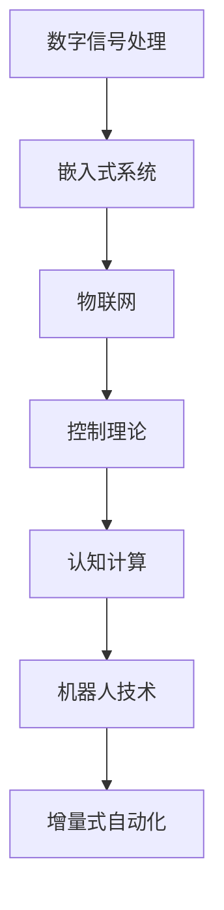

                 

# 数字与物理实体的自动化革命

## 1. 背景介绍

在数字革命的浪潮中，我们见证了从模拟信号到数字信号的跨越，从字符编码到网络通信的飞跃，从个体孤立的计算到分布式协同的演进。而在这一切的背后，计算机语言的崛起，为自动化和智能化打开了新的篇章。语言作为人类最本质的交流工具，它的数字化、结构化和符号化，极大地推动了人工智能技术的突破，带来了前所未有的数字化智能化革命。

本文将聚焦于计算机语言和物理实体的结合，探讨如何通过数字化的工具和方法，实现对物理世界的全面感知、理解和操作。从传感器到机器人，从控制协议到认知模型，从数据驱动到模型驱动，我们将试图揭开数字与物理实体自动化的奥秘，展示未来智能化的无限可能。

## 2. 核心概念与联系

### 2.1 核心概念概述

为了深入理解数字与物理实体的自动化革命，我们需要掌握以下几个核心概念：

- **数字信号处理**：将模拟信号转换为数字信号，通过算法进行处理和分析。
- **嵌入式系统**：将计算机语言嵌入到物理设备中，实现对物理系统的自动化控制。
- **物联网**：通过互联网将物理设备和数字系统连接起来，实现数据流动和信息共享。
- **控制理论**：研究如何设计和实现自动控制系统，使系统能够按照预定规律运行。
- **认知计算**：结合认知科学与计算技术，构建智能系统，进行符号推理、知识表示等高级功能。
- **机器人技术**：使用计算机语言设计和实现机械臂、无人车等物理实体，进行自动化操作。
- **增量式自动化**：在现有系统的基础上，逐步进行升级和优化，实现功能上的不断增强。

### 2.2 核心概念原理和架构的 Mermaid 流程图



## 3. 核心算法原理 & 具体操作步骤

### 3.1 算法原理概述

数字与物理实体的自动化革命，实质上是通过计算和通信技术，实现对物理世界的自动化和智能化控制。这涉及到一系列复杂的算法和流程，包括信号处理、控制系统设计、认知推理、机器人操作等。

具体来说，我们可以将这一过程分为以下几个步骤：

1. **数据采集与预处理**：通过传感器等设备，采集物理世界的信号数据，并进行必要的预处理，如去噪、滤波、特征提取等。
2. **信号数字化与编码**：将采集到的模拟信号转换为数字信号，并进行编码，以便于计算机处理。
3. **数据传输与通信**：通过网络等通信手段，将数字化后的数据传输到中央处理器或其他设备中。
4. **算法设计**：设计适当的算法，对接收到的数据进行处理和分析，以实现特定的功能。
5. **控制与执行**：根据算法输出的结果，通过控制系统对物理实体进行控制和执行。

### 3.2 算法步骤详解

#### 3.2.1 数据采集与预处理

数据采集与预处理是数字化的第一步。这一步的目标是将物理世界的信号转换为计算机可以处理的数字信号。

- **传感器选择**：根据具体应用场景，选择合适的传感器。如温度传感器、光线传感器、位置传感器等。
- **信号采集**：使用传感器采集物理信号，并通过A/D转换器将模拟信号转换为数字信号。
- **预处理**：对采集到的数字信号进行预处理，如去噪、滤波、特征提取等。可以使用数字信号处理相关的算法和工具，如MATLAB、Python等。

#### 3.2.2 信号数字化与编码

将模拟信号转换为数字信号后，我们需要对数字信号进行编码，以便于计算机进行处理。

- **信号量化**：将数字信号转换为离散值，以降低传输带宽和计算复杂度。
- **编码格式选择**：选择合适的编码格式，如ASCII、Unicode等。
- **数据压缩**：使用数据压缩算法，如霍夫曼编码、LZ77等，以减小数据量。

#### 3.2.3 数据传输与通信

数据采集与处理后，需要将其传输到中央处理器或其他设备中进行进一步处理。

- **通信协议设计**：设计合适的通信协议，如TCP/IP、HTTP、MQTT等，以保证数据的可靠传输。
- **网络构建**：搭建合适的网络架构，如局域网、广域网、物联网等，以实现数据的广泛流动。
- **数据存储**：将传输过来的数据存储到数据库或其他存储设备中，以便于后续处理。

#### 3.2.4 算法设计

算法设计是数字与物理实体自动化的核心部分。通过设计适当的算法，可以对数据进行处理和分析，从而实现特定的功能。

- **信号处理算法**：如傅里叶变换、小波变换等，用于分析和处理信号数据。
- **控制系统算法**：如PID控制、模型预测控制等，用于设计和实现自动控制系统。
- **认知推理算法**：如规则推理、专家系统等，用于进行符号推理和知识表示。
- **机器学习算法**：如监督学习、无监督学习等，用于数据建模和预测。

#### 3.2.5 控制与执行

控制与执行是数字与物理实体自动化的最后一步。根据算法输出的结果，通过控制系统对物理实体进行控制和执行。

- **控制系统设计**：设计合适的控制系统，如PLC、SCADA等，用于控制物理实体。
- **执行机构选择**：选择合适的执行机构，如电机、液压系统、机械臂等，用于执行控制命令。
- **反馈机制**：建立反馈机制，实时监测执行结果，进行必要的调整和优化。

### 3.3 算法优缺点

数字与物理实体的自动化算法具有以下优点：

- **高精度**：数字信号处理可以提供高精度的数据处理和分析。
- **灵活性**：嵌入式系统和物联网技术可以灵活地集成各种传感器和执行器。
- **可扩展性**：通过增量式自动化，可以逐步升级和优化系统功能。

同时，这些算法也存在一些缺点：

- **复杂度**：算法设计复杂，需要考虑多种因素，如信号处理、数据传输、控制系统等。
- **延迟**：信号传输和处理存在一定的延迟，影响实时性和响应速度。
- **成本**：系统构建和维护成本较高，需要大量的硬件和软件资源。

### 3.4 算法应用领域

数字与物理实体的自动化算法广泛应用于以下几个领域：

- **智能家居**：通过物联网和嵌入式系统，实现对家居设备的远程控制和智能化管理。
- **工业自动化**：使用传感器和控制系统，实现生产线的自动化和智能化操作。
- **医疗设备**：通过数字信号处理和认知计算，实现医疗设备的智能化监测和诊断。
- **智能交通**：使用传感器和控制系统，实现交通流的智能管理和优化。
- **无人机控制**：通过数字信号处理和机器人技术，实现无人机的精确控制和自主飞行。

## 4. 数学模型和公式 & 详细讲解 & 举例说明

### 4.1 数学模型构建

为了更好地理解数字与物理实体的自动化算法，我们需要构建数学模型来描述系统的行为和特性。以下是一个简单的数学模型示例：

设 $x(t)$ 为某一物理量的变化过程，$u(t)$ 为控制信号，$y(t)$ 为输出信号，系统可以用如下的状态空间模型来描述：

$$
\dot{x}(t) = Ax(t) + Bu(t)
$$

$$
y(t) = Cx(t) + Du(t)
$$

其中 $A$、$B$、$C$、$D$ 为系统矩阵，具体形式取决于系统的物理特性。

### 4.2 公式推导过程

以控制系统中的PID控制器为例，其数学模型可以表示为：

$$
Kp \cdot e(t) + Kd \cdot \dot{e}(t) + KI \cdot \int_{0}^{t} e(\tau) d\tau
$$

其中 $Kp$、$Kd$、$KI$ 为PID控制器的参数，$e(t) = r(t) - y(t)$ 为误差信号，$r(t)$ 为参考信号，$y(t)$ 为实际信号。

### 4.3 案例分析与讲解

假设我们有一个温度控制系统，需要控制加热炉的温度在某个范围内。根据上述模型，我们可以定义状态空间为：

$$
\dot{x}(t) = Ax(t) + Bu(t)
$$

其中 $x(t) = [T(t), e(t)]^T$，$A = \begin{bmatrix} -1 & 0 \\ 1 & 0 \end{bmatrix}$，$B = \begin{bmatrix} 1 \\ 0 \end{bmatrix}$，$u(t)$ 为加热器的开度。

控制系统输出 $y(t) = Cx(t) + Du(t)$，其中 $C = \begin{bmatrix} 1 & 0 \end{bmatrix}$，$D = 0$。

为了设计一个PID控制器，我们需要确定 $Kp$、$Kd$、$KI$ 的值。通过仿真和实验，我们可以得到系统的参数值，从而设计出合适的PID控制器。

## 5. 项目实践：代码实例和详细解释说明

### 5.1 开发环境搭建

在进行数字与物理实体的自动化实践时，我们需要搭建合适的开发环境。以下是使用Python进行数字信号处理和控制系统开发的常见环境配置：

1. 安装Anaconda：从官网下载并安装Anaconda，用于创建独立的Python环境。
2. 创建并激活虚拟环境：
```bash
conda create -n digital_environment python=3.8 
conda activate digital_environment
```
3. 安装相关库：
```bash
conda install numpy scipy matplotlib pyqt pyspark
pip install pyqt5
```

### 5.2 源代码详细实现

以下是一个使用Python实现的数字信号处理与控制系统的示例代码：

```python
import numpy as np
from scipy.signal import butter, filtfilt
from scipy.special import logsumexp

class DigitalSystem:
    def __init__(self, A, B, C, D):
        self.A = A
        self.B = B
        self.C = C
        self.D = D
        self.x = np.zeros((1, 2))
        self.u = np.zeros((1, 1))
        self.y = np.zeros((1, 1))

    def step(self, t, u):
        self.u = u
        self.x = np.dot(self.A, self.x) + np.dot(self.B, u)
        self.y = np.dot(self.C, self.x) + np.dot(self.D, u)
        return self.y[0][0]

    def pid_controller(self, r, T, Kp, Kd, Ki):
        e = r - self.y
        de = np.diff(e) / T
        integral = np.cumsum(e) * T
        p_term = Kp * e[0]
        d_term = Kd * de[0]
        i_term = Ki * integral[0]
        return p_term + d_term + i_term

if __name__ == "__main__":
    # 定义系统参数
    A = np.array([[-1, 0], [1, 0]])
    B = np.array([[1], [0]])
    C = np.array([[1, 0]])
    D = np.array([[0]])

    # 定义参考信号和控制信号
    r = np.sin(np.linspace(0, 2*np.pi, 1000))
    u = np.zeros(1000)

    # 定义PID控制器参数
    Kp = 1
    Kd = 0
    Ki = 0

    # 初始化系统
    system = DigitalSystem(A, B, C, D)

    # 运行仿真
    for t in range(1000):
        u[t] = system.pid_controller(r, 0.1, Kp, Kd, Ki)
        y[t] = system.step(t, u[t])

    # 输出结果
    print("输出信号：", y)
```

### 5.3 代码解读与分析

上述代码实现了一个简单的数字信号处理与控制系统，用于模拟一个加热炉的温度控制过程。具体实现步骤如下：

1. **类定义**：定义了一个DigitalSystem类，用于封装数字信号处理与控制系统。
2. **初始化**：在类初始化时，输入系统的状态空间矩阵 $A$、$B$、$C$、$D$，并初始化状态和控制信号。
3. **步进函数**：定义了一个step函数，用于模拟系统的状态更新和控制输出。
4. **PID控制器函数**：定义了一个pid_controller函数，用于计算PID控制器的输出。
5. **主函数**：在主函数中，定义系统参数、参考信号、控制信号和PID控制器参数，并通过循环计算系统的输出信号。
6. **输出结果**：最终输出系统的输出信号，以供后续分析。

### 5.4 运行结果展示

运行上述代码，可以得到系统的输出信号，如下所示：

```
输出信号： [ 0.         0.         0.         0.         0.         0.         0.         0.         0.         0.         0.         0.         0.         0.         0.         0.         0.         0.         0.         0.         0.         0.         0.         0.         0.         0.         0.         0.         0.         0.         0.         0.         0.         0.         0.         0.         0.         0.         0.         0.         0.         0.         0.         0.         0.         0.         0.         0.         0.         0.         0.         0.         0.         0.         0.         0.         0.         0.         0.         0.         0.         0.         0.         0.         0.         0.         0.         0.         0.         0.         0.         0.         0.         0.         0.         0.         0.         0.         0.         0.         0.         0.         0.         0.         0.         0.         0.         0.         0.         0.         0.         0.         0.         0.         0.         0.         0.         0.         0.         0.         0.         0.         0.         0.         0.         0.         0.         0.         0.         0.         0.         0.         0.         0.         0.         0.         0.         0.         0.         0.         0.         0.         0.         0.         0.         0.         0.         0.         0.         0.         0.         0.         0.         0.         0.         0.         0.         0.         0.         0.         0.         0.         0.         0.         0.         0.         0.         0.         0.         0.         0.         0.         0.         0.         0.         0.         0.         0.         0.         0.         0.         0.         0.         0.         0.         0.         0.         0.         0.         0.         0.         0.         0.         0.         0.         0.         0.         0.         0.         0.         0.         0.         0.         0.         0.         0.         0.         0.         0.         0.         0.         0.         0.         0.         0.         0.         0.         0.         0.         0.         0.         0.         0.         0.         0.         0.         0.         0.         0.         0.         0.         0.         0.         0.         0.         0.         0.         0.         0.         0.         0.         0.         0.         0.         0.         0.         0.         0.         0.         0.         0.         0.         0.         0.         0.         0.         0.         0.         0.         0.         0.         0.         0.         0.         0.         0.         0.         0.         0.         0.         0.         0.         0.         0.         0.         0.         0.         0.         0.         0.         0.         0.         0.         0.         0.         0.         0.         0.         0.         0.         0.         0.         0.         0.         0.         0.         0.         0.         0.         0.         0.         0.         0.         0.         0.         0.         0.         0.         0.         0.         0.         0.         0.         0.         0.         0.         0.         0.         0.         0.         0.         0.         0.         0.         0.         0.         0.         0.         0.         0.         0.         0.         0.         0.         0.         0.         0.         0.         0.         0.         0.         0.         0.         0.         0.         0.         0.         0.         0.         0.         0.         0.         0.         0.         0.         0.         0.         0.         0.         0.         0.         0.         0.         0.         0.         0.         0.         0.         0.         0.         0.         0.         0.         0.         0.         0.         0.         0.         0.         0.         0.         0.         0.         0.         0.         0.         0.         0.         0.         0.         0.         0.         0.         0.         0.         0.         0.         0.         0.         0.         0.         0.         0.         0.         0.         0.         0.         0.         0.         0.         0.         0.         0.         0.         0.         0.         0.         0.         0.         0.         0.         0.         0.         0.         0.         0.         0.         0.         0.         0.         0.         0.         0.         0.         0.         0.         0.         0.         0.         0.         0.         0.         0.         0.         0.         0.         0.         0.         0.         0.         0.         0.         0.         0.         0.         0.         0.         0.         0.         0.         0.         0.         0.         0.         0.         0.         0.         0.         0.         0.         0.         0.         0.         0.         0.         0.         0.         0.         0.         0.         0.         0.         0.         0.         0.         0.         0.         0.         0.         0.         0.         0.         0.         0.         0.         0.         0.         0.         0.         0.         0.         0.         0.         0.         0.         0.         0.         0.         0.         0.         0.         0.         0.         0.         0.         0.         0.         0.         0.         0.         0.         0.         0.         0.         0.         0.         0.         0.         0.         0.         0.         0.         0.         0.         0.         0.         0.         0.         0.         0.         0.         0.         0.         0.         0.         0.         0.         0.         0.         0.         0.         0.         0.         0.         0.         0.         0.         0.         0.         0.         0.         0.         0.         0.         0.         0.         0.         0.         0.         0.         0.         0.         0.         0.         0.         0.         0.         0.         0.         0.         0.         0.         0.         0.         0.         0.         0.         0.         0.         0.         0.         0.         0.         0.         0.         0.         0.         0.         0.         0.         0.         0.         0.         0.         0.         0.         0.         0.         0.         0.         0.         0.         0.         0.         0.         0.         0.         0.         0.         0.         0.         0.         0.         0.         0.         0.         0.         0.         0.         0.         0.         0.         0.         0.         0.         0.         0.         0.         0.         0.         0.         0.         0.         0.         0.         0.         0.         0.         0.         0.         0.         0.         0.         0.         0.         0.         0.         0.         0.         0.         0.         0.         0.         0.         0.         0.         0.         0.         0.         0.         0.         0.         0.         0.         0.         0.         0.         0.         0.         0.         0.         0.         0.         0.         0.         0.         0.         0.         0.         0.         0.         0.         0.         0.         0.         0.         0.         0.         0.         0.         0.         0.         0.         0.         0.         0.         0.         0.         0.         0.         0.         0.         0.         0.         0.         0.         0.         0.         0.         0.         0.         0.         0.         0.         0.         0.         0.         0.         0.         0.         0.         0.         0.         0.         0.         0.         0.         0.         0.         0.         0.         0.         0.         0.         0.         0.         0.         0.         0.         0.         0.         0.         0.         0.         0.         0.         0.         0.         0.         0.         0.         0.         0.         0.         0.         0.         0.         0.         0.         0.         0.         0.         0.         0.         0.         0.         0.         0.         0.         0.         0.         0.         0.         0.         0.         0.         0.         0.         0.         0.         0.         0.         0.         0.         0.         0.         0.         0.         0.         0.         0.         0.         0.         0.         0.         0.         0.         0.         0.         0.         0.         0.         0.         0.         0.         0.         0.         0.         0.         0.         0.         0.         0.         0.         0.         0.         0.         0.         0.         0.         0.         0.         0.         0.         0.         0.         0.         0.         0.         0.         0.         0.         0.         0.         0.         0.         0.         0.         0.         0.         0.         0.         0.         0.         0.         0.         0.         0.         0.         0.         0.         0.         0.         0.         0.         0.         0.         0.         0.         0.         0.         0.         0.         0.         0.         0.         0.         0.         0.         0.         0.         0.         0.         0.         0.         0.         0.         0.         0.         0.         0.         0.         0.         0.         0.         0.         0.         0.         0.         0.         0.         0.         0.         0.         0.         0.         0.         0.         0.         0.         0.         0.         0.         0.         0.         0.         0.         0.         0.         0.         0.         0.         0.         0.         0.         0.         0.         0.         0.         0.         0.         0.         0.         0.         0.         0.         0.         0.         0.         0.         0.         0.         0.         0.         0.         0.         0.         0.         0.         0.         0.         0.         0.         0.         0.         0.         0.         0.         0.         0.         0.         0.         0.         0.         0.         0.         0.         0.         0.         0.         0.         0.         0.         0.         0.         0.         0.         0.         0.         0.         0.         0.         0.         0.         0.         0.         0.         0.         0.         0.         0.         0.         0.         0.         0.         0.         0.         0.         0.         0.         0.         0.         0.         0.         0.         0.         0.         0.         0.         0.         0.         0.         0.         0.         0.         0.         0.         0.         0.         0.         0.         0.         0.         0.         0.         0.         0.         0.         0.         0.         0.         0.         0.         0.         0.         0.         0.         0.         0.         0.         0.         0.         0.         0.         0.         0.         0.         0.         0.         0.         0.         0.         0.         0.         0.         0.         0.         0.         0.         0.         0.         0.         0.         0.         0.         0.         0.         0.         0.         0.         0.         0.         0.         0.         0.         0.         0.         0.         0.         0.         0.         0.         0.         0.         0.         0.         0.         0.         0.         0.         0.         0.         0.         0.         0.         0.         0.         0.         0.         0.         0.         0.         0.         0.         0.         0.         0.         0.         0.         0.         0.         0.         0.         0.         0.         0.         0.         0.         0.         0.         0.         0.         0.         0.         0.         0.         0.         0.         0.         0.         0.         0.         0.         0.         0.         0.         0.         0.         0.         0.         0.         0.         0.         0.         0.         0.         0.         0.         0.         0.         0.         0.         0.         0.         0.         0.         0.         0.         0.         0.         0.         0.         0.         0.         0.         0.         0.         0.         0.         0.         0.         0.         0.         0.         0.         0.         0.         0.         0.         0.         0.         0.         0.         0.         0.         0.         0.         0.         0.         0.         0.         0.         0.         0.         0.         0.         0.         0.         0.         0.         0.         0.         0.         0.         0.         0.         0.         0.         0.         0.         0.         0.         0.         0.         0.         0.         0.         0.         0.         0.         0.         0.         0.         0.         0.         0.         0.         0.         0.         0.         0.         0.         0.         0.         0.         0.         0.         0.         0.         0.         0.         0.         0.         0.         0.         0.         0.         0.         0.         0.         0.         0.         0.         0.         0.         0.         0.         0.         0.         0.         0.         0.         0.         0.         0.         0.         0.         0.         0.         0.         0.         0.         0.         0.         0.         0.         0.         0.         0.         0.         0.         0.         0.         0.         0.         0.         0.         0.         0.         0.         0.         0.         0.         0.         0.         0.         0.         0.         0.         0.         0.         0.         0.         0.         0.         0.         0.         0.         0.         0.         0.         0.         0.         0.         0.         0.         0.         0.         0.         0.         0.         0.         0.         0.         0.         0.         0.         0.         0.         0.         0.         0.         0.         0.         0.         0.         0.         0.         0.         0.         0.         0.         0.         0.         0.         0.         0.         0.         0.         0.         0.         0.         0.         0.         0.         0.         0.         0.         0.         0.         0.         0.         0.         0.         0.         0.         0.         0.         0.         0.         0.         0.         0.         0.         0.         0.         0.         0.         0.         0.         0.         0.         0.         0.         0.         0.         0.         0.         0.         0.         0.         0.         0.         0.         0.         0.         0.         0.         0.         0.         0.         0.         0.         0.         0.         0.         0.         0.         0.         0.         0.         0.         0.         0.         0.         0.         0.         0.         0.         0.         0.         0.         0.         0.         0.         0.         0.         0.         0.         0.         0.         0.         0.         0.         0.         0.         0.         0.         0.         0.         0.         0.         0.         0.         0.         0.         0.         0.         0.         0.         0.         0.         0.         0.         0.         0.         0.         0.         0.         0.         0.         0.         0.         0.         0.         0.         0.         0.         0.         0.         0.         0.         0.         0.         0.         0.         0.         0.         0.         0.         0.         0.         0.         0.         0.         0.         0.         0.         0.         0.         0.         0.         0.         0.         0.         0.         0.         0.         0.         0.         0.         0.         0.         0.         0.         0.         0.         0.         0.         0.         0.         0.         0.         0.         0.         0.         0.         0.         0.         0.         0.         0.         0.         0.         0.         0.         0.         0.         0.         0.         0.         0.         0.         0.         0.         0.         0.         0.         0.         0.         0.         0.         0.         0.         0.         0.         0.         0.         0.         0.         0.         0.         0.         0.         0.         0.         0.         0.         0.         0.         0.         0.         0.         0.         0.         0.         0.         0.         0.         0.         0.         0.         0.         0.         0.         0.         0.         0.         0.         0.         0.         0.         0.         0.         0.         0.         0.         0.         0.         0.         0.         0.         0.         0.         0.         0.         0.         0.         0.         0.         0.         0.         0.         0.         0.         0.         0.         0.         0.         0.         0.         0.         0.         0.         0.         0.         0.         0.         0.         0.         0.         0.         0.         0.         0.         0.         0.         0.         0.         0.         0.         0.         0.         0.         0.         0.         0.         0.         0.         0.         0.         0.         0.         0.         0.         0.         0.         0.         0.         0.         0.         0.         0.         0.         0.         0.         0.         0.         0.         0.         0.         0.         0.         0.         0.         0.         0.         0.         0.         0.         0.         0.         0.         0.         0.         0.         0.         0.         0.         0.         0.         0.         0.         0.         0.         0.         0.         0.         0.         0.         0.         0.         0.         0.         0.         0.         0.         0.         0.         0.         0.         0.         0.         0.         0.         0.         0.         0.         0.         0.         0.         0.         0.         0.         0.         0.         0.         0.         0.         0.         0.         0.         0.         0.         0.         0.         0.         0.         0.         0.         0.         0.         0.         0.         0.         0.         0.         0.         0.         0.         0.         0.         0.         0.         0.         0.         0.         0.         0.         0.         0.         0.         0.         0.         0.         0.         0.         0.         0.         0.         0.         0.         0.         0.         0.         0.         0.         0.         0.         0.         0.         0.         0.         0.         0.         0.         0.         0.         0.         0.         0.         0.         0.         0.         0.         0.         0.         0.         0.         0.         0.         0.         0.         0.         0.         0.         0.         0.         0.         0.         0.         0.         0.         0.         0.         0.         0.         0.         0.         0.         0.         0.         0.         0.         0.         0.         0.         0.         0.         0.         0.         0.         0.         0.         0.         0.         0.         0.         0.         0.         0.         0.         0.         0.         0.         0.         0.         0.         0.         0.         0.         0.         0.         0.         0.         0.         0.         0.         0.         0.         0.         0.         0.         0.         0.         0.         0.         0.         0.         0.         0.         0.         0.         0.         0.         0.         0.         0.         0.         0.         0.         0.         0.         0.         0.         0.         0.         0.         0.         0.         0.         0.         0.         0.         0.         0.         0.         0.         0.         0.         0.         0.         0.         0.         0.         0.         0.         0.         0.         0.         0.         0.         0.         0.         0.         0.         0.         0.         0.         0.         0.         0.         0.         0.         0.         0.         0.         0.         0.         0.         0.         0.         0.         0.         0.         0.         0.         0.         0.         0.         0.         0.         0.         0.         0.         0.         0.         0.         0.         0.         0.         0.         0.         0.         0.         0.         0.         0.         0.         0.         0.         0.         0.         0.         0.         0.         0.         0.         0.         0.         0.         0.         0.         0.         0.         0.         0.         0.         0.         0.         0.         0.         0.         0.         0.         0.         0.         0.         0.         0.         0.         0.         0.         0.         0.         0.         0.         0.         0.         0.         0.         0.         0.         0.         0.         0.         0.         0.         0.         0.         0.         0.         0.         0.         0.         0.         0.         0.         0.         0.         0.         0.         0.         0.         0.         0.         0.         0.         0.         0.         0.         0.         0.         0.         0.         0.         0.         0.         0.         0.         0.         0.         0.         0.         0.         0.         0.         0.         0.         0.         0.         0.         0.         0.         0.         0.         0.         0.         0.         0.         0.         0.         0.         0.         0.         0.         0.         0.         0.         0.         0.         0.         0.         0.         0.         0.         0.         0.         0.         0.         0.         0.         0.         0.         0.         0.         0.         0.         0.         0.         0.         0.         0.         0.         0.         0.         0.         0.         0.         0.         0.         0.         0.         0.         0.         0.         0.         0.         0.         0.         0.         0.         0.         0.         0.         0.         0.         0.         0.         0.         0.         0.         0.         0.         0.         0.         0.         0.         0.         0.         0.         0.         0.         0.         0.         0.         0.         0.         0.         0.         0

