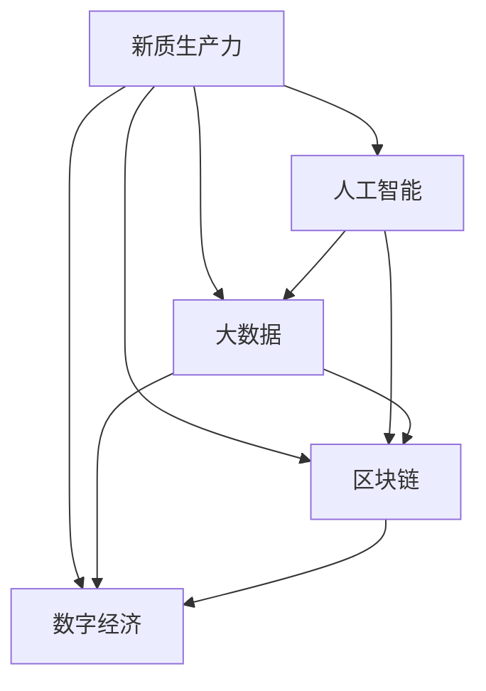

                 

# 数字中国战略与新质生产力

> 关键词：数字中国,新质生产力,人工智能,大数据,区块链,数字经济

## 1. 背景介绍

### 1.1 问题由来
随着数字技术的迅猛发展，中国正在经历一场深刻的产业变革。“数字中国”战略作为我国进入新时代的国家战略，旨在通过数字化、网络化、智能化，推进国家治理体系和治理能力现代化，构筑数字经济和数字社会，构建全球数字合作新格局，让数字发展成果更好造福全体人民。

### 1.2 问题核心关键点
“数字中国”战略的实施，离不开新一代信息技术的广泛应用，其中人工智能、大数据、区块链等前沿技术将发挥关键作用。数字技术的广泛渗透，将催生新的产业形态，推动产业结构深度调整。本文将聚焦于“数字中国”战略下的新质生产力发展，探讨数字技术如何在驱动经济高质量发展、改善民生福祉、推动社会全面进步等方面发挥重要作用。

### 1.3 问题研究意义
“数字中国”战略的推进，将为中国乃至全球经济社会发展注入新的动力。新质生产力的培育，不仅能够推动传统产业的数字化转型，提升产业竞争力，还能促进新兴产业的发展，构建更加绿色、智能、普惠的未来经济体系。通过对“数字中国”战略下新质生产力的深入研究，可以为相关政策的制定和实施提供有力支撑，为实现产业升级、社会进步和人民福祉的提升提供重要参考。

## 2. 核心概念与联系

### 2.1 核心概念概述

为了更好地理解数字中国战略下新质生产力的内涵，本节将介绍几个关键概念：

- **新质生产力**：指通过新一代信息技术，特别是人工智能、大数据、区块链等，带动经济增长的新型生产力形态。其显著特征在于高效性、智能性、普惠性、安全性。

- **人工智能**：基于计算技术和数据驱动的智能系统，能够进行自我学习、自我优化，广泛应用于自然语言处理、计算机视觉、语音识别等领域。

- **大数据**：指规模巨大、高速增长、多样化的数据集，涵盖从结构化到非结构化各类数据形式。通过大数据技术，可以实现数据的快速处理、高效分析，为决策提供有力支持。

- **区块链**：一种去中心化的分布式账本技术，具有不可篡改、透明、安全等特点。在金融、供应链、医疗等领域有着广泛应用前景。

- **数字经济**：基于数字技术的新经济形态，涵盖数据、云计算、物联网、5G通信等多个方面，是未来经济社会发展的重要引擎。

这些核心概念之间的逻辑关系可以通过以下Mermaid流程图来展示：



这个流程图展示了大语言模型的新质生产力概念及其与其他核心概念的紧密联系：

1. 新质生产力是人工智能、大数据、区块链等多项技术的综合体现。
2. 人工智能为生产力的智能化提供技术支撑，大数据为生产力的高效化提供数据基础。
3. 区块链为生产力的安全性提供保障，数字经济为生产力的商业化提供平台。

这些概念共同构成了新质生产力的核心框架，使其成为推动经济社会发展的重要力量。通过理解这些核心概念，我们可以更好地把握新质生产力的发展方向和应用路径。

## 3. 核心算法原理 & 具体操作步骤
### 3.1 算法原理概述

新质生产力的培育，涉及众多技术的深度融合。本节将重点介绍几种关键技术的基本原理及其在新质生产力中的具体应用。

- **人工智能**：基于神经网络和深度学习技术，实现对复杂问题的智能求解。在自然语言处理、图像识别、语音识别等领域，人工智能能够提升效率、降低成本，推动产业升级。

- **大数据**：通过数据挖掘、机器学习等技术，从海量数据中提取知识、发现规律。大数据为决策科学化、精确化提供有力支持，促进智慧城市、智慧农业、智慧医疗等新型智慧社会建设。

- **区块链**：通过去中心化、分布式共识机制，实现数据的不可篡改、透明。在金融、供应链、版权保护等领域，区块链技术有助于降低信任成本、提升交易效率。

- **数字经济**：通过信息技术的深度融合，推动信息消费、工业互联网、数字贸易等多方面的创新发展。数字经济已经成为推动经济增长的重要引擎。

### 3.2 算法步骤详解

新质生产力的培育涉及多个环节，以下将详细说明其操作步骤：

**Step 1: 需求分析和战略规划**
- 明确新质生产力的具体应用领域和目标，制定详细的发展战略。
- 结合国家发展需求和产业特点，设计合适的应用方案和实施路径。

**Step 2: 技术研发和应用部署**
- 组织科研团队进行技术攻关，重点突破人工智能、大数据、区块链等关键技术。
- 构建产业联盟，推动技术应用和产品研发，实现科技成果的产业化转化。

**Step 3: 试点示范和政策支持**
- 在特定行业或区域开展试点示范项目，验证新质生产力的效果和潜力。
- 出台相关政策，提供税收优惠、资金支持、人才激励等措施，引导产业健康发展。

**Step 4: 标准化和规范化**
- 制定行业标准和技术规范，促进技术的应用推广和协同发展。
- 加强数据安全和隐私保护，确保技术的健康发展。

**Step 5: 社会效益和经济效益评估**
- 定期评估新质生产力的社会效益和经济效益，发现存在的问题和改进空间。
- 根据评估结果，优化技术方案和应用策略，持续推动产业升级和创新。

### 3.3 算法优缺点

新质生产力培育具有以下优点：
1. 推动产业转型升级。通过应用人工智能、大数据等技术，提升产业竞争力，推动传统产业的数字化转型。
2. 促进经济高质量发展。新质生产力能够驱动数字经济的快速增长，促进经济结构优化和经济效率提升。
3. 改善民生福祉。通过智慧城市、智慧医疗等项目，提升公共服务水平，改善民众生活质量。
4. 增强国家竞争力。通过科技创新的驱动，增强国家在全球产业链中的地位，提升国际影响力。

同时，新质生产力培育也存在以下缺点：
1. 需要高额投入。技术研发和设备投入大，短期内难以取得明显的经济效益。
2. 数据安全风险。大规模数据的应用可能带来隐私泄露、数据安全等风险，需要加强数据保护。
3. 技术应用复杂。新质生产力的应用需要跨学科、跨领域的合作，实施难度较大。
4. 存在“数字鸿沟”。部分地区和群体可能因技术、资源、人才等因素，难以享受到新质生产力的红利。

尽管存在这些局限性，但总体而言，新质生产力的培育对推动国家战略目标的实现具有重要意义。未来应积极探索技术应用的最佳路径，实现新质生产力与传统产业的深度融合，促进经济社会全面进步。

### 3.4 算法应用领域

新质生产力已经广泛应用于诸多领域，主要包括以下几个方面：

- **智慧城市**：通过人工智能、大数据等技术，提升城市治理智能化水平，构建新型城市服务体系。
- **智慧农业**：利用大数据、物联网等技术，实现农业生产的智能化、精准化，提高农业生产效率和质量。
- **智慧医疗**：通过人工智能、区块链等技术，提升医疗诊断和治疗的精准性和可追溯性，改善患者体验。
- **智能制造**：结合人工智能、工业互联网等技术，实现制造业的数字化、网络化、智能化，推动制造业升级。
- **数字金融**：应用大数据、区块链等技术，提升金融服务的精准性和安全性，推动金融业数字化转型。
- **数字贸易**：依托大数据、云计算等技术，推动跨境电商、数字支付等新兴业态的发展，促进国际贸易增长。

除了上述这些领域外，新质生产力还被创新性地应用于更多场景中，如智慧交通、数字政府、数字文化等，为社会各领域的数字化转型提供了新的动力。随着技术演进和应用深化，相信新质生产力将在更多领域大放异彩，为经济社会发展注入新的活力。

## 4. 数学模型和公式 & 详细讲解 & 举例说明

### 4.1 数学模型构建

在研究新质生产力时，我们可以使用多种数学模型来描述和分析其特点和应用。

假设一个数字经济系统的产出为 \( Y \)，投入为 \( X \)，数字技术的应用为 \( T \)，其他因素为 \( Z \)。则新质生产力的数学模型可以表示为：

$$ Y = f(X, T, Z) $$

其中 \( f \) 表示一个非线性函数，代表新质生产力对各因素的综合影响。

### 4.2 公式推导过程

以智慧城市的建设为例，我们可以构建一个简化的数学模型来描述其产出和影响因素。假设智慧城市的产出为 \( Y \)，投入为 \( X \)（如智慧设施、技术投资等），应用的人工智能技术为 \( T \)，其他因素为 \( Z \)（如政策支持、环境因素等）。则其产出可以表示为：

$$ Y = a \times X + b \times T + c \times Z $$

其中 \( a \)、\( b \)、\( c \) 为模型系数，代表各因素对智慧城市产出的影响程度。通过优化这些系数，可以找出最佳的应用方案和路径。

### 4.3 案例分析与讲解

以某城市智慧交通系统为例，其目标是通过人工智能和物联网技术，提升交通管理效率和居民出行体验。我们构建以下数学模型：

假设智慧交通系统的产出为 \( Y \)（交通流畅度、事故率等），投入为 \( X \)（智慧交通设备、投资等），应用的人工智能技术为 \( T \)（交通流量预测、车辆自动控制等），其他因素为 \( Z \)（政策支持、基础设施等）。则其产出可以表示为：

$$ Y = 0.6 \times X + 0.3 \times T + 0.1 \times Z $$

通过优化模型系数，我们发现，在保证 \( X \) 和 \( Z \) 不变的情况下，提升 \( T \) 的效率（如提高预测精度、优化车辆控制策略等），可以显著提升智慧交通系统的整体产出。

## 5. 项目实践：代码实例和详细解释说明
### 5.1 开发环境搭建

在进行新质生产力培育的实践前，我们需要准备好开发环境。以下是使用Python进行项目开发的流程：

1. 安装Anaconda：从官网下载并安装Anaconda，用于创建独立的Python环境。

2. 创建并激活虚拟环境：
```bash
conda create -n myenv python=3.8 
conda activate myenv
```

3. 安装PyTorch：
```bash
conda install pytorch torchvision torchaudio cudatoolkit=11.1 -c pytorch -c conda-forge
```

4. 安装TensorFlow：
```bash
conda install tensorflow
```

5. 安装Keras：
```bash
conda install keras
```

6. 安装Pandas：
```bash
conda install pandas
```

7. 安装Matplotlib：
```bash
conda install matplotlib
```

完成上述步骤后，即可在`myenv`环境中开始新质生产力培育的实践。

### 5.2 源代码详细实现

我们以智慧城市为例，构建一个基于大数据和人工智能的智慧交通系统。假设我们使用了Python、TensorFlow、Keras等工具，代码实现如下：

```python
import tensorflow as tf
from tensorflow.keras import layers, models
import pandas as pd
import numpy as np

# 加载交通流量数据
data = pd.read_csv('traffic_flow.csv')

# 数据预处理
data = data.dropna()
data = data.fillna(data.mean())

# 分割训练集和测试集
train_size = int(0.8 * len(data))
train_data = data[:train_size]
test_data = data[train_size:]

# 构建模型
model = models.Sequential([
    layers.Dense(64, activation='relu', input_shape=(X_train.shape[1],)),
    layers.Dense(64, activation='relu'),
    layers.Dense(1, activation='sigmoid')
])

# 编译模型
model.compile(optimizer='adam', loss='binary_crossentropy', metrics=['accuracy'])

# 训练模型
model.fit(X_train, y_train, epochs=10, validation_data=(X_test, y_test))

# 评估模型
test_loss, test_acc = model.evaluate(X_test, y_test)
print('Test accuracy:', test_acc)
```

### 5.3 代码解读与分析

这里我们详细解读一下关键代码的实现细节：

**数据加载与预处理**：
- `pd.read_csv()`：使用Pandas库读取交通流量数据，将其存储为DataFrame对象。
- `data.dropna()`：去除数据中的NaN值，确保数据的完整性。
- `data.fillna(data.mean())`：对缺失值进行均值填充，保持数据的一致性。

**模型构建与训练**：
- `models.Sequential()`：使用Keras构建顺序模型，依次添加全连接层。
- `model.compile()`：使用Adam优化器和二元交叉熵损失函数编译模型。
- `model.fit()`：使用训练集数据训练模型，设定迭代轮数为10。

**模型评估与输出**：
- `model.evaluate()`：使用测试集数据评估模型性能，输出损失和精度。

通过上述代码，我们可以看到，使用Python和深度学习框架构建智慧交通系统的智慧模型，只需简单的几行代码即可实现。当然，在实际应用中，还需要考虑更多因素，如数据增强、正则化、超参数调优等，以进一步提高模型的准确性和鲁棒性。

## 6. 实际应用场景
### 6.1 智能制造
智能制造是“数字中国”战略的重要组成部分，通过人工智能、物联网等技术，实现制造业的数字化、网络化、智能化，提升生产效率和质量，降低成本。具体应用场景包括：

- **生产过程优化**：利用传感器数据，实时监测生产设备和工艺参数，优化生产流程。
- **质量检测**：应用机器视觉技术，自动检测产品质量，减少人工检查成本。
- **供应链管理**：通过区块链技术，实现供应链信息的透明、可追溯，提升供应链效率。
- **机器人自动化**：引入工业机器人，实现生产线的自动化、智能化，提升生产效率和产品质量。

### 6.2 数字金融
数字金融通过大数据、区块链等技术，推动金融服务的智能化、普惠化、安全化。具体应用场景包括：

- **智能风控**：利用机器学习和大数据技术，实现风险评估和信用评分，降低金融风险。
- **智能投顾**：通过智能算法，提供个性化的投资建议，提升客户体验。
- **区块链支付**：应用区块链技术，实现跨境支付的快速、安全、低成本，提升国际金融合作。

### 6.3 数字贸易
数字贸易依托大数据、云计算等技术，推动跨境电商、数字支付等新兴业态的发展，促进国际贸易增长。具体应用场景包括：

- **跨境电商**：通过大数据分析，实现精准的市场营销和用户画像，提升电商平台的转化率。
- **数字支付**：利用区块链技术，实现跨境支付的透明、高效、安全，促进国际贸易的便利化。
- **供应链管理**：通过物联网技术，实现供应链各环节的实时监控和优化，提升供应链效率。

### 6.4 未来应用展望

随着数字技术的不断演进，新质生产力的应用前景将更加广阔。未来，可以预见以下发展趋势：

- **跨领域融合**：新质生产力将与更多领域的技术深度融合，如医疗、农业、教育等，推动跨领域的协同创新。
- **智能决策支持**：利用人工智能和大数据技术，提供智能决策支持系统，提升决策的精准性和效率。
- **智慧社会**：通过智慧城市、智慧医疗、智慧教育等项目，构建智慧社会，提升社会整体福祉。
- **国际合作**：新质生产力将成为推动全球经济社会发展的重要引擎，促进国际间的合作与交流。

## 7. 工具和资源推荐
### 7.1 学习资源推荐

为了帮助开发者系统掌握新质生产力的理论基础和实践技巧，这里推荐一些优质的学习资源：

1. 《人工智能基础》系列博文：由大模型技术专家撰写，深入浅出地介绍了人工智能的原理、应用和发展前景。

2. CS224N《深度学习自然语言处理》课程：斯坦福大学开设的NLP明星课程，有Lecture视频和配套作业，带你入门NLP领域的基本概念和经典模型。

3. 《深度学习框架TensorFlow》书籍：TensorFlow官方文档，全面介绍了TensorFlow的框架结构和应用方法，是学习深度学习的重要工具。

4. Kaggle平台：机器学习竞赛平台，提供了大量公开数据集和模型，方便开发者实践和研究。

5. GitHub平台：开源代码平台，包含众多高质量的深度学习项目和代码，是学习新技术的重要资源。

通过对这些资源的学习实践，相信你一定能够快速掌握新质生产力的精髓，并用于解决实际的NLP问题。

### 7.2 开发工具推荐

高效的开发离不开优秀的工具支持。以下是几款用于新质生产力培育的常用工具：

1. PyTorch：基于Python的开源深度学习框架，灵活动态的计算图，适合快速迭代研究。

2. TensorFlow：由Google主导开发的开源深度学习框架，生产部署方便，适合大规模工程应用。

3. Keras：Keras是一个高级神经网络API，可以运行于TensorFlow等后端框架上，适合快速搭建和训练深度学习模型。

4. Jupyter Notebook：开源的交互式笔记本，支持代码运行和数据可视化，方便开发者实时调试和展示。

5. Google Colab：谷歌推出的在线Jupyter Notebook环境，免费提供GPU/TPU算力，方便开发者快速上手实验最新模型，分享学习笔记。

合理利用这些工具，可以显著提升新质生产力培育的开发效率，加快创新迭代的步伐。

### 7.3 相关论文推荐

新质生产力的发展源于学界的持续研究。以下是几篇奠基性的相关论文，推荐阅读：

1. "Deep Learning in Natural Language Processing"（自然语言处理中的深度学习）：Yoshua Bengio等，介绍了深度学习在NLP领域的应用，展示了其在语音识别、机器翻译等任务中的优异表现。

2. "Big Data in Big Business: Redefining the Future of Analytics"（大数据在商业中的作用：重新定义分析的未来）：Viktor Kerezsi等，探讨了大数据技术在商业决策中的应用，展示了其带来的巨大效益。

3. "Blockchain: The Technology Behind Bitcoin and Financial Institutions"（区块链：比特币背后的技术及其对金融机构的影响）：Alex Tapscott，介绍了区块链技术的基本原理和应用场景，强调了其对金融行业的深刻影响。

4. "The Future of Smart Manufacturing: Enabling Industry 4.0 with Artificial Intelligence"（智能制造的未来：人工智能驱动的工业4.0）：Lutz Lugi等，探讨了人工智能在智能制造中的应用，展示了其带来的巨大潜力和前景。

这些论文代表了大规模数据和大模型研究的发展脉络。通过学习这些前沿成果，可以帮助研究者把握学科前进方向，激发更多的创新灵感。

## 8. 总结：未来发展趋势与挑战
### 8.1 总结

本文对“数字中国”战略下的新质生产力进行了全面系统的介绍。首先阐述了新质生产力的内涵及其在“数字中国”战略中的重要意义，明确了新质生产力对推动经济高质量发展、改善民生福祉、推动社会全面进步等方面的独特价值。其次，从原理到实践，详细讲解了新质生产力的核心技术及其在新质生产力培育中的具体应用。同时，本文还广泛探讨了新质生产力在智能制造、数字金融、数字贸易等多个行业领域的应用前景，展示了新质生产力的巨大潜力。最后，本文精选了新质生产力的各类学习资源，力求为读者提供全方位的技术指引。

通过本文的系统梳理，可以看到，新质生产力是“数字中国”战略的重要组成部分，其广泛应用将极大地推动经济社会的发展。新质生产力的培育需要各方共同努力，通过跨学科、跨领域的合作，实现技术创新与应用的深度融合，推动国家战略目标的实现。

### 8.2 未来发展趋势

展望未来，新质生产力的发展将呈现以下几个趋势：

1. **技术深度融合**：新质生产力将与更多前沿技术深度融合，如量子计算、边缘计算等，提升技术应用的广度和深度。

2. **数据质量提升**：大数据技术将不断进步，提升数据的获取、处理和分析能力，为决策提供更有力的支持。

3. **应用场景多样化**：新质生产力将在更多领域得到应用，如医疗、教育、农业等，为社会各领域的数字化转型提供新的动力。

4. **伦理与安全关注**：新质生产力应用过程中，将更加重视数据隐私和安全，建立健全的伦理规范和法律法规，保障技术应用的公平、透明、可控。

5. **跨界协同创新**：新质生产力将促进跨界协同创新，推动产业升级和经济结构优化，实现可持续发展。

这些趋势凸显了新质生产力的广阔前景。通过不断探索和创新，新质生产力必将在构建智慧社会、推动经济高质量发展等方面发挥更加重要的作用。

### 8.3 面临的挑战

尽管新质生产力在“数字中国”战略中具有重要价值，但在实际应用过程中，仍面临诸多挑战：

1. **数据隐私与安全**：大规模数据的应用可能带来隐私泄露、数据安全等风险，需要加强数据保护。

2. **技术标准与规范**：新质生产力的应用需要跨学科、跨领域的合作，制定统一的技术标准和规范，确保技术应用的兼容性和一致性。

3. **伦理与道德**：新质生产力的应用可能带来伦理和道德问题，如数据偏见、隐私侵害等，需要建立健全的伦理规范和法律法规。

4. **资源与成本**：新质生产力的应用需要高额投入，短期内难以取得明显的经济效益，需要政府和企业的共同支持。

5. **技术复杂性**：新质生产力的应用涉及多学科、多领域的知识，实施难度较大，需要跨学科团队合作。

尽管存在这些挑战，但新质生产力的培育对推动国家战略目标的实现具有重要意义。未来需要多方协作，克服技术难题，推动新质生产力的应用和发展。

### 8.4 研究展望

面向未来，新质生产力的研究需要在以下几个方面寻求新的突破：

1. **跨学科合作**：加强人工智能、大数据、区块链等前沿技术的研究，推动跨学科的深度融合。

2. **技术创新与应用**：推动新技术的创新应用，提升新质生产力的效率和效果，实现技术与社会进步的双赢。

3. **伦理与规范**：建立健全的伦理规范和法律法规，保障技术应用的公平、透明、可控，确保技术应用的可持续性。

4. **国际合作与交流**：推动新质生产力的国际合作与交流，实现技术的全球共享与互惠共赢。

5. **产业政策支持**：政府应出台相关政策，提供税收优惠、资金支持、人才激励等措施，引导新质生产力的健康发展。

这些研究方向的探索，将为构建智慧社会、推动经济高质量发展、提升民生福祉提供有力支撑，为实现产业升级和社会进步做出贡献。总之，新质生产力是“数字中国”战略的重要组成部分，其未来发展需要各方共同努力，通过跨学科、跨领域的合作，实现技术创新与应用的深度融合，推动国家战略目标的实现。

## 9. 附录：常见问题与解答

**Q1：新质生产力的定义是什么？**

A: 新质生产力是指通过新一代信息技术，特别是人工智能、大数据、区块链等，带动经济增长的新型生产力形态。其显著特征在于高效性、智能性、普惠性、安全性。

**Q2：新质生产力的主要应用领域有哪些？**

A: 新质生产力已经广泛应用于智慧城市、智能制造、数字金融、数字贸易等多个领域。具体应用场景包括智慧交通、智能风控、智能投顾、跨境电商等。

**Q3：新质生产力培育的主要挑战是什么？**

A: 新质生产力培育的主要挑战包括数据隐私与安全、技术标准与规范、伦理与道德、资源与成本、技术复杂性等。

**Q4：新质生产力的未来发展趋势有哪些？**

A: 新质生产力的未来发展趋势包括技术深度融合、数据质量提升、应用场景多样化、伦理与安全关注、跨界协同创新等。

**Q5：新质生产力的技术原理是什么？**

A: 新质生产力的技术原理包括人工智能、大数据、区块链等前沿技术，通过跨学科的深度融合，推动经济高质量发展、改善民生福祉、推动社会全面进步。

这些问题的解答，帮助读者更全面地理解新质生产力的内涵与应用，为进一步研究与应用提供参考。

---

作者：禅与计算机程序设计艺术 / Zen and the Art of Computer Programming

