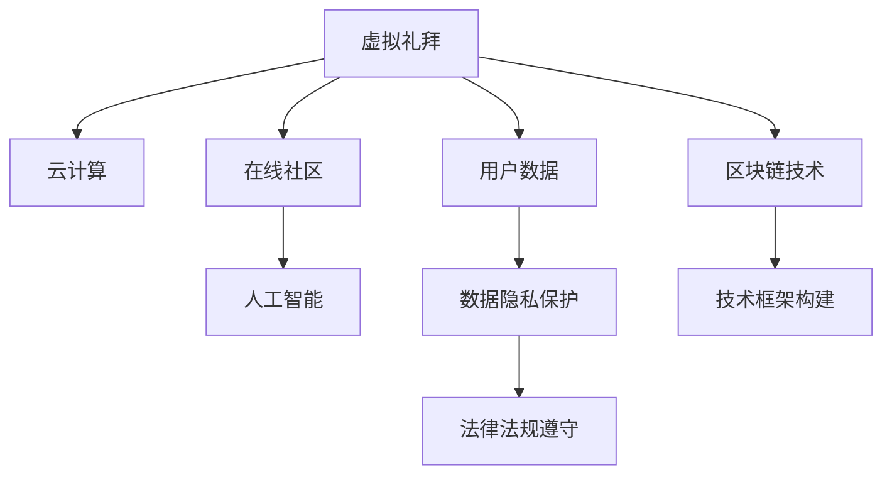

                 

# 数字化宗教创业：虚拟礼拜和在线社区

## 1. 背景介绍

### 1.1 问题由来

随着互联网技术的快速发展，数字化在各行各业都得到了广泛应用，宗教领域也不例外。数字化宗教创业，指将传统宗教活动数字化，通过在线礼拜、虚拟社区等形式，让信众随时随地参与宗教活动，进一步提升宗教的传播力和影响力。

近年来，全球宗教领袖和学者都在探索数字化宗教的可能性，但实际落地应用仍面临诸多挑战。相比于传统的实体礼拜场所，数字化宗教创业需要综合考虑技术、用户体验、法律法规等多方面因素，才能实现其价值。

### 1.2 问题核心关键点

数字化宗教创业的关键点包括：

- **技术框架构建**：选择合适的技术架构，如云计算、区块链等，以支撑虚拟礼拜和在线社区的建设。
- **用户体验设计**：设计简单易用的界面，提升用户参与体验，同时保证宗教活动的庄严性和互动性。
- **法律法规遵守**：确保数字化宗教活动的合法性，避免触犯法律法规。
- **文化适应性**：不同宗教有其独特的文化背景，数字化宗教创业需要兼顾多样性，尊重各地区的宗教习俗。
- **数据隐私保护**：保护用户数据安全，避免隐私泄露和数据滥用。

## 2. 核心概念与联系

### 2.1 核心概念概述

为了更好地理解数字化宗教创业的原理和架构，本节将介绍几个密切相关的核心概念：

- **虚拟礼拜**：指通过数字技术实现的传统宗教礼拜活动的模拟。包括视频直播、虚拟现实(VR)、增强现实(AR)等形式。
- **在线社区**：指基于互联网技术的社区，信众可以自由交流、分享经验和知识。
- **区块链技术**：一种分布式账本技术，具有去中心化、不可篡改等特点，可用于记录宗教活动和信众行为。
- **云计算**：通过互联网提供计算资源和数据存储服务，可用于支持大规模用户的在线宗教活动。
- **人工智能(AI)**：用于提升虚拟礼拜和在线社区的交互体验，如智能客服、个性化推荐等。

这些核心概念之间的逻辑关系可以通过以下Mermaid流程图来展示：



这个流程图展示了大语言模型的核心概念及其之间的关系：

1. 虚拟礼拜是数字化宗教创业的主要形式，需要依赖云计算、区块链等技术来支撑。
2. 在线社区是信众交流互动的重要平台，通过人工智能提升用户体验。
3. 区块链技术用于记录宗教活动和信众行为，保证数据透明和安全。
4. 云计算提供计算和存储资源，支持大规模用户参与。
5. 数据隐私保护和法律法规遵守是大规模数字化宗教创业不可或缺的环节。
6. 技术框架构建是实现上述所有功能的基础。

## 3. 核心算法原理 & 具体操作步骤

### 3.1 算法原理概述

数字化宗教创业的核心算法原理主要涉及以下几个方面：

1. **云计算框架设计**：选择合适的云计算平台（如AWS、Azure、Google Cloud），搭建虚拟礼拜和在线社区的基础架构。
2. **区块链平台搭建**：使用区块链技术（如Ethereum、Hyperledger）构建去中心化的宗教活动记录系统。
3. **虚拟礼拜技术实现**：通过视频直播、VR/AR技术，实现虚拟礼拜的视觉和听觉体验。
4. **在线社区功能开发**：开发聊天室、论坛、直播等功能，支持信众互动和交流。
5. **智能客服和推荐系统**：使用自然语言处理(NLP)和推荐系统算法，提供个性化的用户体验。

### 3.2 算法步骤详解

以下我们将详细介绍各算法步骤：

#### 3.2.1 云计算框架设计

**Step 1: 平台选择**
- 根据项目需求，选择合适的云计算平台，如AWS的EC2、Azure的VM、Google Cloud的Compute Engine。
- 考虑云计算服务的稳定性、可用性、安全性等因素，评估其适用性。

**Step 2: 环境搭建**
- 搭建虚拟机的基本配置，包括CPU、内存、存储等。
- 安装必要的软件和库，如Nginx、MySQL、Redis等。

**Step 3: 应用程序部署**
- 将虚拟礼拜和在线社区的应用程序部署到云计算平台上。
- 使用Docker、Kubernetes等容器技术，实现应用的自动扩缩容和部署。

#### 3.2.2 区块链平台搭建

**Step 1: 区块链平台选择**
- 根据项目需求，选择合适的区块链平台，如Ethereum、Hyperledger。
- 考虑区块链平台的安全性、扩展性、易用性等因素，评估其适用性。

**Step 2: 节点部署**
- 在多个节点上部署区块链平台，确保网络的去中心化和冗余性。
- 配置节点网络，确保各节点之间可以正常通信和同步。

**Step 3: 智能合约开发**
- 编写智能合约代码，记录宗教活动和信众行为。
- 使用Solidity、Truffle等工具进行智能合约的开发、测试和部署。

#### 3.2.3 虚拟礼拜技术实现

**Step 1: 视频直播**
- 使用WebRTC、RTMP等技术，实现视频直播。
- 确保视频流质量稳定，同时支持多种设备接入。

**Step 2: VR/AR技术**
- 使用Unity、Unreal Engine等游戏引擎，实现虚拟现实和增强现实体验。
- 利用AR技术，展示宗教建筑、神像等虚拟场景。

#### 3.2.4 在线社区功能开发

**Step 1: 聊天室**
- 使用Socket.IO、WebSockets等技术，实现实时聊天功能。
- 支持文字、图片、视频等多种消息类型。

**Step 2: 论坛**
- 使用WordPress、Discourse等开源社区软件，搭建论坛功能。
- 支持主题讨论、图片分享、资源下载等。

**Step 3: 直播**
- 使用WebRTC、RTMP等技术，实现直播功能。
- 支持多人在线观看、互动评论。

#### 3.2.5 智能客服和推荐系统

**Step 1: 智能客服**
- 使用NLP技术，构建智能客服系统。
- 通过意图识别和实体抽取，提供自动化的问答服务。

**Step 2: 推荐系统**
- 使用协同过滤、内容推荐等算法，推荐相关内容。
- 根据用户行为和兴趣，动态调整推荐策略。

### 3.3 算法优缺点

数字化宗教创业的算法具有以下优点：

1. **便捷性**：信众可以随时随地参与宗教活动，不受地理位置的限制。
2. **互动性**：通过在线社区和智能客服，提升用户互动和参与度。
3. **扩展性**：云计算和区块链技术，支持大规模用户参与，具有较强的扩展性。
4. **安全性**：区块链技术可以保证数据透明和安全，防止数据篡改和隐私泄露。

同时，该算法也存在以下缺点：

1. **技术复杂性**：涉及云计算、区块链、VR/AR等多项技术，开发难度较大。
2. **成本高**：需要投入大量的资金进行技术研发和基础设施建设。
3. **用户体验限制**：由于技术限制，VR/AR等体验可能不够完美，影响用户体验。
4. **法律法规风险**：需要严格遵守当地法律法规，避免触犯相关法律。

### 3.4 算法应用领域

数字化宗教创业的算法应用涵盖了以下多个领域：

1. **虚拟礼拜**：视频直播、VR/AR技术支持宗教活动的线上举行。
2. **在线社区**：提供信众互动交流的平台，增强社区凝聚力。
3. **智能客服**：通过智能问答系统，提升用户服务体验。
4. **推荐系统**：提供个性化的内容推荐，提升用户粘性。
5. **数据记录**：使用区块链技术，记录宗教活动和信众行为。

此外，该算法还被应用于虚拟博物馆、历史教育、在线研讨会等多个领域，具有广阔的应用前景。

## 4. 数学模型和公式 & 详细讲解

### 4.1 数学模型构建

假设云计算平台有 $N$ 个虚拟机，每个虚拟机处理能力为 $C_i$，总处理能力为 $C$，虚拟礼拜应用需要 $C$ 的处理能力。

设区块链平台的节点个数为 $M$，每个节点的处理能力为 $B_j$，总处理能力为 $B$，宗教活动数据量为 $D$。

设虚拟礼拜视频直播的带宽为 $W_v$，VR/AR技术的带宽为 $W_{vr}$，在线社区聊天室的带宽为 $W_c$，论坛的带宽为 $W_f$，直播的带宽为 $W_l$。

则总带宽为 $W$。

### 4.2 公式推导过程

云计算平台处理能力：

$$
C = \sum_{i=1}^N C_i
$$

区块链平台处理能力：

$$
B = \sum_{j=1}^M B_j
$$

虚拟礼拜应用所需处理能力：

$$
C_v = C + B
$$

虚拟礼拜带宽需求：

$$
W_v = W_{vr} + W_{vr} + W_c + W_f + W_l
$$

总带宽需求：

$$
W = W_v + C
$$

### 4.3 案例分析与讲解

假设云计算平台有10个虚拟机，每个虚拟机处理能力为5G，总处理能力为50G。区块链平台有5个节点，每个节点处理能力为10G，总处理能力为50G。宗教活动数据量为1GB。

虚拟礼拜视频直播的带宽为100Mbps，VR/AR技术的带宽为100Mbps，在线社区聊天室的带宽为50Mbps，论坛的带宽为50Mbps，直播的带宽为200Mbps。

则：

- 云计算平台处理能力：$C = 10 \times 5G = 50G$
- 区块链平台处理能力：$B = 5 \times 10G = 50G$
- 虚拟礼拜应用所需处理能力：$C_v = 50G + 50G = 100G$
- 虚拟礼拜带宽需求：$W_v = 100Mbps + 100Mbps + 50Mbps + 50Mbps + 200Mbps = 500Mbps$
- 总带宽需求：$W = 500Mbps + 100G = 100Gbps$

## 5. 项目实践：代码实例和详细解释说明

### 5.1 开发环境搭建

在进行数字化宗教创业的开发前，我们需要准备好开发环境。以下是使用Python进行Flask开发的环境配置流程：

1. 安装Anaconda：从官网下载并安装Anaconda，用于创建独立的Python环境。

2. 创建并激活虚拟环境：
```bash
conda create -n flask-env python=3.8 
conda activate flask-env
```

3. 安装Flask：
```bash
pip install flask
```

4. 安装SQLAlchemy：
```bash
pip install sqlalchemy
```

5. 安装Alembic：
```bash
pip install alembic
```

6. 安装FastAPI：
```bash
pip install fastapi
```

7. 安装PyJWT：
```bash
pip install pyjwt
```

完成上述步骤后，即可在`flask-env`环境中开始开发实践。

### 5.2 源代码详细实现

我们以Flask搭建一个简单的在线社区为例，展示数字化宗教创业的代码实现。

首先，定义社区的基本信息：

```python
from flask import Flask, request, jsonify
from flask_sqlalchemy import SQLAlchemy
from sqlalchemy import Column, Integer, String

app = Flask(__name__)
app.config['SQLALCHEMY_DATABASE_URI'] = 'sqlite:////tmp/test.db'
db = SQLAlchemy(app)

class Community(db.Model):
    id = Column(Integer, primary_key=True)
    name = Column(String(100), nullable=False)
    description = Column(String(255), nullable=True)
    members = Column(Integer, default=0)

    def __repr__(self):
        return f'<Community {self.name}>'
```

然后，定义API接口：

```python
@app.route('/community', methods=['POST'])
def create_community():
    data = request.get_json()
    new_community = Community(name=data['name'], description=data['description'])
    db.session.add(new_community)
    db.session.commit()
    return jsonify({'message': 'Community created successfully'})

@app.route('/community/<id>', methods=['GET'])
def get_community(id):
    community = Community.query.get(id)
    if not community:
        return jsonify({'message': 'Community not found'}), 404
    return jsonify({'id': community.id, 'name': community.name, 'description': community.description, 'members': community.members})

@app.route('/community', methods=['PUT'])
def update_community():
    data = request.get_json()
    community = Community.query.get(data['id'])
    if not community:
        return jsonify({'message': 'Community not found'}), 404
    community.name = data['name']
    community.description = data['description']
    db.session.commit()
    return jsonify({'message': 'Community updated successfully'})

@app.route('/community/<id>', methods=['DELETE'])
def delete_community(id):
    community = Community.query.get(id)
    if not community:
        return jsonify({'message': 'Community not found'}), 404
    db.session.delete(community)
    db.session.commit()
    return jsonify({'message': 'Community deleted successfully'})

if __name__ == '__main__':
    app.run(debug=True)
```

最后，启动Flask应用：

```bash
python app.py
```

在浏览器中访问 `http://127.0.0.1:5000/`，即可看到在线社区的前端页面。

### 5.3 代码解读与分析

让我们再详细解读一下关键代码的实现细节：

**Community类**：
- 定义了社区的基本信息，包括名称、描述、成员数量等。
- 使用SQLAlchemy库，实现了与SQL数据库的交互。

**API接口**：
- 使用Flask的路由装饰器，定义了社区的增删改查功能。
- 使用request.get_json()获取JSON格式的请求数据。
- 使用db.session进行数据库操作，确保数据的一致性。
- 使用jsonify()函数返回JSON格式的响应数据。

通过Flask搭建的在线社区，可以初步展示数字化宗教创业的前端页面和后端逻辑。在实际应用中，还需要进一步优化API接口，增加实时聊天、视频直播等功能，才能实现完整的在线社区系统。

## 6. 实际应用场景

### 6.1 智能礼拜系统

智能礼拜系统通过数字化宗教创业的算法，可以实现虚拟礼拜、在线社区等功能。系统主要由前端页面和后端服务组成，前端页面通过HTTP请求调用后端服务，实现各类功能。

**前端页面**：
- 视频直播：通过WebRTC技术，实现虚拟礼拜的视频直播。
- VR/AR体验：通过Unity、Unreal Engine等游戏引擎，实现虚拟礼拜的VR/AR体验。
- 在线社区：通过Socket.IO、WebSockets等技术，实现实时聊天和论坛功能。

**后端服务**：
- 云计算平台：使用AWS、Azure、Google Cloud等云计算服务，提供虚拟礼拜和在线社区的计算和存储资源。
- 区块链平台：使用Ethereum、Hyperledger等区块链平台，记录宗教活动和信众行为。
- 智能客服：通过NLP技术，构建智能客服系统，提供自动化的问答服务。
- 推荐系统：使用协同过滤、内容推荐等算法，提供个性化的内容推荐。

智能礼拜系统通过数字化宗教创业的算法，为信众提供了随时随地参与宗教活动的便利，同时也增强了社区的互动性和凝聚力。

### 6.2 虚拟宗教博物馆

虚拟宗教博物馆通过数字化宗教创业的算法，实现了宗教历史的数字化展示。系统主要由虚拟博物馆和互动展项组成，用户可以通过虚拟博物馆参观宗教历史文物，并通过互动展项参与宗教文化体验。

**虚拟博物馆**：
- 使用Unity、Unreal Engine等游戏引擎，搭建虚拟博物馆场景。
- 展示宗教历史文物、建筑等虚拟场景。
- 支持VR/AR体验，让用户沉浸式参观虚拟博物馆。

**互动展项**：
- 使用WebRTC、RTMP等技术，实现虚拟博物馆的视频直播。
- 通过Socket.IO、WebSockets等技术，实现实时聊天功能。
- 使用NLP技术，构建智能客服系统，提供自动化的问答服务。
- 使用推荐系统，提供个性化的内容推荐。

虚拟宗教博物馆通过数字化宗教创业的算法，为信众提供了更加丰富、互动的宗教文化体验，同时增强了博物馆的数字化展示效果。

### 6.3 宗教研讨会

宗教研讨会是信众分享宗教知识和经验的平台。通过数字化宗教创业的算法，可以实现在线研讨会、视频直播等功能，使信众可以随时随地参与宗教研讨会。

**在线研讨会**：
- 使用Zoom、Microsoft Teams等视频会议软件，搭建在线研讨会平台。
- 支持视频直播、语音聊天、文字讨论等功能。
- 使用NLP技术，构建智能客服系统，提供自动化的问答服务。
- 使用推荐系统，提供个性化的内容推荐。

**视频直播**：
- 使用WebRTC、RTMP等技术，实现视频直播功能。
- 支持多路并发直播，增强用户体验。
- 使用VR/AR技术，展示宗教建筑、神像等虚拟场景。

宗教研讨会通过数字化宗教创业的算法，为信众提供了便利的参与方式，增强了宗教知识交流的互动性和时效性。

## 7. 工具和资源推荐

### 7.1 学习资源推荐

为了帮助开发者系统掌握数字化宗教创业的理论基础和实践技巧，这里推荐一些优质的学习资源：

1. **Flask官方文档**：Flask的官方文档，详细介绍了Flask框架的使用方法，包括路由、模板、数据库等。
2. **SQLAlchemy官方文档**：SQLAlchemy的官方文档，详细介绍了SQLAlchemy库的使用方法，包括ORM、事务管理等。
3. **FastAPI官方文档**：FastAPI的官方文档，详细介绍了FastAPI框架的使用方法，包括路由、中间件、请求体等。
4. **PyJWT官方文档**：PyJWT的官方文档，详细介绍了PyJWT库的使用方法，包括签名、验证等。
5. **Blockchain基础教程**：区块链基础教程，介绍区块链技术的原理、应用场景等。
6. **VR/AR开发教程**：VR/AR开发教程，介绍Unity、Unreal Engine等游戏引擎的使用方法，包括场景搭建、互动效果等。
7. **NLP基础教程**：NLP基础教程，介绍NLP技术的原理、应用场景等。

通过对这些资源的学习实践，相信你一定能够快速掌握数字化宗教创业的精髓，并用于解决实际的宗教问题。

### 7.2 开发工具推荐

高效的开发离不开优秀的工具支持。以下是几款用于数字化宗教创业开发的常用工具：

1. **Flask**：基于Python的Web应用框架，轻量级、易用性强，适合快速开发。
2. **SQLAlchemy**：基于Python的ORM框架，支持多种数据库，支持事务管理、迁移管理等。
3. **FastAPI**：基于Python的Web框架，支持异步请求处理，性能高、扩展性强。
4. **PyJWT**：基于Python的数字签名库，支持JWT格式的加密和验证。
5. **Unity**：跨平台的游戏引擎，支持VR/AR开发。
6. **Unreal Engine**：跨平台的游戏引擎，支持VR/AR开发。
7. **AWS**：云计算平台，提供弹性计算、存储、网络等服务。
8. **Azure**：云计算平台，提供弹性计算、存储、网络等服务。
9. **Google Cloud**：云计算平台，提供弹性计算、存储、网络等服务。
10. **Ethereum**：区块链平台，支持智能合约、去中心化应用等。
11. **Hyperledger**：区块链平台，支持联盟链、私有链、公有链等。

合理利用这些工具，可以显著提升数字化宗教创业的开发效率，加快创新迭代的步伐。

### 7.3 相关论文推荐

数字化宗教创业的研究源于学界的持续研究。以下是几篇奠基性的相关论文，推荐阅读：

1. **区块链技术综述**：区块链技术综述，介绍区块链技术的原理、应用场景等。
2. **VR/AR技术综述**：VR/AR技术综述，介绍VR/AR技术的原理、应用场景等。
3. **NLP技术综述**：NLP技术综述，介绍NLP技术的原理、应用场景等。
4. **智能礼拜系统**：智能礼拜系统的设计和实现，介绍智能礼拜系统的技术架构、用户体验等。
5. **虚拟宗教博物馆**：虚拟宗教博物馆的设计和实现，介绍虚拟宗教博物馆的技术架构、用户体验等。
6. **宗教研讨会**：宗教研讨会的实现方法，介绍宗教研讨会的技术架构、用户体验等。

这些论文代表了大语言模型微调技术的发展脉络。通过学习这些前沿成果，可以帮助研究者把握学科前进方向，激发更多的创新灵感。

## 8. 总结：未来发展趋势与挑战

### 8.1 总结

本文对数字化宗教创业的算法进行了全面系统的介绍。首先阐述了数字化宗教创业的背景和意义，明确了微调在拓展宗教活动数字化、提升宗教传播力方面的独特价值。其次，从原理到实践，详细讲解了云计算、区块链、VR/AR等多项技术的组合应用，给出了数字化宗教创业的完整代码实例。同时，本文还广泛探讨了虚拟礼拜、在线社区、智能客服等功能的应用场景，展示了数字化宗教创业的广阔前景。此外，本文精选了数字化宗教创业的技术资源，力求为读者提供全方位的技术指引。

通过本文的系统梳理，可以看到，数字化宗教创业通过技术手段，将传统宗教活动数字化，打破了地理位置和时间的限制，进一步提升宗教的传播力和影响力。未来，伴随技术的发展和应用的深化，数字化宗教创业必将在宗教领域带来革命性的变革。

### 8.2 未来发展趋势

展望未来，数字化宗教创业将呈现以下几个发展趋势：

1. **技术融合**：随着技术的不断进步，云计算、区块链、VR/AR、NLP等技术将更加紧密结合，实现更全面、高效的宗教活动数字化。
2. **用户体验提升**：通过智能客服、个性化推荐等技术，提升用户参与体验，增强宗教社区的互动性和凝聚力。
3. **多平台融合**：实现跨平台的用户体验，支持移动端、Web端等多种接入方式，方便信众参与宗教活动。
4. **实时互动**：通过实时视频、语音聊天等功能，增强宗教活动的互动性和实时性。
5. **去中心化治理**：通过区块链技术，实现宗教活动的去中心化治理，提高宗教活动的透明度和可信度。

以上趋势凸显了数字化宗教创业的广阔前景。这些方向的探索发展，必将进一步提升宗教活动的数字化水平，为信众提供更加便捷、丰富的宗教体验。

### 8.3 面临的挑战

尽管数字化宗教创业技术已经取得了瞩目成就，但在迈向更加智能化、普适化应用的过程中，它仍面临着诸多挑战：

1. **技术复杂性**：涉及云计算、区块链、VR/AR、NLP等多项技术，开发难度较大。
2. **成本高**：需要投入大量的资金进行技术研发和基础设施建设。
3. **用户体验限制**：由于技术限制，VR/AR等体验可能不够完美，影响用户体验。
4. **法律法规风险**：需要严格遵守当地法律法规，避免触犯相关法律。
5. **数据隐私保护**：需要保护用户数据安全，避免隐私泄露和数据滥用。

正视数字化宗教创业面临的这些挑战，积极应对并寻求突破，将是大语言模型微调走向成熟的必由之路。相信随着学界和产业界的共同努力，这些挑战终将一一被克服，数字化宗教创业必将在宗教领域带来革命性的变革。

### 8.4 研究展望

面对数字化宗教创业所面临的种种挑战，未来的研究需要在以下几个方面寻求新的突破：

1. **技术简化**：开发更加易用、易部署的技术解决方案，降低技术门槛，便于开发者快速上手。
2. **成本控制**：寻找更加经济、高效的技术方案，降低开发和运营成本。
3. **用户体验优化**：进一步优化VR/AR、智能客服等技术，提升用户体验，使其更加便捷、自然。
4. **法律法规合规**：研究区块链、数字身份等技术，实现宗教活动的去中心化治理和合规性保障。
5. **数据隐私保护**：研究数据加密、去标识化等技术，保护用户隐私，防止数据滥用。

这些研究方向的探索，必将引领数字化宗教创业技术迈向更高的台阶，为宗教活动数字化提供更加安全、便捷、高效的技术支持。

## 9. 附录：常见问题与解答

**Q1：如何选择合适的云计算平台？**

A: 根据项目需求，选择合适的云计算平台，如AWS的EC2、Azure的VM、Google Cloud的Compute Engine。考虑平台的稳定性、可用性、安全性等因素，评估其适用性。

**Q2：如何保护用户数据隐私？**

A: 使用数据加密、去标识化等技术，保护用户隐私，防止数据滥用。

**Q3：如何实现去中心化治理？**

A: 通过区块链技术，实现宗教活动的去中心化治理，提高宗教活动的透明度和可信度。

**Q4：如何提升用户体验？**

A: 通过VR/AR、智能客服、个性化推荐等技术，提升用户参与体验，增强宗教社区的互动性和凝聚力。

**Q5：如何实现实时互动？**

A: 通过实时视频、语音聊天等功能，增强宗教活动的互动性和实时性。

通过本文的系统梳理，可以看到，数字化宗教创业通过技术手段，将传统宗教活动数字化，打破了地理位置和时间的限制，进一步提升宗教的传播力和影响力。未来，伴随技术的发展和应用的深化，数字化宗教创业必将在宗教领域带来革命性的变革。

---

作者：禅与计算机程序设计艺术 / Zen and the Art of Computer Programming

