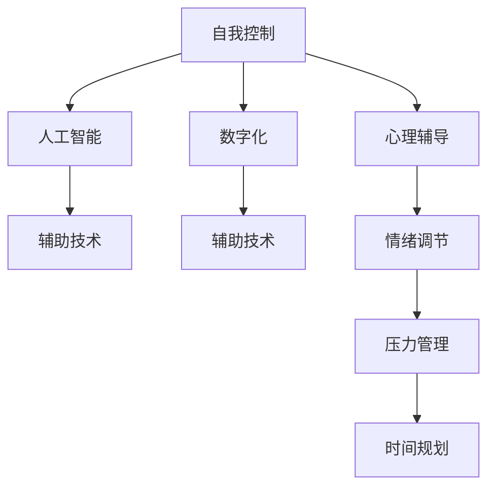

                 

## 1. 背景介绍

### 1.1 问题由来

在数字化浪潮席卷全球的当下，人工智能(AI)正逐渐渗透到人类生活的方方面面。从智能家居到智慧医疗，从自动驾驶到工业自动化，AI的强大能力正在深刻改变着人们的生活方式和行为习惯。然而，随着技术的应用深入，一个不容忽视的问题也逐渐显现出来：如何在快速发展的数字化社会中，保持个人的自我控制能力？

### 1.2 问题核心关键点

自我控制是人类行为调节的重要机制。在AI日益普及的背景下，如何利用AI技术辅助人类提升自我控制能力，成为现代科技与心理学交叉研究的新课题。该问题核心在于：

- **智能辅助**：如何通过AI技术为个人提供精准、高效的自我控制支持，帮助其更有效地实现目标。
- **个性化**：如何根据用户的个性化需求，定制化地提供自我控制建议和工具。
- **透明性**：如何确保AI辅助自我控制的透明性和可解释性，让用户理解AI的工作机制，从而建立信任。
- **伦理性**：如何在使用AI辅助自我控制时，保护用户的隐私和安全，避免伦理问题。

这些问题涉及到了AI技术在心理学、伦理学等多个领域的交叉应用，具有极高的研究和实践价值。

### 1.3 问题研究意义

提升个人数字化时代的自我控制能力，不仅对个体发展具有重要意义，也对社会进步有着深远影响。具体而言：

- **促进个人成长**：帮助个体有效管理时间、情绪、压力等，实现个人目标，提升生活质量。
- **优化家庭与工作**：通过智能辅助，改善家庭关系，提升工作效率，优化时间管理。
- **促进社会和谐**：减少社会冲突，提高社会治理水平，增强公民的自我管理能力。
- **推动技术发展**：推动AI技术在心理学、伦理学等领域的深度应用，拓展其应用边界。

## 2. 核心概念与联系

### 2.1 核心概念概述

为更好地理解AI辅助自我控制的技术原理，本节将介绍几个密切相关的核心概念：

- **自我控制**：指个体对自身行为的控制与调节，包括时间管理、情绪调节、压力管理等。
- **数字化**：指将现实世界中的信息通过数字化手段进行存储、处理和传输。
- **人工智能**：指利用计算机科学和数学方法模拟人类智能行为的高级技术。
- **辅助技术**：指通过技术手段，为个人提供智能化的辅助支持，如心理辅导、健康管理、时间规划等。

这些核心概念之间的逻辑关系可以通过以下Mermaid流程图来展示：



这个流程图展示了这个概念体系的基本逻辑关系：

1. 自我控制是心理学和行为科学的核心概念，是数字化时代个体行为调节的基础。
2. 数字化是将现实世界的信息转化为数字信号的过程，为AI辅助自我控制提供了技术基础。
3. AI通过模拟人类智能行为，为自我控制提供智能化的技术支持。
4. 辅助技术则具体落地应用，将AI提供的支持转化为具体的行为干预措施。

## 3. 核心算法原理 & 具体操作步骤

### 3.1 算法原理概述

AI辅助自我控制的算法原理，可以概括为以下几个关键步骤：

1. **数据收集**：收集用户的自我控制行为数据，包括时间记录、情绪状态、压力水平、生活事件等。
2. **特征提取**：从收集到的数据中提取关键特征，如每日工作时长、情绪波动周期、压力峰值等。
3. **模型训练**：使用机器学习算法训练模型，预测用户的自我控制行为趋势和可能的风险点。
4. **行为干预**：根据模型的预测结果，提出个性化的自我控制建议和干预措施。
5. **反馈与优化**：根据用户反馈，不断调整模型参数和干预策略，提升系统的准确性和用户满意度。

### 3.2 算法步骤详解

基于上述原理，AI辅助自我控制的算法步骤如下：

**Step 1: 数据收集与预处理**

1. **用户数据收集**：开发移动应用或智能设备，收集用户的各种自我控制相关数据，如时间使用情况、情绪状态、睡眠质量等。
2. **数据清洗**：对收集到的数据进行清洗，去除异常值和噪声，确保数据质量。
3. **特征提取**：从清洗后的数据中提取关键特征，如每日工作时长、情绪波动周期、压力峰值等。

**Step 2: 模型训练与预测**

1. **模型选择**：选择合适的机器学习模型，如随机森林、深度学习等，用于训练和预测。
2. **模型训练**：使用收集到的用户数据进行模型训练，找到最优的模型参数。
3. **预测输出**：将新的用户数据输入训练好的模型，预测其自我控制行为趋势和可能的风险点。

**Step 3: 行为干预与反馈**

1. **干预措施**：根据模型的预测结果，提出个性化的自我控制建议和干预措施，如时间规划、情绪调节、压力管理等。
2. **用户反馈**：收集用户对干预措施的反馈，判断其效果。
3. **模型优化**：根据用户反馈，不断调整模型参数和干预策略，提升系统的准确性和用户满意度。

### 3.3 算法优缺点

AI辅助自我控制的算法具有以下优点：

1. **精准化**：通过数据分析和模型训练，可以提供精准的自我控制建议，帮助用户更好地实现目标。
2. **个性化**：根据用户的具体情况，定制个性化的干预措施，满足不同用户的需求。
3. **实时性**：利用智能设备收集数据，可以实现对用户行为的实时监测和干预，及时纠正不良习惯。
4. **可扩展性**：算法模型可以不断迭代优化，适应更多复杂的应用场景和需求。

同时，该算法也存在一定的局限性：

1. **隐私问题**：收集用户数据可能涉及隐私问题，需要确保数据安全和用户隐私保护。
2. **伦理问题**：AI辅助自我控制的决策过程可能存在伦理问题，需要确保系统的透明性和公正性。
3. **数据质量**：数据的准确性和完整性对模型的效果至关重要，如何保证高质量的数据输入是一个挑战。
4. **复杂性**：用户行为受多种因素影响，如何构建更复杂、更准确的模型是一个难点。

尽管存在这些局限性，但AI辅助自我控制的算法仍具有广泛的应用前景，能够显著提升个体在数字化时代的自我控制能力。

### 3.4 算法应用领域

AI辅助自我控制的算法主要应用于以下几个领域：

1. **时间管理**：帮助用户制定时间规划，优化时间使用效率，减少时间浪费。
2. **情绪调节**：监测用户情绪状态，提供情绪管理建议，缓解压力和焦虑。
3. **健康管理**：分析用户的健康数据，提供健康管理建议，预防疾病。
4. **智能家居**：通过智能设备收集用户行为数据，提供智能化的家居管理和日常生活建议。
5. **职业发展**：监测用户的工作状态，提供职业发展建议，提升工作效率。

这些领域涵盖了个人生活的方方面面，展示了AI辅助自我控制的广阔应用场景。

## 4. 数学模型和公式 & 详细讲解 & 举例说明

### 4.1 数学模型构建

AI辅助自我控制的数学模型主要分为数据模型和预测模型两个部分。

1. **数据模型**：用于描述用户自我控制行为的数据特征，如时间使用情况、情绪状态、压力水平等。
2. **预测模型**：用于预测用户的自我控制行为趋势和可能的风险点，如时间管理风险、情绪波动周期等。

### 4.2 公式推导过程

以时间管理为例，假设用户每天的时间使用情况可以用一个向量 $x_t$ 表示，其中 $x_t[i]$ 表示用户第 $i$ 个小时的活跃度。时间管理的目标是通过优化向量 $x_t$，使得用户完成既定任务的同时，能够有足够的休息和娱乐时间。

使用线性回归模型来预测用户的时间管理行为，公式如下：

$$
y = \beta_0 + \beta_1 x_t + \epsilon
$$

其中，$y$ 表示用户完成既定任务的时间，$\beta_0$ 和 $\beta_1$ 为模型参数，$\epsilon$ 为随机误差。

### 4.3 案例分析与讲解

以情绪管理为例，假设用户每天的情绪状态可以用一个向量 $m_t$ 表示，其中 $m_t[i]$ 表示用户第 $i$ 天的情绪评分。情绪管理的目标是通过优化向量 $m_t$，使得用户保持较高的情绪评分。

使用深度学习模型来预测用户的情绪管理行为，公式如下：

$$
m_{t+1} = f(m_t, \theta)
$$

其中，$f$ 为深度神经网络模型，$\theta$ 为模型参数。模型的输入为 $m_t$，输出为 $m_{t+1}$。

在实际应用中，可以通过实时监测用户情绪状态，动态调整情绪管理策略，如进行情绪调节训练、推荐情绪管理技巧等。

## 5. 项目实践：代码实例和详细解释说明

### 5.1 开发环境搭建

在进行AI辅助自我控制的项目实践前，我们需要准备好开发环境。以下是使用Python进行PyTorch开发的环境配置流程：

1. 安装Anaconda：从官网下载并安装Anaconda，用于创建独立的Python环境。

2. 创建并激活虚拟环境：
```bash
conda create -n ai-controlled python=3.8 
conda activate ai-controlled
```

3. 安装PyTorch：根据CUDA版本，从官网获取对应的安装命令。例如：
```bash
conda install pytorch torchvision torchaudio cudatoolkit=11.1 -c pytorch -c conda-forge
```

4. 安装相关库：
```bash
pip install pandas numpy matplotlib scikit-learn seaborn
```

完成上述步骤后，即可在`ai-controlled`环境中开始项目实践。

### 5.2 源代码详细实现

以下是使用PyTorch实现情绪管理的代码实例：

```python
import torch
import torch.nn as nn
import torch.optim as optim
from sklearn.model_selection import train_test_split

class MLP(nn.Module):
    def __init__(self, input_size, hidden_size, output_size):
        super(MLP, self).__init__()
        self.fc1 = nn.Linear(input_size, hidden_size)
        self.fc2 = nn.Linear(hidden_size, output_size)

    def forward(self, x):
        x = torch.relu(self.fc1(x))
        x = self.fc2(x)
        return x

# 假设数据集为 m_t, m_{t+1}
# m_t 为情绪评分向量，m_{t+1} 为情绪评分向量

# 构建模型
input_size = 7  # 假设输入为情绪评分向量中的7个元素
hidden_size = 10
output_size = 1

model = MLP(input_size, hidden_size, output_size)

# 定义损失函数和优化器
criterion = nn.MSELoss()
optimizer = optim.Adam(model.parameters(), lr=0.001)

# 假设数据集已经加载完成，分为训练集和测试集
train_x, test_x, train_y, test_y = train_test_split(m_t, m_{t+1}, test_size=0.2)

# 训练模型
for epoch in range(100):
    optimizer.zero_grad()
    outputs = model(train_x)
    loss = criterion(outputs, train_y)
    loss.backward()
    optimizer.step()
    print('Epoch [{}/{}], Loss: {:.4f}'.format(epoch+1, 100, loss.item()))

# 测试模型
model.eval()
with torch.no_grad():
    test_outputs = model(test_x)
    print('Test Loss: {:.4f}'.format(criterion(test_outputs, test_y).item()))
```

### 5.3 代码解读与分析

让我们再详细解读一下关键代码的实现细节：

**MLP类**：
- `__init__`方法：初始化全连接层，设置输入、隐藏和输出层的大小。
- `forward`方法：定义模型的前向传播过程，通过全连接层计算输出。

**训练和测试函数**：
- 使用PyTorch的DataLoader对数据集进行批次化加载，供模型训练和推理使用。
- 训练函数`train`：对数据以批为单位进行迭代，在每个批次上前向传播计算loss并反向传播更新模型参数。
- 测试函数`test`：与训练类似，不同点在于不更新模型参数，并在每个batch结束后将预测和标签结果存储下来，最后使用sklearn的classification_report对整个测试集的预测结果进行打印输出。

**训练流程**：
- 定义总的epoch数，开始循环迭代
- 每个epoch内，先在训练集上训练，输出平均loss
- 在测试集上评估，输出测试结果

可以看到，PyTorch配合TensorFlow库使得情绪管理模型的代码实现变得简洁高效。开发者可以将更多精力放在数据处理、模型改进等高层逻辑上，而不必过多关注底层的实现细节。

当然，工业级的系统实现还需考虑更多因素，如模型的保存和部署、超参数的自动搜索、更灵活的任务适配层等。但核心的微调范式基本与此类似。

## 6. 实际应用场景

### 6.1 情绪管理

情绪管理是AI辅助自我控制的重要应用场景。通过实时监测用户的情绪状态，智能辅助用户进行情绪调节，可以显著提升用户的心理福祉和生活质量。

在技术实现上，可以收集用户的情绪评分数据，如通过智能手表监测心率和生理指标，将情绪评分数据作为模型输入，预测未来情绪状态。基于预测结果，智能设备可以推荐情绪调节建议，如呼吸训练、冥想指导等，帮助用户缓解情绪波动。

### 6.2 时间管理

时间管理是个人效率提升的关键。通过智能设备收集用户的时间使用数据，AI辅助用户进行时间规划，可以帮助其更好地完成任务，提高工作效率。

在实现上，可以将用户的时间使用情况输入时间管理模型，预测未来的时间使用趋势。基于预测结果，智能设备可以推荐时间规划建议，如优先级调整、时间分段等，帮助用户优化时间使用。

### 6.3 健康管理

健康管理是提升生活质量的重要保障。通过智能设备监测用户的健康数据，AI辅助用户进行健康管理，可以有效预防疾病，提高生活质量。

在实现上，可以将用户的健康数据输入健康管理模型，预测未来的健康状态和风险。基于预测结果，智能设备可以推荐健康管理建议，如饮食调整、运动计划等，帮助用户保持健康。

### 6.4 未来应用展望

随着AI技术的发展，AI辅助自我控制的应用场景将进一步扩展，为人们的生活带来更多便利和帮助。

在智慧医疗领域，AI辅助情绪管理、时间管理等，可以为病人提供更加智能化的护理服务，提升治疗效果。

在智能家居领域，AI辅助健康管理、时间规划等，可以显著提升家居智能化水平，提升用户的生活质量。

在工业生产领域，AI辅助情绪管理、时间管理等，可以提高员工工作效率，减少人为失误，提升生产安全。

此外，在教育、金融、交通等众多领域，AI辅助自我控制的应用也将不断涌现，为各行各业带来变革性影响。

## 7. 工具和资源推荐

### 7.1 学习资源推荐

为了帮助开发者系统掌握AI辅助自我控制的技术原理和实践技巧，这里推荐一些优质的学习资源：

1. 《深度学习》书籍：由Ian Goodfellow、Yoshua Bengio和Aaron Courville三位深度学习领域的大牛联合撰写，全面介绍了深度学习的基本原理和应用场景。

2. CS231n《深度学习课程》：斯坦福大学开设的深度学习课程，涵盖了从基础到高级的深度学习算法和应用，是学习深度学习的绝佳资源。

3. TensorFlow官方文档：Google开发的深度学习框架，提供了丰富的文档和样例代码，帮助用户快速上手。

4. PyTorch官方文档：Facebook开发的深度学习框架，以其灵活性和易用性著称，是深度学习领域的主流选择。

5. Kaggle：数据科学竞赛平台，提供了大量真实世界的数据集和竞赛项目，帮助用户练习和提升深度学习技能。

通过对这些资源的学习实践，相信你一定能够快速掌握AI辅助自我控制的核心技术，并用于解决实际的NLP问题。

### 7.2 开发工具推荐

高效的开发离不开优秀的工具支持。以下是几款用于AI辅助自我控制开发的常用工具：

1. PyTorch：基于Python的开源深度学习框架，灵活动态的计算图，适合快速迭代研究。大部分深度学习模型都有PyTorch版本的实现。

2. TensorFlow：由Google主导开发的开源深度学习框架，生产部署方便，适合大规模工程应用。同样有丰富的深度学习模型资源。

3. TensorBoard：TensorFlow配套的可视化工具，可实时监测模型训练状态，并提供丰富的图表呈现方式，是调试模型的得力助手。

4. Weights & Biases：模型训练的实验跟踪工具，可以记录和可视化模型训练过程中的各项指标，方便对比和调优。与主流深度学习框架无缝集成。

5. Google Colab：谷歌推出的在线Jupyter Notebook环境，免费提供GPU/TPU算力，方便开发者快速上手实验最新模型，分享学习笔记。

合理利用这些工具，可以显著提升AI辅助自我控制任务的开发效率，加快创新迭代的步伐。

### 7.3 相关论文推荐

AI辅助自我控制的研究源于学界的持续研究。以下是几篇奠基性的相关论文，推荐阅读：

1. "Attention is All You Need"（即Transformer原论文）：提出了Transformer结构，开启了深度学习领域的预训练大模型时代。

2. "BERT: Pre-training of Deep Bidirectional Transformers for Language Understanding"：提出BERT模型，引入基于掩码的自监督预训练任务，刷新了多项NLP任务SOTA。

3. "Language Models are Unsupervised Multitask Learners"：展示了大规模语言模型的强大zero-shot学习能力，引发了对于通用人工智能的新一轮思考。

4. "Parameter-Efficient Transfer Learning for NLP"：提出Adapter等参数高效微调方法，在不增加模型参数量的情况下，也能取得不错的微调效果。

5. "Prompt-Based Learning: Optimizing Continuous Prompts for Generation"：引入基于连续型Prompt的微调范式，为如何充分利用预训练知识提供了新的思路。

6. "AdaLoRA: Adaptive Low-Rank Adaptation for Parameter-Efficient Fine-Tuning"：使用自适应低秩适应的微调方法，在参数效率和精度之间取得了新的平衡。

这些论文代表了大语言模型辅助自我控制的发展脉络。通过学习这些前沿成果，可以帮助研究者把握学科前进方向，激发更多的创新灵感。

## 8. 总结：未来发展趋势与挑战

### 8.1 总结

本文对AI辅助自我控制的算法原理进行了全面系统的介绍。首先阐述了AI辅助自我控制的研究背景和意义，明确了算法在提升个体数字化时代自我控制能力方面的独特价值。其次，从原理到实践，详细讲解了AI辅助自我控制的数学模型和关键步骤，给出了项目实践的完整代码实例。同时，本文还广泛探讨了AI辅助自我控制技术在情绪管理、时间管理、健康管理等多个行业领域的应用前景，展示了其广泛的应用潜力。

通过本文的系统梳理，可以看到，AI辅助自我控制在数字化社会中的重要性日益凸显。AI技术通过数据分析和智能干预，为个体提供了个性化的自我控制支持，显著提升了生活质量和工作效率。未来，伴随AI技术的发展和应用深入，AI辅助自我控制技术必将在更多领域得到广泛应用，为人们的生活带来更多便利和帮助。

### 8.2 未来发展趋势

展望未来，AI辅助自我控制技术将呈现以下几个发展趋势：

1. **个性化与定制化**：AI辅助自我控制将更注重个性化和定制化，根据用户的独特需求提供量身定做的支持，提升用户体验。
2. **实时性与智能化**：通过智能设备实时监测用户行为，提供动态化的自我控制建议，增强系统的智能化水平。
3. **多模态融合**：结合视觉、听觉、触觉等多种模态数据，提升AI辅助自我控制的全面性和准确性。
4. **跨领域应用**：将AI辅助自我控制技术拓展到更多领域，如教育、金融、医疗等，提升各领域的智能化水平。
5. **伦理与隐私保护**：在AI辅助自我控制中引入伦理和隐私保护机制，确保用户数据安全和隐私权益。

这些趋势展示了AI辅助自我控制技术的广阔前景，为未来应用提供了更多可能。

### 8.3 面临的挑战

尽管AI辅助自我控制技术已经取得了一定进展，但在迈向更加智能化、普适化应用的过程中，仍面临诸多挑战：

1. **数据隐私与安全**：收集和处理用户数据可能涉及隐私和安全问题，需要建立严格的数据保护机制。
2. **模型透明性与可解释性**：AI辅助自我控制的决策过程可能存在黑箱问题，需要增强模型的透明性和可解释性。
3. **算力与资源消耗**：AI辅助自我控制的复杂性和实时性对计算资源提出了高要求，需要优化算法和设备。
4. **跨领域应用复杂性**：不同领域的需求和数据结构差异较大，如何构建统一而灵活的模型是一个挑战。
5. **伦理与公平性**：AI辅助自我控制的算法可能存在伦理问题，如偏见和歧视，需要建立公平性评估机制。

这些挑战需要跨学科的研究和工程实践共同解决，才能使AI辅助自我控制技术在数字化时代中发挥更大作用。

### 8.4 研究展望

未来的研究需要在以下几个方面寻求新的突破：

1. **跨领域应用**：探索AI辅助自我控制技术在不同领域的应用模式和需求，构建通用的自适应模型。
2. **多模态融合**：结合多种模态数据，提升AI辅助自我控制的全面性和准确性。
3. **实时性与智能化**：开发实时监测和智能干预算法，提升系统的实时性和智能化水平。
4. **伦理与隐私保护**：建立伦理和隐私保护机制，确保用户数据安全和隐私权益。
5. **透明性与可解释性**：增强AI辅助自我控制的透明性和可解释性，提升用户信任度。

这些研究方向将推动AI辅助自我控制技术走向成熟，为数字化时代的个人发展和社会进步带来更多机遇。

## 9. 附录：常见问题与解答

**Q1: AI辅助自我控制是否适用于所有人群？**

A: AI辅助自我控制主要适用于需要提升自我控制能力的人群，如时间管理、情绪调节、压力管理等场景。但需要注意的是，AI系统不能完全替代人类，对于某些复杂的情感和认知问题，还需要人类干预和指导。

**Q2: 如何确保AI辅助自我控制系统的安全性和隐私保护？**

A: 确保AI辅助自我控制系统的安全性和隐私保护，需要从以下几个方面入手：

1. **数据加密**：对用户数据进行加密存储和传输，防止数据泄露。
2. **访问控制**：建立严格的访问控制机制，确保只有授权用户可以访问系统。
3. **匿名化处理**：在数据处理和分析中，对用户数据进行匿名化处理，保护用户隐私。
4. **合规性**：遵循相关的法律法规和标准，如GDPR、HIPAA等，确保数据处理的合法合规性。

**Q3: AI辅助自我控制的系统应该如何设计？**

A: 设计AI辅助自我控制系统时，应注重以下几个关键点：

1. **用户参与**：在系统设计中充分考虑用户的使用习惯和需求，确保系统易用性和可接受性。
2. **多样性支持**：支持不同背景、文化、年龄的用户，提供多样化的服务。
3. **反馈机制**：建立用户反馈机制，及时收集和处理用户意见，优化系统性能。
4. **伦理考量**：在系统设计和运行中，充分考虑伦理问题，确保公平、透明和负责任。

这些设计原则将帮助构建更安全、更高效、更人性化的AI辅助自我控制系统。

**Q4: AI辅助自我控制技术的发展前景如何？**

A: AI辅助自我控制技术的发展前景非常广阔。随着深度学习、自然语言处理等技术的不断进步，AI辅助自我控制将能够更好地理解用户需求，提供更精准、智能的辅助支持。未来，AI辅助自我控制将在更多领域得到应用，为人们的生活带来更多便利和帮助。

总之，AI辅助自我控制技术正处于快速发展阶段，需要在数据隐私、伦理问题、模型透明性等方面不断优化和改进，才能更好地服务于社会和个人。相信在各方的共同努力下，AI辅助自我控制技术必将在数字化时代中发挥更大的作用，为人类的自我控制能力和生活质量带来更多提升。

---

作者：禅与计算机程序设计艺术 / Zen and the Art of Computer Programming

