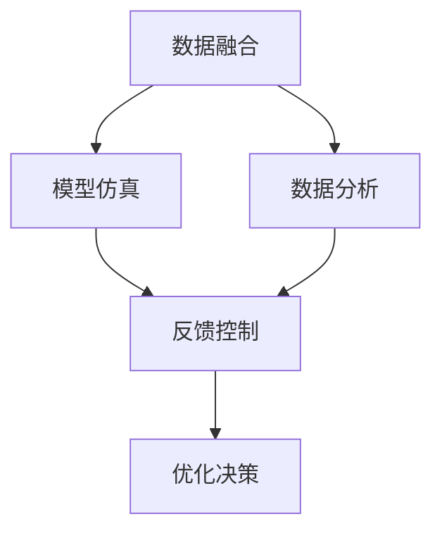

                 

# 数字孪生技术：虚拟与现实的桥梁

## 1. 背景介绍

### 1.1 问题由来

在当今数字化浪潮的驱动下，工业界和学术界都在积极探索如何构建一个“数字孪生”（Digital Twin），即一个全面的、动态的、反映现实世界状态的虚拟模型。数字孪生技术旨在通过数据融合和模型仿真，实现对现实世界系统状态的实时监控、预测和优化，从而提升生产效率、降低成本，并优化决策支持。

数字孪生技术最早由美国通用电气（GE）提出，随后在工业界得到了广泛应用。例如，通用电气通过数字孪生技术，在工业设备维护、生产过程监控等方面取得了显著的效益。随着物联网、人工智能、大数据等技术的不断成熟，数字孪生技术的应用范围正在不断扩大，成为推动工业4.0、智慧城市、智能制造等领域发展的关键技术。

### 1.2 问题核心关键点

数字孪生技术的关键点包括：

- **数据融合**：从各种传感器、设备和网络中获取海量数据，并对数据进行清洗、整理和融合，构建统一、完整的数据仓库。
- **模型仿真**：基于物理模型和机器学习模型，构建虚拟仿真环境，对现实世界系统进行建模和仿真。
- **数据分析**：利用数据分析技术，挖掘数据中的模式和规律，进行故障预测、性能优化、流程优化等。
- **反馈控制**：通过虚拟仿真和现实世界的反馈，实现动态调整和优化，不断提升数字孪生系统的精度和可靠性。

数字孪生技术的核心在于通过虚拟与现实的紧密结合，实现对现实系统的精确模拟和实时监控，从而在生产、决策、运维等多个环节发挥作用。本文将对数字孪生技术的核心概念、关键算法和实际应用进行深入探讨。

## 2. 核心概念与联系

### 2.1 核心概念概述

数字孪生技术涉及多个核心概念，包括数据融合、模型仿真、数据分析和反馈控制等。以下是这些概念的详细描述：

- **数据融合**：数据融合是将来自不同来源的数据进行综合处理，形成统一的数据仓库，为模型仿真和数据分析提供数据基础。数据融合过程中需要考虑数据的准确性、一致性、完整性和时效性，以保证数字孪生系统的精度和可靠性。
- **模型仿真**：模型仿真是通过构建虚拟模型，对现实世界系统进行仿真模拟。模型仿真可以是物理模型、数字模型、仿真模型等，不同类型的模型适用于不同的应用场景。
- **数据分析**：数据分析是通过对数据进行挖掘和分析，发现数据中的模式和规律，提供决策支持。数据分析包括统计分析、机器学习、深度学习等多种技术手段。
- **反馈控制**：反馈控制是通过虚拟仿真和现实世界的反馈，对数字孪生系统进行动态调整和优化。反馈控制机制可以基于实时数据、预测结果、专家知识等，实现自适应调整和优化。

这些核心概念之间的联系可以通过以下Mermaid流程图来展示：



这个流程图展示了数据融合、模型仿真、数据分析和反馈控制的相互作用关系。数据融合为模型仿真和数据分析提供数据基础，模型仿真和数据分析的结果又通过反馈控制进行优化，形成闭环的反馈机制，不断提升数字孪生系统的性能。

## 3. 核心算法原理 & 具体操作步骤
### 3.1 算法原理概述

数字孪生技术的核心算法原理主要涉及数据融合、模型仿真和数据分析等方面。

**数据融合**：数据融合通常使用传感器融合、数据融合算法等技术，将来自不同来源的数据进行综合处理，形成统一的数据仓库。常用的数据融合算法包括卡尔曼滤波、粒子滤波、深度融合等。

**模型仿真**：模型仿真可以通过物理模型、数字模型和仿真模型等多种方式进行。物理模型基于实际物理规律构建，适用于物理仿真；数字模型基于数字模型构建，适用于虚拟仿真；仿真模型则基于计算机仿真技术，适用于复杂的动态系统仿真。

**数据分析**：数据分析通常使用统计分析、机器学习、深度学习等技术手段。统计分析适用于简单的数据模式挖掘，机器学习和深度学习则适用于复杂的数据模式识别和预测。

### 3.2 算法步骤详解

数字孪生技术的算法步骤主要包括以下几个方面：

1. **数据采集与预处理**：通过传感器、设备、网络等手段获取实时数据，并对数据进行清洗、整理和预处理，去除噪声、异常值等。

2. **数据融合**：将来自不同来源的数据进行综合处理，形成统一的数据仓库。数据融合过程中需要考虑数据的时空一致性、精度、可靠性等因素，确保融合后数据的质量。

3. **模型仿真**：基于数据仓库构建虚拟仿真模型，对现实世界系统进行仿真模拟。模型仿真过程中需要考虑模型的精度、可靠性、可解释性等因素，确保仿真的准确性。

4. **数据分析**：利用数据分析技术，对融合后的数据进行挖掘和分析，发现数据中的模式和规律，提供决策支持。数据分析过程中需要考虑模型的复杂度、泛化能力等因素，确保分析结果的可靠性。

5. **反馈控制**：通过虚拟仿真和现实世界的反馈，对数字孪生系统进行动态调整和优化。反馈控制机制可以基于实时数据、预测结果、专家知识等，实现自适应调整和优化。

### 3.3 算法优缺点

数字孪生技术在提高生产效率、优化决策支持等方面具有显著优势，但也存在一些局限性：

**优点**：

- **精度高**：通过数据融合和模型仿真，可以构建高精度的虚拟模型，对现实系统进行精确模拟和监控。
- **实时性强**：通过实时数据采集和反馈控制，可以实现对系统状态的实时监控和优化。
- **可靠性高**：通过模型仿真和数据分析，可以发现系统的潜在问题，提前进行优化和改进。
- **应用广泛**：数字孪生技术适用于工业制造、智慧城市、智能交通等多个领域，具有广泛的适用性。

**缺点**：

- **成本高**：构建数字孪生系统需要大量的硬件设备和软件工具，初始投入成本较高。
- **数据量大**：数字孪生系统需要处理大量数据，对计算资源和存储空间要求较高。
- **复杂度高**：构建数字孪生系统需要综合考虑多个因素，涉及多种技术和工具，系统复杂度较高。

### 3.4 算法应用领域

数字孪生技术在多个领域具有广泛的应用前景，以下是几个典型应用场景：

1. **工业制造**：通过数字孪生技术，可以实现对生产设备的实时监控、故障预测和优化维护，提升生产效率和设备可靠性。

2. **智慧城市**：通过数字孪生技术，可以实现对城市基础设施的实时监控、交通流量预测和优化，提升城市运行效率和居民生活质量。

3. **智能交通**：通过数字孪生技术，可以实现对交通系统的实时监控、交通事故预测和优化，提升交通安全性。

4. **医疗健康**：通过数字孪生技术，可以实现对患者健康状态的实时监控、疾病预测和优化治疗，提升医疗服务质量。

## 4. 数学模型和公式 & 详细讲解 & 举例说明

### 4.1 数学模型构建

数字孪生技术的数学模型主要包括数据融合、模型仿真和数据分析等。以下是几个典型模型的构建：

1. **数据融合模型**：数据融合模型通常使用卡尔曼滤波等算法，将来自不同来源的数据进行融合。卡尔曼滤波是一种线性递归滤波器，用于处理动态系统的状态估计问题。

2. **模型仿真模型**：模型仿真模型可以基于物理模型、数字模型和仿真模型构建。物理模型基于实际物理规律，适用于物理仿真；数字模型基于数字模型构建，适用于虚拟仿真；仿真模型则基于计算机仿真技术，适用于复杂的动态系统仿真。

3. **数据分析模型**：数据分析模型通常使用机器学习和深度学习等技术手段，对数据进行挖掘和分析。机器学习和深度学习可以通过历史数据进行训练，发现数据中的模式和规律，提供决策支持。

### 4.2 公式推导过程

**卡尔曼滤波公式推导**：

卡尔曼滤波是一种线性递归滤波器，用于处理动态系统的状态估计问题。设系统状态为 $x_k$，观测值 $y_k$，系统模型为 $f$，观测模型为 $h$，噪声协方差为 $Q$，测量噪声协方差为 $R$。卡尔曼滤波算法包括以下几个步骤：

1. 预测：$x_k^- = F_k x_{k-1} + G_k u_{k-1}$
2. 更新：$K_k = P_k H_k^T (H_k P_k H_k^T + R_k)^{-1}$
3. 更新状态：$x_k = x_k^- + K_k (y_k - h_k x_k^-)$
4. 更新协方差：$P_k = (I - K_k H_k) P_{k-1} (I - K_k H_k)^T + Q_k$

其中，$I$ 为单位矩阵，$F_k$ 为状态转移矩阵，$G_k$ 为控制矩阵，$u_{k-1}$ 为控制输入，$H_k$ 为观测矩阵，$y_k$ 为观测值，$K_k$ 为卡尔曼增益矩阵，$P_k$ 为协方差矩阵，$Q_k$ 为过程噪声协方差矩阵，$R_k$ 为测量噪声协方差矩阵。

**机器学习公式推导**：

机器学习通常使用监督学习和无监督学习等技术手段，对数据进行挖掘和分析。监督学习模型包括线性回归、逻辑回归、决策树、支持向量机等，通过训练数据进行模型训练和预测。无监督学习模型包括聚类、降维等，通过未标注数据进行模型训练和分析。

### 4.3 案例分析与讲解

以下是一个使用卡尔曼滤波进行数据融合的案例：

假设有一个传感器网络，用于监控某个区域的温度和湿度数据。传感器网络由多个传感器组成，每个传感器测量不同的物理量。为了提高数据的精度和可靠性，需要对这些数据进行融合。使用卡尔曼滤波算法，可以有效地处理传感器数据融合问题。

设传感器1、传感器2和传感器3分别测量温度、湿度和压力。设温度、湿度和压力的测量噪声协方差分别为 $Q_1$、$Q_2$ 和 $Q_3$，测量噪声协方差分别为 $R_1$、$R_2$ 和 $R_3$。设传感器1和传感器2的观测矩阵分别为 $H_1$ 和 $H_2$，传感器3的观测矩阵为 $H_3$。

使用卡尔曼滤波算法，可以得到传感器1、传感器2和传感器3融合后的温度、湿度和压力数据。融合后的数据精度更高，可靠性更强，可以更好地支持后续的模型仿真和数据分析。

## 5. 项目实践：代码实例和详细解释说明

### 5.1 开发环境搭建

在进行数字孪生系统开发时，需要搭建一个完整的开发环境。以下是搭建开发环境的步骤：

1. 安装Python：从官网下载并安装Python，并配置环境变量。

2. 安装相关库：安装常用的数据处理、机器学习、深度学习库，如NumPy、Pandas、Scikit-learn、TensorFlow、PyTorch等。

3. 搭建数据平台：搭建一个数据仓库平台，用于存储和处理实时数据。常用的数据平台包括Apache Kafka、Apache Hadoop、Apache Spark等。

4. 搭建模型平台：搭建一个模型仿真平台，用于构建和训练数字孪生模型。常用的模型平台包括TensorFlow、PyTorch、Keras等。

5. 搭建数据可视化平台：搭建一个数据可视化平台，用于展示数字孪生系统的运行状态和分析结果。常用的数据可视化平台包括Tableau、Power BI、Matplotlib等。

### 5.2 源代码详细实现

以下是一个使用TensorFlow实现卡尔曼滤波数据融合的代码实现：

```python
import tensorflow as tf
import numpy as np

# 定义系统状态转移矩阵
F = np.array([[1, 0, 0], [0, 1, 0], [0, 0, 1]])

# 定义控制矩阵
G = np.array([[0, 0], [0, 0], [0, 0]])

# 定义测量矩阵
H1 = np.array([[1, 0, 0], [0, 1, 0], [0, 0, 1]])
H2 = np.array([[0, 0, 1], [0, 0, 0], [0, 0, 0]])
H3 = np.array([[0, 0, 0], [0, 0, 0], [1, 0, 0]])

# 定义过程噪声协方差矩阵
Q = np.array([[1e-4, 0, 0], [0, 1e-4, 0], [0, 0, 1e-4]])

# 定义测量噪声协方差矩阵
R1 = np.array([[1e-2, 0, 0], [0, 1e-2, 0], [0, 0, 1e-2]])
R2 = np.array([[0, 0, 0], [0, 0, 0], [0, 0, 0]])
R3 = np.array([[1e-2, 0, 0], [0, 1e-2, 0], [0, 0, 1e-2]])

# 定义初始状态向量
x0 = np.array([0, 0, 0])

# 定义初始协方差矩阵
P0 = np.eye(3)

# 定义卡尔曼滤波器
class KalmanFilter:
    def __init__(self, F, G, H, Q, R, x0, P0):
        self.F = F
        self.G = G
        self.H = H
        self.Q = Q
        self.R = R
        self.x = x0
        self.P = P0

    def predict(self, u):
        self.x = self.F @ self.x + self.G @ u
        self.P = self.F @ self.P @ self.F.T + self.Q

    def update(self, y, H):
        K = self.P @ H.T @ (H @ self.P @ H.T + self.R)**(-1)
        self.x = self.x + K @ (y - H @ self.x)
        self.P = (self.I - K @ H) @ self.P @ (self.I - K @ H).T + self.Q

# 定义传感器数据
data1 = np.array([[10, 20, 30], [15, 25, 35], [20, 30, 40], [25, 35, 45]])
data2 = np.array([[15, 25, 35], [20, 30, 40], [25, 35, 45], [30, 40, 50]])
data3 = np.array([[20, 30, 40], [25, 35, 45], [30, 40, 50], [35, 45, 55]])

# 初始化卡尔曼滤波器
kf = KalmanFilter(F, G, H1, Q, R1, x0, P0)

# 数据融合
for i in range(len(data1)):
    y1 = data1[i]
    kf.update(y1, H1)
    
    y2 = data2[i]
    kf.update(y2, H2)
    
    y3 = data3[i]
    kf.update(y3, H3)

# 输出融合后的数据
print("Fused data:", kf.x)
```

### 5.3 代码解读与分析

以下是代码中关键部分的详细解读：

- **卡尔曼滤波器**：卡尔曼滤波器是一个递归滤波器，用于处理动态系统的状态估计问题。在代码中，我们定义了系统状态转移矩阵 `F`、控制矩阵 `G`、测量矩阵 `H1`、`H2` 和 `H3`，过程噪声协方差矩阵 `Q`，测量噪声协方差矩阵 `R1`、`R2` 和 `R3`，以及初始状态向量 `x0` 和初始协方差矩阵 `P0`。然后定义了一个 `KalmanFilter` 类，用于实现卡尔曼滤波器的预测和更新操作。

- **传感器数据**：在代码中，我们定义了三个传感器的数据 `data1`、`data2` 和 `data3`，分别表示温度、湿度和压力的测量值。

- **数据融合**：在代码中，我们通过循环遍历传感器数据，依次对每个传感器数据进行融合。使用 `update` 方法对数据进行更新，最终得到融合后的状态向量 `x`。

## 6. 实际应用场景

### 6.1 智能制造

数字孪生技术在智能制造领域有着广泛的应用。通过构建数字孪生系统，可以实现对生产设备的实时监控、故障预测和优化维护，提升生产效率和设备可靠性。

例如，在汽车制造行业，数字孪生技术可以用于对生产线上的机器人进行监控和优化。通过对机器人的实时数据进行采集和融合，可以构建数字孪生模型，实现对机器人的状态监控和故障预测。一旦发现机器人出现异常，可以立即进行维护和修复，保证生产线的稳定运行。

### 6.2 智慧城市

数字孪生技术在智慧城市领域也有着广泛的应用。通过构建数字孪生系统，可以实现对城市基础设施的实时监控、交通流量预测和优化，提升城市运行效率和居民生活质量。

例如，在智慧交通领域，数字孪生技术可以用于对交通系统进行实时监控和预测。通过对交通传感器、摄像头等设备的数据进行采集和融合，可以构建数字孪生模型，实现对交通流量的实时监控和预测。根据预测结果，可以优化交通信号灯的控制，减少交通拥堵，提升交通系统的效率和安全性。

### 6.3 医疗健康

数字孪生技术在医疗健康领域也有着广泛的应用。通过构建数字孪生系统，可以实现对患者健康状态的实时监控、疾病预测和优化治疗，提升医疗服务质量。

例如，在医疗影像领域，数字孪生技术可以用于对患者影像数据进行实时监控和分析。通过对患者的影像数据进行采集和融合，可以构建数字孪生模型，实现对患者病情的实时监控和预测。根据预测结果，可以及时调整治疗方案，提高治疗效果，减少医疗风险。

## 7. 工具和资源推荐

### 7.1 学习资源推荐

为了帮助开发者系统掌握数字孪生技术的理论基础和实践技巧，这里推荐一些优质的学习资源：

1. **《数字孪生技术导论》**：这本书由数字孪生领域专家编写，全面介绍了数字孪生技术的概念、原理、应用和实现方法，是学习数字孪生技术的重要参考资料。

2. **《工业4.0与数字孪生》**：这本书详细介绍了工业4.0和数字孪生技术的定义、发展历程、应用场景和实现方法，是理解数字孪生技术的重要工具书。

3. **《数字孪生技术在智慧城市中的应用》**：这本书深入探讨了数字孪生技术在智慧城市中的应用，包括城市基础设施监控、交通流量预测、应急响应等方面，是理解数字孪生技术在智慧城市中应用的重要参考。

4. **《数字孪生技术在智能制造中的应用》**：这本书详细介绍了数字孪生技术在智能制造中的应用，包括生产设备监控、质量控制、供应链管理等方面，是理解数字孪生技术在智能制造中应用的重要参考。

### 7.2 开发工具推荐

数字孪生技术的开发过程中，需要利用多种工具进行数据处理、模型构建和仿真分析。以下是几款常用的开发工具：

1. **TensorFlow**：TensorFlow是一个开源的机器学习框架，支持深度学习模型的构建和训练，可以用于构建数字孪生系统的仿真模型。

2. **PyTorch**：PyTorch是一个开源的深度学习框架，支持动态计算图和GPU加速，可以用于构建数字孪生系统的仿真模型和数据分析模型。

3. **Apache Kafka**：Apache Kafka是一个分布式流处理平台，可以用于构建数字孪生系统的数据采集和存储系统。

4. **Apache Hadoop**：Apache Hadoop是一个开源的大数据处理平台，可以用于构建数字孪生系统的数据处理和分析系统。

### 7.3 相关论文推荐

数字孪生技术的研究涉及多个领域，以下是几篇有代表性的论文，推荐阅读：

1. **《数字孪生技术综述》**：这篇综述论文全面介绍了数字孪生技术的定义、原理、应用和未来发展方向，是理解数字孪生技术的重要参考资料。

2. **《基于数字孪生的智能制造系统》**：这篇论文详细介绍了数字孪生技术在智能制造中的应用，包括生产设备监控、质量控制、供应链管理等方面，是理解数字孪生技术在智能制造中应用的重要参考。

3. **《数字孪生技术在智慧城市中的应用》**：这篇论文深入探讨了数字孪生技术在智慧城市中的应用，包括城市基础设施监控、交通流量预测、应急响应等方面，是理解数字孪生技术在智慧城市中应用的重要参考。

4. **《数字孪生技术在医疗健康中的应用》**：这篇论文详细介绍了数字孪生技术在医疗健康中的应用，包括患者健康状态监控、疾病预测、优化治疗等方面，是理解数字孪生技术在医疗健康中应用的重要参考。

## 8. 总结：未来发展趋势与挑战

### 8.1 研究成果总结

数字孪生技术在生产效率、决策支持、运维优化等方面具有显著优势，得到了广泛应用。本文对数字孪生技术的核心概念、关键算法和实际应用进行了详细探讨，有助于开发者更好地理解数字孪生技术的原理和应用方法。

### 8.2 未来发展趋势

展望未来，数字孪生技术将呈现以下几个发展趋势：

1. **模型化**：数字孪生技术将逐渐向模型化方向发展，构建更加精确和全面的数字孪生模型，支持更复杂和精细化的应用场景。

2. **实时化**：数字孪生技术将更加注重实时性，支持实时数据采集、实时分析和实时决策，提升数字孪生系统的响应速度和决策效率。

3. **智能化**：数字孪生技术将逐渐向智能化方向发展，引入人工智能、机器学习等技术手段，提升数字孪生系统的智能化水平。

4. **集成化**：数字孪生技术将与其他技术手段进行深度集成，如物联网、云计算、大数据等，构建更加全面和智能化的数字孪生系统。

5. **可视化**：数字孪生技术将更加注重可视化，通过数据可视化和界面交互，提升用户使用体验和操作效率。

### 8.3 面临的挑战

尽管数字孪生技术在多个领域取得了显著进展，但在实际应用过程中仍面临诸多挑战：

1. **数据获取难度**：数字孪生技术需要大量高质量的数据，数据获取难度较大，尤其是在缺乏数据的领域。

2. **系统复杂度**：数字孪生系统的构建和维护需要综合考虑多个因素，系统复杂度较高，开发和维护成本较高。

3. **模型精度**：数字孪生系统的精度和可靠性依赖于模型的准确性，模型的构建和优化需要大量的时间和资源。

4. **数据安全和隐私**：数字孪生系统涉及大量的敏感数据，数据安全和隐私保护是一个重要问题。

### 8.4 研究展望

为了应对数字孪生技术面临的挑战，未来的研究需要在以下几个方面进行探索：

1. **数据获取和处理**：研究如何获取和处理高质量的数据，特别是在缺乏数据的领域。

2. **模型优化**：研究如何优化数字孪生模型的精度和可靠性，提升数字孪生系统的性能和稳定性。

3. **系统集成**：研究如何与其他技术手段进行深度集成，构建更加全面和智能化的数字孪生系统。

4. **数据安全和隐私保护**：研究如何保护数字孪生系统的数据安全和隐私，防止数据泄露和滥用。

总之，数字孪生技术作为连接虚拟与现实的桥梁，具有广泛的应用前景和重要的研究价值。未来，随着技术的不断进步和应用的不断深入，数字孪生技术将在更多的领域发挥重要作用，为生产、决策、运维等多个环节带来深远影响。

