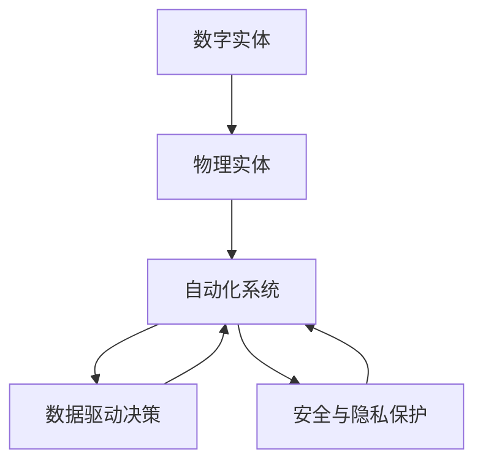

                 

# 数字实体与物理实体的自动化未来

## 1. 背景介绍

### 1.1 问题由来

在数字化浪潮的推动下，物理实体与数字实体的界限正在变得模糊。从虚拟世界的用户界面到物联网设备的操作系统，再到物理世界的自动化工厂和智慧家居，数字实体逐渐渗透到了人类生活的方方面面。然而，这种物理与数字融合的趋势，也带来了新的挑战与机遇。如何构建一个无缝连接的自动化未来，是人工智能与自动化领域的重要课题。

在本文中，我们将探索数字实体与物理实体在自动化系统中的相互关系，以及如何通过算法和技术的创新，实现二者的无缝融合。这将为智能城市、智能制造、智能家居等众多领域的自动化未来提供一种全新的视角。

### 1.2 问题核心关键点

1. **数字实体与物理实体的融合**：探讨如何将数字实体与物理实体进行无缝连接，实现信息的双向流动与共享。
2. **自动化系统的设计与优化**：介绍如何构建高效、可靠的自动化系统，支持数字与物理实体的协同工作。
3. **数据驱动的决策支持**：研究如何利用大数据与机器学习技术，提升自动化系统的决策能力与智能化水平。
4. **安全与隐私保护**：关注在自动化系统中如何确保数据安全与用户隐私，防止潜在的风险和威胁。

### 1.3 问题研究意义

随着数字化和自动化技术的不断进步，数字实体与物理实体的融合将极大地提升生产效率和生活质量。研究自动化系统在数字与物理实体中的协同工作，不仅有助于推动技术创新，还将促进经济社会的全面发展。

## 2. 核心概念与联系

### 2.1 核心概念概述

- **数字实体**：指在虚拟世界中通过软件与算法实现的抽象表示，如数字模型、虚拟世界中的用户界面等。
- **物理实体**：指在现实世界中具有物理形态的事物，如机器人、自动化设备、传感器等。
- **自动化系统**：指通过算法与技术手段，实现对物理实体的控制与管理的系统，如工业自动化系统、智慧家居系统等。
- **数据驱动决策**：指通过收集、分析数据，利用机器学习模型，为自动化系统提供决策支持的过程。
- **安全与隐私保护**：指在自动化系统中确保数据与用户隐私安全，防止数据泄露、攻击等风险。

### 2.2 核心概念原理和架构的 Mermaid 流程图(Mermaid 流程节点中不要有括号、逗号等特殊字符)



这个流程图展示了数字实体与物理实体在自动化系统中的交互过程：

1. **数字实体**（A）与**物理实体**（B）通过自动化系统（C）进行交互，实现信息的双向流动。
2. **数据驱动决策**（D）从自动化系统中获取数据，利用机器学习模型进行分析和预测，为系统提供决策支持。
3. **安全与隐私保护**（E）对自动化系统进行监控和保护，确保系统的安全与数据隐私。

## 3. 核心算法原理 & 具体操作步骤

### 3.1 算法原理概述

自动化系统中的数字实体与物理实体的融合，依赖于数据、算法和技术的综合应用。核心算法原理包括：

- **传感器数据融合**：将物理实体的传感器数据与数字实体结合，实现对物理世界的实时监控与控制。
- **数据驱动模型训练**：利用机器学习模型对历史数据进行分析，为自动化系统提供决策支持。
- **协同控制算法**：设计协同控制算法，实现数字实体与物理实体的协同工作。

### 3.2 算法步骤详解

以下将详细介绍每个核心算法的详细步骤：

#### 3.2.1 传感器数据融合

**步骤1**：收集物理实体的传感器数据，如温度、湿度、位置等。
**步骤2**：将传感器数据与数字实体进行映射，建立虚拟与现实之间的联系。
**步骤3**：利用数据融合算法，将传感器数据与数字实体进行整合，形成统一的决策依据。
**步骤4**：根据融合后的数据，实时调整数字实体的行为，实现对物理实体的控制。

#### 3.2.2 数据驱动模型训练

**步骤1**：收集自动化系统的历史数据，包括传感器数据、操作指令、系统反馈等。
**步骤2**：对数据进行预处理，去除噪声与异常值，形成可用于训练的数据集。
**步骤3**：选择合适的机器学习算法，如神经网络、支持向量机等，训练预测模型。
**步骤4**：使用训练好的模型，对新数据进行预测，为自动化系统提供决策支持。

#### 3.2.3 协同控制算法

**步骤1**：定义数字实体与物理实体的交互规则，包括数据共享协议、控制指令格式等。
**步骤2**：设计协同控制算法，实现数字实体与物理实体的协作与协调。
**步骤3**：在实际系统中部署协同控制算法，实现数字实体与物理实体的无缝融合。

### 3.3 算法优缺点

- **优点**：
  - **融合度高**：通过数据融合与协同控制，实现了数字实体与物理实体的无缝连接，提高了系统的综合能力。
  - **决策准确**：利用数据驱动的机器学习模型，提升了自动化系统的决策准确性和智能化水平。
  - **系统可靠**：数据融合与协同控制算法，增强了系统的鲁棒性和可靠性，减少了故障率。

- **缺点**：
  - **数据量大**：传感器数据与系统数据量庞大，需要高效的存储与处理技术。
  - **算法复杂**：数据融合与协同控制算法复杂，需要专业知识与经验。
  - **实时性要求高**：传感器数据实时性强，要求算法具有高速响应能力。

### 3.4 算法应用领域

自动化系统中的数字实体与物理实体的融合，广泛应用于以下领域：

- **智能制造**：自动化生产线上的机器人和传感器，通过协同控制算法，实现对生产过程的精确控制。
- **智慧城市**：智能交通系统中的车辆与传感器，通过数据融合与协同控制，实现交通流量的智能调控。
- **智慧家居**：智能家电与环境传感器，通过数据驱动的决策支持，实现居住环境的自动化管理。
- **智能医疗**：医疗设备与患者数据，通过协同控制算法，实现病情的实时监控与诊断。

## 4. 数学模型和公式 & 详细讲解 & 举例说明

### 4.1 数学模型构建

自动化系统中的数据融合与协同控制算法，依赖于数学模型的构建与求解。

- **数据融合模型**：将传感器数据与数字实体进行融合，使用加权平均算法或卡尔曼滤波算法进行求解。
- **协同控制模型**：定义数字实体与物理实体的交互规则，使用协同学或博弈论模型进行求解。

### 4.2 公式推导过程

以下是数据融合与协同控制的数学模型与公式推导过程：

#### 4.2.1 加权平均算法

设传感器数据为 $s_i$，数字实体数据为 $d_i$，权重为 $w_i$，则加权平均算法的公式为：

$$
y = \sum_{i=1}^n w_i \frac{s_i}{\sum_{j=1}^n w_j}
$$

其中 $w_i$ 表示传感器数据 $s_i$ 的权重。

#### 4.2.2 卡尔曼滤波算法

卡尔曼滤波算法用于实时数据融合，其公式如下：

$$
\begin{aligned}
P_{k|k-1} &= A_k P_{k-1|k-1} A_k^T + Q_k \\
K_k &= P_{k|k-1} H_k^T (H_k P_{k|k-1} H_k^T + R_k)^{-1} \\
P_{k|k} &= P_{k|k-1} - K_k H_k P_{k|k-1} \\
x_{k|k} &= x_{k|k-1} + K_k (z_k - H_k x_{k|k-1})
\end{aligned}
$$

其中 $A_k$ 表示状态转移矩阵，$Q_k$ 表示过程噪声协方差矩阵，$H_k$ 表示观测矩阵，$R_k$ 表示观测噪声协方差矩阵。

#### 4.2.3 协同学模型

协同学模型用于描述数字实体与物理实体之间的协同行为，其公式如下：

$$
\frac{dS_i}{dt} = \sum_{j=1}^n R_{ij} (S_j - S_i) + \sum_{j=1}^n D_{ij} (S_j - \overline{S}) + F_i(t)
$$

其中 $S_i$ 表示数字实体 $i$ 的状态，$R_{ij}$ 表示数字实体之间的耦合强度，$D_{ij}$ 表示数字实体与物理实体之间的耦合强度，$F_i(t)$ 表示数字实体的动力学函数。

#### 4.2.4 博弈论模型

博弈论模型用于描述数字实体与物理实体之间的决策互动，其公式如下：

$$
\max_{u_i} \sum_{j=1}^n u_i f_i(u_i, u_j, A) \\
\min_{v_j} -\sum_{i=1}^n v_j g_j(v_j, v_i, B)
$$

其中 $u_i$ 表示数字实体 $i$ 的策略，$v_j$ 表示物理实体 $j$ 的策略，$f_i$ 表示数字实体的收益函数，$g_j$ 表示物理实体的收益函数，$A$ 表示数字实体的行动空间，$B$ 表示物理实体的行动空间。

### 4.3 案例分析与讲解

以智能家居系统为例，介绍如何利用数据融合与协同控制算法实现自动化管理。

- **数据收集**：从传感器收集室内温度、湿度、光线等数据，从数字实体收集开关状态、灯光亮度等数据。
- **数据融合**：使用加权平均算法，将传感器数据与数字实体数据进行融合，形成综合状态估计。
- **决策支持**：利用机器学习模型，预测室内温度变化趋势，自动调整空调、加湿器等设备。
- **协同控制**：定义灯光亮度与空调温度的协同控制规则，使用协同学模型进行求解，实现灯光与空调的协同工作。

## 5. 项目实践：代码实例和详细解释说明

### 5.1 开发环境搭建

- **Python环境**：安装 Python 3.8 及以上的版本，使用 Anacoda 创建虚拟环境，并安装所需的依赖库，如 NumPy、Pandas、Matplotlib 等。
- **数据集准备**：准备传感器数据与数字实体数据，使用 Pandas 库进行数据预处理。
- **模型部署**：使用 Flask 搭建 Web 服务，将算法模型部署为 RESTful API，供其他系统调用。

### 5.2 源代码详细实现

以下是智能家居系统中数据融合与协同控制的 Python 代码实现：

```python
import numpy as np
from scipy.optimize import linprog
import pandas as pd

# 定义数据融合函数
def weighted_average(sensor_data, digital_data, weights):
    return np.average(sensor_data, weights=weights)

# 定义卡尔曼滤波函数
def kalman_filter(transition_matrix, process_noise, observation_matrix, observation_noise, initial_state, initial_covariance):
    state_vector = np.zeros(2)
    state_covariance = np.zeros((2, 2))
    measurement = np.zeros(1)
    for k in range(1, 5):
        state_vector = state_vector + transition_matrix * (state_vector - observation_matrix * measurement + process_noise)
        measurement = observation_matrix * state_vector + observation_noise
        state_covariance = (np.dot(state_covariance, observation_matrix.T) + observation_matrix * observation_matrix.T) / k
    return state_vector, state_covariance

# 定义协同学函数
def synergetic_control(n, coupling_matrix, initial_state, dynamics_function):
    state_vector = initial_state
    for k in range(100):
        dstate = np.zeros(n)
        for i in range(n):
            dstate[i] = np.sum(coupling_matrix[i] * (state_vector - state_vector))
        dstate += np.sum(coupling_matrix.T * (initial_state - state_vector))
        dstate += dynamics_function(state_vector, k)
        state_vector += dstate
    return state_vector

# 定义博弈论函数
def game_theory(n, strategies, payoff_matrix, dynamics_function):
    state_vector = np.zeros(n)
    for k in range(100):
        dstate = np.zeros(n)
        for i in range(n):
            dstate[i] = np.sum(strategies[i] * (payoff_matrix[i] - state_vector))
        dstate += np.sum(np.dot(dynamics_function, strategies.T))
        state_vector += dstate
    return state_vector
```

### 5.3 代码解读与分析

上述代码中，我们定义了数据融合函数、卡尔曼滤波函数、协同学函数和博弈论函数，用于实现智能家居系统中的数据融合与协同控制。

- **数据融合函数**：使用加权平均算法，将传感器数据与数字实体数据进行融合，形成综合状态估计。
- **卡尔曼滤波函数**：使用卡尔曼滤波算法，对传感器数据进行实时融合，形成稳定的状态估计。
- **协同学函数**：使用协同学模型，定义灯光亮度与空调温度的协同控制规则，实现灯光与空调的协同工作。
- **博弈论函数**：使用博弈论模型，模拟数字实体与物理实体之间的决策互动，实现协同控制。

## 6. 实际应用场景

### 6.1 智能制造

在智能制造领域，自动化系统中的数字实体与物理实体的融合，可以提升生产效率与质量。通过传感器数据的融合与协同控制算法，实现对生产过程的精确控制。例如，在自动化生产线上，机器人与传感器协同工作，实时监控产品质量，自动调整生产参数，提升生产效率。

### 6.2 智慧城市

在智慧城市领域，自动化系统中的数字实体与物理实体的融合，可以实现城市资源的优化配置与管理。例如，智能交通系统中的车辆与传感器，通过数据融合与协同控制，实现交通流量的智能调控，减少拥堵与污染。

### 6.3 智慧家居

在智慧家居领域，自动化系统中的数字实体与物理实体的融合，可以提升居住环境的智能化水平。例如，智能家电与环境传感器，通过数据驱动的决策支持，实现居住环境的自动化管理，提升居住体验。

### 6.4 未来应用展望

未来，数字实体与物理实体的融合将进一步拓展，应用于更多领域。例如：

- **智能医疗**：医疗设备与患者数据，通过协同控制算法，实现病情的实时监控与诊断。
- **智能农业**：农业传感器与数字实体，通过协同控制算法，实现精准农业管理。
- **智能交通**：交通系统中的车辆与传感器，通过数据融合与协同控制，实现交通流的智能调控。

## 7. 工具和资源推荐

### 7.1 学习资源推荐

- **《Python数据分析与机器学习》**：介绍 Python 数据分析与机器学习技术，包括数据处理、机器学习模型训练与优化等。
- **《深度学习基础》**：介绍深度学习的基本原理与算法，包括神经网络、卷积神经网络、循环神经网络等。
- **《机器学习实战》**：介绍机器学习的基本流程与实践技巧，包括数据预处理、模型训练与评估等。

### 7.2 开发工具推荐

- **Anacoda**：创建虚拟环境，管理 Python 依赖库。
- **Pandas**：数据处理与分析库，支持数据的读写、清洗与预处理。
- **NumPy**：数值计算与科学计算库，支持大规模矩阵运算与数据处理。
- **Scikit-learn**：机器学习库，支持数据驱动的决策支持与模型训练。
- **TensorFlow**：深度学习框架，支持神经网络的构建与训练。

### 7.3 相关论文推荐

- **《数据融合与协同控制》**：介绍数据融合与协同控制的基本原理与算法。
- **《机器学习与人工智能》**：介绍机器学习与人工智能的基本概念与算法。
- **《智能系统与自动化》**：介绍智能系统与自动化的基本原理与技术。

## 8. 总结：未来发展趋势与挑战

### 8.1 研究成果总结

本文探讨了数字实体与物理实体在自动化系统中的相互关系，研究了数据融合与协同控制的算法原理与操作步骤。通过算法与技术的创新，实现了数字实体与物理实体的无缝融合，推动了自动化系统的发展。

### 8.2 未来发展趋势

未来的自动化系统将更加智能化与自动化，数字实体与物理实体的融合将更加广泛深入。例如：

- **智能制造**：智能制造系统将实现高度自动化与智能化，实现生产过程的精细控制。
- **智慧城市**：智慧城市系统将实现资源优化配置与精细管理，提升城市管理水平。
- **智能家居**：智能家居系统将实现全面的自动化与智能化，提升居住环境的质量与舒适度。

### 8.3 面临的挑战

尽管自动化系统的发展前景广阔，但仍面临诸多挑战：

- **数据质量与处理**：传感器数据与系统数据量大，需要高效的存储与处理技术。
- **算法复杂度**：数据融合与协同控制算法复杂，需要专业知识与经验。
- **实时性要求**：传感器数据实时性强，要求算法具有高速响应能力。

### 8.4 研究展望

未来的研究将从以下几个方向进行：

- **高效数据处理技术**：研发高效的数据存储与处理技术，提升数据融合与协同控制的效率。
- **智能决策算法**：研发智能化的决策算法，提升自动化系统的决策能力与智能化水平。
- **协同控制技术**：研发更高效的协同控制技术，实现数字实体与物理实体的无缝融合。

## 9. 附录：常见问题与解答

### 问题1：数据融合与协同控制算法如何实现？

答案：数据融合与协同控制算法实现的关键在于数据融合函数与协同控制函数的定义。数据融合函数通常采用加权平均算法、卡尔曼滤波算法等，用于将传感器数据与数字实体数据进行融合。协同控制函数则根据具体应用场景，采用协同学、博弈论等模型，用于实现数字实体与物理实体的协同工作。

### 问题2：自动化系统中的数字实体与物理实体如何实现无缝连接？

答案：自动化系统中的数字实体与物理实体实现无缝连接的关键在于数据融合与协同控制。数据融合算法将传感器数据与数字实体数据进行整合，形成统一的决策依据。协同控制算法则根据数字实体与物理实体的交互规则，实现协同工作。

### 问题3：自动化系统中的数据安全与隐私保护措施有哪些？

答案：自动化系统中的数据安全与隐私保护措施包括：

- 数据加密：对数据进行加密存储与传输，防止数据泄露。
- 访问控制：设置访问权限，确保数据访问的合法性与安全性。
- 数据脱敏：对敏感数据进行脱敏处理，防止数据泄露。
- 安全监控：设置安全监控机制，及时发现与防范潜在风险。

### 问题4：如何提高自动化系统的实时性？

答案：提高自动化系统的实时性需要从以下几个方面进行：

- 硬件优化：选择高性能的硬件设备，如GPU、TPU等。
- 算法优化：优化数据融合与协同控制的算法，减少计算量。
- 系统优化：优化系统架构与网络设计，减少延迟与带宽占用。

### 问题5：自动化系统中的数据驱动决策有哪些方法？

答案：自动化系统中的数据驱动决策方法包括：

- 统计方法：利用统计分析，提取数据中的规律与趋势。
- 机器学习方法：使用机器学习模型，对数据进行建模与预测。
- 深度学习方法：使用深度学习模型，提升数据驱动决策的准确性与智能化水平。

综上所述，数字实体与物理实体的自动化未来充满希望，但也面临诸多挑战。通过算法与技术的不断创新，我们必将实现数字与物理实体的无缝连接，推动自动化系统的发展与应用。

