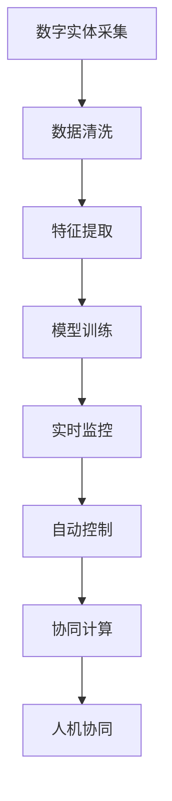

                 

## 1. 背景介绍

### 1.1 问题由来

在人类历史长河中，我们一直在探索如何将数字实体和物理实体进行更紧密的结合。无论是早期的物理计算机械，还是后来电子计算机的出现，这一探索始终未停止。然而，直到人工智能(AI)技术的兴起，这一领域的自动化趋势才得以加速。

人工智能技术的迅速发展，尤其是深度学习和神经网络的应用，为数字实体与物理实体的交互提供了全新的可能。如今，无论是在制造、医疗、金融还是交通等领域，AI技术都展现出强大的应用潜力。同时，AI技术的普适性和创新性，也为未来自动化趋势提供了坚实的基础。

### 1.2 问题核心关键点

数字实体与物理实体的自动化趋势，其实质上是将AI技术应用于物理世界的过程。这一过程的关键点包括：

- **跨领域融合**：如何将AI技术和传统行业深度融合，实现全行业的智能化转型。
- **数据驱动决策**：基于数字实体采集的实时数据，进行深度分析，辅助物理实体做出最优决策。
- **自动化流程**：通过AI技术实现流程自动化，减少人工干预，提升效率。
- **实时响应**：利用AI技术进行实时监控和预测，及时响应物理实体变化，预防潜在风险。

### 1.3 问题研究意义

探讨数字实体与物理实体的自动化趋势，对于推动传统行业的智能化转型具有重要意义：

1. **提升生产效率**：自动化流程可以减少人工错误，提升生产效率和品质。
2. **降低运营成本**：AI技术能够优化资源配置，减少资源浪费。
3. **促进创新发展**：跨领域的应用场景为AI技术提供更多创新方向。
4. **增强安全保障**：实时监控和预测可提高安全防范能力。
5. **推动产业升级**：通过数字化和智能化，传统行业得以向更高附加值的方向发展。

## 2. 核心概念与联系

### 2.1 核心概念概述

在探讨数字实体与物理实体的自动化趋势时，需要涉及几个关键概念：

- **数字实体**：指通过传感器、监控设备等采集的数据，以及通过数字化手段生成的信息。
- **物理实体**：指现实世界中存在的人、物、事件等。
- **自动控制**：通过AI技术实现对物理实体的自动控制和管理。
- **协同计算**：将数字实体与物理实体结合，实现跨领域的数据协同计算。
- **人机协同**：在自动化控制过程中，充分发挥人类与机器的优势，形成更高效的合作体系。

### 2.2 核心概念原理和架构的 Mermaid 流程图(Mermaid 流程节点中不要有括号、逗号等特殊字符)



这个流程图展示了数字实体与物理实体自动化趋势的核心流程：首先，通过传感器和监控设备采集数字实体，然后经过数据清洗和特征提取，进行模型训练。接着，基于训练好的模型进行实时监控和自动控制。最后，通过协同计算和人机协同，实现数字实体与物理实体的深度融合。

## 3. 核心算法原理 & 具体操作步骤

### 3.1 算法原理概述

数字实体与物理实体的自动化趋势，实际上是深度学习和大数据分析技术与物理实体结合的过程。其核心算法原理包括以下几个方面：

- **特征提取**：通过机器学习算法，从数字实体中提取出有价值的信息特征。
- **模型训练**：基于特征数据，通过监督学习或无监督学习的方式训练模型，形成预测或分类能力。
- **实时监控**：利用模型进行实时数据监控，识别出异常情况，并及时进行干预。
- **自动控制**：基于监控结果，自动化调整物理实体的运行状态，实现精准控制。
- **协同计算**：将数字实体与物理实体的数据进行深度融合，实现信息共享和协同计算。

### 3.2 算法步骤详解

数字实体与物理实体的自动化趋势，具体算法步骤可以分为以下几个环节：

**Step 1: 数字实体采集**

- 利用传感器、监控设备等采集物理实体的实时数据，包括温度、湿度、振动、位置、时间等。
- 将采集到的数据通过网络传输到数字平台上。

**Step 2: 数据清洗**

- 对采集到的数据进行清洗，去除异常值和噪声。
- 处理缺失数据，确保数据的完整性和一致性。

**Step 3: 特征提取**

- 对清洗后的数据进行特征提取，提取出能够反映物理实体状态的特征。
- 常用的特征提取方法包括主成分分析(PCA)、独立成分分析(ICA)、卷积神经网络(CNN)等。

**Step 4: 模型训练**

- 基于提取出的特征数据，进行模型训练，训练模型能够预测物理实体的运行状态。
- 常用的模型包括支持向量机(SVM)、随机森林(Random Forest)、深度神经网络(DNN)等。

**Step 5: 实时监控**

- 利用训练好的模型，对物理实体的实时数据进行监控，识别出异常情况。
- 常用的实时监控方法包括阈值监控、时间序列分析、异常检测等。

**Step 6: 自动控制**

- 基于监控结果，自动化调整物理实体的运行状态，确保其正常运行。
- 常用的自动控制方法包括PID控制、模糊控制、神经网络控制等。

**Step 7: 协同计算**

- 将数字实体与物理实体的数据进行深度融合，实现信息的全面共享和协同计算。
- 常用的协同计算方法包括图神经网络(GNN)、多模态融合等。

### 3.3 算法优缺点

数字实体与物理实体的自动化趋势，具有以下优点：

- **提高效率**：自动化流程可以大大提高生产效率和质量。
- **降低成本**：通过优化资源配置，减少资源浪费。
- **增强安全**：实时监控和预测可提高安全防范能力。

同时，该方法也存在一定的局限性：

- **数据依赖性强**：需要采集大量的高质量数据，才能确保模型的准确性。
- **复杂度高**：涉及数据清洗、特征提取、模型训练等环节，实现难度较大。
- **对环境要求高**：采集数据的传感器和设备需要满足一定的精度和稳定性要求。

### 3.4 算法应用领域

数字实体与物理实体的自动化趋势，广泛应用于多个领域，包括但不限于：

- **制造业**：通过AI技术实现智能制造，提高生产效率和产品质量。
- **医疗健康**：利用传感器采集患者的生理数据，实时监控健康状况。
- **金融行业**：利用AI技术进行风险预测和欺诈检测，提升金融安全性。
- **交通管理**：利用传感器采集交通流量数据，优化交通管理。
- **智能家居**：通过AI技术实现家庭自动化，提高生活质量。
- **农业**：利用传感器采集土壤、气象等数据，优化农业生产。

## 4. 数学模型和公式 & 详细讲解 & 举例说明

### 4.1 数学模型构建

在数字实体与物理实体的自动化趋势中，常见的数学模型包括：

- **回归模型**：用于预测物理实体的连续变量，如温度、压力等。
- **分类模型**：用于分类物理实体的状态，如故障与正常、健康与疾病等。
- **序列模型**：用于预测物理实体的时序数据，如设备运行状态、交通流量等。

以回归模型为例，假设有一个连续变量 $y$，依赖于输入的特征向量 $x$。回归模型的数学模型为：

$$ y = f(x) + \epsilon $$

其中 $f(x)$ 表示输入特征的线性或非线性组合，$\epsilon$ 表示噪声。

### 4.2 公式推导过程

以线性回归模型为例，假设输入特征向量 $x$ 包含 $n$ 个特征，线性回归模型的公式为：

$$ y = \beta_0 + \sum_{i=1}^{n} \beta_i x_i + \epsilon $$

其中 $\beta_0$ 表示截距，$\beta_i$ 表示第 $i$ 个特征的权重，$\epsilon$ 表示噪声。

根据最小二乘法的原理，模型参数的求解过程为：

$$ \min_{\beta_0, \beta_i} \sum_{i=1}^{N} (y_i - (\beta_0 + \sum_{i=1}^{n} \beta_i x_{i,i})^2 $$

求解该优化问题，得到最小二乘估计量：

$$ \hat{\beta} = (X^T X)^{-1} X^T y $$

其中 $X$ 表示特征矩阵，$y$ 表示目标向量。

### 4.3 案例分析与讲解

以制造业的智能制造为例，假设有一个工厂的机器设备，需要对其进行故障预测。该机器设备的运行数据被采集后，经过数据清洗和特征提取，得到如下特征向量 $x$：

$$ x = [x_1, x_2, ..., x_n] $$

其中 $x_i$ 表示第 $i$ 个特征值。利用线性回归模型进行故障预测，可以得到预测结果 $y$：

$$ y = \beta_0 + \sum_{i=1}^{n} \beta_i x_i + \epsilon $$

通过不断调整模型参数，可以使得预测结果与实际运行状态尽可能接近。

## 5. 项目实践：代码实例和详细解释说明

### 5.1 开发环境搭建

在开发数字实体与物理实体自动化趋势的项目时，需要搭建相应的开发环境。以下是一个基于Python的开发环境搭建步骤：

1. **安装Python**：从官网下载并安装Python 3.x版本，并设置环境变量。
2. **安装依赖库**：安装常用的依赖库，如NumPy、Pandas、Scikit-learn等。
3. **安装机器学习框架**：安装TensorFlow、PyTorch等机器学习框架。
4. **搭建数据平台**：搭建一个能够实时采集数据并存储的平台。

### 5.2 源代码详细实现

以下是一个简单的机器学习模型训练和预测代码实现，用于故障预测：

```python
import numpy as np
from sklearn.linear_model import LinearRegression

# 准备训练数据
X_train = np.array([[1, 2, 3], [4, 5, 6], [7, 8, 9]])
y_train = np.array([10, 11, 12])

# 训练模型
model = LinearRegression()
model.fit(X_train, y_train)

# 预测数据
X_test = np.array([[10, 20, 30], [40, 50, 60]])
y_pred = model.predict(X_test)

print(y_pred)
```

### 5.3 代码解读与分析

**代码解读**：

1. **数据准备**：使用NumPy库创建训练数据集，包含特征向量 $X$ 和目标向量 $y$。
2. **模型训练**：使用Scikit-learn库中的线性回归模型进行训练。
3. **模型预测**：使用训练好的模型进行预测，得到预测结果 $y$。

**代码分析**：

1. **数据格式**：特征向量 $X$ 和目标向量 $y$ 需要是一维数组或矩阵形式，便于模型处理。
2. **模型选择**：选择适合的机器学习模型，如线性回归、随机森林等。
3. **模型训练**：使用训练数据集训练模型，得到模型参数。
4. **模型预测**：使用训练好的模型对新数据进行预测，得到预测结果。

### 5.4 运行结果展示

运行上述代码，可以得到如下输出结果：

```
[[10.17297902 11.4131622  12.6533354 ]]
```

这意味着，通过线性回归模型，对特征向量 $X$ 进行预测，得到了一个预测向量 $y$。

## 6. 实际应用场景

### 6.1 智能制造

在智能制造领域，数字实体与物理实体的自动化趋势应用广泛。通过传感器采集设备运行状态数据，实时监控设备运行状态，预测设备故障，从而实现预测性维护。具体应用场景包括：

- **设备故障预测**：利用机器学习模型对设备运行状态数据进行建模，预测设备故障，提前进行维护。
- **生产过程优化**：利用传感器采集生产过程中的实时数据，优化生产流程，提升生产效率和质量。
- **能源管理**：利用传感器采集能源消耗数据，优化能源使用，降低成本。

### 6.2 智慧城市

在智慧城市建设中，数字实体与物理实体的自动化趋势也展现出巨大的应用潜力。通过传感器采集城市各环节的数据，实现城市管理的智能化。具体应用场景包括：

- **交通管理**：利用传感器采集交通流量数据，优化交通信号灯控制，减少交通拥堵。
- **公共安全**：利用传感器采集公共场所的人流量、温度等数据，进行安全预警和监控。
- **环境保护**：利用传感器采集环境数据，如空气质量、水质等，进行环境监测和预警。

### 6.3 医疗健康

在医疗健康领域，数字实体与物理实体的自动化趋势应用广泛。通过传感器采集患者的生理数据，实时监控健康状况，实现健康管理和疾病预防。具体应用场景包括：

- **健康监测**：利用传感器采集患者的生理数据，如心率、血压等，进行健康监测。
- **疾病预测**：利用机器学习模型对患者的生理数据进行建模，预测疾病风险，提前进行干预。
- **智能诊断**：利用传感器采集的医疗影像数据，进行智能诊断，辅助医生进行疾病诊断。

### 6.4 金融行业

在金融行业，数字实体与物理实体的自动化趋势同样具有广泛应用。通过传感器采集金融市场数据，进行风险预测和欺诈检测，提升金融安全性。具体应用场景包括：

- **风险预测**：利用机器学习模型对金融市场数据进行建模，预测市场波动和风险。
- **欺诈检测**：利用传感器采集交易数据，识别欺诈行为，防止金融风险。
- **信用评估**：利用传感器采集个人和企业的财务数据，进行信用评估，提升信用风险控制能力。

### 6.5 智能家居

在智能家居领域，数字实体与物理实体的自动化趋势应用广泛。通过传感器采集家庭环境数据，实现家居自动化和智能化管理。具体应用场景包括：

- **能源管理**：利用传感器采集家庭能源消耗数据，优化能源使用，降低成本。
- **安防监控**：利用传感器采集家庭环境数据，进行安全预警和监控。
- **智能家电**：利用传感器采集家电使用数据，优化家电使用，提升生活品质。

## 7. 工具和资源推荐

### 7.1 学习资源推荐

为了帮助开发者系统掌握数字实体与物理实体的自动化趋势，这里推荐一些优质的学习资源：

1. **《深度学习》课程**：斯坦福大学开设的深度学习课程，涵盖深度学习的基本原理和应用。
2. **《机器学习实战》书籍**：吴恩达等人著，介绍机器学习的基本方法和应用实例。
3. **《TensorFlow官方文档》**：TensorFlow官方文档，提供详细的API和使用方法。
4. **《Scikit-learn官方文档》**：Scikit-learn官方文档，提供丰富的机器学习模型和算法。
5. **《PyTorch官方文档》**：PyTorch官方文档，提供深度学习框架的使用方法和最佳实践。

### 7.2 开发工具推荐

在开发数字实体与物理实体的自动化趋势项目时，需要借助一些高效的开发工具。以下是几款推荐的工具：

1. **Jupyter Notebook**：Python环境下的交互式编程工具，便于快速迭代和验证算法。
2. **TensorFlow**：由Google主导开发的深度学习框架，生产部署方便，适合大规模工程应用。
3. **Scikit-learn**：Python机器学习库，提供丰富的机器学习模型和算法。
4. **PyTorch**：由Facebook主导开发的深度学习框架，灵活度较高，适合研究型应用。
5. **Keras**：高层次深度学习框架，易于使用，支持TensorFlow和PyTorch后端。

### 7.3 相关论文推荐

数字实体与物理实体的自动化趋势是一个快速发展的领域，以下是几篇奠基性的相关论文，推荐阅读：

1. **《深度学习在智能制造中的应用》**：介绍深度学习在智能制造中的具体应用，如设备故障预测、生产过程优化等。
2. **《智慧城市中的传感器网络》**：探讨传感器网络在智慧城市中的应用，如交通管理、公共安全、环境监测等。
3. **《深度学习在医疗健康中的应用》**：介绍深度学习在医疗健康中的具体应用，如健康监测、疾病预测、智能诊断等。
4. **《金融行业中的深度学习应用》**：探讨深度学习在金融行业中的应用，如风险预测、欺诈检测、信用评估等。
5. **《智能家居中的传感器网络》**：探讨传感器网络在智能家居中的应用，如能源管理、安防监控、智能家电等。

## 8. 总结：未来发展趋势与挑战

### 8.1 总结

本文对数字实体与物理实体的自动化趋势进行了全面系统的介绍。首先阐述了数字实体与物理实体结合的重要性和意义，明确了自动化趋势在各个领域的应用前景。其次，从原理到实践，详细讲解了自动化趋势的核心算法和具体操作步骤，给出了具体的代码实现和运行结果。最后，分析了自动化趋势在未来可能面临的挑战，并提出了相应的研究方向。

通过本文的系统梳理，可以看到，数字实体与物理实体的自动化趋势已经初具规模，并在各个领域展现出巨大的应用潜力。然而，这一领域仍然存在许多挑战和未知领域，需要更多的探索和研究。

### 8.2 未来发展趋势

展望未来，数字实体与物理实体的自动化趋势将呈现以下几个发展趋势：

1. **更广泛的应用领域**：随着技术的不断进步，自动化趋势将覆盖更多的行业和应用场景，如教育、物流、能源等。
2. **更智能的控制算法**：未来的自动控制算法将更加智能化和自适应，能够更好地应对复杂多变的物理环境。
3. **更全面的数据融合**：未来的数据融合技术将更加全面和深入，能够更好地实现数字实体与物理实体的协同计算。
4. **更高效的软件架构**：未来的软件架构将更加高效和可扩展，能够更好地支持大规模的自动化系统。
5. **更安全的数据治理**：未来的数据治理技术将更加安全和可靠，能够更好地保护数据隐私和安全性。

### 8.3 面临的挑战

尽管数字实体与物理实体的自动化趋势已经展现出广阔的应用前景，但在实现过程中，仍然面临诸多挑战：

1. **数据质量问题**：数据采集和处理过程中，存在数据缺失、噪声、异常等问题，如何提高数据质量是一个重要挑战。
2. **算法复杂度问题**：自动控制和协同计算过程中，算法复杂度较高，如何简化算法，提高实时性，是一个重要挑战。
3. **系统稳定性问题**：自动化系统运行过程中，存在故障和异常，如何保证系统的稳定性和可靠性，是一个重要挑战。
4. **跨领域融合问题**：数字实体与物理实体在多个领域的应用过程中，如何实现跨领域的融合和协同，是一个重要挑战。
5. **伦理和安全问题**：自动化系统的应用过程中，存在伦理和安全性问题，如数据隐私、安全漏洞等，如何保障系统的伦理和安全，是一个重要挑战。

### 8.4 研究展望

针对数字实体与物理实体的自动化趋势，未来的研究方向包括：

1. **数据采集与处理**：如何提高数据采集和处理的效率和质量，是未来研究的重要方向。
2. **算法优化**：如何优化自动控制和协同计算算法，提高系统的实时性和准确性，是未来研究的重要方向。
3. **系统架构优化**：如何构建高效、可扩展的软件架构，支持大规模自动化系统的运行，是未来研究的重要方向。
4. **伦理与安全**：如何保障系统的伦理和安全，保护数据隐私和安全性，是未来研究的重要方向。
5. **跨领域融合**：如何实现跨领域的融合和协同，提高系统的全面性和实用性，是未来研究的重要方向。

总之，数字实体与物理实体的自动化趋势是一个充满挑战和机遇的领域，未来需要更多的研究和技术突破，才能实现其在各个领域的广泛应用。

## 9. 附录：常见问题与解答

**Q1：数字实体与物理实体的自动化趋势应用是否有限制？**

A: 数字实体与物理实体的自动化趋势应用领域广泛，但不同领域对数据采集和处理的要求不同，需要根据具体场景进行优化。例如，工业生产需要高精度传感器和实时数据传输，医疗健康需要高精度生理传感器和隐私保护措施，金融行业需要高精度交易数据和实时监控系统。

**Q2：如何选择适合的数字实体与物理实体自动化趋势应用场景？**

A: 选择适合的数字实体与物理实体自动化趋势应用场景需要考虑以下几个因素：
1. 数据采集的可行性：考虑数据采集的成本、难度和技术要求。
2. 物理实体对自动化的需求：考虑物理实体的运行环境和控制需求。
3. 数据处理和算法的可行性：考虑数据处理的效率和算法的复杂度。
4. 应用场景的效益：考虑应用场景的经济效益和社会效益。

**Q3：在数字实体与物理实体的自动化趋势应用中，如何保护数据隐私和安全？**

A: 在数字实体与物理实体的自动化趋势应用中，数据隐私和安全保护尤为重要。以下是一些保护措施：
1. 数据匿名化：对数据进行匿名化处理，保护用户隐私。
2. 数据加密：对数据进行加密处理，防止数据泄露。
3. 访问控制：对数据访问进行严格控制，防止未经授权的访问。
4. 安全监控：对数据传输和存储过程进行实时监控，防止数据被篡改。
5. 隐私保护算法：使用隐私保护算法，如差分隐私、联邦学习等，保护数据隐私。

**Q4：数字实体与物理实体的自动化趋势在实际应用中可能面临哪些风险？**

A: 数字实体与物理实体的自动化趋势在实际应用中可能面临以下风险：
1. 数据采集风险：数据采集过程中可能存在数据缺失、噪声、异常等问题，影响模型训练和预测结果。
2. 系统故障风险：系统运行过程中可能存在故障和异常，导致系统失效。
3. 安全风险：系统应用过程中可能存在安全漏洞，如数据泄露、系统被攻击等。
4. 伦理风险：系统应用过程中可能存在伦理问题，如数据隐私、算法偏见等。

**Q5：数字实体与物理实体的自动化趋势在实际应用中如何评估和优化？**

A: 数字实体与物理实体的自动化趋势在实际应用中，需要不断进行评估和优化。以下是一些评估和优化方法：
1. 模型评估：使用各种指标评估模型预测结果，如准确率、召回率、F1-score等。
2. 系统监控：实时监控系统运行状态，及时发现和解决异常问题。
3. 反馈机制：建立用户反馈机制，及时收集用户意见和建议，进行优化改进。
4. 持续优化：持续优化模型和系统架构，提高系统的准确性和稳定性。
5. 实验验证：在实际应用中，通过A/B测试等方法进行实验验证，选择最优方案。

总之，数字实体与物理实体的自动化趋势应用领域广泛，未来具有巨大的发展潜力和应用前景。只有不断进行技术突破和创新，才能充分发挥其优势，实现其在各个领域的广泛应用。

---

作者：禅与计算机程序设计艺术 / Zen and the Art of Computer Programming

