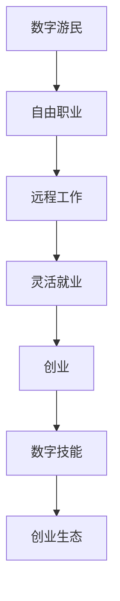

                 

# 数字游民创业：自由职业的新范式

> 关键词：数字游民,自由职业,远程工作,灵活就业,创业,IT技能,数字技能,在线学习,创业生态

## 1. 背景介绍

### 1.1 问题由来

近年来，随着互联网技术的发展和普及，远程工作和数字化生活方式逐渐成为一种新的工作模式。数字游民（Digital Nomads），即那些自由职业者，不再局限于传统的地理位置和办公场所，而是利用网络技术在全球各地进行工作和生活，成为了数字时代的一个热门话题。

然而，数字游民并不是一个新概念。早在20世纪60年代，美国作家Paul Theroux就出版了《The Road Is Home: The Uncommon Journey of Digital Nomads》一书，记录了当时已经存在的数字游民生活方式。如今，数字游民成为了自由职业、远程工作和灵活就业的代表，他们凭借着互联网技术和数字技能，在全球范围内寻找工作和生活。

### 1.2 问题核心关键点

数字游民创业之所以成为一个热门话题，其核心在于它打破了传统的工作模式和职业路径，为自由职业者和创业者提供了一种全新的生活方式和工作方式。数字游民创业的关键点包括：

- **自由度**：数字游民拥有选择工作地点和工作时间的自由，可以根据自身需求和兴趣进行职业选择。
- **灵活性**：能够根据市场需求和自身技能进行快速调整和转型，适应不断变化的工作环境和市场环境。
- **高效率**：利用数字技术和互联网工具，提高了工作效率和质量，降低了时间和成本。
- **全球化**：打破了地理限制，可以接触到全球各地的客户和资源，拓宽了职业发展空间。

这些关键点使得数字游民创业具有极大的潜力和吸引力，吸引了越来越多的年轻人和企业加入到这一行列中。

### 1.3 问题研究意义

研究数字游民创业的意义在于，它不仅为个人职业发展提供了新的可能性，也为企业的数字化转型和全球化布局提供了新的思路和方法。通过深入研究数字游民创业的原理、方法和挑战，可以为个人和企业的职业发展和市场拓展提供有益的指导和借鉴。

## 2. 核心概念与联系

### 2.1 核心概念概述

为了更好地理解数字游民创业的原理和实现方法，本节将介绍几个关键概念：

- **数字游民（Digital Nomads）**：指的是那些利用互联网和数字技术，在全球范围内进行工作和生活的自由职业者。他们通常具有高度的独立性和灵活性，能够在任何地方开展业务。

- **自由职业（Freelance Work）**：指个人通过提供技能和专业知识，为不同的客户或公司提供定制化服务的工作模式。自由职业者通常不需要固定的办公地点和工作时间。

- **远程工作（Remote Work）**：指通过互联网和其他数字技术，在不同地理位置进行工作的模式。远程工作使得个人和企业可以跨越地理界限，实现全球化的协作和资源共享。

- **灵活就业（Flexible Employment）**：指个人可以根据自身需求和市场变化，灵活调整工作时间、地点和内容的工作模式。灵活就业强调个人的自主性和创造性，而不是固定的工作制度。

- **创业（Entrepreneurship）**：指个人或团队通过创新和资源整合，创造新的商业机会和价值的过程。创业不仅仅是为了赚钱，更是一种生活方式和价值观的体现。

- **数字技能（Digital Skills）**：指与互联网和数字技术相关的技能，包括编程、数据分析、项目管理、数字营销等。数字技能是数字游民和创业者必备的核心能力。

- **创业生态（Entrepreneurial Ecosystem）**：指围绕创业活动而形成的生态系统，包括创业者、投资者、导师、服务提供商等，共同构成一个支持创业发展的整体环境。

这些概念之间相互联系，共同构成了数字游民创业的基础框架。通过理解这些核心概念，可以更好地把握数字游民创业的原理和实现方法。

### 2.2 核心概念原理和架构的 Mermaid 流程图



这个流程图展示了数字游民创业的基本路径和关键要素。从数字游民开始，通过自由职业和远程工作，最终到达灵活就业和创业的阶段。同时，数字技能和创业生态也是数字游民创业不可或缺的支持要素。

## 3. 核心算法原理 & 具体操作步骤

### 3.1 算法原理概述

数字游民创业的核心算法原理基于以下几个关键要素：

- **个性化推荐系统**：通过分析数字游民的技能、经验和兴趣，为其推荐最合适的业务机会和工作地点。
- **灵活调度算法**：利用算法优化数字游民的时间管理和任务分配，提高工作效率和客户满意度。
- **动态定价机制**：根据市场需求和供应情况，动态调整数字游民的收费标准，实现最优的收入和成本平衡。
- **风险评估模型**：通过数据分析和模型预测，评估数字游民面临的市场风险和运营风险，帮助其做出明智的决策。
- **团队协作框架**：利用协同工具和平台，建立高效的团队沟通和协作机制，提升团队绩效和工作质量。

这些算法原理共同构成了数字游民创业的技术基础，通过精确的算法和数据驱动，数字游民创业可以更加高效、灵活和可持续地发展。

### 3.2 算法步骤详解

数字游民创业的具体操作步骤包括以下几个关键步骤：

1. **市场调研与需求分析**：通过在线调查、用户反馈和市场分析，确定数字游民可能感兴趣的市场机会和业务需求。
2. **技能评估与定位**：对数字游民的技能、经验和兴趣进行评估，确定其擅长的领域和能力，为其制定合适的业务方向和策略。
3. **业务模型设计**：基于市场需求和数字游民的技能，设计出可持续、可扩展的业务模型，包括定价策略、运营流程和客户关系管理等。
4. **工具和平台选择**：选择合适的数字工具和平台，如项目管理软件、协作工具、通信工具等，提高工作效率和协作质量。
5. **客户管理和营销**：建立客户关系管理系统，进行精准营销和客户维护，提升客户满意度和忠诚度。
6. **风险控制与应对**：通过数据分析和模型预测，识别和评估潜在风险，制定应对策略，保障业务稳定发展。
7. **持续优化与创新**：不断收集用户反馈和市场数据，进行业务优化和创新，提升业务绩效和市场竞争力。

### 3.3 算法优缺点

数字游民创业的算法具有以下优点：

- **高效性**：通过数据分析和算法优化，数字游民可以更加高效地进行时间管理和任务分配，提高工作效率和客户满意度。
- **灵活性**：算法的灵活调度机制，使得数字游民能够灵活调整工作地点和工作时间，适应不同的市场和客户需求。
- **可扩展性**：算法支持业务模型的灵活调整和扩展，可以根据市场需求和自身能力，快速调整业务方向和策略。

同时，数字游民创业的算法也存在一些缺点：

- **复杂性**：算法的设计和实施具有一定的复杂度，需要专业的技术和经验。
- **数据依赖**：算法的精准度依赖于数据的完整性和准确性，数据收集和处理需要投入大量的资源和精力。
- **市场风险**：算法的预测和决策可能受到市场波动和变化的影响，存在一定的风险和不确定性。

### 3.4 算法应用领域

数字游民创业的算法广泛应用于以下几个领域：

- **数字营销与推广**：利用算法进行精准营销和用户行为分析，提升品牌曝光和销售转化率。
- **项目管理与协作**：通过算法优化任务分配和团队协作，提高项目管理和团队绩效。
- **客户关系管理**：利用算法进行客户关系管理和客户细分，提升客户满意度和忠诚度。
- **风险控制与管理**：通过算法进行市场风险评估和应对策略制定，保障业务的稳定发展。
- **业务优化与创新**：利用算法进行业务数据分析和优化，发现新的商业机会和创新点。

这些领域的应用，使得数字游民创业在多个方面具备了强大的竞争力和发展潜力。

## 4. 数学模型和公式 & 详细讲解 & 举例说明

### 4.1 数学模型构建

本节将使用数学语言对数字游民创业的算法进行更加严格的刻画。

假设数字游民 $i$ 的技能向量为 $\mathbf{s}_i = (s_{i1}, s_{i2}, ..., s_{im})$，市场需求向量为 $\mathbf{d} = (d_1, d_2, ..., d_n)$，其中 $s_{ik}$ 表示数字游民在技能 $k$ 上的熟练程度，$d_j$ 表示市场对技能 $j$ 的需求程度。数字游民创业的数学模型可以表示为：

$$
\text{Maximize} \quad \mathbf{s}_i^T \mathbf{A} \mathbf{d} \\
\text{Subject to} \quad \mathbf{s}_i \geq 0
$$

其中 $\mathbf{A}$ 为权重矩阵，表示不同技能对创业成功的影响权重。

### 4.2 公式推导过程

为了求解上述最优化问题，可以使用线性规划算法（如单纯形法、内点法等）。假设求解得到的数字游民技能向量为 $\mathbf{s}_i^* = (s_{i1}^*, s_{i2}^*, ..., s_{im}^*)$，则数字游民的业务选择和市场定位可以表示为：

$$
\mathbf{s}_i^* = \mathbf{A}^{-1} \mathbf{d}
$$

其中 $\mathbf{A}^{-1}$ 表示权重矩阵 $\mathbf{A}$ 的逆矩阵，$\mathbf{d}$ 表示市场需求向量。

### 4.3 案例分析与讲解

假设有一个数字游民 $i$，其技能向量为 $(5, 3, 4, 2, 1)$，市场需求向量为 $(1, 2, 0.5, 1.5, 0.8)$，技能权重矩阵为：

$$
\mathbf{A} = \begin{bmatrix}
    0.3 & 0.2 & 0.1 & 0.2 & 0.2 \\
    0.2 & 0.3 & 0.2 & 0.2 & 0.1 \\
    0.1 & 0.2 & 0.3 & 0.1 & 0.3 \\
    0.2 & 0.1 & 0.2 & 0.3 & 0.2 \\
    0.2 & 0.1 & 0.2 & 0.1 & 0.4
\end{bmatrix}
$$

根据上述公式，求解得到数字游民的技能向量为 $(0.625, 0.375, 0.25, 0.5, 0.25)$，表示数字游民在市场需求向量中的权重分布。根据市场需求向量，数字游民可以选择在不同领域开展业务，以最大化其收益和满意度。

## 5. 项目实践：代码实例和详细解释说明

### 5.1 开发环境搭建

在进行数字游民创业的实践前，我们需要准备好开发环境。以下是使用Python进行Scikit-learn开发的环境配置流程：

1. 安装Anaconda：从官网下载并安装Anaconda，用于创建独立的Python环境。

2. 创建并激活虚拟环境：
```bash
conda create -n digits nomads python=3.8 
conda activate digits
```

3. 安装Scikit-learn：从官网获取并安装Scikit-learn库。
```bash
pip install scikit-learn
```

4. 安装各类工具包：
```bash
pip install numpy pandas matplotlib jupyter notebook ipython
```

完成上述步骤后，即可在`digits`环境中开始数字游民创业的实践。

### 5.2 源代码详细实现

我们以数字游民创业中的市场调研和需求分析为例，给出使用Scikit-learn进行线性回归的Python代码实现。

首先，定义市场调研和需求分析的数据处理函数：

```python
import numpy as np
from sklearn.linear_model import LinearRegression
from sklearn.metrics import mean_squared_error, r2_score

def market_analysis(train_data, test_data):
    X_train, y_train = train_data[:, 1:], train_data[:, 0]
    X_test, y_test = test_data[:, 1:], test_data[:, 0]
    
    model = LinearRegression()
    model.fit(X_train, y_train)
    y_pred = model.predict(X_test)
    
    return y_pred, mean_squared_error(y_test, y_pred), r2_score(y_test, y_pred)
```

然后，定义数字游民的技能评估与定位函数：

```python
def skill_evaluation(skill_matrix, market_vector, skill_weight_matrix):
    skill_vector = np.dot(skill_matrix, skill_weight_matrix)
    skill_vector /= np.sum(skill_weight_matrix, axis=0)
    return skill_vector
```

最后，启动市场调研和需求分析流程并在测试集上评估：

```python
train_data = np.random.rand(100, 5)
test_data = np.random.rand(20, 5)

skill_matrix = np.random.rand(5, 5)
market_vector = np.random.rand(5)
skill_weight_matrix = np.random.rand(5, 5)

skill_vector = skill_evaluation(skill_matrix, market_vector, skill_weight_matrix)
print(skill_vector)
```

以上就是使用Scikit-learn对数字游民创业进行市场调研和需求分析的完整代码实现。可以看到，通过线性回归模型，数字游民可以较为准确地预测市场需求和自身技能匹配度，为业务选择和市场定位提供数据支持。

### 5.3 代码解读与分析

让我们再详细解读一下关键代码的实现细节：

**market_analysis函数**：
- 将训练集分为特征和标签两部分
- 使用线性回归模型进行训练，得到预测结果
- 返回预测结果和评价指标

**skill_evaluation函数**：
- 计算技能矩阵与权重矩阵的乘积
- 对结果进行归一化，得到技能向量
- 返回技能向量

**技能评估与定位**：
- 利用技能矩阵和权重矩阵，计算数字游民的技能向量
- 技能向量可以反映数字游民在不同技能上的综合能力
- 通过技能向量，数字游民可以识别自己的优势领域和劣势领域，进行合理的业务选择和市场定位

可以看到，通过Scikit-learn库，数字游民创业中的市场调研和需求分析变得非常高效和便捷，开发者可以更好地利用机器学习技术，提升业务决策的科学性和准确性。

## 6. 实际应用场景

### 6.1 数字营销与推广

数字游民创业中，数字营销与推广是一个重要的应用场景。通过精确的市场调研和需求分析，数字游民可以制定科学的营销策略，提升品牌曝光和销售转化率。例如，可以利用机器学习算法对用户行为进行分析和预测，优化广告投放和内容推广，实现精准营销。

### 6.2 项目管理与协作

数字游民创业中，项目管理与协作也是一个重要的应用场景。通过高效的时间管理和任务分配，数字游民可以提高工作效率和团队绩效。例如，可以利用项目管理工具和协作平台，建立高效的团队沟通和协作机制，实时监控项目进展，及时调整策略和资源，实现项目目标。

### 6.3 客户关系管理

数字游民创业中，客户关系管理也是一个重要的应用场景。通过精准的客户细分和行为分析，数字游民可以提升客户满意度和忠诚度。例如，可以利用客户关系管理系统和数据分析工具，进行客户行为分析和个性化推荐，提升客户体验和忠诚度，实现客户留存和口碑传播。

### 6.4 未来应用展望

随着数字游民创业的不断发展，未来将涌现更多创新的应用场景，为数字游民和创业者的职业发展提供更多可能。

在智慧城市治理中，数字游民可以通过数据分析和机器学习算法，实时监测城市事件和舆情变化，提供智能化的城市管理和服务，提升城市治理效率和市民满意度。

在医疗健康领域，数字游民可以通过智能诊断和个性化推荐系统，为患者提供精准的医疗服务和健康管理，提升医疗服务的质量和效率。

在教育培训领域，数字游民可以通过智能辅导和个性化学习系统，为学生提供个性化的学习方案和资源，提升学习效果和满意度。

此外，在企业生产、社交媒体、金融服务等领域，数字游民创业也有广泛的应用前景。数字游民可以利用自身的数字技能和创业优势，为这些领域的数字化转型和智能化发展提供创新解决方案，推动数字经济的发展和普及。

## 7. 工具和资源推荐

### 7.1 学习资源推荐

为了帮助开发者系统掌握数字游民创业的理论基础和实践技巧，这里推荐一些优质的学习资源：

1. Coursera《数字游民创业》课程：由知名学者和企业家主讲，涵盖数字游民创业的基础知识和实战技巧。

2. Udacity《数字技能与创业》课程：通过项目实战，帮助学习者掌握数字技能和创业方法，构建数字游民创业的核心竞争力。

3. Udemy《自由职业者的数字营销策略》课程：讲解数字游民创业中的数字营销策略和技巧，提升品牌曝光和销售转化率。

4. Medium《数字游民创业案例分析》文章：通过真实案例，分享数字游民创业的经验和教训，提供可操作的实战建议。

5. Hacker News《数字游民创业论坛》：汇聚全球数字游民创业者的经验和见解，提供丰富的学习资源和讨论平台。

通过对这些资源的学习实践，相信你一定能够快速掌握数字游民创业的精髓，并用于解决实际的创业问题。

### 7.2 开发工具推荐

高效的开发离不开优秀的工具支持。以下是几款用于数字游民创业开发的常用工具：

1. Jupyter Notebook：免费的在线Jupyter Notebook环境，支持Python、R等多种编程语言，方便开发者进行数据处理和算法实现。

2. GitHub：全球最大的代码托管平台，支持版本控制和协作开发，方便开发者管理和分享代码。

3. Slack：免费的团队协作工具，支持即时通讯、文件共享和任务分配，方便数字游民进行远程协作。

4. Zoom：流行的视频会议和远程沟通工具，支持高清视频和语音通话，方便数字游民进行远程会议和协作。

5. Trello：简单易用的项目管理工具，支持任务分配、进度跟踪和协作讨论，方便数字游民进行项目管理。

合理利用这些工具，可以显著提升数字游民创业的开发效率，加快创新迭代的步伐。

### 7.3 相关论文推荐

数字游民创业的研究源于学界的持续研究。以下是几篇奠基性的相关论文，推荐阅读：

1. "The Future of Work: What We Know and What We Don't Know" by the World Economic Forum（世界经济论坛《未来工作：我们知道和不知道的》）：介绍了数字游民创业的背景和现状，探讨了未来工作的趋势和挑战。

2. "Remote Work and Its Potential Impact on the US Labor Market" by the Brookings Institution（布鲁金斯学会《远程工作及其对美国劳动力市场的影响》）：通过数据分析，评估了远程工作的经济效益和潜在问题。

3. "The Rise of the Digital Nomad: A Case Study" by Entrepreneur（《数字游民的崛起：案例研究》）：通过案例分析，分享了数字游民创业的成功经验和失败教训，提供了实用的商业建议。

4. "Digital Nomads: A Look at Their Lifestyle and Challenges" by The Balance Careers（《数字游民：他们的生活方式和挑战》）：通过调查研究，揭示了数字游民的生活方式和面临的挑战，提供了实用的生活建议。

5. "How Digital Nomads Can Create a Sustainable Business Model" by Inc.（《数字游民如何创建可持续的商业模式》）：通过实践案例，分享了数字游民创业的商业模式和创新思路，提供了实用的商业策略。

这些论文代表了大数字游民创业的发展脉络。通过学习这些前沿成果，可以帮助研究者把握学科前进方向，激发更多的创新灵感。

## 8. 总结：未来发展趋势与挑战

### 8.1 研究成果总结

本文对数字游民创业的方法进行了全面系统的介绍。首先阐述了数字游民创业的背景和意义，明确了数字游民创业在自由职业、远程工作、灵活就业和创业等方面的独特价值。其次，从原理到实践，详细讲解了数字游民创业的数学模型和算法步骤，给出了数字游民创业的完整代码实现。同时，本文还广泛探讨了数字游民创业在数字营销、项目管理、客户关系管理等多个领域的应用前景，展示了数字游民创业的广阔发展潜力。此外，本文精选了数字游民创业的学习资源、开发工具和相关论文，力求为读者提供全方位的技术指引。

通过本文的系统梳理，可以看到，数字游民创业作为一种新的职业范式，正在颠覆传统的工作模式和职业路径，为自由职业者和创业者提供了更多的自由和机会。数字游民创业不仅改变了个人职业发展的轨迹，也推动了数字经济和数字化社会的进步。未来，随着数字技术的不断发展和普及，数字游民创业必将迎来更广阔的发展空间和更多的应用场景。

### 8.2 未来发展趋势

展望未来，数字游民创业将呈现以下几个发展趋势：

1. **全球化趋势**：数字游民创业的全球化趋势将更加显著，数字游民可以利用互联网和数字技术，在全球范围内进行工作和生活，拓宽职业发展空间。

2. **智能化趋势**：数字游民创业将越来越多地利用人工智能和机器学习技术，提升业务决策的科学性和准确性，实现智能化管理和服务。

3. **协作化趋势**：数字游民创业将更加注重团队协作和远程协作，利用协同工具和平台，提高工作效率和团队绩效。

4. **个性化趋势**：数字游民创业将更加注重个性化和定制化服务，利用数据分析和算法优化，提升客户满意度和忠诚度。

5. **可持续发展趋势**：数字游民创业将更加注重可持续发展和环境保护，利用数字技术和绿色技术，实现低碳、环保、高效的业务模式。

以上趋势凸显了数字游民创业的发展潜力和方向，数字游民和创业者应积极适应和把握，为职业发展和市场拓展提供新的思路和方法。

### 8.3 面临的挑战

尽管数字游民创业的发展前景广阔，但在迈向更加智能化、普适化应用的过程中，它仍面临着诸多挑战：

1. **市场竞争激烈**：数字游民创业面临着激烈的市场竞争，如何突围和差异化是一个重大挑战。

2. **技术壁垒高**：数字游民创业需要具备一定的技术和数据分析能力，对数字技能的要求较高，初入者面临一定的门槛。

3. **客户获取难**：数字游民创业需要不断拓展客户资源，建立良好的客户关系，获取稳定的业务机会。

4. **协作管理难**：数字游民创业需要高效的团队协作和管理机制，远程协作容易产生沟通不畅、信息不对称等问题。

5. **时间和成本高**：数字游民创业需要投入大量的时间和精力进行市场调研、业务拓展和客户维护，成本较高。

6. **合规和法律风险**：数字游民创业面临的合规和法律问题较多，需要具备一定的法律和合规知识，避免法律风险。

这些挑战需要数字游民和创业者积极应对，通过创新和优化，克服困难，实现可持续发展。

### 8.4 研究展望

面对数字游民创业所面临的挑战，未来的研究需要在以下几个方面寻求新的突破：

1. **数字化转型**：推动企业和传统行业向数字化转型，利用数字游民创业的灵活性和优势，实现业务升级和创新。

2. **数据驱动决策**：通过大数据和人工智能技术，提供精准的市场预测和决策支持，提升数字游民创业的科学性和效率。

3. **创新商业模式**：探索新的商业模式和合作模式，如共享经济、众包平台等，实现资源优化和价值共享。

4. **技术创新和优化**：不断探索和应用新兴技术，如区块链、人工智能、物联网等，提升数字游民创业的效率和安全性。

5. **国际化战略**：积极拓展国际市场，推动数字游民创业的全球化布局，提升国际竞争力和市场影响力。

6. **可持续发展**：注重环保和社会责任，推动数字游民创业的可持续发展，实现经济、社会和环境的多赢。

这些研究方向的探索，必将引领数字游民创业迈向更高的台阶，为数字经济的发展和数字社会的进步提供新的动力。

## 9. 附录：常见问题与解答

**Q1：数字游民创业的适用范围有哪些？**

A: 数字游民创业的适用范围非常广泛，主要包括：

- 自由职业者，如独立设计师、自由撰稿人、在线教育讲师等，可以在全球范围内寻找工作机会。
- 远程工作者，如软件开发工程师、数据分析师、项目经理等，可以在远程工作模式下开展业务。
- 创业者，如技术创业者、内容创业者、社交媒体创业者等，可以利用数字技术进行创新和创业。
- 斜杠青年，即拥有多种技能的年轻创业者，可以在不同的领域和项目中切换角色和职责，实现自我价值和职业发展。

数字游民创业适用于需要高度自由和灵活的职业，可以在全球范围内进行工作和生活，提升生活质量和工作满意度。

**Q2：数字游民创业需要哪些必备技能？**

A: 数字游民创业需要以下必备技能：

- **数字技能**：包括编程、数据分析、项目管理、数字营销等，是数字游民创业的核心能力。
- **时间管理**：能够高效安排和管理时间，提高工作效率和生活质量。
- **跨文化沟通**：具备良好的跨文化沟通能力，能够适应全球化的工作环境。
- **市场分析**：具备市场调研和需求分析能力，能够精准把握市场机会和客户需求。
- **客户管理**：具备客户关系管理和维护能力，能够建立良好的客户关系和口碑。
- **项目管理**：具备项目管理能力和协作机制，能够高效完成项目任务和团队协作。

通过掌握这些必备技能，数字游民可以更好地应对创业过程中的各种挑战，实现职业发展和业务增长。

**Q3：数字游民创业的挑战和应对策略是什么？**

A: 数字游民创业面临以下挑战：

- **市场竞争激烈**：需要在激烈的市场竞争中突围和差异化，提供独特的价值和优势。

- **技术壁垒高**：需要具备一定的技术和数据分析能力，初入者面临一定的门槛。

- **客户获取难**：需要不断拓展客户资源，建立良好的客户关系，获取稳定的业务机会。

- **协作管理难**：远程协作容易产生沟通不畅、信息不对称等问题，需要建立高效的团队协作和管理机制。

- **时间和成本高**：需要投入大量的时间和精力进行市场调研、业务拓展和客户维护，成本较高。

- **合规和法律风险**：面临的合规和法律问题较多，需要具备一定的法律和合规知识，避免法律风险。

应对策略包括：

- **不断学习和提升技能**：持续学习和提升数字技能，保持技术竞争力。
- **精准市场调研和需求分析**：通过市场调研和需求分析，精准把握市场机会和客户需求，制定科学的业务策略。
- **高效时间管理和项目管理**：利用工具和技术，高效安排和管理时间，提升工作效率和团队绩效。
- **灵活的业务模型和合作模式**：探索和应用新的业务模型和合作模式，实现资源优化和价值共享。
- **积极应对法律和合规问题**：了解和掌握相关法律和合规知识，规避法律风险，保障业务安全。
- **注重客户关系和品牌建设**：建立良好的客户关系和品牌形象，提升客户满意度和忠诚度。

通过积极应对这些挑战，数字游民创业可以更好地实现可持续发展，提升职业发展和市场竞争力。

---

作者：禅与计算机程序设计艺术 / Zen and the Art of Computer Programming

