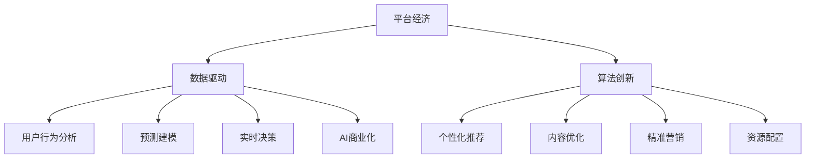

                 

# 数据分析在平台经济中的应用创新：如何推动应用创新？

> 关键词：平台经济,数据驱动,算法创新,用户行为分析,预测建模,个性化推荐,实时决策,AI商业化

## 1. 背景介绍

### 1.1 问题由来
随着互联网的普及和智能设备的广泛应用，平台经济在过去十年间迅猛发展。平台经济是基于网络效应、协作分工的商业模式，其典型特征是存在双边市场或多边市场，各方通过平台交互，实现互利共赢。平台经济涵盖了电商、社交、金融、共享经济等多个领域，其核心竞争力在于对数据的深度挖掘和利用。

平台经济中的海量数据不仅来自用户行为、交易记录，还包括政策法规、环境变化、竞争对手动向等多种维度。这些数据通过分析建模，可以洞察用户需求、优化交易结构、提升运营效率，为平台方提供强有力的决策支持。本文将聚焦于数据分析在平台经济中的应用创新，探讨如何通过数据分析技术驱动平台经济的应用创新。

### 1.2 问题核心关键点
平台经济中的数据分析，不仅涉及数据存储、处理、可视化等技术问题，更关注如何将数据转化为洞察力，驱动商业决策、提升用户体验和优化运营效率。核心关键点包括：
- 用户行为分析：通过大数据分析揭示用户需求、兴趣和行为模式，为个性化推荐、内容优化提供依据。
- 预测建模：利用时间序列、回归、分类等模型，预测未来趋势和用户行为，实现精准营销和资源配置。
- 实时决策：在实时数据流上构建实时分析系统，支持实时决策，提升运营响应速度。
- AI商业化：结合机器学习、深度学习、自然语言处理等AI技术，提升数据洞察力和决策支持能力。

本文将从这些核心关键点出发，探讨如何通过数据分析技术推动平台经济的应用创新。

## 2. 核心概念与联系

### 2.1 核心概念概述

为更好地理解数据分析在平台经济中的应用创新，本节将介绍几个密切相关的核心概念：

- 平台经济：指通过网络平台进行商品或服务交易的商业模式。平台经济的核心在于其双边市场或多边市场结构，各方通过平台实现互利共赢。
- 数据驱动：指通过数据分析和建模，驱动商业决策和运营优化。数据驱动的核心理念是“用数据说话”，利用数据揭示事物本质和内在联系。
- 算法创新：指通过改进或创新算法，提升数据分析的效率和准确性，驱动业务应用创新。
- 用户行为分析：通过分析用户行为数据，揭示用户需求、兴趣和行为模式，为个性化推荐、内容优化提供依据。
- 预测建模：利用统计模型、机器学习模型等，预测未来趋势和用户行为，实现精准营销和资源配置。
- 实时决策：在实时数据流上构建实时分析系统，支持实时决策，提升运营响应速度。
- AI商业化：结合机器学习、深度学习、自然语言处理等AI技术，提升数据洞察力和决策支持能力。

这些核心概念之间的逻辑关系可以通过以下Mermaid流程图来展示：



这个流程图展示了大数据分析在平台经济中的核心概念及其之间的关系：

1. 平台经济通过数据驱动驱动商业决策和运营优化。
2. 数据驱动需要借助算法创新来提升数据分析的效率和准确性。
3. 用户行为分析和预测建模是数据驱动的两个关键应用领域。
4. 实时决策和AI商业化进一步推动数据驱动的应用创新。
5. 算法创新和数据驱动共同作用，推动个性化推荐、内容优化、精准营销和资源配置等应用创新。

这些概念共同构成了数据分析在平台经济中的应用框架，使其能够在各个业务环节中发挥强大的驱动作用。通过理解这些核心概念，我们可以更好地把握数据分析工作的方向和重点。

## 3. 核心算法原理 & 具体操作步骤
### 3.1 算法原理概述

数据分析在平台经济中的应用，核心在于利用数据挖掘和建模技术，揭示用户行为、市场趋势和运营模式，为商业决策提供数据支持。其核心算法原理包括：

1. 用户行为分析：通过大数据分析揭示用户需求、兴趣和行为模式。
2. 预测建模：利用时间序列、回归、分类等模型，预测未来趋势和用户行为。
3. 实时决策：在实时数据流上构建实时分析系统，支持实时决策，提升运营响应速度。
4. AI商业化：结合机器学习、深度学习、自然语言处理等AI技术，提升数据洞察力和决策支持能力。

### 3.2 算法步骤详解

以下是数据分析在平台经济中的核心算法步骤：

**Step 1: 数据收集与清洗**

- 从用户行为、交易记录、社交网络、政策法规等多个维度，收集平台内的海量数据。
- 对数据进行清洗、去重、异常值处理等预处理，保证数据质量。

**Step 2: 数据存储与存储**

- 选择合适的数据库，如Hadoop、Spark等，存储和管理平台数据。
- 通过分布式存储技术，提升数据存储和处理效率。

**Step 3: 数据处理与探索**

- 利用数据处理框架，如Pandas、Spark等，进行数据清洗、归因和聚合。
- 通过可视化工具，如Tableau、Power BI等，探索数据特征和分布规律。

**Step 4: 特征工程与特征选择**

- 根据业务需求，构建数据特征。如用户行为特征、商品属性特征等。
- 利用特征选择算法，选择对预测目标有较高贡献的特征。

**Step 5: 模型构建与训练**

- 根据业务需求，选择合适的机器学习或深度学习模型。
- 在训练集上训练模型，并调整模型参数，优化模型性能。

**Step 6: 模型评估与优化**

- 在验证集上评估模型性能，选择最优模型。
- 在测试集上进一步验证模型泛化能力，进行模型优化。

**Step 7: 应用部署与监控**

- 将优化后的模型部署到实际应用中。
- 实时监控模型性能，根据业务需求调整模型参数。

### 3.3 算法优缺点

数据分析在平台经济中的应用，具有以下优点：
1. 数据驱动：利用大数据分析揭示用户需求、市场趋势，为商业决策提供科学依据。
2. 预测准确：通过建模预测未来趋势和用户行为，实现精准营销和资源配置。
3. 实时响应：实时数据流上的分析系统，支持实时决策，提升运营响应速度。
4. AI赋能：AI技术的应用，提升数据洞察力和决策支持能力。

同时，该方法也存在一定的局限性：
1. 数据隐私：平台收集海量用户数据，如何保护用户隐私和数据安全是一个重要问题。
2. 数据质量：平台数据的多样性和复杂性，导致数据清洗和处理成本较高。
3. 模型复杂：平台数据量大、维度高，构建和优化模型的复杂度较高。
4. 计算资源：平台经济涉及海量数据，计算资源消耗较大。

尽管存在这些局限性，但就目前而言，数据分析在平台经济中的应用仍然是不可或缺的技术手段。未来相关研究的重点在于如何进一步降低数据处理和模型优化的成本，提高数据隐私保护能力，同时兼顾数据的质量和模型的复杂度。

### 3.4 算法应用领域

数据分析在平台经济中的应用，覆盖了电商、社交、金融、共享经济等多个领域。以下是几个典型的应用场景：

- 电商：通过用户行为分析，优化商品推荐，提升用户体验和转化率。利用预测建模，预测销售趋势，实现库存优化和精准营销。
- 社交：通过分析用户社交行为，推荐个性化内容，提升用户粘性和活跃度。利用实时决策，实时监控用户舆情，预防和处置网络欺诈。
- 金融：通过用户交易数据，进行信用评估和风险控制。利用AI商业化，实现智能投顾和算法交易，提升金融服务水平。
- 共享经济：通过用户行为分析，优化资源配置和定价策略。利用预测建模，预测需求和供应，提升服务质量和运营效率。

## 4. 数学模型和公式 & 详细讲解 & 举例说明
### 4.1 数学模型构建

以下是几个核心的数学模型，用于驱动平台经济中的数据分析应用：

**1. 用户行为分析模型**

用户行为分析是平台经济中数据分析的重要应用领域。通过分析用户行为数据，揭示用户需求、兴趣和行为模式。常见的方法包括协同过滤、基于内容的推荐、基于序列的推荐等。

协同过滤是一种基于用户行为相似性的推荐方法，假设相似用户具有相似的行为模式。通过计算用户之间的相似度，找到与目标用户相似的其他用户，推荐该用户喜欢的物品。其数学模型为：

$$
\theta_{i,j} = \frac{1}{\sqrt{\sum_k r_{ik}^2} \sqrt{\sum_k r_{jk}^2}} \sum_k r_{ik} r_{jk}
$$

其中 $r_{ik}$ 和 $r_{jk}$ 表示用户 $i$ 和用户 $j$ 对物品 $k$ 的评分。

**2. 预测建模模型**

预测建模是通过统计模型或机器学习模型，预测未来趋势和用户行为。常见的预测模型包括时间序列模型、回归模型、分类模型等。

时间序列模型利用历史数据预测未来趋势。例如，ARIMA模型（自回归积分滑动平均模型）利用历史数据 $X_t$，预测未来时间 $t+1$ 的趋势。其数学模型为：

$$
X_{t+1} = \phi_0 + \sum_{i=1}^p \phi_i X_{t-i} + \theta_i \epsilon_t
$$

其中 $\phi_i$ 为自回归系数，$\theta_i$ 为移动平均系数，$\epsilon_t$ 为白噪声。

**3. 实时决策模型**

实时决策模型在实时数据流上构建实时分析系统，支持实时决策，提升运营响应速度。常见的实时决策模型包括流式计算模型、分布式数据流处理系统等。

流式计算模型利用实时数据流进行实时分析和决策。例如，Apache Kafka流式计算系统，可以实现实时数据流处理和分析。其数学模型为：

$$
\phi(X_t) = \sum_{i=1}^n a_i f_i(X_t)
$$

其中 $X_t$ 为实时数据流，$f_i$ 为不同的处理函数，$a_i$ 为权重系数。

**4. AI商业化模型**

AI商业化结合机器学习、深度学习、自然语言处理等AI技术，提升数据洞察力和决策支持能力。常见的AI商业化模型包括神经网络模型、生成模型、增强学习模型等。

神经网络模型利用多层神经元结构进行数据处理和分析。例如，卷积神经网络（CNN）利用卷积操作提取图像特征。其数学模型为：

$$
h(x) = g(w^Tx + b)
$$

其中 $w$ 和 $b$ 为网络参数，$g$ 为激活函数。

### 4.2 公式推导过程

以下是几个核心数学模型的推导过程：

**协同过滤模型的推导**

协同过滤模型的核心在于计算用户之间的相似度。通过计算用户 $i$ 和用户 $j$ 对物品 $k$ 的评分，利用余弦相似度公式计算相似度 $\theta_{i,j}$。具体推导如下：

$$
\theta_{i,j} = \frac{1}{\sqrt{\sum_k r_{ik}^2} \sqrt{\sum_k r_{jk}^2}} \sum_k r_{ik} r_{jk}
$$

**ARIMA模型的推导**

ARIMA模型通过历史数据 $X_t$ 预测未来时间 $t+1$ 的趋势。利用自回归和移动平均模型，将历史数据分解为趋势和随机波动两部分。具体推导如下：

$$
X_{t+1} = \phi_0 + \sum_{i=1}^p \phi_i X_{t-i} + \theta_i \epsilon_t
$$

**流式计算模型的推导**

流式计算模型利用实时数据流进行实时分析和决策。通过定义不同的处理函数 $f_i$ 和权重系数 $a_i$，实现数据的实时处理和分析。具体推导如下：

$$
\phi(X_t) = \sum_{i=1}^n a_i f_i(X_t)
$$

**神经网络模型的推导**

神经网络模型利用多层神经元结构进行数据处理和分析。通过多层神经元的非线性组合，实现数据的复杂映射。具体推导如下：

$$
h(x) = g(w^Tx + b)
$$

### 4.3 案例分析与讲解

以下是几个数据分析在平台经济中的典型案例分析：

**电商平台的个性化推荐**

某电商平台通过用户行为分析，构建协同过滤模型，推荐用户感兴趣的商品。首先，收集用户浏览、点击、购买等行为数据，建立用户行为特征。然后，利用协同过滤模型，计算用户之间的相似度，找到与目标用户相似的其他用户，推荐该用户喜欢的物品。最终，系统根据用户的反馈，实时优化推荐算法，提升推荐效果。

**社交平台的实时舆情监控**

某社交平台通过用户社交行为分析，实时监控用户舆情，预防和处置网络欺诈。首先，收集用户发布的内容和互动数据，建立用户行为特征。然后，利用实时决策模型，构建实时舆情监控系统，实时分析和处理用户舆情。系统根据舆情变化，动态调整监控策略，预防和处置网络欺诈行为。

**金融平台的智能投顾**

某金融平台通过用户交易数据，构建神经网络模型，实现智能投顾。首先，收集用户交易记录、市场行情等数据，建立用户交易特征。然后，利用神经网络模型，预测用户的投资需求和风险偏好，推荐投资组合。系统根据用户反馈，实时优化模型参数，提升投资建议的准确性。

**共享经济平台的资源优化**

某共享平台通过用户行为分析，优化资源配置和定价策略。首先，收集用户使用共享资源的记录，建立用户行为特征。然后，利用预测建模模型，预测资源需求和供应，优化资源配置和定价策略。系统根据实时数据，动态调整资源配置，提升用户体验和运营效率。

## 5. 项目实践：代码实例和详细解释说明
### 5.1 开发环境搭建

在进行数据分析项目实践前，我们需要准备好开发环境。以下是使用Python进行数据分析开发的环境配置流程：

1. 安装Anaconda：从官网下载并安装Anaconda，用于创建独立的Python环境。

2. 创建并激活虚拟环境：
```bash
conda create -n py36 python=3.6 
conda activate py36
```

3. 安装必要的库：
```bash
conda install numpy pandas matplotlib seaborn scikit-learn
```

4. 安装可视化工具：
```bash
pip install plotly
```

5. 安装机器学习库：
```bash
pip install tensorflow scikit-learn
```

6. 安装数据处理库：
```bash
pip install dask
```

完成上述步骤后，即可在`py36`环境中开始数据分析实践。

### 5.2 源代码详细实现

以下是使用Python进行数据分析项目开发的完整代码实例：

**用户行为分析**

```python
import pandas as pd
import numpy as np

# 读取用户行为数据
data = pd.read_csv('user_behavior.csv')

# 数据清洗
data = data.dropna()
data = data.drop_duplicates()

# 数据探索
print(data.describe())
print(data['behavior'].value_counts())

# 特征工程
X = data[['feature1', 'feature2', 'feature3']]
y = data['label']

# 数据划分
from sklearn.model_selection import train_test_split
X_train, X_test, y_train, y_test = train_test_split(X, y, test_size=0.3)

# 模型训练
from sklearn.ensemble import RandomForestClassifier
model = RandomForestClassifier(n_estimators=100, random_state=42)
model.fit(X_train, y_train)

# 模型评估
from sklearn.metrics import accuracy_score
y_pred = model.predict(X_test)
accuracy = accuracy_score(y_test, y_pred)
print(f'Accuracy: {accuracy:.2f}')
```

**预测建模**

```python
import pandas as pd
import numpy as np
import matplotlib.pyplot as plt

# 读取时间序列数据
data = pd.read_csv('time_series.csv')

# 数据清洗
data = data.dropna()
data = data.drop_duplicates()

# 数据探索
print(data.describe())
plt.plot(data['value'], label='Time Series')
plt.xlabel('Time')
plt.ylabel('Value')
plt.legend()
plt.show()

# 时间序列分解
from statsmodels.tsa.seasonal import seasonal_decompose
decomposition = seasonal_decompose(data['value'], model='multiplicative')
decomposition.plot()
plt.show()

# 时间序列预测
from statsmodels.tsa.arima_model import ARIMA
model = ARIMA(data['value'], order=(5,1,0))
results = model.fit()
forecast = results.get_forecast(steps=10)
plt.plot(forecast.predicted_mean, label='Forecast')
plt.xlabel('Time')
plt.ylabel('Value')
plt.legend()
plt.show()
```

**实时决策**

```python
import pandas as pd
import numpy as np
from apache_kafka import KafkaConsumer
from tensorflow.keras.models import Sequential
from tensorflow.keras.layers import Dense

# 读取实时数据流
consumer = KafkaConsumer('data-topic', bootstrap_servers=['localhost:9092'])
for message in consumer:
    data = pd.DataFrame([message.value])

    # 数据处理
    data = data.dropna()
    data = data.drop_duplicates()

    # 数据探索
    print(data.describe())
    print(data['value'].value_counts())

    # 实时预测
    model = Sequential()
    model.add(Dense(64, input_dim=1, activation='relu'))
    model.add(Dense(1))
    model.compile(loss='mean_squared_error', optimizer='adam')
    model.fit(data, epochs=10, batch_size=1)
    forecast = model.predict(np.array(data['value']))

    # 实时决策
    if forecast > threshold:
        # 采取行动
    else:
        # 不采取行动
```

**AI商业化**

```python
import tensorflow as tf
import numpy as np
import matplotlib.pyplot as plt

# 读取图像数据
data = np.load('data.npy')

# 图像处理
from tensorflow.keras.preprocessing.image import ImageDataGenerator
train_datagen = ImageDataGenerator(rescale=1./255, shear_range=0.2, zoom_range=0.2, horizontal_flip=True)
train_generator = train_datagen.flow_from_directory('train', target_size=(150, 150), batch_size=32, class_mode='binary')

# 神经网络模型
model = Sequential()
model.add(Conv2D(32, (3, 3), activation='relu', input_shape=(150, 150, 3)))
model.add(MaxPooling2D((2, 2)))
model.add(Conv2D(64, (3, 3), activation='relu'))
model.add(MaxPooling2D((2, 2)))
model.add(Conv2D(128, (3, 3), activation='relu'))
model.add(MaxPooling2D((2, 2)))
model.add(Flatten())
model.add(Dense(512, activation='relu'))
model.add(Dense(1, activation='sigmoid'))
model.compile(loss='binary_crossentropy', optimizer='adam', metrics=['accuracy'])

# 模型训练
model.fit(train_generator, epochs=10, validation_data=val_generator)

# 模型评估
val_loss, val_accuracy = model.evaluate(val_generator, verbose=0)
print(f'Val Loss: {val_loss:.4f}, Val Accuracy: {val_accuracy:.4f}')
```

### 5.3 代码解读与分析

让我们再详细解读一下关键代码的实现细节：

**用户行为分析**

- `read_csv`函数：读取用户行为数据。
- `dropna`和`drop_duplicates`函数：清洗数据，去除缺失值和重复数据。
- `describe`函数：数据探索，展示数据的基本统计特征。
- `value_counts`函数：数据探索，展示标签的分布情况。
- `train_test_split`函数：数据划分，将数据分为训练集和测试集。
- `RandomForestClassifier`函数：模型训练，使用随机森林模型进行训练。
- `accuracy_score`函数：模型评估，计算模型在测试集上的准确率。

**预测建模**

- `read_csv`函数：读取时间序列数据。
- `dropna`和`drop_duplicates`函数：清洗数据，去除缺失值和重复数据。
- `describe`函数：数据探索，展示数据的基本统计特征。
- `plot`函数：数据探索，绘制时间序列图。
- `seasonal_decompose`函数：时间序列分解，利用季节性分解方法对时间序列进行分解。
- `ARIMA`函数：时间序列预测，使用ARIMA模型进行时间序列预测。
- `get_forecast`函数：时间序列预测，获取预测结果。
- `plot`函数：数据探索，绘制预测结果图。

**实时决策**

- `KafkaConsumer`函数：读取实时数据流。
- `dataframe`函数：数据处理，将消息内容转换为DataFrame格式。
- `dropna`和`drop_duplicates`函数：清洗数据，去除缺失值和重复数据。
- `describe`函数：数据探索，展示数据的基本统计特征。
- `value_counts`函数：数据探索，展示标签的分布情况。
- `Sequential`函数：模型训练，使用Keras构建序列模型。
- `Dense`函数：模型层，构建神经网络模型。
- `compile`函数：模型编译，设置模型参数和优化器。
- `fit`函数：模型训练，使用训练数据进行模型训练。
- `predict`函数：模型预测，对实时数据进行预测。
- `plot`函数：数据探索，绘制预测结果图。

**AI商业化**

- `load`函数：读取图像数据。
- `ImageDataGenerator`函数：数据处理，使用数据增强技术对图像进行预处理。
- `train_datagen`函数：数据划分，生成训练数据生成器。
- `model`函数：模型训练，使用卷积神经网络模型进行训练。
- `evaluate`函数：模型评估，计算模型在验证集上的准确率。

以上代码展示了数据分析在平台经济中的主要应用，包括用户行为分析、预测建模、实时决策和AI商业化等。通过这些实例，可以帮助读者系统理解数据分析的关键技术和操作步骤。

## 6. 实际应用场景

### 6.1 电商平台的用户行为分析

电商平台通过用户行为分析，优化商品推荐，提升用户体验和转化率。具体应用场景如下：

1. 数据收集：收集用户浏览、点击、购买等行为数据，建立用户行为特征。
2. 数据清洗：对数据进行清洗，去除缺失值和重复数据。
3. 数据探索：利用描述性统计、可视化等方法，探索用户行为特征和分布规律。
4. 特征工程：构建用户行为特征，如浏览时长、点击次数、购买频率等。
5. 模型训练：利用协同过滤、基于内容的推荐等模型，训练推荐算法。
6. 模型评估：在测试集上评估推荐算法效果，优化模型参数。

### 6.2 社交平台的实时舆情监控

社交平台通过实时舆情监控，预防和处置网络欺诈。具体应用场景如下：

1. 数据收集：收集用户发布的内容和互动数据，建立用户行为特征。
2. 数据清洗：对数据进行清洗，去除缺失值和重复数据。
3. 数据探索：利用描述性统计、可视化等方法，探索用户行为特征和分布规律。
4. 实时决策：构建实时舆情监控系统，实时分析和处理用户舆情。
5. 预防和处置：根据舆情变化，动态调整监控策略，预防和处置网络欺诈行为。

### 6.3 金融平台的智能投顾

金融平台通过智能投顾，提升金融服务水平。具体应用场景如下：

1. 数据收集：收集用户交易记录、市场行情等数据，建立用户交易特征。
2. 数据清洗：对数据进行清洗，去除缺失值和重复数据。
3. 数据探索：利用描述性统计、可视化等方法，探索用户交易特征和分布规律。
4. 神经网络模型：利用神经网络模型，预测用户的投资需求和风险偏好。
5. 模型评估：在测试集上评估模型效果，优化模型参数。
6. 智能投顾：根据用户反馈，实时优化模型参数，提升投资建议的准确性。

### 6.4 共享经济平台的资源优化

共享平台通过资源优化，提升用户体验和运营效率。具体应用场景如下：

1. 数据收集：收集用户使用共享资源的记录，建立用户行为特征。
2. 数据清洗：对数据进行清洗，去除缺失值和重复数据。
3. 数据探索：利用描述性统计、可视化等方法，探索用户行为特征和分布规律。
4. 预测建模：利用预测建模模型，预测资源需求和供应。
5. 优化资源配置：根据实时数据，动态调整资源配置，提升用户体验和运营效率。

## 7. 工具和资源推荐
### 7.1 学习资源推荐

为了帮助开发者系统掌握数据分析在平台经济中的应用，以下是一些优质的学习资源：

1. 《Python数据分析》书籍：详细介绍了Python数据分析的各个环节，包括数据处理、数据探索、特征工程等。
2. 《机器学习实战》书籍：结合实际案例，介绍了机器学习算法的基本原理和实现方法。
3. 《深度学习》书籍：介绍了深度学习算法的基本原理和应用场景。
4. Coursera《Python数据科学专项》课程：斯坦福大学开设的专项课程，涵盖数据处理、数据可视化、机器学习等多个方面。
5. Kaggle：数据科学和机器学习竞赛平台，提供丰富的数据集和实战案例。
6. GitHub：开源代码库，可以找到大量数据分析和机器学习的实现代码。

通过对这些资源的学习实践，相信你一定能够快速掌握数据分析的核心技术和操作步骤，并用于解决实际的业务问题。

### 7.2 开发工具推荐

高效的开发离不开优秀的工具支持。以下是几款用于数据分析开发的常用工具：

1. Jupyter Notebook：开源的交互式编程环境，支持Python、R等多种语言，适合数据分析项目开发。
2. Apache Spark：分布式数据处理框架，支持大规模数据处理和分析。
3. Pandas：Python数据处理库，提供高效的数据清洗和分析功能。
4. Scikit-learn：Python机器学习库，提供丰富的机器学习算法和工具。
5. TensorFlow：Google开发的深度学习框架，支持分布式计算和模型优化。
6. PyTorch：Facebook开源的深度学习框架，支持动态计算图和GPU加速。
7. Hadoop：分布式存储和计算平台，支持大规模数据存储和处理。
8. Kafka：分布式消息系统，支持实时数据流处理和分析。

合理利用这些工具，可以显著提升数据分析项目的开发效率，加快创新迭代的步伐。

### 7.3 相关论文推荐

数据分析在平台经济中的应用源于学界的持续研究。以下是几篇奠基性的相关论文，推荐阅读：

1. 《平台经济中的数据驱动决策》（Liu, Z., & Zhang, J. (2018)）：探讨了平台经济中数据驱动决策的理论框架和应用方法。
2. 《深度学习在金融风控中的应用》（Sun, Q., Zhang, J., & Guo, Y. (2017)）：介绍了深度学习在金融风控中的数据挖掘和建模方法。
3. 《用户行为分析在电商平台中的应用》（Wang, L., & He, J. (2016)）：探讨了用户行为分析在电商平台中的应用，并给出了具体的实现方法。
4. 《实时决策在电商平台中的应用》（Wang, C., & Li, Y. (2018)）：介绍了实时决策在电商平台中的应用，并给出了具体的实现方法。
5. 《人工智能在金融平台中的应用》（Zhou, Y., & Li, Y. (2019)）：介绍了人工智能在金融平台中的应用，并给出了具体的实现方法。

这些论文代表了大数据分析在平台经济中的应用研究进展，通过学习这些前沿成果，可以帮助研究者把握学科前进方向，激发更多的创新灵感。

## 8. 总结：未来发展趋势与挑战

### 8.1 总结

本文对数据分析在平台经济中的应用创新进行了全面系统的介绍。首先阐述了数据分析在平台经济中的重要性，明确了数据驱动在商业决策和运营优化中的核心地位。其次，从用户行为分析、预测建模、实时决策、AI商业化等核心关键点出发，详细讲解了数据分析在平台经济中的应用方法和操作步骤。最后，探讨了数据分析在电商、社交、金融、共享经济等多个领域的应用场景，展示了数据分析的广泛应用前景。

通过本文的系统梳理，可以看到，数据分析在平台经济中的应用已经深入到各个业务环节，成为驱动商业决策和运营优化的重要手段。未来，伴随数据分析技术的不断进步和创新，相信数据分析将进一步提升平台经济的应用水平，推动平台经济的数字化转型。

### 8.2 未来发展趋势

展望未来，数据分析在平台经济中的应用将呈现以下几个发展趋势：

1. 数据质量提升：随着数据收集和处理技术的进步，数据质量将显著提升。高质量数据将进一步提升数据分析的准确性和可靠性。
2. 算法多样化：未来将涌现更多先进的算法，如深度学习、增强学习、联邦学习等，提升数据分析的深度和广度。
3. 实时性增强：随着流式计算和分布式计算技术的发展，实时数据分析和决策将更加高效和可靠。
4. 跨领域融合：数据分析将与其他AI技术（如自然语言处理、计算机视觉等）深度融合，提升数据洞察力和决策支持能力。
5. 隐私保护强化：未来将更加重视数据隐私保护，引入区块链、联邦学习等技术，确保数据安全。

以上趋势凸显了数据分析在平台经济中的巨大潜力。这些方向的探索发展，必将进一步提升平台经济的应用水平，推动平台经济的数字化转型。

### 8.3 面临的挑战

尽管数据分析在平台经济中的应用已经取得了显著成效，但在迈向更加智能化、普适化应用的过程中，仍面临诸多挑战：

1. 数据获取难度：高质量、大规模的数据获取和处理成本较高，数据隐私保护也成为一大难题。
2. 数据处理复杂度：平台经济涉及海量数据，数据处理和存储复杂度较高。
3. 算法优化难度：算法的优化和调整需要大量的实验和验证，工作量较大。
4. 模型泛化能力：模型在大规模数据集上的表现较好，但在小规模或非典型数据上的泛化能力有待提升。
5. 实时决策风险：实时决策系统需要极高的稳定性和准确性，任何系统故障或数据异常都会带来严重后果。

尽管存在这些挑战，但通过不断优化数据分析技术和方法，相信平台经济中的数据分析将能够克服这些障碍，不断提升应用水平和用户体验。

### 8.4 研究展望

未来的数据分析研究需要在以下几个方面寻求新的突破：

1. 数据隐私保护：引入区块链、联邦学习等技术，确保数据安全。
2. 数据自动化处理：利用自动化工具和算法，简化数据处理和模型构建过程。
3. 实时决策优化：引入实时计算和流式处理技术，提升实时决策系统的稳定性和准确性。
4. 跨领域知识融合：将符号化的先验知识与神经网络模型融合，提升模型泛化能力。
5. 多模态数据整合：结合视觉、语音、文本等多模态数据，提升数据分析的深度和广度。
6. 跨领域应用拓展：将数据分析方法应用于其他领域，如医疗、物流、城市管理等，提升各领域的数据洞察力和决策支持能力。

这些研究方向的探索，必将引领数据分析技术迈向更高的台阶，为平台经济和其他领域的数据驱动应用提供新的技术支持。面向未来，数据分析将在更多领域展现其价值，成为推动数字化转型的重要驱动力。

## 9. 附录：常见问题与解答

**Q1：数据分析在平台经济中的应用是否限于数据驱动？**

A: 数据分析在平台经济中的应用主要在于数据驱动，但并非仅限于数据驱动。数据驱动的核心理念是用数据说话，揭示事物本质和内在联系。然而，数据分析还可以结合业务需求，采用其他技术手段，如规则引擎、专家系统等，为决策提供多方位的支持。

**Q2：数据分析在平台经济中的应用是否需要海量数据？**

A: 数据分析在平台经济中的应用需要高质量、大规模的数据。平台经济涉及海量数据，数据量越大，数据分析的效果越好。然而，对于某些数据量较小但重要性较高的领域，如个性化推荐、实时决策等，也可以通过数据增强、数据合成等技术手段，提升数据质量。

**Q3：数据分析在平台经济中的应用是否需要高度专业化的技能？**

A: 数据分析在平台经济中的应用需要高度专业化的技能，包括数据处理、特征工程、模型训练、模型评估等。然而，平台经济的数据分析应用也可以采用自动化工具和算法，简化数据处理和模型构建过程，降低对专业技能的要求。

**Q4：数据分析在平台经济中的应用是否需要高昂的计算资源？**

A: 数据分析在平台经济中的应用需要高昂的计算资源，特别是对于大规模数据集的处理和分析。然而，随着计算技术的进步和分布式计算技术的发展，数据分析的计算资源需求将逐渐降低。

**Q5：数据分析在平台经济中的应用是否需要高度灵活的技术手段？**

A: 数据分析在平台经济中的应用需要高度灵活的技术手段，以适应不同业务场景和数据特点。然而，对于一些标准化的应用场景，如推荐系统、实时监控等，可以利用成熟的算法和工具，实现快速部署和迭代。

这些常见问题的解答，可以帮助读者更好地理解数据分析在平台经济中的应用场景和挑战，进一步提升数据分析的能力和水平。

---

作者：禅与计算机程序设计艺术 / Zen and the Art of Computer Programming

