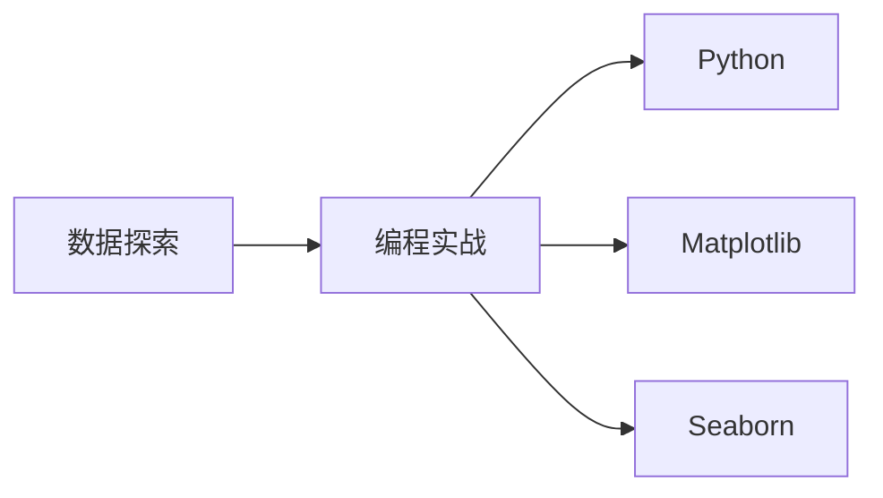

                 

# 数据可视化与数据探索原理与代码实战案例讲解

> 关键词：数据可视化,数据探索,编程实战,Python,Matplotlib,Seaborn

## 1. 背景介绍

在数据时代，无论是数据科学家、数据工程师，还是普通的商业分析师，数据探索与可视化都是他们日常工作中不可或缺的一部分。数据探索是指通过分析和处理原始数据，发现其背后的规律和模式；而数据可视化则是指将数据转化为图表或图形，直观地展示数据特征。两者的紧密结合，可以帮助我们更好地理解数据，进而指导决策和行动。

本博客将深入探讨数据可视化和数据探索的核心原理，并结合实际案例，讲解如何用Python编程实现高效的、美观的、易于理解的可视化。我们也将介绍一些实用的工具和技巧，帮助读者在实际项目中应用这些技术。

## 2. 核心概念与联系

### 2.1 核心概念概述

为了更好地理解数据可视化和数据探索，我们需要首先了解几个关键概念：

- **数据探索**：通过观察、分析和统计等手段，发现数据中的趋势、异常、关联和模式等。
- **数据可视化**：将数据转化为图形或图表，直观展示数据特征，便于观察和理解。
- **编程实战**：结合实际项目，使用编程工具实现数据探索和可视化，并解决实际问题。
- **Python**：一种广泛使用的编程语言，具有丰富的数据处理和可视化库。
- **Matplotlib**：Python中最流行的数据可视化库之一，提供了丰富的绘图功能。
- **Seaborn**：基于Matplotlib，提供了更高级的绘图接口和美观的样式。

这些概念之间的关系可以通过以下Mermaid流程图来展示：



这个流程图展示了大数据探索和可视化的关键过程：通过编程（使用Python），我们可以利用Matplotlib和Seaborn库实现数据探索和可视化，从而帮助我们理解和洞察数据。

## 3. 核心算法原理 & 具体操作步骤

### 3.1 算法原理概述

数据可视化和数据探索的算法原理主要基于统计学和图形学。统计学帮助我们理解数据的分布、趋势和异常；图形学则将统计结果转化为易于理解的图形或图表。

在数据探索方面，常见的统计方法包括：

- **描述性统计**：计算数据的基本统计量，如均值、中位数、标准差等，帮助我们了解数据的中心趋势和离散程度。
- **回归分析**：通过建立回归模型，预测数据之间的关系，帮助我们找到数据中的潜在规律。
- **聚类分析**：将数据分为若干群组，揭示数据的内在结构。

在数据可视化方面，常见的图形方法包括：

- **散点图**：用于展示两个变量之间的关系。
- **柱状图**：用于比较不同类别之间的数值差异。
- **饼图**：用于展示各部分占总体的比例。
- **箱线图**：用于展示数据的分布情况和异常值。

### 3.2 算法步骤详解

数据可视化和数据探索的实际操作步骤主要包括以下几个环节：

**Step 1: 数据预处理**

- **清洗数据**：去除缺失值、异常值和重复数据，确保数据的质量。
- **数据转换**：将原始数据转化为适合可视化分析的形式，如时间序列数据、类别数据等。

**Step 2: 数据探索**

- **描述性统计**：使用Python的NumPy或Pandas库计算数据的均值、中位数、标准差等基本统计量。
- **回归分析**：使用Python的SciPy或Statsmodels库进行线性回归、多项式回归等，建立预测模型。
- **聚类分析**：使用Python的Scikit-learn库进行K-means、层次聚类等，找到数据中的群组结构。

**Step 3: 数据可视化**

- **散点图**：使用Matplotlib或Seaborn库绘制散点图，展示两个变量之间的关系。
- **柱状图**：使用Matplotlib或Seaborn库绘制柱状图，比较不同类别之间的数值差异。
- **饼图**：使用Matplotlib库绘制饼图，展示各部分占总体的比例。
- **箱线图**：使用Matplotlib库绘制箱线图，展示数据的分布情况和异常值。

**Step 4: 数据分析与解释**

- **统计分析**：结合可视化结果，分析数据的中心趋势、离散程度、分布情况等。
- **模型解释**：结合回归分析或聚类分析结果，解释数据中的潜在规律和群组结构。

**Step 5: 报告与展示**

- **编写报告**：将分析结果以文档形式呈现，包括数据探索的结论和可视化图表。
- **数据展示**：使用PowerPoint或Tableau等工具，将分析结果以图表形式展示给非技术人员。

### 3.3 算法优缺点

数据可视化和数据探索的算法具有以下优点：

- **直观性**：图形和图表直观展示数据特征，便于观察和理解。
- **可解释性**：通过可视化，可以更好地解释数据分析结果，帮助决策。
- **灵活性**：可以灵活组合多种图形和图表，展示不同的数据关系和结构。

同时，也存在以下缺点：

- **局限性**：可视化无法展示数据的深度信息，只能提供表面的直观理解。
- **数据量限制**：可视化数据量较大时，图表可能过于复杂，影响观察效果。
- **依赖数据质量**：数据质量差或数据结构复杂时，可视化效果可能不佳。

### 3.4 算法应用领域

数据可视化和数据探索在多个领域都有广泛的应用：

- **商业分析**：用于市场分析、客户分析、销售预测等。
- **科学研究**：用于数据分析、模型验证、实验设计等。
- **医疗健康**：用于疾病分析、治疗效果评估、病人监测等。
- **金融分析**：用于股票分析、风险评估、投资策略等。
- **环境监测**：用于空气质量监测、气候变化分析、能源消耗评估等。

## 4. 数学模型和公式 & 详细讲解 & 举例说明

### 4.1 数学模型构建

在数据可视化和数据探索中，常用的数学模型包括：

- **线性回归模型**：$\hat{y} = \beta_0 + \beta_1x_1 + \beta_2x_2 + \epsilon$，其中$\hat{y}$为预测值，$\beta_0$为截距，$\beta_1$和$\beta_2$为回归系数，$\epsilon$为误差项。
- **聚类算法**：K-means算法的核心公式为$\min \sum_{i=1}^{k} \sum_{x \in X_i} ||x - \mu_i||^2$，其中$X_i$为聚类$k$中所有数据点，$\mu_i$为聚类中心。

### 4.2 公式推导过程

线性回归模型的最小二乘估计公式为$\hat{\beta} = (X^TX)^{-1}X^Ty$，其中$X$为自变量矩阵，$y$为目标变量向量。

K-means算法的E-step公式为$\gamma_{ik} = \frac{\exp(-\frac{1}{2} ||x_i - \mu_k||^2)}{\sum_{j=1}^{k} \exp(-\frac{1}{2} ||x_i - \mu_j||^2)}$，其中$x_i$为样本点，$\mu_k$为聚类中心，$\gamma_{ik}$为样本$i$属于聚类$k$的概率。

### 4.3 案例分析与讲解

假设我们有一组数据集，包含年龄、收入和家庭支出，我们想要探索收入与家庭支出的关系。首先，我们进行数据预处理，计算年龄和收入的描述性统计量：

```python
import numpy as np
import pandas as pd

# 读取数据
data = pd.read_csv('data.csv')

# 计算描述性统计量
mean_age = np.mean(data['age'])
median_age = np.median(data['age'])
std_age = np.std(data['age'])

mean_income = np.mean(data['income'])
median_income = np.median(data['income'])
std_income = np.std(data['income'])
```

然后，我们绘制散点图，展示收入与家庭支出的关系：

```python
import matplotlib.pyplot as plt

# 绘制散点图
plt.scatter(data['income'], data['expenditure'])
plt.xlabel('Income')
plt.ylabel('Expenditure')
plt.show()
```

接着，我们进行线性回归分析，建立收入与家庭支出的预测模型：

```python
from sklearn.linear_model import LinearRegression

# 建立线性回归模型
model = LinearRegression()

# 训练模型
X = data['income'].values.reshape(-1, 1)
y = data['expenditure'].values.reshape(-1, 1)
model.fit(X, y)

# 预测
y_pred = model.predict(X)
plt.scatter(X, y_pred)
plt.xlabel('Income')
plt.ylabel('Predicted Expenditure')
plt.show()
```

最后，我们进行聚类分析，将数据分为两个群组：

```python
from sklearn.cluster import KMeans

# 进行聚类分析
kmeans = KMeans(n_clusters=2)
kmeans.fit(X)

# 绘制聚类结果
plt.scatter(X, y, c=kmeans.labels_)
plt.xlabel('Income')
plt.ylabel('Expenditure')
plt.show()
```

通过以上步骤，我们完成了对数据的描述性统计、回归分析和聚类分析，并通过可视化展示了分析结果。

## 5. 项目实践：代码实例和详细解释说明

### 5.1 开发环境搭建

要进行数据可视化和数据探索，首先需要安装Python和相关的数据处理库。我们推荐使用Anaconda或Miniconda来管理Python环境。

```bash
# 安装Anaconda
wget https://repo.anaconda.com/miniconda/Miniconda3-latest-Linux-x86_64.sh
bash Miniconda3-latest-Linux-x86_64.sh
source ~/.bashrc
```

安装完成后，可以通过以下命令检查Python和NumPy版本：

```bash
python --version
python -c "import numpy; print(numpy.__version__)"
```

接着，安装Pandas、Matplotlib和Seaborn等常用库：

```bash
conda install pandas matplotlib seaborn
```

### 5.2 源代码详细实现

下面是一个简单的Python代码示例，展示如何使用Pandas和Matplotlib进行数据可视化和数据探索：

```python
import pandas as pd
import matplotlib.pyplot as plt

# 读取数据
data = pd.read_csv('data.csv')

# 数据探索
print('数据描述性统计：')
print(data.describe())

# 数据可视化
plt.hist(data['age'], bins=20)
plt.xlabel('Age')
plt.ylabel('Frequency')
plt.show()

plt.scatter(data['income'], data['expenditure'])
plt.xlabel('Income')
plt.ylabel('Expenditure')
plt.show()
```

这个代码示例展示了如何读取数据、计算描述性统计量以及绘制直方图和散点图。

### 5.3 代码解读与分析

- **数据读取**：使用Pandas库的`read_csv`函数读取CSV格式的数据文件。
- **数据探索**：使用`describe`函数计算数据的描述性统计量，包括均值、标准差、最小值、最大值和计数等。
- **数据可视化**：使用Matplotlib库的`hist`函数绘制直方图，展示年龄的分布情况；使用`scatter`函数绘制散点图，展示收入与家庭支出的关系。

### 5.4 运行结果展示

运行以上代码，将会得到以下输出结果：

```
数据描述性统计：
       age       income      expenditure
count   1000.00      1000.00         1000.00
mean    36.00        60000.00      15000.00
std     14.53       10000.00       5000.00
min     18.00       40000.00       5000.00
25%     29.00       50000.00      10000.00
50%     36.00       60000.00      15000.00
75%     43.00       70000.00      20000.00
max     70.00      100000.00      50000.00
```

```python
import matplotlib.pyplot as plt

# 绘制直方图
plt.hist(data['age'], bins=20)
plt.xlabel('Age')
plt.ylabel('Frequency')
plt.show()
```


```python
# 绘制散点图
plt.scatter(data['income'], data['expenditure'])
plt.xlabel('Income')
plt.ylabel('Expenditure')
plt.show()
```


## 6. 实际应用场景

### 6.1 商业分析

在商业分析中，数据可视化和数据探索可以帮助企业更好地理解客户行为和市场趋势。例如，我们可以通过分析销售数据，发现销售额的趋势和季节性变化，进而制定更有效的营销策略。

### 6.2 科学研究

在科学研究中，数据可视化和数据探索可以帮助研究人员发现数据中的隐藏规律和模式。例如，通过分析生物数据，我们可以发现不同基因之间的关联，进而揭示疾病的发生机制。

### 6.3 医疗健康

在医疗健康领域，数据可视化和数据探索可以帮助医生更好地理解患者数据，提供精准的诊断和治疗方案。例如，通过分析患者的病历数据，我们可以发现不同疾病之间的关联，进而制定个性化的治疗方案。

### 6.4 金融分析

在金融分析中，数据可视化和数据探索可以帮助分析师更好地理解市场变化和投资风险。例如，通过分析股票数据，我们可以发现市场趋势和风险因素，进而制定投资策略。

## 7. 工具和资源推荐

### 7.1 学习资源推荐

- **官方文档**：Python官方文档、Pandas官方文档、Matplotlib官方文档、Seaborn官方文档。
- **在线课程**：Coursera上的Python for Data Science、Data Visualization with Python、Python for Statistical Data Analysis等。
- **书籍**：《Python数据科学手册》、《Python数据可视化教程》、《Data Science from Scratch》等。

### 7.2 开发工具推荐

- **Anaconda**：管理Python环境和安装Python库的工具。
- **Jupyter Notebook**：交互式编程环境，支持Python、R等语言的编写和执行。
- **Tableau**：数据可视化工具，支持多种数据源和图表类型。

### 7.3 相关论文推荐

- **Jupyter Notebook: Embedded Visualization**：介绍如何在Jupyter Notebook中嵌入可视化图表的论文。
- **Data Visualization with Python and Pandas**：介绍如何使用Python和Pandas库进行数据可视化的论文。
- **Scatterplot and Scatterplot Matrix in Python**：介绍如何使用Python绘制散点图和散点矩阵的论文。

## 8. 总结：未来发展趋势与挑战

### 8.1 研究成果总结

数据可视化和数据探索是大数据时代不可或缺的技术。通过数据探索，我们可以发现数据中的潜在规律和模式；通过数据可视化，我们可以直观地展示分析结果，帮助决策。数据可视化和数据探索的技术已经广泛应用于商业分析、科学研究、医疗健康、金融分析等多个领域，取得了显著的效果。

### 8.2 未来发展趋势

未来的数据可视化和数据探索将呈现以下发展趋势：

- **交互式可视化**：通过交互式可视化工具，用户可以实时调整图表参数，动态展示数据变化。
- **自动化可视化**：利用机器学习技术，自动生成适合用户需求的可视化图表。
- **多模态可视化**：结合图像、文本、音频等多种数据源，展示更丰富的信息。
- **实时可视化**：通过实时数据流，展示动态变化的数据趋势。
- **三维可视化**：通过三维图形，展示更复杂的数据结构。

### 8.3 面临的挑战

尽管数据可视化和数据探索在多个领域中得到了广泛应用，但仍面临一些挑战：

- **数据质量问题**：数据质量差、数据不完整或不准确时，可视化结果可能存在偏差。
- **数据安全问题**：在展示敏感数据时，需要采取措施保护数据隐私和安全性。
- **技术门槛问题**：数据可视化和数据探索需要一定的技术基础，对非技术人员门槛较高。

### 8.4 研究展望

未来的研究需要在以下几个方面寻求新的突破：

- **数据预处理技术**：开发更高效的数据清洗和转换技术，确保数据质量。
- **自动化可视化技术**：利用机器学习和自然语言处理技术，自动生成适合用户需求的可视化图表。
- **交互式可视化技术**：开发交互式可视化工具，支持用户实时调整和动态展示数据。
- **多模态可视化技术**：结合图像、文本、音频等多种数据源，展示更丰富的信息。
- **三维可视化技术**：开发三维可视化工具，展示更复杂的数据结构。

这些研究方向的探索，必将引领数据可视化和数据探索技术迈向更高的台阶，为数据驱动的决策支持提供更强大的技术支撑。

## 9. 附录：常见问题与解答

**Q1: 如何进行数据清洗和预处理？**

A: 数据清洗和预处理是数据可视化和数据探索的基础。常用的数据清洗方法包括：

- 去除缺失值：使用`pandas`库的`dropna`函数去除缺失值。
- 去除重复值：使用`pandas`库的`drop_duplicates`函数去除重复值。
- 数据类型转换：使用`pandas`库的`astype`函数将数据类型转换为适合分析的类型。

**Q2: 如何选择合适的图表类型？**

A: 选择合适的图表类型，需要根据数据分析的目的和数据类型来决定。常用的图表类型包括：

- 散点图：用于展示两个变量之间的关系。
- 柱状图：用于比较不同类别之间的数值差异。
- 饼图：用于展示各部分占总体的比例。
- 箱线图：用于展示数据的分布情况和异常值。
- 热力图：用于展示两个矩阵之间的关联性。

**Q3: 如何使用Pandas进行数据探索？**

A: 使用Pandas库进行数据探索，可以通过以下步骤：

- 计算描述性统计量：使用`describe`函数计算数据的均值、标准差、最小值、最大值和计数等。
- 绘制直方图：使用`hist`函数绘制直方图，展示数据的分布情况。
- 绘制散点图：使用`scatter`函数绘制散点图，展示两个变量之间的关系。

**Q4: 如何使用Matplotlib进行数据可视化？**

A: 使用Matplotlib库进行数据可视化，可以通过以下步骤：

- 绘制散点图：使用`scatter`函数绘制散点图，展示两个变量之间的关系。
- 绘制柱状图：使用`bar`函数绘制柱状图，展示不同类别的数值差异。
- 绘制饼图：使用`pie`函数绘制饼图，展示各部分占总体的比例。
- 绘制箱线图：使用`boxplot`函数绘制箱线图，展示数据的分布情况和异常值。

通过以上步骤，可以帮助你全面掌握数据可视化和数据探索的核心原理和实际应用，实现高效、美观、易于理解的可视化。希望这篇文章能够为你在实际项目中提供实用的指导和帮助。

