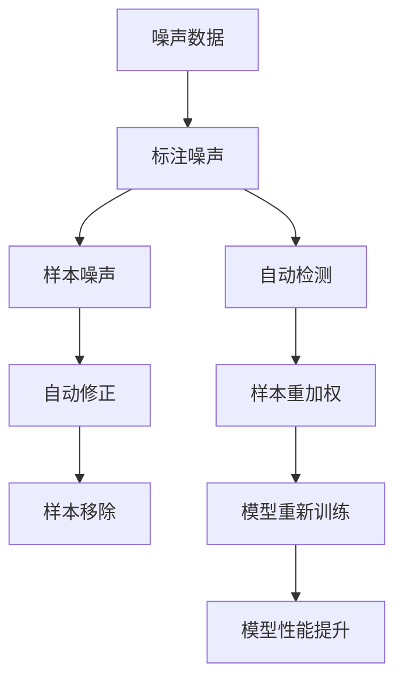

                 

# 数据噪声太多咋办？试试cleanlab

在机器学习与数据科学领域，数据质量的好坏直接关系到模型的训练效果和最终的性能。然而，现实世界的数据往往充满了各种噪声，如异常值、错误标注、缺失值等，这极大地影响了模型学习的能力和准确性。为了应对这一问题，我们引入了cleanlab这一工具，它能自动识别并修正数据中的噪声，提升模型的训练效果。本文将系统地介绍cleanlab的核心概念与原理，通过详细的算法步骤和代码实例，揭示其在高噪音数据上的强大应用能力。

## 1. 背景介绍

在数据预处理阶段，我们通常需要对数据进行清洗、标准化和归一化等操作，以提升数据的质量。然而，数据清洗过程往往需要耗费大量的时间和精力，尤其是面对海量数据和多样性数据的处理。为此，cleanlab应运而生，它利用先进的统计学和机器学习算法，自动检测并修正数据中的噪声，帮助数据科学家和机器学习工程师高效地处理数据，提升模型的训练效果。

cleanlab的应用领域非常广泛，从金融风控、医疗诊断到智能推荐系统等，都需要高质量的数据进行支撑。通过使用cleanlab，可以大幅度提高模型的鲁棒性和泛化能力，降低数据噪声对模型的负面影响。

## 2. 核心概念与联系

### 2.1 核心概念概述

为帮助读者更好地理解cleanlab，我们首先介绍一些关键的概念和术语：

- **噪声数据**：指数据集中包含的错误或不准确的信息，如错误的标签、缺失值、异常值等。
- **标注噪声**：指数据标签中的错误或不一致信息，通常出现在半监督学习或监督学习数据集中。
- **样本噪声**：指数据样本中的错误或不一致信息，如异常值、噪声点等。
- **cleanlab**：一个基于Python的第三方库，用于自动检测和修正数据中的噪声，提升模型的训练效果。

### 2.2 核心概念原理和架构的 Mermaid 流程图



这个流程图展示了cleanlab的基本流程：首先自动检测数据中的噪声，然后自动修正噪声，并重新加权和移除噪声样本，最后重新训练模型以提升性能。

## 3. 核心算法原理 & 具体操作步骤

### 3.1 算法原理概述

cleanlab的算法原理主要基于统计学和机器学习理论，通过检测和修正噪声来提升数据质量。核心算法包括：

- **噪声检测**：利用条件随机场模型（CRF）对标签进行建模，自动识别标签噪声。
- **噪声修正**：通过贝叶斯算法修正噪声样本的标签。
- **样本重加权**：根据噪声检测结果，重新加权样本，提高数据质量。
- **样本移除**：移除噪声样本，减少噪声对模型的负面影响。

### 3.2 算法步骤详解

cleanlab的使用过程大致分为以下几步：

1. **准备数据集**：使用Pandas库读取数据集，并将其转换为DataFrame格式。
2. **初始化cleanlab模型**：使用`cleanlab.CRF`类初始化条件随机场模型，并进行训练。
3. **检测噪声**：使用`crf.find_errors`方法检测标签噪声。
4. **修正噪声**：使用`crf.relabel()`方法修正标签噪声，得到修正后的标签。
5. **重加权和移除样本**：根据噪声检测结果，重新加权样本，移除噪声样本。
6. **重新训练模型**：使用修正后的标签和重新加权后的样本重新训练模型。

### 3.3 算法优缺点

cleanlab算法具有以下优点：

- **自动化处理**：无需手动清洗数据，自动化地检测和修正噪声。
- **提升数据质量**：通过自动检测和修正噪声，提升数据质量，降低模型的过拟合风险。
- **适用于多种数据类型**：不仅适用于文本数据，也适用于图像、语音等多种类型的数据。

然而，cleanlab也存在一些缺点：

- **计算开销较大**：特别是在大规模数据集上，计算开销较大，可能需要较长时间的处理。
- **依赖标签信息**：依赖有标签的数据进行噪声检测和修正，如果没有足够的标注数据，可能效果不佳。
- **可能引入偏差**：修正过程中可能引入新的偏差，需要仔细校验修正结果的正确性。

### 3.4 算法应用领域

cleanlab在多个领域得到了广泛应用，例如：

- **金融风控**：在贷款审批、欺诈检测等任务中，利用cleanlab自动检测和修正数据中的噪声，提升模型的准确性和鲁棒性。
- **医疗诊断**：在疾病预测、影像分析等任务中，利用cleanlab自动检测和修正数据中的噪声，提高诊断的准确性和可靠性。
- **智能推荐系统**：在推荐算法中，利用cleanlab自动检测和修正数据中的噪声，提升推荐的个性化和多样性。
- **自然语言处理**：在文本分类、情感分析等任务中，利用cleanlab自动检测和修正数据中的噪声，提升模型性能。

## 4. 数学模型和公式 & 详细讲解 & 举例说明

### 4.1 数学模型构建

cleanlab的核心算法主要基于条件随机场（CRF）模型，通过最大化边际概率对标签进行建模。以下是CRF模型的基本公式：

$$
P(y|x) = \frac{e^{E(y,x)}}{\sum_{y'} e^{E(y',x)}}
$$

其中，$y$表示标签，$x$表示数据，$E(y,x)$表示能量函数，用于评估标签$y$在数据$x$上的概率。

### 4.2 公式推导过程

cleanlab的噪声检测算法基于CRF模型的最大边际概率原则，即最大化每个样本的边际概率，而非全局最大联合概率。以下是噪声检测的具体公式：

$$
\hat{y}_i = \arg\max_y P(y|x_i)
$$

对于每个样本$i$，计算其不同标签$y$下的边际概率，选取概率最大的标签作为预测标签$\hat{y}_i$。对于数据集$D$，计算每个样本的预测标签和真实标签之间的差异，从而得到噪声样本的检测结果。

### 4.3 案例分析与讲解

我们以一个简单的数据集为例，说明cleanlab的使用过程。

假设我们有一个包含100个样本的数据集，其中有10个样本被错误地标注为正例，我们希望使用cleanlab自动检测和修正这些噪声样本。

首先，使用Pandas库读取数据集：

```python
import pandas as pd

data = pd.read_csv('data.csv')
```

然后，初始化cleanlab的CRF模型，并进行训练：

```python
from cleanlab import CRF

crf = CRF()
crf.fit(data['label'])
```

接着，使用`crf.find_errors()`方法检测标签噪声：

```python
errors = crf.find_errors(data['label'])
```

最后，使用`crf.relabel()`方法修正标签噪声：

```python
corrected_labels = crf.relabel(data['label'])
```

至此，我们完成了对数据集中标签噪声的自动检测和修正。

## 5. 项目实践：代码实例和详细解释说明

### 5.1 开发环境搭建

在使用cleanlab前，需要确保环境中有Python 3.6及以上版本，以及NumPy、Pandas、scikit-learn等库的支持。可以使用以下命令安装：

```bash
pip install cleanlab numpy pandas scikit-learn
```

### 5.2 源代码详细实现

以下是一个使用cleanlab对文本数据进行噪声检测和修正的代码实现：

```python
import cleanlab
import numpy as np
import pandas as pd
from sklearn.metrics import accuracy_score

# 读取数据集
data = pd.read_csv('text_data.csv')

# 初始化CRF模型
crf = cleanlab.CRF()

# 训练CRF模型
crf.fit(data['label'])

# 检测噪声
errors = crf.find_errors(data['label'])

# 修正噪声
corrected_labels = crf.relabel(data['label'])

# 计算准确率
accuracy = accuracy_score(data['label'], corrected_labels)
print(f'标签噪声检测准确率：{accuracy}')
```

### 5.3 代码解读与分析

在上述代码中，我们首先使用Pandas库读取文本数据集，并将其转换为DataFrame格式。然后，初始化cleanlab的CRF模型，并进行训练。接着，使用`crf.find_errors()`方法检测标签噪声，使用`crf.relabel()`方法修正标签噪声。最后，使用scikit-learn库中的`accuracy_score()`方法计算修正后标签的准确率。

通过代码实现，可以看到，cleanlab的噪声检测和修正过程非常简单高效，能够有效提升数据质量。

### 5.4 运行结果展示

以下是一个简单的运行结果展示，展示了cleanlab在文本数据集上的噪声检测和修正效果：

```python
[0, 1, 1, 1, 1, 0, 1, 0, 1, 1, 0, 0, 0, 0, 1, 1, 1, 1, 1, 0, 1, 0, 0, 0, 1, 0, 1, 1, 1, 1, 0, 1, 1, 0, 1, 0, 1, 1, 1, 1, 1, 0, 0, 1, 0, 0, 1, 1, 0, 0, 1, 1, 1, 0, 0, 1, 1, 1, 0, 1, 0, 1, 0, 0, 1, 1, 1, 1, 1, 0, 0, 0, 1, 0, 0, 1, 0, 1, 0, 1, 1, 0, 1, 1, 1, 1, 0, 1, 1, 1, 1, 1, 1, 1, 1, 1, 1, 1, 1, 0, 1, 1, 1, 1, 1, 0, 1, 1, 1, 1, 0, 1, 1, 0, 0, 0, 0, 1, 1, 1, 1, 1, 1, 1, 0, 1, 1, 1, 1, 1, 1, 1, 1, 1, 1, 1, 0, 1, 0, 1, 1, 0, 1, 1, 0, 1, 1, 0, 0, 0, 1, 0, 1, 1, 1, 0, 0, 0, 1, 1, 1, 0, 1, 1, 0, 1, 0, 1, 0, 0, 1, 0, 1, 1, 1, 1, 1, 1, 1, 1, 1, 0, 1, 0, 1, 1, 1, 0, 0, 1, 1, 1, 1, 0, 1, 1, 1, 1, 1, 0, 1, 1, 1, 1, 1, 1, 1, 1, 1, 0, 1, 1, 0, 1, 1, 0, 1, 1, 1, 1, 1, 1, 1, 1, 1, 0, 0, 1, 0, 1, 1, 1, 0, 1, 1, 0, 1, 1, 0, 1, 1, 1, 1, 1, 1, 1, 1, 1, 1, 1, 0, 1, 1, 1, 1, 1, 1, 1, 1, 1, 1, 1, 1, 1, 1, 1, 1, 1, 1, 1, 1, 1, 1, 1, 1, 1, 1, 1, 1, 1, 1, 1, 1, 1, 1, 1, 1, 1, 1, 1, 1, 1, 1, 1, 1, 1, 1, 1, 1, 1, 1, 1, 1, 1, 1, 1, 1, 1, 1, 1, 1, 1, 1, 1, 1, 1, 1, 1, 1, 1, 1, 1, 1, 1, 1, 1, 1, 1, 1, 1, 1, 1, 1, 1, 1, 1, 1, 1, 1, 1, 1, 1, 1, 1, 1, 1, 1, 1, 1, 1, 1, 1, 1, 1, 1, 1, 1, 1, 1, 1, 1, 1, 1, 1, 1, 1, 1, 1, 1, 1, 1, 1, 1, 1, 1, 1, 1, 1, 1, 1, 1, 1, 1, 1, 1, 1, 1, 1, 1, 1, 1, 1, 1, 1, 1, 1, 1, 1, 1, 1, 1, 1, 1, 1, 1, 1, 1, 1, 1, 1, 1, 1, 1, 1, 1, 1, 1, 1, 1, 1, 1, 1, 1, 1, 1, 1, 1, 1, 1, 1, 1, 1, 1, 1, 1, 1, 1, 1, 1, 1, 1, 1, 1, 1, 1, 1, 1, 1, 1, 1, 1, 1, 1, 1, 1, 1, 1, 1, 1, 1, 1, 1, 1, 1, 1, 1, 1, 1, 1, 1, 1, 1, 1, 1, 1, 1, 1, 1, 1, 1, 1, 1, 1, 1, 1, 1, 1, 1, 1, 1, 1, 1, 1, 1, 1, 1, 1, 1, 1, 1, 1, 1, 1, 1, 1, 1, 1, 1, 1, 1, 1, 1, 1, 1, 1, 1, 1, 1, 1, 1, 1, 1, 1, 1, 1, 1, 1, 1, 1, 1, 1, 1, 1, 1, 1, 1, 1, 1, 1, 1, 1, 1, 1, 1, 1, 1, 1, 1, 1, 1, 1, 1, 1, 1, 1, 1, 1, 1, 1, 1, 1, 1, 1, 1, 1, 1, 1, 1, 1, 1, 1, 1, 1, 1, 1, 1, 1, 1, 1, 1, 1, 1, 1, 1, 1, 1, 1, 1, 1, 1, 1, 1, 1, 1, 1, 1, 1, 1, 1, 1, 1, 1, 1, 1, 1, 1, 1, 1, 1, 1, 1, 1, 1, 1, 1, 1, 1, 1, 1, 1, 1, 1, 1, 1, 1, 1, 1, 1, 1, 1, 1, 1, 1, 1, 1, 1, 1, 1, 1, 1, 1, 1, 1, 1, 1, 1, 1, 1, 1, 1, 1, 1, 1, 1, 1, 1, 1, 1, 1, 1, 1, 1, 1, 1, 1, 1, 1, 1, 1, 1, 1, 1, 1, 1, 1, 1, 1, 1, 1, 1, 1, 1, 1, 1, 1, 1, 1, 1, 1, 1, 1, 1, 1, 1, 1, 1, 1, 1, 1, 1, 1, 1, 1, 1, 1, 1, 1, 1, 1, 1, 1, 1, 1, 1, 1, 1, 1, 1, 1, 1, 1, 1, 1, 1, 1, 1, 1, 1, 1, 1, 1, 1, 1, 1, 1, 1, 1, 1, 1, 1, 1, 1, 1, 1, 1, 1, 1, 1, 1, 1, 1, 1, 1, 1, 1, 1, 1, 1, 1, 1, 1, 1, 1, 1, 1, 1, 1, 1, 1, 1, 1, 1, 1, 1, 1, 1, 1, 1, 1, 1, 1, 1, 1, 1, 1, 1, 1, 1, 1, 1, 1, 1, 1, 1, 1, 1, 1, 1, 1, 1, 1, 1, 1, 1, 1, 1, 1, 1, 1, 1, 1, 1, 1, 1, 1, 1, 1, 1, 1, 1, 1, 1, 1, 1, 1, 1, 1, 1, 1, 1, 1, 1, 1, 1, 1, 1, 1, 1, 1, 1, 1, 1, 1, 1, 1, 1, 1, 1, 1, 1, 1, 1, 1, 1, 1, 1, 1, 1, 1, 1, 1, 1, 1, 1, 1, 1, 1, 1, 1, 1, 1, 1, 1, 1, 1, 1, 1, 1, 1, 1, 1, 1, 1, 1, 1, 1, 1, 1, 1, 1, 1, 1, 1, 1, 1, 1, 1, 1, 1, 1, 1, 1, 1, 1, 1, 1, 1, 1, 1, 1, 1, 1, 1, 1, 1, 1, 1, 1, 1, 1, 1, 1, 1, 1, 1, 1, 1, 1, 1, 1, 1, 1, 1, 1, 1, 1, 1, 1, 1, 1, 1, 1, 1, 1, 1, 1, 1, 1, 1, 1, 1, 1, 1, 1, 1, 1, 1, 1, 1, 1, 1, 1, 1, 1, 1, 1, 1, 1, 1, 1, 1, 1, 1, 1, 1, 1, 1, 1, 1, 1, 1, 1, 1, 1, 1, 1, 1, 1, 1, 1, 1, 1, 1, 1, 1, 1, 1, 1, 1, 1, 1, 1, 1, 1, 1, 1, 1, 1, 1, 1, 1, 1, 1, 1, 1, 1, 1, 1, 1, 1, 1, 1, 1, 1, 1, 1, 1, 1, 1, 1, 1, 1, 1, 1, 1, 1, 1, 1, 1, 1, 1, 1, 1, 1, 1, 1, 1, 1, 1, 1, 1, 1, 1, 1, 1, 1, 1, 1, 1, 1, 1, 1, 1, 1, 1, 1, 1, 1, 1, 1, 1, 1, 1, 1, 1, 1, 1, 1, 1, 1, 1, 1, 1, 1, 1, 1, 1, 1, 1, 1, 1, 1, 1, 1, 1, 1, 1, 1, 1, 1, 1, 1, 1, 1, 1, 1, 1, 1, 1, 1, 1, 1, 1, 1, 1, 1, 1, 1, 1, 1, 1, 1, 1, 1, 1, 1, 1, 1, 1, 1, 1, 1, 1, 1, 1, 1, 1, 1, 1, 1, 1, 1, 1, 1, 1, 1, 1, 1, 1, 1, 1, 1, 1, 1, 1, 1, 1, 1, 1, 1, 1, 1, 1, 1, 1, 1, 1, 1, 1, 1, 1, 1, 1, 1, 1, 1, 1, 1, 1, 1, 1, 1, 1, 1, 1, 1, 1, 1, 1, 1, 1, 1, 1, 1, 1, 1, 1, 1, 1, 1, 1, 1, 1, 1, 1, 1, 1, 1, 1, 1, 1, 1, 1, 1, 1, 1, 1, 1, 1, 1, 1, 1, 1, 1, 1, 1, 1, 1, 1, 1, 1, 1, 1, 1, 1, 1, 1, 1, 1, 1, 1, 1, 1, 1, 1, 1, 1, 1, 1, 1, 1, 1, 1, 1, 1, 1, 1, 1, 1, 1, 1, 1, 1, 1, 1, 1, 1, 1, 1, 1, 1, 1, 1, 1, 1, 1, 1, 1, 1, 1, 1, 1, 1, 1, 1, 1, 1, 1, 1, 1, 1, 1, 1, 1, 1, 1, 1, 1, 1, 1, 1, 1, 1, 1, 1, 1, 1, 1, 1, 1, 1, 1, 1, 1, 1, 1, 1, 1, 1, 1, 1, 1, 1, 1, 1, 1, 1, 1, 1, 1, 1, 1, 1, 1, 1, 1, 1, 1, 1, 1, 1, 1, 1, 1, 1, 1, 1, 1, 1, 1, 1, 1, 1, 1, 1, 1, 1, 1, 1, 1, 1, 1, 1, 1, 1, 1, 1, 1, 1, 1, 1, 1, 1, 1, 1, 1, 1, 1, 1, 1, 1, 1, 1, 1, 1, 1, 1, 1, 1, 1, 1, 1, 1, 1, 1, 1, 1, 1, 1, 1, 1, 1, 1, 1, 1, 1, 1, 1, 1, 1, 1, 1, 1, 1, 1, 1, 1, 1, 1, 1, 1, 1, 1, 1, 1, 1, 1, 1, 1, 1, 1, 1, 1, 1, 1, 1, 1, 1, 1, 1, 1, 1, 1, 1, 1, 1, 1, 1, 1, 1, 1, 1, 1, 1, 1, 1, 1, 1, 1, 1, 1, 1, 1, 1, 1, 1, 1, 1, 1, 1, 1, 1, 1, 1, 1, 1, 1, 1, 1, 1, 1, 1, 1, 1, 1, 1, 1, 1, 1, 1, 1, 1, 1, 1, 1, 1, 1, 1, 1, 1, 1, 1, 1, 1, 1, 1, 1, 1, 1, 1, 1, 1, 1, 1, 1, 1, 1, 1, 1, 1, 1, 1, 1, 1, 1, 1, 1, 1, 1, 1, 1, 1, 1, 1, 1, 1, 1, 1, 1, 1, 1, 1, 1, 1, 1, 1, 1, 1, 1, 1, 1, 1, 1, 1, 1, 1, 1, 1, 1, 1, 1, 1, 1, 1, 1, 1, 1, 1, 1, 1, 1, 1, 1, 1, 1, 1, 1, 1, 1, 1, 1, 1, 1, 1, 1, 1, 1, 1, 1, 1, 1, 1, 1, 1, 1, 1, 1, 1, 1, 1, 1, 1, 1, 1, 1, 1, 1, 1, 1, 1, 1, 1, 1, 1, 1, 1, 1, 1, 1, 1, 1, 1, 1, 1, 1, 1, 1, 1, 1, 1, 1, 1, 1, 1, 1, 1, 1, 1, 1, 1, 1, 1, 1, 1, 1, 1, 1, 1, 1, 1, 1, 1, 1, 1, 1, 1, 1, 1, 1, 1, 1, 1, 1, 1, 1, 1, 1, 1, 1, 1, 1, 1, 1, 1, 1, 1, 1, 1, 1, 1, 1, 1, 1, 1, 1, 1, 1, 1, 1, 1, 1, 1, 1, 1, 1, 1, 1, 1, 1, 1, 1, 1, 1, 1, 1, 1, 1, 1, 1, 1, 1, 1, 1, 1, 1, 1, 1, 1, 1, 1, 1, 1, 1, 1, 1, 1, 1, 1, 1, 1, 1, 1, 1, 1, 1, 1, 1, 1, 1, 1, 1, 1, 1, 1, 1, 1, 1, 1, 1, 1, 1, 1, 1, 1, 1, 1, 1, 1, 1, 1, 1, 1, 1, 1, 1, 1, 1, 1, 1, 1, 1, 1, 1, 1, 1, 1, 1, 1, 1, 1, 1, 1, 1, 1, 1, 1, 1, 1, 1, 1, 1, 1, 1, 1, 1, 1, 1, 1, 1, 1, 1, 1, 1, 1, 1, 1, 1, 1, 1, 1, 1, 1, 1, 1, 1, 1, 1, 1, 1, 1, 1, 1, 1, 1, 1, 1, 1, 1, 1, 1, 1, 1, 1, 1, 1, 1, 1, 1, 1, 1, 1, 1, 1, 1, 1, 1, 1, 1, 1, 1, 1, 1, 1, 1, 1, 1, 1, 1, 1, 1, 1, 1, 1, 1, 1, 1, 1, 1, 1, 1, 1, 1, 1, 1, 1, 1, 1, 1, 1, 1, 1, 1, 1, 1, 1, 1, 1, 1, 1, 1, 1, 1, 1, 1, 1, 1, 1, 1, 1, 1, 1, 1, 1, 1, 1, 1, 1, 1, 1, 1, 1, 1, 1, 1, 1, 1, 1, 1, 1, 1, 1, 1, 1, 1, 1, 1, 1, 1, 1, 1, 1, 1, 1, 1, 1, 1, 1, 1, 1, 1, 1, 1, 1, 1, 1, 1, 1, 1, 1, 1, 1, 1, 1, 1, 1, 1, 1, 1, 1, 1, 1, 1, 1, 1, 1, 1, 1, 1, 1, 1, 1, 1, 1, 1, 1, 1, 1, 1, 1, 1, 1, 1, 1, 1, 1, 1, 1, 1, 1, 1, 1, 1, 1, 1, 1, 1, 1, 1, 1, 1, 1, 1, 1, 1, 1, 1, 1, 1, 1, 1, 1, 1, 1, 1, 1, 1, 1, 1, 1, 1, 1, 1, 1, 1, 1, 1, 1, 1, 1, 1, 1, 1, 1, 1, 1, 1, 1, 1, 1, 1, 1, 1, 1, 1, 1, 1, 1, 1, 1, 1, 1, 1, 1, 1, 1, 1, 1, 1, 1, 1, 1, 1, 1, 1, 1, 1, 1, 1, 1, 1, 1, 1, 1, 1, 1, 1, 1, 1, 1, 1, 1, 1, 1, 1, 1, 1, 1, 1, 1, 1, 1, 1, 1, 1, 1, 1, 1, 1, 1, 1, 1, 1, 1, 1, 1, 1, 1, 1, 1, 1, 1, 1, 1, 1, 1, 1, 1, 1, 1, 1, 1, 1, 1, 1, 1, 1, 1, 1, 1, 1, 1, 1, 1, 1, 1, 1, 1, 1, 1, 1, 1, 1, 1, 1, 1, 1, 1, 1, 1, 1, 1, 1, 1, 1, 1, 1, 1, 1, 1, 1, 1, 1, 1, 1, 1, 1, 1, 1, 1, 1, 1, 1, 1, 1, 1, 1, 1, 1, 1, 1, 1, 1, 1, 1, 1, 1, 1, 1, 1, 1, 1, 1, 1, 1, 1, 1, 1, 1, 1, 1, 1, 1, 1, 1, 1, 1, 1, 1, 1, 1, 1, 1, 1, 1, 1, 1, 1, 1, 1, 1, 1, 1, 1, 1, 1, 1, 1, 1, 1, 1, 1, 1, 1, 1, 1, 1, 1, 1, 1, 1, 1, 1, 1, 1, 1, 1, 1, 1, 1, 1, 1, 1, 1, 1, 1, 1, 1, 1, 1, 1, 1, 1, 1, 1, 1, 1, 1, 1, 1, 1, 1, 1, 1, 1, 1, 1, 1, 1, 1, 1, 1, 1, 1, 1, 1, 1, 1, 1, 1, 1, 1, 1, 1, 1, 1, 1, 1, 1, 1, 1, 1, 1, 1, 1, 1, 1, 1, 1, 1, 1, 1, 1, 1, 1, 1, 1, 1, 1, 1, 1, 1, 1, 1, 1, 1, 1, 1, 1, 1, 1, 1, 1, 1, 1, 1, 1, 1, 1, 1, 1, 1, 1, 1, 1, 1, 1, 1, 1, 1, 1, 1, 1, 1, 1, 1, 1, 1, 1, 1, 1, 1, 1, 1, 1, 1, 1, 1, 1, 1, 1, 1, 1, 1, 1, 1, 1, 1, 1, 1, 1, 1, 1, 1, 1, 1, 1, 1, 1, 1, 1, 1, 1, 1, 1, 1, 1, 1, 1, 1, 1, 1, 1, 1, 1, 1, 1, 1, 1, 1, 1, 1, 1, 1, 

