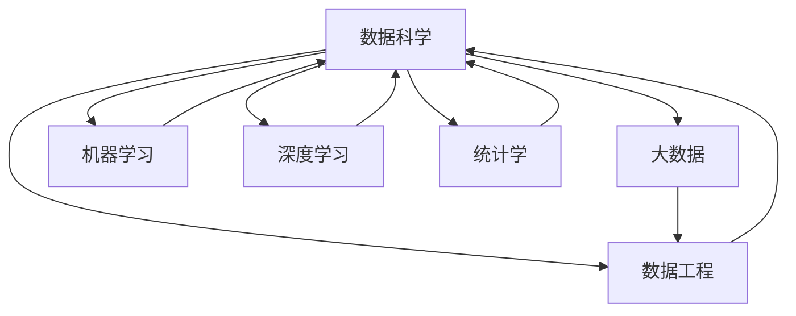

                 

# 数据科学 (Data Science)

> 关键词：数据科学,机器学习,深度学习,大数据,统计学,数据工程

## 1. 背景介绍

### 1.1 问题由来
数据科学(Data Science)是21世纪最热门的学科之一，是数据驱动决策和创新的关键领域。它涵盖从数据收集、数据预处理、数据建模、数据解释到数据应用的全过程，在金融、医疗、电商、物流、社交网络等众多领域有着广泛的应用。数据科学不仅仅是一种技术手段，更是一种思维模式和文化，它强调数据为王、事实说话，倡导科学推理和实证研究。

随着大数据时代的到来，企业对数据的需求急剧增长，数据科学的作用日益凸显。数据科学可以帮助企业深入挖掘数据价值，优化运营决策，提高产品质量，提升客户满意度。但与此同时，数据科学也面临诸多挑战，包括数据质量差、数据量大、数据孤岛等。数据科学的发展迫切需要新的方法和工具来应对这些问题。

## 2. 核心概念与联系

### 2.1 核心概念概述

数据科学的核心概念包括：

- 数据科学(Data Science)：一门利用数据和算法解决实际问题的学科，涉及数据预处理、特征工程、模型选择、模型评估等多个环节。

- 机器学习(Machine Learning)：数据科学的重要组成部分，通过算法使计算机系统自动地从数据中学习规律，并进行预测或决策。

- 深度学习(Deep Learning)：机器学习的一种特殊形式，通过多层神经网络模拟人脑处理信息的方式，适用于处理复杂非线性的数据。

- 大数据(Big Data)：数据规模巨大、结构复杂、变化迅速的数据集合，需要分布式计算和存储技术来处理。

- 统计学(Statistics)：数据科学的基础，通过抽样和概率模型对数据进行分析和推断，提供科学依据。

- 数据工程(Data Engineering)：数据科学的前端工程，包括数据采集、清洗、存储、管理和访问等，是数据科学实现的基础。

这些概念之间存在紧密的联系，共同构成了数据科学的完整体系。数据科学强调数据的价值和质量，通过机器学习和深度学习技术，从数据中提取知识并形成决策支持。大数据和统计学则提供了数据处理和分析的保障。数据工程则是数据科学落地的桥梁，确保数据能够被有效管理和访问。

### 2.2 核心概念原理和架构的 Mermaid 流程图(Mermaid 流程节点中不要有括号、逗号等特殊字符)



## 3. 核心算法原理 & 具体操作步骤

### 3.1 算法原理概述

数据科学的核心理论和算法框架可以分为以下几个主要部分：

- 数据预处理：通过清洗、转换、归一化等方法，将原始数据转化为适合建模的格式。
- 特征工程：从原始数据中提取有意义的特征，供模型使用。
- 模型选择：选择适合任务的机器学习或深度学习模型。
- 模型训练与评估：通过训练数据对模型进行训练，并通过验证集或测试集评估模型性能。
- 模型优化：通过超参数调优、正则化等方法提升模型性能。
- 模型部署与监控：将模型应用到实际场景中，并持续监控模型性能和效果。

这些步骤构成了数据科学的完整流程，涵盖了从数据准备到模型应用的全过程。以下详细介绍数据科学的各个核心步骤。

### 3.2 算法步骤详解

#### 数据预处理

数据预处理的目标是清洗和转换原始数据，以便于后续的建模工作。常见的数据预处理包括：

- 数据清洗：识别并处理缺失值、异常值、重复值等问题。
- 数据转换：通过标准化、归一化等方法，将数据转换为合适范围。
- 特征工程：从原始数据中提取特征，供模型使用。

#### 特征工程

特征工程是将原始数据转化为模型可用的特征的过程。常用的特征工程方法包括：

- 特征提取：从原始数据中提取有意义的特征，如从文本中提取关键词、TF-IDF值等。
- 特征选择：选择对模型预测有贡献的特征，避免维度灾难。
- 特征变换：通过降维、PCA等方法，减少特征维度，提升模型性能。

#### 模型选择

模型选择是数据科学中至关重要的一步，不同的模型适用于不同的任务。常用的机器学习模型包括：

- 线性回归、逻辑回归、决策树等传统模型，适用于简单线性或分类问题。
- 支持向量机(SVM)、随机森林(Random Forest)等模型，适用于复杂分类问题。
- 神经网络、深度学习模型，如卷积神经网络(CNN)、循环神经网络(RNN)等，适用于复杂非线性问题。

#### 模型训练与评估

模型训练是利用训练数据对模型进行参数优化，以便于模型能够准确预测新数据。常用的模型训练方法包括：

- 批量梯度下降(Batch Gradient Descent)、随机梯度下降(Stochastic Gradient Descent)等方法，用于模型参数优化。
- 交叉验证(Cross Validation)、K折交叉验证(K-fold Cross Validation)等方法，用于模型评估。

#### 模型优化

模型优化是提升模型性能的关键步骤，常用的方法包括：

- 超参数调优：通过网格搜索、贝叶斯优化等方法，寻找最优超参数组合。
- 正则化：通过L1、L2正则、Dropout等方法，避免模型过拟合。
- 模型融合：通过集成多个模型，提升模型性能和鲁棒性。

#### 模型部署与监控

模型部署是将训练好的模型应用到实际场景中的过程，常用的方法包括：

- RESTful API：将模型封装为API接口，供外部系统调用。
- 数据库表：将模型结果存储到数据库中，供系统查询使用。
- 微服务：将模型集成到微服务体系中，提升系统可扩展性和可靠性。

模型监控是确保模型性能和效果的关键，常用的方法包括：

- 模型评估：通过A/B测试、混淆矩阵等方法，评估模型性能。
- 实时监控：通过日志记录、告警系统等方法，实时监控模型状态。
- 模型更新：定期更新模型参数，提升模型性能和鲁棒性。

## 4. 数学模型和公式 & 详细讲解 & 举例说明

### 4.1 数学模型构建

数据科学中的数学模型主要分为两类：统计模型和机器学习模型。以下分别介绍这两种模型的构建方法。

#### 统计模型

统计模型主要基于概率论和统计学原理，通过数据对模型进行推断和预测。常用的统计模型包括：

- 线性回归：$y=\beta_0+\beta_1x_1+\beta_2x_2+...+\beta_nx_n+\epsilon$，其中 $\beta_0,...,\beta_n$ 为回归系数，$\epsilon$ 为误差项。
- 逻辑回归：$P(y=1|\mathbf{x})=\frac{1}{1+e^{-\mathbf{w}\cdot\mathbf{x}+b}}$，其中 $\mathbf{w}$ 为权重向量，$b$ 为偏置项。

#### 机器学习模型

机器学习模型主要通过数据对模型进行训练和预测，常用的机器学习模型包括：

- 决策树：通过树形结构对数据进行分类和预测，常用的算法有CART、C4.5等。
- 支持向量机(SVM)：通过最大化边际和最小化间隔对数据进行分类，常用的算法有C-Support Vector Machine、Kernel SVM等。
- 神经网络：通过多层神经元对数据进行分类和预测，常用的算法有BP网络、深度神经网络等。

### 4.2 公式推导过程

以线性回归模型为例，推导其最小二乘法最优解公式。

设线性回归模型为 $y=\beta_0+\beta_1x_1+\beta_2x_2+...+\beta_nx_n+\epsilon$，其中 $\beta_0,...,\beta_n$ 为回归系数，$\epsilon$ 为误差项。

最小二乘法的目标是使得预测误差最小，即 $\min_{\beta_0,...,\beta_n}\sum_{i=1}^m(y_i-\beta_0-\beta_1x_{i1}-\beta_2x_{i2}-...-\beta_nx_{in})^2$。

对上式求偏导数，得：

$$
\begin{aligned}
&\frac{\partial \sum_{i=1}^m(y_i-\beta_0-\beta_1x_{i1}-\beta_2x_{i2}-...-\beta_nx_{in})^2}{\partial \beta_j} \\
&= -2\sum_{i=1}^m(y_i-\beta_0-\beta_1x_{i1}-\beta_2x_{i2}-...-\beta_nx_{in})(x_{ij}) \\
&= -2(X^TX)^{-1}X^T(y-X\beta)
\end{aligned}
$$

其中 $X=[x_{i1},...,x_{in}]^T$，$y=[y_1,...,y_n]^T$，$\beta=[\beta_0,...,\beta_n]^T$。

根据上述推导，线性回归模型的最小二乘法最优解为：

$$
\hat{\beta}=(X^TX)^{-1}X^Ty
$$

### 4.3 案例分析与讲解

#### 案例1：房价预测

某房地产公司收集了100个房屋的特征数据，包括面积、房间数量、地理位置等，以及每个房屋的市场价格。目标任务是预测新房屋的市场价格。

首先，对数据进行清洗和转换，将原始数据转化为适合建模的格式。然后，使用特征工程方法，从原始数据中提取有意义的特征，如面积、房间数量、地理位置等。

接着，选择线性回归模型进行训练和预测。通过交叉验证方法，对模型进行调优，选择最优超参数组合。最后，将训练好的模型应用到实际场景中，实时预测新房屋的市场价格。

#### 案例2：信用卡欺诈检测

某银行收集了数百万张信用卡的交易数据，目标是检测和预防信用卡欺诈行为。

首先，对数据进行清洗和转换，将原始数据转化为适合建模的格式。然后，使用特征工程方法，从原始数据中提取有意义的特征，如交易金额、交易时间、交易地点等。

接着，选择支持向量机(SVM)模型进行训练和预测。通过交叉验证方法，对模型进行调优，选择最优超参数组合。最后，将训练好的模型应用到实际场景中，实时检测和预防信用卡欺诈行为。

## 5. 项目实践：代码实例和详细解释说明

### 5.1 开发环境搭建

进行数据科学项目开发，需要先准备好开发环境。以下是使用Python进行PyTorch开发的常见环境配置流程：

1. 安装Anaconda：从官网下载并安装Anaconda，用于创建独立的Python环境。

2. 创建并激活虚拟环境：
```bash
conda create -n pytorch-env python=3.8 
conda activate pytorch-env
```

3. 安装PyTorch：根据CUDA版本，从官网获取对应的安装命令。例如：
```bash
conda install pytorch torchvision torchaudio cudatoolkit=11.1 -c pytorch -c conda-forge
```

4. 安装Pandas、NumPy、Matplotlib等数据科学相关库：
```bash
pip install pandas numpy matplotlib scikit-learn seaborn
```

完成上述步骤后，即可在`pytorch-env`环境中开始数据科学项目的开发。

### 5.2 源代码详细实现

下面以房价预测项目为例，给出使用PyTorch进行机器学习模型训练和预测的代码实现。

首先，定义数据加载函数：

```python
import pandas as pd
import numpy as np
from sklearn.model_selection import train_test_split
from torch.utils.data import Dataset, DataLoader
import torch
from torch import nn, optim

class HousingDataset(Dataset):
    def __init__(self, data, target, transform=None):
        self.data = data
        self.target = target
        self.transform = transform
        
    def __len__(self):
        return len(self.data)
    
    def __getitem__(self, idx):
        sample = self.data.iloc[idx]
        target = self.target.iloc[idx]
        
        if self.transform:
            sample = self.transform(sample)
            
        return sample, target

# 加载数据
data = pd.read_csv('housing.csv')
X = data.drop('price', axis=1)
y = data['price']
X_train, X_test, y_train, y_test = train_test_split(X, y, test_size=0.2, random_state=42)
train_dataset = HousingDataset(X_train, y_train, transform=transform)
test_dataset = HousingDataset(X_test, y_test, transform=transform)
```

然后，定义线性回归模型：

```python
class LinearRegression(nn.Module):
    def __init__(self, input_dim, output_dim):
        super(LinearRegression, self).__init__()
        self.linear = nn.Linear(input_dim, output_dim)
    
    def forward(self, x):
        out = self.linear(x)
        return out

# 初始化模型
input_dim = X_train.shape[1]
output_dim = 1
model = LinearRegression(input_dim, output_dim)
```

接着，定义优化器和损失函数：

```python
# 定义损失函数
criterion = nn.MSELoss()

# 定义优化器
optimizer = optim.SGD(model.parameters(), lr=0.01)
```

然后，定义训练和评估函数：

```python
# 定义训练函数
def train_epoch(model, dataset, optimizer, criterion):
    dataloader = DataLoader(dataset, batch_size=32, shuffle=True)
    model.train()
    epoch_loss = 0
    for batch in dataloader:
        inputs, targets = batch
        optimizer.zero_grad()
        outputs = model(inputs)
        loss = criterion(outputs, targets)
        loss.backward()
        optimizer.step()
        epoch_loss += loss.item()
    return epoch_loss / len(dataloader)

# 定义评估函数
def evaluate(model, dataset, criterion):
    dataloader = DataLoader(dataset, batch_size=32, shuffle=False)
    model.eval()
    total_loss = 0
    with torch.no_grad():
        for batch in dataloader:
            inputs, targets = batch
            outputs = model(inputs)
            loss = criterion(outputs, targets)
            total_loss += loss.item()
    return total_loss / len(dataloader)
```

最后，启动训练流程并在测试集上评估：

```python
epochs = 100
device = torch.device('cuda' if torch.cuda.is_available() else 'cpu')

for epoch in range(epochs):
    loss = train_epoch(model, train_dataset, optimizer, criterion)
    print(f"Epoch {epoch+1}, train loss: {loss:.3f}")
    
    print(f"Epoch {epoch+1}, test loss: {evaluate(model, test_dataset, criterion):.3f}")
    
print("Training finished.")
```

以上就是使用PyTorch进行房价预测的完整代码实现。可以看到，PyTorch提供了丰富的API接口，使得模型训练和预测变得简单高效。

### 5.3 代码解读与分析

让我们再详细解读一下关键代码的实现细节：

**HousingDataset类**：
- `__init__`方法：初始化训练集和测试集的数据和标签，并定义数据转换方法。
- `__len__`方法：返回数据集的样本数量。
- `__getitem__`方法：返回单个样本，并进行数据转换。

**LinearRegression类**：
- `__init__`方法：定义线性回归模型，包含一个线性层。
- `forward`方法：前向传播计算模型输出。

**训练和评估函数**：
- 使用PyTorch的DataLoader对数据集进行批次化加载，供模型训练和推理使用。
- 训练函数`train_epoch`：对数据以批为单位进行迭代，在每个批次上前向传播计算loss并反向传播更新模型参数。
- 评估函数`evaluate`：与训练类似，不同点在于不更新模型参数，并在每个batch结束后将预测和标签结果存储下来，最后计算平均loss。

**训练流程**：
- 定义总的epoch数，开始循环迭代。
- 每个epoch内，先在训练集上训练，输出平均loss。
- 在测试集上评估，输出平均loss。
- 所有epoch结束后，停止训练。

可以看到，PyTorch的Tensor和nn模块使得模型训练和预测变得简单高效。开发者可以将更多精力放在数据处理、模型改进等高层逻辑上，而不必过多关注底层的实现细节。

## 6. 实际应用场景

### 6.1 智能推荐系统

智能推荐系统是数据科学的重要应用之一，旨在根据用户的历史行为和偏好，推荐个性化的物品。例如，电商网站根据用户浏览和购买记录，推荐用户可能感兴趣的商品。

推荐系统通常分为三个步骤：

1. 用户特征工程：从用户行为数据中提取有意义的特征，如浏览时间、点击次数、评分等。
2. 物品特征工程：从物品数据中提取有意义的特征，如价格、类别、属性等。
3. 模型选择与训练：选择适合推荐任务的模型，如协同过滤、矩阵分解等，并在训练数据上对模型进行训练和调优。

在模型训练和调优过程中，数据科学发挥着重要作用。通过数据预处理、特征工程、模型选择等步骤，数据科学能够高效地构建推荐模型，提升推荐效果和用户体验。

### 6.2 金融风险管理

金融风险管理是数据科学的另一重要应用，旨在通过数据分析和建模，识别和预防金融风险。例如，银行可以通过分析客户的交易数据，预测客户的信用风险。

金融风险管理通常分为四个步骤：

1. 数据采集：收集客户的交易记录、信用记录、收入水平等数据。
2. 数据清洗和转换：清洗和转换原始数据，提取有意义的特征，如交易金额、交易时间、交易地点等。
3. 模型选择与训练：选择适合信用风险预测的模型，如逻辑回归、支持向量机等，并在训练数据上对模型进行训练和调优。
4. 模型部署与应用：将训练好的模型应用到实际场景中，实时监测和预防金融风险。

在模型训练和调优过程中，数据科学发挥着重要作用。通过数据预处理、特征工程、模型选择等步骤，数据科学能够高效地构建金融风险管理模型，提升模型的准确性和鲁棒性。

### 6.3 智能客服系统

智能客服系统是数据科学在客户服务中的应用之一，旨在通过自然语言处理和机器学习技术，实现自动化的客服支持。例如，电商平台可以通过分析客户的咨询记录，自动回复客户的常见问题。

智能客服系统通常分为三个步骤：

1. 数据采集：收集客户的咨询记录、历史订单、用户画像等数据。
2. 数据清洗和转换：清洗和转换原始数据，提取有意义的特征，如用户意图、问题类型、回复质量等。
3. 模型选择与训练：选择适合自然语言处理的模型，如文本分类、序列生成等，并在训练数据上对模型进行训练和调优。

在模型训练和调优过程中，数据科学发挥着重要作用。通过数据预处理、特征工程、模型选择等步骤，数据科学能够高效地构建智能客服系统，提升客服效率和客户满意度。

### 6.4 未来应用展望

随着数据科学技术的不断发展，未来的应用前景将更加广阔，涵盖更多行业和场景。以下展望几个未来可能的应用方向：

1. 智慧城市：数据科学在智慧城市中的应用将更加广泛，涵盖交通管理、环境监测、公共安全等诸多领域。通过数据分析和建模，智慧城市将实现更高效、更智能的运营管理。

2. 医疗健康：数据科学在医疗健康中的应用将更加深入，涵盖疾病诊断、患者管理、药物研发等诸多领域。通过数据分析和建模，医疗健康将实现更精准、更个性化的医疗服务。

3. 金融科技：数据科学在金融科技中的应用将更加多样化，涵盖投资分析、风险管理、客户服务等诸多领域。通过数据分析和建模，金融科技将实现更智能、更安全的金融服务。

4. 智能制造：数据科学在智能制造中的应用将更加广泛，涵盖生产优化、设备维护、供应链管理等诸多领域。通过数据分析和建模，智能制造将实现更高效、更智能的生产运营。

5. 社交网络：数据科学在社交网络中的应用将更加深入，涵盖用户行为分析、内容推荐、广告投放等诸多领域。通过数据分析和建模，社交网络将实现更智能、更个性化的内容推荐。

总之，数据科学将在更多领域带来变革性影响，为各行各业注入新的活力和效率。

## 7. 工具和资源推荐

### 7.1 学习资源推荐

为了帮助开发者系统掌握数据科学的理论基础和实践技巧，这里推荐一些优质的学习资源：

1. 《Python数据科学手册》：一本全面介绍数据科学技术的书籍，涵盖数据处理、机器学习、深度学习、数据可视化等多个方面。

2. 《机器学习实战》：一本实战导向的书籍，涵盖机器学习算法、模型调优、案例分析等多个方面，适合初学者和进阶学习者。

3. 《深度学习》：一本系统介绍深度学习技术的书籍，涵盖神经网络、卷积神经网络、循环神经网络等多个方面。

4. 《统计学习方法》：一本经典的统计学习书籍，涵盖统计学基础、回归分析、分类分析等多个方面，适合数据科学入门学习。

5. 《Python for Data Science Handbook》：一本介绍数据科学技术的书籍，涵盖数据处理、数据分析、数据可视化等多个方面，适合Python初学者。

通过这些资源的学习实践，相信你一定能够快速掌握数据科学的精髓，并用于解决实际的NLP问题。

### 7.2 开发工具推荐

高效的数据科学开发离不开优秀的工具支持。以下是几款用于数据科学开发常用的工具：

1. Jupyter Notebook：一个交互式的编程环境，支持多种编程语言，适合数据科学和机器学习任务开发。

2. Scikit-learn：一个常用的机器学习库，包含多种常用的机器学习算法和工具。

3. TensorFlow：一个常用的深度学习框架，支持多种深度学习算法和模型。

4. PyTorch：一个常用的深度学习框架，支持动态图和静态图，适合灵活的模型构建和训练。

5. Pandas：一个常用的数据处理库，支持数据清洗、转换、分析等多个方面。

6. Numpy：一个常用的数值计算库，支持高效的多维数组操作。

7. Matplotlib：一个常用的数据可视化库，支持多种图表类型的绘制。

8. Seaborn：一个基于Matplotlib的数据可视化库，支持更高级的统计图表绘制。

合理利用这些工具，可以显著提升数据科学项目的开发效率，加快创新迭代的步伐。

### 7.3 相关论文推荐

数据科学的理论和技术不断发展，以下几篇经典论文推荐阅读：

1. 《A Tutorial on Support Vector Machines for Pattern Recognition》：介绍支持向量机的基本原理和算法，是机器学习领域的经典论文。

2. 《Deep Learning》：介绍深度学习的基本原理和算法，是深度学习领域的经典书籍。

3. 《A Framework for Comparing Machine Learning Algorithms》：介绍机器学习算法的比较框架，涵盖回归、分类、聚类等多个方面。

4. 《On the Shoulder of Giants》：介绍计算机科学的经典书籍，涵盖算法、数据结构、操作系统等多个方面。

5. 《Machine Learning Yearning》：介绍机器学习的基本原理和实践技巧，适合初学者和进阶学习者。

这些论文和书籍将帮助你系统掌握数据科学的理论基础和实践技巧，提升数据科学项目的开发效率。

## 8. 总结：未来发展趋势与挑战

### 8.1 总结

本文对数据科学进行了全面系统的介绍。数据科学是一门利用数据和算法解决实际问题的学科，涵盖数据预处理、特征工程、模型选择、模型评估等多个环节。通过对数据进行清洗、转换、提取、建模等步骤，数据科学能够高效地解决各类实际问题，涵盖金融、医疗、电商、物流、社交网络等多个领域。

## 8.2 未来发展趋势

展望未来，数据科学将呈现以下几个发展趋势：

1. 数据科学与其他学科的融合将更加深入，推动跨学科的创新和突破。例如，数据科学与人工智能的融合将催生更多智能应用，数据科学与金融学的融合将推动金融科技的发展。

2. 数据科学将更加注重数据的隐私和安全，确保数据采集、存储、传输和使用的合规性和安全性。数据科学将引入更多加密技术和隐私保护技术，确保数据的隐私和安全。

3. 数据科学将更加注重模型的解释和可解释性，确保模型的决策过程透明和可理解。数据科学将引入更多因果分析、可视化技术，确保模型的决策过程透明和可理解。

4. 数据科学将更加注重模型的公平和公正，确保模型的决策过程公平和公正。数据科学将引入更多公平性、公正性分析技术，确保模型的决策过程公平和公正。

5. 数据科学将更加注重模型的鲁棒性和泛化性，确保模型在复杂环境下的稳定性和可靠性。数据科学将引入更多鲁棒性、泛化性分析技术，确保模型在复杂环境下的稳定性和可靠性。

## 8.3 面临的挑战

尽管数据科学已经取得了显著的进展，但在迈向更加智能化、普适化应用的过程中，它仍面临诸多挑战：

1. 数据质量差：原始数据可能存在缺失值、异常值、噪声等问题，影响数据质量。如何高效处理和清洗数据，是数据科学的重要挑战。

2. 数据孤岛：数据通常分散在不同的部门和系统中，难以整合和共享。如何构建统一的数据平台，打破数据孤岛，是数据科学的重要挑战。

3. 数据规模大：大规模数据集的处理和存储对硬件和算法提出了高要求。如何高效地处理大规模数据，是数据科学的重要挑战。

4. 模型复杂性高：现代数据科学模型通常非常复杂，难以理解和调试。如何提高模型的可解释性和可理解性，是数据科学的重要挑战。

5. 模型安全性低：数据科学模型可能存在安全漏洞，被恶意攻击和利用。如何确保数据科学模型的安全性，是数据科学的重要挑战。

## 8.4 研究展望

面对数据科学所面临的挑战，未来的研究需要在以下几个方面寻求新的突破：

1. 探索新的数据采集和预处理技术，确保数据质量。例如，引入自动数据清洗技术、异常检测技术，提升数据处理效率和数据质量。

2. 构建统一的数据平台，打破数据孤岛。例如，引入数据仓库、数据湖技术，构建统一的数据平台，确保数据共享和访问。

3. 开发高效的数据处理和存储技术，处理大规模数据。例如，引入分布式计算、大数据技术，提高数据处理和存储效率。

4. 提升模型的可解释性和可理解性，提高模型的可解释性。例如，引入可视化技术、因果分析技术，提高模型的可解释性和可理解性。

5. 增强模型的安全性，确保数据科学模型的安全性。例如，引入数据加密技术、安全审计技术，确保数据科学模型的安全性。

这些研究方向的探索，必将引领数据科学技术迈向更高的台阶，为各行各业带来更多的创新和突破。面向未来，数据科学技术还将与其他技术不断融合，推动人工智能技术的进一步发展，为构建智能社会注入新的活力和动力。

## 9. 附录：常见问题与解答

**Q1：数据科学需要哪些基础技能？**

A: 数据科学需要掌握以下几个基础技能：

1. 编程语言：Python、R、SQL等常用编程语言。

2. 数据处理：数据清洗、数据转换、数据可视化等技术。

3. 统计学：概率论、统计推断、回归分析等基础统计学知识。

4. 机器学习：线性回归、逻辑回归、支持向量机等常用机器学习算法。

5. 深度学习：神经网络、卷积神经网络、循环神经网络等常用深度学习算法。

6. 数据工程：数据采集、数据存储、数据管理等技术。

掌握以上技能，才能高效地构建数据科学模型，解决实际问题。

**Q2：如何选择适合的数据科学模型？**

A: 选择适合的数据科学模型需要考虑以下几个因素：

1. 数据类型：不同的数据类型适合不同的模型，例如数值型数据适合线性回归模型，分类数据适合逻辑回归模型。

2. 数据量：数据量较大时，适合使用随机森林、深度学习等复杂模型，数据量较小时，适合使用线性回归、逻辑回归等简单模型。

3. 特征数量：特征数量较多时，适合使用降维技术、矩阵分解等方法，特征数量较少时，适合使用特征工程技术。

4. 模型性能：模型性能较低的模型通常适用于简单问题，模型性能较高的模型适用于复杂问题。

5. 可解释性：模型的可解释性越高，越容易理解和调试。例如，决策树模型具有较高的可解释性，神经网络模型具有较低的可解释性。

综合考虑以上因素，选择适合的数据科学模型，才能高效地解决实际问题。

**Q3：如何评估数据科学模型的性能？**

A: 评估数据科学模型的性能通常需要考虑以下几个指标：

1. 准确率：模型正确预测的比例，用于评估分类模型的性能。

2. 精确率、召回率、F1-score：评估分类模型在不同阈值下的性能。

3. 均方误差、均方根误差、R-squared：评估回归模型的性能。

4. 混淆矩阵：评估分类模型的性能，提供更详细的指标。

5. ROC曲线、AUC值：评估分类模型的性能，提供更全面的指标。

6. 训练时间和内存占用：评估模型的训练效率和内存占用。

通过以上指标，可以全面评估数据科学模型的性能，选择最优模型。

**Q4：如何优化数据科学模型的性能？**

A: 优化数据科学模型通常需要考虑以下几个方法：

1. 数据预处理：通过数据清洗、数据转换、数据增强等方法，提升数据质量。

2. 特征工程：通过特征提取、特征选择、特征变换等方法，提升特征质量。

3. 模型调优：通过超参数调优、正则化等方法，提升模型性能。

4. 模型融合：通过集成多个模型，提升模型性能和鲁棒性。

5. 模型部署：通过模型封装、模型服务化等方法，提升模型部署效率。

6. 模型监控：通过实时监控、日志记录等方法，提升模型性能和稳定性。

通过以上方法，可以高效地优化数据科学模型的性能，提升模型的准确性和鲁棒性。

**Q5：如何构建可解释的模型？**

A: 构建可解释的模型需要考虑以下几个方法：

1. 可视化技术：通过可视化技术，展示模型的决策过程，提升模型的可解释性。

2. 特征重要性分析：通过特征重要性分析，展示每个特征对模型预测的贡献度，提升模型的可解释性。

3. 模型分解：通过模型分解，展示每个特征对模型预测的贡献度，提升模型的可解释性。

4. 因果分析：通过因果分析，展示模型预测的因果关系，提升模型的可解释性。

5. 模型简化：通过模型简化，减少模型的复杂性，提升模型的可解释性。

通过以上方法，可以高效地构建可解释的模型，提升模型的可理解性和可信任度。

---

作者：禅与计算机程序设计艺术 / Zen and the Art of Computer Programming

