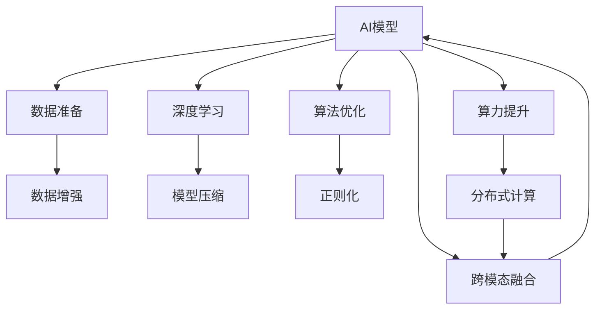

                 

# 数据、算法、算力在第二代AI中的应用

> 关键词：AI模型, 数据准备, 深度学习, 算法优化, 算力提升, 应用场景, 技术趋势, 未来展望

## 1. 背景介绍

随着人工智能技术的不断发展和深入应用，越来越多的企业和研究机构开始意识到数据、算法和算力在AI系统构建中的核心地位。本文将从这三大要素入手，系统介绍其在第二代AI中的应用和发展，探讨如何通过优化这三方面的资源，进一步推动AI技术的创新和应用。

### 1.1 数据的重要性

在AI系统中，数据是最基础、最关键的部分。高质量、多样化的数据是训练出高效、鲁棒AI模型的前提。数据的质量决定了AI模型的性能和泛化能力，数据的广度则决定了AI模型的应用范围和创新潜力。数据处理技术，如数据清洗、特征工程、数据增强等，也在不断进步，使得数据的利用效率和价值最大化。

### 1.2 算法的创新

算法是AI系统的核心。从传统的机器学习算法到深度学习，再到如今的热门AI范式，算法技术的发展推动了AI应用领域的不断拓展。算法的优化和创新，如模型压缩、参数优化、跨模态融合等，也在不断提升AI系统的性能和应用效果。

### 1.3 算力的突破

算力是支撑AI系统运行的强大后盾。随着硬件技术的进步，如GPU、TPU、FPGA等高性能计算设备的出现，算力的提升为AI模型的大规模训练、推理提供了保障。同时，分布式计算、模型并行等技术的发展，也在不断优化AI系统的计算效率。

## 2. 核心概念与联系

### 2.1 核心概念概述

为更好地理解数据、算法和算力在AI中的应用，本节将介绍几个密切相关的核心概念：

- AI模型（AI Model）：包括机器学习模型、深度学习模型、生成对抗网络（GAN）等，用于处理和分析数据，实现特定的AI功能。
- 数据准备（Data Preparation）：指对原始数据进行清洗、预处理、特征工程等操作，以提升数据的质量和可用性。
- 深度学习（Deep Learning）：一种基于神经网络的算法，通过多层次的抽象学习，可以处理复杂的非线性关系，广泛应用于图像、语音、自然语言处理等领域。
- 算法优化（Algorithm Optimization）：通过调整模型结构、优化算法参数、引入正则化等手段，提升AI模型的性能和泛化能力。
- 算力提升（Computational Power Enhancement）：通过高性能计算设备、分布式计算、模型并行等技术，提升AI模型的计算效率和性能。
- 应用场景（Application Scenarios）：AI模型在特定领域的应用，如医疗、金融、智能制造、自动驾驶等，需要根据实际需求进行优化和调整。

这些核心概念之间的逻辑关系可以通过以下Mermaid流程图来展示：



这个流程图展示了大数据、深度学习、算法优化、算力提升等要素之间的内在联系和相互作用，共同构成了第二代AI的技术体系。

## 3. 核心算法原理 & 具体操作步骤

### 3.1 算法原理概述

第二代AI的核心算法范式主要包括深度学习和深度学习算法。深度学习算法通过构建多层神经网络结构，可以实现对复杂非线性关系的建模和处理。深度学习算法的优化，则通过算法参数调整、正则化、模型压缩等手段，提升模型的性能和泛化能力。算力提升则通过高性能计算设备和分布式计算技术，为深度学习算法的训练和推理提供支持。

### 3.2 算法步骤详解

1. **数据准备**：
   - 数据清洗：去除噪声、重复数据、异常值等，提升数据质量。
   - 数据预处理：标准化、归一化、编码等操作，提升算法模型的适用性。
   - 特征工程：选择、提取、变换特征，提升数据的多样性和可解释性。

2. **深度学习模型构建**：
   - 选择或设计合适的深度学习模型架构，如卷积神经网络（CNN）、循环神经网络（RNN）、长短时记忆网络（LSTM）、变换器（Transformer）等。
   - 初始化模型参数，通常使用随机初始化或预训练模型参数。

3. **算法优化**：
   - 调整模型结构：如增加或减少层数、调整网络深度、引入残差连接等。
   - 优化算法参数：如调整学习率、优化器类型、正则化系数等。
   - 引入正则化技术：如L2正则、Dropout、Early Stopping等，防止过拟合。

4. **算力提升**：
   - 选择高性能计算设备：如GPU、TPU、FPGA等。
   - 采用分布式计算技术：通过多机多核并行计算，提升训练和推理效率。
   - 优化模型计算图：如减少不必要的计算、应用量化技术等。

### 3.3 算法优缺点

深度学习算法在处理复杂非线性关系和海量数据上具有强大能力，但也存在计算量大、参数多、易过拟合等问题。深度学习算法的优化和提升，可以通过算法调整、正则化等手段，进一步提升模型的泛化能力和鲁棒性。但这也需要大量的计算资源和时间投入。

### 3.4 算法应用领域

深度学习算法已经在图像识别、语音识别、自然语言处理、智能推荐等多个领域取得了广泛应用。例如，在医疗领域，深度学习算法可以用于影像诊断、病理学分析等；在金融领域，深度学习算法可以用于风险评估、交易策略制定等；在智能制造领域，深度学习算法可以用于质量检测、故障预测等。

## 4. 数学模型和公式 & 详细讲解  
### 4.1 数学模型构建

本节将使用数学语言对深度学习算法的构建和优化过程进行更加严格的刻画。

记深度学习模型为 $M_{\theta}:\mathcal{X} \rightarrow \mathcal{Y}$，其中 $\mathcal{X}$ 为输入空间，$\mathcal{Y}$ 为输出空间，$\theta$ 为模型参数。假设训练集为 $D=\{(x_i,y_i)\}_{i=1}^N$，其中 $x_i \in \mathcal{X}, y_i \in \mathcal{Y}$。

定义模型 $M_{\theta}$ 在数据样本 $(x,y)$ 上的损失函数为 $\ell(M_{\theta}(x),y)$，则在数据集 $D$ 上的经验风险为：

$$
\mathcal{L}(\theta) = \frac{1}{N} \sum_{i=1}^N \ell(M_{\theta}(x_i),y_i)
$$

深度学习算法的优化目标是最小化经验风险，即找到最优参数：

$$
\theta^* = \mathop{\arg\min}_{\theta} \mathcal{L}(\theta)
$$

在实践中，我们通常使用基于梯度的优化算法（如SGD、Adam等）来近似求解上述最优化问题。设 $\eta$ 为学习率，则参数的更新公式为：

$$
\theta \leftarrow \theta - \eta \nabla_{\theta}\mathcal{L}(\theta)
$$

其中 $\nabla_{\theta}\mathcal{L}(\theta)$ 为损失函数对参数 $\theta$ 的梯度，可通过反向传播算法高效计算。

### 4.2 公式推导过程

以下我们以二分类任务为例，推导交叉熵损失函数及其梯度的计算公式。

假设模型 $M_{\theta}$ 在输入 $x$ 上的输出为 $\hat{y}=M_{\theta}(x) \in [0,1]$，表示样本属于正类的概率。真实标签 $y \in \{0,1\}$。则二分类交叉熵损失函数定义为：

$$
\ell(M_{\theta}(x),y) = -[y\log \hat{y} + (1-y)\log (1-\hat{y})]
$$

将其代入经验风险公式，得：

$$
\mathcal{L}(\theta) = -\frac{1}{N}\sum_{i=1}^N [y_i\log M_{\theta}(x_i)+(1-y_i)\log(1-M_{\theta}(x_i))]
$$

根据链式法则，损失函数对参数 $\theta_k$ 的梯度为：

$$
\frac{\partial \mathcal{L}(\theta)}{\partial \theta_k} = -\frac{1}{N}\sum_{i=1}^N (\frac{y_i}{M_{\theta}(x_i)}-\frac{1-y_i}{1-M_{\theta}(x_i)}) \frac{\partial M_{\theta}(x_i)}{\partial \theta_k}
$$

其中 $\frac{\partial M_{\theta}(x_i)}{\partial \theta_k}$ 可进一步递归展开，利用自动微分技术完成计算。

### 4.3 案例分析与讲解

以图像分类任务为例，分析深度学习算法的构建和优化过程。

**模型选择与设计**：
- 选择适当的模型架构，如卷积神经网络（CNN）。
- 设计网络层数、每层神经元数量、激活函数等参数。

**数据准备与预处理**：
- 对图像进行标准化、归一化、数据增强等操作，如旋转、缩放、随机裁剪等。
- 将图像数据转化为模型可接受的张量形式，如使用PyTorch进行张量转换。

**算法优化**：
- 选择合适的优化算法，如Adam、SGD等，并调整学习率、正则化系数等参数。
- 引入Dropout、L2正则化等防止过拟合的正则化技术。

**算力提升**：
- 选择高性能计算设备，如NVIDIA GPU。
- 采用分布式计算技术，如TensorFlow分布式训练框架。
- 优化模型计算图，减少不必要的计算，应用量化技术。

## 5. 项目实践：代码实例和详细解释说明
### 5.1 开发环境搭建

在进行AI模型构建和优化时，我们需要准备好开发环境。以下是使用Python进行TensorFlow开发的环境配置流程：

1. 安装Anaconda：从官网下载并安装Anaconda，用于创建独立的Python环境。

2. 创建并激活虚拟环境：
```bash
conda create -n tensorflow-env python=3.8 
conda activate tensorflow-env
```

3. 安装TensorFlow：根据CUDA版本，从官网获取对应的安装命令。例如：
```bash
conda install tensorflow -c pytorch -c conda-forge
```

4. 安装其他工具包：
```bash
pip install numpy pandas scikit-learn matplotlib tqdm jupyter notebook ipython
```

完成上述步骤后，即可在`tensorflow-env`环境中开始AI模型构建和优化。

### 5.2 源代码详细实现

这里我们以图像分类任务为例，给出使用TensorFlow对卷积神经网络（CNN）进行构建和优化的PyTorch代码实现。

首先，定义CNN模型：

```python
import tensorflow as tf

model = tf.keras.Sequential([
    tf.keras.layers.Conv2D(32, (3, 3), activation='relu', input_shape=(32, 32, 3)),
    tf.keras.layers.MaxPooling2D((2, 2)),
    tf.keras.layers.Conv2D(64, (3, 3), activation='relu'),
    tf.keras.layers.MaxPooling2D((2, 2)),
    tf.keras.layers.Flatten(),
    tf.keras.layers.Dense(64, activation='relu'),
    tf.keras.layers.Dense(10)
])
```

接着，定义优化器和损失函数：

```python
optimizer = tf.keras.optimizers.Adam(learning_rate=0.001)
loss_fn = tf.keras.losses.SparseCategoricalCrossentropy(from_logits=True)
```

然后，定义训练和评估函数：

```python
@tf.function
def train_step(x, y):
    with tf.GradientTape() as tape:
        logits = model(x, training=True)
        loss = loss_fn(y, logits)
    grads = tape.gradient(loss, model.trainable_variables)
    optimizer.apply_gradients(zip(grads, model.trainable_variables))
    return loss

@tf.function
def evaluate(x, y):
    logits = model(x, training=False)
    loss = loss_fn(y, logits)
    accuracy = tf.metrics.sparse_categorical_accuracy(y, logits).numpy()
    return loss, accuracy
```

最后，启动训练流程并在测试集上评估：

```python
epochs = 10
batch_size = 32

for epoch in range(epochs):
    for i, (x, y) in enumerate(train_dataset):
        with tf.GradientTape() as tape:
            loss = train_step(x, y)
        if i % 100 == 0:
            print(f"Epoch {epoch+1}, Batch {i+1}, Loss: {loss}")
    print(f"Epoch {epoch+1}, Test Loss: {evaluate(test_images, test_labels)[0]}")
```

以上就是使用TensorFlow对CNN模型进行图像分类任务构建和优化的完整代码实现。可以看到，得益于TensorFlow的强大封装，我们可以用相对简洁的代码完成CNN模型的构建和训练。

### 5.3 代码解读与分析

让我们再详细解读一下关键代码的实现细节：

**Sequential模型**：
- 通过Sequential模型创建线性堆叠的神经网络层，各层之间自动堆叠。

**卷积层和池化层**：
- 使用Conv2D层进行卷积操作，提取图像特征。
- 使用MaxPooling2D层进行下采样，减少特征图尺寸。

**全连接层**：
- 使用Flatten层将特征图转换为1D张量。
- 使用Dense层进行全连接操作，输出分类结果。

**优化器和损失函数**：
- 使用Adam优化器，调整学习率和正则化系数。
- 使用SparseCategoricalCrossentropy损失函数，计算交叉熵损失。

**训练和评估函数**：
- 定义train_step函数，计算损失并反向传播更新模型参数。
- 定义evaluate函数，计算测试集上的损失和准确率。

**训练流程**：
- 循环迭代，每个epoch中对训练集进行多批次训练。
- 在每个batch结束时打印当前损失。
- 每个epoch结束后在测试集上评估模型性能。

可以看到，TensorFlow封装了深度学习模型的构建和训练过程，极大地方便了AI模型的开发和优化。开发者可以将更多精力放在数据处理、模型改进等高层逻辑上，而不必过多关注底层的实现细节。

## 6. 实际应用场景

### 6.1 医疗影像诊断

深度学习在医疗影像诊断中的应用越来越广泛。通过训练深度学习模型，医生可以快速、准确地诊断病灶，减轻工作负担，提高诊断效率。

在实践中，可以收集大量医疗影像数据，并对其进行标注和预处理。在此基础上，对深度学习模型进行微调，使其能够自动提取影像特征，识别病灶，并输出诊断结果。例如，在肺结节检测任务中，通过微调卷积神经网络（CNN）模型，可以实现对医学影像的快速筛查和初步诊断，为医生提供参考意见。

### 6.2 金融风险评估

深度学习在金融领域的应用也非常广泛。通过训练深度学习模型，金融机构可以更好地评估客户的信用风险，制定更加精准的信贷政策。

在实践中，可以收集客户的财务数据、信用记录等，并对其进行标注和预处理。在此基础上，对深度学习模型进行微调，使其能够从大量数据中学习客户的信用特征，输出信用评分。例如，在信用评分任务中，通过微调卷积神经网络（CNN）模型，可以预测客户的违约概率，帮助金融机构制定更加合理的贷款策略。

### 6.3 智能推荐系统

深度学习在智能推荐系统中的应用也越来越广泛。通过训练深度学习模型，推荐系统可以更好地理解用户偏好，提供个性化的推荐内容。

在实践中，可以收集用户的浏览、点击、购买等行为数据，并对其进行标注和预处理。在此基础上，对深度学习模型进行微调，使其能够从用户行为中学习兴趣特征，输出推荐结果。例如，在商品推荐任务中，通过微调卷积神经网络（CNN）模型，可以为用户推荐个性化的商品，提升用户的购物体验。

## 7. 工具和资源推荐

### 7.1 学习资源推荐

为了帮助开发者系统掌握深度学习算法的构建和优化技术，这里推荐一些优质的学习资源：

1. 《深度学习》系列书籍：由Ian Goodfellow等人所著，全面介绍了深度学习的基本原理、算法框架和应用场景。
2. CS231n《卷积神经网络》课程：斯坦福大学开设的计算机视觉课程，有Lecture视频和配套作业，带你入门深度学习模型构建。
3. CS224n《自然语言处理》课程：斯坦福大学开设的NLP课程，有Lecture视频和配套作业，带你入门自然语言处理任务。
4. 《深度学习与PyTorch》书籍：由Zachary Cole Lipton等人所著，详细介绍了使用PyTorch构建深度学习模型的全流程。
5. Kaggle：数据科学竞赛平台，提供大量的数据集和竞赛题目，有助于提升数据处理和模型构建能力。

通过对这些资源的学习实践，相信你一定能够快速掌握深度学习算法的构建和优化技术，并用于解决实际的AI问题。

### 7.2 开发工具推荐

高效的开发离不开优秀的工具支持。以下是几款用于深度学习模型构建和优化的常用工具：

1. TensorFlow：由Google主导开发的深度学习框架，生产部署方便，适合大规模工程应用。提供丰富的深度学习模型和优化算法，支持分布式计算。
2. PyTorch：基于Python的开源深度学习框架，灵活动态的计算图，适合快速迭代研究。提供丰富的深度学习模型和优化算法，支持分布式计算。
3. Keras：基于TensorFlow和Theano的高层次API，使用简单，适合快速原型开发。提供丰富的深度学习模型和优化算法，支持分布式计算。
4. Jupyter Notebook：交互式开发环境，支持代码编写、数据可视化、模型训练等，适合快速迭代研究。
5. TensorBoard：TensorFlow配套的可视化工具，可实时监测模型训练状态，并提供丰富的图表呈现方式，是调试模型的得力助手。

合理利用这些工具，可以显著提升深度学习模型的开发和优化效率，加快创新迭代的步伐。

### 7.3 相关论文推荐

深度学习算法的不断发展源于学界的持续研究。以下是几篇奠基性的相关论文，推荐阅读：

1. ImageNet Large Scale Visual Recognition Challenge（ILSVRC）：提出了大规模图像分类挑战赛，推动了深度学习在图像识别领域的发展。
2. AlexNet：提出了卷积神经网络（CNN），在ILSVRC 2012比赛中取得了突破性成绩，奠定了深度学习在图像识别领域的基础。
3. ResNet：提出了残差连接，解决了深度网络训练的梯度消失问题，使得深度网络可以更深、更宽。
4. Inception：提出了多分支卷积层，提高了网络的计算效率和特征提取能力。
5. GAN：提出了生成对抗网络（GAN），实现了高质量的图像生成和样式转换等任务。

这些论文代表了大深度学习算法的发展脉络。通过学习这些前沿成果，可以帮助研究者把握学科前进方向，激发更多的创新灵感。

## 8. 总结：未来发展趋势与挑战

### 8.1 研究成果总结

本文对深度学习算法的构建和优化过程进行了全面系统的介绍。首先阐述了数据、算法和算力在AI系统构建中的核心地位，明确了深度学习算法构建和优化的重要性和方法。其次，从原理到实践，详细讲解了深度学习模型的构建、优化和提升技术，给出了深度学习模型构建和优化的完整代码实例。同时，本文还广泛探讨了深度学习算法在医疗影像诊断、金融风险评估、智能推荐系统等多个领域的应用前景，展示了深度学习算法技术的广泛应用。最后，本文精选了深度学习算法的各类学习资源，力求为开发者提供全方位的技术指引。

通过本文的系统梳理，可以看到，深度学习算法在处理复杂非线性关系和海量数据上具有强大能力，已经在多个领域取得了广泛应用。未来，伴随深度学习算法和算力资源的不断演进，深度学习技术必将进一步推动AI技术的创新和应用。

### 8.2 未来发展趋势

展望未来，深度学习算法的不断发展将呈现以下几个趋势：

1. 模型结构的创新：深度学习模型将进一步创新和优化，如引入Transformer、ResNet等新结构，提高模型的计算效率和性能。
2. 算法优化技术的提升：引入更先进的优化算法，如Adam、Adafactor等，提高模型的训练速度和收敛性能。
3. 跨模态融合的深入：深度学习模型将更多地融合视觉、语音、文本等多模态数据，提升对现实世界的建模能力。
4. 实时化和边缘化的应用：深度学习模型将更多地应用于实时计算和边缘计算场景，提升系统的响应速度和计算效率。
5. 知识图谱的结合：深度学习模型将与知识图谱等专家知识结合，提高模型的可解释性和可靠性。

这些趋势将推动深度学习算法技术的不断演进，为AI技术的应用和落地提供更多可能性。

### 8.3 面临的挑战

尽管深度学习算法已经取得了瞩目成就，但在迈向更加智能化、普适化应用的过程中，它仍面临着诸多挑战：

1. 数据质量和多样性不足：深度学习算法需要大量高质量、多样化的数据，数据获取和标注成本高，且数据分布不均衡。如何获取更多高质量数据，提升数据质量，是未来面临的重要挑战。
2. 模型泛化能力有限：深度学习算法容易过拟合，泛化能力有限。如何在保证模型性能的同时，提升泛化能力，是未来需要解决的问题。
3. 算力成本高昂：深度学习算法需要高性能计算设备和大量的计算资源，算力成本高。如何降低算力成本，提高计算效率，是未来需要优化的问题。
4. 模型可解释性不足：深度学习算法模型通常具有黑盒特性，难以解释其内部工作机制和决策逻辑。如何提高模型的可解释性，是未来需要解决的问题。
5. 模型安全性问题：深度学习算法模型容易学习到有害信息，如何确保模型的安全性和可靠性，是未来需要解决的问题。

这些挑战需要学界和产业界的共同努力，积极寻求突破，才能推动深度学习算法技术的进一步发展。

### 8.4 研究展望

面对深度学习算法面临的种种挑战，未来的研究需要在以下几个方面寻求新的突破：

1. 探索更高效的数据获取和标注技术，如主动学习、半监督学习等，提升数据质量和多样性。
2. 引入更先进的优化算法和技术，如自适应学习率、混合精度训练等，提高模型训练速度和泛化能力。
3. 开发更高效的模型结构和计算技术，如稀疏化存储、模型并行等，降低算力成本，提升计算效率。
4. 结合符号化知识与深度学习模型，提高模型的可解释性和可靠性。
5. 引入更多先验知识，如知识图谱、逻辑规则等，增强深度学习模型的鲁棒性和泛化能力。

这些研究方向的探索，必将引领深度学习算法技术的进一步发展，为构建更高效、智能、普适的AI系统铺平道路。面向未来，深度学习算法技术需要在数据、算法、算力等多个方面进行全面优化，才能真正实现AI技术的全面落地和应用。

## 9. 附录：常见问题与解答

**Q1：深度学习算法是否适用于所有NLP任务？**

A: 深度学习算法在处理自然语言处理（NLP）任务上具有强大的能力，但并不是所有NLP任务都适合使用深度学习算法。对于一些特定领域的NLP任务，如医疗、法律等，传统的机器学习算法可能更为适合。因此，需要根据具体任务和数据特点选择合适的算法和模型。

**Q2：如何优化深度学习模型的计算图？**

A: 优化深度学习模型的计算图，可以通过以下几种方式：
1. 使用分布式计算技术，如TensorFlow的分布式训练框架，提高模型训练效率。
2. 应用模型并行技术，如TensorFlow的模型并行框架，降低单模型的计算复杂度。
3. 应用量化技术，将浮点模型转换为定点模型，降低内存占用和计算复杂度。
4. 应用剪枝技术，去除不必要的计算，提高模型的计算效率。

这些技术可以显著提升深度学习模型的计算效率和性能，降低算力成本。

**Q3：深度学习模型在落地部署时需要注意哪些问题？**

A: 将深度学习模型转化为实际应用，还需要考虑以下问题：
1. 模型裁剪：去除不必要的层和参数，减小模型尺寸，提高推理速度。
2. 量化加速：将浮点模型转换为定点模型，压缩存储空间，提高计算效率。
3. 服务化封装：将模型封装为标准化服务接口，便于集成调用。
4. 弹性伸缩：根据请求流量动态调整资源配置，平衡服务质量和成本。
5. 监控告警：实时采集系统指标，设置异常告警阈值，确保服务稳定性。

合理解决这些问题，可以显著提升深度学习模型在实际应用中的性能和稳定性，保障系统的可靠性和高效性。

**Q4：深度学习算法如何实现跨模态融合？**

A: 跨模态融合是深度学习算法的一个重要方向，通过融合视觉、语音、文本等多模态数据，提升对现实世界的建模能力。

在实践中，可以采用以下方法实现跨模态融合：
1. 使用预训练的跨模态特征提取器，如D2L、VGG+CNN等，提取不同模态的特征表示。
2. 设计跨模态融合网络，如残差连接、注意力机制等，将不同模态的特征进行融合。
3. 引入多任务学习框架，如XGBoost、YOLO等，同时训练多个模态的任务模型，提升模型的泛化能力和鲁棒性。

这些方法可以显著提升深度学习模型在跨模态场景下的性能和效果，推动深度学习技术在多模态领域的进一步发展。

---

作者：禅与计算机程序设计艺术 / Zen and the Art of Computer Programming

