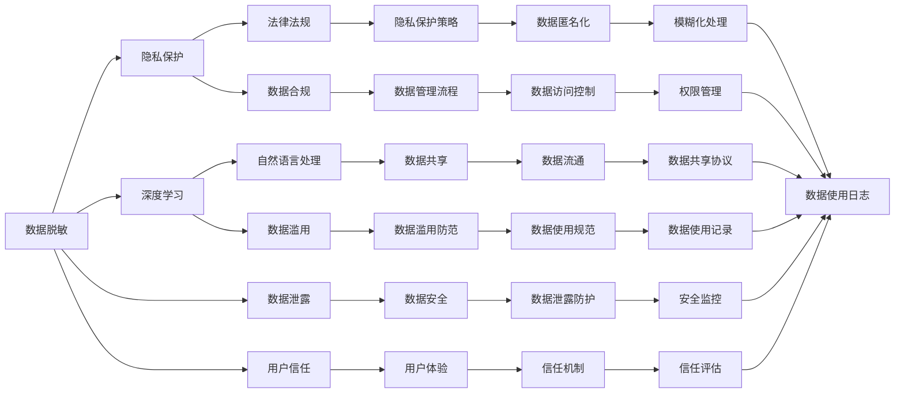

                 

# 数据脱敏：AI保护用户隐私安全

> 关键词：数据脱敏, AI隐私保护, 数据安全, 数据泄露, 深度学习, 自然语言处理

## 1. 背景介绍

在当今数字化时代，数据已成为驱动AI发展的重要资源。无论是商业公司还是学术机构，都高度重视数据的积累和利用，以驱动产品创新、优化决策和提升服务质量。然而，数据的广泛应用也带来了严重的隐私和安全风险，尤其是在用户隐私保护意识日益增强的今天。数据泄露、滥用和滥用问题，不仅对用户的隐私权益构成威胁，还可能引发法律责任和经济损失。因此，如何在大数据环境下保护用户隐私，成为了AI技术应用中的重要课题。

### 1.1 数据隐私的重要性
数据隐私保护的重要性体现在多个方面：

- **法律合规**：众多国家和地区都出台了严格的隐私保护法律，如欧盟的《通用数据保护条例》(GDPR)和美国的《加州消费者隐私法》(CCPA)，企业必须确保数据处理行为符合法律规定。
- **用户信任**：数据隐私是用户信任的基础。只有通过可靠的数据保护措施，才能赢得用户的信任，提升服务满意度。
- **数据价值最大化**：数据本身蕴含巨大的商业价值，但必须通过合理、透明的数据处理方式，才能实现数据价值的最大化。
- **社会责任**：企业在数据处理过程中，承担着保护个人隐私的社会责任，不应滥用用户数据。

### 1.2 数据隐私面临的挑战
尽管隐私保护的重要性日益凸显，但在实际应用中，数据隐私面临诸多挑战：

- **数据量大**：AI应用需要海量数据进行训练和测试，如何在大数据环境下保护用户隐私成为难题。
- **数据共享**：数据的共享和流通不可避免，但如何保证数据在共享过程中不被滥用，成为一大难题。
- **跨界应用**：AI技术在多个领域广泛应用，不同领域的数据处理方式可能存在差异，如何统一数据隐私保护标准，也是一大挑战。
- **技术漏洞**：数据泄露事件频发，暴露了技术手段上的漏洞和不足，需要不断改进和升级数据保护技术。

### 1.3 数据脱敏的必要性
数据脱敏是一种保护用户隐私的常用技术，通过在数据存储、处理和传输过程中，对敏感信息进行模糊化、加密化或删除等处理，以减少数据泄露的风险。数据脱敏在AI隐私保护中具有重要作用：

- **防止数据泄露**：通过数据脱敏，可以避免敏感信息在数据存储和传输过程中被非法获取。
- **合规要求**：数据脱敏是符合隐私保护法律法规的重要手段，可以有效应对GDPR、CCPA等法律法规的要求。
- **用户信任**：通过数据脱敏，用户可以更加信任AI系统，愿意提供更多的个人信息，从而提升服务质量和用户体验。
- **数据安全**：数据脱敏能够有效防止数据滥用和非法使用，保障数据安全。

## 2. 核心概念与联系

### 2.1 核心概念概述

数据脱敏的核心概念包括以下几个方面：

- **数据脱敏**：通过某种方式对敏感信息进行处理，使其变得不可识别或无关紧要，从而保护用户隐私。常见的数据脱敏方法包括模糊化、匿名化、加密化等。
- **隐私保护**：通过一系列技术和管理手段，确保个人信息不被滥用和泄露，保障用户隐私权益。隐私保护不仅涉及数据保护技术，还需要考虑数据使用和管理流程的合规性。
- **深度学习**：一种基于神经网络的学习方法，通过大量数据训练，实现对复杂问题的自动化学习和预测。深度学习在AI应用中广泛应用，但也带来了数据隐私保护的难题。
- **自然语言处理**：AI领域的一个重要分支，通过机器学习模型处理和分析自然语言数据，广泛应用于文本分类、情感分析、对话系统等任务。自然语言处理中的数据隐私保护，也是数据脱敏的重要应用场景。

这些概念通过以下Mermaid流程图进行联系展示：



### 2.2 核心概念原理

数据脱敏的原理是通过某种方式对敏感信息进行处理，使其变得不可识别或无关紧要，从而保护用户隐私。常见的数据脱敏方法包括模糊化、匿名化、加密化等。

- **模糊化**：将数据中的敏感信息替换为模糊或随机数据，以防止信息泄露。例如，将电话号码中的具体数字替换为星号或随机数。
- **匿名化**：删除或模糊化数据中能够唯一识别个体的信息，使其无法与真实个体对应。例如，删除身份证号中的出生日期，只保留年份信息。
- **加密化**：对数据进行加密处理，使其在传输和存储过程中无法被非法获取。例如，使用AES、RSA等加密算法对数据进行加密。

这些方法各有优缺点，需要根据具体场景选择合适的脱敏策略。例如，在数据共享场景中，加密化可以保证数据在共享过程中不被非法获取，但在实际使用中可能存在解密难度高的问题。而在数据存储场景中，模糊化和匿名化可以保证数据在存储过程中不被滥用，但在数据分析时可能失去部分信息。

## 3. 核心算法原理 & 具体操作步骤
### 3.1 算法原理概述

数据脱敏的核心算法包括模糊化、匿名化、加密化等，其原理是通过某种方式对敏感信息进行处理，使其变得不可识别或无关紧要。

### 3.2 算法步骤详解

以下以模糊化为例，详细介绍数据脱敏的详细步骤：

1. **确定脱敏目标**：确定需要脱敏的敏感信息，如身份证号、电话号码、姓名等。
2. **选择脱敏方法**：根据脱敏目标和应用场景，选择合适的脱敏方法。例如，对于身份证号，可以选择模糊化处理；对于电话号码，可以选择随机化处理。
3. **执行脱敏操作**：对敏感信息进行模糊化或随机化处理。例如，将身份证号中的具体数字替换为星号，将电话号码中的具体数字替换为随机数。
4. **验证脱敏效果**：对脱敏后的数据进行测试，确保脱敏效果符合预期，即敏感信息无法被识别。
5. **数据存储和传输**：将脱敏后的数据进行存储或传输，以保护用户隐私。

### 3.3 算法优缺点

数据脱敏具有以下优点：

- **防止数据泄露**：通过模糊化、匿名化等方法，可以有效防止敏感信息在数据存储和传输过程中被非法获取。
- **满足法律法规**：数据脱敏是符合隐私保护法律法规的重要手段，可以有效应对GDPR、CCPA等法律法规的要求。
- **用户信任**：通过数据脱敏，用户可以更加信任AI系统，愿意提供更多的个人信息，从而提升服务质量和用户体验。

同时，数据脱敏也存在一些局限性：

- **脱敏效果**：脱敏后的数据可能失去部分信息，对数据分析和业务决策带来影响。
- **处理复杂度**：不同数据类型和应用场景，需要采用不同的脱敏方法，处理复杂度较高。
- **安全风险**：如果脱敏方法不当或执行不到位，仍然存在数据泄露的风险。

### 3.4 算法应用领域

数据脱敏在AI隐私保护中具有广泛应用，主要包括以下几个领域：

- **医疗数据保护**：医疗数据包含大量敏感信息，如病历、基因信息等，需要通过数据脱敏保护患者隐私。
- **金融数据保护**：金融数据包含用户的财务信息，如信用卡号、账户余额等，需要通过数据脱敏保护用户隐私。
- **社交媒体隐私保护**：社交媒体数据包含用户的个人信息，如地址、电话等，需要通过数据脱敏保护用户隐私。
- **智能推荐系统**：智能推荐系统需要收集用户行为数据，通过数据脱敏保护用户隐私，同时提升推荐效果。
- **自然语言处理**：自然语言处理任务中，需要处理和分析大量文本数据，通过数据脱敏保护用户隐私，同时提升数据分析效果。

## 4. 数学模型和公式 & 详细讲解 & 举例说明

### 4.1 数学模型构建

数据脱敏的数学模型主要包括以下几个方面：

- **模糊化模型**：将数据中的敏感信息替换为模糊或随机数据，以防止信息泄露。
- **匿名化模型**：删除或模糊化数据中能够唯一识别个体的信息，使其无法与真实个体对应。
- **加密化模型**：对数据进行加密处理，使其在传输和存储过程中无法被非法获取。

### 4.2 公式推导过程

以模糊化为例，下面推导其数学模型：

假设原始数据集为 $D=\{(x_i, y_i)\}_{i=1}^N$，其中 $x_i$ 为敏感信息，$y_i$ 为非敏感信息。数据脱敏的目标是将敏感信息 $x_i$ 模糊化，生成新的数据集 $\hat{D}$。

设模糊化函数为 $f(x)$，表示将敏感信息 $x$ 替换为模糊信息 $\hat{x}$。设模糊化后的数据集为 $\hat{D}=\{(\hat{x}_i, y_i)\}_{i=1}^N$。

则数据脱敏的数学模型为：

$$
\hat{D} = \{f(x_i), y_i\}_{i=1}^N
$$

其中 $f(x)$ 为模糊化函数，可以采用星号、随机数、哈希函数等方法。

### 4.3 案例分析与讲解

假设某公司需要处理用户的身份证号，原始数据集为 $D=\{(123456789, Zhang\)}, (18888888888, Li)\}$。为了保护用户隐私，需要对身份证号进行模糊化处理，生成新的数据集 $\hat{D}$。

可以采用星号法进行模糊化，即将身份证号中的具体数字替换为星号，生成新的数据集：

$$
\hat{D} = \{(\*\*\*\*\*\*\*\*\*\*, Zhang)\}, (\*\*\*\*\*\*\*\*\*\*, Li)\}
$$

此时，新数据集中的身份证号无法直接识别出具体身份信息，从而保护了用户隐私。

## 5. 项目实践：代码实例和详细解释说明

### 5.1 开发环境搭建

在进行数据脱敏实践前，我们需要准备好开发环境。以下是使用Python进行PyTorch开发的环境配置流程：

1. 安装Anaconda：从官网下载并安装Anaconda，用于创建独立的Python环境。

2. 创建并激活虚拟环境：
```bash
conda create -n data-privacy python=3.8 
conda activate data-privacy
```

3. 安装PyTorch：根据CUDA版本，从官网获取对应的安装命令。例如：
```bash
conda install pytorch torchvision torchaudio cudatoolkit=11.1 -c pytorch -c conda-forge
```

4. 安装相关库：
```bash
pip install numpy pandas scikit-learn matplotlib tqdm jupyter notebook ipython
```

5. 安装数据脱敏工具：
```bash
pip install anonymize
```

完成上述步骤后，即可在`data-privacy`环境中开始数据脱敏实践。

### 5.2 源代码详细实现

下面以模糊化处理为例，给出使用PyTorch进行数据脱敏的PyTorch代码实现。

首先，定义模糊化函数：

```python
import numpy as np
import torch
from anonymize import anonymize

def anonymize_idcard(idcards):
    # 将身份证号中的具体数字替换为星号
    masked_idcards = anonymize(idcards)
    return masked_idcards
```

然后，定义数据脱敏函数：

```python
def data_obfuscation(data, column):
    masked_data = []
    for row in data:
        row_data = row[column]
        masked_data.append(anonymize_idcard(row_data))
    return data
```

最后，对数据集进行脱敏处理：

```python
import pandas as pd

# 读取数据集
data = pd.read_csv('data.csv')

# 对身份证号列进行脱敏处理
data['idcard'] = data['idcard'].apply(anonymize_idcard)

# 保存脱敏后的数据集
data.to_csv('obfuscated_data.csv', index=False)
```

以上就是使用PyTorch对数据进行模糊化处理的完整代码实现。可以看到，通过简单的函数调用，就能实现对身份证号列的脱敏处理。

### 5.3 代码解读与分析

让我们再详细解读一下关键代码的实现细节：

**anonymize_idcard函数**：
- 定义模糊化函数，将身份证号中的具体数字替换为星号。

**data_obfuscation函数**：
- 定义数据脱敏函数，对数据集中的指定列进行模糊化处理。

**数据脱敏流程**：
- 读取原始数据集，对指定列（如身份证号）进行模糊化处理。
- 将脱敏后的数据保存为新的数据集。

可以看到，通过PyTorch和数据脱敏工具，可以方便地实现数据脱敏功能，保护用户隐私。

## 6. 实际应用场景

### 6.1 医疗数据保护

医疗数据包含大量敏感信息，如病历、基因信息等，需要通过数据脱敏保护患者隐私。在实际应用中，可以使用数据脱敏技术对医疗数据进行处理，确保数据在存储、传输和分析过程中不被滥用。

例如，某医院需要将病历数据共享给第三方机构进行数据分析，需要首先对病历数据进行脱敏处理。可以使用数据脱敏工具对病历数据中的敏感信息（如身份证号、住址、病历编号等）进行模糊化或匿名化处理，生成新的数据集，供第三方机构进行分析和研究。

### 6.2 金融数据保护

金融数据包含用户的财务信息，如信用卡号、账户余额等，需要通过数据脱敏保护用户隐私。在实际应用中，金融机构需要对用户的财务信息进行脱敏处理，确保数据在存储、传输和分析过程中不被滥用。

例如，某银行需要将用户的交易数据分享给第三方风控公司，需要首先对用户的交易数据进行脱敏处理。可以使用数据脱敏工具对交易数据中的敏感信息（如身份证号、银行卡号、交易金额等）进行模糊化或匿名化处理，生成新的数据集，供第三方风控公司进行分析和研究。

### 6.3 社交媒体隐私保护

社交媒体数据包含用户的个人信息，如地址、电话等，需要通过数据脱敏保护用户隐私。在实际应用中，社交媒体平台需要对用户的个人信息进行脱敏处理，确保数据在存储、传输和分析过程中不被滥用。

例如，某社交媒体平台需要将用户的评论数据分享给第三方数据分析公司，需要首先对用户的评论数据进行脱敏处理。可以使用数据脱敏工具对评论数据中的敏感信息（如昵称、地址、电话号码等）进行模糊化或匿名化处理，生成新的数据集，供第三方数据分析公司进行分析和研究。

## 7. 工具和资源推荐

### 7.1 学习资源推荐

为了帮助开发者系统掌握数据脱敏的理论基础和实践技巧，这里推荐一些优质的学习资源：

1. 《数据脱敏技术指南》系列博文：由数据隐私保护专家撰写，深入浅出地介绍了数据脱敏技术的原理、方法和实践案例。

2. Kaggle Data Privacy Challenge：这是一个面向数据隐私保护领域的竞赛，提供丰富的数据集和挑战任务，适合进行数据脱敏实践练习。

3. 《数据隐私保护技术与应用》书籍：介绍数据隐私保护技术的原理、方法和应用场景，适合深入学习数据脱敏技术。

4. IAPP（国际隐私专业协会）官网：提供最新的隐私保护法律法规、技术工具和行业动态，是学习数据隐私保护的重要资源。

5. Datasets for General Privacy: A Community-Driven Collection：这是一个由学术界和工业界共同维护的隐私保护数据集，提供丰富的数据集和挑战任务，适合进行数据脱敏实践练习。

通过对这些资源的学习实践，相信你一定能够快速掌握数据脱敏技术的精髓，并用于解决实际的隐私保护问题。

### 7.2 开发工具推荐

高效的开发离不开优秀的工具支持。以下是几款用于数据脱敏开发的常用工具：

1. PyTorch：基于Python的开源深度学习框架，灵活动态的计算图，适合快速迭代研究。

2. TensorFlow：由Google主导开发的开源深度学习框架，生产部署方便，适合大规模工程应用。

3. anonymize：一个用于数据匿名化和脱敏的Python库，支持多种数据类型和脱敏方法。

4. Weights & Biases：模型训练的实验跟踪工具，可以记录和可视化模型训练过程中的各项指标，方便对比和调优。

5. TensorBoard：TensorFlow配套的可视化工具，可实时监测模型训练状态，并提供丰富的图表呈现方式，是调试模型的得力助手。

合理利用这些工具，可以显著提升数据脱敏任务的开发效率，加快创新迭代的步伐。

### 7.3 相关论文推荐

数据脱敏技术的发展源于学界的持续研究。以下是几篇奠基性的相关论文，推荐阅读：

1. Privacy Preserving Data Mining with Data Masking and Index-Based Search：介绍了数据脱敏技术的基本原理和方法，提供了丰富的应用案例。

2. General Privacy-Preserving Multiple Indicator Multiple Cause Modeling Techniques with Artificial Intelligence：介绍了基于数据脱敏的隐私保护方法，适用于复杂的多元统计模型。

3. A Review on Privacy-Preserving Data Mining Techniques：综述了隐私保护数据挖掘领域的研究进展，提供了全面的技术总结。

4. Privacy-Preserving Data Publishing Techniques: A Survey：综述了数据发布中的隐私保护技术，提供了丰富的实践案例。

5. Privacy-Preserving Data Mining Techniques：介绍了数据脱敏技术的原理、方法和应用场景，提供了系统的技术总结。

这些论文代表了大数据隐私保护技术的发展脉络。通过学习这些前沿成果，可以帮助研究者把握学科前进方向，激发更多的创新灵感。

## 8. 总结：未来发展趋势与挑战

### 8.1 总结

本文对数据脱敏技术进行了全面系统的介绍。首先阐述了数据脱敏的重要性，明确了数据脱敏在AI隐私保护中的独特价值。其次，从原理到实践，详细讲解了数据脱敏的数学模型和操作步骤，给出了数据脱敏任务开发的完整代码实例。同时，本文还广泛探讨了数据脱敏在医疗、金融、社交媒体等多个领域的应用前景，展示了数据脱敏技术的广阔应用空间。

通过本文的系统梳理，可以看到，数据脱敏技术在大数据环境下保护用户隐私，具有重要意义。数据脱敏不仅能有效防止数据泄露，保护用户隐私，还能满足法律法规要求，赢得用户信任，提升服务质量和用户体验。未来，伴随数据隐私保护的不断升级，数据脱敏技术将进一步发展和优化，为AI技术的健康发展提供坚实的保障。

### 8.2 未来发展趋势

展望未来，数据脱敏技术将呈现以下几个发展趋势：

1. **技术迭代升级**：随着数据隐私保护要求的不断提高，数据脱敏技术将不断迭代升级，以适应新的法律法规和技术标准。
2. **自动化程度提升**：数据脱敏过程将越来越多地采用自动化工具，减少人工干预，提升效率和准确性。
3. **跨领域应用拓展**：数据脱敏技术将在更多领域得到应用，如智能制造、智慧城市、智能交通等，为跨领域数据共享提供保障。
4. **隐私计算技术融合**：数据脱敏将与隐私计算技术进一步融合，在数据共享过程中实现多方安全和计算，保护数据隐私。
5. **数据匿名化技术优化**：数据匿名化是数据脱敏的重要技术手段，未来将通过更优化的算法和模型，提高数据匿名化的效果和效率。

### 8.3 面临的挑战

尽管数据脱敏技术已经取得了显著进展，但在迈向更加智能化、普适化应用的过程中，仍面临诸多挑战：

1. **数据复杂性**：数据类型多样、结构复杂，需要针对不同数据类型设计合适的脱敏策略。
2. **隐私保护水平**：不同应用场景对隐私保护的要求不同，需要综合考虑隐私保护与数据利用之间的平衡。
3. **技术标准统一**：数据脱敏技术缺乏统一的技术标准，导致不同机构和领域之间的数据共享困难。
4. **技术更新迅速**：数据隐私保护法规和技术标准不断更新，需要持续关注和应对。
5. **数据质量影响**：数据脱敏后，可能会影响数据分析和业务决策的效果，需要权衡数据隐私和数据质量之间的关系。

### 8.4 研究展望

未来，数据脱敏技术的研究方向将集中在以下几个方面：

1. **自动化数据脱敏**：通过自动化工具，减少人工干预，提升数据脱敏的效率和准确性。
2. **跨领域数据共享**：研究跨领域数据共享的隐私保护技术，实现数据的高效流通和利用。
3. **隐私计算与数据脱敏结合**：将数据脱敏与隐私计算技术相结合，保护数据隐私的同时，实现数据的联合分析和计算。
4. **多模态数据脱敏**：研究多模态数据的脱敏技术，实现跨模态数据的隐私保护和融合。
5. **隐私保护标准制定**：推动数据脱敏技术标准的制定和实施，保障数据脱敏的规范性和有效性。

这些研究方向的探索发展，必将引领数据脱敏技术迈向更高的台阶，为数据隐私保护提供坚实的技术保障。

## 9. 附录：常见问题与解答

**Q1：如何选择合适的数据脱敏方法？**

A: 选择合适的数据脱敏方法需要考虑多个因素，包括数据类型、应用场景和隐私保护需求。常见的数据脱敏方法包括模糊化、匿名化和加密化。例如，对于身份证号，可以使用模糊化方法将具体数字替换为星号；对于电话号码，可以使用匿名化方法将具体数字替换为随机数；对于财务信息，可以使用加密化方法将数据进行加密处理。

**Q2：数据脱敏是否会影响数据质量？**

A: 数据脱敏可能会影响数据分析和业务决策的效果，因为脱敏后的数据可能失去部分信息。例如，在医疗数据分析中，脱敏后的病历数据可能无法进行精确的病情诊断和治疗方案制定。因此，需要在数据脱敏和数据质量之间进行权衡，选择合适的脱敏策略和脱敏程度。

**Q3：数据脱敏是否会影响业务决策？**

A: 数据脱敏可能会影响业务决策，因为脱敏后的数据可能无法完全还原原始数据。例如，在金融风控中，脱敏后的交易数据可能无法进行精确的风险评估和预警。因此，需要在数据脱敏和业务决策之间进行权衡，选择合适的脱敏策略和脱敏程度。

**Q4：数据脱敏是否会影响数据分析效果？**

A: 数据脱敏可能会影响数据分析效果，因为脱敏后的数据可能无法完全还原原始数据。例如，在社交媒体数据分析中，脱敏后的评论数据可能无法进行精确的用户行为分析和情感分析。因此，需要在数据脱敏和数据分析之间进行权衡，选择合适的脱敏策略和脱敏程度。

**Q5：数据脱敏是否会影响用户体验？**

A: 数据脱敏可能会影响用户体验，因为脱敏后的数据可能无法完全还原原始数据。例如，在客户服务中，脱敏后的客户数据可能无法进行精确的个性化推荐和服务。因此，需要在数据脱敏和用户体验之间进行权衡，选择合适的脱敏策略和脱敏程度。

总之，数据脱敏需要综合考虑数据隐私、数据质量、业务决策和用户体验等多个因素，选择合适的脱敏策略和脱敏程度。只有通过科学合理的数据脱敏，才能实现数据隐私保护和数据利用的平衡，保障用户权益和业务发展。

---

作者：禅与计算机程序设计艺术 / Zen and the Art of Computer Programming

