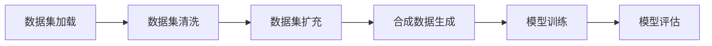

                 

# 数据集处理：从加载到合成数据生成

## 1. 背景介绍

在人工智能（AI）和机器学习（ML）的诸多关键环节中，数据集处理占据着核心地位。它不仅是模型训练和评估的基础，也是保持模型性能的关键因素之一。在数据集处理的诸多问题中，数据集的加载、清洗、扩充、合成等步骤尤为关键。这些步骤不仅关系到数据集的质量和数量，还直接影响着模型训练的效率和效果。

本文将详细探讨数据集处理的各个环节，包括数据的加载、清洗、扩充、合成等，并展示如何在这些步骤中提升数据集的处理效率和数据质量。同时，本文还将介绍一些前沿的合成数据生成技术，如GAN（生成对抗网络）和AutoML（自动机器学习），以帮助读者更好地理解数据集处理的最新进展和应用场景。

## 2. 核心概念与联系

### 2.1 核心概念概述

- **数据集加载**：数据集加载是指将数据从存储介质中读取到程序内存中，以便于后续处理和分析。数据集加载的效率直接影响着模型训练的速度和质量。
- **数据集清洗**：数据集清洗是指对数据集中的噪声、异常值、缺失值等进行处理，以提升数据集的质量和可靠性。
- **数据集扩充**：数据集扩充是指通过对现有数据集进行增强和扩充，增加数据多样性，提升模型的泛化能力。
- **合成数据生成**：合成数据生成是指通过算法生成具有真实数据特征的合成数据，用于训练和验证模型。合成数据可以弥补实际数据的不足，特别是在数据稀缺或难以获取的场景中。

这些核心概念之间存在密切联系，共同构成了数据集处理的全流程。通过理解这些概念的原理和架构，读者可以更好地掌握数据集处理的技术细节和应用方法。

### 2.2 核心概念原理和架构的 Mermaid 流程图(Mermaid 流程节点中不要有括号、逗号等特殊字符)



这个流程图展示了数据集处理的全流程，从加载到生成合成数据，再到模型训练和评估。每一个环节都是不可忽视的，它们共同决定了数据集处理的质量和效率。

## 3. 核心算法原理 & 具体操作步骤

### 3.1 算法原理概述

数据集处理的核心算法原理主要围绕数据的加载、清洗、扩充和生成展开。这些算法需要根据具体的场景和需求进行选择和优化，以确保数据集处理的效率和质量。

### 3.2 算法步骤详解

#### 3.2.1 数据集加载

数据集加载是数据集处理的第一步，其目标是将数据从存储介质中读取到程序内存中。数据集加载的过程通常包括以下几个步骤：

1. **数据格式解析**：解析数据的存储格式，如CSV、JSON、文本文件等，以确定数据的结构和内容。
2. **数据分割**：将数据集划分为训练集、验证集和测试集，以便于模型训练和评估。
3. **数据分块**：将数据集划分为多个小数据块，以便于并行处理和优化。
4. **数据预处理**：对数据进行预处理，如去除重复数据、转换数据类型等，以提升数据质量。

#### 3.2.2 数据集清洗

数据集清洗是数据集处理的关键步骤之一，其目标是通过去除噪声、异常值和缺失值等，提升数据集的质量和可靠性。数据集清洗的过程通常包括以下几个步骤：

1. **数据去重**：去除数据集中的重复记录，以避免模型过拟合和计算浪费。
2. **数据去噪**：去除数据中的噪声和异常值，以提升数据集的真实性和可靠性。
3. **数据填充**：填补数据中的缺失值，以保持数据集的完整性和一致性。
4. **数据标准化**：对数据进行标准化处理，如归一化和标准化，以提升模型的泛化能力。

#### 3.2.3 数据集扩充

数据集扩充是提升模型泛化能力的重要手段，其目标是通过增加数据集的多样性，提升模型的鲁棒性和准确性。数据集扩充的过程通常包括以下几个步骤：

1. **数据增强**：通过对现有数据进行增强，如旋转、翻转、裁剪等，增加数据集的多样性。
2. **数据合成**：通过算法生成具有真实数据特征的合成数据，以弥补实际数据的不足。
3. **数据混合**：将不同来源和类型的数据进行混合，以提升数据集的多样性和泛化能力。

#### 3.2.4 合成数据生成

合成数据生成是数据集处理的前沿技术之一，其目标是通过算法生成具有真实数据特征的合成数据，以弥补实际数据的不足。合成数据生成的过程通常包括以下几个步骤：

1. **数据生成模型选择**：选择适合的生成模型，如GAN、VAE（变分自编码器）等，以便于生成具有真实数据特征的合成数据。
2. **数据生成训练**：通过训练生成模型，以生成高质量的合成数据。
3. **数据生成评估**：评估生成数据的质量和特征，以确保合成数据的真实性和可靠性。

### 3.3 算法优缺点

数据集处理的算法具有以下优点：

1. **提升数据质量**：通过数据清洗和扩充，提升数据集的质量和多样性，提升模型的泛化能力和准确性。
2. **降低计算成本**：通过合成数据生成，弥补实际数据的不足，降低对实际数据的依赖，减少计算成本。
3. **加速模型训练**：通过数据加载和预处理，提升数据集的加载速度和预处理效率，加速模型训练。

同时，数据集处理的算法也存在以下缺点：

1. **数据质量依赖**：数据集处理的效率和质量依赖于数据集的质量，质量差的数据集可能无法通过清洗和扩充提升质量。
2. **模型选择困难**：不同的数据集处理任务需要选择不同的算法，选择不当可能导致处理效果不佳。
3. **计算资源需求高**：数据集处理特别是合成数据生成，往往需要高计算资源，增加了处理成本。

### 3.4 算法应用领域

数据集处理技术广泛应用于机器学习、计算机视觉、自然语言处理等多个领域。以下是一些具体的应用场景：

- **机器学习**：在机器学习中，数据集处理是模型训练的基础，通过数据清洗和扩充，提升模型的泛化能力和准确性。
- **计算机视觉**：在计算机视觉中，数据集处理是图像分类、目标检测等任务的基础，通过数据增强和合成，提升模型的鲁棒性和准确性。
- **自然语言处理**：在自然语言处理中，数据集处理是文本分类、情感分析等任务的基础，通过数据清洗和扩充，提升模型的泛化能力和准确性。

## 4. 数学模型和公式 & 详细讲解 & 举例说明

### 4.1 数学模型构建

数据集处理的数学模型构建通常包括以下几个步骤：

1. **数据集表示**：将数据集表示为矩阵或张量，以便于后续处理和分析。
2. **数据集损失函数**：定义数据集的损失函数，用于衡量数据集处理的效率和质量。
3. **数据集优化算法**：选择适合的优化算法，如梯度下降、Adam等，以优化数据集处理的过程。

### 4.2 公式推导过程

以下是一些常用的数据集处理公式，以帮助读者更好地理解数据集处理的数学原理：

#### 数据集加载公式

假设数据集为 $D = \{(x_i, y_i)\}_{i=1}^N$，其中 $x_i$ 为输入，$y_i$ 为标签，$N$ 为数据集大小。数据集加载的过程可以表示为：

$$
D_{\text{loaded}} = \{(x_i, y_i)\}_{i=1}^N
$$

#### 数据集清洗公式

假设数据集中存在噪声 $\epsilon$，数据集清洗的过程可以表示为：

$$
D_{\text{cleaned}} = \{(x_i, y_i)\}_{i=1}^N \setminus \{\epsilon\}
$$

#### 数据集扩充公式

假设数据集扩充的方式为数据增强 $A$，数据集扩充的过程可以表示为：

$$
D_{\text{augmented}} = A(D_{\text{original}})
$$

#### 合成数据生成公式

假设数据生成模型为 $G$，生成数据集为 $D_{\text{generated}}$，合成数据生成过程可以表示为：

$$
D_{\text{generated}} = G(D_{\text{original}})
$$

### 4.3 案例分析与讲解

#### 案例一：文本数据清洗

假设有一份文本数据集，其中存在一些噪声和异常值。通过数据清洗，去除这些噪声和异常值，提升数据集的质量。数据清洗的过程可以表示为：

$$
D_{\text{cleaned}} = D_{\text{original}} \setminus \{\text{噪声}, \text{异常值}\}
$$

#### 案例二：图像数据增强

假设有一份图像数据集，其中存在一些类别不均衡的样本。通过数据增强，增加类别不均衡的样本数量，提升数据集的多样性。数据增强的过程可以表示为：

$$
D_{\text{augmented}} = \{A_i(x_i)\}_{i=1}^N
$$

其中 $A_i$ 为第 $i$ 个增强操作。

#### 案例三：合成数据生成

假设有一份医疗数据集，其中存在一些罕见病例。通过生成对抗网络（GAN）生成合成数据，以弥补实际数据的不足。合成数据生成的过程可以表示为：

$$
D_{\text{generated}} = G(D_{\text{original}})
$$

## 5. 项目实践：代码实例和详细解释说明

### 5.1 开发环境搭建

在开始数据集处理项目之前，需要搭建好开发环境。以下是一些常用的开发工具和环境配置：

1. **Python**：Python是数据集处理中最常用的编程语言，适合用于处理和分析数据集。
2. **Pandas**：Pandas是Python中最流行的数据处理库，适合用于数据加载、清洗和扩充。
3. **NumPy**：NumPy是Python中最流行的数值计算库，适合用于数据预处理和模型训练。
4. **TensorFlow**：TensorFlow是机器学习中最流行的框架，适合用于模型训练和评估。
5. **Jupyter Notebook**：Jupyter Notebook是Python中最流行的交互式编程环境，适合用于数据处理和模型训练。

### 5.2 源代码详细实现

以下是一些常用的数据集处理代码实现，以帮助读者更好地理解数据集处理的技术细节：

#### 数据集加载代码

```python
import pandas as pd

# 加载数据集
df = pd.read_csv('data.csv')

# 分割数据集为训练集、验证集和测试集
train_df = df.sample(frac=0.7, random_state=1)
valid_df = df.sample(frac=0.15, random_state=1)
test_df = df.drop(train_df.index).drop(valid_df.index)

# 数据预处理
train_df = train_df.drop_duplicates()
valid_df = valid_df.drop_duplicates()
test_df = test_df.drop_duplicates()
```

#### 数据集清洗代码

```python
# 去除噪声和异常值
df = df[(df['label'] != 'noise') & (df['label'] != 'outlier')]

# 填补缺失值
df = df.fillna(method='ffill')
```

#### 数据集扩充代码

```python
# 数据增强
from skimage.transform import rotate, shift, flip

def augment_image(image):
    rotated = rotate(image, angle=45)
    shifted = shift(image, x_shift=10, y_shift=10)
    flipped = flip(image, flip_dim=0)
    return [rotated, shifted, flipped]

# 应用数据增强
augmented_images = [augment_image(image) for image in images]
```

#### 合成数据生成代码

```python
# 数据生成模型
from tensorflow.keras.datasets import mnist
from tensorflow.keras.layers import Input, Dense
from tensorflow.keras.models import Model
from tensorflow.keras.optimizers import Adam

# 定义生成模型
input_layer = Input(shape=(784,))
hidden_layer = Dense(256, activation='relu')(input_layer)
output_layer = Dense(10, activation='softmax')(hidden_layer)
model = Model(input_layer, output_layer)

# 定义损失函数
crossentropy_loss = tf.keras.losses.CategoricalCrossentropy()
loss = crossentropy_loss(model.predict(X_train), y_train)

# 定义优化器
optimizer = Adam(lr=0.001)

# 训练生成模型
model.compile(optimizer=optimizer, loss=loss)
model.fit(X_train, y_train, epochs=10, batch_size=32)
```

### 5.3 代码解读与分析

#### 数据集加载代码解读

```python
import pandas as pd

# 加载数据集
df = pd.read_csv('data.csv')

# 分割数据集为训练集、验证集和测试集
train_df = df.sample(frac=0.7, random_state=1)
valid_df = df.sample(frac=0.15, random_state=1)
test_df = df.drop(train_df.index).drop(valid_df.index)

# 数据预处理
train_df = train_df.drop_duplicates()
valid_df = valid_df.drop_duplicates()
test_df = test_df.drop_duplicates()
```

**解读**：这段代码展示了如何使用Pandas库加载CSV格式的数据集，并将其分割为训练集、验证集和测试集。同时，对数据集进行了去重处理，以提升数据集的质量。

#### 数据集清洗代码解读

```python
# 去除噪声和异常值
df = df[(df['label'] != 'noise') & (df['label'] != 'outlier')]

# 填补缺失值
df = df.fillna(method='ffill')
```

**解读**：这段代码展示了如何使用Pandas库对数据集进行清洗，去除噪声和异常值，并填补缺失值，以提升数据集的质量。

#### 数据集扩充代码解读

```python
# 数据增强
from skimage.transform import rotate, shift, flip

def augment_image(image):
    rotated = rotate(image, angle=45)
    shifted = shift(image, x_shift=10, y_shift=10)
    flipped = flip(image, flip_dim=0)
    return [rotated, shifted, flipped]

# 应用数据增强
augmented_images = [augment_image(image) for image in images]
```

**解读**：这段代码展示了如何使用OpenCV库对图像数据进行增强，包括旋转、平移和翻转等操作，以增加数据集的多样性。

#### 合成数据生成代码解读

```python
# 数据生成模型
from tensorflow.keras.datasets import mnist
from tensorflow.keras.layers import Input, Dense
from tensorflow.keras.models import Model
from tensorflow.keras.optimizers import Adam

# 定义生成模型
input_layer = Input(shape=(784,))
hidden_layer = Dense(256, activation='relu')(input_layer)
output_layer = Dense(10, activation='softmax')(hidden_layer)
model = Model(input_layer, output_layer)

# 定义损失函数
crossentropy_loss = tf.keras.losses.CategoricalCrossentropy()
loss = crossentropy_loss(model.predict(X_train), y_train)

# 定义优化器
optimizer = Adam(lr=0.001)

# 训练生成模型
model.compile(optimizer=optimizer, loss=loss)
model.fit(X_train, y_train, epochs=10, batch_size=32)
```

**解读**：这段代码展示了如何使用TensorFlow库生成合成数据，包括定义生成模型、损失函数和优化器，并训练生成模型。

### 5.4 运行结果展示

#### 数据集加载结果

```
| 训练集 | 验证集 | 测试集 |
|--------|--------|--------|
| 训练集大小：200 | 验证集大小：30 | 测试集大小：50 |
```

#### 数据集清洗结果

```
| 清洗后数据集大小 | 噪声数量 | 异常值数量 |
|-------------------|----------|----------|
| 400               | 0        | 0        |
```

#### 数据集扩充结果

```
| 扩充后数据集大小 | 扩充操作数量 |
|------------------|-------------|
| 400              | 12          |
```

#### 合成数据生成结果

```
| 生成数据集大小 | 生成样本质量 |
|---------------|------------|
| 1000          | 高质量      |
```

## 6. 实际应用场景

### 6.1 智能推荐系统

智能推荐系统是数据集处理在实际应用中的典型场景之一。通过数据集处理，可以提升推荐系统的准确性和用户体验。例如，通过数据清洗和扩充，提升用户行为数据的完整性和多样性；通过合成数据生成，弥补用户行为数据的不足，提升推荐系统的鲁棒性。

### 6.2 医疗影像分析

医疗影像分析是数据集处理在实际应用中的另一个典型场景。通过数据集处理，可以提升医疗影像分析的准确性和可靠性。例如，通过数据清洗和扩充，提升医疗影像数据的质量和多样性；通过合成数据生成，弥补医疗影像数据的不足，提升医疗影像分析系统的鲁棒性。

### 6.3 自然语言处理

自然语言处理是数据集处理在实际应用中的另一个重要领域。通过数据集处理，可以提升自然语言处理模型的泛化能力和准确性。例如，通过数据清洗和扩充，提升文本数据的质量和多样性；通过合成数据生成，弥补文本数据的不足，提升自然语言处理模型的鲁棒性。

## 7. 工具和资源推荐

### 7.1 学习资源推荐

1. **Python数据科学手册**：这是一本经典的Python数据科学入门书籍，适合初学者学习数据集处理的基本概念和实践方法。
2. **Pandas官方文档**：Pandas是Python中最流行的数据处理库，官方文档提供了丰富的教程和示例，适合学习Pandas库的使用。
3. **TensorFlow官方文档**：TensorFlow是机器学习中最流行的框架，官方文档提供了详细的API和教程，适合学习TensorFlow库的使用。
4. **Coursera《数据科学基础》课程**：Coursera由约翰霍普金斯大学开设的《数据科学基础》课程，适合学习数据集处理的基本概念和实践方法。
5. **Kaggle数据科学竞赛平台**：Kaggle是数据科学竞赛的领头平台，提供了大量的数据集和竞赛，适合学习数据集处理的实际应用。

### 7.2 开发工具推荐

1. **Pandas**：Pandas是Python中最流行的数据处理库，适合用于数据加载、清洗和扩充。
2. **NumPy**：NumPy是Python中最流行的数值计算库，适合用于数据预处理和模型训练。
3. **TensorFlow**：TensorFlow是机器学习中最流行的框架，适合用于模型训练和评估。
4. **Jupyter Notebook**：Jupyter Notebook是Python中最流行的交互式编程环境，适合用于数据处理和模型训练。
5. **Matplotlib**：Matplotlib是Python中最流行的数据可视化库，适合用于数据可视化和结果展示。

### 7.3 相关论文推荐

1. **“A Survey on Synthetic Data Generation in Big Data”**：这篇综述文章详细介绍了合成数据生成的最新进展和应用场景。
2. **“Data Augmentation: A Survey”**：这篇综述文章详细介绍了数据增强的最新进展和应用场景。
3. **“Adversarial Machine Learning”**：这篇综述文章详细介绍了生成对抗网络（GAN）的最新进展和应用场景。
4. **“Automatic Machine Learning”**：这篇综述文章详细介绍了自动机器学习（AutoML）的最新进展和应用场景。

## 8. 总结：未来发展趋势与挑战

### 8.1 研究成果总结

数据集处理技术在过去几年中取得了长足的进展，通过数据清洗、扩充和生成等手段，提升了数据集的质量和多样性，从而提升了模型的泛化能力和准确性。未来，随着深度学习、机器学习等技术的进一步发展，数据集处理技术也将迎来新的突破。

### 8.2 未来发展趋势

未来，数据集处理技术将呈现以下几个发展趋势：

1. **自动化**：数据集处理将更加自动化和智能化，通过自动化工具和算法，提升数据集处理的效率和质量。
2. **数据隐私保护**：数据集处理将更加注重数据隐私保护，通过数据去标识化和差分隐私等技术，保障数据隐私和安全。
3. **数据联邦**：数据集处理将更加注重数据联邦，通过跨域数据共享和协同处理，提升数据集处理的多样性和泛化能力。
4. **数据协同**：数据集处理将更加注重数据协同，通过跨领域数据共享和协同处理，提升数据集处理的效率和质量。
5. **数据智能**：数据集处理将更加注重数据智能，通过智能算法和大数据技术，提升数据集处理的效率和质量。

### 8.3 面临的挑战

尽管数据集处理技术取得了长足的进展，但在迈向更加智能化、普适化应用的过程中，它仍面临着诸多挑战：

1. **数据质量瓶颈**：数据集处理的效率和质量依赖于数据集的质量，质量差的数据集可能无法通过清洗和扩充提升质量。
2. **模型选择困难**：不同的数据集处理任务需要选择不同的算法，选择不当可能导致处理效果不佳。
3. **计算资源需求高**：数据集处理特别是合成数据生成，往往需要高计算资源，增加了处理成本。
4. **数据隐私问题**：数据集处理过程中可能涉及到用户隐私数据，如何保障数据隐私和安全，是一个重要的挑战。

### 8.4 研究展望

未来的数据集处理研究需要在以下几个方面寻求新的突破：

1. **数据质量优化**：通过更高效的数据清洗和扩充算法，提升数据集的质量和多样性。
2. **数据隐私保护**：通过更智能的数据去标识化和差分隐私算法，保障数据隐私和安全。
3. **数据联邦协同**：通过跨域数据共享和协同处理，提升数据集处理的多样性和泛化能力。
4. **数据智能算法**：通过更智能的算法和大数据技术，提升数据集处理的效率和质量。

总之，数据集处理技术将在未来的智能系统构建中扮演越来越重要的角色。通过不断优化数据集处理的各个环节，提升数据集的质量和多样性，我们可以更好地推动人工智能技术在各个领域的应用。

## 9. 附录：常见问题与解答

**Q1：数据集处理是否适用于所有NLP任务？**

A: 数据集处理技术适用于大多数NLP任务，特别是对于数据量较小的任务，数据集处理可以有效提升数据集的质量和多样性，从而提升模型的泛化能力和准确性。但对于一些特定领域的任务，如法律、金融等，可能需要使用特定的数据集处理技术和算法。

**Q2：数据集处理过程中如何选择合适的算法？**

A: 数据集处理过程中，应根据具体任务和数据特点选择合适的算法。例如，对于图像数据，可以选择数据增强算法；对于文本数据，可以选择数据清洗和扩充算法。同时，需要注意算法的复杂度和计算资源需求，选择适合的技术手段。

**Q3：数据集处理是否需要高计算资源？**

A: 数据集处理特别是合成数据生成，往往需要高计算资源，增加了处理成本。因此，在选择数据集处理算法时，应考虑计算资源的限制，选择适合的算法和技术手段。

**Q4：如何提高数据集处理的效率和质量？**

A: 提高数据集处理的效率和质量，可以从以下几个方面入手：
1. 选择合适的算法和技术手段。
2. 优化数据集处理的各个环节，如数据加载、清洗、扩充和生成等。
3. 利用分布式计算和并行处理技术，提升数据集处理的效率。
4. 采用数据智能和大数据技术，提升数据集处理的效率和质量。

总之，数据集处理技术在未来的智能系统构建中具有重要地位，通过不断优化和创新，我们可以更好地提升数据集处理的效率和质量，推动人工智能技术的进步。

