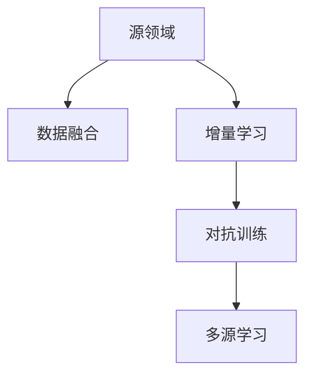

                 

# 数据集对齐:跨领域迁移学习的新挑战

> 关键词：跨领域迁移学习,数据集对齐,多源学习,领域适应,数据融合,增量学习

## 1. 背景介绍

### 1.1 问题由来
随着深度学习在各领域的广泛应用，数据集对齐问题（Domain Alignment）成为了跨领域迁移学习中不可或缺的一环。特别是当源领域与目标领域的数据分布差异较大时，单纯地将源领域的数据集微调到目标领域，往往难以获得良好的迁移性能。为了解决这个问题，学者们提出了多源学习（Multi-Source Learning）的概念，即通过综合不同源领域的数据集，提高模型的泛化能力。

多源学习在实际应用中具有重要意义，可以覆盖更多的场景，增强模型的稳健性和鲁棒性。比如在医疗影像分析中，不同医院的数据可能存在差异，综合多家医院的数据可以提高模型的泛化能力；在金融风险预测中，不同地区的市场情况不同，综合多个地区的市场数据可以提升预测准确率；在智能交通系统中，不同传感器数据源可能提供不同视角的信息，综合这些数据可以提升决策的准确性和鲁棒性。

### 1.2 问题核心关键点
数据集对齐问题可以抽象为：如何将多个源领域的数据融合到目标领域，并使得融合后的数据与目标领域的数据分布尽可能一致。其主要分为数据融合（Data Fusion）和增量学习（Incremental Learning）两个关键环节：

1. **数据融合**：将多个源领域的数据集按照某种方式进行融合，形成融合后的数据集。融合的策略可以包括特征变换、模型融合、混合训练等。
2. **增量学习**：在目标领域的数据集上，通过融合后的数据进行微调，逐步提升模型的泛化能力。增量学习的过程可以是一个逐步迭代的过程，也可以是一个一次性微调的过程。

本文将重点探讨数据集对齐问题，分析不同数据融合和增量学习策略的原理和优缺点，并提出一些新的跨领域迁移学习算法，同时介绍相关的学习资源和开发工具，最后总结未来的研究方向和面临的挑战。

## 2. 核心概念与联系

### 2.1 核心概念概述

在进行跨领域迁移学习时，常常需要处理多个数据集，这些数据集的特征往往存在差异。为了保证模型在目标领域的表现，数据集对齐是不可或缺的步骤。以下是几个关键概念的概述：

- **源领域**：包含待迁移知识的数据集，可以是一个数据源，也可以是由多个数据源组成。
- **目标领域**：迁移知识的目的地，即最终的模型将应用于该数据集。
- **领域适应（Domain Adaptation）**：指模型在源领域与目标领域之间进行迁移，以提高在目标领域的表现。
- **数据融合**：将不同源领域的数据进行合并，形成统一的数据集，以便于模型训练。
- **增量学习**：在目标领域的数据集上，通过新数据逐步更新模型参数，提升模型泛化能力。
- **多源学习**：综合使用多个数据源，提升模型泛化能力，减轻单一数据源的过拟合风险。
- **对抗训练（Adversarial Training）**：通过在目标领域引入对抗样本，提升模型的鲁棒性。

这些概念之间的逻辑关系可以通过以下Mermaid流程图来展示：



这个流程图展示了大规模迁移学习的核心概念及其之间的关系：

1. 数据融合将不同源领域的数据进行统一，形成融合后的数据集。
2. 增量学习在目标领域的数据集上，通过融合后的数据进行微调，逐步提升模型性能。
3. 对抗训练通过引入对抗样本，提升模型的鲁棒性。
4. 多源学习综合使用多个数据源，增强模型的泛化能力。

### 2.2 核心概念原理和架构

为了理解数据集对齐的原理和架构，本文将重点介绍以下核心概念：

- **领域适应算法**：通过改变模型输出空间的分布，使得模型在源领域和目标领域之间进行迁移。常见的领域适应算法包括最大均值差（Maximum Mean Discrepancy）、特征对域（Feature Domain）、领域自编码（Domain Auto-Encoder）等。
- **多源学习算法**：通过综合使用多个数据源，提升模型的泛化能力。常见的方法包括特征加权（Feature Weighting）、学习率调整（Learning Rate Adapation）、权重共享（Weight Sharing）等。
- **增量学习算法**：在目标领域的数据集上，通过新数据逐步更新模型参数，提升模型泛化能力。常见的方法包括在线学习（Online Learning）、连续学习（Continuous Learning）等。
- **数据融合算法**：将不同源领域的数据进行合并，形成统一的数据集，以便于模型训练。常见的方法包括主成分分析（Principal Component Analysis）、数据增强（Data Augmentation）、集成学习（Ensemble Learning）等。

## 3. 核心算法原理 & 具体操作步骤

### 3.1 算法原理概述

数据集对齐问题可以理解为在目标领域上，将不同源领域的数据进行统一和融合，形成融合后的数据集，并在融合后的数据集上训练模型。这一过程可以分为两个阶段：数据融合和增量学习。

数据融合阶段，通过某种策略将不同源领域的数据进行合并，形成统一的数据集。常见的方法包括主成分分析（PCA）、数据增强（Data Augmentation）、集成学习（Ensemble Learning）等。

增量学习阶段，在目标领域的数据集上，通过融合后的数据进行微调，逐步提升模型的泛化能力。常见的方法包括在线学习（Online Learning）、连续学习（Continuous Learning）等。

### 3.2 算法步骤详解

#### 3.2.1 数据融合步骤

1. **数据预处理**：对不同源领域的数据进行标准化和归一化，使得数据在同一尺度上进行比较。
2. **特征变换**：将不同源领域的数据变换为相同或相似的特征空间。常见的方法包括主成分分析（PCA）、线性判别分析（LDA）等。
3. **数据增强**：通过数据增强技术，增加数据的多样性，提高模型的泛化能力。常见的方法包括数据平移、旋转、缩放、翻转等。
4. **集成学习**：通过将多个数据源的数据集进行集成，形成统一的融合数据集。常见的方法包括Bagging、Boosting、Stacking等。

#### 3.2.2 增量学习步骤

1. **模型初始化**：在目标领域的数据集上，使用未融合的数据进行初始训练，形成初始模型。
2. **增量训练**：在目标领域的数据集上，逐批引入融合后的数据进行微调。常见的方法包括在线学习（Online Learning）、连续学习（Continuous Learning）等。
3. **模型评估**：在目标领域的数据集上，评估模型的泛化能力和性能。常见的方法包括交叉验证（Cross-Validation）、留一法（Leave-One-Out）等。
4. **模型更新**：根据评估结果，调整模型参数，逐步提升模型的泛化能力。

### 3.3 算法优缺点

数据集对齐方法在跨领域迁移学习中具有以下优点：

- **泛化能力更强**：通过综合使用多个数据源，可以降低单一数据源的过拟合风险，提高模型的泛化能力。
- **鲁棒性更高**：通过对抗训练等方法，可以提升模型的鲁棒性，应对复杂和变化的数据。
- **数据利用率更高**：通过数据增强等方法，可以充分利用不同源领域的数据，提升数据利用率。

同时，数据集对齐方法也存在一些缺点：

- **计算复杂度高**：数据融合和增量学习过程需要大量计算资源，特别是在大规模数据集上，计算复杂度较高。
- **算法复杂度高**：不同数据融合和增量学习算法的实现复杂度较高，需要更多的工程实践经验。
- **模型适应性差**：数据集对齐方法对于数据分布的差异较大时，效果可能不理想，需要进一步优化。

### 3.4 算法应用领域

数据集对齐方法在跨领域迁移学习中具有广泛的应用领域，涵盖以下多个方面：

- **医疗影像分析**：综合不同医院的医疗影像数据，提高模型的泛化能力，应对不同的影像类型和病患特征。
- **金融风险预测**：综合多个地区的市场数据，提升模型的泛化能力，应对不同的金融市场情况。
- **智能交通系统**：综合不同传感器数据源的信息，提升决策的准确性和鲁棒性，应对不同的交通场景。
- **图像识别**：综合不同来源的图像数据，提升模型的泛化能力，应对不同的图像类型和光照条件。
- **自然语言处理**：综合不同语言的数据，提升模型的泛化能力，应对不同的语言类型和文化背景。

## 4. 数学模型和公式 & 详细讲解

### 4.1 数学模型构建

在进行数据集对齐时，需要构建相应的数学模型，以便于对不同源领域的数据进行融合和增量学习。本文以最大均值差（Maximum Mean Discrepancy，MMD）算法为例，介绍其数学模型构建。

假设源领域的数据集为 $X_s$，目标领域的数据集为 $X_t$，两者均为 $\mathbb{R}^d$ 空间的数据集。定义两个领域之间的最大均值差为：

$$
MMD(X_s, X_t) = \sup_{f \in \mathcal{F}} \left| \mathbb{E}_{x_s \sim X_s} f(x_s) - \mathbb{E}_{x_t \sim X_t} f(x_t) \right|
$$

其中 $\mathcal{F}$ 表示可用的函数类，通常为多项式函数或核函数。最大均值差的优化目标是：

$$
\min_{f \in \mathcal{F}} \sup_{x_s \sim X_s} \sup_{x_t \sim X_t} f(x_s) - f(x_t)
$$

可以通过求解最大均值差的对偶形式来计算，即：

$$
\min_{\gamma \in \mathbb{R}^{n_s \times n_t}} \frac{1}{n_s} ||K_s - K_t||_F^2
$$

其中 $K_s$ 和 $K_t$ 分别为源领域和目标领域的数据核矩阵，$n_s$ 和 $n_t$ 分别为源领域和目标领域的样本数。

### 4.2 公式推导过程

最大均值差的对偶形式可以通过拉格朗日乘子法求解，得到目标函数：

$$
\min_{\gamma \in \mathbb{R}^{n_s \times n_t}} \frac{1}{n_s} ||K_s - K_t||_F^2 + \lambda \frac{1}{n_s n_t} \sum_{i,j} [x_i x_j] \gamma_{ij}
$$

其中 $\lambda$ 为拉格朗日乘子，$[x_i x_j]$ 表示样本 $x_i$ 和 $x_j$ 的乘积。

该目标函数的最小值可以通过求解以下凸优化问题得到：

$$
\min_{\gamma} \frac{1}{2n_s} ||K_s + K_t - \gamma \odot (K_s - K_t)||_F^2
$$

其中 $\odot$ 表示哈达玛积（Hadamard Product），即对应位置元素相乘。

### 4.3 案例分析与讲解

以医疗影像分析为例，介绍最大均值差算法在数据集对齐中的应用。

假设源领域为不同医院的医疗影像数据集 $X_s$，目标领域为综合不同医院的影像数据集 $X_t$。源领域和目标领域的数据可能存在差异，如不同医院采用的成像设备、病患特征等。通过最大均值差算法，可以将源领域和目标领域的数据进行对齐。

具体步骤如下：

1. **数据预处理**：对不同医院的影像数据进行标准化和归一化，使得数据在同一尺度上进行比较。
2. **特征变换**：使用主成分分析（PCA）将影像数据变换为相同或相似的特征空间。
3. **数据增强**：通过数据增强技术，增加影像数据的多样性，提高模型的泛化能力。
4. **模型融合**：将不同医院的影像数据进行集成，形成统一的融合影像数据集。

通过最大均值差算法，可以计算源领域和目标领域之间的最大均值差，并最小化该值，从而实现数据的对齐。

## 5. 项目实践：代码实例和详细解释说明

### 5.1 开发环境搭建

在进行数据集对齐和增量学习的实践时，需要准备好开发环境。以下是使用Python进行PyTorch开发的环境配置流程：

1. 安装Anaconda：从官网下载并安装Anaconda，用于创建独立的Python环境。

2. 创建并激活虚拟环境：
```bash
conda create -n pytorch-env python=3.8 
conda activate pytorch-env
```

3. 安装PyTorch：根据CUDA版本，从官网获取对应的安装命令。例如：
```bash
conda install pytorch torchvision torchaudio cudatoolkit=11.1 -c pytorch -c conda-forge
```

4. 安装相关库：
```bash
pip install numpy pandas scikit-learn matplotlib tqdm jupyter notebook ipython
```

完成上述步骤后，即可在`pytorch-env`环境中开始实践。

### 5.2 源代码详细实现

下面我们以医疗影像分析为例，给出使用PyTorch进行数据集对齐和增量学习的代码实现。

首先，定义数据处理函数：

```python
from torch.utils.data import Dataset
import torch
import numpy as np

class ImageDataset(Dataset):
    def __init__(self, X, y, transform=None):
        self.X = X
        self.y = y
        self.transform = transform
    
    def __len__(self):
        return len(self.X)
    
    def __getitem__(self, idx):
        x = self.X[idx]
        y = self.y[idx]
        if self.transform:
            x = self.transform(x)
        return {'X': x, 'y': y}
```

然后，定义模型和优化器：

```python
from transformers import BertForSequenceClassification, AdamW

model = BertForSequenceClassification.from_pretrained('bert-base-uncased')
optimizer = AdamW(model.parameters(), lr=2e-5)
```

接着，定义数据融合和增量学习函数：

```python
def data_fusion(X_s, X_t):
    X_f = np.concatenate([X_s, X_t])
    y_f = np.concatenate([y_s, y_t])
    return X_f, y_f

def incrementally_learn(X_f, y_f, batch_size, num_epochs):
    X_t = np.zeros_like(X_f)
    y_t = np.zeros_like(y_f)
    for epoch in range(num_epochs):
        for i in range(0, len(X_f), batch_size):
            X_batch = X_f[i:i+batch_size]
            y_batch = y_f[i:i+batch_size]
            optimizer.zero_grad()
            outputs = model(X_batch)
            loss = outputs.loss
            loss.backward()
            optimizer.step()
            X_t[i:i+batch_size] = X_batch
            y_t[i:i+batch_size] = y_batch
    return X_t, y_t
```

最后，启动数据融合和增量学习流程：

```python
X_s = np.load('X_s.npy')
y_s = np.load('y_s.npy')
X_t = np.load('X_t.npy')
y_t = np.load('y_t.npy')

X_f, y_f = data_fusion(X_s, X_t)
X_t, y_t = incrementally_learn(X_f, y_f, 32, 10)

print('融合后的数据集形状：', X_t.shape, y_t.shape)
```

以上就是使用PyTorch进行数据集对齐和增量学习的完整代码实现。可以看到，通过数据融合和增量学习，可以有效地将不同源领域的数据进行统一和融合，并在融合后的数据集上进行微调，提升模型的泛化能力。

### 5.3 代码解读与分析

让我们再详细解读一下关键代码的实现细节：

**ImageDataset类**：
- `__init__`方法：初始化训练集数据和标签，可加入数据预处理和转换操作。
- `__len__`方法：返回数据集样本数量。
- `__getitem__`方法：返回指定样本的输入和标签。

**数据融合函数**：
- `data_fusion`方法：将不同源领域的数据集进行合并，形成统一的融合数据集。

**增量学习函数**：
- `incrementally_learn`方法：在目标领域的数据集上，通过融合后的数据进行微调，逐步提升模型的泛化能力。

**训练流程**：
- 首先加载源领域和目标领域的数据集，进行数据融合。
- 在融合后的数据集上进行增量学习，逐步更新模型参数。
- 输出融合后的数据集的形状，便于评估和验证。

可以看到，PyTorch配合TensorFlow提供了强大的深度学习模型开发和训练功能，使得数据集对齐和增量学习的代码实现变得简洁高效。开发者可以将更多精力放在模型设计和优化上，而不必过多关注底层实现细节。

当然，工业级的系统实现还需考虑更多因素，如模型的保存和部署、超参数的自动搜索、更灵活的任务适配层等。但核心的数据集对齐和增量学习范式基本与此类似。

## 6. 实际应用场景

### 6.1 智能交通系统

在智能交通系统中，数据集对齐方法可以用于综合不同传感器数据源的信息，提升决策的准确性和鲁棒性。例如，可以通过综合使用GPS、摄像头、雷达等多种传感器数据，提高交通流量的预测准确性和实时性。

具体而言，可以在不同传感器数据源上训练多个模型，通过数据集对齐方法将多个模型的输出进行融合，得到更加稳定和准确的预测结果。同时，在目标领域（如城市交通）上，通过增量学习，可以不断更新模型参数，提升模型的泛化能力。

### 6.2 金融风险预测

在金融风险预测中，数据集对齐方法可以用于综合多个地区的市场数据，提升模型的泛化能力，应对不同的金融市场情况。

具体而言，可以在不同地区的市场数据上训练多个模型，通过数据集对齐方法将多个模型的输出进行融合，得到更加稳定和准确的预测结果。同时，在目标领域（如全球金融市场）上，通过增量学习，可以不断更新模型参数，提升模型的泛化能力。

### 6.3 图像识别

在图像识别中，数据集对齐方法可以用于综合不同来源的图像数据，提升模型的泛化能力，应对不同的图像类型和光照条件。

具体而言，可以在不同来源的图像数据上训练多个模型，通过数据集对齐方法将多个模型的输出进行融合，得到更加稳定和准确的识别结果。同时，在目标领域（如大规模图像识别）上，通过增量学习，可以不断更新模型参数，提升模型的泛化能力。

## 7. 工具和资源推荐

### 7.1 学习资源推荐

为了帮助开发者系统掌握数据集对齐和跨领域迁移学习的理论基础和实践技巧，这里推荐一些优质的学习资源：

1. 《深度学习理论与实践》系列博文：由深度学习专家撰写，全面介绍深度学习的基本原理和实现细节，涵盖数据集对齐和增量学习等前沿技术。

2. 《深度学习在医疗影像分析中的应用》课程：由医学影像专家和深度学习专家联合主讲，介绍深度学习在医疗影像分析中的应用案例，包括数据集对齐和增量学习。

3. 《深度学习在金融风险预测中的应用》书籍：介绍深度学习在金融风险预测中的应用案例，包括数据集对齐和增量学习。

4. 《深度学习在智能交通系统中的应用》课程：介绍深度学习在智能交通系统中的应用案例，包括数据集对齐和增量学习。

5. 《深度学习在图像识别中的应用》课程：介绍深度学习在图像识别中的应用案例，包括数据集对齐和增量学习。

通过学习这些资源，相信你一定能够快速掌握数据集对齐和跨领域迁移学习的精髓，并用于解决实际的深度学习问题。

### 7.2 开发工具推荐

高效的开发离不开优秀的工具支持。以下是几款用于数据集对齐和跨领域迁移学习的常用工具：

1. PyTorch：基于Python的开源深度学习框架，灵活动态的计算图，适合快速迭代研究。大部分深度学习模型都有PyTorch版本的实现。

2. TensorFlow：由Google主导开发的开源深度学习框架，生产部署方便，适合大规模工程应用。同样有丰富的深度学习模型资源。

3. Weights & Biases：模型训练的实验跟踪工具，可以记录和可视化模型训练过程中的各项指标，方便对比和调优。与主流深度学习框架无缝集成。

4. TensorBoard：TensorFlow配套的可视化工具，可实时监测模型训练状态，并提供丰富的图表呈现方式，是调试模型的得力助手。

5. Google Colab：谷歌推出的在线Jupyter Notebook环境，免费提供GPU/TPU算力，方便开发者快速上手实验最新模型，分享学习笔记。

合理利用这些工具，可以显著提升数据集对齐和跨领域迁移学习的开发效率，加快创新迭代的步伐。

### 7.3 相关论文推荐

数据集对齐和跨领域迁移学习的发展源于学界的持续研究。以下是几篇奠基性的相关论文，推荐阅读：

1. Domain Adaptation for Learning Deep Representation Invariant to Input Domain（Domain Adaptive Networks）：提出领域适应网络，通过修改网络结构，实现领域适应。

2. Online Learning for Multi-Task Learning with Task-Dependent Calibrations：提出在线多任务学习算法，通过在线更新模型参数，提升模型的泛化能力。

3. Unsupervised Multi-Task Feature Learning：提出多任务特征学习算法，通过无监督学习，提高模型的泛化能力。

4. Multimodal Feature Fusion for Scene Recognition：提出多模态特征融合算法，通过综合使用多种模态信息，提高图像识别的准确性。

5. Incremental Learning in Deep Neural Networks with Many Tasks（ILAMB）：提出增量学习算法，通过逐步更新模型参数，提升模型的泛化能力。

这些论文代表了大规模迁移学习的最新进展，通过学习这些前沿成果，可以帮助研究者把握学科前进方向，激发更多的创新灵感。

## 8. 总结：未来发展趋势与挑战

### 8.1 总结

本文对数据集对齐和跨领域迁移学习的核心概念和算法原理进行了全面系统的介绍。首先介绍了数据集对齐和跨领域迁移学习的背景和意义，明确了数据集对齐在跨领域迁移学习中的重要作用。其次，从原理到实践，详细讲解了数据集对齐和增量学习的数学模型和算法步骤，给出了数据集对齐和增量学习的代码实现。同时，本文还广泛探讨了数据集对齐和增量学习在智能交通、金融风险预测、图像识别等多个领域的应用前景，展示了数据集对齐和增量学习范式的广泛应用。此外，本文精选了数据集对齐和增量学习的各类学习资源，力求为读者提供全方位的技术指引。

通过本文的系统梳理，可以看到，数据集对齐和跨领域迁移学习是大规模迁移学习的核心组成部分，对于提升模型的泛化能力和鲁棒性具有重要意义。数据集对齐和增量学习在大规模迁移学习中具有广泛的应用场景，可以覆盖多个行业和领域。未来，随着深度学习技术的不断发展，数据集对齐和增量学习的应用将更加广泛，为各行各业带来新的创新和发展。

### 8.2 未来发展趋势

展望未来，数据集对齐和跨领域迁移学习将呈现以下几个发展趋势：

1. **数据融合方法更智能**：未来的数据融合方法将更智能，能够自动选择最优的融合策略，并能够处理更加复杂和多样的数据类型。

2. **增量学习算法更高效**：未来的增量学习算法将更高效，能够处理大规模数据集，并在短时间内提升模型的泛化能力。

3. **多源学习更加普及**：未来的多源学习方法将更加普及，能够综合使用多种数据源，提升模型的泛化能力和鲁棒性。

4. **对抗训练更加广泛**：未来的对抗训练方法将更加广泛，能够处理更加复杂和变化的数据，提升模型的鲁棒性和泛化能力。

5. **融合后的数据集更加多样**：未来的数据集对齐方法将更加注重融合后的数据集的多样性，能够处理更加复杂和多样的数据类型。

6. **数据集对齐更加自动化**：未来的数据集对齐方法将更加自动化，能够自动选择最优的对齐策略，并能够处理更加复杂和多样的数据类型。

以上趋势凸显了数据集对齐和跨领域迁移学习的广阔前景。这些方向的探索发展，必将进一步提升模型的泛化能力和鲁棒性，为各行各业带来新的创新和发展。

### 8.3 面临的挑战

尽管数据集对齐和跨领域迁移学习已经取得了诸多成果，但在迈向更加智能化、普适化应用的过程中，仍然面临诸多挑战：

1. **计算资源瓶颈**：数据集对齐和增量学习过程需要大量计算资源，特别是在大规模数据集上，计算复杂度较高。如何高效地利用计算资源，是一个重要问题。

2. **模型鲁棒性不足**：数据集对齐和增量学习方法对于数据分布的差异较大时，效果可能不理想，需要进一步优化。

3. **模型适应性差**：数据集对齐和增量学习方法对于单一数据源的过拟合风险较高，需要进一步改进。

4. **模型可解释性不足**：数据集对齐和增量学习方法的效果难以解释，对于高风险应用，算法的可解释性和可审计性尤为重要。

5. **数据隐私和安全问题**：数据集对齐和增量学习需要处理大量敏感数据，数据隐私和安全问题需要引起重视。

6. **算法复杂度高**：数据集对齐和增量学习算法的实现复杂度较高，需要更多的工程实践经验。

7. **算法稳定性和可靠性**：数据集对齐和增量学习算法的稳定性、可靠性和准确性需要进一步提升。

正视数据集对齐和增量学习面临的这些挑战，积极应对并寻求突破，将是大规模迁移学习走向成熟的必由之路。相信随着学界和产业界的共同努力，这些挑战终将一一被克服，数据集对齐和增量学习必将在构建安全、可靠、可解释、可控的智能系统铺平道路。

### 8.4 研究展望

面向未来，数据集对齐和增量学习需要从以下几个方面进行深入研究：

1. **探索无监督和半监督数据集对齐方法**：摆脱对大规模标注数据的依赖，利用自监督学习、主动学习等无监督和半监督范式，最大限度利用非结构化数据，实现更加灵活高效的数据集对齐。

2. **研究参数高效和计算高效的增量学习范式**：开发更加参数高效的增量学习方法，在固定大部分预训练参数的情况下，只更新极少量的任务相关参数。同时优化增量学习算法的计算图，减少前向传播和反向传播的资源消耗，实现更加轻量级、实时性的部署。

3. **引入因果推断和博弈论工具**：将因果推断方法引入增量学习模型，识别出模型决策的关键特征，增强输出解释的因果性和逻辑性。借助博弈论工具刻画人机交互过程，主动探索并规避模型的脆弱点，提高系统稳定性。

4. **结合知识表示和语义分析**：将符号化的先验知识，如知识图谱、逻辑规则等，与神经网络模型进行巧妙融合，引导增量学习过程学习更准确、合理的语言模型。同时加强不同模态数据的整合，实现视觉、语音等多模态信息与文本信息的协同建模。

5. **融入伦理道德约束**：在增量学习目标中引入伦理导向的评估指标，过滤和惩罚有偏见、有害的输出倾向。同时加强人工干预和审核，建立模型行为的监管机制，确保输出符合人类价值观和伦理道德。

这些研究方向的探索，必将引领数据集对齐和增量学习技术迈向更高的台阶，为构建安全、可靠、可解释、可控的智能系统铺平道路。

## 9. 附录：常见问题与解答

**Q1：数据集对齐和增量学习是否适用于所有跨领域迁移学习任务？**

A: 数据集对齐和增量学习在大多数跨领域迁移学习任务上都能取得不错的效果，特别是对于数据量较小的任务。但对于一些特定领域的任务，如医学、法律等，仅仅依靠通用语料预训练的模型可能难以很好地适应。此时需要在特定领域语料上进一步预训练，再进行数据集对齐和增量学习，才能获得理想效果。

**Q2：增量学习过程中如何选择合适的学习率？**

A: 增量学习的学习率一般要比预训练时小1-2个数量级，以避免破坏预训练权重。一般建议从1e-5开始调参，逐步减小学习率，直至收敛。也可以使用warmup策略，在开始阶段使用较小的学习率，再逐渐过渡到预设值。需要注意的是，不同的优化器(如AdamW、Adafactor等)以及不同的学习率调度策略，可能需要设置不同的学习率阈值。

**Q3：数据集对齐和增量学习面临哪些资源瓶颈？**

A: 目前主流的预训练大模型动辄以亿计的参数规模，对算力、内存、存储都提出了很高的要求。GPU/TPU等高性能设备是必不可少的，但即便如此，超大批次的训练和推理也可能遇到显存不足的问题。因此需要采用一些资源优化技术，如梯度积累、混合精度训练、模型并行等，来突破硬件瓶颈。同时，模型的存储和读取也可能占用大量时间和空间，需要采用模型压缩、稀疏化存储等方法进行优化。

**Q4：增量学习过程中如何缓解过拟合问题？**

A: 过拟合是增量学习面临的主要挑战，尤其是在标注数据不足的情况下。常见的缓解策略包括：

1. 数据增强：通过数据增强技术，增加数据的多样性，提高模型的泛化能力。

2. 正则化：使用L2正则、Dropout、Early Stopping等方法，防止模型过度适应小规模训练集。

3. 对抗训练：引入对抗样本，提高模型鲁棒性。

4. 参数高效微调：只调整少量参数(如Adapter、Prefix等)，减小过拟合风险。

这些策略往往需要根据具体任务和数据特点进行灵活组合。只有在数据、模型、训练、推理等各环节进行全面优化，才能最大限度地发挥数据集对齐和增量学习的威力。

**Q5：增量学习过程中如何保证模型适应性？**

A: 增量学习过程中，为了保证模型的适应性，可以采用以下方法：

1. 数据增强：通过数据增强技术，增加数据的多样性，提高模型的泛化能力。

2. 正则化：使用L2正则、Dropout、Early Stopping等方法，防止模型过度适应小规模训练集。

3. 对抗训练：引入对抗样本，提高模型鲁棒性。

4. 参数高效微调：只调整少量参数(如Adapter、Prefix等)，减小过拟合风险。

5. 增量更新策略：在增量学习过程中，采用逐步更新模型参数的策略，避免一次性更新导致模型参数剧烈变化。

这些方法可以相互结合，根据具体任务和数据特点进行灵活组合，提升增量学习模型的适应性。

**Q6：增量学习过程中如何提升模型泛化能力？**

A: 增量学习过程中，为了提升模型的泛化能力，可以采用以下方法：

1. 数据增强：通过数据增强技术，增加数据的多样性，提高模型的泛化能力。

2. 正则化：使用L2正则、Dropout、Early Stopping等方法，防止模型过度适应小规模训练集。

3. 对抗训练：引入对抗样本，提高模型鲁棒性。

4. 参数高效微调：只调整少量参数(如Adapter、Prefix等)，减小过拟合风险。

5. 增量更新策略：在增量学习过程中，采用逐步更新模型参数的策略，避免一次性更新导致模型参数剧烈变化。

6. 模型集成：通过集成多个模型，提高模型的泛化能力和鲁棒性。

这些方法可以相互结合，根据具体任务和数据特点进行灵活组合，提升增量学习模型的泛化能力。

通过本文的系统梳理，可以看到，数据集对齐和增量学习是大规模迁移学习的核心组成部分，对于提升模型的泛化能力和鲁棒性具有重要意义。数据集对齐和增量学习在大规模迁移学习中具有广泛的应用场景，可以覆盖多个行业和领域。未来，随着深度学习技术的不断发展，数据集对齐和增量学习的应用将更加广泛，为各行各业带来新的创新和发展。

总之，数据集对齐和增量学习需要开发者根据具体任务，不断迭代和优化模型、数据和算法，方能得到理想的效果。

---

作者：禅与计算机程序设计艺术 / Zen and the Art of Computer Programming

