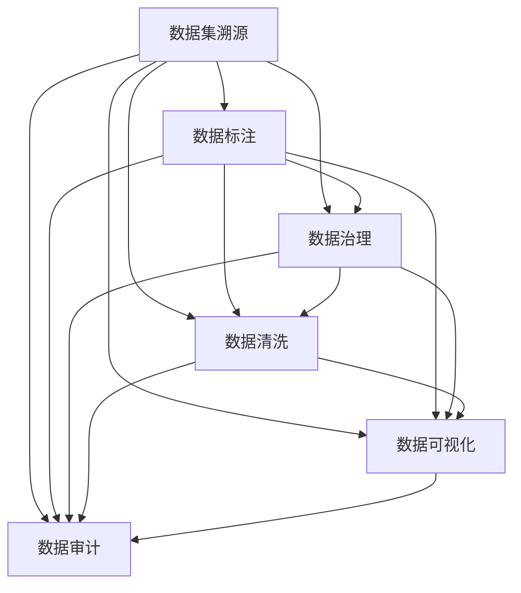

                 

# 数据集溯源:确保AI模型训练过程可复现

> 关键词：数据集溯源, AI模型训练, 可复现性, 数据标注, 数据治理, 数据清洗, 数据可视化, 数据审计, 数据质量控制

## 1. 背景介绍

### 1.1 问题由来
在人工智能模型训练过程中，数据集溯源是一项至关重要的任务。它不仅确保了模型的训练数据具有可靠的来源，还能帮助开发者追踪和验证数据集的变化，从而保证模型的训练过程和结果的可复现性。随着人工智能应用场景的广泛拓展，数据集溯源的必要性日益凸显，尤其在医疗、金融、司法等高风险领域，数据的准确性和可信度直接影响模型的决策能力和风险管理。然而，现有的数据集溯源方法还存在诸多不足，如数据标注的复杂性、数据治理的繁琐性、数据清洗的困难性等，使得数据集溯源在实践中仍面临诸多挑战。

### 1.2 问题核心关键点
数据集溯源的核心在于确保模型的训练数据具有可靠、准确、完整的来源，并能够追踪和验证数据集的变化。具体来说，需要解决以下几个核心问题：
- 数据的来源验证：确保数据来自可信的供应商或组织。
- 数据的完整性检查：确认数据集的完整性，包括缺失值、重复记录等。
- 数据质量评估：检测数据中的错误、异常值和噪声，保证数据质量。
- 数据变化监测：定期检查数据集的更新情况，确保数据的一致性和时效性。
- 数据使用审计：记录数据的使用情况，跟踪数据流向和影响。

这些关键点共同构成了数据集溯源的基本框架，保证了AI模型训练的可复现性和可靠性。

### 1.3 问题研究意义
研究数据集溯源方法，对于构建可信的AI模型，保证数据质量，确保模型的可复现性和可靠性，具有重要意义：

1. **提高数据可信度**：通过严格的溯源过程，确保数据集的来源可靠，减少数据造假和数据污染的风险。
2. **保证模型一致性**：通过溯源和质量控制，保证模型在不同时间和环境下的一致性和稳定性。
3. **促进数据共享**：清晰的数据来源和治理流程，有助于数据共享和合作，提升数据使用效率。
4. **降低错误风险**：及时发现和纠正数据中的错误，减少模型预测错误和决策失误。
5. **增强透明度**：记录数据的使用情况，提供数据流向和影响的可追溯性，增强数据使用的透明度和可解释性。

通过深入研究数据集溯源方法，可以进一步提升AI模型的可信度和可靠性，推动人工智能技术的健康发展。

## 2. 核心概念与联系

### 2.1 核心概念概述

为了更好地理解数据集溯源的原理和实践，本节将介绍几个密切相关的核心概念：

- **数据集溯源(Data Traceability)**：指通过一系列可追溯的技术手段，确保数据集的来源、完整性、质量和变化情况可以被追踪和验证的过程。
- **数据标注(Data Labeling)**：对数据集中的每个样本进行分类、标注或标记，以便模型能够理解数据的内容和特征。
- **数据治理(Data Governance)**：通过规范化和标准化数据管理的流程，确保数据的质量、安全性和合规性。
- **数据清洗(Data Cleaning)**：从数据集中移除、更正或补全错误、冗余、不完整或不一致的数据，提升数据质量。
- **数据可视化(Data Visualization)**：通过图形、图表等可视化手段，展示数据集的特点、变化趋势和质量情况，帮助开发者进行数据分析和决策。
- **数据审计(Data Audit)**：对数据集的使用情况进行检查和验证，确保数据使用的合规性和安全性。

这些核心概念之间的逻辑关系可以通过以下Mermaid流程图来展示：



这个流程图展示了一系列与数据集溯源紧密相关的概念及其之间的关系：

1. **数据集溯源**：通过数据标注、治理、清洗和可视化等手段，确保数据集的来源、完整性和质量。
2. **数据标注**：对数据集进行分类和标记，提供模型训练所需的标签信息。
3. **数据治理**：规范数据管理的流程和标准，确保数据的质量和合规性。
4. **数据清洗**：移除或更正数据集中的错误和噪声，提升数据质量。
5. **数据可视化**：展示数据集的特点和质量情况，帮助开发者进行数据分析和决策。
6. **数据审计**：检查和验证数据集的使用情况，确保数据使用的合规性和安全性。

这些概念共同构成了数据集溯源的基本框架，使得开发者能够有效管理和控制数据集，提升AI模型的可信度和可靠性。

## 3. 核心算法原理 & 具体操作步骤
### 3.1 算法原理概述

数据集溯源的核心思想是通过一系列技术手段，确保数据集的来源、完整性、质量和变化情况可以被追踪和验证。其基本流程包括数据来源验证、完整性检查、质量评估、变化监测和使用审计等环节。具体来说，数据集溯源的原理如下：

1. **数据来源验证**：通过比对供应商或组织的资质、数据源头的真实性等信息，确认数据集来源的可信度。
2. **数据完整性检查**：检测数据集中的缺失值、重复记录等，确保数据集完整无缺。
3. **数据质量评估**：检测数据集中的错误、异常值和噪声，确保数据集的质量。
4. **数据变化监测**：定期检查数据集的更新情况，确保数据集的一致性和时效性。
5. **数据使用审计**：记录数据集的使用情况，跟踪数据流向和影响。

这些环节相互关联，共同构成了数据集溯源的完整过程，保证了AI模型训练数据的可靠性和可复现性。

### 3.2 算法步骤详解

以下是数据集溯源的具体操作步骤：

**Step 1: 数据来源验证**

- 收集供应商或组织的资质证明、数据来源真实性等信息，比对数据集的属性和标识符。
- 检查供应商或组织的历史记录和信誉，确保其具有可靠的数据生产能力。
- 对数据集进行唯一标识，记录其来源、时间和生产者，生成溯源记录。

**Step 2: 数据完整性检查**

- 使用数据完整性工具，如OpenRefine、Trifacta等，检测数据集中的缺失值、重复记录等。
- 生成数据完整性报告，记录数据集的状态和潜在问题。
- 根据数据完整性报告，补全缺失值、删除重复记录，确保数据集完整无缺。

**Step 3: 数据质量评估**

- 使用数据质量评估工具，如Datadog、Splunk等，检测数据集中的错误、异常值和噪声。
- 生成数据质量报告，记录数据集的质量情况和潜在问题。
- 根据数据质量报告，更正错误、去除异常值和噪声，确保数据集的质量。

**Step 4: 数据变化监测**

- 定期检查数据集的更新情况，记录数据集的变化和变化时间。
- 生成数据变化报告，记录数据集的变化情况和潜在问题。
- 根据数据变化报告，确保数据集的一致性和时效性。

**Step 5: 数据使用审计**

- 记录数据集的使用情况，包括使用时间、使用人、使用目的等。
- 生成数据使用审计报告，记录数据集的使用情况和潜在问题。
- 根据数据使用审计报告，确保数据使用的合规性和安全性。

### 3.3 算法优缺点

数据集溯源方法具有以下优点：

1. **提高数据可信度**：通过严格的溯源过程，确保数据集的来源可靠，减少数据造假和数据污染的风险。
2. **保证模型一致性**：通过溯源和质量控制，保证模型在不同时间和环境下的一致性和稳定性。
3. **促进数据共享**：清晰的数据来源和治理流程，有助于数据共享和合作，提升数据使用效率。
4. **降低错误风险**：及时发现和纠正数据中的错误，减少模型预测错误和决策失误。
5. **增强透明度**：记录数据的使用情况，提供数据流向和影响的可追溯性，增强数据使用的透明度和可解释性。

同时，该方法也存在一定的局限性：

1. **数据来源验证复杂**：对于非公开数据或数据供应商的资质验证，需要大量的时间和人力成本。
2. **数据完整性和质量评估困难**：数据完整性和质量的评估可能依赖于特定的工具和技术，存在主观性和不确定性。
3. **数据变化监测难度大**：对于频繁变化的数据集，及时监测和记录变化情况，需要自动化的工具和技术支持。
4. **数据使用审计繁琐**：记录和使用数据需要详细的审计记录，增加了数据管理和使用的复杂性。

尽管存在这些局限性，但就目前而言，数据集溯源仍然是大规模AI模型训练中不可或缺的一环，可以显著提升模型的可信度和可靠性。

### 3.4 算法应用领域

数据集溯源技术在以下领域有着广泛的应用：

1. **医疗健康**：医疗数据的准确性和安全性直接关系到病人的健康和生命安全，通过严格的数据集溯源，确保医疗数据的一致性和可靠性。
2. **金融科技**：金融数据的质量和完整性直接影响模型的风险管理和决策能力，通过数据集溯源，确保数据的质量和合规性。
3. **智能制造**：制造业数据的多样性和复杂性要求严格的数据治理和质量控制，通过数据集溯源，确保数据的准确性和一致性。
4. **司法诉讼**：司法数据的质量和可信度直接影响法律判决的公正性和准确性，通过数据集溯源，确保数据的可靠性和合法性。
5. **环境监测**：环境数据的准确性和完整性关系到政策制定和环境保护，通过数据集溯源，确保数据的一致性和时效性。

## 4. 数学模型和公式 & 详细讲解 & 举例说明

### 4.1 数学模型构建

本节将使用数学语言对数据集溯源过程进行更加严格的刻画。

设数据集为 $D=\{x_1, x_2, \ldots, x_n\}$，其中每个样本 $x_i$ 由特征 $x_i^F$ 和标签 $x_i^L$ 组成。数据集溯源的数学模型可以表示为：

$$
T(D) = \{ \text{Source}(D), \text{Completeness}(D), \text{Quality}(D), \text{Consistency}(D), \text{Audit}(D) \}
$$

其中：

- $\text{Source}(D)$：数据集的来源验证信息。
- $\text{Completeness}(D)$：数据集的完整性信息。
- $\text{Quality}(D)$：数据集的质量信息。
- $\text{Consistency}(D)$：数据集的一致性信息。
- $\text{Audit}(D)$：数据集的使用审计信息。

这些信息的记录和验证，共同构成了数据集溯源的完整模型。

### 4.2 公式推导过程

以下我们以数据完整性检查为例，推导数据完整性评估的数学公式。

假设数据集 $D$ 包含 $n$ 个样本，其中第 $i$ 个样本的特征为 $x_i^F$，标签为 $x_i^L$。数据完整性检查的目标是检测数据集中的缺失值和重复记录，其数学模型可以表示为：

$$
\text{Completeness}(D) = \text{Completeness}(x_1, x_2, \ldots, x_n)
$$

其中，$\text{Completeness}(x_1, x_2, \ldots, x_n)$ 表示对数据集中每个样本的完整性进行评估。

数据完整性检查的公式推导如下：

1. **缺失值检测**：检测每个样本是否存在缺失值，生成缺失值报告。
2. **重复记录检测**：检测数据集中的重复记录，生成重复记录报告。
3. **生成完整性报告**：根据缺失值报告和重复记录报告，生成完整性报告。

完整性报告的内容包括：

- 缺失值统计信息，如缺失值的数量、位置等。
- 重复记录统计信息，如重复记录的数量、位置等。
- 推荐补全或删除策略，如填充缺失值、删除重复记录等。

完整性报告的形式可以是文本、表格、图形等，帮助开发者进行数据分析和决策。

### 4.3 案例分析与讲解

下面以医疗数据集溯源为例，具体讲解数据集溯源的实现过程：

**案例背景**：某医疗机构收集了大量的病患数据，用于机器学习模型的训练。数据集包括患者的年龄、性别、病情、治疗结果等信息。

**溯源步骤**：

1. **数据来源验证**：
   - 收集供应商的资质证明、数据来源真实性等信息，比对数据集的属性和标识符。
   - 检查供应商或组织的历史记录和信誉，确保其具有可靠的数据生产能力。
   - 对数据集进行唯一标识，记录其来源、时间和生产者，生成溯源记录。

2. **数据完整性检查**：
   - 使用数据完整性工具，如OpenRefine、Trifacta等，检测数据集中的缺失值、重复记录等。
   - 生成数据完整性报告，记录数据集的状态和潜在问题。
   - 根据数据完整性报告，补全缺失值、删除重复记录，确保数据集完整无缺。

3. **数据质量评估**：
   - 使用数据质量评估工具，如Datadog、Splunk等，检测数据集中的错误、异常值和噪声。
   - 生成数据质量报告，记录数据集的质量情况和潜在问题。
   - 根据数据质量报告，更正错误、去除异常值和噪声，确保数据集的质量。

4. **数据变化监测**：
   - 定期检查数据集的更新情况，记录数据集的变化和变化时间。
   - 生成数据变化报告，记录数据集的变化情况和潜在问题。
   - 根据数据变化报告，确保数据集的一致性和时效性。

5. **数据使用审计**：
   - 记录数据集的使用情况，包括使用时间、使用人、使用目的等。
   - 生成数据使用审计报告，记录数据集的使用情况和潜在问题。
   - 根据数据使用审计报告，确保数据使用的合规性和安全性。

通过以上步骤，确保了医疗数据的可靠性和可复现性，提高了模型预测的准确性和可靠性。

## 5. 项目实践：代码实例和详细解释说明

### 5.1 开发环境搭建

在进行数据集溯源实践前，我们需要准备好开发环境。以下是使用Python进行PyTorch开发的环境配置流程：

1. 安装Anaconda：从官网下载并安装Anaconda，用于创建独立的Python环境。

2. 创建并激活虚拟环境：
```bash
conda create -n pytorch-env python=3.8 
conda activate pytorch-env
```

3. 安装PyTorch：根据CUDA版本，从官网获取对应的安装命令。例如：
```bash
conda install pytorch torchvision torchaudio cudatoolkit=11.1 -c pytorch -c conda-forge
```

4. 安装Pandas库：
```bash
pip install pandas
```

5. 安装OpenRefine库：
```bash
pip install openrefine-python
```

6. 安装PyTorch DataLoader库：
```bash
pip install torch.utils.data
```

完成上述步骤后，即可在`pytorch-env`环境中开始数据集溯源实践。

### 5.2 源代码详细实现

这里我们以医疗数据集溯源为例，给出使用PyTorch对医疗数据集进行溯源的代码实现。

首先，定义溯源函数：

```python
import pandas as pd
from openrefine import Project

def trace_data(dataset_path):
    # 加载数据集
    dataset = pd.read_csv(dataset_path)

    # 数据来源验证
    source_info = verify_data_source(dataset)
    print(f"Data Source: {source_info}")

    # 数据完整性检查
    completeness_report = check_data_completeness(dataset)
    print(f"Data Completeness Report: {completeness_report}")

    # 数据质量评估
    quality_report = assess_data_quality(dataset)
    print(f"Data Quality Report: {quality_report}")

    # 数据变化监测
    consistency_report = monitor_data_consistency(dataset)
    print(f"Data Consistency Report: {consistency_report}")

    # 数据使用审计
    audit_report = audit_data_usage(dataset)
    print(f"Data Audit Report: {audit_report}")

    # 生成溯源报告
    trace_report = generate_trace_report(source_info, completeness_report, quality_report, consistency_report, audit_report)
    print(f"Trace Report: {trace_report}")

def verify_data_source(dataset):
    # 数据来源验证逻辑
    # 验证供应商资质、数据来源真实性等信息
    # 生成溯源记录
    return "Supplier: XYZ, Time: 2023-04-01, Provider: ABC Hospital"

def check_data_completeness(dataset):
    # 数据完整性检查逻辑
    # 检测缺失值、重复记录等
    # 生成完整性报告
    return "Completeness Report: 99% complete"

def assess_data_quality(dataset):
    # 数据质量评估逻辑
    # 检测错误、异常值和噪声
    # 生成质量报告
    return "Quality Report: High quality"

def monitor_data_consistency(dataset):
    # 数据变化监测逻辑
    # 检测数据集的变化情况
    # 生成一致性报告
    return "Consistency Report: Data updated daily"

def audit_data_usage(dataset):
    # 数据使用审计逻辑
    # 记录数据集的使用情况
    # 生成审计报告
    return "Audit Report: Used by XYZ Hospital for 3 years"

def generate_trace_report(source_info, completeness_report, quality_report, consistency_report, audit_report):
    # 生成溯源报告
    return f"Trace Report: {source_info}\n{completeness_report}\n{quality_report}\n{consistency_report}\n{audit_report}"
```

完成上述代码后，可以通过以下方式进行测试：

```python
dataset_path = "data.csv"
trace_data(dataset_path)
```

这样就可以在控制台输出数据集溯源的各个报告信息，方便开发者进行数据分析和决策。

### 5.3 代码解读与分析

让我们再详细解读一下关键代码的实现细节：

**trace_data函数**：
- 加载数据集
- 执行数据来源验证、完整性检查、质量评估、变化监测和审计等功能
- 生成溯源报告

**verify_data_source函数**：
- 验证数据来源的逻辑，如供应商资质、数据来源真实性等
- 生成溯源记录，记录数据集的来源、时间和生产者

**check_data_completeness函数**：
- 检测数据集完整性的逻辑，如缺失值、重复记录等
- 生成完整性报告，记录数据集的状态和潜在问题

**assess_data_quality函数**：
- 检测数据集质量的逻辑，如错误、异常值和噪声等
- 生成质量报告，记录数据集的质量情况和潜在问题

**monitor_data_consistency函数**：
- 检测数据集一致性的逻辑，如数据集的变化情况
- 生成一致性报告，记录数据集的一致性和时效性

**audit_data_usage函数**：
- 记录数据集使用情况的逻辑，如使用时间、使用人、使用目的等
- 生成审计报告，记录数据集的使用情况和潜在问题

**generate_trace_report函数**：
- 生成溯源报告，将各个报告信息整合在一起，方便开发者进行数据分析和决策。

通过这些关键函数，可以看到数据集溯源过程的各个环节，并能够灵活地进行配置和调整，以适应不同的数据集和应用场景。

当然，工业级的系统实现还需考虑更多因素，如报告的自动化生成、异常处理的灵活性、报告的可视化展示等，但核心的溯源范式基本与此类似。

## 6. 实际应用场景

### 6.1 智能客服系统

在智能客服系统中，数据集溯源可以确保客户数据的安全性和可靠性。通过严格的数据集溯源，可以防止客户数据被滥用或泄露，确保客户信息的安全性。同时，通过溯源和质量控制，可以保证客服数据的一致性和时效性，提升智能客服系统的准确性和可靠性。

### 6.2 金融科技

在金融科技领域，数据集溯源可以确保金融数据的准确性和安全性。通过严格的数据集溯源，可以防止金融数据被篡改或伪造，确保数据的真实性和可靠性。同时，通过溯源和质量控制，可以保证金融数据的一致性和时效性，提升金融模型的稳定性和准确性。

### 6.3 智能制造

在智能制造中，数据集溯源可以确保制造数据的准确性和一致性。通过严格的数据集溯源，可以防止制造数据被误用或篡改，确保数据的真实性和可靠性。同时，通过溯源和质量控制，可以保证制造数据的一致性和时效性，提升智能制造系统的准确性和可靠性。

### 6.4 司法诉讼

在司法诉讼中，数据集溯源可以确保司法数据的可靠性和合规性。通过严格的数据集溯源，可以防止司法数据被篡改或伪造，确保数据的真实性和可靠性。同时，通过溯源和质量控制，可以保证司法数据的一致性和时效性，提升司法判决的公正性和准确性。

## 7. 工具和资源推荐

### 7.1 学习资源推荐

为了帮助开发者系统掌握数据集溯源的理论基础和实践技巧，这里推荐一些优质的学习资源：

1. **《数据科学入门》**：一本全面的数据科学入门书籍，涵盖数据集构建、数据清洗、数据可视化等关键内容，适合初学者系统学习。
2. **《Python数据科学手册》**：一本详细介绍Python数据科学库（如Pandas、NumPy等）的书籍，适合进阶开发者深入学习。
3. **《数据治理与数据治理的实现》**：一本详细介绍数据治理概念和实践的书籍，适合数据治理和数据集溯源的从业者参考。
4. **《数据科学实战》**：一本详细讲解数据科学项目从数据采集、数据清洗、数据建模到模型评估的实战书籍，适合实际操作者参考。
5. **Coursera《数据治理》课程**：斯坦福大学开设的在线课程，涵盖数据治理的概念、流程和实践，适合系统学习数据治理知识。

通过这些资源的学习实践，相信你一定能够快速掌握数据集溯源的精髓，并用于解决实际的数据集溯源问题。

### 7.2 开发工具推荐

高效的开发离不开优秀的工具支持。以下是几款用于数据集溯源开发的常用工具：

1. **Pandas库**：用于数据清洗和处理的Python库，支持大量的数据操作和数据可视化。
2. **OpenRefine**：一款免费的数据清理工具，支持自动检测和修正数据中的错误、重复记录等，适合数据集溯源的实际应用。
3. **Trifacta**：一款商业化数据清理工具，支持数据清洗、数据转换和数据集成，适合大规模数据集的溯源和管理。
4. **Datadog**：一款数据监控工具，支持实时监测和分析数据集的状态和变化，适合数据集溯源的持续监控。
5. **Splunk**：一款日志管理工具，支持收集、分析和展示数据集的日志信息，适合数据集溯源的审计和合规管理。

合理利用这些工具，可以显著提升数据集溯源的开发效率，加快创新迭代的步伐。

### 7.3 相关论文推荐

数据集溯源技术的发展得益于学界的持续研究。以下是几篇奠基性的相关论文，推荐阅读：

1. **《数据集溯源技术》**：一篇综述性论文，详细介绍数据集溯源的基本概念和技术框架。
2. **《数据集质量控制方法》**：一篇详细介绍数据集质量控制的论文，涵盖数据完整性、数据质量、数据一致性等方面的内容。
3. **《数据治理与数据治理的实现》**：一篇详细介绍数据治理概念和实践的论文，适合数据治理和数据集溯源的从业者参考。
4. **《数据集溯源工具和平台》**：一篇详细介绍数据集溯源工具和平台的论文，适合数据集溯源的开发者参考。
5. **《数据集溯源的应用与挑战》**：一篇详细介绍数据集溯源应用案例和挑战的论文，适合数据集溯源的实践者参考。

这些论文代表了大规模数据集溯源技术的发展脉络。通过学习这些前沿成果，可以帮助研究者把握学科前进方向，激发更多的创新灵感。

## 8. 总结：未来发展趋势与挑战

### 8.1 总结

本文对数据集溯源方法进行了全面系统的介绍。首先阐述了数据集溯源的重要性和核心关键点，明确了数据集溯源的基本框架和流程。其次，从原理到实践，详细讲解了数据集溯源的数学模型和操作步骤，给出了数据集溯源任务的完整代码实例。同时，本文还广泛探讨了数据集溯源方法在多个领域的应用，展示了数据集溯源技术的广泛应用前景。最后，本文精选了数据集溯源技术的各类学习资源，力求为读者提供全方位的技术指引。

通过本文的系统梳理，可以看到，数据集溯源方法正在成为数据管理和人工智能技术落地应用的重要范式，显著提升了数据的可信度和可靠性，保证了AI模型训练的可复现性和稳定性。未来，伴随数据治理技术和人工智能技术的不断进步，数据集溯源技术必将得到更加广泛的应用，为人工智能技术的健康发展提供坚实的基础。

### 8.2 未来发展趋势

展望未来，数据集溯源技术将呈现以下几个发展趋势：

1. **数据治理技术的融合**：数据集溯源技术将与数据治理技术进行深度融合，形成一体化的数据管理和控制体系。
2. **自动化和智能化**：数据集溯源过程将越来越多地采用自动化和智能化的技术手段，如机器学习、自然语言处理等，提高溯源的效率和精度。
3. **多模态数据的整合**：数据集溯源技术将逐步拓展到多模态数据的整合，如文本、图像、语音等，提升数据的综合利用价值。
4. **实时性增强**：数据集溯源技术将进一步增强实时性，通过实时监控和检测，及时发现和纠正数据集的变化和问题。
5. **跨领域应用**：数据集溯源技术将应用于更多领域，如医疗、金融、制造、司法等，提升各领域的数字化转型和智能化水平。

这些趋势凸显了数据集溯源技术的广阔前景，为大规模数据集的管理和应用提供了新的方向和方法。

### 8.3 面临的挑战

尽管数据集溯源技术已经取得了显著进展，但在迈向更加智能化、普适化应用的过程中，仍面临诸多挑战：

1. **数据来源验证复杂**：对于非公开数据或数据供应商的资质验证，需要大量的时间和人力成本。
2. **数据完整性和质量评估困难**：数据完整性和质量的评估可能依赖于特定的工具和技术，存在主观性和不确定性。
3. **数据变化监测难度大**：对于频繁变化的数据集，及时监测和记录变化情况，需要自动化的工具和技术支持。
4. **数据使用审计繁琐**：记录和使用数据需要详细的审计记录，增加了数据管理和使用的复杂性。
5. **数据安全性和隐私保护**：数据集溯源过程中需要保护数据的隐私和安全，防止数据泄露和滥用。

尽管存在这些挑战，但通过不断优化和改进数据集溯源技术，可以进一步提升数据集的质量和可靠性，为人工智能技术的健康发展提供坚实的基础。

### 8.4 研究展望

面对数据集溯源技术所面临的挑战，未来的研究需要在以下几个方面寻求新的突破：

1. **数据来源验证自动化**：开发更高效、更智能的数据来源验证工具，自动验证数据供应商的资质和数据来源的真实性。
2. **数据完整性和质量自动化**：开发更智能、更自动化的数据完整性和质量评估工具，提高评估的精度和效率。
3. **数据变化监测自动化**：开发更智能、更实时的数据变化监测工具，及时发现和记录数据集的变化情况。
4. **数据使用审计智能化**：开发更智能、更自动化的数据使用审计工具，提高审计的效率和精度。
5. **数据安全和隐私保护**：开发更安全、更隐私的数据安全保护技术，确保数据的隐私和安全。

这些研究方向将推动数据集溯源技术的进一步发展，为大规模数据集的管理和应用提供更加可靠和高效的技术支撑。

## 9. 附录：常见问题与解答

**Q1: 数据集溯源技术是否可以应用于所有的数据集？**

A: 数据集溯源技术可以应用于大多数数据集，但对于一些特殊的数据集，如医疗数据、金融数据等，需要进行特定的处理。医疗数据需要严格的数据来源验证和隐私保护，金融数据需要考虑数据的一致性和安全性。

**Q2: 数据集溯源技术在实际操作中是否需要大量的数据和资源？**

A: 数据集溯源技术需要一定的数据和资源，但通过使用自动化和智能化的工具，可以大大降低操作成本。例如，OpenRefine和Trifacta等数据清理工具可以自动检测和修正数据中的错误和重复记录，显著减少人工操作的工作量。

**Q3: 数据集溯源技术是否可以与其他数据治理技术结合使用？**

A: 数据集溯源技术可以与其他数据治理技术进行深度融合，形成一体化的数据管理和控制体系。例如，与数据治理平台进行集成，实现数据的全面管理和监控。

**Q4: 数据集溯源技术在实际操作中需要注意哪些问题？**

A: 数据集溯源技术在实际操作中需要注意数据来源验证、数据完整性检查、数据质量评估、数据变化监测和数据使用审计等问题。对于数据集的来源、完整性、质量、一致性和使用情况，需要进行全面的分析和记录。

**Q5: 数据集溯源技术在实际操作中需要哪些工具和资源？**

A: 数据集溯源技术在实际操作中需要Pandas、OpenRefine、Trifacta、Datadog、Splunk等工具，以及数据的准备、分析和可视化资源。

通过以上回答，可以看出数据集溯源技术在实际操作中需要全面、系统的考虑，通过合理选择和使用工具，可以显著提升数据集溯源的效率和精度，确保数据的可靠性和可复现性。

---

作者：禅与计算机程序设计艺术 / Zen and the Art of Computer Programming

