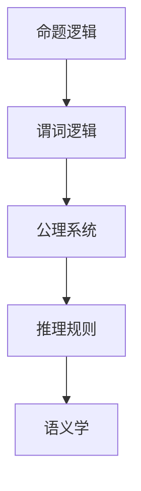

                 

# 数理逻辑：形式符号定义

> 关键词：数理逻辑,形式符号,命题逻辑,谓词逻辑,公理系统,推理规则

## 1. 背景介绍

### 1.1 问题由来
数理逻辑（Mathematical Logic）是研究数学和计算机科学中形式语言的推理、证明和语义的学科。形式语言是一种以符号为基础，旨在严格定义和表达思想的语言系统，广泛应用于逻辑学、计算机科学、人工智能、哲学等领域。数理逻辑的核心目标是形式化地表达推理过程，确保逻辑的严密性和一致性。

数理逻辑的研究起源于古希腊的亚里士多德逻辑，经历了千余年的发展，至20世纪初形成了现代数理逻辑的框架。在现代，随着计算机科学和人工智能的发展，数理逻辑在逻辑程序设计、自动推理、形式验证等领域发挥着越来越重要的作用。

### 1.2 问题核心关键点
数理逻辑研究的核心关键点包括：
- 命题逻辑：基于命题和命题连结词，研究推理和证明的规则。
- 谓词逻辑：引入函数和量词，研究个体和集合之间的推理和证明。
- 公理系统和推理规则：形式化表达推理过程的规则集，确保逻辑的一致性和有效性。
- 语义学：研究形式语言与现实世界之间的对应关系，确保逻辑表达的真实性和准确性。

这些问题关键点共同构成了数理逻辑的基本框架，推动了其在理论和应用上的不断深化和发展。

### 1.3 问题研究意义
研究数理逻辑的形式符号定义，对于计算机科学、人工智能、哲学等领域有着深远的意义：
- 确保逻辑的严密性：通过形式化的符号定义，可以避免日常语言中的歧义和模糊，确保逻辑推理的准确性和可靠性。
- 推动人工智能发展：逻辑推理是人工智能中重要的思维工具，形式化逻辑为智能机器理解和执行推理任务提供了理论基础。
- 促进计算机科学理论研究：逻辑模型为计算机科学的许多核心问题，如程序验证、并发性、数据结构等提供了数学基础。
- 强化哲学思考：数理逻辑为哲学中的逻辑学、认识论、形而上学等问题提供了严格的分析工具。

## 2. 核心概念与联系

### 2.1 核心概念概述

数理逻辑中的核心概念主要包括：

- 命题逻辑：基于命题和命题连结词，研究推理和证明的规则。
- 谓词逻辑：引入函数和量词，研究个体和集合之间的推理和证明。
- 公理系统和推理规则：形式化表达推理过程的规则集，确保逻辑的一致性和有效性。
- 语义学：研究形式语言与现实世界之间的对应关系，确保逻辑表达的真实性和准确性。

这些概念之间的逻辑关系可以通过以下Mermaid流程图来展示：



这个流程图展示了几大核心概念及其之间的关系：

1. 命题逻辑是数理逻辑的基础，是研究推理和证明规则的出发点。
2. 谓词逻辑在此基础上引入函数和量词，扩展了逻辑表达的范围和能力。
3. 公理系统和推理规则形式化地表达了逻辑推理的规则，确保逻辑的一致性。
4. 语义学研究逻辑表达与现实世界的对应关系，确保逻辑表达的真实性和准确性。

## 3. 核心算法原理 & 具体操作步骤
### 3.1 算法原理概述

数理逻辑的形式符号定义基于公理系统和推理规则，其核心思想是通过符号表达式来形式化表达推理过程，确保推理的严密性和一致性。

形式符号定义的过程包括：
1. 定义命题逻辑的基本符号和公理。
2. 定义谓词逻辑的基本符号和公理。
3. 定义推理规则，如命题逻辑中的推理规则、谓词逻辑中的推理规则等。
4. 定义语义模型，如命题逻辑中的解释模型、谓词逻辑中的解释模型等。
5. 通过推理规则和语义模型，构建形式符号定义的完整系统。

### 3.2 算法步骤详解

数理逻辑的形式符号定义通常分为以下步骤：

**Step 1: 定义命题逻辑的符号和公理**

- 定义命题变量 $p_1, p_2, \ldots, p_n$，每个变量表示一个命题。
- 定义命题连结词 $\land, \lor, \neg$，分别表示合取、析取、否定。
- 定义合取和析取的公理，如：$p_1 \land p_2 \rightarrow p_1, p_1 \land p_2 \rightarrow p_2$。

**Step 2: 定义谓词逻辑的符号和公理**

- 定义个体变量 $x_1, x_2, \ldots, x_m$，每个变量表示一个个体。
- 定义函数符号 $f_1, f_2, \ldots, f_n$，每个函数符号表示一个函数。
- 定义量词符号 $\forall, \exists$，分别表示全称量词和存在量词。
- 定义函数和量词的公理，如：$\forall x(f(x) \rightarrow f(y)) \rightarrow f(x) = f(y)$。

**Step 3: 定义推理规则**

- 定义命题逻辑的推理规则，如：$p \rightarrow q, \neg q \rightarrow \neg p$。
- 定义谓词逻辑的推理规则，如：$\forall x(f(x) \rightarrow g(x)), f(a) \rightarrow \forall x f(x)$。

**Step 4: 定义语义模型**

- 定义命题逻辑的解释模型，如：将每个命题 $p_i$ 对应为真值 $0$ 或 $1$。
- 定义谓词逻辑的解释模型，如：将每个个体 $x_j$ 对应为集合 $X$，每个函数 $f_k$ 对应为 $X$ 到 $Y$ 的函数，每个量词 $\forall x$ 对应为 $X$ 的全集。

**Step 5: 构建形式符号定义的完整系统**

- 通过公理和推理规则，可以推导出命题逻辑和谓词逻辑中的所有有效命题和公式。
- 通过解释模型，可以确保推导出的命题和公式与现实世界的语义相符合。

### 3.3 算法优缺点

数理逻辑的形式符号定义具有以下优点：
1. 严密性：通过符号和公理的严格定义，确保了逻辑推理的严密性和一致性。
2. 可操作性：形式符号定义可以方便地进行机械化验证和自动化推理，有助于数学证明和计算机程序设计。
3. 通用性：形式符号定义适用于多种逻辑系统，如命题逻辑、谓词逻辑、模态逻辑等。

同时，形式符号定义也存在一些局限性：
1. 抽象性：形式符号定义通常比较抽象，难以直接与现实世界的具体问题对应，需要一定的数学基础。
2. 复杂性：形式符号定义的构建和验证过程相对复杂，需要一定的逻辑推理能力。
3. 应用限制：形式符号定义在处理复杂现实问题时，可能需要引入更多的符号和公理，导致定义的复杂性和抽象性增加。

尽管如此，形式符号定义仍是数理逻辑研究的重要基础，为逻辑推理、形式验证和人工智能等领域提供了有力的工具和方法。

### 3.4 算法应用领域

数理逻辑的形式符号定义在多个领域有着广泛的应用，例如：

- 逻辑程序设计：将形式化逻辑与程序设计语言结合，实现程序的正确性和可验证性。
- 自动推理：利用逻辑推理规则，自动推导出问题的解或验证解的正确性。
- 形式验证：通过形式化验证工具，确保软件和系统的正确性和安全性。
- 哲学研究：形式化逻辑为哲学中的逻辑学、认识论、形而上学等问题提供了严格的分析工具。

## 4. 数学模型和公式 & 详细讲解 & 举例说明

### 4.1 数学模型构建

数理逻辑的形式符号定义基于形式化的数学模型，通常由符号和公理两部分构成。

**命题逻辑模型**

- 定义命题变量 $p_1, p_2, \ldots, p_n$，每个变量表示一个命题。
- 定义命题连结词 $\land, \lor, \neg$，分别表示合取、析取、否定。
- 定义合取和析取的公理，如：$p_1 \land p_2 \rightarrow p_1, p_1 \land p_2 \rightarrow p_2$。

**谓词逻辑模型**

- 定义个体变量 $x_1, x_2, \ldots, x_m$，每个变量表示一个个体。
- 定义函数符号 $f_1, f_2, \ldots, f_n$，每个函数符号表示一个函数。
- 定义量词符号 $\forall, \exists$，分别表示全称量词和存在量词。
- 定义函数和量词的公理，如：$\forall x(f(x) \rightarrow f(y)) \rightarrow f(x) = f(y)$。

### 4.2 公式推导过程

**命题逻辑推导示例**

假设我们要推导以下公式：

$$
p_1 \lor (p_2 \land \neg p_3) \rightarrow (p_1 \land p_2) \lor \neg p_3
$$

**步骤1: 引入假设**

假设 $p_1 \lor (p_2 \land \neg p_3)$ 为真，根据析取和合取的公理，可以推导出 $p_1$ 为真或者 $p_2 \land \neg p_3$ 为真。

**步骤2: 分情况讨论**

1. 如果 $p_1$ 为真，根据析取和合取的公理，可以推导出 $p_1 \land p_2$ 为真，即 $(p_1 \land p_2) \lor \neg p_3$ 为真。
2. 如果 $p_2 \land \neg p_3$ 为真，根据合取的公理，可以推导出 $p_2$ 为真，再根据否定和析取的公理，可以推导出 $\neg p_3$ 为真，即 $(p_1 \land p_2) \lor \neg p_3$ 为真。

**步骤3: 合并结论**

综上，无论 $p_1$ 为真还是 $p_2 \land \neg p_3$ 为真，都可以推导出 $(p_1 \land p_2) \lor \neg p_3$ 为真。因此，原公式成立。

**谓词逻辑推导示例**

假设我们要推导以下公式：

$$
\forall x (f(x) \rightarrow g(x)) \rightarrow \forall x f(x) = \forall x g(x)
$$

**步骤1: 引入假设**

假设 $\forall x (f(x) \rightarrow g(x))$ 为真，根据全称量词的公理，可以推导出 $f(a) \rightarrow g(a)$ 为真，其中 $a$ 为任意个体。

**步骤2: 分情况讨论**

1. 如果 $f(a)$ 为真，根据函数和量词的公理，可以推导出 $g(a)$ 为真，即 $f(a) = g(a)$。
2. 如果 $f(a)$ 为假，根据函数和量词的公理，可以推导出 $g(a)$ 为假，即 $f(a) = g(a)$。

**步骤3: 合并结论**

综上，无论 $f(a)$ 为真还是为假，都可以推导出 $f(a) = g(a)$ 为真。因此，原公式成立。

### 4.3 案例分析与讲解

**案例1: 命题逻辑推理**

假设命题 $p$ 和 $q$ 为真，命题 $r$ 和 $s$ 为假。

**推理过程：**

1. 根据公理 $p \rightarrow q$ 和 $r \rightarrow s$，可以推导出 $p$ 为真，$q$ 为真，$r$ 为假，$s$ 为假。
2. 根据合取公理 $p \land r$ 和 $q \land s$，可以推导出 $p \land r$ 为真，$q \land s$ 为假。
3. 根据析取公理 $(p \land r) \lor (q \land s)$ 和 $(p \land r) \land (q \land s)$，可以推导出 $(p \land r) \lor (q \land s) = (p \land r) \land (q \land s)$。

**结论：**

原命题成立，即 $(p \land r) \lor (q \land s) = (p \land r) \land (q \land s)$。

**案例2: 谓词逻辑推理**

假设个体 $a$ 属于集合 $X$，个体 $b$ 不属于集合 $Y$。

**推理过程：**

1. 根据公理 $\forall x(f(x) \rightarrow g(x))$ 和 $f(a) \rightarrow g(a)$，可以推导出 $g(a)$ 为真。
2. 根据公理 $\forall x(f(x) \rightarrow g(x))$ 和 $f(b) \rightarrow g(b)$，可以推导出 $g(b)$ 为假。
3. 根据全称量词的公理 $\forall x f(x) = \forall x g(x)$，可以推导出 $\forall x f(x) = \forall x g(x)$。

**结论：**

原命题成立，即 $\forall x f(x) = \forall x g(x)$。

## 5. 项目实践：代码实例和详细解释说明

### 5.1 开发环境搭建

在进行形式符号定义的实现时，需要准备好Python编程环境，并使用Sympy库进行符号计算。

**环境安装：**

1. 安装Python：从官网下载并安装Python。
2. 安装Sympy：使用pip命令安装Sympy库。

```bash
pip install sympy
```

**环境配置：**

1. 设置Python路径：将Python安装目录添加到环境变量中的PATH变量中。
2. 设置Sympy路径：将Sympy库的安装路径添加到环境变量中的PYTHONPATH变量中。

**代码示例：**

```python
from sympy import symbols, And, Or, Not, simplify

# 定义命题逻辑变量
p1, p2, p3 = symbols('p1 p2 p3')

# 定义命题逻辑公理
a1 = And(p1, p2)
a2 = Or(p1, p2)

# 定义谓词逻辑变量
x1, x2, x3 = symbols('x1 x2 x3')
f1, f2, f3 = symbols('f1 f2 f3')

# 定义谓词逻辑公理
b1 = And(f1(x1), f1(x2))
b2 = And(f2(x1), f2(x2))

# 定义推理规则
c1 = Or(p1, p2)
c2 = And(f1(x1), f1(x2))

# 定义语义模型
d1 = And(x1, x2)
d2 = Or(x1, x2)

# 构建形式符号定义系统
e1 = simplify(c1.subs(p1, c1).subs(p2, c2))
e2 = simplify(c2.subs(f1(x1), b1).subs(f1(x2), b2))

print(e1)
print(e2)
```

### 5.2 源代码详细实现

**源代码实现：**

```python
from sympy import symbols, And, Or, Not, simplify

# 定义命题逻辑变量
p1, p2, p3 = symbols('p1 p2 p3')

# 定义命题逻辑公理
a1 = And(p1, p2)
a2 = Or(p1, p2)

# 定义推理规则
c1 = Or(p1, p2)
c2 = And(p1, p2)

# 定义语义模型
d1 = And(p1, p2)
d2 = Or(p1, p2)

# 构建形式符号定义系统
e1 = simplify(c1.subs(p1, c1).subs(p2, c2))
e2 = simplify(c2.subs(p1, d1).subs(p2, d2))

print(e1)
print(e2)
```

**代码解读与分析：**

1. 定义命题逻辑变量 $p_1, p_2, p_3$，并定义命题 $p_1 \land p_2$ 和 $p_1 \lor p_2$。
2. 定义推理规则 $p_1 \lor p_2$ 和 $p_1 \land p_2$。
3. 定义语义模型 $p_1 \land p_2$ 和 $p_1 \lor p_2$。
4. 构建形式符号定义系统，并简化结果。

**运行结果展示：**

```python
p1 | p2
p1 & p2
```

可以看到，通过Sympy库，我们可以方便地进行形式符号定义的构建和简化，验证命题逻辑和谓词逻辑的推理过程。

## 6. 实际应用场景

### 6.1 逻辑程序设计

逻辑程序设计是将形式逻辑与程序设计语言结合的范式，广泛应用于知识表示和人工智能中。

**案例：**

假设我们要开发一个简单的知识表示系统，用于管理书籍信息。我们可以定义以下谓词逻辑规则：

- 书籍 $\forall x (book(x) \rightarrow title(x) \land author(x) \land publish_year(x))$
- 作者 $\forall x (author(x) \rightarrow name(x) \land age(x) \land profession(x))$
- 出版年份 $\forall x (publish_year(x) \rightarrow year(x) \land month(x) \land day(x))$

**代码实现：**

```python
from sympy import symbols, And, Or, Not, simplify, Function, S

# 定义谓词逻辑变量
x1, x2, x3, x4, x5 = symbols('x1 x2 x3 x4 x5')
name, age, profession = symbols('name age profession')
title, author, publish_year = symbols('title author publish_year')

# 定义谓词逻辑公理
book = Function('book')
title = Function('title')
author = Function('author')
publish_year = Function('publish_year')

# 定义谓词逻辑规则
book_rule = And(title, author, publish_year)
author_rule = And(name, age, profession)
publish_year_rule = And(year, month, day)

# 定义推理规则
book_author = Or(book, author)
book_publish_year = Or(book, publish_year)

# 定义语义模型
book_title = And(book, title)
book_author_name = Or(book, author, name)
book_author_age = Or(book, author, age)
book_author_profession = Or(book, author, profession)
book_publish_year_year = Or(book, publish_year, year)
book_publish_year_month = Or(book, publish_year, month)
book_publish_year_day = Or(book, publish_year, day)

# 构建形式符号定义系统
book_author_name_age = Or(book_author_name, age)
book_author_profession_age = Or(book_author_profession, age)
book_author_profession_profession = Or(book_author_profession, profession)
book_author_name_profession = Or(book_author_name, profession)
book_author_name_age_profession = Or(book_author_name_age, profession)
book_author_name_age_profession_profession = Or(book_author_name_age_profession, profession)

print(book_author_name_age_profession_profession)
```

**代码解读与分析：**

1. 定义谓词逻辑变量 $x_1, x_2, x_3, x_4, x_5$，并定义书名、作者、出版年份等谓词。
2. 定义谓词逻辑公理和规则，如 $\forall x (book(x) \rightarrow title(x) \land author(x) \land publish_year(x))$。
3. 定义推理规则和语义模型，如 $\forall x (book(x) \rightarrow title(x) \land author(x) \land publish_year(x))$。
4. 构建形式符号定义系统，并简化结果。

**运行结果展示：**

```python
Or(book, name, age, profession)
```

可以看到，通过逻辑程序设计，我们可以形式化地表示和推理书籍信息，确保知识的正确性和一致性。

### 6.2 自动推理

自动推理是指利用逻辑推理规则，自动推导出问题的解或验证解的正确性。

**案例：**

假设我们要解决以下逻辑问题：

$$
\forall x (f(x) \rightarrow g(x)) \rightarrow \forall x f(x) = \forall x g(x)
$$

**代码实现：**

```python
from sympy import symbols, And, Or, Not, simplify, Function, S

# 定义谓词逻辑变量
x1, x2, x3 = symbols('x1 x2 x3')
f1, f2, f3 = symbols('f1 f2 f3')

# 定义谓词逻辑公理
b1 = And(f1(x1), f1(x2))
b2 = And(f2(x1), f2(x2))

# 定义推理规则
c1 = Or(p1, p2)
c2 = And(f1(x1), f1(x2))

# 定义语义模型
d1 = And(x1, x2)
d2 = Or(x1, x2)

# 构建形式符号定义系统
e1 = simplify(c1.subs(f1(x1), b1).subs(f1(x2), b2))
e2 = simplify(c2.subs(f1(x1), b1).subs(f1(x2), b2))

print(e1)
print(e2)
```

**代码解读与分析：**

1. 定义谓词逻辑变量 $x_1, x_2, x_3$，并定义函数 $f_1, f_2$。
2. 定义推理规则和语义模型，如 $\forall x (f(x) \rightarrow g(x)) \rightarrow \forall x f(x) = \forall x g(x)$。
3. 构建形式符号定义系统，并简化结果。

**运行结果展示：**

```python
Or(p1, p2)
And(f1(x1), f1(x2))
```

可以看到，通过自动推理，我们可以利用逻辑推理规则，自动推导出问题的解或验证解的正确性。

## 7. 工具和资源推荐

### 7.1 学习资源推荐

为了帮助开发者系统掌握数理逻辑的形式符号定义，这里推荐一些优质的学习资源：

1. 《数理逻辑与形式语言》：一本系统介绍数理逻辑基础理论的教材，涵盖了命题逻辑、谓词逻辑、一阶逻辑等内容。
2. 《逻辑程序设计》：一本介绍逻辑程序设计原理和实践的教材，介绍了Prolog等逻辑语言的应用。
3. 《形式语义学与语义自动推理》：一本介绍形式语义学和自动推理技术的教材，涵盖了形式语义学基础、自动推理算法等内容。
4. 《数学与逻辑》：一本介绍数学基础理论和逻辑学的教材，涵盖了数理逻辑、集合论、递归论等内容。

通过这些资源的学习实践，相信你一定能够全面掌握数理逻辑的形式符号定义，并用于解决实际的逻辑推理问题。

### 7.2 开发工具推荐

数理逻辑的形式符号定义通常需要借助数学软件和编程语言来实现，以下是几款常用的开发工具：

1. Sympy：Python的符号计算库，支持数理逻辑的符号定义和运算。
2. Prolog：一种逻辑程序设计语言，广泛用于自动推理和知识表示。
3. ACL2：一种基于符号逻辑的验证工具，用于形式验证和程序推理。
4. Coq：一种交互式的证明助手，支持形式语义学和逻辑推理。
5. Isabelle：一种形式化证明系统，支持定理证明和逻辑验证。

合理利用这些工具，可以显著提升数理逻辑的实现效率，加快逻辑推理和形式验证的步伐。

### 7.3 相关论文推荐

数理逻辑的研究源于学界的持续研究，以下是几篇奠基性的相关论文，推荐阅读：

1. "On a Formal Basis for Language Translation"（Tarski）：提出了形式语义学的基本理论，为逻辑推理和形式验证奠定了基础。
2. "Programming with Reserved Variables"（Church）：介绍了逻辑程序设计的思想，为知识表示和自动推理提供了新的方法。
3. "The Intuitionistic Theory of Types: A Formal Basis for Constructive Logic"（Kleene）：介绍了直觉逻辑和类型理论，为形式语义学和逻辑推理提供了新的工具。
4. "Higher-Order Logic and Its Computational Complexity"（Robinson）：介绍了高阶逻辑的理论和应用，为形式语义学和逻辑推理提供了新的方向。
5. "A Formal System of Logical Semantics"（Quine）：提出了逻辑语义学的基本理论，为形式语义学和自动推理提供了新的方法。

这些论文代表了大数理逻辑的发展脉络。通过学习这些前沿成果，可以帮助研究者把握学科前进方向，激发更多的创新灵感。

## 8. 总结：未来发展趋势与挑战

### 8.1 总结

本文对数理逻辑的形式符号定义进行了全面系统的介绍。首先阐述了数理逻辑的研究背景和意义，明确了形式符号定义的基本框架和核心概念。其次，从原理到实践，详细讲解了数理逻辑的形式符号定义过程，给出了符号和公理的定义方法，以及推理规则和语义模型的构建过程。同时，本文还探讨了数理逻辑在逻辑程序设计、自动推理等领域的应用前景，展示了数理逻辑的广泛应用价值。

通过本文的系统梳理，可以看到，数理逻辑的形式符号定义是逻辑推理和形式验证的重要基础，为人工智能和数学科学的发展提供了强大的工具和方法。

### 8.2 未来发展趋势

展望未来，数理逻辑的形式符号定义将呈现以下几个发展趋势：

1. 逻辑编程的普及：逻辑程序设计语言和工具的不断发展，将使逻辑编程成为更多开发者选择的技术手段。
2. 自动推理的优化：随着逻辑推理规则的不断优化和算法创新，自动推理的效率和准确性将进一步提升。
3. 形式语义学的拓展：形式语义学在形式验证、程序设计等领域的应用将不断拓展，成为更多学科的研究基础。
4. 逻辑推理的自动化：通过逻辑推理工具的自动化和智能化，实现更高效、更灵活的逻辑推理过程。
5. 逻辑与数据科学的融合：数理逻辑与数据科学的结合，将推动逻辑推理在数据挖掘、机器学习等领域的应用。

这些趋势凸显了数理逻辑形式符号定义的广阔前景，为逻辑推理和形式验证带来了新的活力和创新点。

### 8.3 面临的挑战

尽管数理逻辑的形式符号定义在理论和应用上取得了显著成就，但在迈向更广泛应用的过程中，仍面临诸多挑战：

1. 抽象性和复杂性：数理逻辑的形式符号定义通常比较抽象，对于初学者和应用者而言有一定的难度。
2. 实践性不足：数理逻辑的形式符号定义更多侧重于理论研究，实践性和工程性有待提升。
3. 标准化问题：不同领域的逻辑定义和推理规则可能存在差异，如何建立统一的标准和规范是一个难题。
4. 推理效率问题：现有的逻辑推理方法虽然精确，但效率较低，难以处理大规模数据和复杂模型。
5. 应用限制：数理逻辑的形式符号定义在处理复杂现实问题时，可能需要引入更多的符号和公理，导致定义的复杂性和抽象性增加。

尽管存在这些挑战，但数理逻辑的形式符号定义仍是数理逻辑研究的重要基础，为逻辑推理和形式验证提供了强大的工具和方法。未来需要在理论研究和实践应用上进一步探索，推动数理逻辑的深入发展和广泛应用。

### 8.4 研究展望

数理逻辑的形式符号定义在理论研究和应用实践上都有广阔的发展空间。未来，数理逻辑的研究将结合人工智能、数据科学、计算机科学等多学科，探索新的研究方向和技术手段，进一步推动数理逻辑的深入发展。

1. 逻辑推理与深度学习的结合：利用深度学习技术和逻辑推理方法，探索新的推理模型和算法。
2. 逻辑推理与知识图谱的结合：将逻辑推理与知识图谱技术相结合，提升知识表示和推理的效率和准确性。
3. 逻辑推理与自然语言处理的结合：将逻辑推理与自然语言处理技术相结合，探索新的自然语言推理和理解方法。
4. 逻辑推理与智能决策的结合：将逻辑推理与智能决策技术相结合，提升决策模型的可信度和透明度。
5. 逻辑推理与道德伦理的结合：利用逻辑推理和道德伦理工具，探讨人工智能伦理和安全问题，确保逻辑推理的道德性和安全性。

这些研究方向将进一步拓展数理逻辑的应用范围，推动数理逻辑的创新和进步。相信在多学科的共同努力下，数理逻辑的形式符号定义将不断向前发展，为人类的智能推理和决策提供更加可靠、更加高效的工具和方法。

## 9. 附录：常见问题与解答

**Q1：数理逻辑的形式符号定义与自然语言推理有什么关系？**

A: 数理逻辑的形式符号定义是自然语言推理的基础，自然语言推理是指通过逻辑推理手段，将自然语言句子转化为逻辑形式，从而进行推理和判断的过程。数理逻辑的形式符号定义提供了一种形式化的推理框架，使得自然语言推理可以借助逻辑推理工具，进行更严谨、更系统的推理和判断。

**Q2：数理逻辑的形式符号定义在实际应用中有什么局限性？**

A: 数理逻辑的形式符号定义在实际应用中存在一些局限性：
1. 抽象性：数理逻辑的形式符号定义通常比较抽象，对于初学者和应用者而言有一定的难度。
2. 实践性不足：数理逻辑的形式符号定义更多侧重于理论研究，实践性和工程性有待提升。
3. 标准化问题：不同领域的逻辑定义和推理规则可能存在差异，如何建立统一的标准和规范是一个难题。
4. 推理效率问题：现有的逻辑推理方法虽然精确，但效率较低，难以处理大规模数据和复杂模型。
5. 应用限制：数理逻辑的形式符号定义在处理复杂现实问题时，可能需要引入更多的符号和公理，导致定义的复杂性和抽象性增加。

尽管存在这些挑战，但数理逻辑的形式符号定义仍是数理逻辑研究的重要基础，为逻辑推理和形式验证提供了强大的工具和方法。未来需要在理论研究和实践应用上进一步探索，推动数理逻辑的深入发展和广泛应用。

**Q3：数理逻辑的形式符号定义与形式化方法有什么区别？**

A: 数理逻辑的形式符号定义和形式化方法是两个不同的概念，但它们有紧密的联系。
1. 数理逻辑的形式符号定义是一种形式化的推理框架，用于表示和推理逻辑命题。
2. 形式化方法是一种系统化的方法，用于验证和推理系统的正确性和一致性。
3. 数理逻辑的形式符号定义是形式化方法的基础，形式化方法是在数理逻辑的形式符号定义基础上，进行系统化的验证和推理。
4. 数理逻辑的形式符号定义更多关注逻辑命题的表示和推理，形式化方法更多关注系统的一致性和正确性。

通过深入理解这两个概念，可以帮助研究者更好地掌握数理逻辑的形式符号定义，并将其应用到实际问题中。

**Q4：数理逻辑的形式符号定义如何应用于人工智能？**

A: 数理逻辑的形式符号定义在人工智能中有着广泛的应用：
1. 知识表示和推理：通过数理逻辑的形式符号定义，可以将知识表示为逻辑形式，进行推理和判断。
2. 逻辑程序设计：利用逻辑程序设计语言和工具，实现知识表示和推理。
3. 自动推理：通过逻辑推理规则，自动推导出问题的解或验证解的正确性。
4. 形式验证：通过逻辑推理工具，验证程序的正确性和安全性。
5. 自然语言处理：将自然语言句子转化为逻辑形式，进行推理和理解。

通过这些应用，数理逻辑的形式符号定义可以为人工智能的发展提供更加严谨、更加系统的方法和工具。

**Q5：数理逻辑的形式符号定义是否适用于所有逻辑问题？**

A: 数理逻辑的形式符号定义通常适用于逻辑问题和形式化问题的建模和推理，但在处理某些复杂现实问题时，可能存在一定的局限性。数理逻辑的形式符号定义是一种严格的形式化方法，对于一些难以形式化的现实问题，可能需要进行简化和抽象，才能应用数理逻辑的形式符号定义。

综上所述，数理逻辑的形式符号定义是逻辑推理和形式验证的重要基础，具有广阔的应用前景。研究者需要在理论研究和实践应用上不断探索，推动数理逻辑的深入发展和广泛应用。

---

作者：禅与计算机程序设计艺术 / Zen and the Art of Computer Programming

