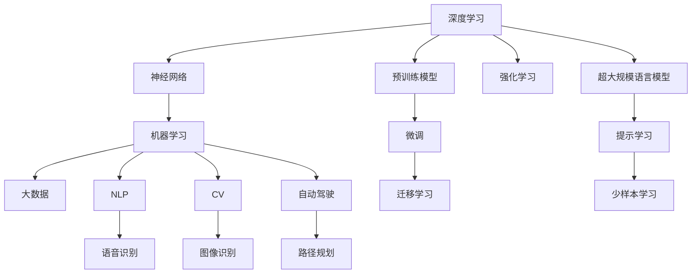

                 

# 新一代人工智能的技术趋势与应用场景

> 关键词：新一代人工智能,深度学习,神经网络,机器学习,大数据,自然语言处理,计算机视觉,自动驾驶

## 1. 背景介绍

随着科技的迅猛发展，人工智能(AI)正逐渐渗透到各行各业，重塑我们的生活方式和产业结构。在过去的十年间，基于深度学习的AI技术取得了令人瞩目的突破，不断刷新着算法效率和应用领域的边界。然而，随着大规模数据、高性能计算和强大算法的结合，新一代人工智能技术正逐步迈向更高的成熟度，从具体应用向通用智能迈进。本文将深入探讨新一代人工智能的技术趋势及其在不同领域的应用场景，为科技从业者提供全面、系统的理解。

## 2. 核心概念与联系

### 2.1 核心概念概述

新一代人工智能技术主要包括深度学习、神经网络、机器学习、大数据、自然语言处理(NLP)、计算机视觉(CV)、自动驾驶等关键领域。这些技术相互交织，共同构成了一个庞大且复杂的技术生态系统。理解这些核心概念及其相互关系，是掌握新一代人工智能的关键。

- **深度学习(Deep Learning)**：基于神经网络的机器学习技术，通过多层次的非线性变换，从数据中提取高层次的特征表示。
- **神经网络(Neural Network)**：模拟人脑神经元相互连接的结构，通过学习调整网络权重和偏置，实现复杂的模式识别和预测。
- **机器学习(Machine Learning)**：通过数据驱动的方式，使机器能够自动学习并优化模型，用于分类、回归、聚类等任务。
- **大数据(Big Data)**：指海量规模的数据，通过分布式计算和大数据技术进行高效存储、分析和处理。
- **自然语言处理(NLP)**：使机器能够理解、处理和生成人类语言的技术，涵盖词法分析、句法分析、语义分析等。
- **计算机视觉(CV)**：使计算机能够识别、分析和理解视觉信息的技术，包括图像分类、目标检测、图像生成等。
- **自动驾驶(Autonomous Driving)**：利用AI技术实现汽车自主导航和决策，提高交通安全和效率。

### 2.2 核心概念原理和架构的 Mermaid 流程图



这个流程图展示了深度学习、神经网络等关键技术是如何交织在一起，共同推动AI技术的发展。从数据预处理、模型训练到模型应用，每一步都依赖于前一步的成果，形成了完整的技术链条。

## 3. 核心算法原理 & 具体操作步骤

### 3.1 算法原理概述

新一代人工智能技术的核心在于深度学习模型的构建和训练。这些模型通过大数据训练，能够自动学习到数据的复杂结构，进而进行高精度的预测和决策。

具体而言，深度学习模型通常包括输入层、多个隐藏层和输出层。每一层都通过激活函数进行非线性变换，从而提取数据的高级特征表示。通过反向传播算法，模型可以自动调整权重和偏置，最小化损失函数，以优化预测结果。

### 3.2 算法步骤详解

新一代人工智能技术的实现步骤通常包括以下几个关键环节：

**Step 1: 数据预处理**
- 收集和整理大数据，清洗和标注数据集，以备模型训练使用。
- 对数据进行归一化、分词、编码等预处理，确保数据的一致性和可用性。

**Step 2: 模型构建**
- 选择合适的深度学习框架，如TensorFlow、PyTorch等，定义模型的结构。
- 设计神经网络的层数、节点数、激活函数等参数，以适配具体任务。

**Step 3: 模型训练**
- 使用随机梯度下降(SGD)、Adam等优化算法，最小化损失函数，优化模型参数。
- 调整学习率、批次大小等超参数，控制训练过程的稳定性和效率。

**Step 4: 模型评估**
- 在验证集上评估模型性能，如准确率、召回率、F1分数等指标。
- 使用混淆矩阵、ROC曲线等工具，分析模型的优劣。

**Step 5: 模型部署**
- 将训练好的模型导出为标准格式，如TensorFlow SavedModel、PyTorch模型文件等。
- 集成到实际应用系统，提供API接口供用户调用。

### 3.3 算法优缺点

新一代人工智能技术的优点包括：

- **精度高**：深度学习模型能够自动学习到数据的复杂结构，准确率远超传统机器学习方法。
- **泛化能力强**：模型能够从大数据中提取到高层次特征，适用于多种不同的任务。
- **自动化程度高**：通过自动学习调整模型参数，减少了人工干预，提升了效率。

然而，这些技术也存在一些局限性：

- **计算资源消耗大**：深度学习模型通常需要高性能的GPU/TPU等硬件支持，对计算资源需求较高。
- **训练时间长**：大数据和复杂模型的训练往往需要耗费大量时间。
- **模型复杂度高**：深度学习模型的复杂结构可能导致过拟合问题，影响模型的泛化能力。

### 3.4 算法应用领域

新一代人工智能技术已经在多个领域得到了广泛应用，包括但不限于：

- **金融科技**：利用机器学习和大数据进行风险评估、信用评分、欺诈检测等。
- **医疗健康**：通过自然语言处理和计算机视觉技术，实现疾病诊断、医学影像分析、智能问诊等。
- **智能制造**：利用机器学习和计算机视觉进行质量检测、缺陷分析、生产调度等。
- **自动驾驶**：结合计算机视觉和强化学习，实现汽车自主导航、环境感知等。
- **教育科技**：通过自然语言处理和机器学习，实现智能推荐、自动评分、情感分析等。
- **零售电商**：利用机器学习和计算机视觉进行个性化推荐、库存管理、客户分析等。

## 4. 数学模型和公式 & 详细讲解 & 举例说明

### 4.1 数学模型构建

以神经网络为例，其数学模型可以表示为：

$$ y = \sigma(Wx + b) $$

其中 $y$ 为输出，$x$ 为输入，$W$ 为权重矩阵，$b$ 为偏置项，$\sigma$ 为激活函数。

### 4.2 公式推导过程

以全连接神经网络为例，其前向传播和反向传播过程可以表示为：

- **前向传播**：

$$ z^{[l]} = \sigma^{[l]}(W^{[l]}x^{[l-1]} + b^{[l]}) $$
$$ a^{[l]} = \sigma(z^{[l]}) $$
$$ z^{[L]} = \sigma^{[L]}(W^{[L]}x^{[L-1]} + b^{[L]}) $$
$$ \hat{y} = \sigma(z^{[L]}) $$

- **反向传播**：

$$ \frac{\partial L}{\partial z^{[L]}} = \frac{\partial L}{\partial y} \frac{\partial y}{\partial z^{[L]}} $$
$$ \frac{\partial L}{\partial z^{[l]}} = \frac{\partial L}{\partial a^{[l+1]}} \frac{\partial a^{[l+1]}}{\partial z^{[l]}} $$
$$ \frac{\partial L}{\partial W^{[l]}} = \frac{\partial L}{\partial z^{[l]}} \frac{\partial z^{[l]}}{\partial a^{[l-1]}} \frac{\partial a^{[l-1]}}{\partial W^{[l]}} $$
$$ \frac{\partial L}{\partial b^{[l]}} = \frac{\partial L}{\partial z^{[l]}} $$

其中 $L$ 为损失函数，$a$ 为激活值，$z$ 为线性变换后的结果。

### 4.3 案例分析与讲解

以图像分类为例，通过卷积神经网络(CNN)模型实现：

- **输入**：将图像转换为向量表示 $x$。
- **网络结构**：包括多个卷积层、池化层、全连接层等。
- **输出**：将向量表示 $x$ 通过网络变换，输出类别概率分布 $y$。
- **损失函数**：使用交叉熵损失，评估模型预测结果与真实标签的差异。

## 5. 项目实践：代码实例和详细解释说明

### 5.1 开发环境搭建

在Python环境下，可以使用TensorFlow或PyTorch等深度学习框架进行模型训练和推理。

- **安装Python**：建议使用Anaconda或Miniconda，方便管理和更新。
- **安装TensorFlow或PyTorch**：根据具体需求选择对应的版本和安装方式。
- **配置GPU/TPU**：安装对应的驱动程序和计算库，配置好环境变量。

### 5.2 源代码详细实现

以TensorFlow为例，实现一个简单的图像分类模型：

```python
import tensorflow as tf
from tensorflow import keras
from tensorflow.keras import layers

# 定义模型结构
model = keras.Sequential([
    layers.Conv2D(32, (3, 3), activation='relu', input_shape=(28, 28, 1)),
    layers.MaxPooling2D((2, 2)),
    layers.Flatten(),
    layers.Dense(10, activation='softmax')
])

# 编译模型
model.compile(optimizer='adam',
              loss='sparse_categorical_crossentropy',
              metrics=['accuracy'])

# 训练模型
model.fit(train_images, train_labels, epochs=10, validation_data=(test_images, test_labels))

# 评估模型
test_loss, test_acc = model.evaluate(test_images, test_labels)
print('Test accuracy:', test_acc)
```

### 5.3 代码解读与分析

- **模型结构**：使用卷积层、池化层和全连接层构建CNN模型。
- **编译模型**：指定优化器、损失函数和评价指标。
- **训练模型**：使用训练集数据进行多轮迭代训练，验证集用于评估模型性能。
- **评估模型**：在测试集上评估模型性能，输出准确率等指标。

## 6. 实际应用场景

### 6.1 医疗影像分析

在医疗领域，计算机视觉技术可以用于影像诊断和分析，帮助医生更准确地识别疾病和病变。

- **影像分割**：将医学影像分割成不同的组织和器官，提高诊断准确率。
- **疾病识别**：识别和分类不同类型的病变和疾病，如肿瘤、心血管疾病等。
- **手术辅助**：通过图像增强和分析技术，辅助医生进行手术规划和操作。

### 6.2 智能推荐系统

在电商和娱乐领域，机器学习和大数据技术可以用于个性化推荐，提升用户体验和业务收入。

- **用户画像**：通过分析用户的历史行为数据，构建用户画像，理解用户兴趣。
- **商品推荐**：根据用户画像和历史数据，推荐相关商品或内容。
- **动态调整**：根据用户反馈和实时数据，动态调整推荐策略，提高推荐效果。

### 6.3 智能交通

在智能交通领域，计算机视觉和自然语言处理技术可以用于交通管理和智能驾驶。

- **交通监控**：通过摄像头和传感器采集交通数据，进行实时分析和预测。
- **智能导航**：结合地图数据和实时交通信息，提供智能导航和路径规划。
- **无人驾驶**：通过计算机视觉和传感器数据，实现自动驾驶和环境感知。

### 6.4 未来应用展望

展望未来，新一代人工智能技术将进一步拓展应用领域，带来更多的创新和突破。

- **通用智能**：构建更加强大的通用智能系统，能够跨领域学习和应用，解决更多复杂问题。
- **边缘计算**：将AI模型部署到边缘设备，实现实时推理和决策，降低延迟和带宽需求。
- **联邦学习**：通过分布式训练和联邦算法，保护数据隐私和安全，同时提升模型性能。
- **人机协同**：利用AI技术提升人机交互体验，实现更高效、自然的互动。
- **跨模态融合**：结合视觉、语音、文本等多种模态信息，实现更全面和精准的信息理解和处理。

## 7. 工具和资源推荐

### 7.1 学习资源推荐

- **深度学习教程**：斯坦福大学《CS231n：卷积神经网络》和《CS224n：自然语言处理与深度学习》。
- **在线课程**：Coursera上的《Machine Learning by Andrew Ng》、edX上的《Deep Learning Specialization》。
- **开源项目**：TensorFlow官方文档、PyTorch官方教程、Keras官方文档。

### 7.2 开发工具推荐

- **深度学习框架**：TensorFlow、PyTorch、Keras。
- **可视化工具**：TensorBoard、Weights & Biases。
- **数据处理工具**：Pandas、NumPy、Scikit-learn。

### 7.3 相关论文推荐

- **深度学习**：《ImageNet Classification with Deep Convolutional Neural Networks》。
- **计算机视觉**：《Faster R-CNN: Towards Real-Time Object Detection with Region Proposal Networks》。
- **自然语言处理**：《Attention is All You Need》。
- **自动驾驶**：《End to End Learning for Self-Driving Cars》。

## 8. 总结：未来发展趋势与挑战

### 8.1 研究成果总结

新一代人工智能技术已经在多个领域取得了显著突破，推动了各行业的智能化转型。其核心在于深度学习模型的构建和训练，通过大规模数据和复杂算法，实现了高精度的预测和决策。

### 8.2 未来发展趋势

未来，新一代人工智能技术将继续深化和拓展，带来更多的创新和突破：

- **模型规模更大**：随着算力提升和数据量增加，模型规模将不断扩大，推动AI技术的进一步进步。
- **应用场景更广**：AI技术将渗透到更多行业和领域，带来更广泛的应用和价值。
- **智能化水平更高**：通过跨领域学习和知识整合，构建更加通用和智能的系统。
- **实时性更强**：通过边缘计算和联邦学习，实现实时推理和决策，提升用户体验和系统效率。

### 8.3 面临的挑战

尽管取得了显著进展，新一代人工智能技术仍面临诸多挑战：

- **计算资源瓶颈**：大规模模型的训练和推理需要高性能硬件支持。
- **数据隐私和安全**：数据隐私保护和模型安全成为重要挑战。
- **模型可解释性**：复杂模型的决策过程难以解释，缺乏透明性。
- **跨模态融合**：多模态信息的整合和融合仍需进一步探索。

### 8.4 研究展望

未来，需要在以下几个方面进行深入研究：

- **资源优化**：开发更高效的计算模型和资源管理技术，提升计算效率和资源利用率。
- **模型可解释性**：构建可解释和透明的AI模型，增强用户信任和接受度。
- **跨模态融合**：研究如何更好地融合视觉、语音、文本等多种模态信息，提升AI系统的智能水平。
- **伦理和社会影响**：关注AI技术的伦理和社会影响，确保技术应用符合人类价值观和道德规范。

## 9. 附录：常见问题与解答

**Q1: 如何选择合适的深度学习框架？**

A: 根据项目需求选择合适的深度学习框架，通常情况下PyTorch和TensorFlow是比较常用的框架。

**Q2: 如何处理模型过拟合问题？**

A: 可以通过增加数据量、数据增强、正则化等方法缓解过拟合问题。

**Q3: 深度学习模型的训练时间和计算资源如何优化？**

A: 使用GPU/TPU等高性能设备进行加速，使用分布式训练和模型压缩技术优化资源消耗。

**Q4: 如何评估模型性能？**

A: 使用准确率、召回率、F1分数等指标，结合混淆矩阵和ROC曲线等工具，综合评估模型性能。

---

作者：禅与计算机程序设计艺术 / Zen and the Art of Computer Programming

