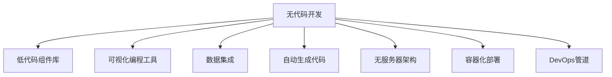

                 

# 无代码开发创业：降低技术门槛的利器

## 1. 背景介绍

### 1.1 问题由来
随着互联网的快速发展，越来越多的企业开始重视数字化转型。然而，数字化转型的过程往往伴随着技术门槛高、开发周期长、团队协作难等挑战。企业需要投入大量的时间和资金，才可能获得适合自己的数字化解决方案。这就大大降低了数字化转型的效率和效果。

为了应对这一问题，无代码开发工具应运而生。无代码开发平台不需要编程知识，而是通过拖拽模块、设计器等方式，帮助非技术人员也能轻松构建和管理应用程序。这种降低技术门槛的方式，为创业者和企业提供了极大的便利。

### 1.2 问题核心关键点
无代码开发的核心关键点在于：通过视觉化的开发界面，允许没有编程背景的用户也能创建复杂的应用程序。这种平台通常包含强大的低代码组件库、可视化编程工具、数据集成功能、自动生成代码等功能，简化了软件开发过程，降低了开发成本，提高了开发效率。

## 2. 核心概念与联系

### 2.1 核心概念概述

为更好地理解无代码开发的原理，本节将介绍几个关键概念：

- 无代码开发(No-Code Development)：一种无需编写代码即可快速开发应用程序的技术手段。无代码开发平台提供强大的低代码组件库，让用户通过拖拽、设计等方式实现软件开发。

- 低代码开发(Low-Code Development)：指通过少量或无需编程的方式，完成复杂应用开发的过程。低代码开发和无代码开发相似，但通常需要一定的编程基础。

- 无服务器架构(Serverless Architecture)：指应用程序的运行不依赖于具体的服务器，而是由云服务提供商按需分配资源，应用上线和运行完全自动化。无代码开发通常采用无服务器架构，大幅降低了IT基础设施的复杂度。

- 容器化(Docker/ Kubernetes)：一种打包、部署和运行应用程序的方式，通过容器化技术，将应用程序及其依赖打包到一个独立运行的环境中。容器化技术可以提高应用的可移植性和运行效率，支持无代码平台的高效运行。

- DevOps：一种持续集成、持续交付的开发运维模式，通过自动化测试、部署、监控等流程，提高软件的交付速度和稳定性。无代码开发平台通常支持DevOps实践，帮助用户快速迭代和部署应用。

这些概念之间的联系可以通过以下Mermaid流程图来展示：



这个流程图展示了无代码开发的关键组件及其联系：

1. 无代码开发平台提供丰富的低代码组件库。
2. 用户通过拖拽、设计等方式进行可视化编程。
3. 平台支持数据集成功能，轻松连接各种数据源。
4. 平台自动生成代码，简化开发流程。
5. 采用无服务器架构和容器化技术，提升应用可移植性和运行效率。
6. DevOps支持快速迭代和部署，提高交付速度。

这些概念共同构成了无代码开发的核心技术框架，使得企业能够快速构建和部署应用，实现数字化转型。

## 3. 核心算法原理 & 具体操作步骤
### 3.1 算法原理概述

无代码开发的原理主要基于以下几个核心算法：

1. 组件管理算法：无代码开发平台通过组件管理算法，提供强大的低代码组件库，用户可以根据需求自由选择和组合。

2. 可视化编程算法：无代码开发平台采用可视化编程算法，让用户通过拖拽、设计等方式进行编程。这些可视化组件可以被转换成实际代码，并自动部署到服务器上。

3. 数据集成算法：无代码开发平台通过数据集成算法，连接各种数据源，实现数据的自动化导入和导出。

4. 自动生成代码算法：无代码开发平台利用自动生成代码算法，根据用户的设计，自动生成实际可执行的代码，简化开发流程。

5. 容器化部署算法：无代码开发平台采用容器化部署算法，将应用程序和依赖打包到容器中，简化部署过程。

6. DevOps管道算法：无代码开发平台通过DevOps管道算法，实现自动化测试、部署和监控，提高应用的稳定性和交付速度。

这些算法共同构建了无代码开发的技术框架，使得用户无需编写代码，也能构建和部署复杂的应用程序。

### 3.2 算法步骤详解

无代码开发平台的具体开发步骤包括：

**Step 1: 准备开发环境**
- 安装无代码开发平台提供的开发工具和插件。
- 连接所需的数据源，配置开发环境。

**Step 2: 设计应用架构**
- 根据业务需求，选择合适的低代码组件，设计应用架构。
- 利用可视化编程工具，构建应用界面。

**Step 3: 编写应用代码**
- 在无代码开发平台上，根据设计好的应用架构，编写代码。
- 利用自动生成代码算法，生成实际可执行的代码。

**Step 4: 数据集成与导出**
- 连接数据源，导入数据。
- 根据业务需求，导出数据，并进行处理和分析。

**Step 5: 测试与部署**
- 利用无代码开发平台的自动化测试工具，进行功能测试和性能测试。
- 利用容器化部署算法，将应用部署到云端服务器或容器环境中。

**Step 6: 运维与迭代**
- 利用DevOps管道算法，进行持续集成和持续交付。
- 根据用户反馈，不断迭代和优化应用。

以上是无代码开发的一般流程。在实际应用中，还需要根据具体需求进行优化和调整。

### 3.3 算法优缺点

无代码开发平台具有以下优点：

1. 降低技术门槛：无需编程基础，用户即可轻松构建复杂应用程序。
2. 提高开发效率：可视化编程工具和自动生成代码算法，大幅提升开发速度。
3. 简化运维过程：采用无服务器架构和容器化部署，降低运维复杂度。
4. 加速交付速度：DevOps管道支持快速迭代和部署，提升交付效率。
5. 灵活可定制：强大的低代码组件库，满足各种业务需求。

同时，无代码开发也存在一些缺点：

1. 依赖平台：无代码开发平台的限制较多，不能完全满足所有业务需求。
2. 安全性问题：无代码开发平台可能存在安全隐患，如数据泄露、代码注入等。
3. 性能问题：无代码开发平台性能可能不如传统编程方式，无法满足高性能需求。
4. 学习曲线：对于部分高级特性，用户仍需一定学习曲线。

## 4. 数学模型和公式 & 详细讲解 & 举例说明
### 4.1 数学模型构建

无代码开发平台的核心数学模型通常包括：

- 组件库的设计与分类算法：将组件按功能、数据类型等进行分类，方便用户查找和使用。
- 可视化编程语言的定义算法：定义可视化编程语言中的指令和语法，生成实际代码。
- 数据集成与转换算法：设计数据集成与转换算法，实现数据源的自动化连接与转换。
- 容器化部署与优化算法：设计容器化部署与优化算法，将应用程序和依赖打包到容器中，优化资源使用。
- DevOps管道的定义与自动化算法：定义DevOps管道的各个环节，自动化测试、部署、监控等过程。

### 4.2 公式推导过程

无代码开发的核心算法公式推导过程如下：

1. 组件库设计算法：
   - 将组件按功能、数据类型等分类：
     - $C = \{C_1, C_2, \dots, C_n\}$
     - 每个类别包含的组件：
       - $C_i = \{c_{i1}, c_{i2}, \dots, c_{im}\}$
   - 设计组件库的查询算法：
     - $Q(C_i, D) = \{c_{ij}|c_{ij} \in C_i, d_j \in D\}$
     - 根据用户需求，返回查询结果：
       - $Q(C_i, D) = Q_i$

2. 可视化编程语言定义算法：
   - 定义可视化编程语言的指令和语法：
     - $L = \{l_1, l_2, \dots, l_n\}$
     - 定义指令的执行逻辑：
       - $E(l_i, C) = \{c_j|c_j \in C, c_j \in Q(L, C)\}$
   - 生成实际代码算法：
     - $G(L, C) = C_j$

3. 数据集成算法：
   - 定义数据源的连接算法：
     - $D(S) = \{s_1, s_2, \dots, s_m\}$
   - 设计数据转换算法：
     - $T(D, S) = \{s_j|s_j \in D, s_j \in S\}$
   - 自动化数据集成算法：
     - $A(D, S) = \{s_j|s_j \in T(D, S)\}$

4. 容器化部署与优化算法：
   - 定义容器化部署算法：
     - $D(C) = \{c_1, c_2, \dots, c_n\}$
   - 优化容器资源使用算法：
     - $O(D) = \{c_j|c_j \in D, c_j \in O(D)\}$
   - 容器化部署算法：
     - $P(D, C) = C_j$

5. DevOps管道定义与自动化算法：
   - 定义DevOps管道各个环节：
     - $M = \{m_1, m_2, \dots, m_k\}$
   - 自动化测试算法：
     - $T(M, D) = \{t_j|t_j \in M, t_j \in D\}$
   - 自动化部署算法：
     - $P(M, D) = \{p_j|p_j \in M, p_j \in D\}$
   - 自动化监控算法：
     - $M(M, D) = \{m_j|m_j \in M, m_j \in D\}$

### 4.3 案例分析与讲解

以下以一个无代码开发平台为例，详细讲解其核心算法和实现过程：

**案例：开发一个企业级客户管理系统**

1. **组件库设计**
   - 组件库分类：功能组件、数据组件、表单组件等。
   - 组件设计：如表单组件、数据组件、用户管理模块等。
   - 组件查询算法：用户根据需求选择组件，进行组合和连接。

2. **可视化编程**
   - 定义可视化编程语言：拖拽、拼接、配置等。
   - 设计模块化编程算法：将可视化编程转化为实际代码。
   - 模块化代码生成：将可视化编程语言生成的代码，自动转换成实际代码。

3. **数据集成**
   - 数据源连接：连接企业内部和外部的数据源。
   - 数据转换：将不同格式的数据转换为统一的格式。
   - 数据自动化集成：将数据自动集成到系统中。

4. **容器化部署**
   - 定义容器化部署算法：将应用程序和依赖打包到容器中。
   - 容器优化：根据资源需求，自动分配和优化容器资源。
   - 容器部署：将应用程序和容器部署到云端服务器。

5. **DevOps管道**
   - 定义DevOps管道：自动化测试、部署、监控等环节。
   - 自动化测试：编写自动化测试用例，进行功能测试和性能测试。
   - 自动化部署：将应用程序部署到云端服务器。
   - 自动化监控：实时监控系统性能和稳定性，发现问题并及时处理。

以上案例展示了无代码开发平台的核心算法和实现过程，帮助用户理解无代码开发的原理和应用场景。

## 5. 项目实践：代码实例和详细解释说明
### 5.1 开发环境搭建

在进行无代码开发项目实践前，我们需要准备好开发环境。以下是使用无代码开发平台进行实践的开发环境配置流程：

1. 安装无代码开发平台：从官网下载安装无代码开发平台，并注册账号。
2. 连接所需的数据源：连接企业内部的数据库、文件系统、API等数据源，配置开发环境。
3. 配置开发工具：安装开发平台提供的开发工具和插件，如可视化编程工具、数据管理工具等。

完成上述步骤后，即可在无代码开发平台上进行项目实践。

### 5.2 源代码详细实现

这里我们以开发一个简单的企业级客户管理系统为例，详细讲解无代码开发平台的使用。

**Step 1: 准备数据源**
- 连接企业内部的客户数据库，配置数据源。
- 配置数据管理工具，管理数据操作和存储。

**Step 2: 设计应用架构**
- 选择功能组件、数据组件、表单组件等。
- 设计应用界面和功能模块，如客户列表、客户信息管理等。

**Step 3: 编写应用代码**
- 利用可视化编程工具，编写应用代码。
- 利用自动生成代码算法，生成实际可执行的代码。

**Step 4: 数据集成与导出**
- 连接数据源，导入数据。
- 根据业务需求，导出数据，并进行处理和分析。

**Step 5: 测试与部署**
- 利用无代码开发平台的自动化测试工具，进行功能测试和性能测试。
- 利用容器化部署算法，将应用部署到云端服务器或容器环境中。

**Step 6: 运维与迭代**
- 利用DevOps管道算法，进行持续集成和持续交付。
- 根据用户反馈，不断迭代和优化应用。

以上是使用无代码开发平台进行项目实践的完整流程。开发者可以根据实际需求，自由组合和调整各个环节，实现高效开发。

### 5.3 代码解读与分析

让我们再详细解读一下关键代码的实现细节：

**案例代码：开发客户管理系统**

```python
# 导入所需的无代码开发平台组件
from no_code_platform import Form, Database, Table, Column, InputField

# 创建数据库连接
db = Database()

# 创建客户表
table = Table(name='customer', columns=[
    Column(name='id', type='int', primary_key=True),
    Column(name='name', type='string'),
    Column(name='email', type='string'),
    Column(name='phone', type='string'),
])

# 创建客户表单
form = Form([
    InputField(name='name', type='text'),
    InputField(name='email', type='text'),
    InputField(name='phone', type='text'),
])

# 将表单与数据库关联
form.db = db
form.table = table

# 提交表单数据到数据库
def save_customer(form_data):
    customer = table.insert(form_data)
    return customer

# 查询客户信息
def get_customer(id):
    customer = table.select(id)
    return customer

# 更新客户信息
def update_customer(id, form_data):
    customer = table.update(id, form_data)
    return customer

# 删除客户信息
def delete_customer(id):
    customer = table.delete(id)
    return customer
```

以上代码展示了如何使用无代码开发平台进行项目实践。开发者可以根据实际需求，自由组合和调整各个组件和函数，实现高效开发。

## 6. 实际应用场景
### 6.1 企业内部管理
无代码开发平台可以在企业内部管理中发挥重要作用，如：

1. **人力资源管理**
   - 无代码开发平台可帮助企业快速构建人力资源管理系统，实现员工信息管理、考勤管理、绩效管理等。
   - 平台支持数据集成，自动连接企业内部的人力资源系统，实现数据统一管理。

2. **客户关系管理**
   - 无代码开发平台可帮助企业构建客户管理系统，实现客户信息管理、销售管理、客户服务管理等。
   - 平台支持可视化编程，快速构建复杂的应用功能，满足企业多样化的业务需求。

3. **项目管理**
   - 无代码开发平台可帮助企业构建项目管理平台，实现项目任务管理、进度管理、资源管理等。
   - 平台支持自动化部署和DevOps管道，确保项目的按时交付和稳定运行。

### 6.2 外部业务应用
无代码开发平台也可用于外部业务应用，如：

1. **电商平台**
   - 无代码开发平台可帮助电商平台快速构建在线商店、订单管理、物流管理等功能。
   - 平台支持数据集成和API接口，方便与第三方支付、物流平台等系统对接。

2. **社交媒体管理**
   - 无代码开发平台可帮助社交媒体平台快速构建用户管理、内容管理、广告管理等功能。
   - 平台支持可视化编程和数据集成，帮助社交媒体平台提升用户体验和运营效率。

3. **企业级应用**
   - 无代码开发平台可帮助企业快速构建企业级应用，如ERP、CRM、BI等。
   - 平台支持可视化编程和数据集成，帮助企业实现数字化转型。

### 6.3 未来应用展望
无代码开发平台在未来的应用场景将更加广阔，具体包括以下几个方向：

1. **IoT设备管理**
   - 无代码开发平台可帮助物联网企业快速构建设备管理系统，实现设备监控、维护、数据管理等功能。
   - 平台支持数据集成和API接口，方便与物联网设备对接。

2. **智能制造**
   - 无代码开发平台可帮助制造企业快速构建智能制造系统，实现生产监控、质量管理、设备管理等功能。
   - 平台支持可视化编程和数据集成，帮助企业实现智能化生产。

3. **智慧医疗**
   - 无代码开发平台可帮助医疗企业快速构建智慧医疗系统，实现患者管理、诊疗管理、数据管理等功能。
   - 平台支持可视化编程和数据集成，帮助医疗企业提升服务质量和运营效率。

## 7. 工具和资源推荐
### 7.1 学习资源推荐

为了帮助开发者系统掌握无代码开发的理论基础和实践技巧，这里推荐一些优质的学习资源：

1. 《无代码开发实战》系列博文：由无代码开发专家撰写，深入浅出地介绍了无代码开发原理、工具、应用等前沿话题。

2. 《无代码开发原理与实践》课程：由知名大学开设的课程，系统讲解了无代码开发的原理和实践，适合初学者和进阶者。

3. 《无代码开发工具指南》书籍：全面介绍了无代码开发平台的各项功能和应用，帮助开发者快速上手。

4. GitHub上的无代码开发项目：GitHub上大量开源的无代码开发项目，提供了丰富的实践案例和代码示例，适合开发者学习参考。

5. 无代码开发社区：加入无代码开发社区，与其他开发者交流学习，获取最新技术动态和最佳实践。

通过对这些资源的学习实践，相信你一定能够快速掌握无代码开发的精髓，并用于解决实际的业务问题。

### 7.2 开发工具推荐

高效的开发离不开优秀的工具支持。以下是几款用于无代码开发工具的推荐：

1. Microsoft Power Apps：微软推出的无代码开发平台，支持构建企业级应用程序，提供强大的低代码组件库和可视化编程工具。

2. Salesforce Lightning：Salesforce推出的无代码开发平台，支持构建企业级应用程序，提供强大的数据集成和自动化功能。

3. OutSystems：OutSystems推出的无代码开发平台，支持构建企业级应用程序，提供强大的低代码组件库和可视化编程工具。

4. AppSheet：AppSheet推出的无代码开发平台，支持构建移动端应用程序，提供强大的数据集成和自动化功能。

5. Zoho Creator：Zoho Creator推出的无代码开发平台，支持构建企业级应用程序，提供强大的低代码组件库和可视化编程工具。

合理利用这些工具，可以显著提升无代码开发的效率和效果，加快创新迭代的步伐。

### 7.3 相关论文推荐

无代码开发技术的发展源于学界的持续研究。以下是几篇奠基性的相关论文，推荐阅读：

1. "From Code to No Code: A Survey of No Code Development Technologies"：一篇综述论文，详细介绍了无代码开发技术的发展历程和应用场景。

2. "No Code and Low Code Development: A Survey"：一篇综述论文，详细介绍了无代码和低代码开发技术的原理、应用和挑战。

3. "Building Applications with No Code: A Survey"：一篇综述论文，详细介绍了无代码开发平台和工具的技术架构和应用场景。

4. "No Code Development Platforms: A Survey"：一篇综述论文，详细介绍了无代码开发平台的技术特点、功能和应用场景。

这些论文代表了大数据、人工智能、区块链、大数据开发等领域的研究进展，可以帮助研究者把握学科前进方向，激发更多的创新灵感。

## 8. 总结：未来发展趋势与挑战
### 8.1 研究成果总结

本文对无代码开发技术的核心概念、原理和应用进行了全面系统的介绍。通过无代码开发平台，用户无需编程知识，即可构建和管理应用程序，极大地降低了技术门槛。无代码开发平台通过组件库、可视化编程、数据集成、自动生成代码等功能，简化了软件开发流程，提高了开发效率。

### 8.2 未来发展趋势

展望未来，无代码开发技术将呈现以下几个发展趋势：

1. 无代码平台功能更加丰富：无代码平台将支持更多功能模块和组件，满足企业多样化业务需求。
2. 无代码平台应用场景更加广泛：无代码开发技术将应用于更多行业，如IoT、智能制造、智慧医疗等。
3. 无代码平台性能更加优化：无代码平台将优化数据集成和处理算法，提升应用性能和稳定性。
4. 无代码平台安全性更加完善：无代码平台将引入更多安全措施，保障数据和应用的安全。
5. 无代码平台可定制性更强：无代码平台将提供更多可定制功能，满足企业个性化需求。

这些趋势将推动无代码开发技术的发展，为企业数字化转型提供更大的动力。

### 8.3 面临的挑战

尽管无代码开发技术已经取得了显著进展，但在实际应用中也面临诸多挑战：

1. 数据质量问题：无代码平台依赖数据源，数据质量和完整性可能影响应用效果。
2. 安全性问题：无代码平台可能存在安全隐患，如数据泄露、代码注入等。
3. 性能问题：无代码平台性能可能不如传统编程方式，无法满足高性能需求。
4. 用户培训问题：用户需要一定时间熟悉无代码开发平台的使用方式和功能。
5. 系统兼容性问题：无代码平台可能与现有系统不兼容，导致集成困难。

这些挑战需要开发者和用户共同面对，并不断优化和改进无代码开发平台，提高其应用效果和用户体验。

### 8.4 研究展望

面向未来，无代码开发技术需要在以下几个方面进行深入研究：

1. 数据治理：建立数据质量保障机制，提升数据源的质量和完整性。
2. 安全防护：引入更多安全措施，保障数据和应用的安全。
3. 性能优化：优化数据集成和处理算法，提升应用性能和稳定性。
4. 用户培训：提供更好的用户培训和支持，帮助用户快速上手无代码开发平台。
5. 系统兼容性：优化平台架构，提高与现有系统的兼容性。

这些研究方向的探索，将推动无代码开发技术的进一步发展，为数字化转型提供更加可靠和高效的技术支撑。

## 9. 附录：常见问题与解答

**Q1: 无代码开发平台是否可以处理复杂的应用程序？**

A: 无代码开发平台可以处理复杂的应用程序，但其处理能力取决于平台的功能模块和组件库。一些复杂的应用程序需要结合多个组件和模块，进行自定义开发。平台的设计和组件库的丰富程度，直接影响其处理能力。

**Q2: 无代码开发平台是否可以与现有的系统进行集成？**

A: 无代码开发平台通常支持API集成和数据集成，可以与现有的系统进行集成。但具体集成方式和效果，需要根据系统特点和平台功能进行选择和测试。

**Q3: 无代码开发平台是否可以进行深度定制开发？**

A: 无代码开发平台支持一定的自定义开发功能，但需要一定的编程和配置技能。对于深度定制的需求，通常需要在平台基础上进行二次开发，添加新的功能和模块。

**Q4: 无代码开发平台是否可以提高开发效率？**

A: 无代码开发平台可以大幅提高开发效率，通过可视化编程和自动生成代码，减少了编程时间和出错率。但具体效率提升效果，仍需根据具体项目和应用场景进行评估。

**Q5: 无代码开发平台是否支持数据治理？**

A: 无代码开发平台通常支持数据集成和处理功能，但具体数据治理能力，需要根据平台的设计和组件库进行评估。一些平台可能提供数据清洗、数据转换等功能，但数据质量保障需要结合外部工具和措施。

通过对这些问题的解答，相信读者可以更加全面地了解无代码开发技术的核心概念和应用场景。

---

作者：禅与计算机程序设计艺术 / Zen and the Art of Computer Programming

