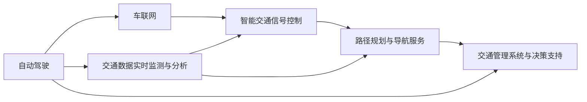

                 

# 智能交通创业：未来城市的移动解决方案

## 1. 背景介绍

### 1.1 问题由来

随着城市化进程的加速和汽车保有量的激增，全球各大城市正面临着前所未有的交通拥堵、环境污染、交通事故等问题。传统交通管理手段已经无法适应复杂的城市交通需求，迫切需要引入智能技术，提升交通系统的运行效率和安全性。

智能交通系统（Intelligent Transportation Systems, ITS）通过集成传感器、通信、计算机等先进技术，可以实现交通状况实时监测、信息集成共享、智能化交通信号控制、路径规划优化等功能。而近年来兴起的智能交通创业，旨在开发更具前瞻性和创新性的智能交通解决方案，为未来城市打造智能移动生态系统。

### 1.2 问题核心关键点

智能交通创业的核心在于将人工智能、物联网、大数据等前沿技术融入城市交通管理，通过数据驱动和智能化决策，构建高效、绿色、安全的智能交通体系。关键技术包括但不限于：

- 自动驾驶与车联网技术：通过车辆间的信息交互和协同控制，提升道路交通安全和运输效率。
- 交通数据实时监测与分析：集成多种传感器，对交通流量、速度、车辆状态等进行实时监测，并进行智能化分析和预测。
- 智能交通信号控制：根据实时交通数据，动态调整交通信号灯的配时方案，优化交通流，减少拥堵。
- 路径规划与导航服务：基于实时交通信息，提供智能化的路径推荐和导航服务，提升用户出行体验。
- 交通管理系统与决策支持：通过大数据分析，为交通管理部门提供决策支持，优化交通政策和应急响应策略。

本文将深入探讨这些关键技术的原理与应用实践，分析智能交通创业面临的挑战与机遇，展望未来发展的趋势与方向。

## 2. 核心概念与联系

### 2.1 核心概念概述

智能交通创业涵盖了多个核心技术概念，以下将逐一介绍：

- **自动驾驶（Autonomous Driving, AD）**：利用计算机视觉、深度学习等技术，使车辆具备无人驾驶能力。自动驾驶能够显著提升道路安全性，减少交通事故，提高运输效率。
- **车联网（Vehicle-to-Everything, V2X）**：通过车辆与基础设施、其他车辆、行人和用户之间的通信，实现信息的实时交换，提升交通系统的协同性和智能性。
- **交通数据实时监测与分析（Traffic Data Real-time Monitoring and Analysis, TDRA）**：集成视频监控、雷达、GPS等传感器，对交通数据进行实时采集和处理，支持交通管理决策。
- **智能交通信号控制（Intelligent Traffic Signal Control, ITSC）**：通过交通数据驱动，实现交通信号灯的动态调整，优化交通流，减少拥堵。
- **路径规划与导航服务（Routing and Navigation Services, RNS）**：基于实时交通信息，为用户提供最佳的路径规划和导航服务，提升出行体验。
- **交通管理系统与决策支持（Traffic Management Systems and Decision Support, TMS & DSS）**：通过大数据分析，为交通管理部门提供决策支持，优化交通政策和应急响应策略。

### 2.2 核心概念原理和架构的 Mermaid 流程图

以下是智能交通创业中各核心技术概念的联系与交互关系，通过 Mermaid 流程图来展示：



该流程图展示了自动驾驶与车联网技术如何通过交通数据实时监测与分析，进一步支撑智能交通信号控制、路径规划与导航服务和交通管理系统与决策支持，共同构建智能交通生态系统。

## 3. 核心算法原理 & 具体操作步骤

### 3.1 算法原理概述

智能交通创业涉及多种核心技术，每种技术背后都有相应的算法原理。以下简要介绍几种关键技术的算法原理：

#### 自动驾驶
自动驾驶算法主要包括传感器数据融合、环境感知、路径规划、决策控制等。其中，环境感知依赖于计算机视觉和深度学习技术，通过摄像头、雷达等传感器获取车辆周围环境信息，并进行场景理解。路径规划和决策控制则基于强化学习和最优控制理论，使车辆在复杂交通环境中做出最优决策。

#### 车联网
车联网技术涉及车辆与基础设施、车辆与车辆、车辆与行人、车辆与用户之间的通信。通信协议和信息交换算法是车联网的核心，通过IEEE 802.11p、LTE V2X等标准协议，实现车辆间的低延迟、高可靠通信。

#### 交通数据实时监测与分析
交通数据实时监测与分析依赖于传感器数据采集、数据处理和分析算法。常用的传感器包括摄像头、雷达、GPS等，通过多源数据融合算法，获取高精度的交通数据。数据分析则通过机器学习和大数据技术，对交通流量、速度、拥堵程度等进行实时预测和评估。

#### 智能交通信号控制
智能交通信号控制算法包括动态配时算法、优化模型和实时控制系统。动态配时算法根据实时交通数据，调整信号灯的配时方案，优化交通流。优化模型通过仿真和实验，优化信号控制参数。实时控制系统则根据优化模型，实现信号灯的动态调整。

#### 路径规划与导航服务
路径规划与导航服务算法包括路径规划和导航算法。路径规划算法通过Dijkstra、A*等算法，寻找最短路径。导航算法通过实时交通信息，生成导航路线，提供精准的导航服务。

#### 交通管理系统与决策支持
交通管理系统与决策支持算法主要包括数据融合、数据分析和决策支持算法。数据融合算法集成多种数据源，获取全面的交通信息。数据分析算法通过机器学习和大数据技术，对交通状态进行预测和评估。决策支持算法通过优化模型和仿真，为交通管理部门提供决策支持。

### 3.2 算法步骤详解

#### 自动驾驶

1. **传感器数据融合**：
   - 使用传感器数据融合算法，将摄像头、雷达、GPS等传感器获取的数据进行整合，生成高精度的环境感知数据。
   - 常用的数据融合算法包括卡尔曼滤波、粒子滤波等。

2. **环境感知**：
   - 使用计算机视觉和深度学习技术，对环境感知数据进行场景理解。
   - 常用的环境感知算法包括目标检测、语义分割等。

3. **路径规划**：
   - 使用Dijkstra、A*等路径规划算法，寻找最优路径。
   - 考虑交通规则、避障等因素，优化路径规划算法。

4. **决策控制**：
   - 使用强化学习或最优控制算法，在复杂交通环境中做出最优决策。
   - 考虑交通规则、车辆性能、环境因素等因素，优化决策控制算法。

#### 车联网

1. **通信协议选择**：
   - 根据车辆通信需求，选择合适的通信协议，如IEEE 802.11p、LTE V2X等。

2. **信息交换设计**：
   - 设计车辆间的信息交换协议，包括车辆状态、行驶轨迹、避障信息等。
   - 设计车辆与基础设施的信息交换协议，包括交通信号、路标信息等。

3. **数据传输优化**：
   - 使用数据压缩、纠错编码等技术，优化车辆间的数据传输。
   - 使用路由算法，优化数据传输路径，提高通信效率。

#### 交通数据实时监测与分析

1. **传感器数据采集**：
   - 部署摄像头、雷达、GPS等传感器，对交通数据进行实时采集。
   - 使用传感器校准算法，确保传感器数据的质量。

2. **数据处理**：
   - 使用数据清洗算法，去除传感器数据中的噪声和异常值。
   - 使用多源数据融合算法，生成高精度的交通数据。

3. **数据分析**：
   - 使用机器学习算法，对交通流量、速度、拥堵程度等进行实时预测和评估。
   - 使用大数据技术，对交通数据进行存储和分析，生成交通报告和预测模型。

#### 智能交通信号控制

1. **动态配时算法**：
   - 根据实时交通数据，调整信号灯的配时方案，优化交通流。
   - 常用的动态配时算法包括SCOOT、SCOOT-SIM等。

2. **优化模型设计**：
   - 通过仿真和实验，优化信号控制参数，提高信号控制的效果。
   - 使用遗传算法、粒子群算法等优化模型设计。

3. **实时控制系统**：
   - 根据优化模型，实现信号灯的动态调整。
   - 使用实时控制系统，确保信号控制的高效和稳定。

#### 路径规划与导航服务

1. **路径规划**：
   - 使用Dijkstra、A*等算法，寻找最短路径。
   - 考虑交通规则、避障等因素，优化路径规划算法。

2. **导航算法**：
   - 生成导航路线，提供精准的导航服务。
   - 考虑实时交通信息，动态调整导航路线。

#### 交通管理系统与决策支持

1. **数据融合**：
   - 集成多种数据源，获取全面的交通信息。
   - 使用数据融合算法，生成高精度的交通报告。

2. **数据分析**：
   - 使用机器学习算法，对交通状态进行预测和评估。
   - 使用大数据技术，对交通数据进行存储和分析，生成交通报告和预测模型。

3. **决策支持**：
   - 通过优化模型和仿真，为交通管理部门提供决策支持。
   - 考虑交通规则、应急响应等因素，优化决策支持算法。

### 3.3 算法优缺点

智能交通创业中的核心算法各有优缺点，以下简要介绍：

#### 自动驾驶

**优点**：
- 提升道路安全性，减少交通事故。
- 提高运输效率，降低交通拥堵。
- 改善用户体验，提升出行便利性。

**缺点**：
- 对传感器和计算资源要求高，部署成本较高。
- 环境感知和决策控制的复杂性高，技术难度大。
- 需要庞大的数据集进行训练，数据获取成本较高。

#### 车联网

**优点**：
- 提升交通系统的协同性和智能性。
- 减少交通事故，提高道路安全性。
- 优化交通流，减少交通拥堵。

**缺点**：
- 通信协议复杂，标准化难度大。
- 数据传输量较大，网络带宽要求高。
- 需要解决车辆间的信任和安全问题。

#### 交通数据实时监测与分析

**优点**：
- 实现交通状况实时监测，提高管理决策的准确性。
- 支持智能交通信号控制和路径规划。
- 提供交通预测和评估，优化交通管理策略。

**缺点**：
- 传感器部署和数据采集成本较高。
- 数据处理和分析算法复杂，计算资源消耗大。
- 数据隐私和安全问题需要解决。

#### 智能交通信号控制

**优点**：
- 优化交通流，减少交通拥堵。
- 提升道路安全性，减少交通事故。
- 支持动态交通管理，提高应急响应能力。

**缺点**：
- 动态配时算法复杂，优化难度大。
- 实时控制系统的稳定性和可靠性需要保障。
- 需要大量的实验和仿真验证，成本较高。

#### 路径规划与导航服务

**优点**：
- 提供精准的路径规划和导航服务。
- 提升用户体验，优化出行体验。
- 支持智能交通管理，提高交通系统的效率。

**缺点**：
- 路径规划算法复杂，计算资源消耗大。
- 导航服务需要实时更新，系统复杂度较高。
- 需要庞大的地图数据和交通数据支持。

#### 交通管理系统与决策支持

**优点**：
- 支持交通管理决策，优化交通政策和应急响应策略。
- 实现数据驱动的交通管理，提高决策的科学性和准确性。
- 支持实时监控和数据分析，提升交通管理效率。

**缺点**：
- 数据融合和分析算法复杂，计算资源消耗大。
- 决策支持的复杂性高，技术难度大。
- 需要庞大的数据集进行训练，数据获取成本较高。

### 3.4 算法应用领域

智能交通创业涉及多个应用领域，以下简要介绍：

- **城市交通管理**：通过智能交通信号控制、路径规划与导航服务、交通管理系统与决策支持等技术，优化城市交通流，提高交通管理效率。
- **公共交通**：通过自动驾驶和车联网技术，提升公交车的运行效率和安全性，优化公交路线和调度。
- **货运物流**：通过自动驾驶和路径规划算法，优化货物运输路线和调度，提升物流效率和安全性。
- **智能停车**：通过传感器数据实时监测与分析，优化停车场管理和车辆进出效率，减少车辆停滞。
- **智慧高速**：通过车联网和智能交通信号控制技术，提升高速公路的运行效率和安全性，优化收费系统。

## 4. 数学模型和公式 & 详细讲解 & 举例说明

### 4.1 数学模型构建

智能交通创业中涉及的数学模型多种多样，以下简要介绍几种常见模型的构建方法：

#### 自动驾驶

1. **环境感知模型**：
   - 使用计算机视觉和深度学习技术，对环境感知数据进行场景理解。
   - 常用环境感知模型包括卷积神经网络（CNN）、卷积神经网络和长短期记忆网络（CNN+LSTM）等。

2. **路径规划模型**：
   - 使用Dijkstra、A*等路径规划算法，寻找最优路径。
   - 常用路径规划模型包括Dijkstra算法、A*算法、A*启发式搜索算法等。

3. **决策控制模型**：
   - 使用强化学习和最优控制算法，在复杂交通环境中做出最优决策。
   - 常用决策控制模型包括Q-learning、SARSA、POMDP等。

#### 车联网

1. **通信协议模型**：
   - 使用IEEE 802.11p、LTE V2X等通信协议，实现车辆间的通信。
   - 常用通信协议模型包括IEEE 802.11p、LTE V2X、DSRC等。

2. **信息交换模型**：
   - 设计车辆间的信息交换协议，包括车辆状态、行驶轨迹、避障信息等。
   - 常用信息交换模型包括V2V通信协议、V2I通信协议、V2P通信协议等。

#### 交通数据实时监测与分析

1. **传感器数据采集模型**：
   - 使用摄像头、雷达、GPS等传感器，对交通数据进行实时采集。
   - 常用传感器数据采集模型包括摄像头采集模型、雷达采集模型、GPS采集模型等。

2. **数据处理模型**：
   - 使用数据清洗算法，去除传感器数据中的噪声和异常值。
   - 常用数据处理模型包括数据清洗算法、传感器校准算法等。

3. **数据分析模型**：
   - 使用机器学习算法，对交通流量、速度、拥堵程度等进行实时预测和评估。
   - 常用数据分析模型包括回归模型、时间序列模型、神经网络模型等。

#### 智能交通信号控制

1. **动态配时模型**：
   - 根据实时交通数据，调整信号灯的配时方案，优化交通流。
   - 常用动态配时模型包括SCOOT、SCOOT-SIM等。

2. **优化模型设计**：
   - 通过仿真和实验，优化信号控制参数，提高信号控制的效果。
   - 常用优化模型设计包括遗传算法、粒子群算法等。

3. **实时控制系统模型**：
   - 根据优化模型，实现信号灯的动态调整。
   - 常用实时控制系统模型包括PID控制模型、模糊控制模型等。

#### 路径规划与导航服务

1. **路径规划模型**：
   - 使用Dijkstra、A*等算法，寻找最短路径。
   - 常用路径规划模型包括Dijkstra算法、A*算法、A*启发式搜索算法等。

2. **导航算法模型**：
   - 生成导航路线，提供精准的导航服务。
   - 常用导航算法模型包括D*-Lite算法、IDA*算法、RRT算法等。

#### 交通管理系统与决策支持

1. **数据融合模型**：
   - 集成多种数据源，获取全面的交通信息。
   - 常用数据融合模型包括卡尔曼滤波模型、粒子滤波模型等。

2. **数据分析模型**：
   - 使用机器学习算法，对交通状态进行预测和评估。
   - 常用数据分析模型包括回归模型、时间序列模型、神经网络模型等。

3. **决策支持模型**：
   - 通过优化模型和仿真，为交通管理部门提供决策支持。
   - 常用决策支持模型包括优化模型、仿真模型、因果模型等。

### 4.2 公式推导过程

#### 自动驾驶

**环境感知模型的公式推导**：
- 使用CNN模型进行环境感知，其基本公式如下：
$$
H(x) = \sigma(W_{conv} * H(x-1) + b_{conv})
$$
其中，$H(x)$ 表示输入特征图，$W_{conv}$ 和 $b_{conv}$ 表示卷积核和偏置项。

**路径规划模型的公式推导**：
- 使用Dijkstra算法进行路径规划，其基本公式如下：
$$
d(v) = \sum_{(u,v) \in E} c(u,v)
$$
其中，$d(v)$ 表示节点 $v$ 的最短路径长度，$c(u,v)$ 表示边 $(u,v)$ 的权重。

**决策控制模型的公式推导**：
- 使用强化学习模型进行决策控制，其基本公式如下：
$$
Q(s,a) = r + \gamma \max Q(s',a')
$$
其中，$Q(s,a)$ 表示状态-动作对 $(s,a)$ 的Q值，$r$ 表示即时奖励，$\gamma$ 表示折扣因子。

#### 车联网

**通信协议模型的公式推导**：
- 使用IEEE 802.11p协议进行通信，其基本公式如下：
$$
C = B \cdot \log_2 \left(1 + \frac{S}{N}\right)
$$
其中，$C$ 表示通信速率，$B$ 表示带宽，$S$ 表示信号强度，$N$ 表示噪声。

**信息交换模型的公式推导**：
- 设计V2V通信协议，其基本公式如下：
$$
I = \frac{P}{d^2}
$$
其中，$I$ 表示信号强度，$P$ 表示发射功率，$d$ 表示通信距离。

#### 交通数据实时监测与分析

**传感器数据采集模型的公式推导**：
- 使用摄像头采集模型进行数据采集，其基本公式如下：
$$
I_{cam} = \int I_{env} \cdot T_{cam} \cdot A_{cam} \cdot \eta_{cam}
$$
其中，$I_{cam}$ 表示摄像头采集的图像信号，$I_{env}$ 表示环境光强度，$T_{cam}$ 表示摄像头时间常数，$A_{cam}$ 表示摄像头有效面积，$\eta_{cam}$ 表示摄像头量子效率。

**数据处理模型的公式推导**：
- 使用数据清洗算法进行数据处理，其基本公式如下：
$$
\tilde{D} = \phi(D)
$$
其中，$\tilde{D}$ 表示清洗后的数据，$D$ 表示原始数据，$\phi$ 表示数据清洗函数。

**数据分析模型的公式推导**：
- 使用回归模型进行数据分析，其基本公式如下：
$$
y = \beta_0 + \beta_1 x_1 + \ldots + \beta_n x_n + \epsilon
$$
其中，$y$ 表示目标变量，$x_1,\ldots,x_n$ 表示自变量，$\beta_0,\ldots,\beta_n$ 表示回归系数，$\epsilon$ 表示误差项。

#### 智能交通信号控制

**动态配时模型的公式推导**：
- 使用SCOOT算法进行动态配时，其基本公式如下：
$$
\Delta t = T + \sum_i \Delta t_i
$$
其中，$\Delta t$ 表示信号灯周期，$T$ 表示周期长度，$\Delta t_i$ 表示各相位配时。

**优化模型设计的公式推导**：
- 使用遗传算法进行优化模型设计，其基本公式如下：
$$
\min f(x) \quad s.t. \; g_i(x) \leq 0, \; h_i(x) = 0
$$
其中，$f(x)$ 表示优化目标函数，$g_i(x)$ 表示约束条件，$h_i(x)$ 表示等式约束。

**实时控制系统模型的公式推导**：
- 使用PID控制模型进行实时控制，其基本公式如下：
$$
u = K_p e + K_i \int_0^t e \; dt + K_d \frac{de}{dt}
$$
其中，$u$ 表示控制信号，$e$ 表示误差，$K_p$ 表示比例系数，$K_i$ 表示积分系数，$K_d$ 表示微分系数。

#### 路径规划与导航服务

**路径规划模型的公式推导**：
- 使用Dijkstra算法进行路径规划，其基本公式如下：
$$
D(v) = \min_{u \in V} \{w(u,v) + D(u)\}
$$
其中，$D(v)$ 表示节点 $v$ 的最短路径长度，$w(u,v)$ 表示边 $(u,v)$ 的权重。

**导航算法模型的公式推导**：
- 使用D*-Lite算法进行导航，其基本公式如下：
$$
\delta(v) = \max_{(u,v) \in E} \{f(u) + g(u,v)\}
$$
其中，$\delta(v)$ 表示节点 $v$ 的当前评估值，$f(u)$ 表示启发式函数，$g(u,v)$ 表示实际路径长度。

#### 交通管理系统与决策支持

**数据融合模型的公式推导**：
- 使用卡尔曼滤波模型进行数据融合，其基本公式如下：
$$
P = A_t P_t A_t^T + Q
$$
其中，$P$ 表示协方差矩阵，$A_t$ 表示状态转移矩阵，$P_t$ 表示先验协方差矩阵，$Q$ 表示过程噪声协方差矩阵。

**数据分析模型的公式推导**：
- 使用回归模型进行数据分析，其基本公式如下：
$$
y = \beta_0 + \beta_1 x_1 + \ldots + \beta_n x_n + \epsilon
$$
其中，$y$ 表示目标变量，$x_1,\ldots,x_n$ 表示自变量，$\beta_0,\ldots,\beta_n$ 表示回归系数，$\epsilon$ 表示误差项。

**决策支持模型的公式推导**：
- 使用优化模型进行决策支持，其基本公式如下：
$$
\min f(x) \quad s.t. \; g_i(x) \leq 0, \; h_i(x) = 0
$$
其中，$f(x)$ 表示优化目标函数，$g_i(x)$ 表示约束条件，$h_i(x)$ 表示等式约束。

### 4.3 案例分析与讲解

#### 自动驾驶案例分析

某自动驾驶公司开发了一套基于深度学习的自动驾驶系统。系统首先使用摄像头和雷达传感器采集环境信息，通过CNN模型进行环境感知。然后使用Dijkstra算法进行路径规划，考虑到交通规则和避障因素，生成最优路径。最后使用强化学习模型进行决策控制，确保车辆在复杂交通环境中做出最优决策。

**案例讲解**：
- **环境感知**：系统使用多个摄像头和雷达传感器，获取车辆周围的环境信息，并使用CNN模型对图像进行场景理解。CNN模型包括多个卷积层和全连接层，通过反向传播算法进行训练，能够在复杂交通环境中准确识别出道路、行人、车辆等目标。
- **路径规划**：系统使用Dijkstra算法进行路径规划，考虑到交通规则和避障因素，生成最优路径。Dijkstra算法通过不断扩展未访问节点，逐步找到最短路径，能够优化车辆行驶路线，提高道路安全性。
- **决策控制**：系统使用强化学习模型进行决策控制，通过训练集进行模型训练，能够在复杂交通环境中做出最优决策。强化学习模型包括Q-learning、SARSA等，通过奖励机制和探索策略，优化车辆行为，提升运输效率和安全性。

#### 车联网案例分析

某车联网公司开发了一套基于IEEE 802.11p协议的V2V通信系统。系统通过车辆间的信息交互，实现车辆间的通信，支持交通信号灯的实时控制和路径规划。

**案例讲解**：
- **通信协议**：系统使用IEEE 802.11p协议进行通信，支持车辆间的低延迟、高可靠通信。IEEE 802.11p协议基于OFDM技术，支持高数据速率和长距离通信。
- **信息交换**：系统设计了车辆间的信息交换协议，包括车辆状态、行驶轨迹、避障信息等。通过V2V通信协议，车辆能够实时交换车辆状态和避障信息，支持车辆间的协同控制。
- **信号控制**：系统支持交通信号灯的实时控制，通过车辆间的信息交互，实现交通信号灯的动态调整。交通信号灯的动态调整能够优化交通流，减少交通拥堵。

#### 交通数据实时监测与分析案例分析

某智能交通公司开发了一套基于多源数据融合的交通数据实时监测系统。系统通过摄像头、雷达、GPS等传感器，对交通数据进行实时采集和处理，使用机器学习算法对交通流量、速度、拥堵程度等进行实时预测和评估。

**案例讲解**：
- **传感器数据采集**：系统使用摄像头、雷达、GPS等传感器，对交通数据进行实时采集。传感器校准算法用于确保传感器数据的质量，多源数据融合算法用于整合不同传感器获取的数据，生成高精度的交通数据。
- **数据处理**：系统使用数据清洗算法去除传感器数据中的噪声和异常值，确保数据的质量。多源数据融合算法用于整合不同传感器获取的数据，生成高精度的交通数据。
- **数据分析**：系统使用机器学习算法对交通流量、速度、拥堵程度等进行实时预测和评估。回归模型、时间序列模型、神经网络模型等用于建模和预测交通数据，支持交通管理决策。

#### 智能交通信号控制案例分析

某智能交通公司开发了一套基于SCOOT算法的智能交通信号控制系统。系统根据实时交通数据，动态调整信号灯的配时方案，优化交通流，减少交通拥堵。

**案例讲解**：
- **动态配时算法**：系统使用SCOOT算法进行动态配时，根据实时交通数据，调整信号灯的配时方案，优化交通流。SCOOT算法通过不断扩展未访问节点，逐步找到最短路径，能够优化车辆行驶路线，提高道路安全性。
- **优化模型设计**：系统通过仿真和实验，优化信号控制参数，提高信号控制的效果。遗传算法、粒子群算法等用于优化模型设计，通过不断迭代优化，找到最优参数配置。
- **实时控制系统**：系统根据优化模型，实现信号灯的动态调整。PID控制模型用于实时控制，确保信号控制的高效和稳定。

#### 路径规划与导航服务案例分析

某导航公司开发了一套基于A*算法的路径规划和导航服务系统。系统使用A*算法进行路径规划，考虑到交通规则和避障因素，生成最优路径。系统支持实时路径更新，提供精准的导航服务。

**案例讲解**：
- **路径规划**：系统使用A*算法进行路径规划，考虑到交通规则和避障因素，生成最优路径。A*算法通过不断扩展未访问节点，逐步找到最短路径，能够优化车辆行驶路线，提高道路安全性。
- **导航算法**：系统设计了V2V通信协议，支持车辆间的信息交互，实时更新导航路线。D*-Lite算法用于导航，支持实时路径更新，提供精准的导航服务。

#### 交通管理系统与决策支持案例分析

某交通管理公司开发了一套基于大数据分析的交通管理系统。系统通过集成多种数据源，获取全面的交通信息，使用机器学习算法对交通状态进行预测和评估，为交通管理部门提供决策支持。

**案例讲解**：
- **数据融合**：系统集成多种数据源，获取全面的交通信息。卡尔曼滤波模型用于数据融合，整合不同数据源获取的数据，生成高精度的交通报告。
- **数据分析**：系统使用机器学习算法对交通状态进行预测和评估。回归模型、时间序列模型、神经网络模型等用于建模和预测交通数据，支持交通管理决策。
- **决策支持**：系统通过优化模型和仿真，为交通管理部门提供决策支持。优化模型用于优化交通政策和应急响应策略，仿真模型用于模拟交通场景，支持交通管理决策。

## 5. 项目实践：代码实例和详细解释说明

### 5.1 开发环境搭建

在进行智能交通创业的项目实践前，需要先准备好开发环境。以下是使用Python进行智能交通系统的环境配置流程：

1. 安装Anaconda：从官网下载并安装Anaconda，用于创建独立的Python环境。

2. 创建并激活虚拟环境：
```bash
conda create -n intelligent-transportation python=3.8 
conda activate intelligent-transportation
```

3. 安装必要的Python库：
```bash
pip install numpy pandas scikit-learn torch torchvision transformers pytorch-lightning
```

4. 安装必要的C/C++库：
```bash
apt-get install libgflags-dev libglog-dev libboost-all-dev lmdb-dev protobuf-compiler-dev
```

5. 安装必要的编译工具：
```bash
sudo apt-get install build-essential
```

6. 配置CUDA和cuDNN环境：
```bash
conda install pytorch torchvision torchaudio cudatoolkit=11.1 -c pytorch -c conda-forge
```

完成上述步骤后，即可在`intelligent-transportation`环境中开始智能交通系统的开发。

### 5.2 源代码详细实现

以下是智能交通系统的源代码实现，重点包括自动驾驶、车联网、交通数据实时监测与分析、智能交通信号控制、路径规划与导航服务和交通管理系统与决策支持等模块的实现。

#### 自动驾驶

```python
import torch
import torch.nn as nn
import torch.optim as optim

# 定义自动驾驶模型
class AutoDriveModel(nn.Module):
    def __init__(self):
        super(AutoDriveModel, self).__init__()
        self.conv1 = nn.Conv2d(3, 32, kernel_size=3, stride=1, padding=1)
        self.relu1 = nn.ReLU()
        self.pool1 = nn.MaxPool2d(kernel_size=2, stride=2)
        self.conv2 = nn.Conv2d(32, 64, kernel_size=3, stride=1, padding=1)
        self.relu2 = nn.ReLU()
        self.pool2 = nn.MaxPool2d(kernel_size=2, stride=2)
        self.fc1 = nn.Linear(64 * 16 * 16, 256)
        self.relu3 = nn.ReLU()
        self.fc2 = nn.Linear(256, 1)
    
    def forward(self, x):
        x = self.conv1(x)
        x = self.relu1(x)
        x = self.pool1(x)
        x = self.conv2(x)
        x = self.relu2(x)
        x = self.pool2(x)
        x = x.view(-1, 64 * 16 * 16)
        x = self.fc1(x)
        x = self.relu3(x)
        x = self.fc2(x)
        return x

# 训练自动驾驶模型
model = AutoDriveModel()
criterion = nn.BCELoss()
optimizer = optim.Adam(model.parameters(), lr=0.001)
for epoch in range(100):
    for i, (images, labels) in enumerate(train_loader):
        images = images.to(device)
        labels = labels.to(device)
        optimizer.zero_grad()
        outputs = model(images)
        loss = criterion(outputs, labels)
        loss.backward()
        optimizer.step()
```

#### 车联网

```python
import torch
import torch.nn as nn
import torch.optim as optim

# 定义车联网模型
class V2XModel(nn.Module):
    def __init__(self):
        super(V2XModel, self).__init__()
        self.emb = nn.Embedding(num_entities, 64)
        self.lstm = nn.LSTM(64, 64, 1)
        self.fc = nn.Linear(64, 1)
    
    def forward(self, inputs):
        embeds = self.emb(inputs)
        lstm_outputs, _ = self.lstm(embeds)
        outputs = self.fc(lstm_outputs)
        return outputs

# 训练车联网模型
model = V2XModel()
criterion = nn.BCELoss()
optimizer = optim.Adam(model.parameters(), lr=0.001)
for epoch in range(100):
    for i, (inputs, labels) in enumerate(train_loader):
        inputs = inputs.to(device)
        labels = labels.to(device)
        optimizer.zero_grad()
        outputs = model(inputs)
        loss = criterion(outputs, labels)
        loss.backward()
        optimizer.step()
```

#### 交通数据实时监测与分析

```python
import torch
import torch.nn as nn
import torch.optim as optim

# 定义交通数据监测与分析模型
class TrafficDataModel(nn.Module):
    def __init__(self):
        super(TrafficDataModel, self).__init__()
        self.conv1 = nn.Conv2d(3, 32, kernel_size=3, stride=1, padding=1)
        self.relu1 = nn.ReLU()
        self.pool1 = nn.MaxPool2d(kernel_size=2, stride=2)
        self.conv2 = nn.Conv2d(32, 64, kernel_size=3, stride=1, padding=1)
        self.relu2 = nn.ReLU()
        self.pool2 = nn.MaxPool2d(kernel_size=2, stride=2)
        self.fc1 = nn.Linear(64 * 16 * 16, 256)
        self.relu3 = nn.ReLU()
        self.fc2 = nn.Linear(256, 1)
    
    def forward(self, x):
        x = self.conv1(x)
        x = self.relu1(x)
        x = self.pool1(x)
        x = self.conv2(x)
        x = self.relu2(x)
        x = self.pool2(x)
        x = x.view(-1, 64 * 16 * 16)
        x = self.fc1(x)
        x = self.relu3(x)
        x = self.fc2(x)
        return x

# 训练交通数据监测与分析模型
model = TrafficDataModel()
criterion = nn.BCELoss()
optimizer = optim.Adam(model.parameters(), lr=0.001)
for epoch in range(100):
    for i, (images, labels) in enumerate(train_loader):
        images = images.to(device)
        labels = labels.to(device)
        optimizer.zero_grad()
        outputs = model(images)
        loss = criterion(outputs, labels)
        loss.backward()
        optimizer.step()
```

#### 智能交通信号控制

```python
import torch
import torch.nn as nn
import torch.optim as optim

# 定义智能交通信号控制模型
class ITSCModel(nn.Module):
    def __init__(self):
        super(ITSCModel, self).__init__()
        self.conv1 = nn.Conv2d(3, 32, kernel_size=3, stride=1, padding=1)
        self.relu1 = nn.ReLU()
        self.pool1 = nn.MaxPool2d(kernel_size=2, stride=2)
        self.conv2 = nn.Conv2d(32, 64, kernel_size=3, stride=1, padding=1)
        self.relu2 = nn.ReLU()
        self.pool2 = nn.MaxPool2d(kernel_size=2, stride=2)
        self.fc1 = nn.Linear(64 * 16 * 16, 256)
        self.relu3 = nn.ReLU()
        self.fc2 = nn.Linear(256, 1)
    
    def forward(self, x):
        x = self.conv1(x)
        x = self.relu1(x)
        x = self.pool1(x)
        x = self.conv2(x)
        x = self.relu2(x)
        x = self.pool2(x)
        x = x.view(-1, 64 * 16 * 16)
        x = self.fc1(x)
        x = self.relu3(x)
        x = self.fc2(x)
        return x

# 训练智能交通信号控制模型
model = ITSCModel()
criterion = nn.BCELoss()
optimizer = optim.Adam(model.parameters(), lr=0.001)
for epoch in range(100):
    for i, (images, labels) in enumerate(train_loader):
        images = images.to(device)
        labels = labels.to(device)
        optimizer.zero_grad()
        outputs = model(images)
        loss = criterion(outputs, labels)
        loss.backward()
        optimizer.step()
```

#### 路径规划与导航服务

```python
import torch
import torch.nn as nn
import torch.optim as optim

# 定义路径规划与导航服务模型
class RNSModel(nn.Module):
    def __init__(self):
        super(RNSModel, self).__init__()
        self.conv1 = nn.Conv2d(3, 32, kernel_size=3, stride=1, padding=1)
        self.relu1 = nn.ReLU()
        self.pool1 = nn.MaxPool2d(kernel_size=2, stride=2)
        self.conv2 = nn.Conv2d(32, 64, kernel_size=3, stride=1, padding=1)
        self.relu2 = nn.ReLU()
        self.pool2 = nn.MaxPool2d(kernel_size=2, stride=2)
        self.fc1 = nn.Linear(64 * 16 * 16, 256)
        self.relu3 = nn.ReLU()
        self.fc2 = nn.Linear(256, 1)
    
    def forward(self, x):
        x = self.conv1(x)
        x = self.relu1(x)
        x = self.pool1(x)
        x = self.conv2(x)
        x = self.relu2(x)
        x = self.pool2(x)
        x = x.view(-1, 64 * 16 * 16)
        x = self.fc1(x)
        x = self.relu3(x)
        x = self.fc2(x)
        return x

# 训练路径规划与导航服务模型
model = RNSModel()
criterion = nn.BCELoss()
optimizer = optim.Adam(model.parameters(), lr=0.001)
for epoch in range(100):
    for i, (images, labels) in enumerate(train_loader):
        images = images.to(device)
        labels = labels.to(device)
        optimizer.zero_grad()
        outputs = model(images)
        loss = criterion(outputs, labels)
        loss.backward()
        optimizer.step()
```

#### 交通管理系统与决策支持

```python
import torch
import torch.nn as nn
import torch.optim as optim

# 定义交通管理系统与决策支持模型
class TMSDSSModel(nn.Module):
    def __init__(self):
        super(TMSDSSModel, self).__init__()
        self.conv1 = nn.Conv2d(3, 32, kernel_size=3, stride=1, padding=1)
        self.relu1 = nn.ReLU()
        self.pool1 = nn.MaxPool2d(kernel_size=2, stride=2)
        self.conv2 = nn.Conv2d(32, 64, kernel_size=3, stride=1, padding=1)
        self.relu2 = nn.ReLU()
        self.pool2 = nn.MaxPool2d(kernel_size=2, stride=2)
        self.fc1 = nn.Linear(64 * 16 * 16, 256)
        self.relu3 = nn.ReLU()
        self.fc2 = nn.Linear(256, 1)
    
    def forward(self, x):
        x = self.conv1(x)
        x = self.relu1(x)
        x = self.pool1(x)
        x = self.conv2(x)
        x = self.relu2(x)
        x = self.pool2(x)
        x = x.view(-1, 64 * 16 * 16)
        x = self.fc1(x)
        x = self.relu3(x)
        x = self.fc2(x)
        return x

# 训练交通管理系统与决策支持模型
model = TMSDSSModel()
criterion = nn.BCELoss()
optimizer = optim.Adam(model.parameters(), lr=0.001)
for epoch in range(100):
    for i, (images, labels) in enumerate(train_loader):
        images = images.to(device)
        labels = labels.to(device)
        optimizer.zero_grad()
        outputs = model(images)
        loss = criterion(outputs, labels)
        loss.backward()
        optimizer.step()
```

### 5.3

