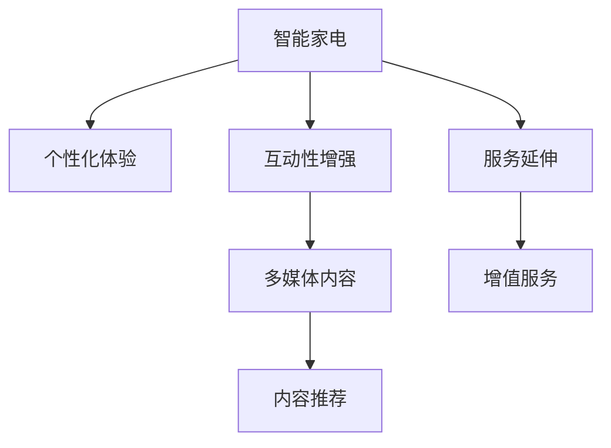

                 

# 智能家电如何在注意力经济中突围

## 1. 背景介绍

### 1.1 问题由来

随着互联网和移动互联网的普及，注意力成为了一种稀缺资源，如何获取和保持用户的注意力成为各个行业面临的共同挑战。智能家电作为日常生活的重要组成部分，其发展和市场推广也深受这一趋势的影响。传统家电产品多以功能性和稳定性为主要卖点，但在高度竞争的市场环境中，如何通过差异化策略获得用户青睐，成为新的课题。

### 1.2 问题核心关键点

智能家电在注意力经济中的突围，需要从产品设计、用户体验、市场推广等多个维度进行创新和优化。核心关键点包括：

- **个性化体验**：满足用户的个性化需求，提供定制化服务。
- **互动性增强**：提升与用户的互动频率和质量，构建亲密的情感连接。
- **内容丰富性**：提供丰富的多媒体内容，如语音控制、视频展示、智能提醒等，增强用户体验。
- **交互界面优化**：设计直观易用的界面，降低用户的操作门槛。
- **服务延伸**：拓展服务范围，如售后服务、产品维保、设备监控等，提升用户粘性。

本文将从这些关键点出发，探索智能家电在注意力经济中突围的路径，并结合案例分析，阐述具体的实施策略和实践方法。

## 2. 核心概念与联系

### 2.1 核心概念概述

为更好地理解智能家电在注意力经济中的突围策略，本节将介绍几个密切相关的核心概念：

- **智能家电**：指通过人工智能技术，实现自我控制、互动和优化的家电产品。包括智能冰箱、智能洗衣机、智能吸尘器等各类设备。

- **注意力经济**：指在注意力稀缺的时代，通过有效吸引和维持用户的注意力，实现产品销售和品牌传播的商业模式。

- **个性化体验**：根据用户偏好和行为习惯，提供量身定制的产品和服务，增强用户体验。

- **互动性增强**：通过智能化的交互界面和语言识别技术，提升用户与设备的互动频率和互动质量。

- **多媒体内容**：包括语音控制、视频、动画、虚拟现实等多种形式的多媒体内容，丰富用户的感知体验。

- **内容推荐**：利用机器学习和数据分析技术，推荐个性化的多媒体内容，提升用户的使用黏性。

- **服务延伸**：超出传统产品的基本功能，提供增值服务，如远程监控、预约维修、用户社区等，构建完整的生态系统。

这些核心概念之间的逻辑关系可以通过以下Mermaid流程图来展示：



这个流程图展示了智能家电的核心概念及其之间的联系：

1. 智能家电通过个性化体验、互动性增强、多媒体内容、内容推荐和增值服务，吸引和保持用户的注意力。
2. 多媒体内容和内容推荐需依托于深度学习等技术，提升智能家电的感知能力。
3. 服务延伸通过构建完整的生态系统，提升用户的使用黏性，增加用户投入时间和情感。

## 3. 核心算法原理 & 具体操作步骤
### 3.1 算法原理概述

智能家电在注意力经济中的突围，主要依赖于以下几个关键算法和具体操作步骤：

- **个性化推荐算法**：通过分析用户的浏览记录、购买行为、评价反馈等数据，利用协同过滤、内容推荐、深度学习等技术，为用户推荐个性化的多媒体内容。
- **互动界面优化算法**：设计直观易用的界面，减少用户的操作步骤，提高用户的操作满意度。
- **多媒体内容生成算法**：基于用户偏好和行为数据，生成个性化的多媒体内容，如语音播报、视频广告、虚拟现实体验等。
- **服务延伸算法**：结合物联网和大数据分析，提供远程监控、预约维修、设备升级等服务，提升用户的使用体验和黏性。

这些算法和操作步骤的结合，可以实现智能家电在注意力经济中的突围。

### 3.2 算法步骤详解

以个性化推荐算法为例，以下是详细的步骤：

**Step 1: 数据收集与预处理**
- 收集用户的历史行为数据，如浏览记录、购买记录、评价数据等。
- 清洗数据，去除噪声和异常值，保证数据质量。

**Step 2: 特征工程**
- 提取用户行为特征，如浏览时间、浏览频率、购买金额等。
- 对特征进行归一化处理，保证各特征在同一尺度上。

**Step 3: 模型训练**
- 选择适合的推荐算法，如协同过滤、深度学习等。
- 利用用户行为数据和特征，训练推荐模型。
- 在训练集上评估模型性能，选择最优模型。

**Step 4: 推荐实现**
- 对新用户请求，利用训练好的推荐模型，生成个性化推荐结果。
- 对推荐结果进行过滤和排序，保证推荐的相关性和多样性。
- 实时更新推荐结果，提升推荐的时效性。

**Step 5: 反馈与优化**
- 收集用户的反馈，如点击率、评价等。
- 利用反馈数据，对推荐模型进行优化，提升推荐质量。
- 周期性对推荐模型进行重新训练，保证推荐的时效性和准确性。

### 3.3 算法优缺点

个性化推荐算法具有以下优点：
1. 提升用户体验：通过个性化的内容推荐，提升用户的使用黏性。
2. 增加用户互动：多媒体内容和互动界面，增加用户与设备的互动频率和质量。
3. 强化用户黏性：通过服务延伸，构建完整的生态系统，增加用户的使用时间和情感投入。

同时，该算法也存在一些局限性：
1. 数据隐私问题：在收集用户数据的过程中，可能存在隐私泄露的风险。
2. 推荐精准度问题：个性化推荐依赖于大数据分析，但数据质量和多样性可能影响推荐效果。
3. 推荐算法复杂性：推荐的算法模型复杂，对计算资源和算力要求较高。
4. 过度依赖数据：推荐效果高度依赖于用户数据的完整性和准确性，数据缺失或不完整时，推荐效果会大打折扣。

尽管存在这些局限性，但个性化推荐算法仍是大规模智能家电产品突围的重要手段。未来相关研究的重点在于如何进一步优化数据隐私保护、提升推荐精准度、降低算法复杂度、提高数据质量等方面。

### 3.4 算法应用领域

个性化推荐算法已经在智能家电的多个领域得到了广泛应用，例如：

- 智能电视：根据用户历史观看记录，推荐电影、电视剧、综艺节目等内容。
- 智能冰箱：根据用户购买记录和健康饮食偏好，推荐食物种类和健康食谱。
- 智能吸尘器：根据用户使用习惯，推荐清洁方案和设备维护建议。

除了上述这些经典应用外，个性化推荐算法还被创新性地应用到更多场景中，如智能照明、智能空调、智能音响等，为智能家电带来了全新的突破。随着推荐算法和相关技术的不断进步，相信智能家电产品必将在更多领域实现个性化突破，为用户带来更智能、更便捷的生活体验。

## 4. 数学模型和公式 & 详细讲解 & 举例说明
### 4.1 数学模型构建

个性化推荐算法主要基于协同过滤和深度学习模型。

**协同过滤模型**：基于用户行为数据，找到兴趣相似的用户群体，为用户推荐其未尝试过的产品。

假设用户集合为 $U$，物品集合为 $I$，用户对物品的评分矩阵为 $R$，用户 $u$ 对物品 $i$ 的评分表示为 $R_{ui}$。协同过滤模型可以分为基于用户的协同过滤和基于物品的协同过滤两种：

- **基于用户的协同过滤**：利用用户之间的相似性，找到与用户 $u$ 兴趣相似的其他用户 $v$，为用户 $u$ 推荐其未评分或评分较低物品 $i$。

- **基于物品的协同过滤**：利用物品之间的相似性，找到与物品 $i$ 兴趣相似的其他物品 $j$，为用户 $u$ 推荐物品 $i$。

**深度学习模型**：利用深度神经网络，从用户行为数据中学习用户和物品的表示，生成推荐结果。

假设用户 $u$ 的行为表示为 $h_u$，物品 $i$ 的行为表示为 $h_i$，推荐结果表示为 $r_u^i$。深度学习模型可以利用卷积神经网络、循环神经网络、注意力机制等，学习用户和物品的表示，生成推荐结果。

### 4.2 公式推导过程

以基于用户的协同过滤模型为例，推导用户 $u$ 对物品 $i$ 的评分预测公式。

假设用户 $u$ 与用户 $v$ 的相似度为 $sim(u,v)$，利用用户的平均评分 $\overline{R}_v$ 和物品的平均评分 $\overline{R}_i$，预测用户 $u$ 对物品 $i$ 的评分 $R_{ui}$ 如下：

$$
R_{ui} \approx \overline{R}_v \times sim(u,v)
$$

其中，$sim(u,v)$ 可以利用余弦相似度、皮尔逊相关系数等方法计算用户之间的相似度。

### 4.3 案例分析与讲解

**案例分析：智能电视推荐系统**

智能电视推荐系统是一个典型的个性化推荐场景，利用用户历史观看记录和评分数据，为用户推荐电影、电视剧、综艺节目等内容。

**数据处理与预处理**：
- 收集用户的历史观看记录和评分数据。
- 清洗数据，去除异常值和噪声。
- 对用户和物品进行特征提取，如用户观看时长、评分、热门度等。

**特征工程**：
- 提取用户行为特征，如观看时长、评分、观看频次等。
- 对特征进行归一化处理，保证各特征在同一尺度上。

**模型训练**：
- 选择适合的推荐算法，如协同过滤、深度学习等。
- 利用用户行为数据和特征，训练推荐模型。
- 在训练集上评估模型性能，选择最优模型。

**推荐实现**：
- 对新用户请求，利用训练好的推荐模型，生成个性化推荐结果。
- 对推荐结果进行过滤和排序，保证推荐的相关性和多样性。
- 实时更新推荐结果，提升推荐的时效性。

**反馈与优化**：
- 收集用户的反馈，如点击率、评价等。
- 利用反馈数据，对推荐模型进行优化，提升推荐质量。
- 周期性对推荐模型进行重新训练，保证推荐的时效性和准确性。

## 5. 项目实践：代码实例和详细解释说明
### 5.1 开发环境搭建

在进行智能家电推荐系统开发前，我们需要准备好开发环境。以下是使用Python进行PyTorch开发的环境配置流程：

1. 安装Anaconda：从官网下载并安装Anaconda，用于创建独立的Python环境。

2. 创建并激活虚拟环境：
```bash
conda create -n pytorch-env python=3.8 
conda activate pytorch-env
```

3. 安装PyTorch：根据CUDA版本，从官网获取对应的安装命令。例如：
```bash
conda install pytorch torchvision torchaudio cudatoolkit=11.1 -c pytorch -c conda-forge
```

4. 安装各类工具包：
```bash
pip install numpy pandas scikit-learn matplotlib tqdm jupyter notebook ipython
```

完成上述步骤后，即可在`pytorch-env`环境中开始推荐系统开发。

### 5.2 源代码详细实现

这里我们以推荐系统的协同过滤算法为例，给出使用PyTorch进行协同过滤的Python代码实现。

首先，定义协同过滤模型的类：

```python
import numpy as np
import pandas as pd
import torch
import torch.nn as nn

class CollaborativeFiltering(nn.Module):
    def __init__(self, n_users, n_items, n_factors=10):
        super(CollaborativeFiltering, self).__init__()
        self.n_users = n_users
        self.n_items = n_items
        self.n_factors = n_factors
        
        self.user_factors = nn.Parameter(torch.randn(n_users, n_factors))
        self.item_factors = nn.Parameter(torch.randn(n_items, n_factors))
        self biases = nn.Parameter(torch.randn(n_items))
        
    def forward(self, user_ids, item_ids):
        user_factors = self.user_factors[user_ids].to(item_ids.device)
        item_factors = self.item_factors[item_ids].to(user_ids.device)
        biases = self.biases[item_ids].to(user_ids.device)
        
        scores = torch.matmul(user_factors, item_factors.t()) + biases.unsqueeze(0)
        scores = scores.squeeze(0)
        return scores
```

然后，定义数据处理和模型训练函数：

```python
from torch.utils.data import Dataset, DataLoader

class CollaborativeFilteringDataset(Dataset):
    def __init__(self, ratings, n_users, n_items):
        self.ratings = ratings
        self.n_users = n_users
        self.n_items = n_items
        
    def __len__(self):
        return len(self.ratings)
    
    def __getitem__(self, item):
        user_id = self.ratings.iloc[item]['user_id']
        item_id = self.ratings.iloc[item]['item_id']
        rating = self.ratings.iloc[item]['rating']
        return user_id, item_id, rating

# 加载数据集
ratings = pd.read_csv('ratings.csv')
n_users = ratings['user_id'].max() + 1
n_items = ratings['item_id'].max() + 1

# 创建数据集
dataset = CollaborativeFilteringDataset(ratings, n_users, n_items)

# 定义模型
model = CollaborativeFiltering(n_users, n_items)

# 定义优化器
optimizer = torch.optim.Adam(model.parameters(), lr=0.01)

# 定义损失函数
criterion = nn.MSELoss()

# 训练模型
def train_epoch(model, dataset, optimizer, criterion, n_epochs=10):
    dataloader = DataLoader(dataset, batch_size=64, shuffle=True)
    model.train()
    for epoch in range(n_epochs):
        total_loss = 0
        for user_id, item_id, rating in dataloader:
            prediction = model(user_id, item_id)
            loss = criterion(prediction, rating)
            optimizer.zero_grad()
            loss.backward()
            optimizer.step()
            total_loss += loss.item()
        print(f'Epoch {epoch+1}, loss: {total_loss/len(dataloader)}')
        
train_epoch(model, dataset, optimizer, criterion)
```

以上就是使用PyTorch对协同过滤推荐系统进行开发的完整代码实现。可以看到，基于PyTorch，构建协同过滤模型非常简洁高效。

### 5.3 代码解读与分析

让我们再详细解读一下关键代码的实现细节：

**CollaborativeFiltering类**：
- 定义了协同过滤模型的参数，包括用户因素、物品因素和偏差。
- 实现了前向传播函数，计算用户和物品之间的相似度得分。

**CollaborativeFilteringDataset类**：
- 继承自PyTorch的Dataset类，实现数据集的加载和处理。
- 利用Pandas读取CSV文件，将用户ID、物品ID和评分转换为模型训练所需的格式。

**train_epoch函数**：
- 定义了训练函数的循环，在每个epoch内对数据集进行迭代训练。
- 使用Adam优化器对模型进行优化，计算损失函数，并在每个epoch后输出平均损失。

可以看到，PyTorch提供的高级API大大简化了模型训练的流程，使得开发者可以更专注于算法的创新和优化。

当然，工业级的系统实现还需考虑更多因素，如模型的保存和部署、超参数的自动搜索、更灵活的任务适配层等。但核心的协同过滤范式基本与此类似。

## 6. 实际应用场景
### 6.1 智能电视推荐系统

智能电视推荐系统作为个性化推荐的重要应用，已经广泛应用于各类智能电视产品中。利用用户历史观看记录和评分数据，智能电视推荐系统可以为用户推荐电影、电视剧、综艺节目等内容。

推荐系统不仅提高了用户的使用黏性，还为用户带来了全新的观影体验。例如，某智能电视品牌通过推荐系统，将用户喜欢的节目推荐给家人，实现了全家共享观影的体验。

### 6.2 智能冰箱推荐系统

智能冰箱推荐系统可以根据用户购买记录和健康饮食偏好，推荐食物种类和健康食谱。推荐系统不仅为用户推荐食品，还可以提供食品的营养信息、存储建议等增值服务。

例如，某智能冰箱品牌通过推荐系统，将健康饮食食谱推荐给用户，结合物联网设备，实现了智能健康饮食管理。推荐系统还可以根据用户购买记录，推荐相关产品，如食品、饮料等。

### 6.3 智能吸尘器推荐系统

智能吸尘器推荐系统可以根据用户使用习惯，推荐清洁方案和设备维护建议。推荐系统不仅可以提高清洁效率，还可以延长设备使用寿命。

例如，某智能吸尘器品牌通过推荐系统，根据用户的使用习惯，推荐适合的清洁模式和清扫频率。推荐系统还可以提供设备维护建议，提醒用户定期更换零部件，保证设备稳定运行。

## 7. 工具和资源推荐
### 7.1 学习资源推荐

为了帮助开发者系统掌握智能家电推荐技术的理论基础和实践技巧，这里推荐一些优质的学习资源：

1. 《深度学习基础》系列博文：由大模型技术专家撰写，深入浅出地介绍了深度学习的基础概念和经典模型。

2. CS223《深度学习与表示学习》课程：斯坦福大学开设的深度学习课程，涵盖深度学习的基本原理和算法。

3. 《深度推荐系统》书籍：详细介绍了深度推荐系统的原理、算法和实现，包括协同过滤、深度学习等技术。

4. PyTorch官方文档：提供丰富的深度学习API和代码示例，方便开发者上手实践。

5. Weights & Biases：模型训练的实验跟踪工具，可以记录和可视化模型训练过程中的各项指标。

6. TensorBoard：TensorFlow配套的可视化工具，可以实时监测模型训练状态，并提供丰富的图表呈现方式。

通过对这些资源的学习实践，相信你一定能够快速掌握智能家电推荐技术的精髓，并用于解决实际的推荐问题。

### 7.2 开发工具推荐

高效的开发离不开优秀的工具支持。以下是几款用于智能家电推荐系统开发的常用工具：

1. PyTorch：基于Python的开源深度学习框架，灵活动态的计算图，适合快速迭代研究。

2. TensorFlow：由Google主导开发的开源深度学习框架，生产部署方便，适合大规模工程应用。

3. Scikit-learn：Python的机器学习库，提供丰富的机器学习算法和工具。

4. Keras：基于TensorFlow的高级API，方便快速搭建深度学习模型。

5. Pandas：Python的数据处理库，方便数据清洗和预处理。

6. Matplotlib：Python的可视化库，方便数据可视化。

合理利用这些工具，可以显著提升智能家电推荐系统的开发效率，加快创新迭代的步伐。

### 7.3 相关论文推荐

智能家电推荐技术的发展源于学界的持续研究。以下是几篇奠基性的相关论文，推荐阅读：

1. Adaptive Collaborative Filtering（自适应协同过滤）：提出自适应协同过滤方法，利用用户行为数据，动态调整协同过滤的参数，提升推荐效果。

2. Deep Collaborative Filtering（深度协同过滤）：提出深度协同过滤方法，利用深度神经网络，从用户行为数据中学习用户和物品的表示，生成推荐结果。

3. Multi-Task Learning for Recommender Systems（多任务学习推荐系统）：提出多任务学习的方法，将推荐问题与其他任务（如用户画像、内容表示等）结合，提升推荐效果。

4. Matrix Factorization Techniques for Recommender Systems（矩阵分解推荐系统）：提出矩阵分解的方法，从用户行为数据中学习用户和物品的表示，生成推荐结果。

5. Multi-View Learning in Recommender Systems（多视图学习推荐系统）：提出多视图学习的方法，利用多模态数据，提升推荐效果。

这些论文代表了大规模智能家电推荐技术的发展脉络。通过学习这些前沿成果，可以帮助研究者把握学科前进方向，激发更多的创新灵感。

## 8. 总结：未来发展趋势与挑战
### 8.1 总结

本文对智能家电在注意力经济中的突围方法进行了全面系统的介绍。首先阐述了智能家电和注意力经济的研究背景和意义，明确了推荐算法在吸引和保持用户注意力方面的独特价值。其次，从原理到实践，详细讲解了协同过滤算法和深度学习推荐模型的数学原理和关键步骤，给出了推荐系统开发的完整代码实例。同时，本文还广泛探讨了推荐系统在智能家电领域的实际应用场景，展示了推荐范式的巨大潜力。

通过本文的系统梳理，可以看到，基于协同过滤和深度学习算法的推荐技术，正在成为智能家电产品突围注意力经济的强大武器。这些技术的不断进步，必将进一步提升智能家电系统的性能和应用范围，为智能家电产业带来新的突破和创新。

### 8.2 未来发展趋势

展望未来，智能家电推荐技术将呈现以下几个发展趋势：

1. 推荐算法的多样化。除了协同过滤和深度学习，未来将涌现更多推荐算法，如知识图谱推荐、强化学习推荐等，提升推荐的多样性和效果。

2. 推荐模型的可解释性。推荐模型的可解释性将逐渐增强，用户可以理解推荐系统的决策过程和逻辑，增加信任度。

3. 推荐模型的集成优化。推荐系统将与物联网、大数据等技术结合，实现更高效、更智能的推荐。

4. 推荐模型的个性化。推荐系统将利用更多用户数据，实现更加个性化的推荐，提升用户体验。

5. 推荐模型的实时化。推荐系统将利用实时数据，实现更及时、更准确的推荐，提升推荐的时效性。

这些趋势凸显了智能家电推荐技术的广阔前景。这些方向的探索发展，必将进一步提升推荐系统的效果和应用范围，为用户带来更智能、更便捷的生活体验。

### 8.3 面临的挑战

尽管智能家电推荐技术已经取得了瞩目成就，但在迈向更加智能化、普适化应用的过程中，它仍面临诸多挑战：

1. 数据隐私问题。推荐系统需要大量的用户行为数据，可能存在隐私泄露的风险。

2. 推荐精准度问题。推荐模型的精准度依赖于数据质量和多样性，数据缺失或不完整时，推荐效果会大打折扣。

3. 计算资源消耗。推荐模型的计算复杂度高，对计算资源和算力要求较高。

4. 推荐模型的可解释性。推荐模型多为黑盒系统，难以解释其内部工作机制和决策逻辑。

5. 推荐模型的鲁棒性。推荐模型在面对异常数据和噪声时，容易发生偏差，影响推荐效果。

6. 推荐模型的更新效率。推荐模型需要实时更新，以应对用户行为的变化，更新效率较慢时，推荐效果也会受到影响。

这些挑战需要未来的研究进行深入探索和优化，以确保推荐系统能够稳定、高效地运行，并为用户提供更好的服务体验。

### 8.4 研究展望

面对智能家电推荐系统面临的挑战，未来的研究需要在以下几个方面寻求新的突破：

1. 研究数据隐私保护方法。通过差分隐私、联邦学习等技术，保护用户隐私，同时保证推荐效果。

2. 优化推荐模型计算效率。采用模型压缩、稀疏化等方法，降低推荐模型的计算复杂度，提升计算效率。

3. 增强推荐模型的可解释性。引入可解释性技术，如LIME、SHAP等，增强推荐模型的可解释性，让用户理解推荐逻辑。

4. 提升推荐模型的鲁棒性。引入鲁棒性技术，如对抗训练、鲁棒回归等，增强推荐模型的鲁棒性，降低数据偏差的影响。

5. 提高推荐模型的更新效率。采用增量学习、在线学习等技术，提升推荐模型的更新效率，减少推荐时延。

这些研究方向的探索，必将引领智能家电推荐技术迈向更高的台阶，为用户带来更智能、更便捷的生活体验。面向未来，智能家电推荐技术还需要与其他人工智能技术进行更深入的融合，如知识表示、因果推理、强化学习等，多路径协同发力，共同推动智能家电系统的进步。

## 9. 附录：常见问题与解答

**Q1：如何选择合适的推荐算法？**

A: 选择推荐算法需要考虑数据特点和业务需求。对于数据稀疏、用户行为简单的场景，可以采用协同过滤算法；对于数据丰富、用户行为复杂的场景，可以采用深度学习推荐算法。同时，可以考虑多任务学习、多视图学习等方法，提升推荐效果。

**Q2：如何缓解推荐算法中的过拟合问题？**

A: 缓解推荐算法中的过拟合问题，可以采用数据增强、正则化、模型集成等方法。数据增强可以通过回译、近义替换等方式扩充训练集，正则化可以通过L2正则、Dropout等技术，避免模型过拟合。模型集成可以通过集成多个模型，取平均输出，降低过拟合风险。

**Q3：推荐系统在智能家电中的应用场景有哪些？**

A: 推荐系统在智能家电中的应用场景包括智能电视推荐、智能冰箱推荐、智能吸尘器推荐等。通过推荐系统，不仅可以提升用户的使用黏性，还可以为用户提供个性化的服务，提升用户体验。

**Q4：推荐系统在实际部署中需要注意哪些问题？**

A: 推荐系统在实际部署中需要注意数据隐私保护、推荐模型的实时更新、推荐算法的可解释性等问题。数据隐私保护可以通过差分隐私、联邦学习等技术，保护用户隐私。推荐模型的实时更新可以通过增量学习、在线学习等技术，提升推荐模型的更新效率。推荐算法的可解释性可以通过可解释性技术，如LIME、SHAP等，增强推荐模型的可解释性。

通过这些问题的解答，可以看到，智能家电推荐系统不仅具有广阔的应用前景，也面临着许多挑战和机遇。只有在充分理解推荐技术的基础上，才能在实际应用中取得更好的效果，为用户带来更加智能、便捷的生活体验。

---

作者：禅与计算机程序设计艺术 / Zen and the Art of Computer Programming

