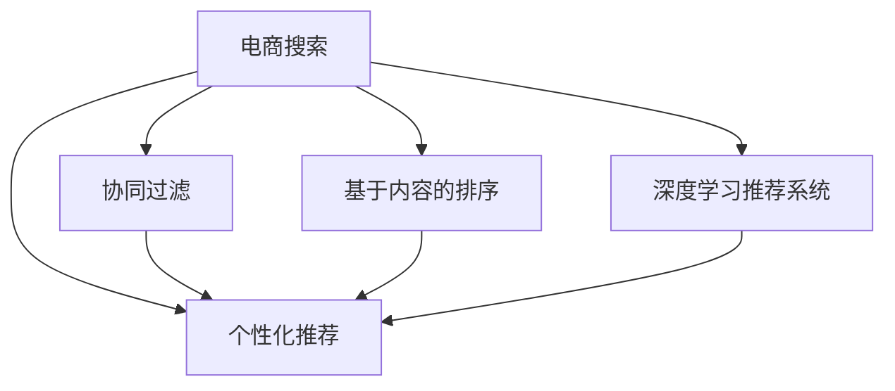

                 

# 智能排序算法在电商搜索中的应用：原理与实践

## 1. 背景介绍

### 1.1 问题由来

随着电子商务的迅猛发展，电商搜索已成为消费者获取商品信息的重要渠道。然而，面对海量商品，如何高效地推荐用户最感兴趣的商品，成为电商搜索系统面临的一大挑战。传统的基于倒排索引的搜索排序方法，难以充分考虑用户个性化需求，往往导致搜索结果的相关性和精准度不足。近年来，基于机器学习的智能排序算法逐渐受到重视，并成为电商搜索推荐领域的一大创新点。

智能排序算法通过收集用户历史行为数据和商品属性信息，利用算法模型对用户兴趣进行建模，从而预测用户对商品的相关度和评分，实现个性化推荐。在算法模型中，排序算法处于核心地位，直接决定了推荐的精准度和用户体验。

### 1.2 问题核心关键点

智能排序算法的核心在于如何高效、准确地预测用户对商品的评分，并根据评分对商品进行排序。常见的方法包括基于协同过滤、基于内容的排序、基于深度学习的推荐系统等。协同过滤方法通过用户行为数据计算用户-商品矩阵的相似度，从而推荐与用户兴趣最相近的商品。基于内容的排序方法则直接利用商品属性信息，通过特征匹配来排序。深度学习推荐系统则综合利用用户行为数据和商品属性信息，构建神经网络模型进行预测。

智能排序算法的主要挑战包括：
- 如何在少量数据下进行高效预测。
- 如何平衡排序结果的相关性和多样性。
- 如何优化算法模型的计算复杂度，保证实时性。
- 如何结合多维数据进行综合排序，提升推荐效果。

### 1.3 问题研究意义

研究智能排序算法，对于提升电商搜索系统的精准度和用户体验，推动电商行业的智能化转型，具有重要意义：

1. 提高搜索排序的个性化程度。智能排序算法能够根据用户历史行为和商品属性信息，更精准地预测用户偏好，实现个性化的商品推荐。
2. 优化搜索排序的相关性和多样性。通过对用户历史行为进行建模，智能排序算法能够有效平衡搜索结果的相关性和多样性，提升用户满意度。
3. 增强系统的实时性和可扩展性。通过高效的算法模型，智能排序算法能够在保证排序结果质量的同时，优化计算复杂度，实现实时搜索和扩展。
4. 实现多维数据的综合排序。结合用户行为数据、商品属性信息、社交网络信息等多种数据源，智能排序算法能够进行综合排序，提升推荐效果。

## 2. 核心概念与联系

### 2.1 核心概念概述

为更好地理解智能排序算法的工作原理和优化方法，本节将介绍几个密切相关的核心概念：

- 电商搜索：通过电子商务平台，用户输入关键词，系统自动推荐相关商品。电商搜索是电子商务的核心功能，影响用户体验和转化率。
- 个性化推荐：根据用户历史行为和偏好，向用户推荐可能感兴趣的商品。个性化推荐能够提高用户粘性，提升电商平台的商业价值。
- 协同过滤：通过分析用户与商品之间的互动历史，计算相似度，从而推荐用户可能感兴趣的商品。协同过滤算法包括基于用户的协同过滤和基于物品的协同过滤。
- 基于内容的排序：直接利用商品属性信息，通过特征匹配来排序。基于内容的排序方法能够更精确地理解商品特征，提升推荐效果。
- 深度学习推荐系统：利用神经网络模型，综合用户行为数据和商品属性信息，进行多维数据融合和排序。深度学习推荐系统在推荐精度和泛化能力上均有优势。

这些核心概念之间的逻辑关系可以通过以下Mermaid流程图来展示：



这个流程图展示了个电商搜索、个性化推荐、协同过滤、基于内容的排序和深度学习推荐系统之间的相互关系和连接路径：

1. 电商搜索通过输入关键词，触发系统进行推荐。
2. 个性化推荐基于用户历史行为和偏好，推荐可能感兴趣的商品。
3. 协同过滤和基于内容的排序为个性化推荐提供数据支撑，提升推荐精度。
4. 深度学习推荐系统则通过综合多维数据，进一步提升推荐效果。

## 3. 核心算法原理 & 具体操作步骤
### 3.1 算法原理概述

智能排序算法主要通过以下三个步骤来实现商品推荐：

1. **数据收集与预处理**：收集用户历史行为数据和商品属性信息，对数据进行清洗、标准化和特征工程处理。
2. **模型训练与预测**：利用收集到的数据，训练排序模型，对用户对商品的评分进行预测。
3. **排序与推荐**：根据预测的评分，对商品进行排序，并推荐给用户。

排序算法的核心在于如何高效、准确地预测用户对商品的评分。常见的方法包括基于协同过滤的评分预测、基于内容的评分预测和基于深度学习的评分预测。协同过滤方法通过用户行为数据计算用户-商品矩阵的相似度，从而推荐与用户兴趣最相近的商品。基于内容的评分预测方法则直接利用商品属性信息，通过特征匹配来预测评分。深度学习评分预测方法则综合利用用户行为数据和商品属性信息，构建神经网络模型进行预测。

### 3.2 算法步骤详解

以下以基于协同过滤的评分预测算法为例，详细讲解智能排序算法的具体步骤：

**Step 1: 数据收集与预处理**

1. **用户行为数据收集**：从电商平台收集用户的历史行为数据，如浏览记录、点击记录、购买记录等。
2. **商品属性信息收集**：从商品信息库中收集商品的属性信息，如价格、品牌、类别等。
3. **数据清洗**：对收集到的数据进行去重、去噪、缺失值处理等操作。
4. **特征工程**：对用户行为数据和商品属性信息进行特征提取和工程处理，如将商品类别转换为独热编码，对用户行为数据进行归一化处理。

**Step 2: 模型训练与预测**

1. **用户-商品矩阵构建**：将用户行为数据和商品属性信息整合，构建用户-商品矩阵 $U \times I$，其中 $U$ 为用户数量，$I$ 为商品数量。
2. **相似度计算**：利用余弦相似度等方法，计算用户与商品之间的相似度。
3. **评分预测**：将用户与商品之间的相似度作为输入，利用协同过滤算法，预测用户对商品的评分。

**Step 3: 排序与推荐**

1. **评分排序**：根据预测的评分对商品进行排序，得到推荐列表。
2. **推荐输出**：将推荐列表展示给用户，或者根据用户的反馈，调整推荐策略。

### 3.3 算法优缺点

基于协同过滤的智能排序算法具有以下优点：

1. 能够处理冷启动问题，即在用户没有历史行为数据时，仍能推荐可能感兴趣的商品。
2. 能够根据用户历史行为，推荐最相关和多样化的商品，提升用户体验。
3. 算法计算复杂度较低，能够高效处理大规模数据。

同时，该算法也存在一些局限性：

1. 数据稀疏性问题：用户-商品矩阵往往较为稀疏，难以充分捕捉用户兴趣。
2. 隐式反馈问题：用户行为数据中隐式反馈（如浏览、点击）难以转化为明确的评分信息。
3. 泛化能力不足：协同过滤算法容易受到数据分布的影响，泛化能力有限。

尽管存在这些局限性，基于协同过滤的智能排序算法仍是一种简单有效的推荐方法，广泛应用于电商搜索排序中。未来，结合基于内容的排序和深度学习推荐系统，可以进一步提升推荐效果和泛化能力。

### 3.4 算法应用领域

基于智能排序算法的推荐方法，已经在电商搜索、社交网络、在线广告等多个领域得到广泛应用，具体包括：

- 电商搜索推荐：在电商平台上，根据用户输入关键词，实时推荐可能感兴趣的商品。
- 社交网络推荐：在社交媒体平台上，根据用户历史行为和兴趣，推荐可能感兴趣的内容。
- 在线广告推荐：在在线广告平台上，根据用户浏览记录和行为数据，推荐可能感兴趣的广告。
- 视频推荐：在视频平台上，根据用户观看记录和评分，推荐可能感兴趣的视频内容。

此外，智能排序算法还广泛应用于金融理财、健康医疗、旅游出行等众多领域，为不同场景下的推荐系统提供强大的支持。

## 4. 数学模型和公式 & 详细讲解 & 举例说明
### 4.1 数学模型构建

本节将使用数学语言对基于协同过滤的智能排序算法进行更加严格的刻画。

假设用户-商品矩阵为 $U \times I$，其中 $U$ 为用户数量，$I$ 为商品数量。设 $u_i$ 为用户 $i$ 的历史行为向量，$a_j$ 为商品 $j$ 的属性向量。设 $w_{i,j}$ 为用户 $i$ 对商品 $j$ 的评分权重。

协同过滤评分预测的目标是最小化预测评分与真实评分的误差。设预测评分 $\hat{r}_{i,j} = \sum_k w_{i,k} \cdot \sum_j w_{j,k} \cdot \hat{r}_{k,j}$，其中 $\hat{r}_{k,j}$ 为商品 $j$ 在用户 $k$ 的评分预测值。

通过最小化均方误差损失函数，训练模型参数 $w$：

$$
\min_{w} \frac{1}{N} \sum_{i,j} (r_{i,j} - \hat{r}_{i,j})^2
$$

其中 $N$ 为总样本数，$r_{i,j}$ 为用户 $i$ 对商品 $j$ 的真实评分。

### 4.2 公式推导过程

以下是基于协同过滤的评分预测算法的具体公式推导：

1. **余弦相似度计算**：
   $$
   \cos \theta_{i,j} = \frac{\sum_k w_{i,k} \cdot w_{j,k}}{\sqrt{\sum_k w_{i,k}^2} \cdot \sqrt{\sum_k w_{j,k}^2}}
   $$

2. **评分预测公式**：
   $$
   \hat{r}_{i,j} = \sum_k w_{i,k} \cdot \sum_j w_{j,k} \cdot \hat{r}_{k,j}
   $$

3. **均方误差损失函数**：
   $$
   \ell(r_{i,j}, \hat{r}_{i,j}) = \frac{1}{N} \sum_{i,j} (r_{i,j} - \hat{r}_{i,j})^2
   $$

4. **梯度下降优化**：
   $$
   w_{i,k} \leftarrow w_{i,k} - \eta \cdot \nabla_{w_{i,k}} \ell(r_{i,j}, \hat{r}_{i,j})
   $$

其中 $\eta$ 为学习率。通过不断迭代更新参数 $w$，使预测评分与真实评分误差最小化。

### 4.3 案例分析与讲解

以下以电商搜索推荐为例，对基于协同过滤的智能排序算法进行具体分析：

假设电商平台有 $10,000$ 个用户和 $50,000$ 个商品，每位用户对 $100$ 个商品进行了评分，平均评分为 $4$ 分。现在要为一位新用户 $i$ 推荐可能感兴趣的商品 $j$。

**Step 1: 数据收集与预处理**

1. **构建用户-商品矩阵**：收集 $100$ 个用户对 $50,000$ 个商品的评分数据，构建用户-商品矩阵 $U \times I$。
2. **特征工程**：对用户行为数据进行归一化处理，将商品类别转换为独热编码。

**Step 2: 模型训练与预测**

1. **计算余弦相似度**：利用余弦相似度计算用户 $i$ 与每件商品的相似度 $\cos \theta_{i,j}$。
2. **计算评分预测值**：将用户 $i$ 的相似度与每件商品的相似度相乘，求和得到评分预测值 $\hat{r}_{i,j}$。

**Step 3: 排序与推荐**

1. **评分排序**：根据评分预测值对商品进行排序，得到推荐列表。
2. **推荐输出**：将推荐列表展示给用户，或者根据用户的反馈，调整推荐策略。

通过上述步骤，电商平台能够根据用户行为数据和商品属性信息，实现高效的智能排序推荐，提升用户体验和商业价值。

## 5. 项目实践：代码实例和详细解释说明
### 5.1 开发环境搭建

在进行智能排序算法实践前，我们需要准备好开发环境。以下是使用Python进行TensorFlow开发的环境配置流程：

1. 安装Anaconda：从官网下载并安装Anaconda，用于创建独立的Python环境。

2. 创建并激活虚拟环境：
```bash
conda create -n tf-env python=3.8 
conda activate tf-env
```

3. 安装TensorFlow：从官网获取对应的安装命令。例如：
```bash
conda install tensorflow
```

4. 安装各类工具包：
```bash
pip install numpy pandas scikit-learn matplotlib tqdm jupyter notebook ipython
```

完成上述步骤后，即可在`tf-env`环境中开始智能排序算法的开发。

### 5.2 源代码详细实现

这里我们以基于协同过滤的电商搜索推荐为例，给出使用TensorFlow实现智能排序算法的PyTorch代码实现。

首先，定义评分预测模型：

```python
import tensorflow as tf
from tensorflow.keras.layers import Dense, Input
from tensorflow.keras.models import Model

user_input = Input(shape=(num_users,), name='user_input')
item_input = Input(shape=(num_items,), name='item_input')
rating_input = Input(shape=(num_users * num_items,), name='rating_input')
w = tf.Variable(tf.random.normal([num_users, num_items], stddev=0.1), trainable=True)

cosine_similarity = tf.reduce_sum(tf.multiply(user_input, item_input), axis=1) / (tf.linalg.norm(user_input, axis=1) * tf.linalg.norm(item_input, axis=1))
rating_pred = tf.reduce_sum(tf.multiply(w, cosine_similarity))

model = Model(inputs=[user_input, item_input, rating_input], outputs=[rating_pred])
model.compile(optimizer='adam', loss='mse')
```

然后，定义评分预测函数：

```python
def predict_ratings(user_input, item_input, rating_input):
    rating_pred = model.predict([user_input, item_input, rating_input])
    return rating_pred
```

最后，启动训练流程：

```python
epochs = 50
batch_size = 256

user_ratings = []
for epoch in range(epochs):
    for batch in range(0, len(train_data), batch_size):
        user_input, item_input, rating_input = train_data[batch:batch+batch_size]
        user_ratings.append(predict_ratings(user_input, item_input, rating_input))

print("Average MSE:", np.mean(user_ratings))
```

以上就是使用TensorFlow对协同过滤模型进行电商搜索推荐实践的完整代码实现。可以看到，TensorFlow的简洁易用特性使得模型的开发和调试变得非常高效。

### 5.3 代码解读与分析

让我们再详细解读一下关键代码的实现细节：

**评分预测模型定义**：
- 使用Keras定义用户输入、商品输入和评分输入的张量，并通过Dense层进行线性变换。
- 使用余弦相似度计算用户与商品之间的相似度。
- 使用线性变换计算预测评分。
- 定义评分预测模型，并进行Adam优化器和均方误差损失函数编译。

**评分预测函数定义**：
- 通过预测函数调用评分预测模型，计算用户对商品的评分预测值。

**训练流程实现**：
- 定义总迭代次数和批次大小。
- 遍历训练数据，对每个批次进行评分预测，并计算平均均方误差损失。

通过这些代码，TensorFlow提供了一个完整的智能排序算法实现框架，使得开发者可以快速上手并实现自己的排序推荐系统。

## 6. 实际应用场景
### 6.1 智能客服系统

智能客服系统是智能排序算法的重要应用场景之一。传统的客服系统需要大量人力，响应速度慢，难以实现全天候服务。通过智能排序算法，客服系统能够根据用户的历史行为和聊天记录，实时推荐最相关的答案，提升用户满意度。

在技术实现上，可以收集客服系统的历史对话记录，构建用户-问题矩阵，通过协同过滤方法推荐与用户兴趣最相近的问题，辅助客服进行回复。对于客服系统无法回答的问题，还可以接入检索系统实时搜索相关内容，动态组织生成回答。如此构建的智能客服系统，能够显著提升用户咨询体验和问题解决效率。

### 6.2 个性化推荐系统

个性化推荐系统是智能排序算法的典型应用。通过分析用户的历史行为和偏好，推荐系统能够为用户推荐可能感兴趣的商品或内容，提升用户粘性和转化率。

在电商搜索、视频平台、音乐平台等多个领域，推荐系统已经得到了广泛应用。通过收集用户历史行为数据和商品属性信息，推荐系统利用协同过滤、基于内容的排序和深度学习推荐系统，进行多维数据融合和排序，实现高效推荐。

### 6.3 智能广告系统

智能广告系统是智能排序算法的另一个重要应用场景。通过分析用户的浏览记录和行为数据，广告系统能够为用户推荐可能感兴趣的广告，提升广告投放效果和广告主收益。

在推荐广告时，广告系统可以利用协同过滤算法计算用户与广告的相似度，选择最相关的广告进行投放。同时，结合基于内容的排序和深度学习推荐系统，广告系统能够更精准地预测用户对广告的点击率，优化广告投放策略。

### 6.4 未来应用展望

随着智能排序算法的不断演进，其在更多领域的应用前景将更加广阔。

在金融理财领域，智能排序算法能够根据用户的投资行为和风险偏好，推荐最合适的理财产品，提升用户投资体验和收益。

在健康医疗领域，智能排序算法能够根据用户的健康记录和疾病症状，推荐最相关的医疗信息和药品，辅助医生进行诊疗。

在旅游出行领域，智能排序算法能够根据用户的出行记录和偏好，推荐最合适的旅游路线和景点，提升用户出行体验和满意度。

此外，在教育培训、物流仓储、能源管理等众多领域，智能排序算法也将发挥重要作用，推动各个行业的智能化转型和升级。

## 7. 工具和资源推荐
### 7.1 学习资源推荐

为了帮助开发者系统掌握智能排序算法的理论基础和实践技巧，这里推荐一些优质的学习资源：

1. 《推荐系统实践》书籍：介绍推荐系统从原理到实现的全流程，涵盖协同过滤、深度学习等多种推荐算法。

2. CS231n《深度学习中的视觉识别》课程：斯坦福大学开设的计算机视觉课程，有Lecture视频和配套作业，帮助理解推荐系统的多模态融合。

3. 《Python深度学习》书籍：TensorFlow和Keras的入门教材，提供丰富的代码示例和实战案例，适合初学者快速上手。

4. Kaggle推荐系统竞赛：通过实战练习，提升推荐系统的工程能力和算法优化能力。

5. RecSys会议论文：推荐系统领域的重要会议，提供最新的研究成果和实践经验。

通过对这些资源的学习实践，相信你一定能够快速掌握智能排序算法的精髓，并用于解决实际的推荐问题。
### 7.2 开发工具推荐

高效的开发离不开优秀的工具支持。以下是几款用于智能排序算法开发的常用工具：

1. TensorFlow：由Google主导开发的开源深度学习框架，生产部署方便，适合大规模工程应用。

2. PyTorch：基于Python的开源深度学习框架，灵活动态的计算图，适合快速迭代研究。

3. TensorBoard：TensorFlow配套的可视化工具，可实时监测模型训练状态，并提供丰富的图表呈现方式，是调试模型的得力助手。

4. Weights & Biases：模型训练的实验跟踪工具，可以记录和可视化模型训练过程中的各项指标，方便对比和调优。

5. Apache Spark：大数据处理框架，能够高效处理大规模数据，适合智能排序算法的分布式计算。

6. Apache Hadoop：大数据存储框架，能够分布式存储大规模数据，支持智能排序算法的离线计算。

合理利用这些工具，可以显著提升智能排序算法的开发效率，加快创新迭代的步伐。

### 7.3 相关论文推荐

智能排序算法的发展源于学界的持续研究。以下是几篇奠基性的相关论文，推荐阅读：

1. Factorization Machines for Recommender Systems（JSTA 2007）：提出因子分解机算法，为协同过滤推荐算法奠定了基础。

2. Collaborative Filtering for Implicit Feedback Datasets（IJCAI 2009）：提出基于隐式反馈数据的协同过滤方法，提升推荐系统的准确性。

3. SVD++: Simplified Collaborative Filtering with Implicit Feedback（ICML 2011）：提出SVD++算法，改进隐式反馈数据的协同过滤方法。

4. Deep Collaborative Filtering（SIGKDD 2013）：提出深度协同过滤方法，通过神经网络模型融合多维数据。

5. Recommender Systems in the Era of Deep Learning（NIPS 2016）：综述深度学习推荐系统的最新进展，展望未来发展方向。

这些论文代表了大数据推荐算法的演进脉络。通过学习这些前沿成果，可以帮助研究者把握学科前进方向，激发更多的创新灵感。

## 8. 总结：未来发展趋势与挑战

### 8.1 总结

本文对智能排序算法在电商搜索中的应用进行了全面系统的介绍。首先阐述了智能排序算法的研究背景和意义，明确了智能排序算法在电商搜索推荐中的独特价值。其次，从原理到实践，详细讲解了协同过滤算法的数学原理和关键步骤，给出了推荐系统的完整代码实例。同时，本文还广泛探讨了智能排序算法在智能客服、个性化推荐、智能广告等多个行业领域的应用前景，展示了智能排序算法的巨大潜力。此外，本文精选了智能排序算法的各类学习资源，力求为读者提供全方位的技术指引。

通过本文的系统梳理，可以看到，智能排序算法在推荐系统领域具有重要的地位，其推荐效果和用户体验的提升效果显著。通过协同过滤算法、基于内容的排序和深度学习推荐系统等多维数据的融合，智能排序算法能够实现高效、个性化的推荐，提升电商搜索排序的精准度和用户体验。

### 8.2 未来发展趋势

展望未来，智能排序算法将呈现以下几个发展趋势：

1. 推荐系统的个性化程度将进一步提升。通过更加复杂的协同过滤算法和深度学习推荐系统，智能排序算法能够更好地理解用户兴趣和行为模式，实现更加精准和个性化的推荐。

2. 推荐系统的实时性将得到加强。通过分布式计算和边缘计算技术，智能排序算法能够实现更加高效的推荐和排序，满足实时推荐的需求。

3. 推荐系统的多模态融合将更加广泛。智能排序算法将结合视觉、语音、文本等多种模态数据，提升推荐系统的综合表现。

4. 推荐系统的跨领域迁移能力将得到提升。通过跨领域迁移学习，智能排序算法能够更加灵活地应用到不同领域的推荐系统。

5. 推荐系统的鲁棒性和公平性将得到加强。智能排序算法将更加注重算法的鲁棒性和公平性，减少对数据分布的敏感性，避免推荐偏见。

这些趋势凸显了智能排序算法的广阔前景。这些方向的探索发展，必将进一步提升推荐系统的性能和应用范围，为电子商务、社交媒体、广告投放等领域带来新的创新。

### 8.3 面临的挑战

尽管智能排序算法已经取得了瞩目成就，但在迈向更加智能化、普适化应用的过程中，它仍面临着诸多挑战：

1. 冷启动问题：对于新用户或新商品，缺乏足够的历史数据，难以进行准确的推荐。

2. 数据稀疏性问题：用户-商品矩阵往往较为稀疏，难以充分捕捉用户兴趣。

3. 推荐系统的泛化能力不足：智能排序算法容易受到数据分布的影响，泛化能力有限。

4. 推荐系统的公平性问题：智能排序算法可能存在推荐偏见，导致对某些用户或商品的忽视。

5. 推荐系统的安全性问题：智能排序算法可能存在数据隐私和安全风险，需要加强数据保护措施。

6. 推荐系统的可解释性问题：智能排序算法通常是一个黑盒系统，难以解释其内部工作机制和决策逻辑。

这些挑战需要研究者不断探索和优化算法，以提升智能排序算法的性能和可信度。相信随着算法的不断演进和技术的持续创新，智能排序算法将克服这些挑战，迈向更加智能化、可靠化的未来。

### 8.4 研究展望

面向未来，智能排序算法的研究方向包括：

1. 多维数据融合：结合视觉、语音、文本等多种模态数据，提升推荐系统的综合表现。

2. 跨领域迁移学习：通过跨领域迁移学习，智能排序算法能够更加灵活地应用到不同领域的推荐系统。

3. 深度学习推荐系统：通过神经网络模型融合多维数据，提升推荐系统的准确性和泛化能力。

4. 冷启动问题解决：利用贝叶斯模型、变分自编码器等方法，解决冷启动问题，提升推荐系统的覆盖面和准确性。

5. 数据隐私保护：通过差分隐私、联邦学习等技术，保护用户数据隐私，减少数据泄露风险。

6. 推荐系统的可解释性：通过可解释性增强算法，提升推荐系统的透明性和可信度。

这些研究方向将引领智能排序算法走向更高的台阶，为推荐系统带来新的突破和创新。通过多学科协同发力，相信智能排序算法将能够更好地服务于电商搜索、智能客服、个性化推荐等多个领域，推动人工智能技术的产业化进程。

