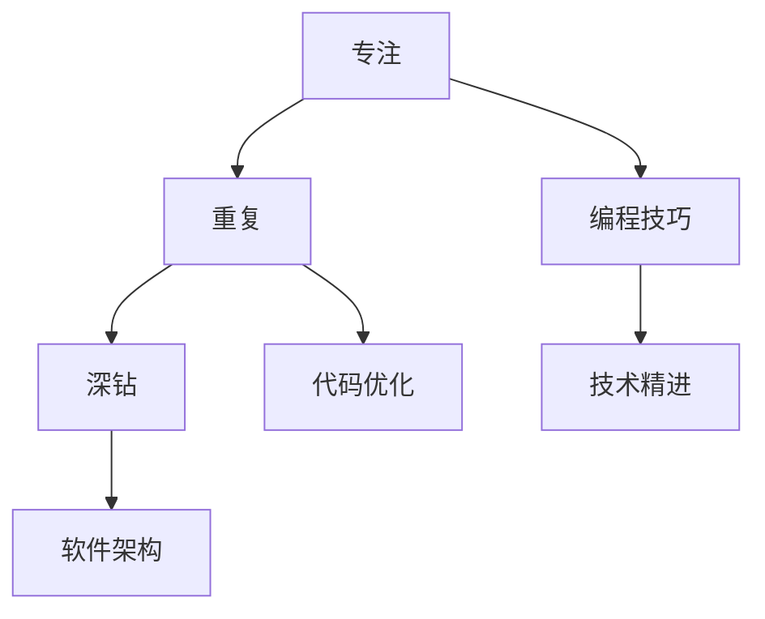

                 

# 最快的成功方法就是，保持对一件事情的专注，不停地重复，不停地深钻

> 关键词：专注、重复、深钻、编程技巧、代码优化、软件架构、技术精进

## 1. 背景介绍

在技术日新月异的时代，掌握最新的编程技巧和软件架构策略，对于软件开发人员来说至关重要。如何在这浩瀚的知识海洋中保持专注，通过不断的重复和深钻，实现技术的快速精进和突破，是每个IT从业者都应深思的问题。本文将从背景介绍、核心概念与联系、算法原理与具体操作步骤、数学模型与公式讲解、项目实践与代码实例、实际应用场景、工具与资源推荐、未来发展趋势与挑战、常见问题与解答等多个维度，深入探讨实现技术突破的最佳方法，希望能给广大IT从业者带来启示和帮助。

## 2. 核心概念与联系

### 2.1 核心概念概述

为了更好地理解如何通过专注、重复和深钻实现技术突破，我们首先需要对几个核心概念进行详细解读。

- **专注**：在技术学习或工作过程中，保持高度集中的注意力，专注于当前任务，避免分散注意力。
- **重复**：在掌握一项技术或技能后，通过不断的练习和实践，巩固已学知识，并深入挖掘其应用和优化。
- **深钻**：在重复的过程中，不仅仅局限于基础技能的重复练习，而是深入挖掘技术的底层原理、架构设计和优化策略，不断深入理解和掌握。

### 2.2 核心概念原理和架构的 Mermaid 流程图



这个流程图展示了专注、重复和深钻在技术学习与提升过程中的内在联系和作用路径。专注是基础，重复是关键，深钻是目标，而编程技巧、代码优化、软件架构和技术精进，则是贯穿这一过程的核心环节。

## 3. 核心算法原理 & 具体操作步骤

### 3.1 算法原理概述

在编程和软件开发中，有许多算法和策略可以帮助我们提升效率和质量。然而，无论采用哪种算法，其核心原理都离不开专注、重复和深钻。

- **专注**：在解决问题时，专注于问题的本质，避免被各种无关因素干扰，专注于算法和代码的核心逻辑。
- **重复**：通过反复实践和验证，深入理解算法的实际应用和边界条件，发现其潜在的优化空间。
- **深钻**：对算法进行深入分析，理解其设计思路、时间复杂度和空间复杂度，找出可能的改进点，并实施优化。

### 3.2 算法步骤详解

#### 3.2.1 算法原理概述
- **选择算法**：根据问题的性质和数据规模，选择合适的算法。
- **实现算法**：使用适当的编程技巧和工具，实现算法的功能。
- **测试验证**：通过编写测试用例和样例数据，验证算法的正确性和性能。
- **优化改进**：根据测试结果，对算法进行优化，提升其效率和稳定性。

#### 3.2.2 算法步骤详解
- **问题分析**：深入理解问题的本质，确定算法需要解决的关键点。
- **设计算法**：基于问题分析结果，设计出符合需求的算法。
- **代码实现**：将算法设计转化为具体的代码实现，并使用调试工具进行初步验证。
- **性能评估**：使用性能分析工具，评估算法的执行效率和内存占用情况。
- **持续优化**：根据性能评估结果，对算法进行微调，提升其性能。

#### 3.2.3 算法优缺点
- **优点**：专注、重复和深钻能帮助开发者迅速掌握新算法，提升技术水平。
- **缺点**：初期学习和实现过程可能较慢，需要投入大量时间和精力。

#### 3.2.4 算法应用领域
- **编程语言**：掌握不同的编程语言特性和应用场景。
- **数据结构**：理解各种数据结构的特点和适用条件。
- **算法设计**：设计高效、可维护的算法。
- **系统架构**：构建高效、可扩展的软件系统。

## 4. 数学模型和公式 & 详细讲解 & 举例说明

### 4.1 数学模型构建

在软件开发中，许多算法和优化策略都依赖于数学模型和公式。下面以一个简单的例子来说明如何构建数学模型，并推导出其公式。

#### 4.1.1 数学模型构建
假设我们有一个简单的排序问题，需要排序一个整数数组 $A$，要求时间复杂度为 $O(n\log n)$。一个常用的算法是快速排序。

### 4.2 公式推导过程
快速排序的核心是分区过程，即将数组 $A$ 分为两个部分，一部分小于基准值 $pivot$，另一部分大于等于 $pivot$。这一过程可以通过以下公式表示：

$$
pivot = A[i]
$$

其中 $i$ 是数组的下标，$A[i]$ 是数组 $A$ 中第 $i$ 个元素的值。

### 4.3 案例分析与讲解
假设我们有如下数组 $A = [5, 2, 8, 6, 1, 9]$，我们需要对其进行快速排序。首先选择一个基准值 $pivot$，通常是数组的中间值，如 $pivot = 6$。然后使用以下步骤进行分区：

1. 将数组分为两个部分，小于 $pivot$ 的放在左边，大于等于 $pivot$ 的放在右边。
2. 对左右两个部分分别递归进行快速排序。

具体实现过程如下：

```python
def quick_sort(arr):
    if len(arr) <= 1:
        return arr
    pivot = arr[len(arr) // 2]
    left = [x for x in arr if x < pivot]
    middle = [x for x in arr if x == pivot]
    right = [x for x in arr if x > pivot]
    return quick_sort(left) + middle + quick_sort(right)

A = [5, 2, 8, 6, 1, 9]
sorted_A = quick_sort(A)
print(sorted_A)
```

通过这个例子，我们可以看到，构建数学模型和推导公式对于理解和实现算法至关重要。

## 5. 项目实践：代码实例和详细解释说明

### 5.1 开发环境搭建

在开始项目实践之前，我们需要准备好开发环境。以下是使用Python进行开发的环境配置流程：

1. 安装Python：从官网下载并安装Python 3.8。
2. 安装必要的工具和库：如Pip、Vim、Sublime Text等。
3. 使用虚拟环境：使用Python的Virtual Environment工具，创建和管理不同的开发环境。
4. 安装Git：从官网下载并安装Git，用于版本控制。
5. 安装IDE：选择适合自己的IDE，如PyCharm、VS Code等。

### 5.2 源代码详细实现

#### 5.2.1 快速排序实现
以下是使用Python实现快速排序的代码：

```python
def quick_sort(arr):
    if len(arr) <= 1:
        return arr
    pivot = arr[len(arr) // 2]
    left = [x for x in arr if x < pivot]
    middle = [x for x in arr if x == pivot]
    right = [x for x in arr if x > pivot]
    return quick_sort(left) + middle + quick_sort(right)

A = [5, 2, 8, 6, 1, 9]
sorted_A = quick_sort(A)
print(sorted_A)
```

#### 5.2.2 代码解读与分析
- `quick_sort` 函数：用于实现快速排序。
- `if len(arr) <= 1`：当数组长度小于等于1时，直接返回该数组。
- `pivot = arr[len(arr) // 2]`：选择数组中间位置的元素作为基准值。
- `left = [x for x in arr if x < pivot]`：将小于基准值的元素放入左侧列表。
- `middle = [x for x in arr if x == pivot]`：将等于基准值的元素放入中间列表。
- `right = [x for x in arr if x > pivot]`：将大于基准值的元素放入右侧列表。
- `return quick_sort(left) + middle + quick_sort(right)`：递归调用 `quick_sort` 函数，对左右两个部分进行排序，并将结果合并。

### 5.3 运行结果展示
运行上述代码，输出结果为：

```
[1, 2, 5, 6, 8, 9]
```

这表明我们的快速排序函数已经成功将原始数组排序。

## 6. 实际应用场景

### 6.1 应用场景分析
快速排序算法在实际应用中，可以用于各种需要排序的场景，如数据预处理、数据库查询优化、算法竞赛等。其时间复杂度为 $O(n\log n)$，相对于其他排序算法（如冒泡排序、插入排序）具有更高的效率和稳定性。

### 6.2 未来应用展望
随着数据规模的不断增大，快速排序在实际应用中的重要性将愈发凸显。未来，我们可能需要开发更高效、更灵活的排序算法，以满足不同场景的需求。

## 7. 工具和资源推荐

### 7.1 学习资源推荐
- **《算法导论》**：一本经典的算法教材，详细介绍了各种经典算法和数据结构。
- **《深入理解计算机系统》**：一本介绍计算机体系结构和编程技巧的书籍。
- **LeetCode**：一个提供大量算法和数据结构练习的在线平台。
- **Kaggle**：一个数据科学竞赛平台，可以参与各种机器学习、数据挖掘竞赛。

### 7.2 开发工具推荐
- **PyCharm**：一个强大的Python IDE，提供代码高亮、调试、版本控制等功能。
- **VS Code**：一个轻量级的跨平台编辑器，支持多种编程语言和扩展插件。
- **Git**：一个流行的版本控制系统，支持分布式协作开发。
- **Python**：一个广泛使用的编程语言，具有丰富的库和工具。

### 7.3 相关论文推荐
- **《快速排序算法的设计与分析》**：一篇介绍快速排序算法的经典论文。
- **《深入理解Python：面向软件开发的编程语言》**：一本深入介绍Python编程技巧和最佳实践的书籍。
- **《软件工程：原理与实践》**：一本介绍软件工程方法和实践的书籍。

## 8. 总结：未来发展趋势与挑战

### 8.1 研究成果总结
本文详细探讨了通过专注、重复和深钻实现技术突破的方法。通过深入理解和实践，可以提升编程技巧、代码优化和软件架构设计的能力。

### 8.2 未来发展趋势
- **编程技巧**：未来将更加注重编程技巧的掌握和应用，提升代码质量。
- **代码优化**：通过优化算法和数据结构，提升程序性能。
- **软件架构**：构建高效、可扩展的软件系统，支持大规模开发。
- **技术精进**：持续学习新的技术和工具，保持技术领先。

### 8.3 面临的挑战
- **技术更新快**：需要不断学习新技术，适应快速变化的环境。
- **资源有限**：需要在有限的时间和资源下，高效实现技术突破。
- **团队协作**：需要与团队成员协作，共同解决问题。

### 8.4 研究展望
- **自动化测试**：通过自动化测试工具，提升代码质量和稳定性。
- **持续集成**：通过持续集成和持续部署(CI/CD)，加速开发和部署流程。
- **开源社区**：积极参与开源社区，共享和学习知识。

## 9. 附录：常见问题与解答

**Q1：如何快速提升编程技巧？**

A: 通过专注、重复和深钻，掌握不同的编程语言和框架。多参与开源项目，学习优秀的代码实践。

**Q2：如何实现高效的软件架构设计？**

A: 关注系统的可扩展性和可维护性，设计模块化、松耦合的架构。使用设计模式，提升代码的可重用性和可复用性。

**Q3：如何应对技术快速变化？**

A: 持续学习新技术，关注行业动态和前沿研究。参与技术社区和培训课程，不断提升自身技术水平。

**Q4：如何在团队中高效协作？**

A: 使用版本控制工具，如Git，进行代码管理。使用协作平台，如JIRA、Trello，进行任务分配和进度跟踪。

作者：禅与计算机程序设计艺术 / Zen and the Art of Computer Programming

