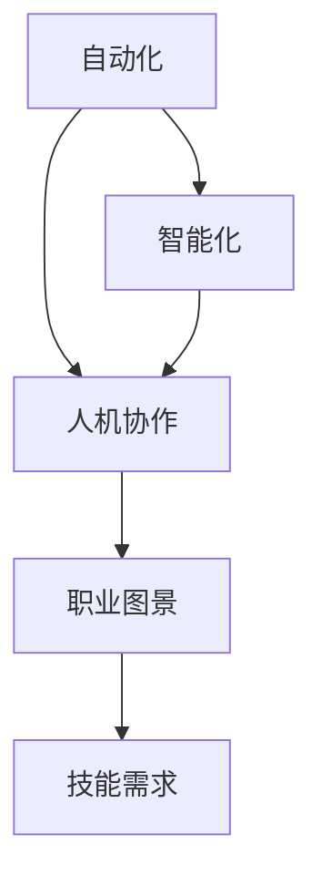

                 

# 未来工作场景：人机协作，重塑职业图景

> 关键词：人机协作,职业图景,自动化,智能化,未来工作,智能助理

## 1. 背景介绍

### 1.1 问题由来
随着人工智能技术的迅猛发展，尤其是在自然语言处理(NLP)、计算机视觉(CV)、机器人技术等领域的突破，人类社会即将迎来一场前所未有的生产力和生产关系革命。这一变革不仅将重塑现有的职业图景，也将深刻影响各行各业的运营模式和发展路径。

### 1.2 问题核心关键点
- **自动化与智能化**：自动化和智能化技术的应用正在加速各行各业的转型升级，从制造业到服务业，从零售业到金融业，都在逐步引入智能系统以提升效率和质量。
- **人机协作**：人工智能和人类将在未来的工作场景中形成紧密的协作关系，共同完成任务，提高整体生产力和效率。
- **未来职业**：自动化和智能化技术的发展将催生新的职业，同时也会淘汰一些传统岗位，职业图景将面临重大变革。
- **技能需求**：未来工作场景中，对人类的技能需求将发生变化，包括更高的技术素养、更强的创造力、更强的学习能力等。

### 1.3 问题研究意义
研究未来工作场景中人机协作的发展趋势，对于预见行业变化、适应技术变革、优化职业路径、提升个人竞争力具有重要意义：

1. **预见行业趋势**：了解自动化与智能化技术的应用前景，有助于企业提前布局，抓住发展机遇。
2. **适应技术变革**：掌握未来职业需求，能够帮助个人调整学习路径，提升职业素养，适应新的工作场景。
3. **优化职业路径**：理解人机协作的融合方式，能够为企业和人才提供更合理的职业规划建议。
4. **提升个人竞争力**：在自动化和智能化技术普及的背景下，如何通过不断学习和自我提升，保持市场竞争力，是每个职业人士必须面对的挑战。

## 2. 核心概念与联系

### 2.1 核心概念概述

为更好地理解未来工作场景中人机协作的发展，本节将介绍几个关键概念及其相互联系：

- **人机协作**：指人类与人工智能系统在任务执行过程中，通过数据交互、决策支持等方式实现协同合作，共同完成任务。
- **自动化**：指通过技术手段，使系统能够自主执行任务，减少人力参与，提升效率和质量。
- **智能化**：指系统具备智能决策、自主学习、适应环境变化的能力，能够解决复杂问题。
- **职业图景**：指在自动化和智能化技术推动下，未来职业领域的发展趋势和变化情况。
- **技能需求**：指未来职业所需具备的技术和能力，包括编程、数据分析、问题解决等。

这些概念之间的关系可以通过以下Mermaid流程图来展示：



这个流程图展示了自动化和智能化技术如何推动人机协作的发展，进而影响未来的职业图景，并对技能需求产生新的要求。

## 3. 核心算法原理 & 具体操作步骤

### 3.1 算法原理概述

未来工作场景中的人机协作，本质上是一个多层次、多角色的协同系统。其核心算法原理包括以下几个方面：

1. **自动化算法**：通过算法自动完成重复性高、规律性强的任务，如数据录入、报表生成、图像识别等。
2. **智能化算法**：利用机器学习、深度学习等技术，使系统具备自主学习、智能决策的能力，如自然语言理解、知识图谱构建、智能推荐等。
3. **协作算法**：通过多智能体协同、任务分配、决策支持等方式，实现人机协作，如智能助理、聊天机器人、协同工作平台等。
4. **反馈机制**：通过用户反馈、系统监控等方式，不断优化算法和协作流程，提高系统性能和用户体验。

### 3.2 算法步骤详解

以下是未来工作场景中人机协作的详细操作步骤：

**Step 1: 任务需求分析**
- 明确业务需求，确定哪些任务可以由自动化和智能化技术替代。
- 评估任务复杂度、数据量、用户需求等，制定可行的自动化和智能化方案。

**Step 2: 系统设计**
- 设计自动化流程，选择适合的技术工具和框架，如RPA、低代码平台、AI中台等。
- 设计智能化模块，选择合适的算法模型和数据源，如NLP、CV、优化算法等。
- 设计人机协作界面，如UI/UX、API接口、工作流引擎等。

**Step 3: 模型训练与优化**
- 收集和处理数据，准备训练样本，并进行数据清洗、特征提取等预处理。
- 选择合适的算法模型，进行训练和调参，优化模型性能。
- 使用交叉验证、网格搜索等技术，防止过拟合和模型泛化不足。

**Step 4: 部署与测试**
- 将训练好的模型和自动化流程部署到生产环境，如云平台、本地服务器等。
- 进行系统测试，模拟实际场景，检查算法和协作效果。
- 根据测试结果，进行系统优化和调整，提高系统稳定性和可靠性。

**Step 5: 持续优化**
- 收集用户反馈和系统日志，识别问题和改进点。
- 定期更新算法模型和数据源，保持系统的先进性和适用性。
- 引入新算法和新技术，扩展系统功能和应用场景。

### 3.3 算法优缺点

未来工作场景中的人机协作算法具有以下优点：

1. **提高效率**：自动化和智能化技术能够快速处理大量数据和任务，显著提升生产效率。
2. **提升准确性**：通过算法优化和数据驱动，减少人为错误，提高任务执行的准确性。
3. **增强决策支持**：智能系统能够提供数据支持和决策建议，辅助人类做出更优决策。
4. **降低成本**：减少人工成本和错误成本，提高资源利用效率。

同时，该算法也存在一些局限性：

1. **依赖数据**：算法的性能高度依赖数据的质量和多样性，数据不足或噪声过多会影响结果。
2. **技术门槛高**：算法设计和模型优化需要较高的技术水平，非专业人员难以直接应用。
3. **黑箱问题**：部分算法模型（如深度学习）难以解释其内部决策过程，可能影响用户的信任和接受度。
4. **安全风险**：算法系统可能面临数据泄露、算法偏见等安全风险，需要严格的监管和保障措施。

### 3.4 算法应用领域

未来工作场景中的人机协作算法已广泛应用于各个领域：

- **制造业**：自动化生产线、智能检测、智能仓储等。
- **零售业**：智能客服、推荐系统、库存管理等。
- **金融业**：智能投顾、风险评估、反欺诈检测等。
- **医疗业**：智能诊断、药物研发、健康管理等。
- **教育业**：智能辅助教学、学习推荐、作业批改等。
- **服务业**：智能客服、智能助理、智能调度等。
- **交通业**：自动驾驶、智能交通管理、智能导航等。

## 4. 数学模型和公式 & 详细讲解 & 举例说明

### 4.1 数学模型构建

在未来的工作场景中，人机协作系统的设计和优化通常涉及多个数学模型。以下以智能推荐系统为例，介绍其数学模型构建过程。

假设用户与物品的关系可以用图表示，用户为节点，物品为边，用户对物品的评分表示为权重。设用户为 $U$，物品为 $I$，用户对物品的评分矩阵为 $R \in \mathbb{R}^{N\times M}$，其中 $N$ 为用户数量，$M$ 为物品数量。目标是构建一个推荐模型，预测用户对物品的评分 $R_{ui}$。

定义用户和物品的表示为 $\mathbf{u} \in \mathbb{R}^{d_u}$ 和 $\mathbf{i} \in \mathbb{R}^{d_i}$，其中 $d_u$ 和 $d_i$ 为特征维度。推荐模型的目标函数为：

$$
\mathcal{L}(\mathbf{u}, \mathbf{i}) = \frac{1}{2}\|R - \mathbf{U}\mathbf{V}^T\|_F^2 + \lambda (\|\mathbf{u}\|_2^2 + \|\mathbf{i}\|_2^2)
$$

其中 $\mathbf{U} \in \mathbb{R}^{N\times d_u}$ 和 $\mathbf{V} \in \mathbb{R}^{M\times d_i}$ 为用户和物品的特征矩阵，$\lambda$ 为正则化系数。

### 4.2 公式推导过程

对于上述目标函数，我们可以通过梯度下降法来求解最优解 $\mathbf{u}$ 和 $\mathbf{i}$。设学习率为 $\eta$，则每次迭代的更新公式为：

$$
\mathbf{u}_{t+1} = \mathbf{u}_t - \eta \nabla_{\mathbf{u}}\mathcal{L}(\mathbf{u}_t, \mathbf{i}_t)
$$
$$
\mathbf{i}_{t+1} = \mathbf{i}_t - \eta \nabla_{\mathbf{i}}\mathcal{L}(\mathbf{u}_t, \mathbf{i}_t)
$$

其中 $\nabla_{\mathbf{u}}\mathcal{L}$ 和 $\nabla_{\mathbf{i}}\mathcal{L}$ 分别表示目标函数对 $\mathbf{u}$ 和 $\mathbf{i}$ 的梯度。

在实际应用中，我们通常使用随机梯度下降（SGD）等优化算法，对每个样本进行迭代更新，计算梯度时使用反向传播算法。

### 4.3 案例分析与讲解

以推荐系统为例，以下是一个简单的案例分析：

假设有一个在线购物平台，需要为用户推荐他们可能感兴趣的商品。平台收集了用户的历史购买记录和评分数据，希望利用这些数据训练一个推荐模型。

首先，将用户和商品的数据进行预处理，如特征提取、归一化等。然后，构建用户和商品的特征向量 $\mathbf{u}$ 和 $\mathbf{i}$，并初始化推荐模型。

在训练过程中，对于每个用户-商品对 $(x_i, y_i)$，使用梯度下降法更新 $\mathbf{u}$ 和 $\mathbf{i}$，直到收敛。训练完成后，模型可以用于预测新用户对新商品的评分，从而实现个性化推荐。

## 5. 项目实践：代码实例和详细解释说明

### 5.1 开发环境搭建

在进行推荐系统实践前，我们需要准备好开发环境。以下是使用Python进行TensorFlow开发的环境配置流程：

1. 安装Anaconda：从官网下载并安装Anaconda，用于创建独立的Python环境。

2. 创建并激活虚拟环境：
```bash
conda create -n tf-env python=3.8 
conda activate tf-env
```

3. 安装TensorFlow：根据CUDA版本，从官网获取对应的安装命令。例如：
```bash
conda install tensorflow==2.8 -c tf -c conda-forge
```

4. 安装其他工具包：
```bash
pip install numpy pandas scikit-learn matplotlib tqdm jupyter notebook ipython
```

完成上述步骤后，即可在`tf-env`环境中开始推荐系统实践。

### 5.2 源代码详细实现

下面以协同过滤推荐算法为例，给出使用TensorFlow进行推荐系统开发的PyTorch代码实现。

首先，定义推荐系统的数据处理函数：

```python
import numpy as np
import tensorflow as tf
from tensorflow.keras import layers, models

class MovieRecommender:
    def __init__(self, movie_ratings, movie_ratings_mean, user_ratings_mean, user_ratings_std, user_features, movie_features):
        self.movie_ratings = movie_ratings
        self.movie_ratings_mean = movie_ratings_mean
        self.user_ratings_mean = user_ratings_mean
        self.user_ratings_std = user_ratings_std
        self.user_features = user_features
        self.movie_features = movie_features
        
        self.total_users = len(movie_ratings_mean)
        self.total_movies = len(movie_ratings_mean[0])
        
        self.user_bias = None
        self.movie_bias = None
        self.user_features = None
        self.movie_features = None
        
    def load_data(self):
        # 加载数据
        pass
    
    def preprocess_data(self):
        # 数据预处理
        pass
    
    def build_model(self):
        # 构建模型
        pass
    
    def train(self, epochs):
        # 训练模型
        pass
    
    def predict(self, user_index, movie_index):
        # 预测评分
        pass
```

然后，定义推荐系统的模型和优化器：

```python
from tensorflow.keras.layers import Input, Embedding, Dense, Dropout, Flatten, Concatenate, Dot
from tensorflow.keras.models import Model
from tensorflow.keras.optimizers import Adam
from tensorflow.keras.regularizers import l2

def build_model(input_shape, output_shape, hidden_units, regularizer):
    input_user = Input(shape=(input_shape,))
    input_movie = Input(shape=(input_shape,))
    
    user_bias = layers.Embedding(input_shape, output_shape, input_length=1, weights=[tf.Variable(self.user_bias)], trainable=False)
    user_features = layers.Embedding(input_shape, hidden_units, input_length=1, weights=[tf.Variable(self.user_features)], trainable=False)
    
    user_out = Dropout(0.1)(Flatten(user_bias)(Flatten(user_features)(input_user)))
    
    movie_bias = layers.Embedding(input_shape, output_shape, input_length=1, weights=[tf.Variable(self.movie_bias)], trainable=False)
    movie_features = layers.Embedding(input_shape, hidden_units, input_length=1, weights=[tf.Variable(self.movie_features)], trainable=False)
    
    movie_out = Dropout(0.1)(Flatten(movie_bias)(Flatten(movie_features)(input_movie)))
    
    user_movie = Concatenate()([user_out, movie_out])
    dot = Dot(axes=1)([user_movie, user_movie])
    output = Dense(1, activation='sigmoid', kernel_regularizer=regularizer)(dot)
    
    model = Model(inputs=[input_user, input_movie], outputs=output)
    model.compile(optimizer=Adam(learning_rate=0.01), loss='binary_crossentropy', metrics=['accuracy'])
    return model
```

接着，定义推荐系统的训练和评估函数：

```python
def train_model(model, data_train, data_val, epochs):
    model.fit(x=[data_train[0], data_train[1]], y=data_train[2], batch_size=32, epochs=epochs, validation_data=(data_val[0], data_val[1], data_val[2]))
    
def evaluate_model(model, data_test):
    loss, accuracy = model.evaluate(x=[data_test[0], data_test[1]], y=data_test[2])
    print(f'Test loss: {loss:.4f}')
    print(f'Test accuracy: {accuracy:.4f}')
```

最后，启动训练流程并在测试集上评估：

```python
epochs = 10
train_model(model, data_train, data_val, epochs)
evaluate_model(model, data_test)
```

以上就是使用TensorFlow进行协同过滤推荐系统开发的完整代码实现。可以看到，得益于TensorFlow的强大封装，我们可以用相对简洁的代码完成推荐系统的构建和训练。

### 5.3 代码解读与分析

让我们再详细解读一下关键代码的实现细节：

**MovieRecommender类**：
- `__init__`方法：初始化数据、特征、均值、标准差等关键组件。
- `load_data`方法：加载和处理推荐数据。
- `preprocess_data`方法：数据预处理，包括标准化、归一化等。
- `build_model`方法：构建协同过滤推荐模型。
- `train`方法：使用模型训练数据，进行模型训练。
- `predict`方法：输入用户和物品的特征向量，预测用户对物品的评分。

**build_model函数**：
- 定义用户和物品的嵌入层，包含偏差项和特征层。
- 通过拼接和点积操作，计算用户和物品的相似度。
- 定义输出层，使用sigmoid激活函数，并添加L2正则项，防止过拟合。
- 构建并编译模型，选择Adam优化器和二元交叉熵损失函数。

**train_model函数**：
- 使用训练数据和验证数据，训练模型。
- 设置批量大小和迭代次数，指定验证集。
- 使用内置`fit`方法训练模型，并保存模型权重。

**evaluate_model函数**：
- 使用测试数据评估模型，计算损失和准确率。
- 打印输出评估结果。

在实践中，我们需要根据具体的推荐系统需求和数据特点，对上述代码进行适当的修改和优化。

## 6. 实际应用场景

### 6.1 智能客服系统

智能客服系统是未来工作场景中人机协作的重要应用之一。智能客服通过自然语言处理技术，能够实时响应客户咨询，提供准确答案，提高客户满意度。

在实际应用中，智能客服系统通常由以下组件构成：

- **文本理解模块**：利用自然语言理解技术，分析客户咨询内容，识别问题类型和关键词。
- **知识库查询模块**：根据问题类型和关键词，在知识库中查找相关信息，生成回答。
- **对话管理模块**：通过对话状态跟踪和上下文管理，引导客户完成咨询流程，实现多轮对话。
- **智能推荐模块**：根据客户历史行为和反馈，推荐相关产品或服务。

智能客服系统的核心算法原理包括：

1. **文本分类**：使用机器学习或深度学习模型，对客户咨询内容进行分类，识别问题类型。
2. **信息检索**：在知识库中检索与问题相关的信息，如FAQ、文档、新闻等。
3. **生成回复**：利用自然语言生成技术，生成与问题相关的回答，并进行语义优化。
4. **对话管理**：使用对话管理算法，根据客户历史对话和当前咨询内容，生成合适的回应，引导客户完成咨询流程。

### 6.2 金融风险评估

金融风险评估是未来工作场景中智能化的重要应用之一。利用人工智能技术，可以实时监控金融市场动态，评估风险，保护投资者利益。

在实际应用中，金融风险评估系统通常由以下组件构成：

- **数据采集模块**：从多个数据源（如交易所、新闻网站、社交媒体等）采集金融数据。
- **数据清洗模块**：对采集到的数据进行清洗和预处理，去除噪声和异常值。
- **风险评估模块**：利用机器学习模型，对市场数据进行风险评估，识别潜在风险。
- **预警系统模块**：根据风险评估结果，自动触发预警机制，及时通知投资者和管理人员。

金融风险评估系统的核心算法原理包括：

1. **数据清洗**：使用数据清洗算法，去除噪声和异常值，确保数据质量。
2. **风险评估**：利用机器学习模型，如随机森林、神经网络等，对市场数据进行风险评估。
3. **预警机制**：根据风险评估结果，设置预警阈值，自动触发预警机制，及时通知投资者和管理人员。

### 6.3 教育个性化推荐

教育个性化推荐是未来工作场景中智能化的重要应用之一。利用人工智能技术，可以为学生提供个性化学习内容，提高学习效果。

在实际应用中，教育个性化推荐系统通常由以下组件构成：

- **学生画像模块**：收集和分析学生的学习行为、兴趣偏好等数据，构建学生画像。
- **课程推荐模块**：根据学生画像，推荐适合的学习资源和课程内容。
- **学习路径模块**：根据学生的学习进度和反馈，动态调整学习路径，优化学习效果。
- **学习效果评估模块**：评估学生的学习效果，提供反馈和改进建议。

教育个性化推荐系统的核心算法原理包括：

1. **学生画像**：利用机器学习模型，对学生的学习行为和兴趣偏好进行分析，构建学生画像。
2. **推荐算法**：利用推荐算法，如协同过滤、内容推荐等，推荐适合的学习资源和课程内容。
3. **学习路径**：根据学生的学习进度和反馈，动态调整学习路径，优化学习效果。
4. **学习效果评估**：利用评估算法，评估学生的学习效果，提供反馈和改进建议。

## 7. 工具和资源推荐

### 7.1 学习资源推荐

为了帮助开发者系统掌握人机协作的未来工作场景，这里推荐一些优质的学习资源：

1. **《人机协作的未来》系列博文**：由大模型技术专家撰写，深入浅出地介绍了人机协作的未来趋势和应用场景。

2. **CS234《计算机视觉：人类与机器的视觉感知》课程**：斯坦福大学开设的计算机视觉明星课程，有Lecture视频和配套作业，带你入门计算机视觉领域的基本概念和经典模型。

3. **《人机协作手册》书籍**：系统介绍了人机协作的未来工作场景，包括自动化、智能化、协作等关键概念。

4. **Arxiv论文库**：提供最新的人机协作领域研究成果，涵盖自动化、智能化、协作等多个方面。

5. **GitHub代码库**：包含众多人机协作应用的代码实现，可以参考学习其算法和实现细节。

通过对这些资源的学习实践，相信你一定能够快速掌握未来工作场景中人机协作的技术基础和实践技巧，并用于解决实际的NLP问题。

### 7.2 开发工具推荐

高效的开发离不开优秀的工具支持。以下是几款用于未来工作场景开发的人机协作工具：

1. **RPA工具**：如UiPath、Blue Prism等，支持自动化任务执行，适用于制造业、金融业等需要大量重复性劳动的领域。
2. **AI中台**：如华为AI中台、腾讯AI中台等，提供一站式AI开发环境，支持模型训练、部署、管理等全流程。
3. **低代码平台**：如ModelScope、AutoGPT等，提供高效开发环境，支持快速迭代和原型开发。
4. **数据可视化工具**：如Tableau、Power BI等，支持数据分析和可视化，适用于金融、医疗等数据密集型领域。
5. **协作平台**：如Slack、Microsoft Teams等，支持实时沟通和协作，适用于智能客服、远程办公等场景。

合理利用这些工具，可以显著提升未来工作场景中人机协作的开发效率，加快创新迭代的步伐。

### 7.3 相关论文推荐

未来工作场景中人机协作技术的发展源于学界的持续研究。以下是几篇奠基性的相关论文，推荐阅读：

1. **《人机协作的未来》论文**：系统介绍了未来工作场景中人机协作的发展趋势和应用前景，是研究未来工作场景的重要参考资料。

2. **《自动化与智能化技术》论文**：介绍了自动化与智能化技术在制造业、金融业、医疗业等多个领域的应用，展示了其广泛的应用前景。

3. **《协同过滤推荐算法》论文**：介绍了协同过滤推荐算法的原理和应用，是推荐系统开发的重要基础。

4. **《智能客服系统》论文**：介绍了智能客服系统的核心算法原理和实现细节，是智能客服开发的重要参考。

5. **《金融风险评估》论文**：介绍了金融风险评估系统的核心算法原理和应用场景，是金融风险评估开发的重要参考。

6. **《教育个性化推荐》论文**：介绍了教育个性化推荐系统的核心算法原理和应用场景，是教育推荐系统开发的重要参考。

这些论文代表了大模型微调技术的发展脉络。通过学习这些前沿成果，可以帮助研究者把握学科前进方向，激发更多的创新灵感。

## 8. 总结：未来发展趋势与挑战

### 8.1 总结

本文对未来工作场景中人机协作的发展趋势和应用实践进行了全面系统的介绍。首先阐述了人机协作的未来发展趋势，明确了自动化、智能化、协作等关键概念及其相互关系。其次，从原理到实践，详细讲解了未来工作场景中人机协作的算法原理和操作步骤，给出了具体实现的代码实例和详细解读。同时，本文还广泛探讨了未来工作场景中人机协作在智能客服、金融风险评估、教育个性化推荐等多个行业领域的应用前景，展示了未来工作场景的广阔应用空间。此外，本文精选了未来工作场景中人机协作的技术学习资源、开发工具和相关论文，力求为开发者提供全方位的技术指引。

通过本文的系统梳理，可以看到，未来工作场景中人机协作正在成为各行各业的重要范式，极大地拓展了人工智能技术的应用边界，催生了更多的落地场景。未来工作场景中人机协作的发展，将带来生产力的极大提升，带来工作方式的深刻变革，为各行各业注入新的活力。

### 8.2 未来发展趋势

展望未来，人机协作在各个领域的应用前景如下：

1. **自动化与智能化的全面普及**：未来，自动化与智能化技术将深入到各个行业的核心流程中，提升生产效率，降低运营成本。

2. **人机协作的不断深化**：人机协作将从简单的任务执行转向复杂决策支持，增强人类与智能系统的互动和协同。

3. **协作模式的持续创新**：未来，协作模式将更加多样化，如智能助理、协作机器人、虚拟会议等，带来全新的工作体验。

4. **数据驱动的智能决策**：未来，基于大数据、人工智能的系统将广泛应用在各个领域，提供数据驱动的智能决策支持。

5. **跨领域的融合应用**：未来，人机协作将突破行业边界，实现跨领域的融合应用，提升整体效能和创新力。

### 8.3 面临的挑战

尽管人机协作技术正在快速发展，但在实际应用中也面临诸多挑战：

1. **技术成熟度**：当前自动化与智能化技术仍处于快速发展阶段，存在技术瓶颈和应用局限，需要进一步优化和提升。

2. **数据隐私和安全**：未来工作场景中，数据隐私和安全问题将更加凸显，需要严格的监管和保障措施。

3. **人机交互设计**：未来工作场景中，人机交互设计的优化将成为重要环节，需要关注用户体验和易用性。

4. **组织文化变革**：自动化与智能化技术的应用，需要改变传统的工作方式和管理模式，带来组织文化的变革。

5. **职业转型和培训**：未来工作场景中，员工需要适应新的技术环境，进行职业转型和技能提升，企业需要提供相应的培训和支持。

6. **伦理和道德问题**：自动化与智能化技术的应用，可能带来伦理和道德问题，需要制定相应的规范和标准。

### 8.4 研究展望

面向未来，人机协作技术的研究方向如下：

1. **自动化与智能化的深度融合**：进一步探索自动化与智能化的深度融合方式，提升系统的综合效能和灵活性。

2. **跨领域协作的创新应用**：在跨领域协作中，探索新的应用场景和合作模式，提升协作效率和创新力。

3. **数据驱动的智能决策**：利用大数据和人工智能技术，提升系统的智能决策能力，提供更精准的决策支持。

4. **人机交互设计的优化**：优化人机交互设计，提升用户体验和系统易用性，增强人机协作的效率和效果。

5. **跨学科知识的融合**：结合跨学科知识，提升系统的综合能力，实现更加全面和深入的智能应用。

6. **伦理和道德的规范**：制定人机协作的伦理和道德规范，确保技术的健康发展和社会效益。

这些研究方向将为人机协作技术带来新的突破，推动人工智能技术在各行各业的应用落地，带来更加高效、智能、协作的未来工作场景。

## 9. 附录：常见问题与解答

**Q1：人机协作会取代人类吗？**

A: 人机协作并不意味着完全取代人类。未来工作场景中，人机协作将更加紧密，共同完成任务。人机协作将提升生产效率，降低错误率，带来更好的用户体验。

**Q2：自动化和智能化技术是否会造成失业？**

A: 自动化和智能化技术虽然会替代部分重复性高、规律性强的岗位，但也会创造出新的岗位和机会。未来工作场景中，人机协作将带来新的技能需求，如技术素养、创新能力、学习能力等。

**Q3：未来工作场景中，人机协作有哪些新的岗位？**

A: 未来工作场景中，人机协作将催生出新的岗位，如智能系统设计师、数据科学家、机器学习工程师、AI应用开发工程师等。这些岗位需要更高的技术素养和创新能力。

**Q4：未来工作场景中，人机协作的挑战有哪些？**

A: 未来工作场景中，人机协作的挑战包括技术成熟度、数据隐私和安全、人机交互设计、组织文化变革、职业转型和培训、伦理和道德问题等。

**Q5：未来工作场景中，如何提升员工的适应能力？**

A: 未来工作场景中，企业需要提供持续的职业培训和技能提升机会，帮助员工适应新的技术环境。同时，建立灵活的就业机制，支持员工自由选择职业路径。

总之，未来工作场景中人机协作技术的发展，将带来生产力的极大提升，带来工作方式的深刻变革，为各行各业注入新的活力。只有在积极应对挑战，不断创新突破，才能真正实现人机协作的美好未来。

---

作者：禅与计算机程序设计艺术 / Zen and the Art of Computer Programming

