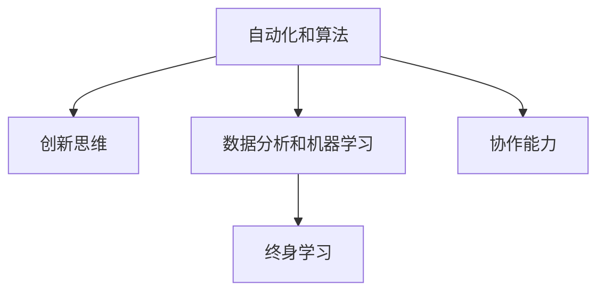

                 

# 未来工作：技能需求与培养

## 1. 背景介绍

### 1.1 问题由来
随着人工智能（AI）技术的飞速发展，工作市场的技能需求也在快速变化。过去依赖体力和记忆力的工作正在被自动化和算法取代，而对创新、分析和协作能力的需求则日益增加。这不仅要求个人具备基本的技术知识，还需要不断更新和学习新的技能，以适应不断变化的工作环境。

### 1.2 问题核心关键点
本文将探讨未来工作中所需的技能，并讨论如何通过系统化培训和自我学习来满足这些需求。主要聚焦于以下几个方面：

- 自动化和算法的普及：哪些传统技能可能被取代，哪些新技能变得重要？
- 教育资源：如何获取并利用这些资源来提升个人技能？
- 学习路径：构建系统化学习路径，帮助个人快速适应新技能。

## 2. 核心概念与联系

### 2.1 核心概念概述

为更好地理解未来工作的技能需求，本节将介绍几个密切相关的核心概念：

- 自动化和算法：指通过计算机程序和算法来自动化执行任务的能力，改变了传统工作方式。
- 创新思维：指在复杂问题中找到新颖解决方案的能力，是未来工作中关键技能之一。
- 数据分析和机器学习：指对数据进行分析和模型训练，以支持决策和优化流程。
- 协作能力：指在不同团队间有效沟通和合作的能力，特别是在多团队协作环境中。
- 终身学习：指个人持续学习和提升自我技能的过程，以适应快速变化的工作市场。

这些概念之间相互关联，共同构成未来工作的技能需求框架。

### 2.2 核心概念原理和架构的 Mermaid 流程图



这个流程图展示了自动化和算法对创新思维、数据分析和机器学习、协作能力以及终身学习的影响。自动化和算法提高了工作效率，促进了数据分析和机器学习的普及，协作能力则需要终身学习来适应。

## 3. 核心算法原理 & 具体操作步骤

### 3.1 算法原理概述

未来工作中所需的技能主要集中在以下几个方面：

1. **自动化和算法技能**：包括编程、算法设计和数据处理。
2. **数据分析和机器学习**：包括统计分析、数据挖掘和模型训练。
3. **创新思维和问题解决**：包括创造性思维、系统思维和批判性思维。
4. **协作能力**：包括团队协作、沟通和领导力。
5. **终身学习**：包括自我管理、学习策略和时间管理。

这些技能通过系统化的培训和自我学习可以逐步掌握。

### 3.2 算法步骤详解

系统化培训和自我学习的步骤主要包括：

1. **需求分析**：明确未来工作中所需的技能。
2. **资源选择**：选择适合的培训资源，包括在线课程、书籍和实践项目。
3. **制定学习计划**：根据个人时间、兴趣和学习目标，制定详细的学习计划。
4. **实施和评估**：按计划学习和实践，并定期评估学习进度和效果。
5. **反馈和调整**：根据评估结果调整学习计划，改进学习方法和资源选择。

### 3.3 算法优缺点

**优点**：
- **系统化**：通过明确的计划和步骤，帮助个人有目的地学习。
- **灵活性**：个人可以根据自身情况和时间调整学习计划。
- **持续性**：终身学习理念强调长期投入，不断提升技能水平。

**缺点**：
- **资源限制**：优质培训资源有限，可能存在获取难度和费用问题。
- **自我管理挑战**：需要高度自我驱动力和自律性，难以坚持长期学习。
- **评估难度**：技能提升的效果难以量化，评估难度大。

### 3.4 算法应用领域

系统化培训和自我学习的方法适用于各种领域，包括但不限于：

- **IT技术**：软件开发、网络安全、人工智能等。
- **商业分析**：数据分析、市场分析、客户关系管理等。
- **教育培训**：教学设计、课程开发、在线教育等。
- **医疗保健**：数据分析、诊断支持、患者管理等。
- **金融服务**：风险管理、客户服务、金融分析等。

这些领域都需要不断学习和更新技能，以适应快速变化的市场需求。

## 4. 数学模型和公式 & 详细讲解

### 4.1 数学模型构建

未来工作的技能需求可以通过数学模型来量化和分析。设 $S$ 为未来工作中所需的技能集，$D$ 为个人当前掌握的技能集。设 $T$ 为学习时间，$C$ 为学习成本。则技能提升的模型可以表示为：

$$
S \rightarrow S + (T, C)
$$

其中 $S$ 为技能集，$T$ 为学习时间，$C$ 为学习成本。目标是通过最小化 $T$ 和 $C$，最大化 $S$。

### 4.2 公式推导过程

通过以上模型，可以推导出技能提升的优化公式：

$$
\min_{T, C} \left( T + C \right) \quad \text{subject to} \quad S \geq S_{\text{target}}
$$

其中 $S_{\text{target}}$ 为目标技能集。该公式表示在时间 $T$ 和成本 $C$ 最小化的前提下，目标技能 $S_{\text{target}}$ 的提升。

### 4.3 案例分析与讲解

以软件开发为例，假设目标技能集为编程语言、算法设计、数据处理等。个人当前技能集为基本的编程知识和一些算法基础知识。假设学习时间为6个月，学习成本为20000元。则通过系统化培训和自我学习，个人可以掌握更多的高级编程技巧和数据处理能力。

## 5. 项目实践：代码实例和详细解释说明

### 5.1 开发环境搭建

进行系统化培训和自我学习，首先需要搭建开发环境。以下是使用Python进行系统化学习的开发环境配置流程：

1. 安装Python和相关库：
```bash
sudo apt-get update
sudo apt-get install python3 python3-pip
pip3 install numpy pandas scikit-learn tensorflow
```

2. 安装Jupyter Notebook：
```bash
pip3 install jupyter notebook
jupyter notebook --pylab inline
```

3. 创建学习计划：
使用日历工具（如Google Calendar）或任务管理工具（如Todoist）来规划学习时间，设置每天和每周的学习任务。

### 5.2 源代码详细实现

以下是一个基于Python的系统化学习计划示例：

```python
# 导入必要的库
import pandas as pd
from datetime import datetime

# 创建一个空的DataFrame来存储学习计划
study_plan = pd.DataFrame(columns=['Date', 'Task', 'Duration', 'Progress'])

# 添加学习任务和进度
now = datetime.now()
study_plan.loc[0] = [now, '学习Python基础', '2小时', '未完成']
study_plan.loc[1] = [now + datetime.timedelta(days=1), '完成Python基础', '2小时', '已完成']
study_plan.loc[2] = [now + datetime.timedelta(days=3), '学习数据分析基础', '3小时', '未完成']
study_plan.loc[3] = [now + datetime.timedelta(days=5), '完成数据分析基础', '3小时', '已完成']
# 添加更多任务和进度...

# 保存学习计划
study_plan.to_csv('study_plan.csv', index=False)
```

### 5.3 代码解读与分析

**study_plan DataFrame**：
- `Date`列：记录任务完成日期。
- `Task`列：记录学习任务。
- `Duration`列：记录任务所需时间。
- `Progress`列：记录任务完成进度，如"未完成"或"已完成"。

通过这种方式，可以系统地记录和管理学习进度，确保按计划进行。

### 5.4 运行结果展示

通过定期查看和更新学习计划，可以清晰地看到学习任务的完成情况和时间进度，确保按计划达成目标。

## 6. 实际应用场景

### 6.1 企业培训

企业可以采用系统化培训和自我学习的方法，提升员工的技能水平，满足企业发展的需要。例如：

- **新员工培训**：为入职员工提供系统化的技能培训课程，帮助他们快速适应工作环境。
- **职业发展计划**：为员工设计长期学习计划，促进职业发展和晋升。
- **技能提升**：定期组织技能提升课程，帮助员工掌握新技术和工具。

### 6.2 个人学习

个人可以通过系统化培训和自我学习，不断提升自我技能，实现职业发展和个人成长。例如：

- **技术转型**：通过学习新的技术栈或工具，实现职业转型。
- **兴趣提升**：利用闲暇时间学习感兴趣的领域，如机器学习、数据分析等。
- **终身学习**：不断更新和提升已有技能，保持市场竞争力。

### 6.3 教育机构

教育机构可以通过系统化培训和自我学习的方法，提升学生的综合素质和就业能力。例如：

- **在线课程**：提供在线学习平台，提供系统化的课程和学习资源。
- **项目导向学习**：通过实际项目，提升学生的实践能力和团队协作能力。
- **跨学科学习**：鼓励学生学习跨学科知识，增强综合能力。

## 7. 工具和资源推荐

### 7.1 学习资源推荐

为帮助开发者系统掌握未来工作所需的技能，以下是一些优质的学习资源：

1. **在线课程平台**：如Coursera、edX、Udacity等，提供系统化的课程和认证。
2. **书籍推荐**：如《Python编程：从入门到实践》、《深度学习》等。
3. **在线学习社区**：如GitHub、Stack Overflow、Reddit等，获取实践经验和技术支持。
4. **专业论坛**：如Kaggle、Data Science Central等，参与实际项目和竞赛。

### 7.2 开发工具推荐

高效的开发离不开优秀的工具支持。以下是几款用于系统化学习和自我提升的常用工具：

1. **Jupyter Notebook**：交互式编程环境，适合学习和实验。
2. **Git**：版本控制工具，方便跟踪代码变更和协作开发。
3. **GitHub**：代码托管平台，便于版本管理和团队协作。
4. **Markdown**：文本编辑器，方便编写和发布学习笔记。
5. **Slack**：团队沟通工具，便于知识共享和协作。

### 7.3 相关论文推荐

未来工作的技能需求研究已经产生了一系列重要成果，以下是几篇奠基性的相关论文，推荐阅读：

1. **《The Future of Work》**：探讨自动化和算法对未来工作的影响。
2. **《Learning and Skilling for the Future of Work》**：系统分析未来工作中所需的技能。
3. **《Lifelong Learning in the Age of AI》**：探讨终身学习在AI时代的意义。

这些论文代表了大规模人工智能对未来工作技能需求的研究方向。通过学习这些前沿成果，可以帮助研究者把握学科前进方向，激发更多的创新灵感。

## 8. 总结：未来发展趋势与挑战

### 8.1 研究成果总结

本文对未来工作的技能需求进行了系统分析，探讨了自动化和算法、数据分析和机器学习、创新思维和问题解决、协作能力和终身学习的重要性。通过系统化培训和自我学习，个人和组织可以不断提升技能，适应快速变化的工作环境。

### 8.2 未来发展趋势

未来工作的技能需求将呈现以下几个发展趋势：

1. **自动化和算法的普及**：更多的传统工作将被自动化和算法取代，创新和数据分析等新技能变得重要。
2. **数据驱动决策**：企业将更依赖数据分析和机器学习来支持决策和优化流程。
3. **跨学科能力**：未来工作将需要跨学科知识和技能，如数据科学、心理学、经济学等。
4. **协作和沟通能力**：多团队协作和沟通能力将更加重要，特别是在复杂项目中。
5. **终身学习**：终身学习和持续技能提升将成为常态，帮助个人保持竞争力。

### 8.3 面临的挑战

尽管未来工作的技能需求呈现积极趋势，但仍面临以下挑战：

1. **技能更新速度**：技术更新快速，个人需要不断学习新技能，才能保持市场竞争力。
2. **学习资源有限**：优质培训资源不足，获取和利用可能存在难度。
3. **自我管理挑战**：需要高度自我驱动力和自律性，难以坚持长期学习。
4. **评估难度**：技能提升的效果难以量化，评估难度大。

### 8.4 研究展望

未来工作的技能需求研究仍需进一步深入，重点方向包括：

1. **个性化学习路径**：根据个人兴趣和职业目标，定制个性化学习路径。
2. **实时学习平台**：开发实时学习平台，提供即时反馈和支持。
3. **跨学科技能整合**：研究跨学科技能整合方法，提升综合能力。
4. **技术与社会融合**：研究技术如何与社会、伦理和道德相结合，确保技术发展的可持续性。

## 9. 附录：常见问题与解答

**Q1：未来工作需要哪些技能？**

A: 未来工作需要自动化和算法、数据分析和机器学习、创新思维和问题解决、协作能力和终身学习等关键技能。

**Q2：如何系统化学习未来工作所需的技能？**

A: 通过需求分析、资源选择、制定学习计划、实施和评估、反馈和调整等步骤，系统化地学习和提升技能。

**Q3：如何评估学习效果？**

A: 通过技能测试、项目实践、反馈和调整等方法，评估学习效果。

**Q4：学习资源有哪些？**

A: 在线课程平台、书籍、在线学习社区、专业论坛等。

**Q5：系统化学习需要哪些工具？**

A: Jupyter Notebook、Git、GitHub、Markdown、Slack等。

---

作者：禅与计算机程序设计艺术 / Zen and the Art of Computer Programming

