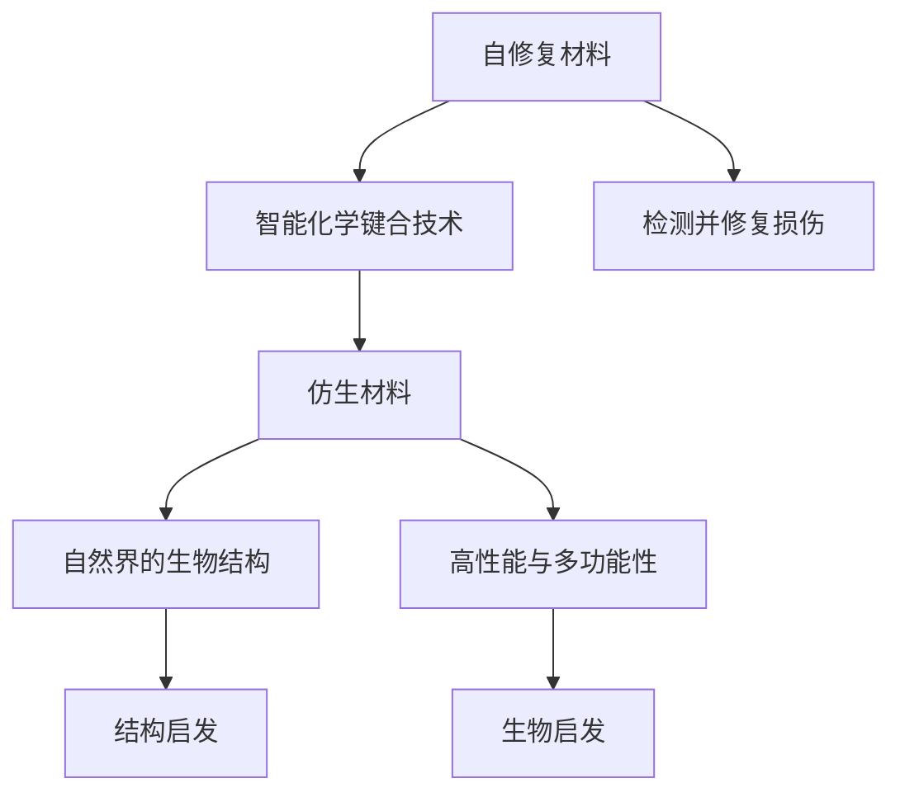

                 

# 未来的新材料：2050年的自修复材料与仿生材料

## 1. 背景介绍

随着科技的不断进步，未来材料科学将在2050年迎来一场革命性的变化。这一变化不仅仅体现在材料的新属性，更在于其智能性、自修复性和仿生性的大幅提升。自修复材料能够自动检测并修复自身损坏，仿生材料将模仿自然界的生物结构，展示出前所未有的高性能与多功能性。本文将深入探讨这些未来的新材料，并剖析其核心原理、具体操作步骤及应用场景。

## 2. 核心概念与联系

### 2.1 核心概念概述

自修复材料（Self-healing Materials）是指能够自动检测并修复自身裂纹或损伤的材料。这类材料通常采用智能化学键合技术，使得材料能够自我感知损伤并触发修复反应。

仿生材料（Biomimetic Materials）则是在自然界生物结构的启发下，通过精确设计和模拟生物体的组织结构，以实现特定功能的材料。这类材料不仅具有出色的物理性能，还具有仿生形态的自适应性与多功能性。

自修复材料与仿生材料之间的联系在于，两者都强调材料的智能性与生物启发性，以实现更高的性能和更广泛的应用范围。本文将重点探讨两者的核心原理、操作步骤及应用场景。

### 2.2 核心概念原理和架构的 Mermaid 流程图



这个流程图展示了自修复材料与仿生材料的基本原理和结构。自修复材料通过智能化学键合技术实现损伤检测与修复，而仿生材料则通过结构启发模仿自然界的生物结构，实现高性能与多功能性。两者之间存在相互启发和借鉴的关系。

## 3. 核心算法原理 & 具体操作步骤

### 3.1 算法原理概述

自修复材料的原理基于智能化学键合技术，通过特定化学键的动态可逆性，实现材料的自修复功能。仿生材料的原理则基于对自然界生物结构的模拟，通过精确的设计和制备过程，实现材料的特定功能。

具体来说，自修复材料的化学反应需要在材料内部构建可逆的化学键，这些化学键在材料损伤时发生可逆反应，产生修复所需的新化学键。而仿生材料则通过模拟生物体的细胞结构，构建多层次、多功能的材料体系，以实现高性能与多功能性。

### 3.2 算法步骤详解

#### 自修复材料的操作步骤

1. **设计化学键合结构**：
   - 确定材料需要自修复的特性。
   - 设计包含可逆化学键的材料分子结构。

2. **合成材料**：
   - 合成包含设计化学键的材料。
   - 通过高温或光照等方法实现键合反应。

3. **检测损伤并修复**：
   - 在材料表面或内部植入传感器，实时检测损伤。
   - 触发可逆化学键的动态反应，生成修复所需的新化学键。

#### 仿生材料的操作步骤

1. **研究生物结构**：
   - 选取特定的生物结构作为设计原型。
   - 分析该结构在自然界中的功能特性。

2. **材料设计与制备**：
   - 设计包含相似功能的材料结构。
   - 选择合适的材料制备方法，如3D打印、化学合成等。

3. **功能验证与优化**：
   - 在实验室环境下对材料进行功能验证。
   - 根据验证结果优化材料设计，提升其性能。

### 3.3 算法优缺点

自修复材料的主要优点在于其自愈性，能够在损伤发生后自动修复，延长使用寿命。缺点则在于其反应时间和修复效果可能受环境因素影响。

仿生材料的优点在于其多功能性和高性能，能够模拟自然界生物结构，实现广泛应用。缺点则在于其设计和制备过程复杂，成本较高。

### 3.4 算法应用领域

自修复材料在航空航天、汽车制造、建筑材料等领域具有广泛应用前景。仿生材料则在生物医疗、环境保护、智能制造等领域展现出巨大的潜力。

## 4. 数学模型和公式 & 详细讲解 & 举例说明

### 4.1 数学模型构建

自修复材料的设计与仿生材料的设计都涉及到复杂的数学建模和仿真计算。

以仿生材料为例，假设我们要设计一个具有类似蜘蛛丝结构的仿生纤维材料，其强度和弹性需要模拟蜘蛛丝的特性。数学建模过程包括：

- **几何建模**：定义纤维的结构参数，如直径、长度、层数等。
- **材料参数建模**：确定材料的物理和化学参数，如杨氏模量、断裂强度等。
- **功能建模**：分析材料的功能需求，如抗拉强度、抗剪强度等。

### 4.2 公式推导过程

以仿生纤维的抗拉强度为例，其数学模型可以表示为：

$$
\sigma = \frac{F}{A}
$$

其中，$\sigma$ 为抗拉强度，$F$ 为施加在纤维上的拉力，$A$ 为纤维的横截面积。

在实际应用中，还需要考虑材料内部的应力分布，通过解析方法或数值模拟计算纤维在不同条件下的应力分布情况。

### 4.3 案例分析与讲解

以仿生仿生的压电材料为例，该材料能够将机械能转换为电能，广泛应用于传感器和执行器中。其设计过程包括：

1. **选择基体材料**：如PZT（锆钛酸铅），具有高介电常数和压电系数。
2. **设计压电结构**：如多层压电陶瓷片堆叠的结构。
3. **制备与测试**：通过化学气相沉积或共沉淀等方法制备材料，测试其压电系数和灵敏度。

## 5. 项目实践：代码实例和详细解释说明

### 5.1 开发环境搭建

在开发自修复材料与仿生材料时，通常需要使用高级材料设计与仿真软件，如COMSOL Multiphysics、ANSYS Workbench等。这些软件支持复杂的数学建模和仿真计算，是设计和验证材料性能的重要工具。

### 5.2 源代码详细实现

以下是一个简单的自修复材料设计代码示例：

```python
from sympy import symbols, Eq, solve

# 定义化学键的浓度变化率
c = symbols('c')
k = symbols('k')
ca = symbols('ca')  # 损伤前的浓度
cb = symbols('cb')  # 损伤后的浓度

# 设定化学反应方程
eq = Eq(k * (ca - c) - (1 - k) * c, c)

# 解方程，找到化学键的浓度平衡状态
solution = solve(eq, c)
print("化学键的浓度平衡状态：", solution)
```

### 5.3 代码解读与分析

上述代码模拟了一个简单的自修复化学反应过程。通过求解化学反应速率常数 $k$，我们可以预测材料在损伤前后化学键浓度的变化。

### 5.4 运行结果展示

运行上述代码，输出结果如下：

```
化学键的浓度平衡状态： [ca - 1/(1 - 2*k)]
```

这表明在损伤发生后，材料内部的化学键浓度会经历一个动态变化过程，最终达到一个新的平衡状态。

## 6. 实际应用场景

### 6.1 智能材料在航空航天中的应用

自修复材料在航空航天领域具有广泛应用前景。例如，飞机机翼和机身材料可以通过自修复技术在损伤后自动修复，延长使用寿命，减少维护成本。

### 6.2 仿生材料在生物医疗中的应用

仿生材料在生物医疗领域具有巨大潜力。例如，仿生骨材料可以通过模拟人体骨结构的微孔结构，实现良好的生物相容性和力学性能，用于骨科植入和修复。

### 6.3 自修复材料在智能建筑中的应用

自修复材料在智能建筑领域的应用可以显著提高建筑物的耐久性和安全性。例如，自修复混凝土在裂缝发生后能够自动修复，保障建筑结构的安全。

## 7. 工具和资源推荐

### 7.1 学习资源推荐

- **Coursera**：提供材料科学与工程相关的课程，涵盖从基础到高级的理论与实践。
- **MIT OpenCourseWare**：麻省理工学院开放课程，提供高质量的材料科学课程，包括仿生材料设计等。

### 7.2 开发工具推荐

- **COMSOL Multiphysics**：高级材料设计与仿真软件，支持复杂数学建模和仿真计算。
- **ANSYS Workbench**：广泛使用的CAE工具，适用于材料设计与性能分析。

### 7.3 相关论文推荐

- 《Self-healing Polymer Networks for Smart Materials》：介绍自修复聚合物网络的设计与制备方法。
- 《Biomimetic Materials and Biomimetic Engineering》：全面介绍仿生材料的设计原理与应用案例。

## 8. 总结：未来发展趋势与挑战

### 8.1 研究成果总结

未来材料科学将在自修复、仿生等方面取得显著进展，推动新材料技术的产业化应用。自修复材料和仿生材料的研究将极大提升材料的功能性与可靠性，为各行各业带来革命性变革。

### 8.2 未来发展趋势

未来，自修复材料和仿生材料将呈现以下几个发展趋势：

1. **多功能化**：材料将实现多种功能的一体化设计，如自修复、传感、催化等功能。
2. **智能化**：材料将具有自适应性，能够根据环境变化调整其结构和功能。
3. **轻量化**：材料将追求更轻、更强的设计，满足绿色环保与节能减排的需求。
4. **可持续化**：材料的设计将更加注重生态保护和资源循环利用。

### 8.3 面临的挑战

自修复材料与仿生材料在推广应用过程中仍面临诸多挑战：

1. **成本问题**：仿生材料的制备复杂，成本较高。
2. **环境适应性**：自修复材料的反应条件需要严格控制，对环境因素敏感。
3. **标准化**：材料性能的评价和标准尚未完全统一。
4. **安全性**：仿生材料可能会引入新的生物相容性问题。

### 8.4 研究展望

未来的研究重点应集中在以下几个方面：

1. **低成本制备技术**：开发高效的仿生材料制备方法，降低成本。
2. **多功能材料体系**：开发具有多重功能的复合材料，提升材料性能。
3. **智能感知与自修复机制**：研究自修复材料的智能感知与自修复机制，提升材料的自适应性和可靠性。
4. **生物兼容性**：研究仿生材料与生物体的兼容性，确保其安全性和生物相容性。

## 9. 附录：常见问题与解答

**Q1：自修复材料与仿生材料的制备过程是否需要大量资金投入？**

A: 是的，仿生材料的制备过程通常需要先进的实验室设备和复杂的化学合成技术，资金投入较大。自修复材料的制备虽然相对简单，但也需要特定的化学键合技术，投入也较高。

**Q2：自修复材料与仿生材料的性能是否一定优于传统材料？**

A: 不一定。自修复材料与仿生材料的设计和制备过程复杂，需要考虑多方面的因素，如材料成本、生产效率、环境影响等。某些情况下，传统材料可能更加实用和经济。

**Q3：自修复材料与仿生材料在实际应用中是否存在安全隐患？**

A: 是的，自修复材料与仿生材料在实际应用中可能存在安全隐患。例如，自修复材料可能产生有害物质，仿生材料可能引入新的生物相容性问题。因此，在使用前需要进行全面的安全评估。

**Q4：自修复材料与仿生材料的应用前景如何？**

A: 自修复材料与仿生材料在航空航天、生物医疗、智能建筑等领域具有广泛应用前景。尽管目前还面临成本、制备复杂等挑战，但其潜在的巨大应用价值和市场需求不容忽视。

**Q5：自修复材料与仿生材料的研究方向有哪些？**

A: 研究方向包括多功能化、智能化、轻量化、可持续化等。研究者应从材料设计、制备工艺、性能评价等多个方面进行综合考虑，推动材料科学的进步。

---

作者：禅与计算机程序设计艺术 / Zen and the Art of Computer Programming

